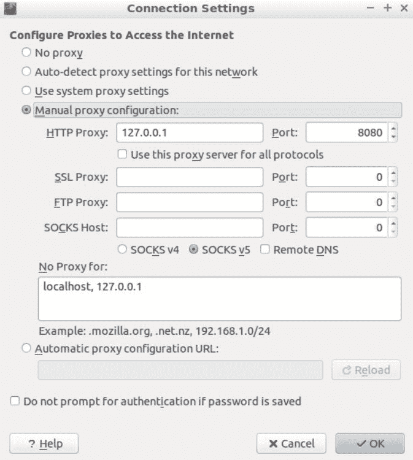

# 拦截 HTTP 请求

在本章中，我们将学习关于 HTTP 代理以及如何拦截和操纵 HTTP 请求。我们将看：

+   HTTP 代理解剖

+   mitmproxy 简介

+   操纵 HTTP 请求

+   在 mitmproxy 中自动化 SQLi

# HTTP 代理解剖

在本节中，我们将学习什么是 HTTP 代理，为什么需要和使用代理，以及存在哪些类型的 HTTP 代理。

# 什么是 HTTP 代理？

HTTP 代理是一个充当两个通信方之间中介的服务器。客户端和服务器之间没有直接通信。相反，客户端连接到代理并向其发送请求。然后代理将从远程服务器获取资源，最后将响应返回给客户端：


# 我们为什么需要代理？

我们需要代理的原因如下：

+   隐私：当我们不希望服务知道我们来自哪里或者我们是谁时。

+   绕过过滤和审查：在互联网审查普遍且服务被屏蔽的国家，代理可以帮助我们绕过这种屏蔽。

+   记录和窃听：许多公司实施代理以记录员工浏览的内容并窃听他们的通信。

+   缓存：利用缓存的公司使用代理来缓存内容并加快通信速度。

+   过滤和阻止：公司可能直接想要阻止和限制员工可以访问的服务。

+   操纵和修改流量：作为安全测试人员，我们对拦截浏览器和 Web 应用程序之间的通信感兴趣，以便分析和操纵请求和响应，以识别漏洞并调试问题。

# HTTP 代理类型

当涉及到 HTTP 代理时，我们应该做出一些不同的区分：

+   转发代理：这是代理的最常见例子。这是我们在解释代理是什么时使用的例子。转发代理是客户端向代理发送请求，代理代表他们获取资源。在这种情况下，用户选择或被迫在公司使用代理。用户知道正在使用代理，但服务器不知道：


+   反向代理：这些是公司用来隐藏在网络架构后面或者在需要在真实服务器之间分发负载时使用的代理。用户认为他们正在连接到真实服务器，但实际上他们正在连接到一个将处理请求的代理：


+   透明代理：这些在网络层拦截正常通信而无需在客户端进行任何配置。通常，客户端不知道他们在使用透明代理。透明代理通常不修改请求和响应。它们通常被 ISP 用来为客户提供更快的响应。代理充当路由器或网关：


# mitmproxy 简介

在本节中，我们将看看为什么要使用 mitmproxy，如何在 mitmproxy 中使用基本的 HTTP 代理功能，以及对 mitmproxy 内联脚本的简要介绍。

# 为什么使用 mitmproxy？

Mitmproxy 是一个交互式控制台程序，允许拦截、检查、修改和重放流量。在研究了这一部分之后，我决定学习 Python 中关于 HTTP 代理的最简单和最完整的方法是使用 mitmproxy。任何其他尝试都比 mitmproxy 更复杂和有限。

Mitmproxy 是用 Python 开发的，允许用户通过内联脚本来扩展它。它支持 SSL，不像其他只支持 HTTP 的替代方案。

让我们看看 mitmproxy 如何使用一个简单的例子。如果我们去终端并输入`mitmproxy`，我们会得到一个监听端口`8080`的 mitmproxy 控制台：


如果我们更改浏览器设置以便使用代理进行 HTTP 连接，并发出一个请求，比如[`www.edge-security.com/`](http://www.edge-security.com/)，我们将在控制台中看到所有的请求。

让我们点击浏览器右侧的打开菜单图标，然后进入首选项 | 高级 | 网络 | 连接 | 设置... | 手动代理配置。将 HTTP 代理设置为`127.0.0.1`，端口设置为`8080`，然后点击确定：



现在让我们在浏览器中加载[`www.edge-security.com/`](http://www.edge-security.com/)；你可以在控制台中看到请求历史记录：


现在，如果你选择一个请求并按*Enter*，你将看到该请求的详细信息，响应，标头和连接详情。如果你想编辑请求，按*E*。完成后，你可以按*R*发送它。这是 mitmproxy 的基本用法。

我鼓励你去了解 mitmproxy 的所有功能，网址是[`mitmproxy.org/`](https://mitmproxy.org/)。它有非常好的文档。有多个示例，你会找到所有必要的信息。

只是为了提醒你代理是如何工作的，在这种特殊情况下，我已经设置了我的浏览器连接到本地端口`8080`上的 mitmproxy。浏览器和代理在同一台机器上：


Mitmproxy 有一个强大的脚本 API，可以让我们在请求过程中访问并操纵它们：


mitm 脚本 API 是事件驱动的，其脚本只是一个暴露一组事件方法的 Python 模块。

我们可以在截图中看到一个简单的内联脚本的例子，它将在返回给客户端之前为每个 HTTP 响应添加一个新的标头。这就是脚本所需的所有代码。在下一节中，我们将学习如何编写一个脚本来操纵 mitmproxy 中的请求。

# 操纵 HTTP 请求

在这一部分，我们将学习更多关于内联脚本的知识，并且我们将看到一个拦截请求并访问请求不同部分的例子。

# 内联脚本

在前一部分，我们定义了一个简单的内联脚本，以便访问请求的响应。通信的其他部分，mitmproxy，让我们通过处理程序访问响应：

+   `start`: 当脚本启动后，但在任何其他事件之前调用

+   `clientconnect` : 当客户端启动与代理的连接时调用

一个连接可以对应多个 HTTP 请求。

+   `request`: 当客户端请求被接收时调用

+   `serverconnect` : 当代理启动与目标服务器的连接时调用

+   `responseheaders`: 当服务器响应的`responseheaders`被接收到，但响应主体尚未被处理时调用

+   `response`: 当服务器响应被接收时调用

+   `error`: 当发生流错误时调用

+   `clientdisconnect`: 当客户端从代理断开连接时调用

+   `done`: 在所有其他事件之后，脚本关闭时调用

现在我们知道了有哪些处理程序可供我们使用，让我们看一个访问请求的例子。

让我们在编辑器中打开`Section-7`源代码中的`mitm-0.py`脚本。这个脚本基本上会记录代理从客户端接收到的每个请求。

我们可以看到这个脚本非常简单：

```py
import sys

def request(context, flow):
  f = open('httplogs.txt', 'a+')
  f.write(flow.request.url + '\n') 
  f.close()
```

我们有`request`的处理程序，第一个参数是`context`，第二个是`flow`。`flow`，顾名思义，包含了通信的所有信息。在函数中，我们打开`httplogs.txt`文件，然后写入`flow.request.url`，这是客户端请求的 URL，最后关闭`f`文件。

让我们回到`Section-7`目录中的终端。键入`mitmproxy -s mitm-0.py`，mitmproxy 控制台将出现。然后，我们将打开我们的浏览器并更改代理配置，使其指向本地主机`8080`。单击浏览器右侧的打开菜单图标，转到首选项|高级|网络|连接|设置...|手动代理配置。将端口设置为`8080`。从“不代理”中删除`localhost`和`127.0.0.1`：


让我们在浏览器中加载`www.scruffybank.com`。您可以在控制台中看到所有请求：


让我们关闭控制台并查看`httplogs.txt`文件。我们可以用编辑器打开它。我们可以看到会话中请求的所有 URL：


干得好！

现在，让我们添加一个过滤器以记录唯一的 URL，以避免存储重复的 URL。在编辑器中打开`mitm-1.py`文件。为了防止重复，让我们在脚本中创建一个名为`history`的全局变量；然后，在函数中，我们只需检查 URL 是否不在历史记录中：

```py
import sys

global history 
history = [] 

def request(context, flow):
  global history
  url = flow.request.url
  if url not in history:
    f = open('httplogs.txt', 'a+')
    f.write(flow.request.url + '\n') 
    f.close()
    history.append(url)
  else:
    pass
```

如果不存在，我们将其记录下来，然后将其添加到`history`中。让我们再试一次，看看是否有效。首先，我们可以通过右键单击`httplogs.txt`文件并选择“删除”选项来删除它。运行`mitmproxy -s mitm-1.py`。

让我们回到浏览器，打开`www.scruffybank.com/login.php`并刷新几次。关闭代理控制台，然后再次打开结果：


太好了！没有重复。

现在我们知道如何访问请求，让我们看看如何向每个请求添加查询字符串参数。您可能会问为什么。好吧，我们需要在请求中添加某些参数，以便访问某些信息。

让我们在编辑器中打开`mitm-2.py`。现在，我们正在使用`flow.request.get_query()`获取查询字符串，然后我们正在检查查询字符串是否有一些内容：

```py
import sys

def request(context, flow):
  q = flow.request.get_query()
  if q:
    q["isadmin"] = ["True"]
    flow.request.set_query(q)
```

如果有内容，我们将添加一个名为`isadmin`的新参数，其值为`True`。最后，我们使用`flow.request.set_query(q)`更新请求查询字符串。

让我们在命令行中尝试一下。键入`mitmproxy -s mitm-2.py`启动`mitm-2.py`。在浏览器中，单击具有参数的“了解更多”链接。

在 mitmproxy 控制台中，您可以看到 mitmproxy 正在添加带有`True`值的`isadmin`查询字符串参数：


在这种情况下，它不会做任何事情，但这是下一节的热身，我们将学习如何做一些更复杂的事情，比如测试代理中看到的每个参数的 SQLi。

# 在 mitmproxy 中自动化 SQLi

在本节中，我们将学习如何在 mitmproxy 中自动化 SQL 注入的测试用例，创建一个我们使用的内联脚本，请求处理程序以及我们在前几节中学到的一些东西。

# SQLi 过程

本节的目标是为 mitmproxy 创建一个内联脚本，这将允许我们在具有参数的每个 URL 中测试 SQL 注入：


因此，对于每个具有参数的 URL，我们需要将每个参数值替换为 FUZZ，同时保留其他参数值。我们这样做，而不是一次替换所有值为 FUZZ。然后，我们将每个 URL 中的 FUZZ 字符串替换为`injections`数组中的每个值。

然后，我们执行请求，将结果内容与`errors`数组中的 MySQL 错误进行匹配。让我们看看代码。让我们转到编辑器并打开`mitm-3.py`文件。我们有一些新的导入：

```py
import urlparse
from copy import deepcopy
import requests
import sys

def injector (url):
  errors = ['Mysql','error in your SQL']
  injections = ['\'','\"',';--']
  f = open('sqlinjection_results.txt','a+')
  a = urlparse.urlparse(url)
  query = a.query.split('&')
  qlen = len(query)
  while qlen != 0:
    querys = deepcopy(query)
    querys[qlen-1] = querys[qlen-1].split('=')[0] + '=FUZZ' 
    newq='&'.join(querys) 
    url_to_test = a.scheme+'://'+a.netloc+a.path+'?'+newq
    qlen-=1
    for inj in injections:
                  req=requests.get(url_to_test.replace('FUZZ',inj))
      print req.content
            for err in errors:
                          if req.content.find(err) != -1:
                                        res = req.url + ";" + err 
                                  f.write(res) 
  f.close()

def request(context, flow):
  q = flow.request.get_query()
  print q
  if q: 
    injector(flow.request.url)
    flow.request.set_query(q)
```

`copy`从`deepcopy`中复制，我们需要从前面的代码中复制对象和`urlparse`，它将帮助解析 URL。

然后我们有`request`处理程序函数。每当有一个`query`字符串时，它将调用`injector`函数。`injector`函数具有`errors`数组和`injections`数组，类似于我们在 SQLi 脚本中使用的数组。然后，我们打开一个文件来记录结果，并使用`urlparse`来获取`query`字符串。

我们需要用`&`分割它，并获取参数的长度。一旦我们知道长度，我们就会进行`while`循环。对于每次迭代，我们将对对象`query`进行`deepcopy`，以保留原始对象并在新副本中工作。然后我们用`FUZZ`字符串替换`qlen-1`参数的值。

在`url_to_test`中，我们重建 URL。然后，我们循环进行注入，并用注入字符串替换`FUZZ`。最后，我们检查结果内容和`errors`数组中的内容。如果匹配，我们写入日志，就这样。我们在 mitmproxy 中包含了基本的 SQL 注入功能。

让我们去终端，运行`mitmproxy -s mitm-3.py`，然后在应用程序中浏览。最后，转到`www.scruffybank.com/users.php`。我们知道这个页面在之前的练习中容易受到 SQLi 攻击，例如，通过在用户 ID 中输入`1`，这对于演示来说应该足够了。关闭 mitmproxy 并在编辑器中检查`sqlinjection_results.txt`文件日志。


太好了，我们可以看到哪个 URL 容易受到 SQLi 攻击。我们可以看到带有生成错误的注入的参数。从这一点上，您可以继续使用我们之前创建的 SQL 注入器脚本。现在您有了一个基础，可以构建自己的脚本来满足您的需求并测试自定义场景。

# 摘要

我们已经看到了 mitmproxy 的工作原理，并学会了创建内联脚本来扩展代理并操纵通信。我们已经学会了在 HTTP 代理中添加漏洞扫描器功能，以帮助我们进行 Web 应用程序渗透测试。

我们为您提供了基本的知识和技能，以帮助您在未来创建自己的定制工具。如果您正在作为渗透测试人员开始您的旅程，这将为您打下坚实的基础，以便为每种情况构建自定义工具，并允许您修改和扩展现有工具。

现在您已经了解了基础知识，可以继续您的学习之旅，提高您的技能并付诸实践。为了做到这一点，我推荐以下资源：

+   OWASP WebGoat ([`www.owasp.org/index.php/Category:OWASP_WebGoat_Project`](https://www.owasp.org/index.php/Category:OWASP_WebGoat_Project))。这是一个以 VM 形式提供的培训课程。该培训课程侧重于 OWASP 前 10 名漏洞。

+   Pentester Lab ([`www.pentesterlab.com/`](https://www.pentesterlab.com/))提供了可以用来测试和理解漏洞的易受攻击的应用程序。此外，您还可以在项目中找到其他易受攻击的应用程序来测试您的技能。

+   OWASP-WADP ([`www.owasp.org/index.php/OWASP_Vulnerable_Web_Applications_Directory_Project`](https://www.owasp.org/index.php/OWASP_Vulnerable_Web_Applications_Directory_Project))，一个提供接近现实环境的易受攻击应用程序的集合。

就是这样。非常感谢您选择这本书，希望您喜欢用 Python 学习 Web 应用程序测试。
