# 渗透测试中的机器学习简介

目前，机器学习技术是信息技术中最热门的趋势之一。它们影响着我们生活的方方面面，影响着每个行业和领域。机器学习是信息安全专业人员的网络武器。在本书中，读者不仅将探索机器学习技术背后的基本原理，还将学习构建完全功能的机器学习安全系统的秘诀。我们不仅会停留在构建防御层，还将说明如何构建攻击和绕过安全防御的攻击工具。通过本书，您将能够绕过机器学习安全系统，并在渗透测试任务中使用构建的模型。

在本章中，我们将涵盖：

+   机器学习模型和算法

+   性能评估指标

+   降维

+   集成学习

+   机器学习开发环境和 Python 库

+   渗透测试中的机器学习-承诺和挑战

# 技术要求

在这一章中，我们将建立一个开发环境。因此，我们将安装以下 Python 机器学习库：

+   NumPy

+   SciPy

+   TensorFlow

+   Keras

+   pandas

+   MatplotLib

+   scikit-learn

+   NLTK

+   Theano

您还可以在此 GitHub 存储库中找到本书中使用的所有脚本和安装指南：[`github.com/PacktPublishing/Mastering-Machine-Learning-for-Penetration-Testing/tree/master/Chapter01`](https://github.com/PacktPublishing/Mastering-Machine-Learning-for-Penetration-Testing/tree/master/Chapter01)。

# 人工智能和机器学习

让机器像人一样思考是最古老的梦想之一。机器学习技术用于基于经验和数据进行预测。

# 机器学习模型和算法

为了教会机器如何自己解决大量问题，我们需要考虑不同的机器学习模型。正如您所知，我们需要向模型提供数据；这就是为什么机器学习模型根据输入的数据集被分为四个主要类别：监督学习、半监督学习、无监督学习和强化学习。在本节中，我们将详细描述每个模型，以及探索每个机器学习模型中使用的最知名的算法。在构建机器学习系统之前，我们需要了解表面下的工作原理。

# 监督

当我们既有输入变量又有输出变量时，我们谈论监督机器学习。在这种情况下，我们需要映射两方之间的函数（或模式）。以下是一些最常用的监督机器学习算法。

# 贝叶斯分类器

根据*剑桥英语词典*的定义，偏见是以不公平的方式支持或反对特定的人或事物，允许个人意见影响您的判断。贝叶斯机器学习是指先前的信念，并通过使用数据进行更新。在数学上，它基于贝叶斯公式：


最简单的贝叶斯问题之一是随机抛硬币并尝试预测输出是正面还是反面。这就是为什么我们可以将贝叶斯方法论识别为概率的原因。当您使用少量数据时，朴素贝叶斯非常有用。

# 支持向量机

**支持向量机**（**SVM**）是一种监督机器学习模型，通过在表示的数据之间识别一个超平面来工作。数据可以在多维空间中表示。因此，SVM 广泛用于分类模型。在 SVM 中，将使用最佳分离不同类别的超平面。在某些情况下，当我们有不同的超平面分离不同的类别时，将通过称为**间隔**或**间隙**的东西执行正确的超平面的识别。间隔是超平面和数据位置之间的最近距离。您可以查看以下表示以检查间隔：

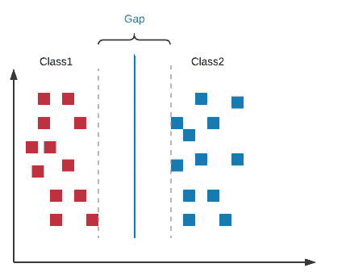

将选择具有最大间隙的超平面。如果选择具有最短间隔的超平面，我们可能会在以后面临错误分类问题。不要被前面的图形分散注意力；超平面并不总是线性的。考虑以下情况：

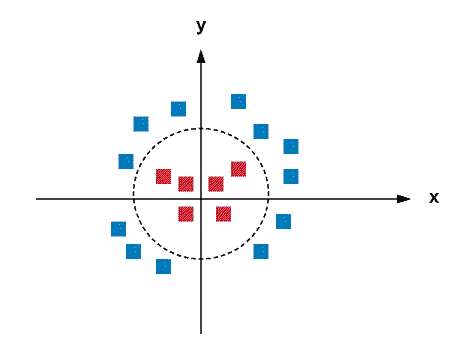

在前面的情况下，我们可以添加一个新的轴，称为*z*轴，并使用一个称为核函数的核技巧应用变换，其中`z=x²+y²`。如果应用变换，新图将如下所示：


现在，我们可以确定正确的超平面。这个转换被称为**核**。在现实世界中，找到一个超平面是非常困难的。因此，称为正则化和伽玛的两个重要参数在确定正确的超平面以及在每个 SVM 分类器中获得非线性超平面情况下的更好准确性方面起着巨大作用。

# 决策树

决策树是监督学习算法，通过将数据表示为树，根在顶部，用于决策制定。以下是决策树的图形表示：


数据是通过迭代二分 3 算法表示的。用于分类和回归问题的决策树称为 CARTs。它们由 Leo Breiman 引入。

# 半监督

半监督学习是在前面讨论的两个模型之间的一个领域。换句话说，如果您使用少量标记数据以及未标记数据的情况，那么您正在执行半监督学习。半监督学习广泛应用于现实世界的应用，如语音分析，蛋白质序列分类和网页内容分类。有许多半监督方法，包括生成模型，低密度分离和基于图的方法（离散马尔可夫随机场，流形正则化和最小割）。

# 无监督

在无监督学习中，我们对模型的输出没有明确的信息。以下是一些众所周知的无监督机器学习算法。

# 人工神经网络

人工网络是人工智能中一些最热门的应用，特别是机器学习。人工神经网络的主要目标是构建可以像人类大脑一样学习的模型；换句话说，我们试图模仿人类大脑。这就是为什么为了学习如何构建神经网络系统，我们需要清楚地了解人类大脑实际上是如何工作的。人类大脑是一个令人惊奇的实体。大脑由神经元组成和连接。神经元负责传输和处理信息。

我们都知道人类大脑可以执行很多任务，如听觉、视觉、味觉和许多其他复杂的任务。因此，从逻辑上讲，人们可能会认为大脑由许多不同的区域组成，每个区域负责特定的任务，都归功于特定的算法。但这是完全错误的。根据研究，人类大脑的所有不同部分都是由一个算法而不是不同的算法来实现功能的。这个假设被称为**一个算法假设**。

现在我们知道大脑是通过使用一个算法工作的。但是这个算法是什么？它是如何使用的？信息是如何用它处理的？

为了回答前面的问题，我们需要看一下神经元的逻辑表示。人工神经元的人工表示称为**感知器**。感知器由以下图表示：


有许多使用的**激活函数**。你可以把它们看作是逻辑门：

+   **阶跃函数**：预定义的阈值。

+   **Sigmoid 函数**：


+   **Tanh 函数**：


+   **ReLu 函数**：


许多全连接的感知器组成了我们所谓的**多层感知器**（**MLP**）网络。典型的神经网络包括以下内容：

+   一个输入层

+   隐藏层

+   输出层

一旦我们有了三个以上的隐藏层，我们将讨论术语**深度学习**。世界上使用许多类型的深度学习网络：

+   **卷积神经网络**（**CNNs**）

+   **递归神经网络**（**RNNs**）

+   **长短期记忆**（**LSTM**）

+   浅层神经网络

+   **自动编码器**（**AEs**）

+   受限玻尔兹曼机

不要担心；我们将在未来的章节中详细讨论前述算法。

为了构建深度学习模型，我们遵循由 Dr. Jason Brownlee 建议的五个步骤。这五个步骤如下：

1.  网络定义

1.  网络编译

1.  网络拟合

1.  网络评估

1.  预测

# 线性回归

线性回归是一种统计和机器学习技术。它被广泛用于理解输入和输出之间的关系。当我们有数值数值时，我们使用线性回归。

# 逻辑回归

逻辑回归也是一种统计和机器学习技术，用作二元分类器 - 换句话说，当输出是类别（是/否，真/假，0/1 等）时。

# 使用 k 均值进行聚类

**k-最近邻**（**kNN**）是一种著名的聚类方法。它基于在数据点中找到相似性，或者我们称之为特征相似性。因此，这个算法很简单，并且被广泛用于解决许多分类问题，比如推荐系统、异常检测、信用评级等。然而，它需要大量的内存。虽然它是一个监督学习模型，但它应该由标记数据提供，并且输出是已知的。我们只需要映射关联两方的函数。kNN 算法是非参数的。数据被表示为特征向量。你可以把它看作是一个数学表示：


分类就像投票一样；要知道所选数据的类别，必须首先计算所选项与其他训练项之间的距离。但是我们如何计算这些距离呢？

通常，我们有两种主要的计算方法。我们可以使用欧几里得距离：


或者，我们可以使用余弦相似度：


第二步是选择*k*个最近的距离（*k*可以任意选择）。最后，我们根据置信水平进行投票。换句话说，数据将被分配给具有最大概率的类别。

# 强化

在强化机器学习模型中，代理与其环境互动，因此它通过在过程中收集数据来从经验中学习；目标是优化我们所谓的长期**奖励**。你可以把它看作是一个带有评分系统的游戏。以下图表说明了一个强化模型：


# 性能评估

评估是每个方法操作中的关键步骤。在构建产品或系统，尤其是机器学习模型之后，我们需要清晰地了解其性能，以确保它将来能够按预期运行。为了评估机器学习的性能，我们需要使用明确定义的参数和见解。为了计算不同的评估指标，我们需要使用四个重要的参数：

+   真阳性

+   假阳性

+   真阴性

+   假阴性

前述参数的符号如下：

+   *tp*：真阳性

+   *fp*：假阳性

+   *tn*：真阴性

+   *fn*：假阴性

有许多机器学习评估指标，例如以下内容：

+   **精度**：精度，或者叫做阳性预测值，是指被正确分类的阳性样本数量与总体被分类为阳性的样本数量的比值：


+   **召回率**：召回率，或者真阳性率，是指真阳性分类的比率除以数据集中的阳性样本总数：


+   **F-分数**：F-分数，或者 F-度量，是将精度和召回率结合在一个谐波公式中的度量。


+   **准确度**：准确度是指总体被正确分类的样本数量与总体样本数量的比值。这个度量本身是不够的，因为它在我们有相等数量的类时使用。

+   **混淆矩阵**：混淆矩阵是对给定机器学习模型性能的图形化表示。它总结了分类问题中每个类的性能。

# 降维

降维用于减少数据集的维度。在变量数量增加时，这对于处理问题变得困难时非常有帮助。通过使用“维度”，我们指的是特征。基本的降维技术之一是特征工程。

通常，我们有许多降维算法：

+   **低方差过滤器**：删除与其他变量相比方差较低的变量。

+   **高相关性过滤器**：通过使用 Pearson 或 Polychoric 识别具有高相关性的变量，并使用**方差膨胀因子**（**VIF**）选择其中之一。

+   **向后特征消除**：通过在消除每个变量*n*次后计算**平方误差和**（**SSE**）来实现。

+   **线性判别分析**（**LDA**）：这将维度的数量*n*从原始数量减少到类别数量-1 的特征数量。

+   **主成分分析**（**PCA**）：这是一种将变量转换为新变量（主成分）的统计过程。

# 通过集成学习改善分类

在许多情况下，当构建机器学习模型时，我们会得到低准确度和低结果。为了获得良好的结果，我们可以使用集成学习技术。这可以通过将许多机器学习技术组合成一个预测模型来实现。

我们可以将集成学习技术分为两类：

+   **并行集成方法**—以下图表说明了并行集成学习的工作原理：

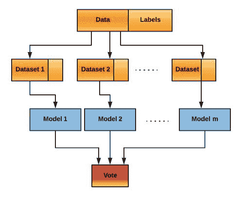

+   **顺序集成方法**—以下图表说明了顺序集成学习的工作原理：


以下是三种最常用的集成学习技术：

+   **自助聚合**（**bagging**）：这涉及构建单独的模型，并通过使用模型平均技术（如加权平均和多数投票）将它们组合起来。

+   **提升**：这是一种顺序集成学习技术。梯度提升是最常用的提升技术之一。

+   **堆叠**：这类似于提升，但它使用新模型来组合子模型。

# 机器学习开发环境和 Python 库

到目前为止，我们已经了解了最常用的机器学习算法背后的基本知识。从这一部分开始，我们将更深入地学习，通过实践构建基于机器学习的安全项目。我们不会止步于此；在接下来的章节中，我们将学习恶意攻击者如何绕过智能安全系统。现在，让我们把到目前为止学到的东西付诸实践。如果您正在阅读本书，您可能对 Python 有一些经验。这对您很有好处，因为您有一个学习如何构建机器学习安全系统的基础。

我敢打赌您正在想，为什么选择 Python？这是一个很好的问题。根据最新研究，Python 是数据科学中最常用的编程语言之一，尤其是机器学习。最知名的机器学习库是为 Python 编写的。让我们发现构建机器学习模型所需的 Python 库和实用程序。

# NumPy

数值 Python 库是数学和数组逻辑操作中最常用的库之一。它加载了许多线性代数功能，在机器学习中非常有用。当然，它是开源的，并受到许多操作系统的支持。

要安装 NumPy，请使用`pip`实用程序，输入以下命令：

```py
#pip install numpy
```

现在，您可以通过导入它来开始使用它。以下脚本是一个简单的数组打印示例：

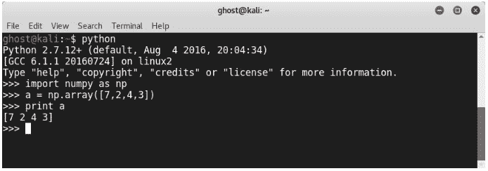

此外，您可以使用许多数学函数，如`cosine`，`sine`等。

# SciPy

科学 Python（SciPy）就像 NumPy 一样，是一个令人惊叹的 Python 包，加载了大量科学函数和实用程序。有关更多详细信息，您可以访问[`www.scipy.org/getting-started.html`](https://www.scipy.org/getting-started.html)：


# TensorFlow

如果您已经从事机器学习一段时间，您将听说过 TensorFlow，甚至使用它构建了机器学习模型或为人工神经网络提供数据。这是一个令人惊叹的开源项目，基本上由 Google 开发和支持：


以下是 TensorFlow 的主要架构，根据官方网站：


如果这是您第一次使用 TensorFlow，强烈建议访问项目的官方网站[`www.tensorflow.org/get_started/`](https://www.tensorflow.org/get_started/)。让我们在我们的机器上安装它，并发现一些其功能。有许多安装它的可能性；您可以使用本机 PIP、Docker、Anaconda 或 Virtualenv。

假设我们要在 Ubuntu 机器上安装它（它也支持其他操作系统）。首先，使用`python --version`命令检查您的 Python 版本：


使用以下命令安装 PIP 和 Virtualenv：

```py
sudo apt-get install python-pip python-dev python-virtualenv
```


现在，包已安装：

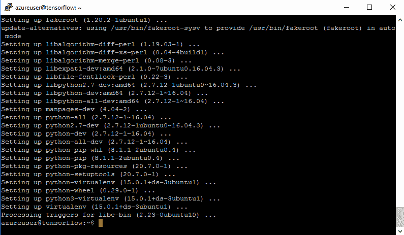

使用`mkdir`命令创建一个新的存储库：

```py
#mkdir TF-project
```

通过输入以下命令创建一个新的 Virtualenv：

```py
 virtualenv --system-site-packages TF-project
```


然后，键入以下命令：

```py
source  <Directory_Here>/bin/activate
```

通过使用`pip install -upgrade tensorflow`命令升级 TensorFlow：

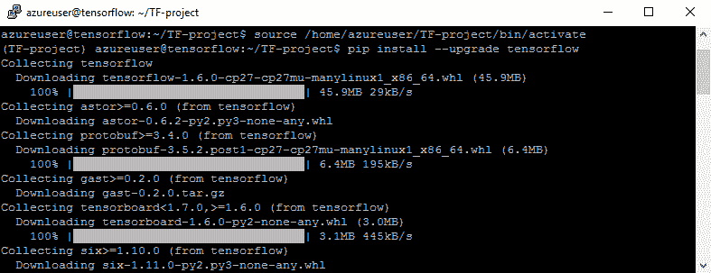

```py
>>> import tensorflow as tf
>>> Message = tf.constant("Hello, world!")
>>> sess = tf.Session()
>>> print(sess.run(Message))
```

以下是显示`Hello World!`消息的完整步骤：


# Keras

Keras 是一个广泛使用的 Python 库，用于构建深度学习模型。这很容易，因为它是建立在 TensorFlow 之上的。构建深度学习模型的最佳方法是遵循先前讨论的步骤：

1.  加载数据

1.  定义模型

1.  编译模型

1.  拟合

1.  评估

1.  预测

在构建模型之前，请确保已预配置 SciPy 和 NumPy。要检查，请打开 Python 命令行界面并键入，例如，以下命令以检查 NumPy 版本：

```py
 >>>print numpy.__version__
```

要安装 Keras，只需使用 PIP 实用程序：

```py
$ pip install keras
```


当然，要检查版本，请键入以下命令：

```py
>>> print keras.__version__
```

要从 Keras 导入，请使用以下命令：

```py
from keras import [what_to_use]
from keras.models import Sequential
from keras.layers import Dense
```

现在，我们需要加载数据：

```py
dataset = numpy.loadtxt("DATASET_HERE", delimiter=",")
I = dataset[:,0:8]
O = dataset[:,8]  
#the data is splitted into Inputs (I) and Outputs (O)
```

您可以使用任何公开可用的数据集。接下来，我们需要创建模型：

```py
model = Sequential()
# N = number of neurons
# V = number of variable
model.add(Dense(N, input_dim=V, activation='relu'))
# S = number of neurons in the 2nd layer
model.add(Dense(S, activation='relu'))
model.add(Dense(1, activation='sigmoid')) # 1 output
```

现在，我们需要编译模型：

```py
model.compile(loss='binary_crossentropy', optimizer='adam', metrics=['accuracy'])
```

我们需要拟合模型：

```py
model.fit(I, O, epochs=E, batch_size=B)
```

如前所述，评估是机器学习中的关键步骤；因此，为了评估我们的模型，我们使用：

```py
scores = model.evaluate(I, O)
print("\n%s: %.2f%%" % (model.metrics_names[1], scores[1]*100))
```

要进行预测，请添加以下一行：

```py
predictions = model.predict(Some_Input_Here)
```

# pandas

pandas 是一个开源的 Python 库，以其高性能而闻名；它是由 Wes McKinney 开发的。它可以快速操作数据。这就是为什么它在学术界和商业活动的许多领域被广泛使用。与之前的包一样，它受到许多操作系统的支持。

要在 Ubuntu 机器上安装它，请输入以下命令：

```py
sudo apt-get install python-pandas
```

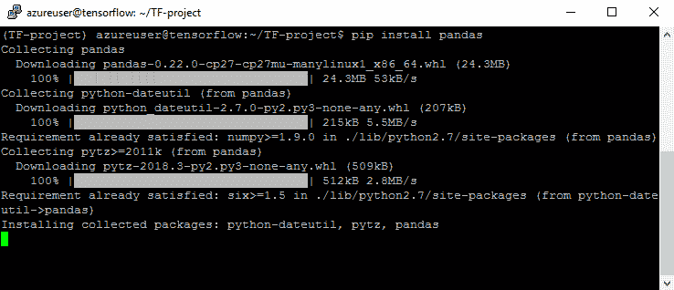

基本上，它操作三种主要数据结构-数据框、系列和面板：

```py
>> import pandas as pd
>>>import numpy as np
 data = np.array(['p','a','c','k',’t’])
 SR = pd.Series(data)
 print SR
```

我在这个截图中总结了所有之前的行：

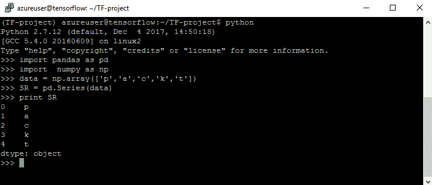

# Matplotlib

如您所知，可视化在从数据中获得洞察力方面起着重要作用，也在机器学习中非常重要。Matplotlib 是数据科学家用于绘图的可视化库。您可以通过访问其官方网站[`matplotlib.org`](https://matplotlib.org)来更清楚地了解：


要在 Ubuntu 机器上安装它，请使用以下命令：

```py
sudo apt-get install python3-matplotlib
```

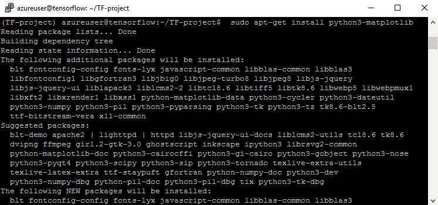

要导入所需的包，请使用`import`：

```py
import matplotlib.pyplot as plt
import numpy as np
```

使用此示例准备数据：

```py
x = np.linspace(0, 20, 50)
```

要绘制它，请添加这一行：

```py
plt.plot(x, x, label='linear')
```

要添加图例，请使用以下命令：

```py
plt.legend()
```

现在，让我们显示图表：

```py
plt.show()
```

看吧！这是我们的图表：


# scikit-learn

我强烈推荐这个令人惊叹的 Python 库。scikit-learn 功能齐全，具有各种功能，包括机器学习功能。scikit-learn 的官方网站是[`scikit-learn.org/`](http://scikit-learn.org/)。要下载它，请使用之前讨论过的 PIP：

```py
pip install -U scikit-learn 
```


# NLTK

自然语言处理是机器学习项目中最常用的应用之一。NLTK 是一个 Python 包，可以帮助开发人员和数据科学家管理和操作大量文本。可以使用以下命令安装 NLTK：

```py
pip install -U nltk
```


现在，导入`nltk`：

```py
>>> import nltk
```

使用以下命令安装`nltk`包：

```py
> nltk.download()
```


您可以安装所有的包：


如果您正在使用命令行环境，您只需要按照以下步骤进行：

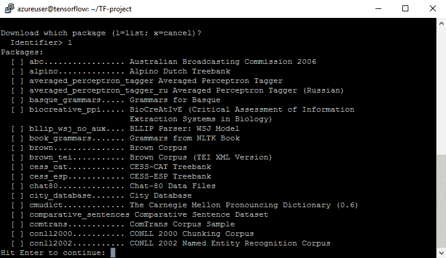

如果您键入`all`，您将下载所有的包：


# Theano

优化和速度是构建机器学习模型的两个关键因素。Theano 是一个 Python 包，优化实现并使您能够利用 GPU。要安装它，请使用以下命令：

```py
 pip install theano
```


要导入所有 Theano 模块，请键入：

```py
>>> from theano import *
```

在这里，我们导入了一个名为`tensor`的子包：

```py
>>> import theano.tensor as T
```

假设我们想要添加两个数字：

```py
>>> from theano import function
>>> a = T.dscalar('a')
>>> b = T.dscalar('b')
>>> c = a + b
>>> f = function([a, b], c)
```

以下是完整的步骤：


到目前为止，我们已经掌握了安装和使用机器学习项目中最常用的 Python 库的基本技能。我假设您已经在您的机器上安装了所有之前的包。在接下来的章节中，我们将使用这些包中的大部分来构建完全可用的信息安全机器学习项目。

# 渗透测试中的机器学习-承诺和挑战

机器学习现在是每个现代项目中必不可少的一个方面。结合数学和尖端优化技术和工具可以提供惊人的结果。将机器学习和分析应用于信息安全是在防御先进的现实世界攻击和威胁方面迈出的一步。

黑客总是试图使用新的复杂技术来攻击现代组织。因此，作为安全专业人员，我们需要保持更新并部署所需的防护措施来保护资产。许多研究人员已经提出了成千上万的建立基于机器学习技术的防御系统的建议。例如，以下是一些信息安全模型：

+   **监督学习**：

+   网络流量分析

+   垃圾邮件过滤

+   恶意软件检测

+   **半监督学习**：

+   网络异常检测

+   C2 检测

+   **无监督学习**：

+   用户行为分析

+   内部威胁检测

+   恶意软件家族识别

正如你所看到的，有很多应用程序可以帮助保护现代组织的宝贵资产。但一般来说，黑帽骇客不再使用传统技术。如今，机器学习技术的使用正在从防御性技术转向进攻性系统。我们正在从防御性转向进攻性。事实上，仅仅使用人工智能和机器学习构建防御层是不够的；需要了解如何利用这些技术进行凶猛的攻击，并在进行渗透测试任务时将其添加到您的技术技能中。在模拟尖端攻击时，将进攻性机器学习工具添加到您的渗透测试工具库中非常有用。虽然很多这些进攻性应用程序仍然是为研究目的而存在，但我们将尝试构建我们自己的项目，以了解攻击者是如何构建进攻性工具和网络武器来攻击现代公司的。也许您以后可以在渗透测试操作中使用它们。

# 深度利用

最近出现了许多出色的公开可用工具，利用机器学习能力将渗透测试提升到另一个水平。其中一个工具就是 Deep Exploit。它在 2018 年黑帽大会上展示。它是一个与 metasploit 相关联的全自动渗透测试工具。这个出色的工具使用了强化学习（自学习）。

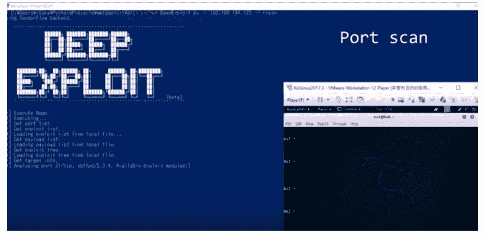

它能够执行以下任务：

+   情报收集

+   威胁建模

+   漏洞分析

+   利用

+   后利用

+   报告

要下载 Deep Exploit，请访问其官方 GitHub 存储库：[`github.com/13o-bbr-bbq/machine_learning_security/tree/master/DeepExploit`](https://github.com/13o-bbr-bbq/machine_learning_security/tree/master/DeepExploit)。

它由一个机器学习模型（A3C）和 metasploit 组成。这是 Deep Exploit 架构的高级概述：


使 Deep Exploit 正常工作所需的环境如下：

+   Kali Linux 2017.3（VMWare 上的客户操作系统）

+   内存：8.0GB

+   Metasploit 框架 4.16.15-dev

+   Windows 10 Home 64 位（主机操作系统）

+   CPU：Intel(R) Core(TM) i7-6500U 2.50GHz

+   内存：16.0GB

+   Python 3.6.1（Anaconda3）

+   TensorFlow 1.4.0

+   Keras 2.1.2

# 总结

现在我们已经学习了最常用的机器学习技术；在深入实验室之前，我们需要对这些模型的实际工作原理有一个公平的理解。我们的实际经验将从下一章开始。

阅读完本章后，我认为我们可以构建我们自己的开发环境。第二章将向我们展示如何抵御先进的基于计算机的社会工程攻击，我们将学习如何构建一个智能的钓鱼检测器。就像每一章一样，我们将从攻击背后的技术开始学习，并逐步学习构建一个钓鱼检测系统的实际步骤。

# 问题

1.  尽管机器学习是一个有趣的概念，但在有用的有限商业应用中使用它。 （是 | 否）

1.  机器学习应用程序太复杂，无法在云中运行。（是 | 否）

1.  对于两次 k 均值聚类运行，预期会得到相同的聚类结果吗？（是 | 否）

1.  具有离散值目标属性的预测模型可以称为：

(a) 回归模型

(b) 分类模型

1.  以下哪些技术执行类似于神经网络中的辍学操作？

(a) 堆叠

(b) 裹袋

(c) 提升

1.  哪种神经网络架构最适合解决图像识别问题？

(a) 卷积神经网络

(b) 循环神经网络

(c) 多层感知器

(d) 感知器

1.  深度学习与传统机器学习有何不同？

(a) 深度学习算法可以处理更多数据，并且需要更少的数据科学家监督。

(b) 机器学习更简单，需要更少的数据分析师监督，而深度学习则不然。

(c) 两者之间没有真正的区别；它们是相同的工具，只是名称不同。

1.  以下哪项是机器学习项目中经常使用的技术？

(a) 将数据分类。

(b) 将相似的对象分组成簇。

(c) 识别事件之间的关系，以预测一个事件将在另一个事件之后发生。

(d) 以上全部。

# 进一步阅读

为了节省您的一些努力，我已经准备了一份有用的资源列表，以帮助您更深入地探索我们讨论过的技术。

推荐书籍：

+   *Python 机器学习-第二版* by Sebastian Raschka and Vahid Mirjalili：[`www.packtpub.com/big-data-and-business-intelligence/python-machine-learning-second-edition`](https://www.packtpub.com/big-data-and-business-intelligence/python-machine-learning-second-edition)

+   *使用 Python 构建机器学习系统* by Luis Pedro Coelho and Willi Richert：[`www.amazon.com/Building-Machine-Learning-Systems-Python/dp/1782161406`](https://www.amazon.com/Building-Machine-Learning-Systems-Python/dp/1782161406)

+   *从头开始的数据科学：Python 基本原理* by Joel Grus：[`www.amazon.com/Data-Science-Scratch-Principles-Python/dp/149190142X/ref=pd_sim_14_4?_encoding=UTF8&pd_rd_i=149190142X&pd_rd_r=506TTMZ93CK4Q4KZWDRM&pd_rd_w=5Eqf8&pd_rd_wg=1HMzv&psc=1&refRID=506TTMZ93CK4Q4KZWDRM`](https://www.amazon.com/Data-Science-Scratch-Principles-Python/dp/149190142X/ref=pd_sim_14_4?_encoding=UTF8&pd_rd_i=149190142X&pd_rd_r=506TTMZ93CK4Q4KZWDRM&pd_rd_w=5Eqf8&pd_rd_wg=1HMzv&psc=1&refRID=506TTMZ93CK4Q4KZWDRM)

推荐网站和在线课程：

+   机器学习掌握：[`machinelearningmastery.com`](https://machinelearningmastery.com)

+   Coursera - 机器学习（Andrew Ng）：[`www.coursera.org/learn/machine-learning#syllabus`](https://www.coursera.org/learn/machine-learning#syllabus)

+   **神经网络用于机器学习**：[`www.coursera.org/learn/neural-networks`](https://www.coursera.org/learn/neural-networks)
