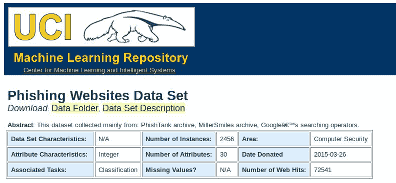
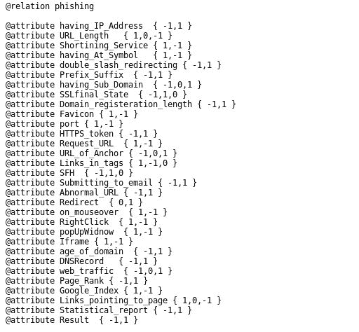
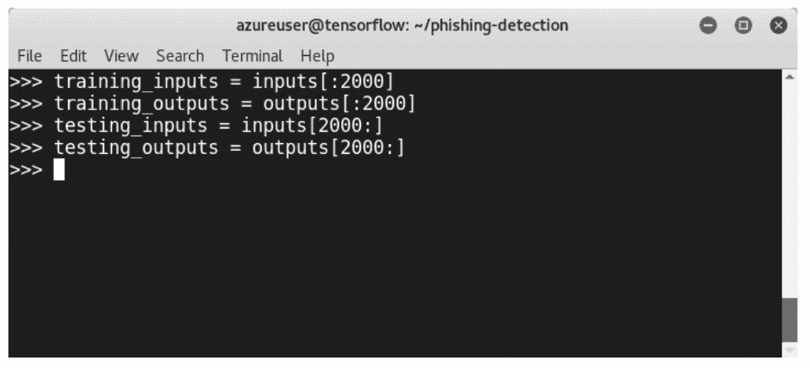
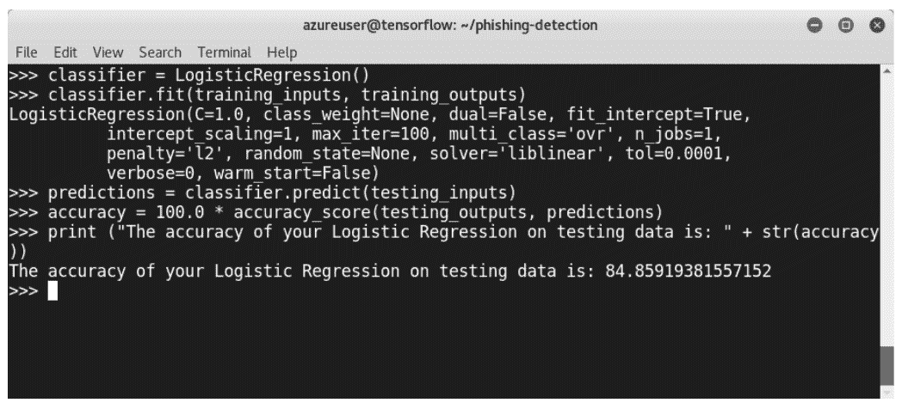
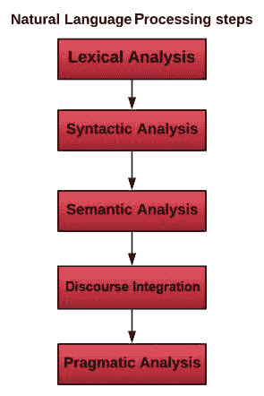
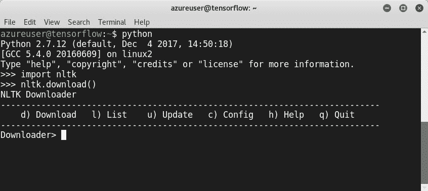
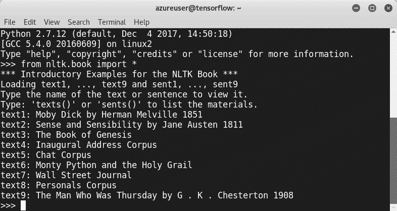
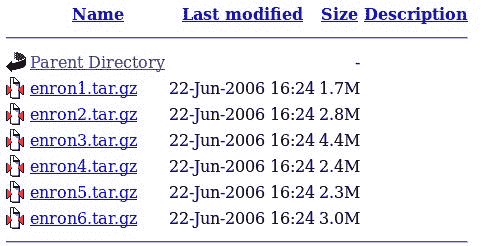
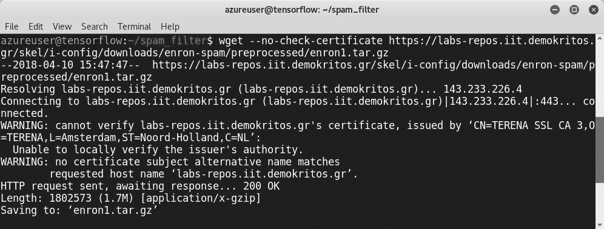
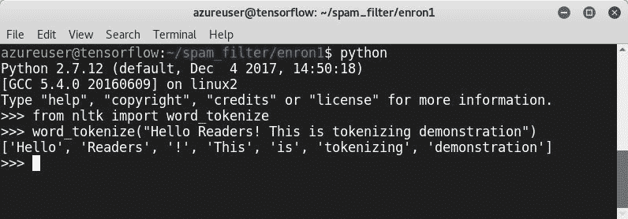

# 第二章：钓鱼域名检测

社会工程是每个个人和现代组织面临的最危险的威胁之一。钓鱼是一种众所周知的基于计算机的社会工程技术。攻击者使用伪装的电子邮件地址作为武器来瞄准大公司。由于每天收到大量的钓鱼邮件，公司无法检测到所有这些邮件。这就是为什么需要新的技术和防护措施来防御钓鱼。本章将介绍构建三个不同基于机器学习的项目以检测钓鱼尝试所需的步骤，使用尖端的 Python 机器学习库。

在本章中，我们将涵盖：

+   社会工程概述

+   社会工程渗透测试的步骤

+   使用不同的机器学习模型构建实时钓鱼攻击检测器：

+   使用逻辑回归进行钓鱼检测

+   使用决策树进行钓鱼检测

+   使用**自然语言处理**（**NLP**）进行垃圾邮件检测。

# 技术要求

在本章中，我们将使用以下 Python 库：

+   scikit-learn Python（≥2.7 或≥3.3）

+   NumPy（≥1.8.2）

+   NLTK

如果您尚未安装它们，请确保在继续本章之前安装它们。您可以在[`github.com/PacktPublishing/Mastering-Machine-Learning-for-Penetration-Testing/tree/master/Chapter02`](https://github.com/PacktPublishing/Mastering-Machine-Learning-for-Penetration-Testing/tree/master/Chapter02)找到代码文件。

# 社会工程概述

社会工程，根据定义，是对一个人的心理操纵，以从他们那里获取有用和敏感的信息，这些信息以后可以用来破坏系统。换句话说，罪犯利用社会工程从人们那里获取机密信息，利用人类行为。

# 社会工程参与框架

**社会工程参与框架**（**SEEF**）是由 Dominique C. Brack 和 Alexander Bahmram 开发的框架。它总结了信息安全和防御社会工程多年的经验。该框架的利益相关者是组织、政府和个人（个人）。社会工程参与管理经历三个步骤：

1.  预先参与过程：准备社会工程操作

1.  **在参与过程中**：参与发生

1.  **在参与过程后**：提交报告

罪犯使用许多社会工程技术：

+   **诱饵**：说服受害者透露信息，承诺给他奖励或礼物。

+   冒充：假装成别人。

+   垃圾箱潜水：从垃圾箱中收集有价值的信息（包括地址、电子邮件等）。

+   窥视：在别人背后窥视他们的机器，当他们在打字时。

+   钓鱼：这是最常用的技术；当攻击者假扮成受信任的实体，欺骗受害者打开电子邮件、即时消息或短信时，就会发生这种情况。

# 社会工程渗透测试步骤

渗透测试模拟黑客的攻击，以评估公司的安全姿态，以部署所需的防护措施。渗透测试是一个有方法的过程，它经过明确定义的步骤。有许多类型的渗透测试：

+   白盒渗透测试

+   黑盒渗透测试

+   灰盒渗透测试

要执行社会工程渗透测试，您需要按照以下步骤进行：


# 使用不同的机器学习模型构建实时钓鱼攻击检测器

在接下来的章节中，我们将学习如何构建机器学习钓鱼检测器。我们将涵盖以下两种方法：

+   使用逻辑回归进行钓鱼检测

+   使用决策树进行钓鱼检测

# 使用逻辑回归进行钓鱼检测

在本节中，我们将使用逻辑回归算法从头开始构建一个钓鱼网站检测器。逻辑回归是一种用于进行二项预测（两类）的众所周知的统计技术。

就像在每个机器学习项目中一样，我们需要数据来供给我们的机器学习模型。对于我们的模型，我们将使用 UCI 机器学习库（钓鱼网站数据集）。您可以在[`archive.ics.uci.edu/ml/datasets/Phishing+Websites`](https://archive.ics.uci.edu/ml/datasets/Phishing+Websites)上查看它：



数据集以`arff`文件的形式提供：



以下是数据集的快照：


为了更好地操作，我们已经将数据集组织成了`csv`文件：


您可能已经注意到，从属性中，数据集的每一行都以以下格式表示 - *{30 个属性（具有 IP 地址 URL 长度，异常 URL 等）} + {1 个属性（结果）}*：


对于我们的模型，我们将导入两个机器学习库，NumPy 和 scikit-learn，这两个库我们已经在第一章中安装了，*渗透测试中的机器学习简介*。

让我们打开 Python 环境并加载所需的库：

```py
>>> import numpy as np
>>> from sklearn import *
>>> from sklearn.linear_model import LogisticRegression
>>> from sklearn.metrics import accuracy_score
```

接下来，加载数据：

```py
training_data = np.genfromtxt('dataset.csv', delimiter=',', dtype=np.int32)
```

确定`inputs`（除最后一个属性外的所有属性）和`outputs`（最后一个属性）：

```py
>>> inputs = training_data[:,:-1]
>>> outputs = training_data[:, -1]
```

在上一章中，我们讨论了如何将数据集分成训练数据和测试数据：

```py
training_inputs = inputs[:2000]
training_outputs = outputs[:2000] 
testing_inputs = inputs[2000:]
testing_outputs = outputs[2000:]
```



创建 scikit-learn 逻辑回归分类器：

```py
classifier = LogisticRegression()
```

训练分类器：

```py
classifier.fit(training_inputs, training_outputs)
```

进行预测：

```py
predictions = classifier.predict(testing_inputs)
```

让我们打印出我们的钓鱼网站检测器模型的准确率：

```py
accuracy = 100.0 * accuracy_score(testing_outputs, predictions) 
print ("The accuracy of your Logistic Regression on testing data is: " + str(accuracy))
```



我们的模型准确率约为 85%。这是一个很好的准确率，因为我们的模型在 100 个中检测出了 85 个钓鱼网址。但让我们尝试使用相同的数据，用决策树来构建一个更好的模型。

# 使用决策树进行钓鱼检测

为了构建第二个模型，我们将使用相同的机器学习库，因此无需再次导入它们。但是，我们将从`sklearn`导入决策树分类器：

```py
>>> from sklearn import tree
```

创建`tree.DecisionTreeClassifier()` scikit-learn 分类器：

```py
classifier = tree.DecisionTreeClassifier()
```

训练模型：

```py
classifier.fit(training_inputs, training_outputs)
```

计算预测：

```py
predictions = classifier.predict(testing_inputs)
```

计算准确率：

```py
accuracy = 100.0 * accuracy_score(testing_outputs, predictions)
```

然后，打印出结果：

```py
print ("The accuracy of your decision tree on testing data is: " + str(accuracy))
```


第二个模型的准确率约为 90.4%，与第一个模型相比，这是一个很好的结果。我们现在已经学会了如何使用两种机器学习技术构建两个钓鱼网站检测器。

# NLP 深入概述

NLP 是机器分析和理解人类语言的艺术。根据许多研究，超过 75%的使用数据是非结构化的。非结构化数据没有预定义的数据模型，也没有按预定义的方式组织。电子邮件、推文、日常消息甚至我们记录的演讲都是非结构化数据的形式。NLP 是机器分析、理解和从自然语言中获取含义的一种方式。NLP 广泛应用于许多领域和应用程序，例如：

+   实时翻译

+   自动摘要

+   情感分析

+   语音识别

+   构建聊天机器人

通常，NLP 有两个不同的组成部分：

+   **自然语言理解（NLU）**：这指的是将输入映射为有用的表示。

+   **自然语言生成（NLG）**：这指的是将内部表示转换为有用的表示。换句话说，它是将数据转换为书面或口头叙述。商业智能仪表板的书面分析是 NLG 应用之一。

每个 NLP 项目都经历五个步骤。构建 NLP 项目的第一步是识别和分析单词的结构。这一步涉及将数据分成段落、句子和单词。然后我们分析句子中的单词以及它们之间的关系。第三步涉及检查文本的意义。然后，分析连续句子的含义。最后，我们通过实用分析完成项目。



# 开源 NLP 库

有许多开源的 Python 库提供了构建实际 NLP 应用所需的结构，例如：

+   Apache OpenNLP

+   GATE NLP 库

+   Stanford NLP

+   当然，**自然语言工具包**（**NLTK**）

在上一章中，我们学习了如何安装许多开源的机器学习 Python 库，包括 NLTK。让我们启动我们的 Linux 机器并尝试一些实际技术。

打开 Python 终端并导入`nltk`：

```py
>>> import nltk
```

下载书籍类型，如下所示：

```py
>>> nltk.download()
```



如果要列出我们在上一章中已经下载的可用资源，请输入`l`：


您也可以输入：

```py
>> from nltk.book import *
```



要从链接中获取文本，建议使用`urllib`模块来爬取网站：

```py
>>> from urllib import urlopen
>>> url = "http://www.URL_HERE/file.txt"
```

作为演示，我们将加载一个名为`Security.in.Wireless.Ad.Hoc.and.Sensor.Networks`的文本：


我们爬取了文本文件，并使用`len`检查其长度和`raw[:50]`显示一些内容。从屏幕截图中可以看到，文本包含许多对我们的项目无用的符号。为了只获取我们需要的内容，我们使用**标记化**：

```py
>>> tokens = nltk.word_tokenize(raw)
>>> len(tokens)
> tokens[:10]
```

总结一下我们在上一节学到的内容，我们看到了如何下载网页，对文本进行标记化，并对单词进行规范化。

# 使用 NLTK 进行垃圾邮件检测

现在是时候使用 NLTK 构建我们的垃圾邮件检测器了。这种分类器的原理很简单；我们需要检测垃圾邮件发送者使用的单词。我们将使用 Python 和`nltk`库构建一个垃圾邮件/非垃圾邮件二元分类器，以检测电子邮件是否为垃圾邮件。首先，我们需要像往常一样导入该库：

```py
>>> import nltk
```

我们需要加载数据并用电子邮件数据集来训练我们的模型。为了实现这一点，我们可以使用**Internet CONtent FIltering Group**提供的数据集。您可以访问该网站[`labs-repos.iit.demokritos.gr/skel/i-config/`](https://labs-repos.iit.demokritos.gr/skel/i-config/)：


基本上，该网站提供了四个数据集：

+   Ling-spam

+   PU1

+   PU123A

+   Enron-spam

对于我们的项目，我们将使用 Enron-spam 数据集：



让我们使用`wget`命令下载数据集：



使用`tar -xzf enron1.tar.gz`命令提取`tar.gz`文件：


洗牌`cp spam/* emails && cp ham/* emails`对象：


要洗牌电子邮件，让我们编写一个小的 Python 脚本`Shuffle.py`来完成这项工作：

```py
import os
import random
#initiate a list called emails_list
emails_list = []
Directory = '/home/azureuser/spam_filter/enron1/emails/'
Dir_list  = os.listdir(Directory)
for file in Dir_list:
    f = open(Directory + file, 'r')
    emails_list.append(f.read())
f.close()
```

只需更改目录变量，它将对文件进行洗牌：


准备数据集后，您应该知道，正如我们之前学到的那样，我们需要对电子邮件进行`标记化`：

```py
>> from nltk import word_tokenize
```



此外，我们还需要执行另一个步骤，称为词形还原。词形还原将连接具有不同形式的单词，如 hacker/hackers 和 is/are。我们需要导入`WordNetLemmatizer`：

```py
>>> from nltk import WordNetLemmatizer
```

创建一个用于演示的句子，并打印出词形还原器的结果：

```py
>>> [lemmatizer.lemmatize(word.lower()) for word in word_tokenize(unicode(sentence, errors='ignore'))]
```


然后，我们需要去除`停用词`，如`of`，`is`，`the`等：

```py
from nltk.corpus import stopwords
stop = stopwords.words('english')
```

为了处理电子邮件，必须创建一个名为`Process`的函数，以对我们的数据集进行`词形还原`和`标记化`：

```py
def Process(data):
 lemmatizer = WordNetLemmatizer()
 return [lemmatizer.lemmatize(word.lower()) for word in word_tokenize(unicode(sentence,   errors='ignore'))]
```

第二步是通过阅读电子邮件的单词进行特征提取：

```py
from collections import Counter
def Features_Extraction(text, setting):
 if setting=='bow':
# Bow means  bag-of-words
 return {word: count for word, count in Counter(Process(text)).items() if not word in stop}
 else:
 return {word: True for word in Process(text) if not word in stop}
```

提取特征：

```py
features = [(Features_Extraction(email, 'bow'), label) for (email, label) in emails]
```

现在，让我们定义训练模型的 Python 函数：

```py
def training_Model (Features, samples):
 Size = int(len(Features) * samples)
 training , testing = Features[:Size], Features[Size:]
 print ('Training = ' + str(len(training)) + ' emails')
 print ('Testing = ' + str(len(testing)) + ' emails')
```

作为分类算法，我们将使用`NaiveBayesClassifier`：

```py
from nltk import NaiveBayesClassifier, classify
classifier = NaiveBayesClassifier.train(training)
```

最后，我们定义评估 Python 函数：

```py
def evaluate(training, tesing, classifier):
 print ('Training Accuracy is ' + str(classify.accuracy(classifier, train_set)))
 print ('Testing Accuracy i ' + str(classify.accuracy(classifier, test_set)))
```


# 总结

在本章中，我们学习了如何通过从头开始构建三个不同的项目来检测网络钓鱼尝试。首先，我们发现如何利用两种不同的机器学习技术开发网络钓鱼检测器，这要归功于尖端的 Python 机器学习库。第三个项目是一个基于 NLP 和朴素贝叶斯分类的垃圾邮件过滤器。在下一章中，我们将使用不同的技术和 Python 机器学习库构建各种项目来检测恶意软件。

# 问题

希望您能轻松地阅读完本章。现在，像往常一样，是练习时间了。您的任务是尝试构建自己的垃圾邮件检测系统。我们将通过问题来指导您。

在本章的 GitHub 存储库中，您将找到由 Androutsopoulos、J. Koutsias、K.V. Chandrinos、George Paliouras 和 C.D. Spyropoulos 进行的研究收集的数据集：*朴素贝叶斯反垃圾邮件过滤的评估*。*机器学习在新信息时代的研讨会论文集，G. Potamias，V. Moustakis 和 M. van Someren（编辑），第 11 届欧洲机器学习大会，西班牙巴塞罗那，第 9-17 页，2000 年*。

现在可以准备数据了：

1.  以下是一些要执行的文本清理任务：

+   清理文本中的停用词、数字和标点符号。

+   执行词形还原。

1.  创建一个单词字典，包括它们的频率。

在电子邮件文本中，您会注意到第一行是电子邮件的主题，第三行是电子邮件的正文（我们只需要电子邮件正文）。

1.  从字典中删除非单词。

1.  从数据中提取特征。

1.  准备特征向量及其标签。

1.  使用线性支持向量机分类器对模型进行训练。

1.  打印出模型的混淆矩阵。
