# 第三章：使用 API 调用和 PE 头部进行恶意软件检测

信息安全中最烦人的威胁之一是恶意程序。每天，我们都会听到关于数据泄露和恶意软件的网络攻击的新闻。攻击者正在提高他们的开发技能，并构建新的恶意软件，能够绕过公司的安全防护和杀毒产品。本章将介绍一些新的技术和解决方案，使用尖端的数据科学、Python 库和机器学习算法来打败恶意软件。

在本章中，我们将涵盖：

+   恶意软件分析方法

+   机器学习辅助的恶意软件分析技术，带有实际的、真实世界的 Python 项目

# 技术要求

在本章中，我们将使用已经安装的相同 Python 库。我们将在本书的大部分章节中使用这些库。这就是为什么我们在第一章中教你如何安装所有所需的库。

你会发现所有讨论过的代码，以及一些其他有用的脚本，都在存储库中[`github.com/PacktPublishing/Mastering-Machine-Learning-for-Penetration-Testing/tree/master/Chapter03`](https://github.com/PacktPublishing/Mastering-Machine-Learning-for-Penetration-Testing/tree/master/Chapter03)。

# 恶意软件概述

恶意软件是设计用来在用户不知情的情况下渗透和破坏信息系统的恶意软件。术语*恶意软件*涵盖了许多类别。有许多不同类型的恶意软件：

+   病毒

+   勒索软件

+   蠕虫

+   特洛伊木马

+   后门

+   间谍软件

+   键盘记录器

+   广告软件、机器人和 rootkits

# 恶意软件分析

作为恶意软件分析员，你的工作是发现系统发生了什么，并确保受恶意软件损害的机器与组织的网络隔离。为了进行恶意软件分析，我们需要遵循特定的操作和方法。在进行恶意软件分析时，我们必须执行三种技术：静态恶意软件分析、动态恶意软件分析和内存恶意软件分析。我们将逐一看看它们。

# 静态恶意软件分析

恶意软件分析的第一步是收集有关恶意软件的所有信息。静态分析是使用不同的技术和实用程序收集有关恶意二进制文件的所有可用信息的艺术。在这个阶段，分析人员在不真正执行它的情况下检查恶意软件。一些常见的静态恶意软件分析方法如下：

+   **在线杀毒扫描**：使用在线扫描器扫描可疑文件是检查文件的好方法，这要归功于在线环境，让你能够使用许多杀毒产品扫描文件。最著名的在线扫描器是 VirusTotal。如果你想扫描一个文件，只需访问[`www.virustotal.com/#/home/upload`](https://www.virustotal.com/#/home/upload)并上传文件：

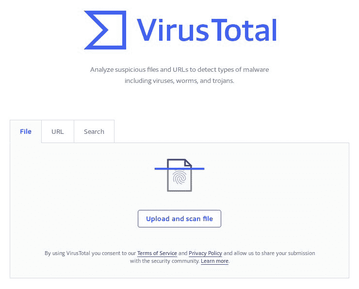

为了自动化任务，VirusTotal 提供了一些有用的 API。因此，你可以用几行代码构建自己的 Python 脚本：


要扫描`file.exe`，你可以使用来自 VirusTotal 的以下代码片段：

```py
import requests
 url = 'https://www.virustotal.com/vtapi/v2/file/scan'
 params = {'apikey': '<apikey>'}
 files = {'file': ('myfile.exe', open('myfile.exe', 'rb'))}
 response = requests.post(url, files=files, params=params)
 print(response.json())
```

要获取密钥，只需创建一个 VirusTotal 社区帐户。

+   **哈希**：这是一种识别文件的技术。每个哈希文件都有一个唯一的哈希。最常用的哈希函数是 MD5 和 SHA256。

+   **字符串**：这些也是信息的重要来源。从恶意程序中提取字符串将为我们提供有关恶意软件的重要信息。一些字符串包括 URI、URL、错误消息和注释。

# 动态恶意软件分析

收集有关恶意软件的信息后，你应该在一个隔离和安全的环境中运行它。一般来说，这些环境被称为**恶意软件分析沙盒**。沙盒加载了分析和监控工具，以在恶意软件运行时收集有关恶意软件的信息。恶意软件分析人员可以收集以下信息，以及更多：

+   TCP 连接

+   DNS 摘要

+   恶意软件行为

+   系统调用

# 内存恶意软件分析

多年前，使用前两种技术就足以分析恶意软件，但攻击者现在正在使用新的、更复杂的技术来避免检测。我敢打赌你已经听说过无文件恶意软件。需要内存恶意软件分析来检测新一波的恶意软件。内存恶意软件分析是通过分析从感染的机器收集的内存转储来进行的。为了进行内存分析，分析师首先需要获取内存（转储内存），然后可以使用许多实用程序和技术来进行后续分析。

最常用的框架之一是 volatility 框架。如果你安装了 Kali Linux 发行版，你可以在机器上直接使用 volatility 而不需要安装它。以下截图是从 Kali Linux 内置的 volatility 框架中获取的：


Volatility 帮助分析师从内存转储中收集信息，包括以下内容等等：

+   Bash 历史

+   API 钩子

+   网络信息

+   内核加载模块

# 规避技术

攻击者和恶意软件开发者不断想出新的技术和方法来避免检测。一些最常见的技术包括：

+   **混淆**：这是使恶意软件更难以检测或分析的做法。死代码插入、寄存器重新分配和加密是三种混淆技术。

+   **绑定**：这是将恶意软件与合法文件绑定在一起的做法，导致形成一个可执行文件。

+   打包：打包器，有时被称为**自解压缩存档**，是一种软件，当执行*打包文件*时，在内存中解压缩自身。

# 可移植可执行文件格式文件

**可移植可执行文件**（**PE**）文件是用于 32 位和 64 位 Windows 版本的可执行文件、DDL 和目标代码的文件格式。它们包含了许多对恶意软件分析师有用的信息，包括导入、导出、时间戳、子系统、部分和资源。以下是 PE 文件的基本结构：


PE 文件的一些组件如下：

+   DOS 头部：这从每个 PE 文件的前 64 个字节开始，因此 DOS 可以验证可执行文件，并在 DOS stub 模式下运行它。

+   PE 头部：这包含了信息，包括代码的位置和大小。

+   **PE 部分**：它们包含文件的主要内容。

要探索 PE 头部的信息，可以使用许多工具，如 PE EXPLORER、PEview 和 PEstudio。

# 使用 PE 头部进行机器学习恶意软件检测

为了训练我们的机器学习模型来查找恶意软件数据集，有许多公开可用的数据源供数据科学家和恶意软件分析师使用。例如，以下网站为安全研究人员和机器学习爱好者提供了下载许多不同恶意软件样本的能力：

+   **恶意软件流量分析**：[`www.malware-traffic-analysis.net/`](https://www.malware-traffic-analysis.net/)

+   Kaggle 恶意软件家族：[`www.kaggle.com/c/malware-classification`](https://www.kaggle.com/c/malware-classification)

+   **VX 天堂**：[`83.133.184.251/virensimulation.org/index.html`](http://83.133.184.251/virensimulation.org/index.html)

+   **VirusTotal**：[`www.virustotal.com`](https://www.virustotal.com)

+   **VirusShare**：[`virusshare.com`](https://virusshare.com)

要处理 PE 文件，我强烈推荐使用一个名为`pefile`的惊人 Python 库。`pefile`让你能够检查头部、分析部分、检索数据，以及其他功能，如打包器检测和 PEiD 签名生成。你可以在 GitHub 项目中查看[`github.com/erocarrera/pefile`](https://github.com/erocarrera/pefile)。

你也可以像我们使用其他机器学习库一样使用 PIP 安装它：

```py
# pip install pefile
```

现在我们成功安装了`pefile`：


让我们开始构建我们的第一个恶意软件分类器。对于这个模型，我们将使用三种不同的技术：

+   随机森林

+   梯度提升分类

+   AdaBoost 分类

正如你可能从本书中的分类算法中注意到的那样，我们正在尝试使用许多不同的技术。在某些情况下，您可以使用先前讨论过的算法之一，但我正在尝试在每一章中使用不同的技术，以便您可以清楚地了解如何使用每种机器学习技术。

到目前为止，您已经意识到构建机器学习模型的第一步（在研究项目需求和要求之后，当然）是下载数据集。在本节中，我们将下载由安全博主 Prateek Lalwani 提供的恶意软件数据集。恶意软件数据集包含从以下提取的特征：

+   41,323 个 Windows 二进制文件（可执行文件`.exe`和`.dlls`），作为合法文件。

+   从 VirusShare 网站下载的 96,724 个恶意软件文件。因此，数据集总共包含 138,048 行。

数据集分为如下：

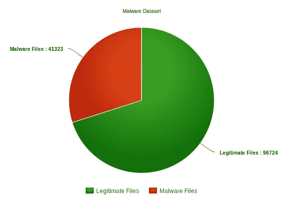

让我们从`pandas` Python 库中加载恶意软件数据集开始：

```py
import pandas as pd
MalwareDataset = pd.read_csv('MalwareData.csv', sep='|')
Legit = MalwareDataset[0:41323].drop(['legitimate'], axis=1)
Malware = MalwareDataset[41323::].drop(['legitimate'], axis=1)
```

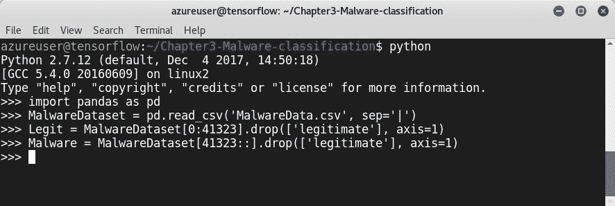

为了确保数据集已正确加载，请打印重要特征的数量：

```py
print('The Number of important features is  %i \n' % Legit.shape[1])
```

`重要特征的数量为 56`将是结果行：


为了提高估计器的准确度分数，我们将使用`sklearn.feature_selection`模块。该模块用于特征选择或数据集的降维。

要计算特征的重要性，在我们的情况下，我们将使用基于树的特征选择。加载`sklearn.feature_selection`模块：

```py
import sklearn
from sklearn.feature_selection import SelectFromModel
from sklearn.ensemble import ExtraTreesClassifier
from sklearn.model_selection import train_test_split
from sklearn import cross_validation 
Data = MalwareDataset.drop(['Name', 'md5', 'legitimate'], axis=1).values
Target = MalwareDataset['legitimate'].values
FeatSelect =  sklearn.ensemble.ExtraTreesClassifier().fit(Data, Target)
Model = SelectFromModel(FeatSelect, prefit=True)
Data_new = Model.transform(Data)
print (Data.shape)
print (Data_new.shape)
```


因此，算法已为我们选择了九个重要特征。要打印它们，请使用以下命令：

```py
Features = Data_new.shape[1]
Index = np.argsort(ske.ExtraTreesClassifier().fit(Data,Target).feature_importances_)[::-1][:Features]
for feat  in range(Features):
print(MalwareDataset.columns[2+index[feat]])
```

最重要的特征如下：

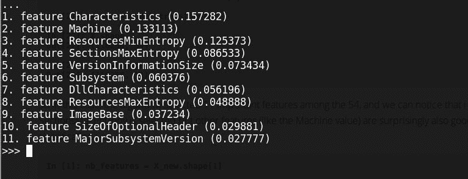

现在，是时候用随机森林分类器训练我们的模型了。不要忘记像我们之前学到的那样分割数据集：

```py
Legit_Train, Legit_Test, Malware_Train, Malware_Test = cross_validation.train_test_split(Data_new, Target ,test_size=0.2) 
clf =  sklearn.ensemble.RandomForestClassifier(n_estimators=50)
clf.fit(Legit_Train, Malware_Train)
score = clf.score(Legit_Test, Malware_Test)
```

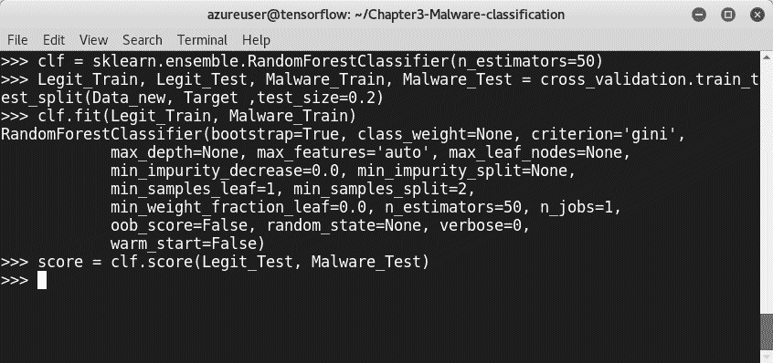

让我们看看最终结果：

```py
print("The score of Random Forest Algorithm is," score*100))
```

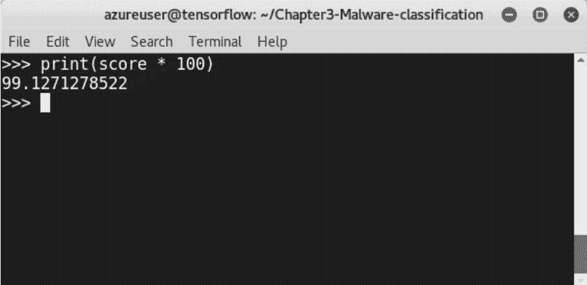

得分看起来非常有希望。该模型以 99%的成功率检测到了恶意软件，这是一个很好的结果。要获取有关我们的恶意软件分类器的`假阳性`和`假阴性`率的更多信息，请导入 scikit-learn`confusion_matrix`模块：

```py
from sklearn.metrics import confusion_matrix
```

添加以下行：

```py
Result = clf.predict(Legit_Test)
CM = confusion_matrix(Malware_Test, Result)
print("False positive rate : %f %%" % ((CM[0][1] / float(sum(CM[0])))*100)) print('False negative rate : %f %%' % ( (CM[1][0] / float(sum(CM[1]))*100)))
```


`假阳性率`为 0.6%，`假阴性率`为 1.4%。

要使用另一个分类器训练模型，请重复上述步骤，但是选择随机森林分类器的代替，选择一种机器学习算法。例如，我将选择梯度提升：

```py
Clf = sklearn.ensemble.GradientBoostingClassifier(n_estimators=50)
Clf.fit(Legit_Train, Malware_Train)
Score = Clf.score(Legit_Test, Malware_Test)
```


让我们检查第二个分数：

```py
print ("The Model score using Gradient Boosting is", Score * 100)
```


这有 98.8%的检测率。使用 AdaBoost 分类器的得分如下：

```py
Classifiers =
{ "RandomForest": ske.RandomForestClassifier(n_estimators=50), "GradientBoosting": ske.GradientBoostingClassifier(n_estimators=50), "AdaBoost": ske.AdaBoostClassifier(n_estimators=100),}

for Classif in Classifiers:
clf = Classifiers[Classif]
clf.fit(Legit_Train,Malware_Train)
score = clf.score(Legit_test, Malware_test)
print("%s : %f %%" % (Classif, score*100))
```

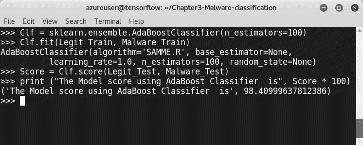

# 使用 API 调用的机器学习恶意软件检测

使用 API 调用分析恶意软件在恶意软件分析中起着重要作用。因此，API 可以让恶意软件分析人员了解恶意软件行为，特别是在基本的静态分析由于混淆技术（如打包程序、加密程序和保护程序）而失败时。通过研究 API 调用，恶意软件分析人员可以了解恶意文件的工作原理。有许多在线工具可以让您在安全环境中分析恶意软件。这些实用程序和环境被称为沙箱。检测到的恶意软件由哈希函数（MD5 或 SHA256）标识。恶意软件分析人员使用哈希对文件进行签名。例如，以下 API 是从[`www.hybrid-analysis.com`](https://www.hybrid-analysis.com)的在线恶意软件扫描报告中获取的。

这是关于恶意软件“PE32 可执行文件（GUI）Intel 80386，用于 MS Windows”的一些细节。它的哈希是：4c510779ab6a58a3bdbbe8d5f3ec568fcf33df81b0f1a5bdacabf78a9c62f492

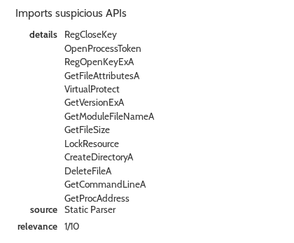

根据微软网站，[`msdn.microsoft.com/`](https://msdn.microsoft.com/)，`GetProcAddress`从指定的**动态链接库**（**DLL**）中检索导出函数或变量的地址。因此，如果您想了解更多关于其他调用的信息，只需访问微软开发者网络并搜索 API 调用函数：

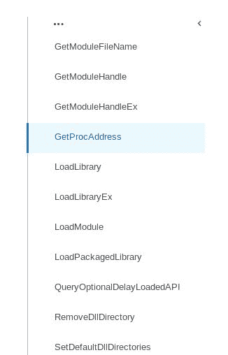

报告包括对发现的完整总结，不仅包括 API 调用。它包括：

+   一般信息

+   恶意指标

+   异常特征

+   反检测/隐蔽性

+   反向工程

+   网络相关信息

以下是有关扫描的恶意软件的信息。我们之前讨论了大部分所需的发现（静态分析工件：大小、类型等）：


对于我们的第二个恶意软件分类器，我们将使用 API 调用来构建一个机器学习恶意软件检测器。为了从恶意软件二进制文件中提取 API，恶意软件分析师需要按照明确定的步骤进行：

1.  恶意软件解包

1.  汇编程序检索

1.  API 调用提取

1.  使用官方微软网站分析 API 调用

您可以将恶意软件行为分为不同组。例如，巴拉瑞特大学在文章《通过提取 API 调用来理解恶意软件行为》中将 API 调用分为六类。您可以使用它来分析您的发现：

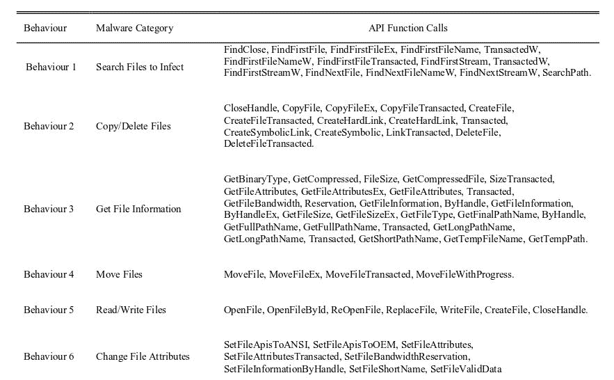

作为演示，让我们使用支持向量机学习算法和 API 调用数据集构建一个 Android 恶意软件检测项目。本章的 GitHub 文件夹包含一个准备好的数据集来构建我们的模型：

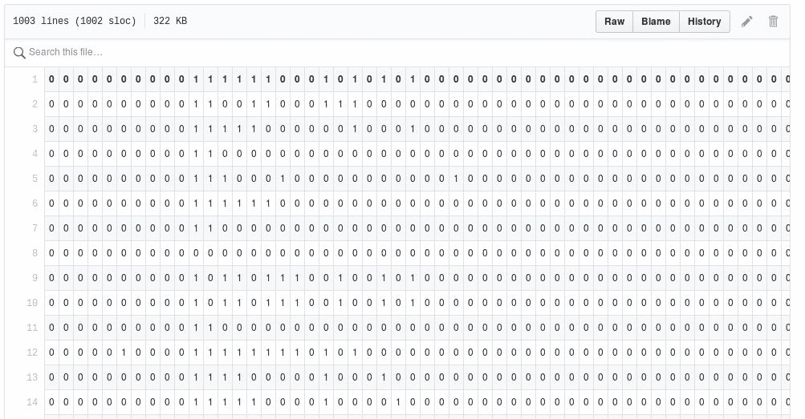

在构建模型之前，我们需要导入一些有用的模块：

```py
>>> from sklearn.feature_selection import mutual_info_classif
>>> from sklearn import preprocessing
>>> import numpy as np
>>> from sklearn.svm import SVC, LinearSVC
>>> from sklearn import svm
>>> import csv
>>> import random
```

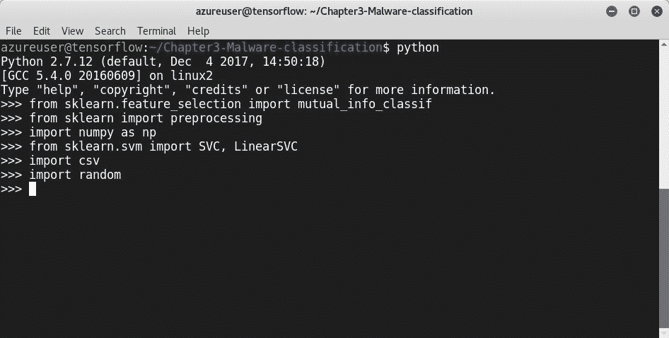

首先，让我们预处理我们的 CSV 文件（`Android_Feats.csv`）：

```py
>>> PRatio = 0.7
>>> Dataset =  open('Android_Feats.csv')
>>> Reader = csv.reader(Dataset)
>>> Data = list(Reader)
>>> Data = random.sample(Data, len(Data))
>>> Data = np.array(Data)
> Dataset.close()
```


使用 NumPy 标识文件中的数据和标签：

```py
>>> cols = np.shape(Data)[1]
>>> Y = Data[:,cols-1]
>>> Y = np.array(Y)
>>> Y = np.ravel(Y,order='C')
>>> X = Data[:,:cols-1]
>>> X = X.astype(np.float)
>>> X = preprocessing.scale(X)
```

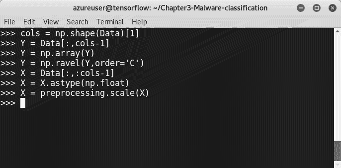

到目前为止，处理阶段已经完成。如前所述，我们需要提取最重要的特征，因为计算所有可用的特征将是一项繁重的任务：

```py
Features = [i.strip() for i in open("Android_Feats.csv").readlines()]
Features = np.array(Features)
MI= mutual_info_classif(X,Y)
Featureind = sorted(range(len(MI)), key=lambda i: MI[i], reverse=True)[:50]
SelectFeats = Features[Featureind]
```

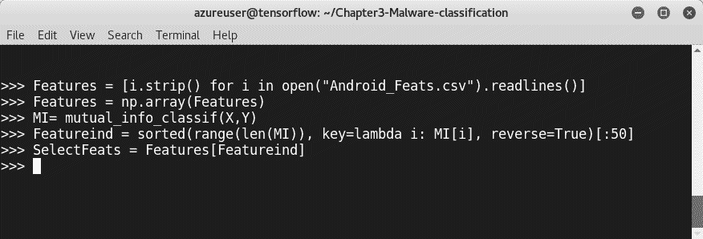

现在，将数据集（数据和标签）分成训练集和测试集：

```py
PRows = int(PRatio*len(Data))
TrainD = X[:PRows,Featureind]
TrainL = Y[:PRows]
TestD = X[PRows:,Featureind]
TestL = Y[PRows:]
```


特征选择已成功完成。为了训练模型，我们将使用支持向量机分类器：

```py
>>> clf = svm.SVC()
>>> clf.fit(TrainD,TrainL)
>>> score = clf.score(TestD,TestL)
>>> print (score * 100)
```


哇！我们新模型的准确率为 98%，这是一个很高的检测率。

# 总结

恶意软件是困扰现代组织安全的最普遍的网络威胁之一。黑客不断改进，因此传统的检测技术已经过时，杀毒产品通常无法检测到高级持久性威胁。这就是为什么机器学习技术可以帮助我们检测恶意软件。

在本章中，我们学习了如何使用许多机器学习算法和开源 Python 库构建恶意软件分类器。下一章将教我们如何使用与人类思维相同的算法构建更加健壮的系统来检测恶意软件。我们将学习如何使用深度学习来检测恶意软件，使用本书中一直使用的 Python 库。

# 问题

现在您可以构建一个机器学习模型。让我们练习一下，将我们的新技能付诸实践。在本章的 GitHub 存储库中，您将找到一个包含有关 Android 恶意软件样本信息的数据集。现在您需要按照这些说明构建自己的模型。

在`Chapter3-Practice` GitHub 存储库中，您将找到一个包含超过 11,000 个良性和恶意 Android 应用程序特征向量的数据集：

1.  使用`pandas` python 库加载数据集，并且这次添加`low_memory=False`参数。搜索该参数的作用。

1.  准备用于训练的数据。

1.  使用`test_size=0.33`参数拆分数据。

1.  创建一个包含`DecisionTreeClassifier()`、`RandomForestClassifier(n_estimators=100)`和`AdaBoostClassifier()`的分类器集合。

1.  `AdaBoostClassifier()`是什么？

1.  使用这三个分类器训练模型，并打印出每个分类器的指标。

# 进一步阅读

欲了解更多信息，请查看以下日志帖子和文档：

+   PE 格式（Windows）：[`msdn.microsoft.com/en-us/library/windows/desktop/ms680547(v=vs.85).aspx`](https://msdn.microsoft.com/en-us/library/windows/desktop/ms680547(v=vs.85).aspx)

+   *恶意软件分析：介绍*：[`www.sans.org/reading-room/whitepapers/malicious/malware-analysis-introduction-2103`](https://www.sans.org/reading-room/whitepapers/malicious/malware-analysis-introduction-2103)

+   VirusTotal 文档：[`www.virustotal.com/en/documentation/`](https://www.virustotal.com/en/documentation/)
