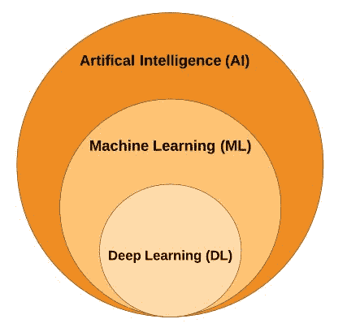
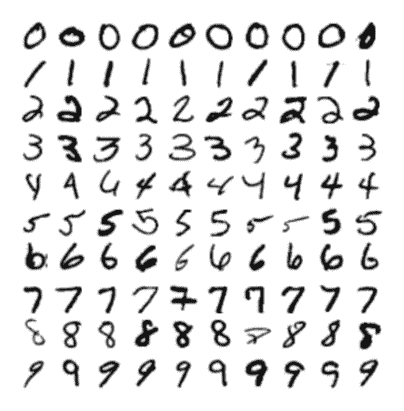
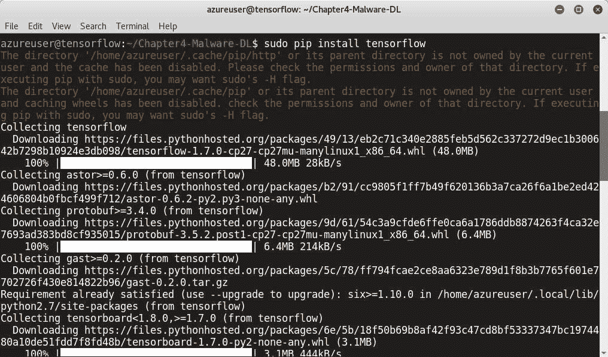
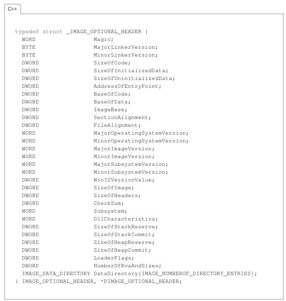
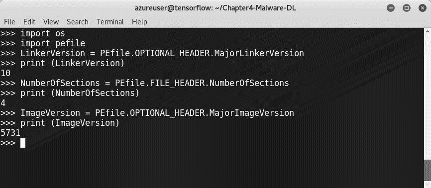

# 第四章：使用深度学习进行恶意软件检测

人类大脑是一个迷人的实体。我们的潜意识和无意识思维的力量是不可思议的。使这种力量变得真实的是我们不断自学和快速适应的能力。这种自然的惊人天赋可以在你意识到之前计算数十亿个任务。几十年来，科学家一直在努力构建能够像人类大脑一样同时执行任务的机器，换句话说，能够高效地以令人难以置信的速度执行大量任务的系统。一个名为**深度学习（DL）**的机器学习子领域应运而生，帮助我们构建像人类大脑一样工作并受其结构启发的算法。信息安全专业人员也对这些技术感兴趣，因为它们在防御重大网络威胁和攻击方面取得了有希望的结果。深度学习的最佳实施候选之一是恶意软件分析。

在本章中，我们将发现：

+   人工神经网络：深入概述

+   如何使用 Python 构建你的第一个神经网络

+   如何使用多层感知器构建恶意软件检测器

+   恶意软件可视化技术以及如何使用卷积神经网络构建恶意软件分类器

# 技术要求

基本上，在本章中，我们将使用已经安装的相同的 Python 库。通常情况下，我们将在本书的大多数章节中使用这些库。因此，我们在第一章花了时间教你如何安装我们在大多数章节和项目中将要使用的所有必需库。在此链接找到代码文件：[`github.com/PacktPublishing/Mastering-Machine-Learning-for-Penetration-Testing/tree/master/Chapter04`](https://github.com/PacktPublishing/Mastering-Machine-Learning-for-Penetration-Testing/tree/master/Chapter04)。

# 人工神经网络概述

我们的大脑在眨眼之间执行许多复杂的功能。因此，为了构建能够执行和学习使用与人类思维相同的技术的算法，我们必须了解大脑的工作原理是至关重要的。通过对人类大脑功能的公平理解，我们将更好地理解深度学习。三个主要的独特的大脑功能是：

+   思考（分析、比较和判断）

+   情感（快乐、悲伤和兴奋）

+   渴望（动机、欲望和目标）

这三个功能在一个动态的过程中不断地相互作用。

大脑主要由三个部分组成：**大脑皮层**，它是大脑的最大部分，控制着视觉、听觉和味觉等高级功能；**小脑**，它负责协调肌肉运动和人体的一般姿势，包括平衡；第三部分称为**脑干**，它连接了前两部分并控制许多其他任务，包括打喷嚏、咳嗽和消化。

大脑通过其不同的部分执行复杂的操作。从逻辑上讲，人类大脑的解剖结构由许多区域组成，因此每个区域都基于特定的算法工作。尽管大脑的每个部分都使用自己的算法工作，但令人惊讶的是，人类大脑基本上使用相同的算法来理解许多不同的输入模式。这个假设被称为**一个学习算法**假设。1992 年*Roe 等人*进行的许多研究证明了这一点，特别是雪貂实验，其中视觉输入被插入到雪貂大脑的听觉部分，听觉皮层学会了如何看。

以下图表描述了**人工智能（AI）**、**机器学习（ML）**和**深度学习（DL）**之间的关系：



从生物学上讲，人类大脑由数十亿个称为神经元的小器官组成。神经元是通过电信号和化学信号处理和传递信息的单位。这些神经细胞主要由以下组成：

+   树突

+   轴突

+   突触

+   细胞体

+   细胞核

以下图表说明了生物神经元的不同组成部分：


生物神经元的类比表示被称为**感知器**。感知器可以分解为：

+   输入

+   权重

+   净输入函数

+   激活函数

+   输出

感知器和人类神经元之间的类比并不完全正确。它只是用来让人们对感知器的工作有所了解。人类大脑比人工神经网络复杂得多。有一些相似之处，但直接将大脑和神经网络进行比较是不合适的。

# 在 Python 中实现神经网络

经典的计算机程序在基于一系列指令和算术的计算操作方面表现出色，但在许多其他情况下都面临困难和挑战；例如，手写识别。作为热身，让我们构建一个手写数字识别器，以便有机会安装下一节中所需的 Python 库，并学习如何在 Python 中构建和实现我们的第一个神经网络。要训练模型，我们需要用数据来喂养它。在我们的实现中，我们将使用 MNIST 数据集：



首先，让我们使用`pip install`命令安装`keras`库，如下所示：

```py
# pip install keras
```


然后，使用以下命令安装 TensorFlow（`tensorflow`）：

```py
# pip install tensorflow
```



最后，安装`np_utils`：

```py
# pip install np_utils
```


打开 Python 命令行界面，并使用导入命令导入以下模块：

+   `mnist` 数据集

+   `Sequential` 模型

+   `Dense` 和 `Dropout` 层

+   `np_utils` 模块

```py
>>> from keras.models import Sequential
>>> from keras.layers import Dense
>>> from keras.layers import Dropout
>>> from keras.utils import np_utils
```

以下图表说明了前面的代码：


使用种子是因为我们希望结果是可重复的。`numpy.random.seed(seed)`用于给生成器设定种子：

```py
>>> seed = 7
>>> numpy.random.seed(seed)
>>> (X_train, y_train), (X_test, y_test) = mnist.load_data()
```

从[`s3.amazonaws.com/img-datasets/mnist.pkl.gz`](https://s3.amazonaws.com/img-datasets/mnist.pkl.gz)下载数据：

```py
>>> num_pixels = X_train.shape[1] * X_train.shape[2]
>>> X_train = X_train.reshape(X_train.shape[0], num_pixels).astype('float32')
>>> X_test = X_test.reshape(X_test.shape[0], num_pixels).astype('float32')
>>> X_train = X_train / 255
>>> X_test = X_test / 255

>>> y_train = np_utils.to_categorical(y_train)
>>> y_test = np_utils.to_categorical(y_test)
>>> num_classes = y_test.shape[1]
>>> model = Sequential()
>>>model.add(Dense(num_pixels, input_dim=num_pixels, activation='relu'))
>>>model.add(Dense(num_classes,activation='softmax'))
>>>model.compile(loss='categorical_crossentropy', optimizer='adam', metrics=['accuracy'])
```

这里，`.astype()`用于转换变量，`.reshape()`用于给数组一个新的形状而不改变数据：


我们手写数字分类器的准确率为 99.8%，这是一个惊人的结果。现在我们已经学会了如何构建我们的第一个神经网络程序，是时候利用我们的技能并亲自体验如何使用人工神经网络构建恶意软件分类器，特别是 DL 网络了。

# 使用 PE 头构建深度学习模型

根据我们学到的概念，我们将使用人工神经网络构建一个恶意软件检测器。让我们从识别我们的数据集开始。到目前为止，您已经熟悉了构建机器学习模型所需的步骤。对于这个模型，我们将使用**可移植可执行文件**（**PE**）文件作为输入数据。正如您在上一章中注意到的，我们安装了一个名为`pefile`的 Python 库。现在是时候在这个模型中使用它了。一旦我们使用 Python 包安装管理器 PIP 安装了`pefile`，我们就可以开始使用`pefile`从任何 PE 文件中提取信息。为了从 PE 文件中收集信息，导入`os`和`pefile`库。`os`库允许您与 Python 正在运行的底层操作系统进行交互。

作为演示，我们将下载由 Palo Alto 网络提供的用于实验目的的恶意软件 PE 文件。使用`wget`命令下载如下：

```py
# wget https://wildfire.paloaltonetworks.com/publicapi/test/pe  
```

安装 PE 文件后，打开 Python 环境并导入所需的库，如下所示：

```py
>>> import os
>>> import pefile
```

使用以下命令加载文件：

```py
>>> PEfile = pefile.PE("pe", fast_load=True)
```

现在我们能够从 PE 文件中提取`PE_HEADER_OPTIONAL`信息，包括`MajorLinkerVersion`、`MajorLinkerVersion`、`SizeOfImage`和`DllCharacteristics`。您可以通过查看微软文档找到完整的列表：



在下面的脚本中，我提取了关于的信息：

+   `LinkerVersion`

+   `NumberOfSections`

+   `ImageVersion`



我们知道，训练模型在计算方面是一个高消耗的任务。因此，处理和提供所有头信息给模型并不是一个明智的决定。因此，我们需要对其进行特征工程。选择好的特征是每个数据科学任务中需要的技能。Adobe Systems 的**产品安全事件响应团队**（**PSIRT**）的 Karthik Raman 进行的一项名为*选择用于分类恶意软件的特征*的研究提出了解决这个问题的建议，建议我们选择最重要的 PE 头部，它们如下：

+   `DebugSize`

+   `DebugRVA`

+   `ImageVersion`

+   `OperatingSystemVersion`

+   `SizeOfStackReserve`

+   `LinkerVersion`

+   `DllCharacteristics`

+   `IatRVA`

+   `ExportSize`

+   `ExportRVA`

+   `ExportNameLen`

+   `ResourceSize`

+   `ExportFunctionsCount`

要提取它们，您可以像之前一样使用导入的`PEfile`模块：

```py
DebugSize = PEfile.OPTIONAL_HEADER.DATA_DIRECTORY[6].Size
print (DebugSize)
DebugRVA = PEfile.OPTIONAL_HEADER.DATA_DIRECTORY[6].VirtualAddress
print (DebugRVA)
 ImageVersion = PEfile.OPTIONAL_HEADER.MajorImageVersion
 print (ImageVersion)
OSVersion = PEfile.OPTIONAL_HEADER.MajorOperatingSystemVersion
print (OSVersion)
ExportRVA = PEfile.OPTIONAL_HEADER.DATA_DIRECTORY[0].VirtualAddress
 print (ExportRVA)
ExportSize = PEfile.OPTIONAL_HEADER.DATA_DIRECTORY[0].Size
print (ExportSize)
IATRVA = PEfile.OPTIONAL_HEADER.DATA_DIRECTORY[12].VirtualAddress
 print (IATRVA)
ResSize = PEfile.OPTIONAL_HEADER.DATA_DIRECTORY[2].Size
 print (ResSize)
LinkerVersion = PEfile.OPTIONAL_HEADER.MajorLinkerVersion
 print (LinkerVersion)
NumberOfSections = PEfile.FILE_HEADER.NumberOfSections
 print (NumberOfSections)
StackReserveSize = PEfile.OPTIONAL_HEADER.SizeOfStackReserve
 print (StackReserveSize)
Dll = PEfile.OPTIONAL_HEADER.DllCharacteristics
print (Dll)
```


为了训练模型，有许多公开可用的来源。您可以从大量的组织和教育机构的列表中下载不同类型的文件（清洁和恶意）：

+   **ViruSign**: [`www.virusign.com/`](http://www.virusign.com/)

+   **MalShare**: [`malshare.com/`](http://malshare.com/)

+   **Malware DB**: [`ytisf.github.io/theZoo/`](http://ytisf.github.io/theZoo/)

+   **Endgame Malware BEnchmark for Research (EMBER)**：这是最大的数据集之一，包含 2017 年某个时候扫描的 1.1 百万个 PE 文件的 SHA256 哈希值。我强烈建议您下载并尝试使用它构建您的模型。您可以从[`pubdata.endgame.com/ember/ember_dataset.tar.bz2`](https://pubdata.endgame.com/ember/ember_dataset.tar.bz2)下载（1.6 GB，扩展到 9.2 GB）：


您的数据集应包含两类 PE 文件：**清洁**和**恶意文件**。我们需要至少 10,000 个文件来训练模型。您将需要开始使用先前的脚本提取头信息。您可以通过自己开发自动化脚本来自动化任务。可以使用任何编程语言。最好的方法是将所有文件的选定特征导出到 CSV 文件中，这样我们可以使用前几章学到的知识，以后可以使用 pandas 加载它们：

```py
Malware  = pd.read_csv("Malware.csv")
Clean_Files = pd.read_csv("Clean_Files.csv")
```

准备好特征后，我们需要将两种类型的数据合并为一种。例如，我们可以使用`pd.concat`来合并这两个文件。为了训练模型，我们需要导入所需的模块：

```py
>>> import numpy as np
>>> from sklearn.model_selection import train_test_split
>>> from sklearn.metrics import confusion_matrix
>>> from sklearn.neural_network import MLPClassifier
>>> from sklearn.preprocessing import StandardScaler
```

数据准备：

```py
y = dataset['Clean_Files']
X = dataset.drop('Clean_Files',axis = 1)
X = np.asarray(X)
y = np.asarray(y)
```

这行是用于分割，就像我们在其他模型中做的那样：

```py
X_train,X_test,y_train,y_test = train_test_split(X,y,test_size = 0.3,random_state=0)
```

为了更好的预测，我们可以使用`StandScaler()`；它用于通过去除均值和缩放到单位方差来标准化特征：

```py
scaler = StandardScaler()
scaler.fit(X_train)
X_train = scaler.transform(X_train)
X_test = scaler.transform(X_test)
```

准备和特征工程数据后，我们必须构建**多层感知器**（**MLP**）网络：

```py
MLP = MLPClassifier(hidden_layer_sizes=(12,12,12,12,12,12))
```

这里，`12`是层数和特征数。让我们训练模型并计算预测：

```py
MLP.fit(X_train,y_train)
Predictions = MLP.predict(X_test)
```

要检查评估指标，请添加以下行：

```py
TN, FP, FN TP = confusion_matrix(y_test,predictions).ravel()
```

在这里使用`ravel()`返回一个连续的扁平数组。它相当于`reshape(-1, order=order)`：

```py
print ("True Positive:" , TP)
print ("True Negative:" , TN)
print ("False Positive:" , FP)
print ("False Negative:" , FN)
```

# 使用卷积神经网络和恶意软件可视化的深度学习模型

上一节是用 MLP 网络来检测恶意软件的真实实现。现在，我们将探索其他人工网络架构，并学习如何使用其中之一来帮助恶意软件分析师和信息安全专业人员检测和分类恶意代码。在深入技术细节和 DL 方法的实际实施步骤之前，了解和发现其他不同的人工神经网络架构是至关重要的。我们在第一章中简要讨论了其中一些。现在讨论主要的人工神经网络。

# 卷积神经网络（CNN）

**卷积神经网络**（**CNNs**）是解决图像分类问题的深度学习方法，或者我们称之为计算机视觉问题，因为经典的计算机程序面临许多挑战和困难，无法识别对象，包括光照，视角，变形和分割。这种技术受到了眼睛工作的启发，特别是动物视觉皮层功能算法。在 CNN 中，以宽度，高度和深度为特征排列成三维结构。对于图像，高度是图像高度，宽度是图像宽度，深度是 RGB 通道。要构建 CNN，我们需要三种主要类型的层：

+   **卷积层**：卷积操作是指从输入图像中提取特征，并将滤波器中的值与原始像素值相乘

+   **池化层**：池化操作减少每个特征图的维度

+   **全连接层**：全连接层是具有 softmax 激活函数的经典多层感知器

要使用 Python 实现 CNN，可以使用以下 Python 脚本：

```py
import numpy
from keras.datasets import mnist
from keras.models import Sequential
from keras.layers import Dense
from keras.layers import Dropout
from keras.layers import Flatten
from keras.layers.convolutional import Conv2D
from keras.layers.convolutional import MaxPooling2D
from keras.utils import np_utils
from keras import backend 
backend.set_image_dim_ordering('th')

model = Sequential()
model.add(Conv2D(32, (5, 5), input_shape=(1, 28, 28), activation='relu'))
model.add(MaxPooling2D(pool_size=(2, 2)))
model.add(Dropout(0.2))
model.add(Flatten())
model.add(Dense(128, activation='relu'))
model.add(Dense(num_classes, activation='softmax'))
model.compile(loss='categorical_crossentropy', optimizer='adam', metrics=['accuracy'])
```

# 循环神经网络（RNNs）

**循环神经网络**（**RNNs**）是人工神经网络，我们可以利用序列信息，例如句子。换句话说，RNN 对序列的每个元素执行相同的任务，输出取决于先前的计算。RNN 广泛用于语言建模和文本生成（机器翻译，语音识别等许多应用）。RNN 不能长时间记住事情。

# 长短期记忆网络

**长短期记忆**（**LSTM**）通过构建一个记忆块来解决循环神经网络中的短期记忆问题。这个块有时被称为**记忆单元**。

# Hopfield 网络

Hopfield 网络是由 John Hopfield 于 1982 年开发的。Hopfield 网络的主要目标是自动关联和优化。我们有两类 Hopfield 网络：**离散**和**连续**。

# 玻尔兹曼机网络

玻尔兹曼机网络使用循环结构，只使用局部可用信息。它们是由 Geoffrey Hinton 和 Terry Sejnowski 于 1985 年开发的。此外，玻尔兹曼机的目标是优化解决方案。

# 使用 CNN 进行恶意软件检测

对于这个新模型，我们将探讨如何使用 CNN 构建恶意软件分类器。但我敢打赌，你一定想知道我们如何做到这一点，因为 CNN 是以图像作为输入的。答案很简单，这里的诀窍是将恶意软件转换为图像。这可能吗？是的，是可能的。在过去几年中，恶意软件可视化是许多研究课题之一。其中一种提出的解决方案来自一项名为*Malware Images: Visualization and Automatic Classification*的研究，作者是加州大学圣巴巴拉分校的 Vision Research Lab 的*Lakshmanan Nataraj*。

以下图表详细说明了如何将恶意软件转换为图像：


以下是**Alueron.gen!J**恶意软件的图像：


这种技术还使我们能够以详细的方式可视化恶意软件部分：


通过解决如何通过图像为使用 CNN 的恶意软件机器学习分类器提供数据的问题，信息安全专业人员可以利用 CNN 的力量来训练模型。最经常用来为 CNN 提供数据的恶意软件数据集之一是**Malimg 数据集**。这个恶意软件数据集包含来自 25 个不同恶意软件家族的 9,339 个恶意软件样本。您可以从 Kaggle（一个用于预测建模和分析竞赛的平台）下载它，访问以下链接：[`www.kaggle.com/afagarap/malimg-dataset/data`](https://www.kaggle.com/afagarap/malimg-dataset/data)。

这些是恶意软件家族：

+   Allaple.L

+   Allaple.A

+   Yuner.A

+   Lolyda.AA 1

+   Lolyda.AA 2

+   Lolyda.AA 3

+   C2Lop.P

+   C2Lop.gen!G

+   即时访问

+   Swizzor.gen!I

+   Swizzor.gen!E

+   VB.AT

+   Fakerean

+   Alueron.gen!J

+   Malex.gen!J

+   Lolyda.AT

+   Adialer.C

+   Wintrim.BX

+   Dialplatform.B

+   Dontovo.A

+   Obfuscator.AD

+   Agent.FYI

+   Autorun.K

+   Rbot!gen

+   Skintrim.N

将恶意软件转换为灰度图像后，您可以获得以下恶意软件表示，以便以后用于为机器学习模型提供数据：


将每个恶意软件转换为灰度图像可以使用以下 Python 脚本完成：

```py
import os
import scipy
import array
 filename = '<Malware_File_Name_Here>';
 f = open(filename,'rb');
 ln = os.path.getsize(filename);
width = 256;
 rem = ln%width;
 a = array.array("B");
 a.fromfile(f,ln-rem);
 f.close();
 g = numpy.reshape(a,(len(a)/width,width));
 g = numpy.uint8(g);
 scipy.misc.imsave('<Malware_File_Name_Here>.png',g);
```

对于特征选择，您可以提取或使用任何图像特征，比如纹理模式、图像中的频率、强度或颜色特征，使用不同的技术，比如**欧几里得距离**，或者均值和标准差，以后生成特征向量。在我们的情况下，我们可以使用诸如颜色布局描述符、均匀纹理描述符或**全局图像描述符**（**GIST**）等算法。假设我们选择了 GIST；`pyleargist`是一个很棒的 Python 库来计算它。要安装它，像往常一样使用 PIP：

```py
# pip install pyleargist==1.0.1
```

作为一个用例，要计算 GIST，您可以使用以下 Python 脚本：

```py
import Image
Import leargist
 image = Image.open('<Image_Name_Here>.png');
 New_im = image.resize((64,64));
des = leargist.color_gist(New_im);
Feature_Vector = des[0:320];
```

这里，`320`指的是我们使用灰度图像时的前`320`个值。不要忘记将它们保存为*NumPy 数组*，以便以后用于训练模型。

在获得特征向量之后，我们可以训练许多不同的模型，包括 SVM、k-means 和人工神经网络。其中一个有用的算法是 CNN 的算法。

特征选择和工程完成后，我们可以构建 CNN。例如，对于我们的模型，我们将构建一个具有两个卷积层的卷积网络，输入为*32 * 32*。使用 Python 库构建模型时，我们可以使用之前安装的 TensorFlow 和 utils 库来实现它。

因此，整体的 CNN 架构将如下图所示：


这种 CNN 架构不是构建模型的唯一提议，但目前我们将用它来实现。

要构建模型和一般的 CNN，我强烈推荐 Keras。所需的导入如下：

```py
import keras
 from keras.models import Sequential,Input,Model
 from keras.layers import Dense, Dropout, Flatten
 from keras.layers import Conv2D, MaxPooling2D
 from keras.layers.normalization import BatchNormalization
 from keras.layers.advanced_activations import LeakyReLU
```

正如我们之前讨论的，灰度图像的像素值范围从 0 到 255，我们需要将*32 * 32 * 1*维度的图像作为结果输入到网络中：

```py
train_X = train_X.reshape(-1, 32,32, 1)
test_X = test_X.reshape(-1, 32,32, 1)
```

我们将使用以下参数训练我们的网络：

```py
batch_size = 64
epochs = 20
num_classes = 25
```

要构建架构，关于其格式，使用以下内容：

```py
Malware_Model = Sequential()
Malware_Model.add(Conv2D(32, kernel_size=(3,3),activation='linear',input_shape=(32,32,1),padding='same'))
Malware_Model.add(LeakyReLU(alpha=0.1))
Malware_model.add(MaxPooling2D(pool_size=(2, 2),padding='same'))
Malware_Model.add(Conv2D(64, (3, 3), activation='linear',padding='same'))
Malware_Model.add(LeakyReLU(alpha=0.1))
Malware_Model.add(Dense(1024, activation='linear'))
Malware_Model.add(LeakyReLU(alpha=0.1))
Malware_Model.add(Dropout(0.4))
Malware_Model.add(Dense(num_classes, activation='softmax'))
```

要编译模型，使用以下内容：

```py
Malware_Model.compile(loss=keras.losses.categorical_crossentropy, optimizer=keras.optimizers.Adam(),metrics=['accuracy'])
```

适应并训练模型：

```py
Malware_Model.fit(train_X, train_label, batch_size=batch_size,epochs=epochs,verbose=1,validation_data=(valid_X, valid_label))
```

正如您注意到的，我们尊重了在前几章中讨论的训练神经网络的流程。要评估模型，使用以下代码：

```py
Malware_Model.evaluate(test_X, test_Y_one_hot, verbose=0)
print('The accuracy of the Test is:', test_eval[1])
```

# 将深度学习应用于恶意软件检测的承诺和挑战

机器学习从业者和恶意软件分析师提出了许多不同的深度网络架构，用于检测已知和未知的恶意软件；一些提出的架构包括受限玻尔兹曼机和混合方法。您可以在*进一步阅读*部分中查看其中一些。检测恶意软件和恶意软件的新方法显示出许多有希望的结果。然而，恶意软件分析师在使用深度学习网络检测恶意软件时面临许多挑战，特别是在分析 PE 文件时，因为要分析 PE 文件，我们将每个字节作为一个输入单元，因此我们需要处理包含数百万步的序列分类，另外还需要保持由于函数调用和跳转命令而产生的复杂的空间相关性。

# 总结

恶意软件对每个现代组织来说都是一场噩梦。攻击者和网络犯罪分子总是想出新的恶意软件来攻击他们的目标。安全供应商正在尽力防御恶意软件攻击，但不幸的是，每月发现数百万种恶意软件，他们无法做到。因此，需要新的方法，这正是我们在本章和上一章中研究的内容。我们发现了如何使用不同的机器学习算法构建恶意软件检测器，特别是利用深度学习技术的力量。在下一章中，我们将学习如何通过构建和开发强大的智能系统来检测僵尸网络。

# 问题

1.  MLP 网络和深度学习网络之间有什么区别？

1.  为什么最近 DL 开始起飞？

1.  为什么我们需要通过不同的模型进行多次迭代？

1.  翻译英语到法语语言需要哪种 DL 类型？

1.  为什么恶意软件可视化是分类恶意软件的好方法？

1.  激活函数的作用是什么？

1.  你能提到三种 DL 架构吗？

# 进一步阅读

+   **博客文章**：

+   Keras 教程：Python 中的深度学习（[`www.datacamp.com/community/tutorials/deep-learning-python`](https://www.datacamp.com/community/tutorials/deep-learning-python)）

+   使用 Keras 逐步在 Python 中开发您的第一个神经网络（[`machinelearningmastery.com/tutorial-first-neural-network-python-keras/`](https://machinelearningmastery.com/tutorial-first-neural-network-python-keras/)）

+   手写数字的 MNIST 数据库（[`yann.lecun.com/exdb/mnist`](http://yann.lecun.com/exdb/mnist)/）

+   **论文和演示**：

+   恶意软件家族的高维可视化（[`www.rsaconference.com/writable/presentations/file_upload/tta-f04-high-dimensional-visualization-of-malware-families.pdf`](https://www.rsaconference.com/writable/presentations/file_upload/tta-f04-high-dimensional-visualization-of-malware-families.pdf)）

+   基于深度学习的混合恶意代码检测方法（[`www.covert.io/research-papers/deep-learning-security/A%20Hybrid%20Malicious%20Code%20Detection%20Method%20based%20on%20Deep%20Learning.pdf`](http://www.covert.io/research-papers/deep-learning-security/A%20Hybrid%20Malicious%20Code%20Detection%20Method%20based%20on%20Deep%20Learning.pdf)）

+   使用 API 调用序列中有用的文件访问模式的恶意软件分类的多任务学习模型（[`www.covert.io/research-papers/deep-learning-security/A%20Multi-task%20Learning%20Model%20for%20Malware%20Classification%20with%20Useful%20File%20Access%20Pattern%20from%20API%20Call%20Sequence.pdf`](http://www.covert.io/research-papers/deep-learning-security/A%20Multi-task%20Learning%20Model%20for%20Malware%20Classification%20with%20Useful%20File%20Access%20Pattern%20from%20API%20Call%20Sequence.pdf) )

+   将受限玻尔兹曼机和单侧感知器结合用于恶意软件检测（[`www.covert.io/research-papers/deep-learning-security/Combining%20Restricted%20Boltzmann%20Machine%20and%20One%20Side%20Perceptron%20for%20Malware%20Detection.pdf`](http://www.covert.io/research-papers/deep-learning-security/Combining%20Restricted%20Boltzmann%20Machine%20and%20One%20Side%20Perceptron%20for%20Malware%20Detection.pdf)）

+   用于恶意软件分类的卷积神经网络-论文（[`www.covert.io/research-papers/deep-learning-security/Convolutional%20Neural%20Networks%20for%20Malware%20Classification.pdf`](http://www.covert.io/research-papers/deep-learning-security/Convolutional%20Neural%20Networks%20for%20Malware%20Classification.pdf)）

+   用于恶意软件系统调用序列分类的深度学习（[`www.covert.io/research-papers/deep-learning-security/Deep%20Learning%20for%20Classification%20of%20Malware%20System%20Call%20Sequences.pdf`](http://www.covert.io/research-papers/deep-learning-security/Deep%20Learning%20for%20Classification%20of%20Malware%20System%20Call%20Sequences.pdf)）

+   基于二维二进制程序特征的深度神经网络恶意软件检测（[`www.covert.io/research-papers/deep-learning-security/Deep%20Neural%20Network%20Based%20Malware%20Detection%20Using%20Two%20Dimensional%20Binary%20Program%20Features.pdf`](http://www.covert.io/research-papers/deep-learning-security/Deep%20Neural%20Network%20Based%20Malware%20Detection%20Using%20Two%20Dimensional%20Binary%20Program%20Features.pdf)）

+   DL4MD：智能恶意软件检测的深度学习框架（[`www.covert.io/research-papers/deep-learning-security/DL4MD-%20A%20Deep%20Learning%20Framework%20for%20Intelligent%20Malware%20Detection.pdf`](http://www.covert.io/research-papers/deep-learning-security/DL4MD-%20A%20Deep%20Learning%20Framework%20for%20Intelligent%20Malware%20Detection.pdf)）

+   Droid-Sec：Android 恶意软件检测中的深度学习（[`www.covert.io/research-papers/deep-learning-security/DroidSec%20-%20Deep%20Learning%20in%20Android%20Malware%20Detection.pdf`](http://www.covert.io/research-papers/deep-learning-security/DroidSec%20-%20Deep%20Learning%20in%20Android%20Malware%20Detection.pdf)）

+   HADM：混合分析用于恶意软件检测（[`www.covert.io/research-papers/deep-learning-security/HADM-%20Hybrid%20Analysis%20for%20Detection%20of%20Malware.pdf`](http://www.covert.io/research-papers/deep-learning-security/HADM-%20Hybrid%20Analysis%20for%20Detection%20of%20Malware.pdf)）

+   使用循环网络进行恶意软件分类（[`www.covert.io/research-papers/deep-learning-security/Malware%20Classification%20with%20Recurrent%20Networks.pdf`](http://www.covert.io/research-papers/deep-learning-security/Malware%20Classification%20with%20Recurrent%20Networks.pdf)）
