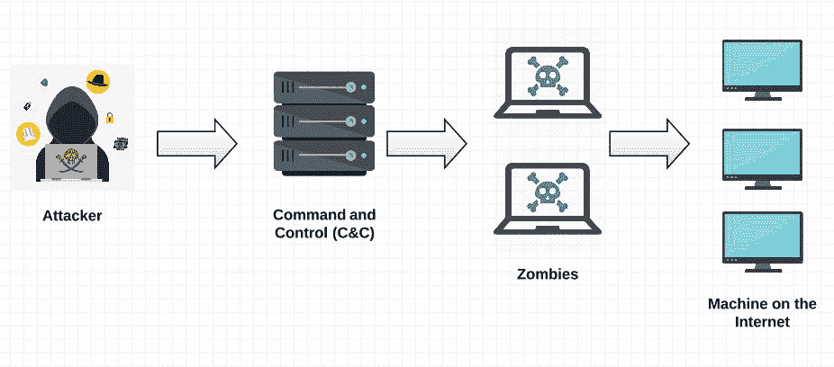
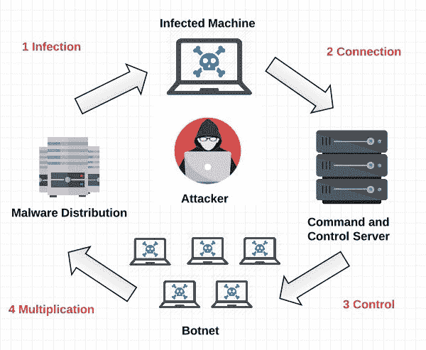
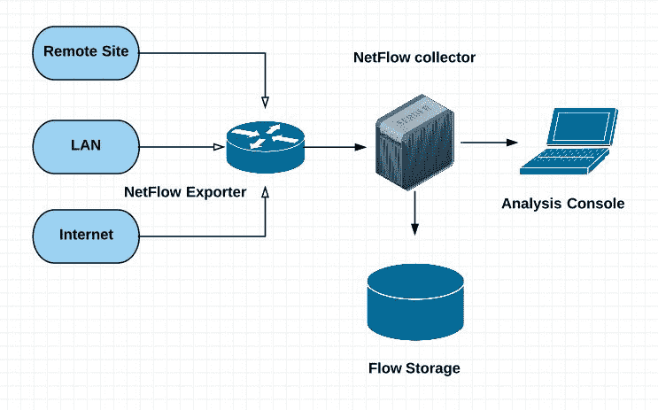
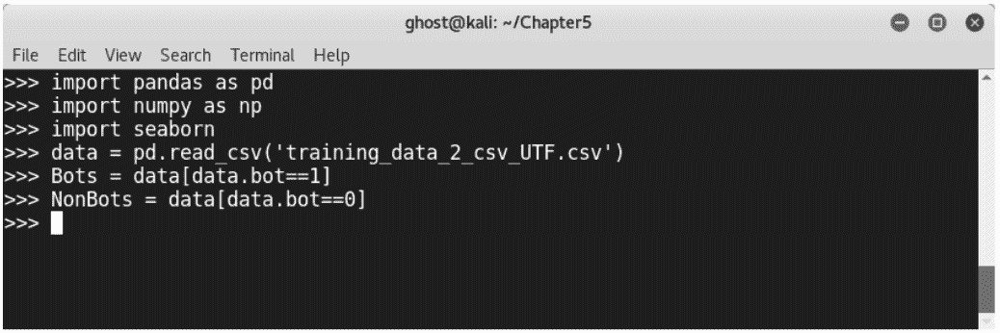
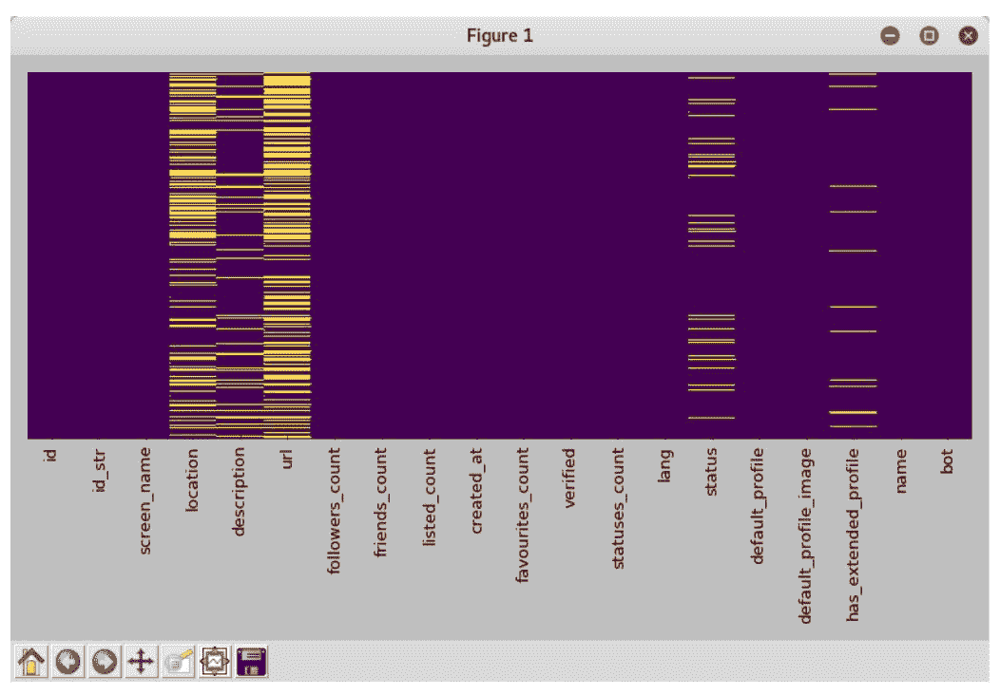

# 机器学习下的僵尸网络检测

如今，连接设备在现代生活中扮演着重要角色。从智能家居电器、计算机、咖啡机和摄像头，到连接的汽车，我们生活方式的巨大转变使我们的生活变得更加轻松。不幸的是，这些暴露的设备可能会受到攻击，并且攻击者和网络犯罪分子可能会稍后使用它们来实施更大规模的攻击。安全供应商提供了许多解决方案和产品来防御僵尸网络，但在本章中，就像我们在之前的章节中所做的那样，我们将学习如何使用 Python 和机器学习技术构建新颖的僵尸网络检测系统。

在本章中，我们将看到：

+   僵尸网络概述

+   如何使用不同的机器学习算法构建僵尸网络检测器

+   如何构建 Twitter 僵尸网络检测器

# 技术要求

您将在以下存储库中找到所有讨论的代码，以及其他一些有用的脚本：[`github.com/PacktPublishing/Mastering-Machine-Learning-for-Penetration-Testing/tree/master/Chapter5`](https://github.com/PacktPublishing/Mastering-Machine-Learning-for-Penetration-Testing/tree/master/Chapter5)。

# 僵尸网络概述

僵尸网络是**bot**和**net**两个术语的组合。bot 部分表示这种恶意软件自动化事物和任务，就像机器人一样。第二部分指的是网络，换句话说，是一组受损设备的网络。因此，根据定义，僵尸网络是一种恶意软件，它攻击互联网上的计算机，并通过命令和控制服务器控制它们执行各种自动化任务，包括发送垃圾邮件和执行**分布式拒绝服务**（**DDoS**）攻击。受攻击的机器加入了一个庞大的受损机器网络。以前几年最引人注目的僵尸网络之一是*Mirai 僵尸网络*。Mirai 在日语中意为*未来*。这个僵尸网络攻击了数百万在线设备，特别是**物联网**（**IoT**）设备，通过扫描和识别易受攻击的机器，利用大多数设备使用默认登录凭据的事实。僵尸网络执行的一些任务包括：

+   广告欺诈和发送垃圾邮件

+   加密货币挖矿

+   窃取个人数据和敏感信息

+   执行 DDoS 攻击

+   执行暴力攻击

以下图表描述了僵尸网络生态系统的不同参与者：



黑客是一项有方法的任务。罪犯和网络攻击者通常使用相同的定义步骤。作为渗透测试人员和信息安全专业人员，您了解黑客阶段，即信息收集，或者我们所说的侦察；扫描；获取访问权限；保持访问权限；最后清除痕迹。因此，僵尸网络通常遵循一些定义的步骤。僵尸网络基于四个不同的阶段工作：

+   **感染**：在这个阶段，攻击者通过发送恶意软件感染目标机器。

+   **连接**：在这个阶段，僵尸网络与控制和命令服务器建立互联网连接，以接收命令和自动任务。

+   **控制**：在这个阶段，攻击发生，例如发送垃圾邮件。

+   **繁殖**：在这个阶段，僵尸网络将尝试感染更多的机器加入网络，并成为我们所说的**僵尸**：



# 使用多种机器学习技术构建僵尸网络检测器模型

在本节中，我们将学习如何使用许多机器学习算法构建不同的僵尸网络检测系统。作为第一个实验室的开始，让我们通过使用不同的分类器构建基于机器学习的僵尸网络检测器。到目前为止，我希望您已经清楚地了解了构建机器学习系统的主要步骤。因此，我相信您已经知道，作为第一步，我们需要寻找一个数据集。许多教育机构和组织都提供了从内部实验室收集的数据集。最知名的僵尸网络数据集之一称为**CTU-13**数据集。这是捷克共和国 CTU 大学提供的带有僵尸网络、正常和背景流量的标记数据集。在他们的工作中，他们试图捕获真实的僵尸网络流量与正常流量和背景流量混合在一起。要下载数据集并查看更多信息，您可以访问以下链接：[`mcfp.weebly.com/the-ctu-13-dataset-a-labeled-dataset-with-botnet-normal-and-background-traffic.html`](https://mcfp.weebly.com/the-ctu-13-dataset-a-labeled-dataset-with-botnet-normal-and-background-traffic.html)。

数据集是双向 NetFlow 文件。但是什么是双向 NetFlow 文件？Netflow 是由思科开发的互联网协议。该协议的目标是收集 IP 流量信息并监视网络流量，以便更清晰地了解网络流量流动。NetFlow 架构的主要组件是**NetFlow Exporter**、**Netflow 收集器**和**流存储**。以下图示了 NetFlow 基础设施的不同组件：



就 NetFlow 而言，当主机 A 向**主机 B**发送信息，然后从**主机 B**回复给**主机 A**时，该操作被称为单向 NetFlow。发送和回复被视为不同的操作。在双向 NetFlow 中，我们将来自**主机 A**和**主机 B**的流视为一个流。通过以下命令下载数据集：

```py
$ wget --no-check-certificate https://mcfp.felk.cvut.cz/publicDatasets/CTU-13-Dataset/CTU-13-Dataset.tar.bz2
```


通过以下命令提取下载的`tar.bz2`文件：

```py
# tar xvjf  CTU-13-Dataset.tar.bz2
```


该文件包含所有数据集，具有不同的场景。为了演示，我们将使用数据集 8（场景 8）。您可以选择任何场景，也可以使用自己收集的数据，或者其他机构提供的任何其他`.binetflow`文件：


使用 pandas 通常加载数据：

```py
>>> import pandas as pd
>>> data = pd.read_csv("capture20110816-3.binetflow")
>>> data['Label'] = data.Label.str.contains("Botnet")
```

在任何数据中心项目中，探索数据是至关重要的。例如，您可以从检查特征或列的名称开始：

```py
>> data.columns
```

该命令会显示数据集的列：`StartTime`、`Dur`、`Proto`、`SrcAddr`、`Sport`、`Dir`、`DstAddr`、`Dport`、`State`、`sTos`、`dTos`、`TotPkts`、`TotBytes`、`SrcBytes`和`Label`。这些列代表数据集中使用的特征；例如，`Dur`代表持续时间，`Sport`代表源端口，依此类推。您可以在本章的 GitHub 存储库中找到特征的完整列表。

在训练模型之前，我们需要构建一些脚本来准备数据。这一次，我们将构建一个单独的 Python 脚本来准备数据，稍后我们可以将其导入到主脚本中。

我将称第一个脚本为`DataPreparation.py`。有许多提案可以帮助提取特征并准备数据以构建使用机器学习的僵尸网络检测器。在我们的案例中，我根据*NagabhushanS*构建的数据加载脚本定制了两个新脚本：

```py
from __future__ import division
import os, sys
import threading
```

在导入所需的 Python 包后，我们创建了一个名为`Prepare`的类来选择训练和测试数据：

```py
class Prepare(threading.Thread): 
def __init__(self, X, Y, XT, YT, accLabel=None):
 threading.Thread.__init__(self)
 self.X = X
 self.Y = Y
 self.XT=XT
 self.YT=YT
 self.accLabel= accLabel

def run(self):
 X = np.zeros(self.X.shape)
 Y = np.zeros(self.Y.shape)
 XT = np.zeros(self.XT.shape)
 YT = np.zeros(self.YT.shape)
 np.copyto(X, self.X)
 np.copyto(Y, self.Y)
 np.copyto(XT, self.XT)
 np.copyto(YT, self.YT)
 for i in range(9):
 X[:, i] = (X[:, i] - X[:, i].mean()) / (X[:, i].std())
 for i in range(9):
 XT[:, i] = (XT[:, i] - XT[:, i].mean()) / (XT[:, i].std())
```

第二个脚本称为`LoadData.py`。您可以在 GitHub 上找到它，并直接在您的项目中使用它来从`.binetflow`文件中加载数据并生成一个`pickle`文件。

让我们使用之前开发的内容来训练模型。构建数据加载器并准备我们将要使用的机器学习算法后，是时候训练和测试模型了。

首先，从`pickle`文件中加载数据，这就是为什么我们需要导入`pickle` Python 库。不要忘记使用以下代码导入之前的脚本：

```py
import LoadData
import DataPreparation
import pickle
file = open('flowdata.pickle', 'rb')
data  = pickle.load(file)
```

选择数据部分：

```py
Xdata = data[0]
Ydata =  data[1]
XdataT = data[2]
YdataT = data[3]
```


作为机器学习分类器，我们将尝试许多不同的算法，以便稍后可以选择最适合我们模型的算法。导入所需的模块以使用`sklearn`中的四种机器学习算法：

```py
from sklearn.linear_model import *
from sklearn.tree import *
from sklearn.naive_bayes import *
from sklearn.neighbors import *
```

通过使用之前的模块构建数据。不要忘记通过输入`import DataPreparation`来导入`DataPreparation`：

```py
>>> DataPreparation.Prepare(Xdata,Ydata,XdataT,YdataT)
```

现在，我们可以训练模型了；为此，我们将使用不同的技术来训练模型，以便稍后可以选择最合适的机器学习技术用于我们的项目。步骤与我们在以前的项目中学到的一样：在准备数据并选择特征之后，定义机器学习算法，拟合模型，并在定义其变量后打印出得分。

作为机器学习分类器，我们将测试其中许多。让我们从决策树开始：

+   **决策树模型**：

```py
>>> clf = DecisionTreeClassifier()
>>> clf.fit(Xdata,Ydata)
>>> Prediction = clf.predict(XdataT)
>>> Score = clf.score(XdataT,YdataT)
>>> print (“The Score of the Decision Tree Classifier is”, Score * 100)
```


决策树分类器的得分为 99%

+   **逻辑回归模型**：

```py
>>> clf = LogisticRegression(C=10000)
>>> clf.fit(Xdata,Ydata)
>>> Prediction = clf.predict(XdataT) >>> Score = clf.score(XdataT,YdataT)
```

```py
>>> print ("The Score of the Logistic Regression Classifier is", Score * 100)
```


逻辑回归分类器的得分为 96%

+   **高斯朴素贝叶斯模型**：

```py
>>> clf = GaussianNB()
>>> clf.fit(Xdata,Ydata)
>>> Prediction = clf.predict(XdataT)
>>> Score = clf.score(XdataT,YdataT)
>>> print("The Score of the Gaussian Naive Bayes classifier is", Score * 100)
```


高斯朴素贝叶斯分类器的得分为 72%

+   **k-最近邻模型**：

```py
>>> clf = KNeighborsClassifier()
>>> clf.fit(Xdata,Ydata)
>>> Prediction = clf.predict(XdataT)
>>> Score = clf.score(XdataT,YdataT)
>>> print("The Score of the K-Nearest Neighbours classifier is", Score * 100)
```


k-最近邻分类器的得分为 96%

+   **神经网络模型**：

要构建神经网络模型，请使用以下代码：

```py
>>> from keras.models import *
>>> from keras.layers import Dense, Activation
>>> from keras.optimizers import *

model = Sequential()
model.add(Dense(10, input_dim=9, activation="sigmoid")) model.add(Dense(10, activation='sigmoid'))
model.add(Dense(1))
sgd = SGD(lr=0.01, decay=0.000001, momentum=0.9, nesterov=True) 
model.compile(optimizer=sgd, loss='mse')
model.fit(Xdata, Ydata, nb_epoch=200, batch_size=100)
Score = model.evaluate(XdataT, YdataT, verbose=0)
Print(“The Score of the Neural Network is”, Score * 100  )
```

使用这段代码，我们导入了所需的 Keras 模块，构建了层，用 SGD 优化器编译了模型，拟合了模型，并打印出了模型的得分。

# 如何构建 Twitter 机器人检测器

在之前的部分中，我们看到了如何构建基于机器学习的僵尸网络检测器。在这个新项目中，我们将处理一个不同的问题，而不是防御僵尸网络恶意软件。我们将检测 Twitter 机器人，因为它们也是危险的，可以执行恶意操作。对于模型，我们将使用*NYU Tandon Spring 2017 Machine Learning Competition: Twitter Bot classification*数据集。你可以从这个链接下载它：[`www.kaggle.com/c/twitter-bot-classification/data`](https://www.kaggle.com/c/twitter-bot-classification/data)。导入所需的 Python 包：

```py
>>> import pandas as pd
>>> import numpy as np
>>> import seaborn
```

让我们使用 pandas 加载数据并突出显示机器人和非机器人数据：

```py
>>> data = pd.read_csv('training_data_2_csv_UTF.csv')
>>> Bots = data[data.bot==1]
>> NonBots = data[data.bot==0]
```



# 使用 seaborn 进行可视化

在每个项目中，我都想帮助你发现新的数据可视化 Python 库，因为正如你所看到的，数据工程和可视化对于每个现代数据中心项目都是至关重要的。这一次，我选择了 seaborn 来可视化数据并在开始训练阶段之前探索数据。Seaborn 是一个用于制作统计可视化的 Python 库。以下是使用 seaborn 生成图表的示例：

```py
>>> data = np.random.multivariate_normal([0, 0], [[5, 2], [2, 2]], size=2000)
>>> data = pd.DataFrame(data, columns=['x', 'y'])
>>> for col in 'xy':
... seaborn.kdeplot(data[col], shade=True)
```


例如，在我们的情况下，如果我们想要识别缺失的数据：

```py
matplotlib.pyplot.figure(figsize=(10,6))
 seaborn.heatmap(data.isnull(), yticklabels=False, cbar=False, cmap='viridis')
 matplotlib.pyplot.tight_layout()
```



前两个代码片段是一些学习如何可视化数据的示例。可视化帮助数据科学家探索并了解更多关于数据的信息。现在，让我们回去继续构建我们的模型。

通过选择一些 Twitter 机器人使用的坏词来识别词袋。以下是机器人使用的坏词的示例。当然，你可以添加更多的词：

```py
bag_of_words_bot = r'bot|b0t|cannabis|tweet me|mishear|follow me|updates every|gorilla|yes_ofc|forget' \
r'expos|kill|bbb|truthe|fake|anony|free|virus|funky|RNA|jargon' \                 r'nerd|swag|jack|chick|prison|paper|pokem|xx|freak|ffd|dunia|clone|genie|bbb' \                r'ffd|onlyman|emoji|joke|troll|droop|free|every|wow|cheese|yeah|bio|magic|wizard|face'
```

+   现在，是时候识别训练特征了：

```py
data['screen_name_binary'] = data.screen_name.str.contains(bag_of_words_bot, case=False, na=False)
data['name_binary'] = data.name.str.contains(bag_of_words_bot, case=False, na=False)
data['description_binary'] = data.description.str.contains(bag_of_words_bot, case=False, na=False)
data['status_binary'] = data.status.str.contains(bag_of_words_bot, case=False, na=False)
```

+   特征提取：让我们选择在我们的模型中使用的`features`：

```py
data['listed_count_binary'] = (data.listed_count>20000)==False
 features = ['screen_name_binary', 'name_binary', 'description_binary', 'status_binary', 'verified', 'followers_count', 'friends_count', 'statuses_count', 'listed_count_binary', 'bot']
```

+   现在，用决策树分类器训练模型：

```py
from sklearn.tree import DecisionTreeClassifier
from sklearn.metrics import accuracy_score, roc_curve, auc
from sklearn.model_selection import train_test_split
```

+   我们导入一些先前讨论过的模块：

```py
 X = data[features].iloc[:,:-1]
 y = data[features].iloc[:,-1]
```

+   我们定义分类器：

```py
clf = DecisionTreeClassifier(criterion='entropy', min_samples_leaf=50, min_samples_split=10)
```

+   我们分割分类器：

```py
X_train, X_test, y_train, y_test = train_test_split(X, y, test_size=0.3, random_state=101)
```

+   我们拟合模型：

```py
clf.fit(X_train, y_train)
y_pred_train = clf.predict(X_train)
y_pred_test = clf.predict(X_test)
```

+   我们打印出准确率分数：

```py
print("Training Accuracy: %.5f" %accuracy_score(y_train, y_pred_train))
print("Test Accuracy: %.5f" %accuracy_score(y_test, y_pred_test))
```

我们的模型以 88%的检测率检测到了 Twitter 机器人，这是一个很高的准确率。

这种技术并非检测僵尸网络的唯一可能方式。研究人员提出了许多基于不同机器学习算法的其他模型，例如线性 SVM 和决策树。所有这些技术的准确率都达到了 90%。大多数研究表明，特征工程是改进机器学习模型的关键因素。

要研究一个真实案例，可以查看一篇名为*从学习中学到的东西 - 了解机器学习在僵尸网络攻击中的能力和局限性*的论文（[`arxiv.org/pdf/1805.01333.pdf`](https://arxiv.org/pdf/1805.01333.pdf)），作者是 David Santana，Shan Suthaharan 和 Somya Mohanty。

# 总结

本章是一个轻量级指南，介绍了有关僵尸网络基础知识以及如何使用不同技术构建基于机器学习的检测器。此外，我们还讨论了如何识别 Twitter 机器人。下一章将深入探讨异常情况以及如何使用新方法构建多个项目来识别异常情况。

# 问题

在每章结束后，我们都会给你机会练习所学的知识并评估你的技能。本章的 GitHub 存储库中包含了`Practice`文件夹中的一个僵尸网络流量数据集的链接：

1.  下载数据集并使用 pandas 库加载它

1.  选择合适的特征

1.  识别训练集和测试集，然后将它们导出到一个 pickle 文件中

1.  加载 pickle 文件

1.  导入支持向量机分类器并拟合模型

1.  训练 SVM 模型

1.  打印出构建的模型的准确率

# 进一步阅读

要了解更多关于僵尸网络以及如何使用机器学习检测它们的知识，我强烈建议你查看这些有用的外部链接：

+   **僵尸网络如何扩展以及如何保护自己免受它们的侵害：** [`bitninja.io/blog/2016/01/11/how-botnets-expand-and-how-protect-against-them`](https://bitninja.io/blog/2016/01/11/how-botnets-expand-and-how-protect-against-them)

+   **僵尸网络基础知识 - 不要成为僵尸！**： [`blog.trendmicro.com/botnet-basics/`](https://blog.trendmicro.com/botnet-basics/)

+   **用于僵尸网络检测的深度神经网络**： [`arxiv.org/abs/1802.04289`](https://arxiv.org/abs/1802.04289)

+   **使用深度自动编码器进行物联网僵尸网络攻击的基于网络的检测（N-BaIoT）**： [`arxiv.org/abs/1805.03409`](https://arxiv.org/abs/1805.03409)

+   **用于传感器网络入侵检测的混合谱聚类和深度神经网络集成算法** ([`www.covert.io/research-papers/deep-learning-security/A%20Hybrid%20Spectral%20Clustering%20and%20Deep%20Neural%20Network%20Ensemble%20Algorithm%20for%20Intrusion%20Detection%20in%20Sensor%20Networks.pdf`](http://www.covert.io/research-papers/deep-learning-security/A%20Hybrid%20Spectral%20Clustering%20and%20Deep%20Neural%20Network%20Ensemble%20Algorithm%20for%20Intrusion%20Detection%20in%20Sensor%20Networks.pdf) )

+   **用于僵尸网络检测行为的循环神经网络分析** ([`www.covert.io/research-papers/deep-learning-security/An%20Analysis%20of%20Recurrent%20Neural%20Networks%20for%20Botnet%20Detection%20Behavior.pdf`](http://www.covert.io/research-papers/deep-learning-security/An%20Analysis%20of%20Recurrent%20Neural%20Networks%20for%20Botnet%20Detection%20Behavior.pdf))
