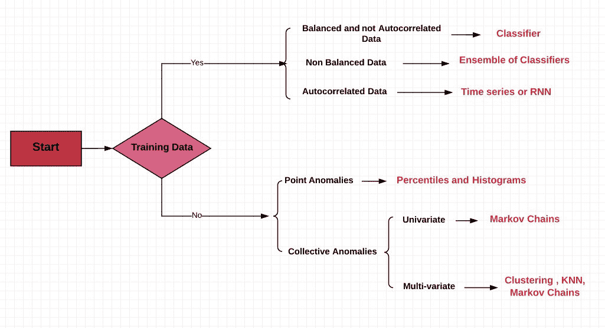
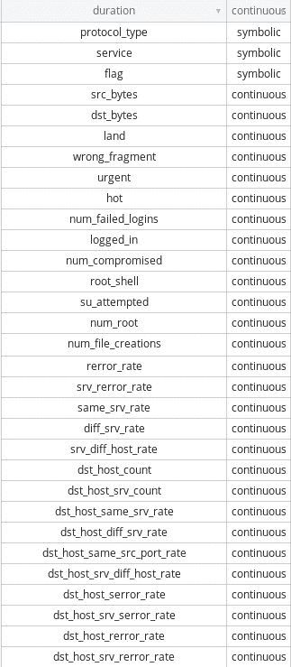
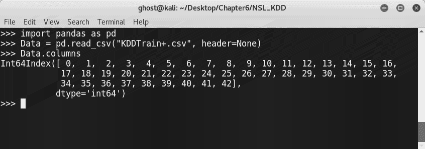
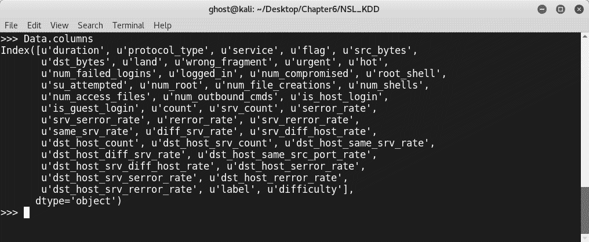
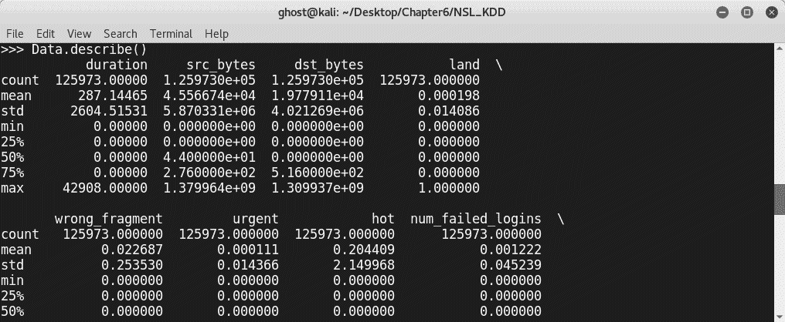
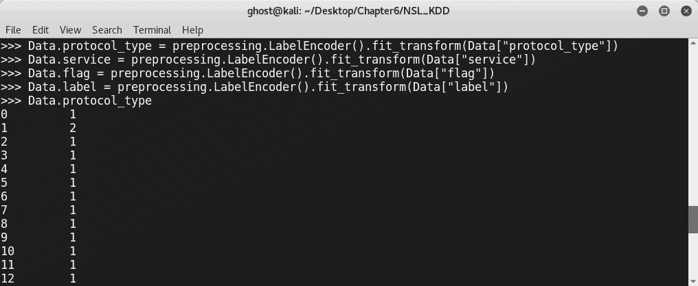
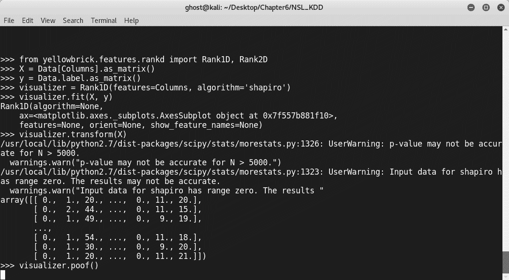
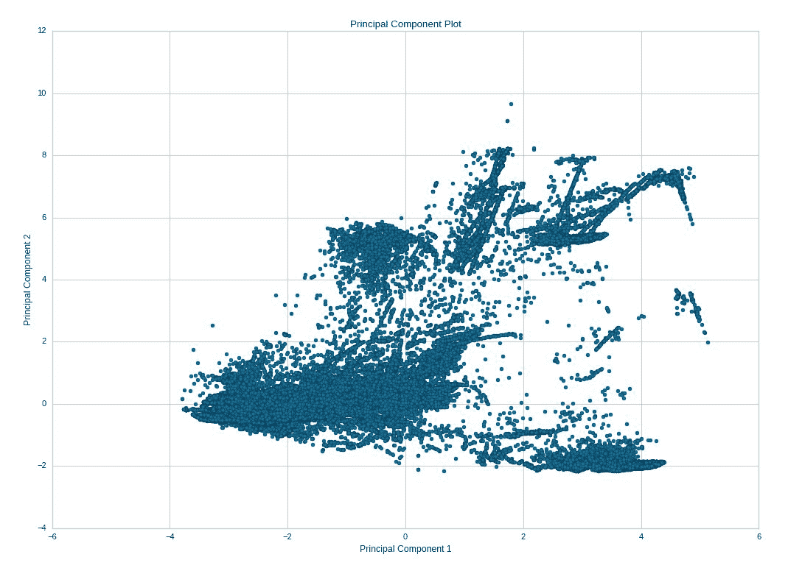
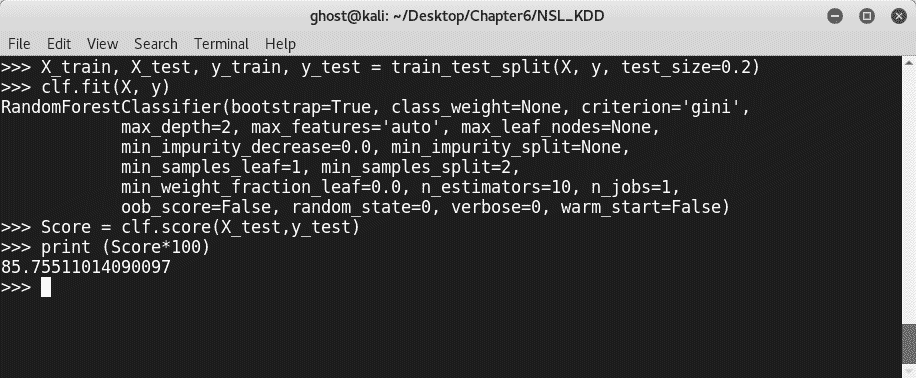

# 异常检测系统中的机器学习

对于任何企业来说，网络上的未经授权活动可能是一场噩梦。保护客户数据是最重要的问题，也是每个企业所有者的责任。部署入侵检测系统是现代组织可以采取的明智决定，以防御恶意入侵。不幸的是，攻击者和黑客总是在想出新的技术来绕过保护，以获取对网络的未经授权访问。这就是为什么机器学习技术是保护网络免受甚至复杂和攻击的良好解决方案。

本章将是发现网络异常并学习如何从头开始构建入侵检测系统的一站式指南，使用公开可用的数据集和尖端的开源 Python 数据科学库。

在本章中，我们将涵盖以下内容：

+   异常检测技术概述

+   网络攻击

+   检测网络异常

+   **基于主机的入侵检测系统**（**HIDS**）

+   **基于网络的入侵检测系统**（**NIDS**）

# 技术要求

本章需要以下要求：

+   本章需要对网络有一定的了解。

+   我们将使用在之前章节中看到的相同的 Python 库，还有一个名为**Yellowbrick**的新库。（你将在本章中找到安装说明。）

+   您可以在 GitHub 存储库中找到本章中使用的代码文件[`github.com/PacktPublishing/Mastering-Machine-Learning-for-Penetration-Testing/tree/master/Chapter06`](https://github.com/PacktPublishing/Mastering-Machine-Learning-for-Penetration-Testing/tree/master/Chapter06)。

# 异常检测技术概述

我们现在将讨论网络异常（这是我们主要关注的内容）及其检测方法。根据定义，异常是指数据中的异常模式，即超出正常范围的意外模式。异常这个术语在数据挖掘中被广泛使用，有时被称为异常值。异常检测技术通常用于欺诈检测和发现恶意活动。在网络中，异常可能由于许多原因而发生，但对我们来说，重要的是恶意活动的检测。通常，我们看到三种类型的异常：

+   **点异常**：与其余数据相比，异常的个别数据实例。

+   **上下文异常**：仅在特定上下文（时间段、地区等）中发生的异常行为。

+   **集体异常**：与其余数据相比，一系列异常活动。

这些异常可以使用许多技术来检测，这些技术基于可用的数据。

# 静态规则技术

如果我们有训练数据，那么我们需要检查数据是否平衡。如果没有训练数据，决策将基于异常类型进行；要检测点异常，建议使用百分位数和直方图。要检测集体异常，决策将基于异常的方差；要检测单变量异常，可以使用马尔可夫链，或者可以构建模型并查看残差。在多变量情况下，我们可以使用聚类和马尔可夫模型（如果异常是有序的），或者 k-最近邻（如果异常是无序的）。

不同的技术在下图中表示：



# 网络攻击分类

在网络异常方面，我们的工作是保护组织的网络免受入侵者的侵害。网络入侵是威胁网络安全的恶意活动。信息安全专业人员已经提出了许多分类来对网络攻击进行更好的研究。例如，他们已经将网络攻击分类为以下几类：

+   感染（恶意软件）

+   爆炸（缓冲区溢出）

+   探测（嗅探）

+   作弊（欺骗）

+   遍历（暴力破解）

+   并发（DDoS）

攻击也可以分为被动和主动攻击。主动攻击是指攻击者对网络产生直接影响。国防高级研究计划局（DARPA）在其入侵检测评估计划中将主动攻击分为四大类。这四类如下：

+   **拒绝服务（DoS）**：DoS 攻击是试图中断授权用户对网络的访问的尝试。换句话说，它们阻止用户访问在线服务，如电子邮件。

+   **用户到根（U2R）攻击**：U2R 攻击很难检测；它们试图获得高（超级用户）权限。这是通过以普通用户的身份访问系统，并尝试后来利用系统的弱点来提升权限来实现的。

+   **远程到本地（R2L）**：R2L 攻击是尝试与远程机器交互以获取访问权限。使用的一种技术是猜测密码。

+   **探测**：探测是获取有关网络中主机的信息的尝试，包括有效的 IP 地址、运行的服务和开放的端口。通常是通过扫描完成的。如您所知，收集的信息将稍后用于识别漏洞以利用它们。

# 网络异常的检测

网络入侵检测系统（IDSs）并不是一个新的想法。自最早的网络攻击以来就提出了 IDS。IDS 可以根据其部署分为两大类：HIDS 和 NIDS。以下图表说明了 IDS 架构的高级概述：


# HIDS

HIDS 能够收集和监视计算机系统（特别是它们的内部），以便为安全分析人员提供对关键系统（如工作站、服务器和移动设备）发生的情况的深入可见性。HIDS 的主要目标是检测入侵。

# NIDS

NIDS 负责检测网络数据中的入侵。基本上，检测是基于顺序数据中的特定模式进行的。换句话说，NIDS 读取所有传入的数据包，并尝试在其中找到异常。

# 基于异常的 IDS

在谈到 IDS 时，我们通常谈论两类：基于主机和基于网络的。但也出现了一种新的 IDS 类别。新类别是基于异常的。这些系统通过使用机器学习技术来识别数据中的入侵和异常。在以前的章节中，特别是在第一章，*渗透测试中的机器学习简介*中，我们看到了不同的机器学习模型：受监督的、无监督的、半监督的和强化学习。基于异常的 IDS 也根据用于检测网络入侵的机器学习模型被分类为受监督和无监督系统。信息安全社区经过多年的研究，已成功提供了 IDS 中使用的不同方法的分类。其中一项提议，名为*浅层和深层网络入侵检测系统：分类和调查*，由 Elike Hodo、Xavier J. A. Bellekens、Andrew Hamilton、Christos Tachtatzis 和 Robert C. Atkinson 提出，对可靠入侵检测的许多机器学习技术进行了详细概述。以下图表中呈现了一些技术：


正如您所看到的，我们在前几章讨论了许多建议的技术。通常，在受监督的异常检测中，输入数据和异常类是已知的。换句话说，所有数据都是标记的；即使收集标记的数据也是一项繁重和耗时的任务。捕获的数据将在发送到检测引擎之前进行处理。无监督的异常检测系统可能是新颖的解决方案，即使数据没有标记也可以工作。

聚类是无监督系统中最常用的技术之一。这两种不同的系统可以合并成一个混合入侵检测系统。下面显示了一个总体混合异常入侵检测系统：


如果您想要构建一个成功和可靠的基于异常的网络入侵检测系统，您需要考虑许多重要因素。其中之一是接近度测量；根据定义，接近度意味着对对象的相似性或不相似性进行测量。因此，正如之前讨论的那样，这些系统试图将数据分类或分组，因此相应地测量对象之间的接近度。相似性度量的取值范围在`0`和`1`之间，其中`1`是最大的相似性值。欧几里得距离和曼哈顿距离是一些常见的接近度测量。合适的测量方法的选择取决于数据的类型（数值或分类）。异常不是任意检测的，而是基于评分系统。子样本由称为**异常分数**的入侵分数标记。这种评分系统对信息安全分析人员非常有益；基于有序和排名的异常列表，他们可以选择根据严重性来工作的阈值。以下是异常网络入侵检测系统使用的一些常见异常评分技术：

+   **基于距离的异常分数估计**：

+   **演变数据集中基于链接的离群值和异常检测**：数据集包含连续和分类属性。它使用相似性度量来衡量链接强度和两个点之间的关联程度。

+   减少内存负载：这将异常定义为具有子集属性的数据点，这些属性具有不寻常的值。

+   **基于密度的异常分数估计**：

+   **混合属性数据集的离群检测**：通过计算值的不规则性和不同类型属性之间的关系来检测异常。

# 构建您自己的 IDS

到目前为止，您已经了解了不同的网络异常检测技术。现在我们将使用 Python 从头开始构建我们自己的网络 IDS。加利福尼亚大学举办了一场名为《第三届国际知识发现和数据挖掘工具竞赛》的比赛，他们提供了一个名为**KDD Cup 1999 Data**或**KDD 1990**的数据集。您可以在[`kdd.ics.uci.edu/databases/kddcup99/kddcup99.html`](http://kdd.ics.uci.edu/databases/kddcup99/kddcup99.html)找到它。

比赛的主要目的是构建一个能够区分恶意（攻击）和良好（正常）连接的系统。许多现代提案和机器学习解决方案都使用了数据集。但是正如你所看到的，数据集已经过时；这些模型无法检测到现代网络攻击，除了其他问题，如数据冗余。一项名为《KDD CUP 99 数据集的详细分析》的研究，由 Mahbod Tavallaee、Ebrahim Bagheri、Wei Lu 和 Ali A. Ghorbani 完成，突出了 KDD99 数据集中的许多问题。出现了一个新的数据集来解决这些问题，名为 NSL-KDD（[`www.unb.ca/cic/datasets/nsl.html`](http://www.unb.ca/cic/datasets/nsl.html)）。即使这也没有解决所有问题，但是进行了许多改进。这些改进减少了大约 75%的数据。

以下是一些额外的公开可用数据集，可以帮助您构建自己的入侵检测系统：

+   **科堡入侵检测数据集**（**CIDDS**）：[`www.hs-coburg.de/index.php?id=927`](https://www.hs-coburg.de/index.php?id=927)

+   **UGR'16，用于周期站点网络 IDS 评估的新数据集**：[`nesg.ugr.es/nesg-ugr16/index.php#CAL`](https://nesg.ugr.es/nesg-ugr16/index.php#CAL)

+   **入侵检测评估数据集（CICIDS2017）**：[`www.unb.ca/cic/datasets/ids-2017.html`](http://www.unb.ca/cic/datasets/ids-2017.html)

对于我们的模型，我们将使用**NSL_KDD**作为训练和测试的数据集。要获得它，只需从 GitHub 克隆它，或者直接使用它，因为我们在书的 GitHub 存储库中提供了本书中讨论的所有数据集。你可以在`Chapter 06`文件夹中找到它：

```py
# git clone https://github.com/defcom17/NSL_KDD
```


数据集包含不同的文件：

+   `KDDTrain+.arff`：带有二进制标签的完整 NSL-KDD 训练集，以 ARFF 格式。

+   `KDDTrain+.txt`：包含攻击类型标签和 CSV 格式的完整 NSL-KDD 训练集。

+   `KDDTrain+_20Percent.ARFF`：`KDDTrain+.arff`文件的 20%子集。

+   `KDDTrain+_20Percent.TXT`：`KDDTrain+.txt`文件的 20%子集。

+   `KDDTest+.ARFF`：带有二进制标签的完整 NSL-KDD 测试集，以 ARFF 格式。

+   `KDDTest+.TXT`：包含攻击类型标签和 CSV 格式的难度级别的完整 NSL-KDD 测试集。

+   `KDDTest-21.ARFF`：`KDDTest+.arff`文件的子集，不包括记录，难度级别为 21/21。

+   `KDDTest-21.TXT`：`KDDTest+.txt`文件的子集，不包括记录，难度级别为 21/21。

如果你打开`Field Names.csv`，你会看到所有的 40 个字段：



导入这个数据集，我们将使用`pandas`：

```py
>>> import pandas as pd
>>> Data = pd.read_csv("KDDTrain+.csv", header=None)
```

如果我们检查`Data.columns`中的列，我们会看到列或字段被表示为数字：



为了使我们的特征分析更容易，让我们为更好的特征表示给一个字段名称分配一个数字。为了做到这一点，我们将创建一个名为`Columns`的数组，其中填充了字段名称，并用它加载数据集：

```py
Columns = ["duration","protocol_type","service","flag","src_bytes",
 "dst_bytes","land","wrong_fragment","urgent","hot","num_failed_logins",
 "logged_in","num_compromised","root_shell","su_attempted","num_root",
 "num_file_creations","num_shells","num_access_files","num_outbound_cmds",
 "is_host_login","is_guest_login","count","srv_count","serror_rate",
 "srv_serror_rate","rerror_rate","srv_rerror_rate","same_srv_rate",
 "diff_srv_rate","srv_diff_host_rate","dst_host_count","dst_host_srv_count",
 "dst_host_same_srv_rate","dst_host_diff_srv_rate","dst_host_same_src_port_rate",
 "dst_host_srv_diff_host_rate","dst_host_serror_rate","dst_host_srv_serror_rate",
 "dst_host_rerror_rate","dst_host_srv_rerror_rate","label","difficulty"]
```

加载数据：

```py
Data = pd.read_csv("KDDTrain+.csv", header=None, names = Columns)
Data.columns
```

这些是特征名称：



为了更好地理解数据集，我们可以使用`pandas.DataFrame.describe`：

```py
Data.describe()
```



在训练模型之前，需要进行一些额外的处理。`sklearn.preprocessing.LabelEncoder`将标签编码为介于`0`和`n_classes-1`之间的值，并`fit_transform(y)`。适应标签编码器并返回编码标签。在我们的情况下，我们正在将非数字标签转换为数字标签。此外，我们需要预处理四个标签：`protocol_type`、`service`、`flag`和`label`。

为了做到这一点，我们使用`fit.transform()`，它校准我们的测量：

```py
from sklearn import preprocessing 
Data.protocol_type = preprocessing.LabelEncoder().fit_transform(Data["protocol_type"])
 Data.service = preprocessing.LabelEncoder().fit_transform(Data["service"])
 Data.flag = preprocessing.LabelEncoder().fit_transform(Data["flag"])
 Data.label = preprocessing.LabelEncoder().fit_transform(Data["label"])
```



在 scikit-learn 中，有两种不同的方法：`fit`和`fit_transform`。这两种方法之间的区别在于，`fit`计算参数（μ和σ，其中μ是总体的平均值，σ是总体的标准差）并在内部保存它们，而`fit_transform`做同样的任务，但也对特定的样本集应用了转换。

让我们识别我们的数据。在下面的行中，我们使用了一个额外的 NumPy 方法`as_matrix()`，将框架转换为它的 NumPy 数组表示。在 NumPy 数组中，返回的不是 NumPy 矩阵，而是 NumPy 数组，根据官方文档的说法：

```py
X = Data[Columns].as_matrix()
y = Data.label.as_matrix()
```

通常，在这一步之后，我们会进行模型训练；但这一次，我们将花更多时间来分析和可视化我们的数据和特征。数据科学的一个任务是获得洞察和知识，可视化对于数据科学和机器学习至关重要。我的建议是尽可能多地玩弄数据，并尝试不同的技术。正如你已经注意到的，机器学习系统通常遵循相同的技术，作为数据科学家或机器学习专家，你的工作是从数据中选择正确的特征。机器学习算法是基于数学的，通常情况下，你不会改变算法本身；相反，你会希望进行一些良好的特征工程，以构建一个可靠且准确度高的模型，以满足你的目标。

Yellowbrick 是一个很棒的可视化库和一套视觉诊断工具（可视化器）。这个库依赖于 scikit-learn 和 Matplotlib。你可以使用`pip`来安装它：

```py
pip install yellowbrick
```

这个库非常丰富，让您可以可视化特征、分类、回归、聚类，甚至文本（例如，可视化语料库中术语的频率分布）：

```py
visualizer = Rank1D(features=Columns, algorithm='shapiro')
visualizer.fit(X, y) 
visualizer.transform(X) 
visualizer.poof()
```



`visualizer.poof()`将显示绘图如下：


要保存绘图，您可以添加`outpath`，就像下面这样：

```py
visualizer.poof(outpath="Figure1.png") 
```

您甚至可以将其导出为 PDF 文件。 您可能已经注意到，在`visualizer = Rank1D(features=Columns, algorithm='shapiro')`一行中，我们使用了一个名为`Rank1D`的方法和一个名为`shapiro`的算法，以对特征进行排名并检测它们之间的关系。 `Rank1D`和`Rank2D`评估单个特征或特征对。 在我们的案例中，我们使用了特征的一维排名。

`Rank2D`是特征的二维排名。 以下显示了如何实现它：

```py
visualizer = Rank2D(features=Columns, algorithm='covariance')
```

您可以从`pearson`或`covariance`中进行选择：

```py
visualizer.fit(X, y)
visualizer.transform(X)
visualizer.poof()
```


让我们回到我们使用的排名算法。 `shapiro`参数是指 Shapiro-Wilk 排名算法。 您可以选择您的排名算法：


我们之前发现了**主成分分析**（**PCA**）。 Yellowbrick 使您能够将高维数据分解为二维或三维，并将其绘制出来：

```py
visualizer = PCADecomposition(scale=True, center=False, col=y)
visualizer.fit_transform(X,y)
visualizer.poof()
```



此外，绘图可以是 3D 的：

```py
visualizer = PCADecomposition(scale=True, center=False, color=y, proj_dim=3)
 visualizer.fit_transform(X,y)
 visualizer.poof()
```

上述代码在此图中呈现：


现在是时候训练我们的入侵检测机器学习模型了。 与往常一样，我们拆分数据，选择使用的分类器，拟合模型并获得评分结果：

```py
clf = RandomForestClassifier(max_depth=2, random_state=0)
clf.fit(X, y)
Score = clf.score(X_test,y_test)
print(Score*100)
```



我们入侵检测系统的得分为 85.7％。 有关更多详细信息，您可以输出评估指标（TF，FP，TN，FN 和 Recall），就像在以前的模型中所做的那样。

# Kale 堆栈

监控是一项艰巨的任务，特别是在涉及数百名工程师的团队中，可能会发生指标过载。 为了解决这个问题，除了基于时间序列的异常检测能力之外，还有许多项目可以使用。 其中之一是 Kale 堆栈。 它由两部分组成：Skyline 和 Oculus。 Skyline 的作用是检测异常指标（异常检测系统），而 Oculus 是异常相关组件。 要下载这两个组件，您可以查看以下存储库：

+   Skyline：[`github.com/etsy/skyline`](http://github.com/etsy/skyline)

+   Oculus：[`github.com/etsy/oculus`](http://github.com/etsy/oculus)

您将需要以下内容：

+   至少 8 GB RAM

+   四核 Xeon 5620 CPU，或同等配置

+   1 GB 磁盘空间

# 总结

在本章中，我们探讨了网络异常检测技术的基础知识以及其背后的理论。 您学会了如何使用 Python 构建基于机器学习的网络异常检测器。 您可以使用许多其他技术来构建机器学习 IDS。 下一章将通过引导您部署一个完全工作的威胁猎杀平台来增强您的技能，该平台使用了一个名为 ELK stack 的开源项目堆栈。

# 问题

1.  什么是异常？

1.  马尔可夫链是什么？

1.  隐藏的马尔可夫模型是什么？

1.  我们如何使用隐藏的马尔可夫模型检测异常？

1.  时间序列异常检测与其他类型的异常检测有什么区别？

1.  时间序列异常检测与其他类型的异常检测有什么区别？

1.  监督和无监督机器学习异常检测有什么区别？

# 进一步阅读

+   **博客文章**：

+   **异常检测文章**：[`www.kdnuggets.com/tag/anomaly-detection`](https://www.kdnuggets.com/tag/anomaly-detection)

+   **DevOps 异常检测实用指南**：[`www.bigpanda.io/blog/a-practical-guide-to-anomaly-detection/`](https://www.bigpanda.io/blog/a-practical-guide-to-anomaly-detection/)

+   **论文**：

+   基于时序异常的根本原因分析，通过分布式复杂系统中的时空图形建模：[`arxiv.org/abs/1805.12296`](https://arxiv.org/abs/1805.12296)

+   一种用于无监督异常检测的广义主动学习方法：[`arxiv.org/abs/1805.09411`](https://arxiv.org/abs/1805.09411)

+   朝向异常的解释：一类模型的深度泰勒分解：[`arxiv.org/abs/1805.06230`](https://arxiv.org/abs/1805.06230)

+   朝着高效的基于异常的软件定义网络入侵检测：[`arxiv.org/abs/1803.06762`](https://arxiv.org/abs/1803.06762)
