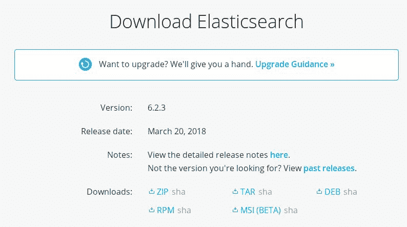
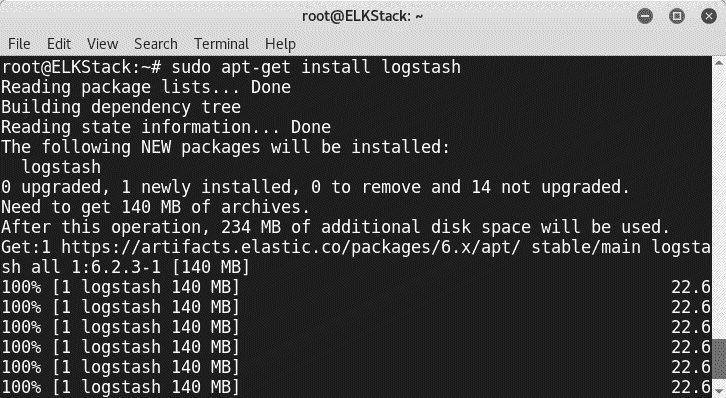
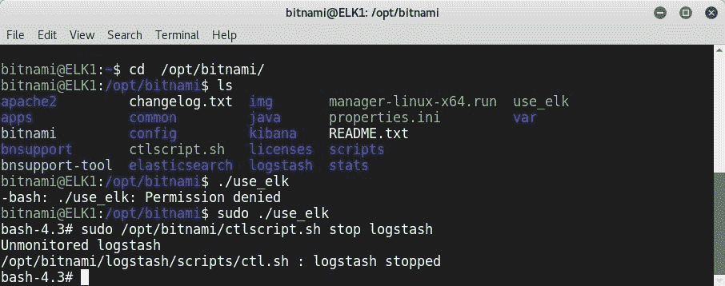
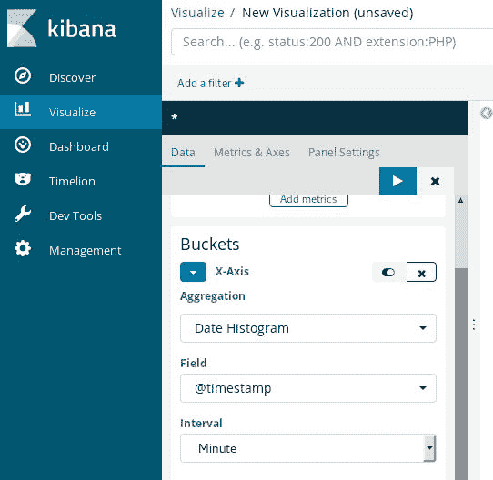
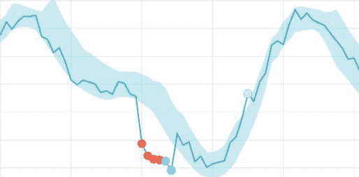

# 第七章：检测高级持续威胁

现代组织每天都面临网络威胁。黑帽黑客并没有显示出他们要停止的迹象。新的黑客技术经常出现。检测高级持续威胁（APT）是一项艰巨的任务，因为这些攻击的目标是长时间保持不被发现，并窃取数据，而不是对系统造成损害。

根据多份信息安全报告，APT 攻击的数量正在显著增加，瞄准国家防御、制造业和金融行业。因此，传统的保护技术在许多情况下是无用的。部署合适的平台和解决方案可以帮助组织和公司抵御网络攻击，特别是 APT 攻击。

本章将为您提供逐步指导，教您如何构建威胁狩猎平台，使用一系列知名的开源项目来保护您的客户数据。您将学习如何创建一个机器学习模块来增强您的平台，并自动检测异常，以便您可以专注于团队内的其他问题。

在本章中，我们将涵盖：

+   高级威胁格局

+   威胁狩猎方法论

+   狩猎成熟度模型

+   网络杀伤链

+   入侵检测的钻石模型

+   使用机器学习进行威胁狩猎，使用**Elasticsearch**、**Logstash**和**Kibana**（**ELK**）堆栈

# 技术要求

在本章中，我们将使用在前几章中使用过的相同的 Python 库。建议您具备以下内容：

+   4 GB RAM

+   2 GB CPU

# 威胁和风险分析

威胁是对您组织资产的潜在危险。根据 2017 年**欧洲网络和信息安全局**（**ENISA**）威胁形势报告，现代组织面临着数百万的网络威胁，包括：恶意软件、基于网络的攻击、网络钓鱼、勒索软件、僵尸网络等。对于安全专业人员，尤其是风险管理人员，威胁在分析风险中起着巨大的作用。风险是威胁和漏洞的组合，可以用数学表示为*风险=威胁 x 漏洞*。

# 威胁狩猎方法论

威胁狩猎是一种寻找、识别和理解 APT 的方法。威胁狩猎，就像任何方法论的信息安全任务一样，不是关于工具和实用程序。它是一种过程、人员和技术的结合。

威胁狩猎涉及以下步骤：

+   创建假设

+   使用工具和技术进行调查

+   发现新的模式

+   信息和丰富的分析

以下步骤构成了**威胁狩猎循环**：


您可以通过从以下选择一个级别来评估您的威胁狩猎计划的成熟度：

+   **等级 1**：初始（几乎没有数据收集，依赖自动警报）

+   **等级 2**：最低（高水平的数据收集）

+   **等级 3**：程序化（高水平的数据收集，遵循数据分析程序）

+   **等级 4**：创新（高水平的数据收集，遵循新的数据分析程序）

+   **等级 5**：领先（高水平的数据收集，自动化成功的数据分析程序）

以下两个部分包括威胁狩猎中最重要的术语。

# 网络杀伤链

像信息安全的许多方面一样，网络杀伤链是一个受军事启发的模型，用于描述网络攻击中使用的步骤。

网络杀伤链的七个步骤如下：

+   **侦察**：收集信息，如电子邮件地址

+   **武器化**：将漏洞与后门结合到可交付的有效载荷中，换句话说，使用漏洞和后门构建可交付的有效载荷

+   **交付**：通过不同方式向受害者交付武器化的捆绑包，例如电子邮件或 USB

+   **利用**：利用漏洞在目标机器上执行代码

+   **安装**：安装恶意软件

+   **命令和控制（C2）**：远程操纵受害者的命令通道

+   **行动和目标**：完成原始目标

# 入侵分析的钻石模型

入侵分析的钻石模型是一种用于验证网络威胁的方法论。每个事件都可以表示为一个钻石。许多信息安全分析师使用这种认知模型来一致地表征有组织的威胁，并在其演变过程中跟踪它们。

钻石的四个节点如下：

+   对手（坏人角色）

+   基础设施（如 IP 地址、域名和电子邮件地址）

+   能力（如恶意软件、漏洞利用和被盗证书）

+   受害者（如人员和网络资产）

# 使用 ELK Stack 进行威胁狩猎

您现在已经清楚地了解了威胁狩猎中最重要的术语。因此，让我们构建我们的威胁狩猎平台。在接下来的几节中，我们将学习如何使用开源项目构建威胁狩猎系统。在我们的实践指南中，我们将使用其中一个最有前途的解决方案——ELK Stack。它包括三个开源项目，是当今最受欢迎的日志管理平台之一。

ELK Stack 广泛应用于许多领域，包括：

+   商业智能

+   网络分析

+   信息安全

+   合规性

ELK Stack 由以下组件组成：

+   **Elasticsearch**：搜索和分析数据

+   **Logstash**：收集和转换数据

+   **Kibana**：可视化数据

以下图表说明了 ELK Stack 中的主要组件：


因此，根据主要架构，为了构建威胁狩猎平台，我们需要：收集日志，分析和搜索合适的数据，并管理我们发现的可视化。让我们看看如何准备 ELK Stack 环境。

# Elasticsearch

Elasticsearch 是一个令人惊叹的开源项目。它是一个基于 RESTful、分布式和基于 JSON 的搜索引擎。换句话说，您可以将其视为 NoSQL 搜索服务器。您可以在其官方网站上查看：[`www.elastic.co/`](https://www.elastic.co/)


要下载它，转到[`www.elastic.co/downloads/elasticsearch`](https://www.elastic.co/downloads/elasticsearch)



选择合适的软件包。在我的情况下，我将在 Ubuntu 14.04 机器上安装它。因此，我将选择`.deb`版本。建议您具有以下内容：

+   4GB RAM

+   2GB CPU

Elasticsearch 是用 Java 编写的。因此，我们需要确保它已安装在我们的环境中（如果没有，则应下载）。将 Java 添加到`apt`如下：

```py
sudo add-apt-repository -y ppa:webupd8team/java 
```

现在 Java 源已添加到`list.sources`文件中：


更新`list.sources`文件：


现在，安装 Java `installer`：

```py
sudo apt-get -y install oracle-java8-installer
```


然后，进行配置：


太好了！我们已经成功安装了。通过输入`java -version`命令来检查：


让我们安装 Elasticsearch。导入`elasticsearch`公钥如下：

```py
wget -qO - https://packages.elastic.co/GPG-KEY-elasticsearch | sudo
apt-key add -
```


将 Elasticsearch 添加到源列表中：

```py
echo "deb https://artifacts.elastic.co/packages/6.x/apt stable main" |
sudo tee -a /etc/apt/sources.list.d/elastic-6.x.list
```


通过使用`apt-get update`和`install elasticsearch`来更新源列表：

```py
apt-get install elasticsearch
```


要配置 Elasticsearch，使用文本编辑器编辑`/etc/elasticsearch/elasticsearch.yml`：

```py
vi /etc/elasticsearch/elasticsearch.yml
```


配置文件后，重新启动 Elasticsearch 服务：

```py
sudo service elasticsearch restart
```

# Kibana

安装和配置 Elasticsearch 后，是时候安装 Kibana 了，以在设计良好的仪表板中可视化数据。Kibana 是一个带有不同类型图表的 Web 界面。您可以将其视为我们堆栈的可视化层。

像往常一样使用`apt-get install`命令安装 Kibana：

```py
apt-get install kibana
```

安装不会花费太长时间：


安装完成后，我们可以使用文本编辑器配置它，修改`/opt/kibana/config/kibana.yml`配置文件：

```py
sudo vi /opt/kibana/config/kibana.yml
```

使用以下命令启用 Kibana 服务：

```py
sudo update-rc.d kibana defaults 96 9
```


使用以下命令启动服务：

```py
sudo service kibana start
```


如果您想要使用公共 IP 地址从外部访问仪表板，您可以使用反向代理。例如，在这种情况下，**Nginx**将是一个很好的选择。

您可以在`/usr/share/kibana`找到 Kibana 文件夹：


要检查仪表板，请输入`<Address>: 5601`并输入您的凭据：


# Logstash

此时，我们已经安装了 Elasticsearch 和 Kibana；现在我们需要安装 Logstash 来收集和转换数据。Logstash 管道包含三个组件：

+   输入

+   过滤器

+   输出


让我们将 Logstash 添加到源列表中，然后更新它：

```py
echo 'deb http://packages.elastic.co/logstash/2.2/debian stable main' |
sudo tee /etc/apt/sources.list.d/logstash-2.2.x.list
```


按照以下方式安装 Logstash：

```py
apt-get install logstash
```



安装 Logstash 后，您可以编辑其配置文件`<Parent_Directory>/logstash/conf/logstash.conf`。正如您将注意到的那样，配置文件包含两个部分 - `input` 和 `output`：


等等！我打赌您一定想知道为什么我们只有两个部分，尽管 Logstash 包含三个部分，就像我们之前讨论的那样。您完全正确。我们需要添加一个自定义部分，称为`filters`。Logstash 提供了很好的功能，包括创建个性化过滤器的能力。例如，要创建一个过滤器，您可以使用以下格式（我们将在我们的指南中稍后使用它）：

```py
filter {
     grok {
         match => { "message" => "COMBINEDAPACHELOG %{COMMONAPACHELOG} %{QS:referrer} %{QS:agent}" }
     }
     date {
         match => [ "timestamp" , "dd/MMM/yyyy:HH:mm:ss Z" ]
    }
 }
```

`gork`过滤器用于将非结构化的日志数据解析为结构化且可查询的数据。根据官方的过滤器插件部分（[`www.elastic.co/guide/en/logstash/current/plugins-filters-grok.html`](https://www.elastic.co/guide/en/logstash/current/plugins-filters-grok.html)），Logstash 默认提供了 120 多种模式。

# 使用 X-Pack 插件进行 ELK Stack 的机器学习

我们现在已经安装了 ELK Stack 的三个主要组件。如果您想要一种有效的部署 ELK Stack 的方式，特别是用于测试目的，我建议您使用基于云的堆栈。例如，在以下演示中，我将使用 Bitnami 预定义的云 ELK Stack。

Bitnami ELK Stack 随附以下软件版本：

+   Apache 2.4.29

+   Elasticsearch 6.2.2

+   Logstash 6.2.2

+   Kibana 6.2.2

在几分钟内，您的堆栈将准备就绪。以下屏幕截图显示了 ELK Stack 文件：


要获取 Bitnami 环境的密码，请转到 Azure 门户中的 Boot 诊断部分，并检查日志文件；您将在文件底部找到密码：


在添加机器学习插件之前，让我们配置我们的 ELK Stack。使用以下命令加载 ELK 环境并登录到 ELK 服务器：

```py
sudo /opt/bitnami/use_elk
```


让我们通过输入`sudo /opt/bitnami/ctlscript.sh stop logstash`来停止 Logstash



创建一个配置文件`/opt/bitnami/logstash/conf/access-log.conf`：

```py
input {
     file {
         path => "/opt/bitnami/apache2/logs/access_log"
         start_position => beginning
     }
 }

 filter {
     grok {
         match => { "message" => "COMBINEDAPACHELOG %{COMMONAPACHELOG} %{QS:referrer} %{QS:agent}" }
     }
     date {
         match => [ "timestamp" , "dd/MMM/yyyy:HH:mm:ss Z" ]
    }
 }

 output {
     elasticsearch {
         hosts => [ "127.0.0.1:9200" ]
     }
 }
```


检查`/opt/bitnami/logstash/bin/logstash -f /opt/bitnami/logstash/conf/ --config.test_and_exit`的配置：


按照以下方式启动 Logstash：

```py
sudo /opt/bitnami/ctlscript.sh start logstash
```


检查 Elasticsearch 是否正常工作：


现在，让我们去 Kibana。正如您可能已经注意到的，我们还没有索引模式：


配置 Logstash 后，我们可以创建一个新的索引模式：


输入`*`并点击下一步：


选择@timestamp 并点击`Create Index pattern`按钮。您现在可以在 Kibana 中查看新的索引模式页面：


当您点击 Discover 选项时，您可以检查日志：


现在，让我们自定义一个可添加到主仪表板的可视化。在侧边栏上点击可视化，然后创建一个新的可视化：


对于我们的演示，我们将使用垂直条形图。您可以从一系列图表和可视化工具中进行选择：


对于 X 轴，选择日期直方图作为聚合和@timestamp 作为字段：



然后，您将看到您图表的可视化，如下面的截图所示：


创建可视化后，让我们添加到我们的仪表板。点击仪表板链接并创建一个新的仪表板。然后，添加您的可视化：


保存仪表板。现在，您可以检查任何指标：


ELK Stack 威胁平台已准备好帮助您追踪多种高级威胁。让我们将项目提升一个档次，并通过利用机器学习的力量来自动化追踪操作，为其增加智能化的触角。ELK Stack 让您有能力向您的追踪平台添加一个名为 X-Pack 的插件，它将帮助您检测您的文物和日志中的异常。

要获得 X-Pack 插件，我们需要在堆栈的每一层上安装它，正如官方插图所示：


要在 Elasticsearch 上安装插件，请转到`binaries`文件夹，并输入以下命令：

```py
./elasticsearch-plugin install x-pack
```

相同的操作也适用于 Kibana：

```py
sudo bin/kibana-plugin install x-pack
```

这也适用于 Logstash：

```py
sudo bin/logstash-plugin install x-pack
```

重新启动所有服务并转到 Kibana 仪表板；您将注意到一个新选项，称为机器学习：


最后，由于 X-Pack，您可以添加时间序列异常检测功能。在上一章中，我们详细讨论了异常检测。我们深入研究了异常检测的基本原理以及如何使用机器学习来检测这些异常。X-Pack 正在使用相同的技术来发现异常。



# 总结

在之前的章节中，我们看到如何使用不同的机器学习算法和 Python 库从头开始构建异常检测系统。本章包括了一份逐步指南，帮助您构建一个完全功能的威胁追踪平台，使用了三个令人惊叹的开源项目。我们还实施了一个机器学习插件，以优化和增强威胁追踪平台的能力。到目前为止，您已经学会了如何使用机器学习的力量构建许多防御系统。如果您想学习如何绕过机器学习保障，下一章是必读的。

# 问题

1.  以下哪一项不是网络攻击杀伤链中的步骤？

（a）扫描

（b）控制和命令

（c）发现和传播

1.  以下哪个选项不是入侵分析钻石模型的节点？

（a）受害者

（b）基础设施

（c）程序

1.  Logstash 配置文件需要多少部分？

（a）2

（b）3

（c）4

1.  在 Elasticsearch 中，索引是什么？

（a）在索引中存储数据的过程

（b）识别数据的过程

（c）以上都不是

1.  在 Elasticsearch 中，什么是节点？

（a）Elasticsearch 模块

（b）Elasticsearch 的一个实例

（c）以上都不是

1.  在 Elasticsearch 中，什么是分片？

（a）共享文件

（b）共享数据

（c）共享资源（RAM、vCPU 等）

1.  Elasticsearch 有模式吗？（是 | 否）
