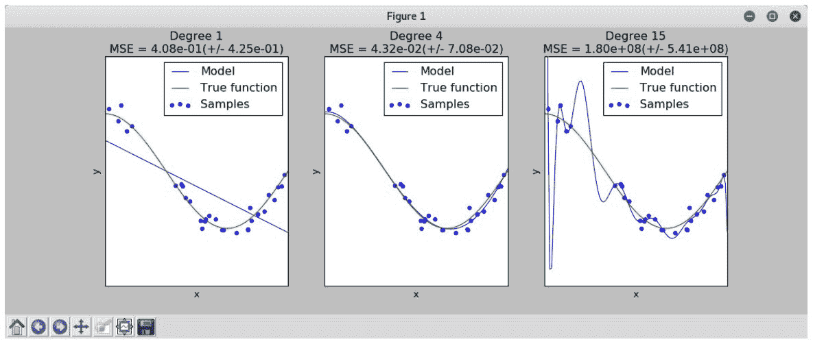
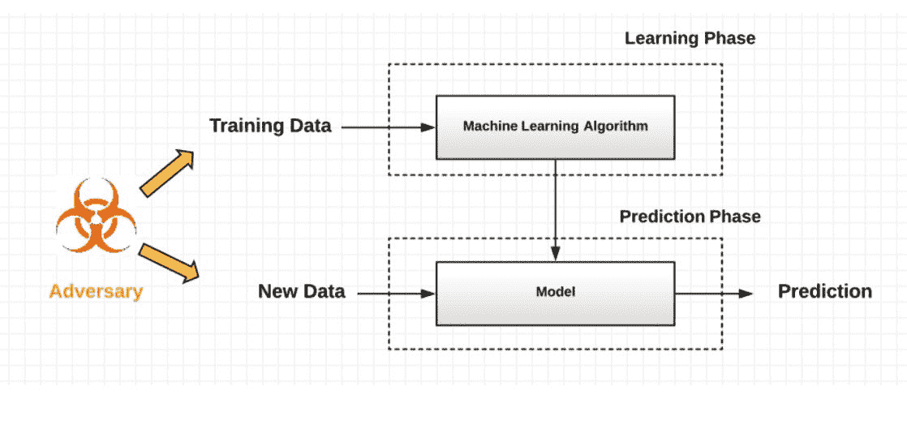
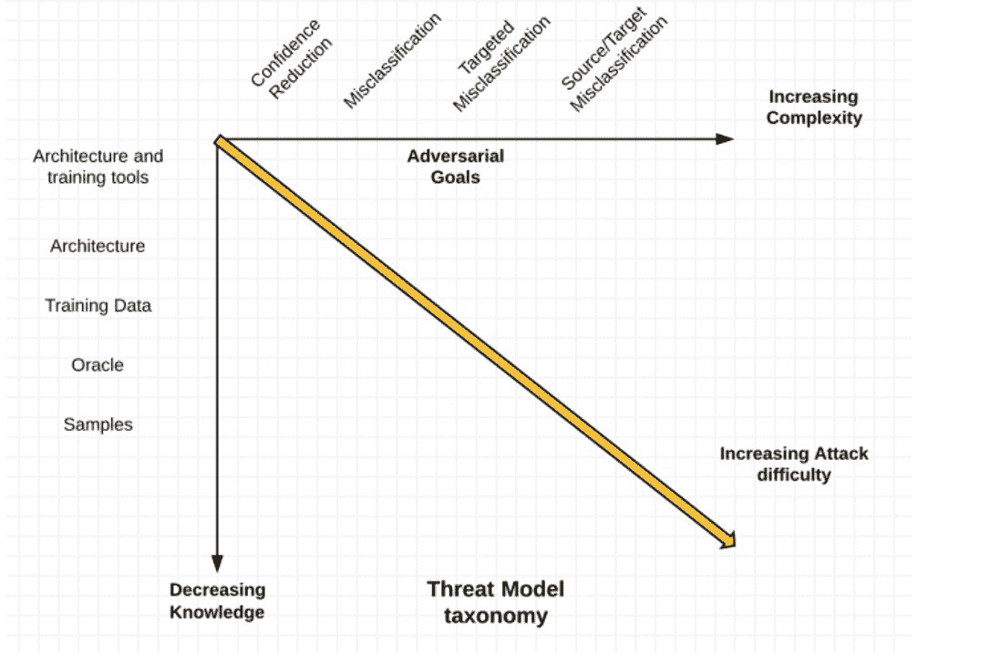
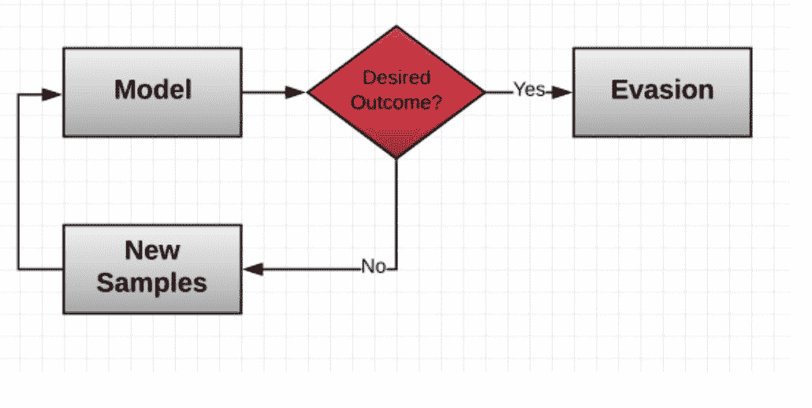
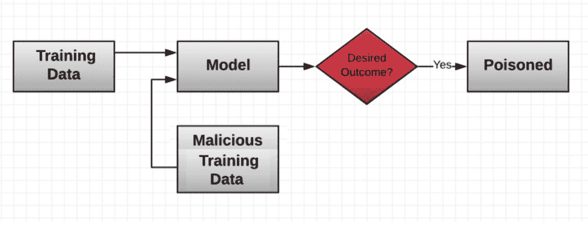
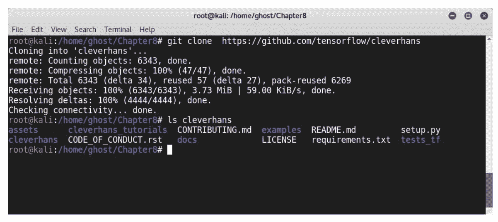
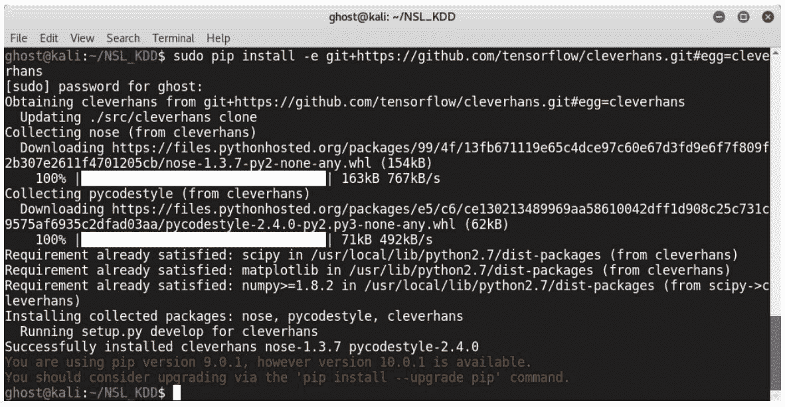
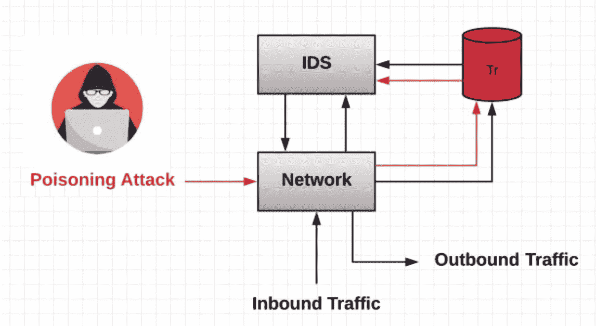
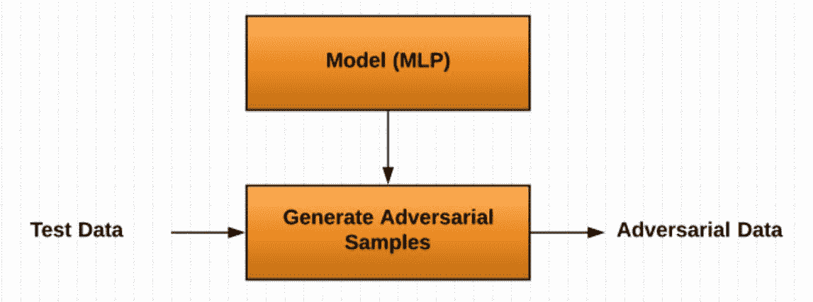

# 规避入侵检测系统

部署入侵检测系统对于每家现代公司来说都是必不可少的，以防御攻击者。在前几章中，我们学习了如何构建基于机器学习的入侵检测系统。现在，是时候学习如何通过对抗学习来绕过这些系统了；为了保护您的系统，您需要先学会如何攻击它们。

在本章中，我们将涵盖以下内容：

+   对抗机器学习算法

+   机器学习威胁模型

+   使用对抗网络系统规避入侵检测系统

# 技术要求

在本章中，您将需要以下库：

+   PyYAML

+   NumPy

+   SciPy

+   CVXPY

+   Python 3

+   Matplotlib

+   scikit-learn

+   进展

+   Pathos

+   CVXOPT（作为 CVXPY 求解器的可选项）

+   Jupyter Notebook

您可以在以下网址找到代码文件：[`github.com/PacktPublishing/Mastering-Machine-Learning-for-Penetration-Testing/tree/master/Chapter08`](https://github.com/PacktPublishing/Mastering-Machine-Learning-for-Penetration-Testing/tree/master/Chapter08)。

# 对抗机器学习算法

在学习对抗机器学习之前，让我们探讨两个重要的术语：过拟合和欠拟合。

# 过拟合和欠拟合

过拟合是机器学习从业者面临的最大障碍之一。知道如何发现过拟合是构建健壮的机器学习模型所必需的技能，因为达到 99%的准确率并不是故事的结束。在机器学习中，我们进行预测。根据定义，**拟合**是我们对目标函数的逼近程度。正如我们在第一章中看到的，监督学习的目标是映射输入数据和目标之间的函数。因此，一个良好的拟合是对该函数的良好逼近。

过拟合发生在模型学习训练数据中的细节和噪音，以至于负面影响了模型的性能。换句话说，模型学习到了噪音，因此在输入新数据时无法很好地进行泛化。下图说明了过拟合的情况。您会注意到模型已经训练得太好，这使得在向模型输入数据时很难实现准确性。

另一个障碍是欠拟合。当机器学习模型不足够拟合数据时就会发生这种情况。换句话说，当模型过于简单时：


# 使用 Python 进行过拟合和欠拟合

让我们用 scikit-learn 来看一下过拟合和欠拟合的真实演示。导入所需的模块：

```py
import numpy as np
import matplotlib.pyplot as plt
from sklearn.pipeline import Pipeline
from sklearn.preprocessing import PolynomialFeatures
from sklearn.linear_model import LinearRegression
from sklearn.model_selection import cross_val_score

```

我们现在将构建一个小模型，并可视化模型、样本和`true`函数，以查看过拟合和欠拟合。我们将使用以下代码：

```py
np.random.seed(0)
n_samples = 30
degrees = [1, 4, 15]
X = np.sort(np.random.rand(n_samples))
y = np.cos(1.5 * np.pi * X) + np.random.randn(n_samples) * 0.1
plt.figure(figsize=(14, 5))

for i in range(len(degrees)):
 ax = plt.subplot(1, len(degrees), i + 1)
 plt.setp(ax, xticks=(), yticks=())

 polynomial_features = PolynomialFeatures(degree=degrees[i],
 include_bias=False)
 linear_regression = LinearRegression()
 pipeline = Pipeline([("polynomial_features", polynomial_features),
 ("linear_regression", linear_regression)])
 pipeline.fit(X[:, np.newaxis], y)

 # Evaluate the models using crossvalidation
 scores = cross_val_score(pipeline, X[:, np.newaxis], y,
 scoring="neg_mean_squared_error", cv=10)

 X_test = np.linspace(0, 1, 100)
 plt.plot(X_test, pipeline.predict(X_test[:, np.newaxis]), label="Model")
 plt.plot(X_test, true_fun(X_test), label="True function")
 plt.scatter(X, y, edgecolor='b', s=20, label="Samples")
 plt.xlabel("x")
 plt.ylabel("y")
 plt.xlim((0, 1))
 plt.ylim((-2, 2))
 plt.legend(loc="best")
 plt.title("Degree {}\nMSE = {:.2e}(+/- {:.2e})".format(
 degrees[i], -scores.mean(), scores.std()))
plt.show()
```

通过运行前面的脚本，我们绘制了以下图表，说明了 3 种情况：欠拟合、良好拟合和过拟合（从左到右）：



以下表格是使用前面代码中突出显示的术语和相应的 URL 创建的：

| **模块** | **URL** |
| --- | --- |
| `plt.subplot` | [`matplotlib.org/api/_as-gen/matplotlib.pyplot.subplot.html#matplotlib.pyplot.subplot`](https://matplotlib.org/api/_as-gen/matplotlib.pyplot.subplot.html#matplotlib.pyplot.subplot) |
| `plt.setp` | [`matplotlib.org/api/_as-gen/matplotlib.pyplot.setp.html#matplotlib.pyplot.setp`](http://matplotlib.org/api/_as-gen/matplotlib.pyplot.setp.html#matplotlib.pyplot.setp) |
| `PolynomialFeatures` | [`scikit-learn.org/stable/modules/generated/sklearn.preprocessing.PolynomialFeatures.html#sklearn.preprocessing.PolynomialFeatures`](http://scikit-learn.org/stable/modules/generated/sklearn.preprocessing.PolynomialFeatures.html#sklearn.preprocessing.PolynomialFeatures) |
| `LinearRegression` | [`scikit-learn.org/stable/modules/generated/sklearn.linear_model.LinearRegression.html#sklearn.linear_model.LinearRegression`](http://scikit-learn.org/stable/modules/generated/sklearn.linear_model.LinearRegression.html#sklearn.linear_model.LinearRegression) |
| `Pipeline` | [`scikit-learn.org/stable/modules/generated/sklearn.pipeline.Pipeline.html#sklearn.pipeline.Pipeline`](http://scikit-learn.org/stable/modules/generated/sklearn.pipeline.Pipeline.html#sklearn.pipeline.Pipeline) |
| `np.newaxis` | [`docs.scipy.org/doc/numpy-1.8.1/reference/arrays.indexing.html#numpy.newaxis`](http://docs.scipy.org/doc/numpy-1.8.1/reference/arrays.indexing.html#numpy.newaxis) |
| `cross_val_score` | [`scikit-learn.org/stable/modules/generated/sklearn.model_selection.cross_val_score.html#sklearn.model_selection.cross_val_score`](http://scikit-learn.org/stable/modules/generated/sklearn.model_selection.cross_val_score.html#sklearn.model_selection.cross_val_score) |
| `np.newaxis` | [`docs.scipy.org/doc/numpy-1.8.1/reference/arrays.indexing.html#numpy.newaxis`](http://docs.scipy.org/doc/numpy-1.8.1/reference/arrays.indexing.html#numpy.newaxis) |
| `np.linspace` | [`docs.scipy.org/doc/numpy-1.8.1/reference/generated/numpy.linspace.html#numpy.linspace`](http://docs.scipy.org/doc/numpy-1.8.1/reference/generated/numpy.linspace.html#numpy.linspace) |
| `plt.plot` | [`matplotlib.org/api/_as-gen/matplotlib.pyplot.plot.html#matplotlib.pyplot.plot`](http://matplotlib.org/api/_as-gen/matplotlib.pyplot.plot.html#matplotlib.pyplot.plot) |
| `plt.scatter` | [`matplotlib.org/api/_as-gen/matplotlib.pyplot.scatter.html#matplotlib.pyplot.scatter`](http://matplotlib.org/api/_as-gen/matplotlib.pyplot.scatter.html#matplotlib.pyplot.scatter) |
| `plt.xlabel` | [`matplotlib.org/api/_as-gen/matplotlib.pyplot.xlabel.html#matplotlib.pyplot.xlabel`](http://matplotlib.org/api/_as-gen/matplotlib.pyplot.xlabel.html#matplotlib.pyplot.xlabel) |
| `plt.ylabel` | [`matplotlib.org/api/_as-gen/matplotlib.pyplot.ylabel.html#matplotlib.pyplot.ylabel`](http://matplotlib.org/api/_as-gen/matplotlib.pyplot.ylabel.html#matplotlib.pyplot.ylabel) |
| `plt.xlim` | [`matplotlib.org/api/_as-gen/matplotlib.pyplot.xlim.html#matplotlib.pyplot.xlim`](http://matplotlib.org/api/_as-gen/matplotlib.pyplot.xlim.html#matplotlib.pyplot.xlim) |
| `plt.ylim` | [`matplotlib.org/api/_as-gen/matplotlib.pyplot.ylim.html#matplotlib.pyplot.ylim`](http://matplotlib.org/api/_as-gen/matplotlib.pyplot.ylim.html#matplotlib.pyplot.ylim) |
| `plt.legend` | [`matplotlib.org/api/legend_api.html#matplotlib.legend`](http://matplotlib.org/api/legend_api.html#matplotlib.legend) |
| `plt.title` | [`matplotlib.org/api/_as-gen/matplotlib.pyplot.title.html#matplotlib.pyplot.title`](http://matplotlib.org/api/_as-gen/matplotlib.pyplot.title.html#matplotlib.pyplot.title) |
| `plt.show` | [`matplotlib.org/api/_as-gen/matplotlib.pyplot.show.html#matplotlib.pyplot.show`](http://matplotlib.org/api/_as-gen/matplotlib.pyplot.show.html#matplotlib.pyplot.show) |

# 检测过拟合

为了检测过拟合，强烈建议将初始数据集分成训练集和测试集。如果训练集的表现远远好于测试集，那么我们就有问题。此外，强烈建议从简单的算法开始，然后再转向更复杂的模型，检查升级复杂度是否值得。为了防止过拟合，我们可以使用交叉验证。交叉验证是通过使用不同子集（*k*子集）训练模型来评估许多机器学习技术的过程。

# 对抗机器学习

对抗机器学习是研究如何破解和保护机器学习模型的艺术。您可以将其视为机器学习和信息安全之间的交集。作为安全专业人士，学习如何使用机器学习构建防御层很重要，但了解如何破解它们也是您技能组合的一个很棒的补充：



2006 年，Barreno 等人提出了针对机器学习系统的威胁模型的分类法。该模型基于三个轴：

+   影响

+   安全违规

+   特异性

2011 年，黄等人扩展了该模型，包括另一个称为**隐私**的轴。2016 年，Papernot，McDaniel，Jha，Fredrikson，Celik 和 Swami 引入了一个专注于两个轴的新分类法：

+   攻击的复杂性

+   攻击者的知识

以下图表说明了机器学习威胁分类：



为了攻击机器学习模型，攻击者可以执行许多技术，这些技术在以下部分中进行了讨论。

# 规避攻击

为执行机器学习规避攻击，网络犯罪分子尝试通过观察模型的工作方式，尤其是结果，尝试许多不同的样本，只需向模型提供不同的输入并尝试找到学习模式。这种技术非常流行。例如，如果攻击者想要规避机器学习垃圾邮件过滤器，他需要向系统提供不同的电子邮件并搜索使垃圾邮件通过（未被检测为垃圾邮件）并通过仅对先前检测到的电子邮件进行少量修改来规避检测的模式。

以下工作流说明了规避攻击的工作原理：



# 毒害攻击

在机器学习中毒攻击中，攻击者通过在模型训练阶段添加恶意数据来毒害模型，以改变学习结果。例如，可以通过在网络操作期间进行数据收集时发送和注入精心设计的样本来执行此方法，以训练网络入侵检测系统模型。以下工作流说明了毒害攻击的发生过程：



在*意大利模式识别与应用实验室*进行的一些最重要的对抗机器学习研究包括*针对支持向量机的毒害攻击*，当 Battista Biggio 及其团队提出了一个攻击支持向量机系统的重要框架。步骤如下：

1.  确定适当的对手目标

1.  定义对手的知识

1.  制定相应的优化问题

1.  相应地重新采样收集的（训练和测试）数据

1.  评估在重新采样数据上的分类器安全性

1.  针对不同水平的对手知识重复评估

如果您熟悉 MATLAB，我强烈建议您尝试**ALFASVMLib**。这是一个关于 SVM 上对抗性标签翻转攻击的 MATLAB 库。您可以从[`github.com/feuerchop/ALFASVMLib`](https://github.com/feuerchop/ALFASVMLib)下载它。

# 对抗聚类

聚类技术广泛应用于许多实际应用中。攻击者正在提出新的技术来攻击聚类模型。其中之一是对抗聚类，攻击者通过操纵输入数据（添加少量攻击样本），使新添加的样本可以隐藏在现有的聚类中。

# 对抗特征

特征选择是每个机器学习项目中的重要步骤。攻击者也在使用对抗性特征选择来攻击模型。我强烈建议您阅读同一团队（*意大利模式识别与应用实验室研究人员*）在一篇名为*特征选择对训练数据毒害是否安全？*的论文中所做的研究。

团队表明，通过污染嵌入式特征选择算法，包括 LASSO、岭回归和 ElasticNet，他们愚弄了 PDF 恶意软件检测器。

有许多 Python 框架和开源项目是由研究人员开发的，用于攻击和评估机器学习模型，例如**CleverHans**，**对抗机器学习**（**AML**）库和**EvadeML-Zoo**。

# CleverHans

CleverHans 正在不断发展； 它是一个对抗性示例库，用于构建攻击、构建防御和评估机器学习系统对对抗性攻击的脆弱性。

您可以从[`github.com/tensorflow/cleverhans`](https://github.com/tensorflow/cleverhans)克隆它：



或者，您可以使用`pip`实用程序进行安装，如下所示：



# AML 库

AML 库是由范德堡大学计算经济研究实验室开发的博弈论对抗机器学习库。 通过博弈论，我们指的是智能决策代理之间合作的数学模型的研究。 您可以从[`github.com/vu-aml/adlib`](https://github.com/vu-aml/adlib)克隆该库。

# EvadeML-Zoo

EvadeML-Zoo 是由弗吉尼亚大学的机器学习组和安全研究组开发的对抗机器学习基准测试和可视化工具。 您可以从[`github.com/mzweilin/EvadeML-Zoo`](https://github.com/mzweilin/EvadeML-Zoo)下载它。

# 使用对抗网络系统规避入侵检测系统

到目前为止，您已经对对抗性机器学习有了相当的了解，以及如何攻击机器学习模型。 现在是时候深入了解更多技术细节，学习如何使用 Python 绕过基于机器学习的入侵检测系统。 您还将学习如何防御这些攻击。

在这个演示中，您将学习如何使用污染攻击攻击模型。 正如之前讨论的，我们将注入恶意数据，以便影响模型的学习结果。 以下图表说明了污染攻击的发生方式：



在这次攻击中，我们将使用**基于雅可比显著图攻击**（**JSMA**）。 这是通过仅修改输入中有限数量的像素来搜索对抗性示例。

让我们看看如何使用 Python 攻击基于机器的入侵检测系统。 代码有点长，所以我只会包含一些重要的片段；稍后，您可以在本章的 GitHub 存储库中找到完整的代码。

对于这个项目，我们需要 NumPy、pandas、Keras、CleverHans、TensorFlow、scikit-learn 和 matplotlib Python 库。

这些是一些导入的库：

```py
import numpy as np
import pandas as pd
from keras.models import Sequential
from keras.layers import Dense , Dropout
from keras.optimizers import RMSprop , adam
from cleverhans.attacks import fgsm , jsma
from cleverhans.utils_tf import model_train , model_eval , batch_eval
from cleverhans.attacks_tf import jacobian_graph
from cleverhans.utils import other_classes
import tensorflow as tf
from sklearn.tree import DecisionTreeClassifier
from sklearn.ensemble import RandomForestClassifier
from sklearn.linear_model import LogisticRegression
from sklearn.metrics import accuracy_score , roc_curve , auc , f1_score
from sklearn.preprocessing import LabelEncoder , MinMaxScaler
import matplotlib.pyplot as plt
```

下一步是预处理数据：

```py
names = ['duration', 'protocol', 'service ', 'flag', 'src_bytes', 'dst_bytes', 'land',
'wrong_fragment ','urgent ', 'hot', 'num_failed_logins ', 'logged_in ', 'num_compromised ', 'root_shell ', 'su_attempted ','num_root ', 'num_file_creations ', 'num_shells ', 'num_access_files ', 'num_outbound_cmds ','is_host_login ', 'is_guest_login ', 'count', 'srv_count ', 'serror_rate', 'srv_serror_rate ','rerror_rate ', 'srv_rerror_rate ', 'same_srv_rate ', 'diff_srv_rate', 'srv_diff_host_rate ','dst_host_count ', 'dst_host_srv_count ', 'dst_host_same_srv_rate ', 'dst_host_diff_srv_rate ','dst_host_same_src_port_rate ', 'dst_host_srv_diff_host_rate ', 'dst_host_serror_rate ','dst_host_srv_serror_rate ','dst_host_rerror_rate ', 'dst_host_srv_rerror_rate ','attack_type ', 'other ']
```

然后，我们将使用 pandas 加载数据：

```py
TrainingData = pd.read_csv('KDDTrain+.txt', names=names , header=None)
TestingData = pd.read_csv('KDDTest+.txt', names=names , header=None)
```

然后，连接训练和测试集：

```py
All = pd.concat ([TrainingData, TestingData])
assert full.shape[0] == TrainingData.shape[0] + TestingData.shape[0]
```

选择数据并识别特征：

```py
All['label'] = full['attack_type']
```

要识别 DoS 攻击，请使用以下内容：

```py
All.loc[All.label == 'neptune ', 'label'] = 'dos'
All.loc[All.label == 'back', 'label '] = 'dos'
All.loc[All.label == 'land', 'label '] = 'dos'
All.loc[All.label == 'pod', 'label'] = 'dos'
All.loc[All.label == 'smurf ', 'label'] = 'dos'
All.loc[All.label == 'teardrop ', 'label '] = 'dos'
All.loc[All.label == 'mailbomb ', 'label '] = 'dos'
All.loc[All.label == 'processtable ', 'label'] = 'dos'
All.loc[All.label == 'udpstorm ', 'label '] = 'dos'
All.loc[All.label == 'apache2 ', 'label'] = 'dos'
All.loc[All.label == 'worm', 'label '] = 'dos'
```

使用相同技术识别其他攻击（**User-to-Root**（**U2R**）、**Remote-to-Local**（**R2L**）和**Probe**）。

要生成一热编码，请使用以下内容：

```py
full = pd.get_dummies(All , drop_first=False)
```

再次识别训练和测试集：

```py
features = list(full.columns [:-5])
y_train = np.array(full[0:TrainingData.shape[0]][[ 'label_normal ', 'label_dos ', 'label_probe
label_r2l ', 'label_u2r ']])
X_train = full[0:TrainingData.shape[0]][ features]
y_test = np.array(full[TrainingData.shape[0]:][[ 'label_normal ', 'label_dos ', 'label_probe ', '
label_r2l ', 'label_u2r ']])
X_test = full[TrainingData.shape[0]:][features]
```

要缩放数据，请使用以下命令：

```py
scaler = MinMaxScaler().fit(X_train)
```

`scale X_train`的示例如下：

```py
X_train_scaled = np.array(scaler.transform(X_train))
```

假设我们要攻击逻辑回归模型； 我们需要处理数据以训练该模型并生成标签编码：

```py
labels = All.label.unique()
En = LabelEncoder()
En.fit(labels)
y_All = En.transform(All.label)
y_train_l = y_All[0:TrainingData.shape[0]]
y_test_l = y_All[TrainingData.shape[0]:]
```

我们现在已经完成了预处理阶段。

对于基于雅可比显著图攻击，我们将使用以下 Python 实现：

```py
results = np.zeros((FLAGS.nb_classes , source_samples), dtype='i')
perturbations = np.zeros((FLAGS.nb_classes , source_samples), dtype='f')
grads = jacobian_graph(predictions , x, FLAGS.nb_classes)
X_adv = np.zeros(( source_samples , X_test_scaled.shape [1]))
for sample_ind in range(0, source_samples):
current_class = int(np.argmax(y_test[sample_ind ]))
for target in [0]:
if current_class == 0:
Break
adv_x , res , percent_perturb = jsma(sess , x, predictions , grads,X_test_scaled[sample_ind: (sample_ind+1)],target , theta=1, gamma =0.1,increase=True , back='tf',clip_min=0, clip_max =1)
X_adv[sample_ind] = adv_x
results[target , sample_ind] = res
perturbations[target , sample_ind] = percent_perturb
```

要构建`MultiLayer Perceptron`网络，请使用以下代码片段：

```py
def mlp_model ():
    Generate a MultiLayer Perceptron model
    model = Sequential ()
    model.add(Dense (256, activation='relu', input_shape =( X_train_scaled.shape [1],)))
    model.add(Dropout (0.4))
    model.add(Dense (256, activation='relu'))
    model.add(Dropout (0.4))
    model.add(Dense(FLAGS.nb_classes , activation='softmax '))model.compile(loss='categorical_crossentropy ',optimizer='adam',metrics =['accuracy '])
    model.summary ()
    return model
```



对于对抗性预测，请使用以下内容：

```py
y_pred_adv = dt.predict(X_adv)
fpr_dt_adv , tpr_dt_adv , _ = roc_curve(y_test[:, 0], y_pred_adv [:, 0])
roc_auc_dt_adv = auc(fpr_dt_adv , tpr_dt_adv)
print("Accuracy score adversarial:", accuracy_score(y_test , y_pred_adv))
print("F1 score adversarial:", f1_score(y_test , y_pred_adv , average='micro '))
print("AUC score adversarial:", roc_auc_dt_adv)
```

最后，我们需要通过提供对抗性测试数据来评估模型：


如果出现错误，请检查本章的 GitHub 存储库。代码可能在出版后进行更新和增强。

# 摘要

在本章中，我们概述了对抗性学习技术，并描述了攻击者和网络犯罪分子如何对机器学习模型进行攻击。

下一章将是一个很好的补充指南，探讨如何攻击人工神经网络和深度学习网络。您将了解攻击者如何通过使用对抗性深度学习和强化学习来绕过现代反恶意软件系统。

# 问题

1.  您能简要解释一下为什么过度训练机器学习模型不是一个好主意吗？

1.  过拟合和欠拟合之间有什么区别？

1.  规避攻击和中毒攻击之间有什么区别？

1.  对抗性聚类是如何工作的？

1.  用于规避入侵检测系统的对抗性攻击类型是什么？

1.  前面的攻击是规避还是中毒攻击？

# 进一步阅读

+   *人工智能的恶意使用：预测、预防和缓解*：[`img1.wsimg.com/blobby/go/3d82daa4-97fe-4096-9c6b-376b92c619de/downloads/1c6q2kc4v_50335.pdf`](https://img1.wsimg.com/blobby/go/3d82daa4-97fe-4096-9c6b-376b92c619de/downloads/1c6q2kc4v_50335.pdf)

+   *使用对抗性示例攻击机器学习*：[`blog.openai.com/adversarial-example-research/`](https://blog.openai.com/adversarial-example-research/)

+   *令人敬畏的对抗性机器学习*：[`github.com/yenchenlin/awesome-adversarial-machine-learning`](https://github.com/yenchenlin/awesome-adversarial-machine-learning)

+   *集成对抗训练：攻击和防御*：[`arxiv.org/pdf/1705.07204.pdf`](https://arxiv.org/pdf/1705.07204.pdf)

+   *对抗性机器学习简介*：[`mascherari.press/introduction-to-adversarial-machine-learning/`](https://mascherari.press/introduction-to-adversarial-machine-learning/)

+   *对抗性深度学习对入侵检测分类器的攻击*：[`www.diva-portal.org/smash/get/diva2:1116037/FULLTEXT01.pdf`](http://www.diva-portal.org/smash/get/diva2:1116037/FULLTEXT01.pdf)

+   *特征选择是否能够抵御训练数据中毒？* ([`pralab.diee.unica.it/sites/default/files/biggio15-icml.pdf`](http://pralab.diee.unica.it/sites/default/files/biggio15-icml.pdf) )

+   *学习算法的安全评估*：[`pralab.diee.unica.it/en/SecurityEvaluation`](http://pralab.diee.unica.it/en/SecurityEvaluation)

+   *AI 和安全威胁的通用框架*：[`img1.wsimg.com/blobby/go/3d82daa4-97fe-4096-9c6b-376b92c619de/downloads/1c6q2kc4v_50335.pdf`](https://img1.wsimg.com/blobby/go/3d82daa4-97fe-4096-9c6b-376b92c619de/downloads/1c6q2kc4v_50335.pdf)

+   *机器学习验证和测试的挑战*：[`www.cleverhans.io/security/privacy/ml/2017/06/14/verification.html:`](http://www.cleverhans.io/security/privacy/ml/2017/06/14/verification.html)

+   *入侵检测网络的攻击：规避、逆向工程和最佳对策*（博士论文）：[`www.seg.inf.uc3m.es/~spastran/phd/PhD_Thesis_Sergio_Pastrana.pdf`](http://www.seg.inf.uc3m.es/~spastran/phd/PhD_Thesis_Sergio_Pastrana.pdf)
