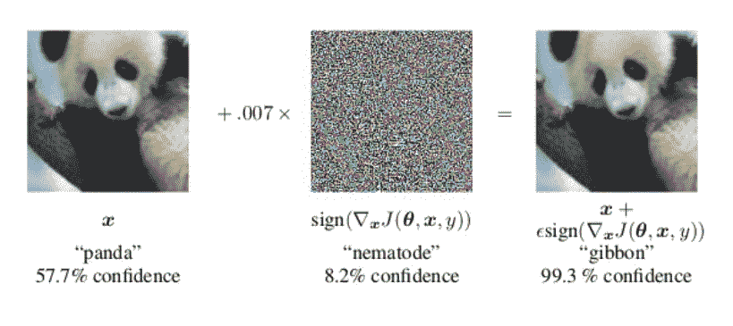
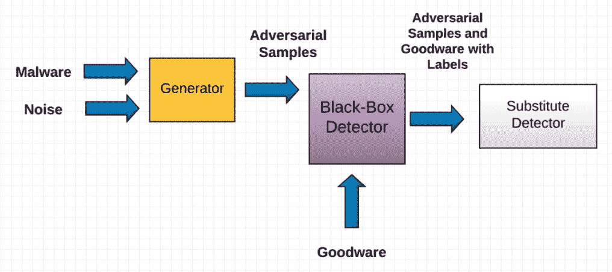
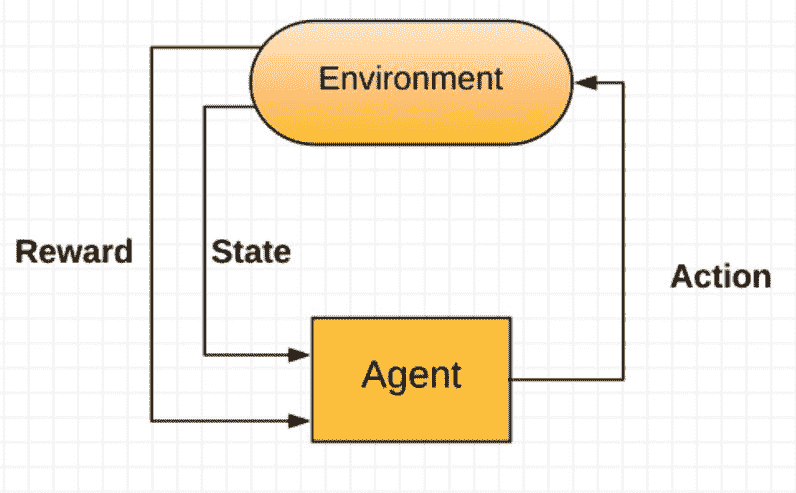
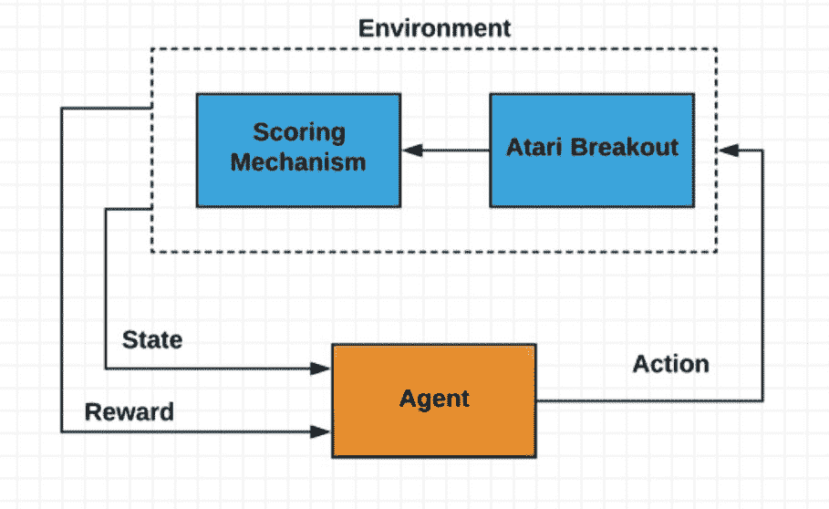
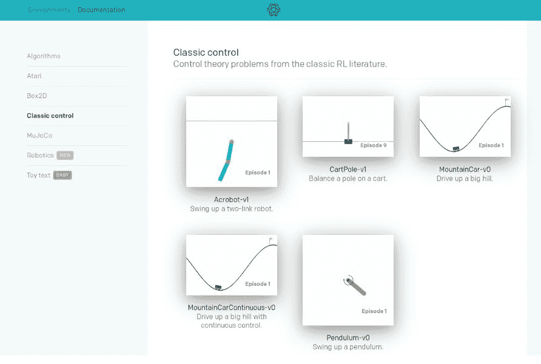

# 第九章：绕过机器学习恶意软件检测器

在上一章中，您了解到可以通过使用对抗性机器学习技术攻击机器学习模型并使其执行恶意活动。在本章中，我们将进一步探讨如何欺骗人工神经网络和深度学习网络等技术。我们将以反恶意软件系统规避为案例研究。

在本章中，我们将涵盖以下内容：

+   对抗性深度学习

+   如何使用生成对抗网络绕过下一代恶意软件检测器

+   使用强化学习绕过机器学习

# 技术要求

本章的代码文件可以在[`github.com/PacktPublishing/Mastering-Machine-Learning-for-Penetration-Testing/tree/master/Chapter09`](https://github.com/PacktPublishing/Mastering-Machine-Learning-for-Penetration-Testing/tree/master/Chapter09)找到。

# 对抗性深度学习

信息安全专业人员正在尽力提出新技术来检测恶意软件和恶意软件。其中一种流行的技术是使用机器学习算法来检测恶意软件。另一方面，攻击者和网络犯罪分子也在想出新方法来绕过下一代系统。在上一章中，我们看了如何攻击机器学习模型以及如何绕过入侵检测系统。

恶意软件开发人员使用许多技术来绕过机器学习恶意软件检测器。之前，我们探讨了一种通过使用灰度图像向量训练系统来构建恶意软件分类器的方法。在由** SARVAM **（**恶意软件搜索和检索**）研究单位在 UCSB 的 Vision Research Lab 进行的演示中，研究人员说明了通过更改几个字节，模型可以将恶意软件分类为良性软件。攻击者可以通过更改几个字节和像素来绕过恶意软件分类器执行此技术。在演示中，研究人员使用了 NETSTAT 程序的变体，这是一个显示网络连接的命令行网络实用工具。在下图中，左侧是`NETSTAT.EXE`恶意软件的表示，第二个被检测为良性软件。如您所见，两个程序之间的差异是不可察觉的（36,864 字节中的 88 字节：0.78%），在将两种文件类型转换为灰度图像并检查它们之间的差异后：


这种技术只是一个开始；在本章中，我们将深入探讨如何欺骗它们（在我们的案例中是恶意软件分类器的机器学习模型）执行恶意活动。

上一章是对对抗性机器学习的概述。我们了解了攻击者如何绕过机器学习。在本章中，我们将更深入地了解如何绕过基于机器学习的恶意软件检测器；在此之前，我们将学习如何欺骗人工神经网络并避开 Python、开源库和开源项目的深度学习网络。神经网络可以被**对抗样本**欺骗。对抗样本被用作神经网络的输入，以影响学习结果。由 Ian J. Goodfellow、Jonathon Shlens 和 Christian Szegedy（在 Google）进行的一项开创性研究项目，名为*解释和利用对抗网络*，显示了一小部分精心构造的噪音可以欺骗神经网络，使其认为输入的图像是长臂猿而不是熊猫，且置信度为 99.3%。神经网络最初认为提供的图像是熊猫，置信度为 57.7%，这是正确的；但在第二个例子中，欺骗网络后情况并非如此：



许多电子设备和系统依赖深度学习作为保护机制，包括人脸识别；想象一下攻击者可以对它们进行的攻击，并未授权地访问关键系统。

现在，让我们试图愚弄一个神经网络。我们将使用著名的 MNIST 数据集愚弄手写数字检测系统。在第四章中，*使用深度学习进行恶意软件检测*，我们学习了如何构建一个。为了演示，我们将愚弄 Michael Nielsen 的一个预训练神经网络。他使用了 5 万张训练图像和 1 万张测试图像。或者，您也可以使用自己的神经网络。您可以在本章的 GitHub 存储库中找到训练信息。文件名为`trained_network.pkl`；您还会找到 MNIST 文件（`mnist.pkl.gz`）：

```py
import network.network as network
import network.mnist_loader as mnist_loader
# To serialize data
import pickle
import matplotlib.pyplot as plt
import numpy as np
```

让我们检查模型是否训练良好。加载`pickle`文件。使用`pickle.load()`加载数据，并识别训练、验证和测试数据：

```py
Model = pickle.load( open( "trained_network.pkl", "rb" ) )    trainData, valData, testData =mnist_loader.load_data_wrapper()
```

例如，要检查数字 2，我们将选择`test_data[1][0]`：

```py
>>> data = test_data[1][0]
>>> activations = Model.feedforward(data)
>>> prediction = np.argmax(activations) 
```

以下屏幕截图说明了前面的代码：

！[](img/00204.gif)

通过使用`matplotlib.pyplot (plt)`绘制结果以进一步检查：

```py
>>> plt.imshow(data.reshape((28,28)), cmap='Greys')
>>> plt.show()
```

如您所见，我们生成了数字**2**，所以模型训练得很好：

！[](img/00205.gif)

一切都设置正确。现在，我们将用两种类型的攻击来攻击神经网络：**有目标的**和**无目标的**。

对于无目标攻击，我们将生成一个对抗样本，并使网络给出特定输出，例如*6*：

！[](img/00206.gif)

在这次攻击中，我们希望神经网络认为输入的图像是*6*。目标图像（我们称之为*X*）是一个*784*维向量，因为图像尺寸是*28×28*像素。我们的目标是找到一个向量`*⃗x*`，使成本*C*最小化，从而得到一个神经网络预测为我们目标标签的图像。成本函数*C*定义如下：

！[](img/00207.jpeg)

以下代码块是导数函数的实现：

```py
def input_derivative(net, x, y):
    """ Calculate derivatives wrt the inputs"""
    nabla_b = [np.zeros(b.shape) for b in net.biases]
    nabla_w = [np.zeros(w.shape) for w in net.weights]

    # feedforward
    activation = x
    activations = [x] # list to store all the activations, layer by layer
    zs = [] # list to store all the z vectors, layer by layer
    for b, w in zip(net.biases, net.weights):
        z = np.dot(w, activation)+b
        zs.append(z)
        activation = sigmoid(z)
        activations.append(activation)

    # backward pass
    delta = net.cost_derivative(activations[-1], y) * \
        sigmoid_prime(zs[-1])
    nabla_b[-1] = delta
    nabla_w[-1] = np.dot(delta, activations[-2].transpose())

    for l in xrange(2, net.num_layers):
        z = zs[-l]
        sp = sigmoid_prime(z)
        delta = np.dot(net.weights[-l+1].transpose(), delta) * sp
        nabla_b[-l] = delta
        nabla_w[-l] = np.dot(delta, activations[-l-1].transpose())
    return net.weights[0].T.dot(delta)
```

要生成对抗样本，我们需要设定目标：

```py
goal = np.zeros((10, 1))
goal[n] = 1
```

创建一个随机图像以进行梯度下降初始化，如下所示：

```py
x = np.random.normal(.5, .3, (784, 1))
```

计算梯度下降，如下所示：

```py
for i in range(steps):
        # Calculate the derivative
        d = input_derivative(net,x,goal)       
        x -= eta * d       
    return x

```

现在，您可以生成样本：

```py
a = adversarial(net, n, 1000, 1)
x = np.round(net.feedforward(a), 2)
Print ("The input is:", str(x))
Print ("The prediction is", str(np.argmax(x)))
```

绘制对抗样本，如下所示：

```py
plt.imshow(a.reshape(28,28), cmap='Greys')
plt.show()
```

！[](img/00208.gif)

在有目标的攻击中，我们使用相同的技术和相同的代码，但是我们在成本函数中添加了一个新项。因此，它将如下所示：

！[](img/00209.jpeg)

# Foolbox

Foolbox 是一个用于评估机器学习模型鲁棒性的 Python 工具包。它受到许多框架的支持，包括以下：

+   TensorFlow

+   PyTorch

+   Theano

+   Keras

+   Lasagne

+   MXNet

要安装 Foolbox，请使用`pip`实用程序：

```py
pip install foolbox
```

！[](img/00210.jpeg)

以下是一些 Foolbox 攻击：

+   **基于梯度的攻击**：通过在输入*x*周围线性化损失

+   **梯度符号攻击（FGSM）**：通过计算梯度*g(x0)*，然后寻找最小步长

+   **迭代梯度攻击**：通过在梯度方向上的小步骤中最大化损失*g(x)*

+   **迭代梯度符号攻击**：通过在上升方向上的小步骤中最大化损失*sign(g(x))*

+   **DeepFool L2 攻击**：通过计算每个类的最小距离*d(ℓ, ℓ0)*，以达到类边界

+   **DeepFool L∞攻击**：类似于 L2 攻击，但最小化*L∞-范数*

+   **基于 Jacobian 的显著性图攻击**：通过计算每个输入特征的显著性分数

+   **单像素攻击**：通过将单个像素设置为白色或黑色

要使用 Foolbox 实施攻击，请使用以下方法：

```py
import foolbox
import keras
import numpy as np
from keras.applications.resnet50 import ResNet50

keras.backend.set_learning_phase(0)
kmodel = ResNet50(weights='imagenet')
preprocessing = (np.array([104, 116, 123]), 1)
fmodel = foolbox.models.KerasModel(kmodel, bounds=(0, 255), preprocessing=preprocessing)

image, label = foolbox.utils.imagenet_example()
attack = foolbox.attacks.FGSM(fmodel)
adversarial = attack(image[:, :, ::-1], label)
```

如果您收到错误消息，`ImportError('`load_weights` requires h5py.')`，请通过安装**h5py**库来解决（`pip install h5py`）。

要绘制结果，请使用以下代码：

```py
import matplotlib.pyplot as plt
plt.figure()
plt.subplot(1, 3, 1)
plt.title('Original')
plt.imshow(image / 255) 
plt.axis('off')
plt.subplot(1, 3, 2)
plt.title('Adversarial')
plt.imshow(adversarial[:, :, ::-1] / 255)  # ::-1 to convert BGR to RGB
plt.axis('off')
plt.subplot(1, 3, 3)
plt.title('Difference')
difference = adversarial[:, :, ::-1] - image
plt.imshow(difference / abs(difference).max() * 0.2 + 0.5)
plt.axis('off')
plt.show()
```

！[](img/00211.jpeg)

# Deep-pwning

Deep-pwning 是一个轻量级框架，用于实验机器学习模型，旨在评估其对抗性对抗有动机的对手。它被称为**机器学习的 metasploit**。您可以从 GitHub 仓库克隆它：[`github.com/cchio/deep-pwning`](https://github.com/cchio/deep-pwning)。

不要忘记安装所有的要求：

```py
pip install -r requirements.txt 
```

以下是与 Deep-pwning 一起使用所需的 Python 库：

+   Tensorflow 0.8.0

+   Matplotlib >= 1.5.1

+   Numpy >= 1.11.1

+   Pandas >= 0.18.1

+   Six >= 1.10.0

# EvadeML

EvadeML ([`evademl.org`](https://evademl.org/) )是基于遗传编程的进化框架，用于自动查找能够逃避基于机器学习的恶意软件分类器检测的变体。它是由弗吉尼亚大学的机器学习组和安全研究组开发的。

要下载 EvadeML，请从[`github.com/uvasrg/EvadeML`](https://github.com/uvasrg/EvadeML)克隆它。

要安装 EvadeML，您需要安装这些必需的工具：

+   用于解析 PDF 的 pdfrw 的修改版本：[`github.com/mzweilin/pdfrw`](https://github.com/mzweilin/pdfrw)

+   Cuckoo Sandbox v1.2，作为预言机：[`github.com/cuckoosandbox/cuckoo/releases/tag/1.2`](https://github.com/cuckoosandbox/cuckoo/releases/tag/1.2)

+   目标分类器 PDFrate-Mimicus：[`github.com/srndic/mimicus`](https://github.com/srndic/mimicus)

+   目标分类器 Hidost：[`github.com/srndic/hidost`](https://github.com/srndic/hidost)

要配置项目，请复制模板，并使用编辑器进行配置：

```py
cp project.conf.template project.conf
Vi  project.conf
```

在运行主程序`./gp.py`之前，运行带有预定义恶意软件签名的集中式检测代理，如文档中所示：

```py
./utils/detection_agent_server.py ./utils/36vms_sigs.pickle
```

选择几个良性 PDF 文件：

```py
./utils/generate_ext_genome.py [classifier_name] [benign_sample_folder] [file_number]
```

要向逃避添加新的分类器，只需在`./classifiers/`中添加一个包装器。

# 使用生成对抗网络绕过下一代恶意软件检测器

2014 年，Ian Goodfellow、Yoshua Bengio 及其团队提出了一个名为**生成对抗网络（GAN）**的框架。生成对抗网络能够从随机噪声生成图像。例如，我们可以训练一个生成网络，从 MNIST 数据集生成手写数字的图像。

生成对抗网络由两个主要部分组成：**生成器**和**鉴别器**。

# 生成器

生成器以潜在样本作为输入；它们是随机生成的数字，并且它们被训练以生成图像：


例如，要生成手写数字，生成器将是一个完全连接的网络，它接受潜在样本并生成`784`个数据点，将它们重塑为*28x28*像素图像（MNIST 数字）。强烈建议使用`tanh`作为激活函数：

```py
generator = Sequential([
Dense(128, input_shape=(100,)),
LeakyReLU(alpha=0.01),
Dense(784),
Activation('tanh')
], name='generator')
```

# 鉴别器

鉴别器只是一个使用监督学习技术训练的分类器，用于检查图像是否为真（`1`）或假（`0`）。它通过 MNIST 数据集和生成器样本进行训练。鉴别器将把 MNIST 数据分类为真实的，生成器样本分类为假的：

```py
discriminator = Sequential([
Dense(128, input_shape=(784,)),
LeakyReLU(alpha=0.01),
Dense(1),
Activation('sigmoid')], name='discriminator')
```

通过连接两个网络，生成器和鉴别器，我们产生了一个生成对抗网络：

```py
gan = Sequential([
generator,
discriminator])
```

这是生成对抗网络的高级表示：


要训练 GAN，我们需要训练生成器（鉴别器在后续步骤中设置为不可训练）；在训练中，反向传播更新生成器的权重以生成逼真的图像。因此，要训练 GAN，我们使用以下步骤作为循环：

+   用真实图像训练鉴别器（鉴别器在这里是可训练的）

+   将鉴别器设置为不可训练

+   训练生成器

训练循环将持续进行，直到两个网络都无法进一步改进。

使用 Python 构建 GAN，请使用以下代码：

```py
import pickle as pkl
import numpy as np
import tensorflow as tf
import matplotlib.pyplot as plt
batch_size = 100
epochs = 100
samples = []
losses = []
saver = tf.train.Saver(var_list=g_vars)
with tf.Session() as sess:
    sess.run(tf.global_variables_initializer())
    for e in range(epochs):
        for ii in range(mnist.train.num_examples//batch_size):
            batch = mnist.train.next_batch(batch_size)

            batch_images = batch[0].reshape((batch_size, 784))
            batch_images = batch_images*2 - 1

            batch_z = np.random.uniform(-1, 1, size=(batch_size, z_size))

            _ = sess.run(d_train_opt, feed_dict={input_real: batch_images, input_z: batch_z})
            _ = sess.run(g_train_opt, feed_dict={input_z: batch_z})

        train_loss_d = sess.run(d_loss, {input_z: batch_z, input_real: batch_images})
        train_loss_g = g_loss.eval({input_z: batch_z})

        print("Epoch {}/{}...".format(e+1, epochs),
              "Discriminator Loss: {:.4f}...".format(train_loss_d),
              "Generator Loss: {:.4f}".format(train_loss_g))    

        losses.append((train_loss_d, train_loss_g))

        sample_z = np.random.uniform(-1, 1, size=(16, z_size))
        gen_samples = sess.run(
                       generator(input_z, input_size, n_units=g_hidden_size, reuse=True, alpha=alpha),
                       feed_dict={input_z: sample_z})
        samples.append(gen_samples)
        saver.save(sess, './checkpoints/generator.ckpt')
with open('train_samples.pkl', 'wb') as f:
    pkl.dump(samples, f)
```


使用 Python 构建 GAN，我们将使用 NumPy 和 TensorFlow。

# MalGAN

为了生成恶意软件样本来攻击机器学习模型，攻击者现在正在使用 GAN 来实现他们的目标。使用我们之前讨论过的相同技术（生成器和鉴别器），网络犯罪分子对下一代反恶意软件系统进行攻击，甚至不知道使用的机器学习技术（黑盒攻击）。其中一种技术是 MalGAN，它是由魏伟胡和应潭从机器感知（MOE）重点实验室和机器智能系进行的名为“基于 GAN 的黑盒攻击生成对抗性恶意软件示例”的研究项目中提出的。MalGAN 的架构如下：



生成器通过接受恶意软件（特征向量*m*）和噪声向量*z*作为输入来创建对抗性恶意软件样本。替代检测器是一个多层前馈神经网络，它以程序特征向量*X*作为输入。它对程序进行良性程序和恶意软件之间的分类。

为了训练生成对抗网络，研究人员使用了这个算法：

```py
While not converging do:
    Sample a minibatch of Malware M
    Generate adversarial samples M' from the generator
    Sample a minibatch of Goodware B
    Label M' and B using the detector
    Update the weight of the detector
    Update the generator weights
End while
```

生成的许多样本可能不是有效的 PE 文件。为了保留变异和格式，系统需要一个沙盒来确保功能得到保留。

生成对抗网络训练不能简单地产生出优秀的结果；这就是为什么需要许多技巧来实现更好的结果。Soumith Chintala、Emily Denton、Martin Arjovsky 和 Michael Mathieu 引入了一些技巧来获得改进的结果：

+   将图像归一化在*-1*和*1*之间

+   使用最大对数*D*作为损失函数，以优化*G*而不是最小化(*log 1-D*)

+   从高斯分布中抽样，而不是均匀分布

+   为真实和虚假构建不同的小批量

+   避免 ReLU 和 MaxPool，而使用 LeakyReLU 和平均池化

+   如果可能的话，使用**深度卷积 GAN**（**DCGAN**）

+   使用`ADAM`优化器

# 通过强化学习绕过机器学习

在先前的技术中，我们注意到如果我们生成对抗性样本，特别是如果结果是二进制的，我们将面临一些问题，包括生成无效样本。信息安全研究人员提出了一种绕过机器学习反恶意软件系统的新技术。

# 强化学习

以前（特别是在第一章），我们探讨了不同的机器学习模型：监督、半监督、无监督和强化模型。强化机器学习模型是构建智能机器的重要方法。在强化学习中，代理通过与环境的交互来学习，根据状态和奖励函数选择最佳决策：



强化学习的一个著名例子是基于 AI 的 Atari Breakout。在这种情况下，环境包括以下内容：

+   球和砖块

+   移动挡板（左或右）

+   消除砖块的奖励

下图展示了用于教授模型如何玩 Atari Breakout 的强化模型的高级概述：



以 Atari Breakout 环境作为学习如何避开反恶意软件系统的类比，我们的环境将如下：


对于代理，它需要环境状态（一般文件信息、头信息、导入和导出函数、字符串等）来优化其性能和来自反病毒报告的奖励输入，以及结果行动（创建入口点和新部分，修改部分等）。换句话说，为了执行和学习，代理正在接受两个输入（状态和奖励）。

作为我们讨论的概念的实现，信息安全专业人员致力于 OpenAI 环境，以利用强化学习技术构建可以逃避检测的恶意软件。其中一个环境是**Gym-malware**。这个出色的环境是由 endgame 开发的。

OpenAI gym 包含一个开源的 Python 框架，由非营利性人工智能研究公司 OpenAI（[`openai.com/`](https://openai.com/)）开发，用于开发和评估强化学习算法。要安装 OpenAI Gym，请使用以下代码（您需要安装 Python 3.5+）：

```py
git clone https://github.com/openai/gym
cd gym
pip install -e
```

OpenAI Gym 加载了预先制作的环境。您可以在[`gym.openai.com/envs/`](http://gym.openai.com/envs/)上检查所有可用的环境：



```py
CartPole-v0 environment:
```

```py
import gym
 env = gym.make('CartPole-v0')
 env.reset()
 for _ in range(1000): # run for 1000 steps
    env.render()
    action = env.action_space.sampe() # pick a random action
    env.step(action) # take action
```

要使用 Gym-malware 环境，您需要安装 Python 3.6 和一个名为`LIEF`的库，它可以通过输入以下内容来添加：

```py
pip install https://github.com/lief-project/LIEF/releases/download/0.7.0/linux_lief-0.7.0_py3.6.tar.gz
```

从[`github.com/endgameinc/gym-malware`](https://github.com/endgameinc/gym-malware)下载 Gym-malware。将安装的 Gym-malware 环境移动到`gym_malware/gym_malware/envs/utils/samples/`。

要检查您是否在正确的目录中拥有样本，请输入以下内容：

```py
python test_agent_chainer.py
```

此环境中可用的操作如下：

+   `append_zero`

+   `append_random_ascii`

+   `append_random_bytes`

+   `remove_signature`

+   `upx_pack`

+   `upx_unpack`

+   `change_section_names_from_list`

+   `change_section_names_to random`

+   `modify_export`

+   `remove_debug`

+   `break_optional_header_checksum`

# 总结

在本章中，我们继续学习如何绕过机器学习模型。在上一章中，我们发现了对抗机器学习；在这一延续中，我们探讨了对抗深度学习以及如何欺骗深度学习网络。我们查看了一些真实案例，以了解如何使用最先进的技术逃避反恶意软件系统。在接下来的最后一章中，我们将获得更多知识，学习如何构建强大的模型。

# 问题

1.  生成对抗网络的组成部分是什么？

1.  生成器和鉴别器之间有什么区别？

1.  在生成对抗样本时，我们如何确保恶意软件对抗样本仍然有效？

1.  进行一些研究，然后简要解释如何检测对抗样本。

1.  强化学习与深度学习有何不同？

1.  监督学习和强化学习之间有什么区别？

1.  在强化学习中，代理如何学习？

# 进一步阅读

以下资源包含大量信息：

+   *解释和利用对抗样本*：[`arxiv.org/pdf/1412.6572.pdf`](https://arxiv.org/pdf/1412.6572.pdf)

+   *深入研究可转移对抗样本和黑盒攻击*：[`arxiv.org/pdf/1611.02770.pdf`](https://arxiv.org/pdf/1611.02770.pdf)

+   *Foolbox-用于基准测试机器学习模型鲁棒性的 Python 工具包*：[`arxiv.org/pdf/1707.04131.pdf`](https://arxiv.org/pdf/1707.04131.pdf)

+   *The Foolbox* GitHub：[`github.com/bethgelab/foolbox`](https://github.com/bethgelab/foolbox)

+   基于 GAN 的黑盒攻击生成对抗恶意软件示例：[`arxiv.org/pdf/1702.05983.pdf`](https://arxiv.org/pdf/1702.05983.pdf)

+   *恶意软件图像：可视化和自动分类*：[`arxiv.org/pdf/1702.05983.pdf`](https://arxiv.org/pdf/1702.05983.pdf)

+   *SARVAM：恶意软件的搜索和检索*：[`vision.ece.ucsb.edu/sites/vision.ece.ucsb.edu/files/publications/2013_sarvam_ngmad_0.pdf`](http://vision.ece.ucsb.edu/sites/vision.ece.ucsb.edu/files/publications/2013_sarvam_ngmad_0.pdf)

+   *SigMal：基于静态信号处理的恶意软件分类*：[`vision.ece.ucsb.edu/publications/view_abstract.cgi?416`](http://vision.ece.ucsb.edu/publications/view_abstract.cgi?416)
