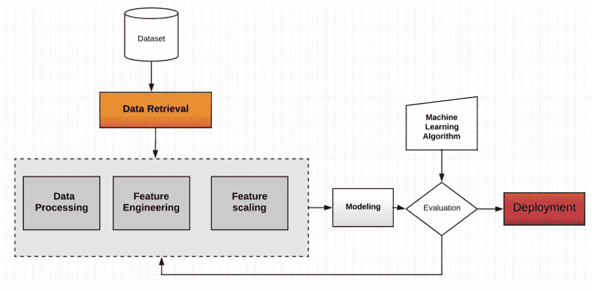
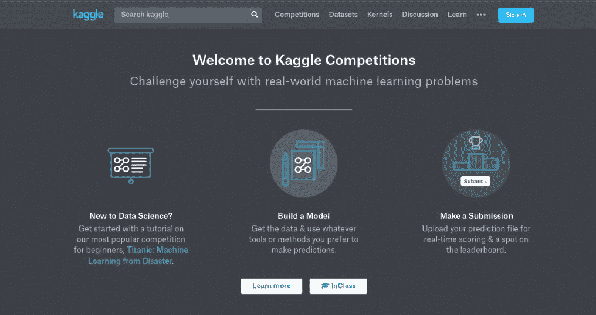
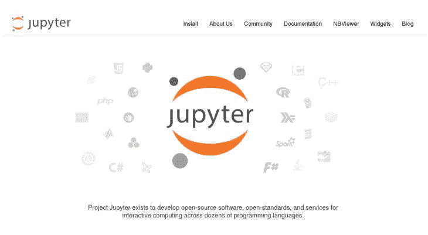

# 第十章：机器学习和特征工程的最佳实践

在前几章中，我们学习了机器学习的基础知识，并学习了如何使用一套令人惊叹的开源 Python 库构建许多不同的 Python 项目。此外，我们深入研究了如何打破机器学习模型。

本章将通过说明项目各个方面的许多技巧和最佳实践，帮助您构建更好的模型。

在本章中，我们将涵盖以下内容：

+   机器学习中特征工程的深入概述

+   机器学习的最佳实践

# 技术要求

您可以在此章节的代码文件中找到此代码：[`github.com/PacktPublishing/Mastering-Machine-Learning-for-Penetration-Testing/tree/master/Chapter10`](https://github.com/PacktPublishing/Mastering-Machine-Learning-for-Penetration-Testing/tree/master/Chapter10)。

# 机器学习中的特征工程

通过在本书中构建和开发所有项目和原型，您肯定已经注意到特征工程和特征选择对于每个现代数据科学产品，特别是基于机器学习的项目至关重要。根据研究，构建模型所花费的时间中，超过 50%的时间用于清理、处理和选择训练模型所需的数据。您有责任设计、表示和选择特征。

大多数机器学习算法无法处理原始数据。它们不够聪明。因此，需要特征工程，将原始状态的数据转换为算法可以理解和消化的数据。安德鲁·吴教授曾经说过：

“构建特征是困难的，耗时的，需要专业知识。‘应用机器学习’基本上就是特征工程。”

特征工程是数据准备阶段的一个过程，根据数据挖掘的跨行业标准流程：



“特征工程”本身并没有正式定义的术语。它将所有设计特征以构建智能系统的任务组合在一起。它在系统中扮演着重要的角色。如果您参加数据科学竞赛，我敢打赌您已经注意到，竞争者们都使用相同的算法，但获胜者表现最佳的是特征工程。如果您想提高数据科学和机器学习技能，我强烈建议您访问并参加[www.kaggle.com](http://www.kaggle.com)：



在搜索机器学习资源时，您将面临许多不同的术语。为了避免混淆，我们需要区分特征选择和特征工程。特征工程将原始数据转换为合适的特征，而特征选择从工程化的数据中提取必要的特征。特征工程是选择所有特征的子集，而不包括冗余或无关的特征。

# 特征选择算法

为了使算法能够更快地训练，并减少模型的复杂性和过拟合，除了提高准确性之外，您可以使用许多特征选择算法和技术。我们将看一下三种不同的特征选择方法：过滤方法、包装方法和嵌入方法。让我们讨论各种方法和技术。

# 过滤方法

在过滤方法中，每个特征将被分配一个分数，由不同的统计量计算得出。换句话说，这些方法通过考虑特征与目标之间的关系来对特征进行排名。过滤方法通常用于预处理阶段：


# 皮尔逊相关系数

Pearson 相关是一种用于测量两个变量`x`和`y`之间线性相关的统计方法。它的范围在`+1`和`-1`之间；`+1`表示有正相关。你需要知道`x`和`y`应该是连续变量。Pearson 相关系数的公式如下：

！[](img/00223.jpeg)

*Cov*是**协方差**，`dx`和`dy`是`x`和`y`的标准差：

！[](img/00224.jpeg)

要使用 Python 计算这个，你可以使用`scipy.stats.pearsonr(x, y)`，来自`scipy`库。

# 线性判别分析

在以前的章节中，特别是在第一章，*渗透测试中的机器学习简介*中，我们看到了**主成分分析**（**PCA**）的统计程序。**线性判别分析**（**LDA**）也是一种降维技术。它用于找到将类别分开的特征的线性组合：

！[](img/00225.jpeg)

要在 scikit-learn 中使用 LDA，请使用以下行导入：

```py
from sklearn.discriminant_analysis import LinearDiscriminantAnalysis as LDA
```

使用方法如下：

```py
sklearn_lda = LDA(n_components=2)
 X_lda_sklearn = sklearn_lda.fit_transform(X, y)
```

# 方差分析

**方差分析**（**ANOVA**）类似于 LDA，但它使用分类特征来检查几个类的均值是否相等，通过分析它们之间的差异。

# 卡方

**卡方**用于确定子集数据是否与总体相匹配。值应该是在类别中。换句话说，卡方检验用于检查不同类别或类别之间的相关性和关联。

卡方检验的公式如下：

！[](img/00226.jpeg)

以下是使用 scikit-learn 的卡方的示例，由 Jason Brownlee，博士提供：

```py
import pandas
import numpy
from sklearn.feature_selection import SelectKBest
from sklearn.feature_selection import chi2
# load data
url = "https://raw.githubusercontent.com/jbrownlee/Datasets/master/pima-indians-diabetes.data.csv"
names = ['preg', 'plas', 'pres', 'skin', 'test', 'mass', 'pedi', 'age', 'class']
dataframe = pandas.read_csv(url, names=names)
array = dataframe.values
X = array[:,0:8]
Y = array[:,8]
# feature extraction
test = SelectKBest(score_func=chi2, k=4)
fit = test.fit(X, Y)
# summarize scores
numpy.set_printoptions(precision=3)
print(fit.scores_)
features = fit.transform(X)
# summarize selected features
print(features[0:5,:]) 
```

以下图表说明了前面的代码：

！[](img/00227.jpeg)

# 包装方法

包装方法是通过取子集和训练学习算法来执行的。根据训练的结果，我们可以选择我们模型的最佳特征。而且，你可能已经猜到，这些方法在计算上非常昂贵：

！[](img/00228.jpeg)

有许多包装技术，包括以下部分中列出的技术。

# 前向选择

前向选择使用搜索作为选择最佳特征的技术。这是一种迭代方法。在每次迭代中，我们添加更多特征以改进模型，直到我们没有进一步的改进为止：

！[](img/00229.jpeg)

# 向后消除

向后消除与前一种方法类似，但是这次我们从所有特征开始，并且在每次迭代中消除一些特征，直到模型停止改进：

！[](img/00230.jpeg)

# 递归特征消除

你可以看到递归特征消除作为一种贪婪的优化算法。这种技术是通过创建具有不同子集的模型并计算最佳执行特征来执行的，根据消除排名对它们进行评分。

这个脚本与前一个类似，但它使用递归特征消除作为特征选择方法：

```py
from pandas import read_csv
from sklearn.feature_selection import RFE
from sklearn.linear_model import LogisticRegression
# load data
url = "https://raw.githubusercontent.com/jbrownlee/Datasets/master/pima-indians-diabetes.data.csv"
names = ['preg', 'plas', 'pres', 'skin', 'test', 'mass', 'pedi', 'age', 'class']
dataframe = read_csv(url, names=names)
array = dataframe.values
X = array[:,0:8]
Y = array[:,8]
# feature extraction
model = LogisticRegression()
rfe = RFE(model, 3)
fit = rfe.fit(X, Y)
print("Num Features: %d") % fit.n_features_print("Selected Features: %s") % fit.support_
print("Feature Ranking: %s") % fit.ranking_
```

以下图表说明了前面的代码：

！[](img/00231.gif)

# 嵌入方法

特征选择嵌入方法的主要目标是学习哪些特征对机器学习模型的准确性贡献最大。它们具有内置的惩罚函数以减少过拟合：

！[](img/00232.jpeg)

一些嵌入技术列在以下部分。

# Lasso 线性回归 L1

在统计学中，Lasso 是一种回归分析方法。Lasso 线性回归 L1 简单地增加了一个与系数大小的绝对值等价的惩罚。以下是 Python 和 sckit-learn 中该方法的实现：

```py
>>> from sklearn.svm import LinearSVC
>>> from sklearn.datasets import load_iris
>>> from sklearn.feature_selection import SelectFromModel
>>> iris = load_iris()
>>> X, y = iris.data, iris.target
>>> X.shape
>>> lsvc = LinearSVC(C=0.01, penalty="l1", dual=False).fit(X, y)
>>> model = SelectFromModel(lsvc, prefit=True)
>>> X_new = model.transform(X)
>>> X_new.shape
```

！[](img/00233.jpeg)

# 岭回归 L2

岭回归 L2 方法增加了一个与系数大小的平方等价的惩罚。换句话说，它执行 L2 正则化。

# 基于树的特征选择

基于树的特征选择方法用于检查和计算特征的重要性。以下是一个示例，展示了如何使用 scikit-learn 官方文档提供的基于树的特征选择技术：

```py
>>> from sklearn.ensemble import ExtraTreesClassifier
>>> from sklearn.datasets import load_iris
>>> from sklearn.feature_selection import SelectFromModel
>>> iris = load_iris()
>>> X, y = iris.data, iris.target
>>> X.shape
>>> clf = ExtraTreesClassifier()
>>> clf = clf.fit(X, y)
>>> clf.feature_importances_ 
>>> model = SelectFromModel(clf, prefit=True)
>>> X_new = model.transform(X)
>>> X_new.shape         
```


正如我之前所说，特征选择是在预处理阶段使用的，因此您可以使用 scikit-learn 来构建一个流水线，就像以下示例中的那样：

```py
Classifier = Pipeline([
  ('feature_selection', SelectFromModel(<SelectionTechniqueHere>))),
  ('classification', <ClassificationAlgorithmHere>)
 ])
 Classifier.fit(X, y)
```

一本名为*An Introduction to Variable and Feature Selection*的好书，作者是 Isabelle Guyon 和 Andre Elisseeff，其中包括了一个更好的特征选择清单。

要了解更多有关完整清单的信息，您可以浏览[`machinelearningmastery.com/an-introduction-to-feature-selection/`](https://machinelearningmastery.com/an-introduction-to-feature-selection/)。

# 机器学习的最佳实践

在之前的章节中，我们看到了如何进行特征工程来增强我们的机器学习系统的性能。现在，我们将讨论一些建立健壮智能系统的技巧和最佳实践。让我们探索机器学习项目不同方面的一些最佳实践。

# 信息安全数据集

数据是每个机器学习模型的重要组成部分。为了训练模型，我们需要提供数据集。在阅读之前的章节时，您可能已经注意到，要构建准确和高效的机器学习模型，您需要大量的数据，即使在清理数据之后也是如此。拥有大量可用数据的大公司使用其内部数据集来构建模型，但是像初创公司这样的小组织通常很难获取这么多的数据。国际规则和法规使这一任务变得更加困难，因为数据隐私是信息安全的重要方面。每个现代企业都必须保护其用户的数据。为了解决这个问题，许多机构和组织提供了公开可用的数据集，以便其他人可以下载并构建用于教育或商业用途的模型。一些信息安全数据集如下：

+   用于入侵检测的**控制区域网络**（**CAN**）数据集（OTIDS）：[`ocslab.hksecurity.net/Dataset/CAN-intrusion-dataset`](http://ocslab.hksecurity.net/Dataset/CAN-intrusion-dataset)

+   用于入侵检测的汽车黑客数据集：[`ocslab.hksecurity.net/Datasets/CAN-intrusion-dataset`](http://ocslab.hksecurity.net/Datasets/CAN-intrusion-dataset)

+   用于网络犯罪分析的网络黑客数据集：[`ocslab.hksecurity.net/Datasets/web-hacking-profiling`](http://ocslab.hksecurity.net/Datasets/web-hacking-profiling)

+   **基于 API 的恶意软件检测系统**（**APIMDS**）数据集：[`ocslab.hksecurity.net/apimds-dataset`](http://ocslab.hksecurity.net/apimds-dataset)

+   入侵检测评估数据集（CICIDS2017）：[`www.unb.ca/cic/datasets/ids-2017.html`](http://www.unb.ca/cic/datasets/ids-2017.html)

+   Tor-nonTor 数据集：[`www.unb.ca/cic/datasets/tor.html`](http://www.unb.ca/cic/datasets/tor.html)

+   Android 广告软件和一般恶意软件数据集：[`www.unb.ca/cic/datasets/android-adware.html`](http://www.unb.ca/cic/datasets/android-adware.html)

# Jupyter 项目

Jupyter Notebook 是一个开源的 Web 应用程序，用于创建和共享编码文档。我强烈推荐它，特别是对于新手数据科学家，原因有很多。它将使您能够直接编写和可视化输出。它非常适合发现和处理数据；探索数据是构建机器学习模型的重要步骤。

Jupyter 的官方网站是[`jupyter.org/`](http://jupyter.org/)：



要使用`pip`安装它，只需输入以下内容：

```py
python -m pip install --upgrade pip
python -m pip install jupyter
```

# 使用 GPU 加速训练

正如你所知，即使进行了良好的特征工程，机器学习训练在计算上是昂贵的。训练学习算法的最快方法是使用**图形处理单元**（**GPU**）。一般来说，虽然不是所有情况，使用 GPU 是训练模型的明智决定。为了克服 CPU 性能瓶颈，最好使用聚集/分散 GPU 架构，执行并行操作以加快计算速度。

TensorFlow 支持使用 GPU 来训练机器学习模型。因此，设备被表示为字符串；以下是一个例子：

```py
"/device:GPU:0" : Your device GPU
"/device:GPU:1" : 2nd GPU device on your Machine
```

要在 TensorFlow 中使用 GPU 设备，可以添加以下行：

```py
with tf.device('/device:GPU:0'):
    <What to Do Here>
```

你可以使用单个 GPU 或多个 GPU。不要忘记安装 CUDA 工具包，使用以下命令：

```py
Wget "http://developer.download.nvidia.com/compute/cuda/repos/ubuntu1604/x86_64/cuda-repo-ubuntu1604_8.0.44-1_amd64.deb"

sudo dpkg -i cuda-repo-ubuntu1604_8.0.44-1_amd64.deb

sudo apt-get update

sudo apt-get install cuda
```

按照以下方式安装 cuDNN：

```py
sudo tar -xvf cudnn-8.0-linux-x64-v5.1.tgz -C /usr/local

export PATH=/usr/local/cuda/bin:$PATH

export LD_LIBRARY_PATH="$LD_LIBRARY_PATH:/usr/local/cuda/lib64:/usr/local/cuda/extras/CUPTI/lib64"
export CUDA_HOME=/usr/local/cuda
```

# 选择模型和学习曲线

为了提高机器学习模型的性能，有许多超参数需要调整。使用的数据越多，出现的错误就越多。为了处理这些参数，有一种称为`GridSearchCV`的方法。它通过迭代在预定义的参数值上执行搜索。`GridSearchCV`默认使用`score()`函数。要在 scikit-learn 中使用它，可以使用以下行导入：

```py
from sklearn.grid_search import GridSearchCV
```

学习曲线用于了解机器学习模型的性能。要在 scikit-learn 中使用学习曲线，可以将其导入到 Python 项目中，如下所示：

```py
from sklearn.learning_curve import learning_curve
```

# 机器学习架构

在现实世界中，数据科学家并不认为数据像公开可用的数据集那样干净。现实世界的数据以不同的方式存储，数据本身也以不同的类别呈现。因此，机器学习从业者需要构建自己的系统和流程来实现他们的目标并训练模型。典型的机器学习项目遵循以下架构：


# 编码

良好的编码技能对于数据科学和机器学习非常重要。除了使用有效的线性代数、统计学和数学，数据科学家还应该学会如何正确编码。作为一名数据科学家，你可以选择许多编程语言，比如 Python、R、Java 等。

尊重编码的最佳实践非常有帮助，也强烈推荐。通过以下提示可以编写优雅、清晰和易懂的代码：

+   注释对于可理解的代码非常重要。因此，不要忘记一直对代码进行注释。

+   为变量、函数、方法、包和模块选择正确的名称。

+   每个缩进级别使用四个空格。

+   正确结构化你的存储库。

+   遵循常见的样式指南。

如果你使用 Python，你可以遵循这个伟大的格言，称为*Python 之禅*，由传奇人物 Tim Peters 撰写：

"美丽胜过丑陋。

显式胜于隐式。

简单胜于复杂。

复杂胜于复杂。

扁平胜于嵌套。

稀疏胜于密集。

可读性很重要。

特殊情况并不特别到足以打破规则。

尽管实用性胜过纯粹性。

错误不应该悄悄地传递。

除非明确地被压制。

面对模棱两可的情况，拒绝猜测的诱惑。

应该有一种——最好只有一种——明显的方法来做到这一点。

虽然这种方式一开始可能不太明显，除非你是荷兰人。

现在胜于永远。

虽然从来没有比*现在*更好。

如果实现难以解释，那就是一个坏主意。

如果实现容易解释，那可能是一个好主意。

命名空间是一个伟大的想法——让我们做更多这样的事情！

# 数据处理

良好的数据处理有助于成功构建机器学习项目。加载数据集后，请确保所有数据都已正确加载，并且读取过程正在正确执行。在对数据集执行任何操作后，请检查生成的数据集。

# 商业背景

智能系统与业务方面高度相关，毕竟您正在使用数据科学和机器学习来解决业务问题或构建商业产品，或者从获取的数据中获得有用的见解，以做出明智的决策。在构建机器学习模型时，识别正确的问题并提出正确的问题是重要的，以解决业务问题。

# 总结

这本书是一个实用指南，教你如何使用开源库、Python 和一套开源项目来构建机器学习项目，以抵御网络威胁和恶意活动。我们不止于此；我们还向您展示了如何使用对抗机器学习来攻击这些模型。通过这样做，您获得了一套分析数据、构建防御系统和突破下一代安全防护的技能。我们在书中讨论了许多观点，以帮助您构建更好的模型。

# 问题

1.  特征工程和特征选择有什么区别？

1.  主成分分析（PCA）和特征选择有什么区别？

1.  我们如何对日期和小时等特征进行编码？

1.  为什么打印出训练和测试准确性很有用？

1.  我们如何部署机器学习模型并在产品中使用它？

1.  为什么特征工程比其他步骤花费更多时间？

1.  虚拟变量的作用是什么？

# 进一步阅读

**论文和幻灯片**：

+   *特征工程* - *知识发现与数据挖掘 1*，作者：Roman Kern：[`kti.tugraz.at/staff/denis/courses/kddm1/featureengineering.pdf`](http://kti.tugraz.at/staff/denis/courses/kddm1/featureengineering.pdf)

+   *特征工程和选择*（[`people.eecs.berkeley.edu/~jordan/courses/294-fall09/lectures/feature/slides.pdf`](https://people.eecs.berkeley.edu/~jordan/courses/294-fall09/lectures/feature/slides.pdf)）- *CS 294：实用机器学习*，伯克利：[`people.eecs.berkeley.edu/~jordan/courses/294-fall09/lectures/feature/`](https://people.eecs.berkeley.edu/~jordan/courses/294-fall09/lectures/feature/)

+   *特征工程* 作者：Leon Bottou，普林斯顿：[`www.cs.princeton.edu/courses/archive/spring10/cos424/slides/18-feat.pdf`](http://www.cs.princeton.edu/courses/archive/spring10/cos424/slides/18-feat.pdf)

**博客文章**：

+   *发现特征工程-如何进行特征工程以及如何擅长它*：[`machinelearningmastery.com/discover-feature-engineering-how-to-engineer-features-and-how-to-get-good-at-it/`](https://machinelearningmastery.com/discover-feature-engineering-how-to-engineer-features-and-how-to-get-good-at-it/)

+   *机器学习精通*：[`machinelearningmastery.com/start-here/`](https://machinelearningmastery.com/start-here/)

**书籍**：

+   *特征提取、构造和选择：数据挖掘视角*：[`www.amazon.com/dp/0792381963?tag=inspiredalgor-20`](https://www.amazon.com/dp/0792381963?tag=inspiredalgor-20)

+   *特征提取：基础和应用*：[`www.amazon.com/dp/3540354875?tag=inspiredalgor-20`](https://www.amazon.com/dp/3540354875?tag=inspiredalgor-20)

+   *计算机视觉的特征提取和图像处理，第三版*：[`www.amazon.com/dp/0123965497?tag=inspiredalgor-20`](https://www.amazon.com/dp/0123965497?tag=inspiredalgor-20)
