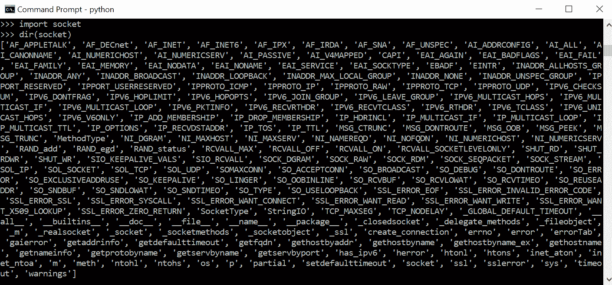
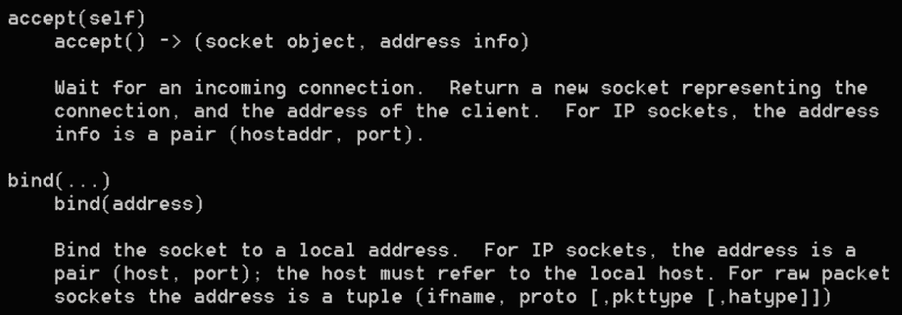

# 第三章：套接字编程

本章将介绍使用`socket`模块进行 Python 网络编程的一些基础知识。在此过程中，我们将使用 TCP 和**用户数据报** **协议**（**UDP**）协议构建客户端和服务器。套接字编程涵盖了使用 Python 编写低级网络应用程序的 TCP 和 UDP 套接字。我们还将介绍 HTTPS 和 TLS 以进行安全数据传输。

本章将涵盖以下主题：

+   了解套接字及如何在 Python 中实现它们

+   了解 Python 中 TCP 编程客户端和服务器

+   了解 Python 中 UDP 编程客户端和服务器

+   了解解析 IP 地址和域的套接字方法

+   将所有概念应用于实际用例，如端口扫描和异常处理

# 技术要求

本章的示例和源代码可在 GitHub 存储库的`第三章`文件夹中找到：[`github.com/PacktPublishing/Mastering-Python-for-Networking-and-Security`](https://github.com/PacktPublishing/Mastering-Python-for-Networking-and-Security)。

您需要在本地计算机上安装一个至少有 2GB 内存的 Python 发行版，并具有一些关于网络协议的基本知识。

# 套接字介绍

套接字是允许我们利用操作系统与网络进行交互的主要组件。您可以将套接字视为客户端和服务器之间的点对点通信通道。

网络套接字是在同一台或不同机器上的进程之间建立通信的一种简单方式。套接字的概念与 UNIX 文件描述符非常相似。诸如`read()`和`write()`（用于处理文件系统）的命令以类似的方式工作于套接字。

网络套接字地址由 IP 地址和端口号组成。套接字的目标是通过网络通信进程。

# Python 中的网络套接字

网络中不同实体之间的通信基于 Python 的套接字经典概念。套接字由机器的 IP 地址、它监听的端口和它使用的协议定义。

在 Python 中创建套接字是通过`socket.socket()`方法完成的。套接字方法的一般语法如下：

```py
s = socket.socket (socket_family, socket_type, protocol=0)
```

这些**参数**代表传输层的地址族和协议。

根据套接字类型，套接字根据是否使用 TCP 或 UDP 服务，被分类为流套接字（`socket.SOCK_STREAM`）或数据报套接字（`socket.SOCK_DGRAM`）。`socket.SOCK_DGRAM`用于 UDP 通信，`socket.SOCK_STREAM`用于 TCP 连接。

套接字还可以根据家族进行分类。我们有 UNIX 套接字（`socket.AF_UNIX`），它是在网络概念之前创建的，基于文件；我们感兴趣的是`socket.AF_INET`套接字；`socket.AF_INET6 用于 IPv6`套接字，等等：


# 套接字模块

在 Python 中，可以在`socket`模块中找到用于处理套接字的类型和函数。`socket`模块公开了快速编写 TCP 和 UDP 客户端和服务器所需的所有必要部分。`socket`模块几乎包含了构建套接字服务器或客户端所需的一切。在 Python 的情况下，套接字返回一个对象，可以对其应用套接字方法。

当您安装 Python 发行版时，默认情况下会安装此模块。

要检查它，我们可以在 Python 解释器中这样做：



在此屏幕截图中，我们看到此模块中可用的所有常量和方法。我们首先在返回的结构中看到的常量。在最常用的常量中，我们可以突出显示以下内容：

```py
socket.AF_INET
socket.SOCK_STREAM
```

构建在 TCP 级别工作的套接字的典型调用如下：

```py
socket.socket(socket.AF_INET,socket.SOCK_STREAM)
```

# 套接字方法

这些是我们可以在客户端和服务器中使用的一般套接字方法：

+   `socket.recv(buflen)`: 这个方法从套接字接收数据。方法参数指示它可以接收的最大数据量。

+   `socket.recvfrom(buflen)`: 这个方法接收数据和发送者的地址。

+   `socket.recv_into(buffer)`: 这个方法将数据接收到缓冲区中。

+   `socket.recvfrom_into(buffer)`: 这个方法将数据接收到缓冲区中。

+   `socket.send(bytes)`: 这个方法将字节数据发送到指定的目标。

+   `socket.sendto(data, address)`: 这个方法将数据发送到给定的地址。

+   `socket.sendall(data)`: 这个方法将缓冲区中的所有数据发送到套接字。

+   `socket.close()`: 这个方法释放内存并结束连接。

# 服务器套接字方法

在**客户端-服务器架构**中，有一个提供服务给一组连接的机器的中央服务器。这些是我们可以从服务器的角度使用的主要方法：

+   `socket.bind(address)`: 这个方法允许我们将地址与套接字连接起来，要求在与地址建立连接之前套接字必须是打开的

+   `socket.listen(count)`: 这个方法接受客户端的最大连接数作为参数，并启动用于传入连接的 TCP 监听器

+   `socket.accept()`: 这个方法允许我们接受来自客户端的连接。这个方法返回两个值：`client_socket` 和客户端地址。`client_socket` 是一个用于发送和接收数据的新套接字对象。在使用这个方法之前，必须调用`socket.bind(address)`和`socket.listen(q)`方法。

# 客户端套接字方法

这是我们可以在套接字客户端中用于与服务器连接的套接字方法：

+   `socket.connect(ip_address)`: 这个方法将客户端连接到服务器 IP 地址

我们可以使用`help(socket)`命令获取有关这个方法的更多信息。我们了解到这个方法与`connect_ex`方法相同，并且在无法连接到该地址时还提供了返回错误的可能性。

我们可以使用`help(socket)`命令获取有关这些方法的更多信息：


# 使用套接字模块的基本客户端

在这个例子中，我们正在测试如何从网站发送和接收数据。一旦建立连接，我们就可以发送和接收数据。通过两个函数`send()`和`recv()`，可以非常容易地与套接字通信，用于 TCP 通信。对于 UDP 通信，我们使用`sendto()`和`recvfrom()`

在这个`socket_data.py`脚本中，我们使用`AF_INET`和`SOCK_STREAM`参数创建了一个套接字对象。然后将客户端连接到远程主机并发送一些数据。最后一步是接收一些数据并打印出响应。我们使用一个无限循环（while `True`）并检查数据变量是否为空。如果发生这种情况，我们结束循环。

您可以在`socket_data.py`文件中找到以下代码：

```py
import socket
print 'creating socket ...'
# create a socket object
client = socket.socket(socket.AF_INET, socket.SOCK_STREAM)
print 'socket created'
print "connection with remote host"
s.connect(('www.google.com',80))
print 'connection ok'
s.send( 'GET /index.html HTML/1.1\r\n\r\n')
while 1:
   data=s.recv(128)
    print data
    if data== "":
        break
print 'closing the socket'
s.close()
```

# 创建一个简单的 TCP 客户端和 TCP 服务器

创建这个应用的想法是，套接字客户端可以针对给定的主机、端口和协议建立连接。套接字服务器负责在特定端口和协议上接收来自客户端的连接。

# 使用套接字创建服务器和客户端

要创建一个套接字，使用`socket.socket()`构造函数，可以将家族、类型和协议作为可选参数。默认情况下，使用`AF_INET`家族和`SOCK_STREAM`类型。

在本节中，我们将看到如何创建一对客户端和服务器脚本作为示例。

我们必须做的第一件事是为服务器创建一个套接字对象：

```py
server = socket.socket(socket.AF_INET, socket.SOCK_STREAM)
```

现在，我们必须使用 bind 方法指示服务器将监听哪个端口。对于 IP 套接字，就像我们的情况一样，bind 参数是一个包含主机和端口的元组。主机可以留空，表示可以使用任何可用的名称。

`bind(IP,PORT)`方法允许将主机和端口与特定套接字关联起来，考虑到`1-1024`端口保留用于标准协议：

```py
server.bind(("localhost", 9999))
```

最后，我们使用 listen 方法使套接字接受传入的连接并开始监听。listen 方法需要一个参数，指示我们要接受的最大连接数。

`accept`方法继续等待传入连接，阻塞执行直到消息到达。

要接受来自客户端套接字的请求，应该使用`accept()`方法。这样，服务器套接字等待接收来自另一台主机的输入连接：

```py
server.listen(10)
socket_client, (host, port) = server.accept()
```

我们可以使用`help(socket)`命令获取有关这些方法的更多信息：



一旦我们有了这个套接字对象，我们就可以通过它与客户端进行通信，使用`recv`和`send`方法（或 UDP 中的`recvfrom`和`sendfrom`）来接收或发送消息。send 方法的参数是要发送的数据，而`recv`方法的参数是要接受的最大字节数：

```py
received = socket_client.recv(1024)
print "Received: ", received
socket_client.send(received)
```

要创建客户端，我们必须创建套接字对象，使用 connect 方法连接到服务器，并使用之前看到的 send 和 recv 方法。connect 参数是一个包含主机和端口的元组，与 bind 完全相同：

```py
socket_client = socket.socket(socket.AF_INET, socket.SOCK_STREAM)
socket_client.connect(("localhost", 9999))
socket_client.send("message")
```

让我们看一个完整的例子。在这个例子中，客户端向服务器发送用户写的任何消息，服务器重复接收到的消息。

# 实现 TCP 服务器在本例中，我们将创建一个多线程 TCP 服务器。

服务器套接字在`localhost:9999`上打开一个 TCP 套接字，并在无限循环中监听请求。当您从客户端套接字接收到请求时，它将返回一条消息，指示已从另一台机器建立连接。

while 循环使服务器程序保持活动状态，并且不允许代码结束。`server.listen(5)`语句监听连接并等待客户端。此指令告诉服务器以最大连接数设置为`5`开始监听。

您可以在`tcp_server.py`文件中的`tcp_client_server`文件夹中找到以下代码：

```py
import socket
import threading

bind_ip = "localhost"
bind_port = 9999

server = socket.socket(socket.AF_INET, socket.SOCK_STREAM)server.bind((bind_ip,bind_port))
server.listen(5)
print "[*] Listening on %s:%d" % (bind_ip,bind_port)

# this is our client-handling thread
def handle_client(client_socket):
# print out what the client sends
    request = client_socket.recv(1024)
    print "[*] Received: %s" % request
    # send back a packet
    client_socket.send("Message received")
    client_socket.close()

while True:
    client,addr = server.accept()
    print "[*] Accepted connection from: %s:%d" % (addr[0],addr[1])
    # spin up our client thread to handle incoming data
    client_handler = threading.Thread(target=handle_client,args=(client,))
    client_handler.start()
```

# 实现 TCP 客户端

客户端套接字打开与服务器正在侦听的套接字相同类型的套接字并发送消息。服务器做出响应并结束执行，关闭客户端套接字。

您可以在`tcp_client.py`文件中的`tcp_client_server`文件夹中找到以下代码：

```py
import socket
s = socket.socket(socket.AF_INET, socket.SOCK_STREAM)
host = "127.0.0.1" # server address
port =9999 #server port
s.connect((host,port))
print s.recv(1024)
while True:
    message = raw_input("> ")
    s.send(message)
    if message== "quit":
        break
s.close()
```

在上述代码中，`new: s.connect((host,port))`方法将客户端连接到服务器，`s.recv(1024)`方法接收服务器发送的字符串。

# 创建一个简单的 UDP 客户端和 UDP 服务器

在本节中，我们将介绍如何使用 Python 的`Socket`模块设置自己的 UDP 客户端服务器应用程序。该应用程序将是一个服务器，它监听特定端口上的所有连接和消息，并将任何消息打印到控制台。

# UDP 协议简介

UDP 是与 TCP 处于同一级别的协议，即在 IP 层之上。它为使用它的应用程序提供了一种断开连接模式的服务。该协议适用于需要高效通信且无需担心数据包丢失的应用程序。UDP 的典型应用包括互联网电话和视频流。UDP 帧的标头由四个字段组成：

+   UDP 源端口

+   UDP 目的端口

+   UDP 消息的长度

+   检查和校验和作为错误控制字段

在 Python 中使用 TCP 的唯一区别是，在创建套接字时，必须使用`SOCK_DGRAM`而不是`SOCK_STREAM`。

TCP 和 UDP 之间的主要区别在于 UDP 不是面向连接的，这意味着我们的数据包不一定会到达目的地，并且如果传输失败，也不会收到错误通知。

# 使用 socket 模块的 UDP 客户端和服务器

在这个例子中，我们将创建一个同步 UDP 服务器，这意味着每个请求必须等待前一个请求的过程结束。`bind()`方法将用于将端口与 IP 地址关联起来。对于消息的接收，我们使用`recvfrom()`和`sendto()`方法进行发送。

# 实现 UDP 服务器

与 TCP 的主要区别在于 UDP 不控制发送的数据包的错误。TCP 套接字和 UDP 套接字之间的唯一区别是在创建套接字对象时必须指定`SOCK_DGRAM`而不是`SOCK_STREAM`。使用以下代码创建 UDP 服务器：

你可以在`udp_client_server`文件夹中的`udp_server.py`文件中找到以下代码：

```py
import socket,sys
buffer=4096
host = "127.0.0.1"
port = 6789
socket_server=socket.socket(socket.AF_INET,socket.SOCK_DGRAM)
socket_server.bind((host,port))

while True:
    data,addr = socket_server.recvfrom(buffer)
    data = data.strip()
    print "received from: ",addr
    print "message: ", data
    try:
        response = "Hi %s" % sys.platform
    except Exception,e:
        response = "%s" % sys.exc_info()[0]
    print "Response",response
    socket_server.sendto("%s "% response,addr)

socket_server.close()
```

在上面的代码中，我们看到`socket.SOCK_DGRAM`创建了一个 UDP 套接字，而`data，**`addr = s.recvfrom(buffer)`**返回了数据和源地址。

现在我们已经完成了服务器，需要实现我们的客户端程序。服务器将持续监听我们定义的 IP 地址和端口号，以接收任何 UDP 消息。在执行 Python 客户端脚本之前，必须先运行该服务器，否则客户端脚本将失败。

# 实现 UDP 客户端

要开始实现客户端，我们需要声明要尝试发送 UDP 消息的 IP 地址，以及端口号。这个端口号是任意的，但你必须确保你没有使用已经被占用的套接字：

```py
UDP_IP_ADDRESS = "127.0.0.1"
 UDP_PORT = 6789
 message = "Hello, Server"
```

现在是时候创建我们将用来向服务器发送 UDP 消息的套接字了：

```py
clientSocket = socket.socket(socket.AF_INET, socket.SOCK_DGRAM)
```

最后，一旦我们构建了新的套接字，就该编写发送 UDP 消息的代码了：

```py
clientSocket.sendto(Message, (UDP_IP_ADDRESS, UDP_PORT))
```

你可以在`udp_client_server`文件夹中的`udp_client.py`文件中找到以下代码：

```py
import socket
UDP_IP_ADDRESS = "127.0.0.1"
UDP_PORT = 6789
buffer=4096
address = (UDP_IP_ADDRESS ,UDP_PORT)
socket_client=socket.socket(socket.AF_INET,socket.SOCK_DGRAM)
while True:
    message = raw_input('?: ').strip()
    if message=="quit":
        break
    socket_client.sendto("%s" % message,address)
    response,addr = socket_client.recvfrom(buffer)
    print "=> %s" % response

socket_client.close()
```

如果我们尝试在 UDP 套接字中使用`SOCK_STREAM`，我们会得到`error: Traceback (most recent call last): File ".\udp_server.py", line 15, in <module> data,addr = socket_server.recvfrom(buffer)socket.error: [Errno 10057] A request to send or receive data was disallowed because the socket is not connected and no address was supplied`。

# 解析 IP 地址和域名

在本章中，我们已经学习了如何在 Python 中构建套接字，包括面向 TCP 连接和不面向连接的 UDP。在本节中，我们将回顾一些有用的方法，以获取有关 IP 地址或域名的更多信息。

# 使用套接字收集信息

收集更多信息的有用方法包括：

+   `gethostbyaddr(address)`:允许我们从 IP 地址获取域名

+   `gethostbyname(hostname)`:允许我们从域名获取 IP 地址

我们可以使用`help(socket)`命令获取有关这些方法的更多信息：


现在我们将详细介绍一些与主机、IP 地址和域名解析相关的方法。对于每个方法，我们将展示一个简单的例子：

+   `socket.gethostbyname(hostname)`:该方法将主机名转换为 IPv4 地址格式。IPv4 地址以字符串形式返回。这个方法相当于我们在许多操作系统中找到的`nslookup`命令：

```py
>>> import socket
> socket.gethostbyname('packtpub.com')
'83.166.169.231'
>> socket.gethostbyname('google.com')
'216.58.210.142'
```

+   `socket.gethostbyname_ex(name)`:该方法返回单个域名的多个 IP 地址。这意味着一个域名运行在多个 IP 上：

```py
>> socket.gethostbyname_ex('packtpub.com')
 ('packtpub.com', [], ['83.166.169.231'])
>>> socket.gethostbyname_ex('google.com')
 ('google.com', [], ['216.58.211.46'])
```

+   `socket.getfqdn([domain])`:用于查找域的完全限定名称：

```py
>> socket.getfqdn('google.com')
```

+   `socket.gethostbyaddr(ip_address)`:该方法返回一个元组（`hostname`，`name`，`ip_address_list`），其中`hostname`是响应给定 IP 地址的主机名，`name`是与同一地址关联的名称列表，`ip_address_list`是同一主机上同一网络接口的 IP 地址列表：

```py
>>> socket.gethostbyaddr('8.8.8.8')
('google-public-dns-a.google.com', [], ['8.8.8.8'])
```

+   `socket.getservbyname(servicename[, protocol_name])`：此方法允许您从端口名称获取端口号：

```py
>>> import socket
>>> socket.getservbyname('http')
80
>>> socket.getservbyname('smtp','tcp')
25
```

+   `socket.getservbyport(port[, protocol_name])`：此方法执行与前一个方法相反的操作，允许您从端口号获取端口名称：

```py
>>> socket.getservbyport(80)
'http'
>>> socket.getservbyport(23)
'telnet'
```

以下脚本是一个示例，演示了如何使用这些方法从 Google 服务器获取信息。

您可以在`socket_methods.py`文件中找到以下代码：

```py
import socket
import sys
try:
    print "gethostbyname"
    print socket.gethostbyname_ex('www.google.com')
    print "\ngethostbyaddr"
    print socket.gethostbyaddr('8.8.8.8')
    print "\ngetfqdn"
    print socket.getfqdn('www.google.com')
    print "\ngetaddrinfo"
    print socket.getaddrinfo('www.google.com',socket.SOCK_STREAM)
except socket.error as error:
    print (str(error))
    print ("Connection error")
    sys.exit()
```

`socket.connect_ex(address)`方法用于使用套接字实现端口扫描。此脚本显示了在本地主机上使用回环 IP 地址接口`127.0.0.1`的打开端口。

您可以在`socket_ports_open.py`文件中找到以下代码：

```py
import socket
ip ='127.0.0.1'
portlist = [22,23,80,912,135,445,20]
for port in portlist:
    sock= socket.socket(socket.AF_INET,socket.SOCK_STREAM)
    result = sock.connect_ex((ip,port))
    print port,":", result
    sock.close()
```

# 反向查找

此命令从 IP 地址获取主机名。为此任务，我们可以使用`gethostbyaddr()`函数。在此脚本中，我们从`8.8.8.8`的 IP 地址获取主机名。

您可以在`socket_reverse_lookup.py`文件中找到以下代码：

```py
import sys, socket
try :
    result=socket.gethostbyaddr("8.8.8.8")
    print "The host name is:"
    print " "+result[0]
    print "\nAddress:"
    for item in result[2]:
        print " "+item
except socket.herror,e:
    print "error for resolving ip address:",e
```

# 套接字的实际用例

在本节中，我们将讨论如何使用套接字实现端口扫描以及在使用套接字时如何处理异常。

# 使用套接字进行端口扫描

套接字是网络通信的基本构建模块，我们可以通过调用`connect_ex`方法来轻松地检查特定端口是打开、关闭还是被过滤。

例如，我们可以编写一个函数，该函数接受 IP 和端口列表作为参数，并针对每个端口返回该端口是打开还是关闭。

在此示例中，我们需要导入 socket 和`sys`模块。如果我们从主程序执行该函数，我们可以看到它如何检查每个端口，并返回特定 IP 地址的端口是打开还是关闭。第一个参数可以是 IP 地址，也可以是域名，因为该模块能够从 IP 解析名称，反之亦然。

您可以在`port_scan`文件夹中的`check_ports_socket.py`文件中找到以下代码：

```py
import socket
import sys

def checkPortsSocket(ip,portlist):
    try:
        for port in portlist:
            sock= socket.socket(socket.AF_INET,socket.SOCK_STREAM)
            sock.settimeout(5)
            result = sock.connect_ex((ip,port))
            if result == 0:
                print ("Port {}: \t Open".format(port))
            else:
                print ("Port {}: \t Closed".format(port))
            sock.close()
    except socket.error as error:
        print (str(error))
        print ("Connection error")
        sys.exit()

checkPortsSocket('localhost',[80,8080,443])
```

以下 Python 代码将允许您扫描本地或远程主机的开放端口。该程序会扫描用户输入的特定 IP 地址上的选定端口，并将开放的端口反馈给用户。如果端口关闭，它还会显示有关关闭原因的信息，例如超时连接。

您可以在`port_scan`文件夹中的`socket_port_scanner.py`文件中找到以下代码。

脚本从用户输入的 IP 地址和端口相关信息开始：

```py
#!/usr/bin/env python
#--*--coding:UTF-8--*--
# Import modules
import socket
import sys
from datetime import datetime
import errno

# RAW_INPUT IP / HOST
remoteServer    = raw_input("Enter a remote host to scan: ")
remoteServerIP  = socket.gethostbyname(remoteServer)

# RAW_INPUT START PORT / END PORT
print "Please enter the range of ports you would like to scan on the machine"
startPort    = raw_input("Enter a start port: ")
endPort    = raw_input("Enter a end port: ")

print "Please wait, scanning remote host", remoteServerIP
#get Current Time as T1
t1 = datetime.now()

```

我们继续脚本，使用从`startPort`到`endPort`的 for 循环来分析每个端口。最后，我们显示完成端口扫描所需的总时间：

```py
#Specify Range - From startPort to startPort
try:
    for port in range(int(startPort),int(endPort)):
    print ("Checking port {} ...".format(port))
    sock = socket.socket(socket.AF_INET, socket.SOCK_STREAM)
    result = sock.connect_ex((remoteServerIP, port))
    if result == 0:
        print "Port {}: Open".format(port)
    else:
        print "Port {}: Closed".format(port)
        print "Reason:",errno.errorcode[result]
    sock.close()
# If interrupted
except KeyboardInterrupt:
    print "You pressed Ctrl+C"
    sys.exit()
# If Host is wrong
except socket.gaierror:
    print 'Hostname could not be resolved. Exiting'
    sys.exit()
# If server is down
except socket.error:
    print "Couldn't connect to server"
    sys.exit()
#get current Time as t2
t2 = datetime.now()
#total Time required to Scan
total =  t2 - t1
# Time for port scanning
print 'Port Scanning Completed in: ', total
```

在执行上一个脚本时，我们可以看到打开的端口以及完成端口扫描所需的时间（以秒为单位）：


以下 Python 脚本将允许我们使用`portScanning`和`socketScan`函数扫描 IP 地址。该程序会扫描用户输入的 IP 地址解析出的特定域上的选定端口。

在此脚本中，用户必须输入主机和端口作为必填参数，用逗号分隔：


您可以在`port_scan`文件夹中的`socket_portScan.py`文件中找到以下代码：

```py
#!/usr/bin/python
# -*- coding: utf-8 -*-
import optparse
from socket import *
from threading import *

def socketScan(host, port):
    try:
        socket_connect = socket(AF_INET, SOCK_STREAM)
        socket_connect.connect((host, port))
        results = socket_connect.recv(100)
        print '[+] %d/tcp open \n' % port
        print '[+] ' + str(results)
    except:
        print '[-] %d/tcp closed \n' % port
    finally:
        socket_connect.close()

def portScanning(host, ports):
    try:
        ip = gethostbyname(host)
    except:
        print "[-] Cannot resolve '%s': Unknown host" %host
        return
    try:
        name = gethostbyaddr(ip)
        print '\n[+] Scan Results for: ' + name[0]
    except:
        print '\n[+] Scan Results for: ' + ip

    for port in ports:
        t = Thread(target=socketScan,args=(host,int(port)))
        t.start()
```

这是我们的主程序，当我们获取脚本执行的必填参数主机和端口时。一旦我们获得这些参数，我们调用`portScanning`函数，该函数将解析 IP 地址和主机名，并调用`socketScan`函数，该函数将使用`socket`模块确定端口状态：

```py
def main():
    parser = optparse.OptionParser('socket_portScan '+ '-H <Host> -P <Port>')
    parser.add_option('-H', dest='host', type='string', help='specify host')                parser.add_option('-P', dest='port', type='string', help='specify port[s] separated by comma')

(options, args) = parser.parse_args()
host = options.host
ports = str(options.port).split(',')

if (host == None) | (ports[0] == None):
    print parser.usage
    exit(0)

portScanning(host, ports)

if __name__ == '__main__':
    main()
python .\socket_portScan.py -H 8.8.8.8 -P 80,21,22,23
```

在执行上一个脚本时，我们可以看到`google-public-dns-a.google.com`域中的所有端口都已关闭。


# 处理套接字异常

为了处理异常，我们将使用 try 和 except 块。Python 的套接字库为不同的错误定义了不同类型的异常。这些异常在这里描述：

+   `exception socket.timeout`：此块捕获与等待时间到期相关的异常。

+   `exception socket.gaierror`：此块捕获在搜索有关 IP 地址的信息时发生的错误，例如当我们使用`getaddrinfo()`和`getnameinfo()`方法时。

+   `exception socket.error`：此块捕获通用输入和输出错误以及通信。这是一个通用块，您可以捕获任何类型的异常。

下一个示例向您展示如何处理异常。

您可以在`manage_socket_errors.py`文件中找到以下代码：

```py
import socket,sys
host = "127.0.0.1"
port = 9999
try:
    s=socket.socket(socket.AF_INET,socket.SOCK_STREAM)
except socket.error,e:
    print "socket create error: %s" %e
    sys.exit(1)

try:
    s.connect((host,port))
except socket.timeout,e :
    print "Timeout %s" %e
    sys.exit(1)
except socket.gaierror, e:
    print "connection error to the server:%s" %e
    sys.exit(1)
except socket.error, e:
    print "Connection error: %s" %e
    sys.exit(1)
```

在上一个脚本中，当与 IP 地址的连接超时时，它会抛出与服务器的套接字连接相关的异常。如果尝试获取不存在的特定域或 IP 地址的信息，它可能会抛出`socket.gaierror`异常，并显示`连接到服务器的错误：[Errno 11001] getaddrinfo failed`消息。如果与目标的连接不可能，它将抛出`socket.error`异常，并显示`连接错误：[Errno 10061] 由于目标计算机积极拒绝，无法建立连接`消息。

# 摘要

在本章中，我们回顾了`socket`模块，用于在 Python 中实现客户端-服务器架构的 TCP 和 UDP 协议。我们还回顾了从域解析 IP 地址和反之的主要功能和方法。最后，我们实现了端口扫描和如何在产生错误时处理异常等实际用例。

在下一个*章节*中，我们将探讨用 Python 处理 http 请求包、REST API 和服务器身份验证。

# 问题

1.  `sockets`模块的哪种方法允许从 IP 地址解析域名？

1.  `socket`模块的哪种方法允许服务器套接字接受来自另一台主机的客户端套接字的请求？

1.  `socket`模块的哪种方法允许您向特定地址发送数据？

1.  `socket`模块的哪种方法允许您将主机和端口与特定套接字关联起来？

1.  TCP 和 UDP 协议之间的区别是什么，以及如何在 Python 中使用`socket`模块实现它们？

1.  `socket`模块的哪种方法允许您将主机名转换为 IPv4 地址格式？

1.  `socket`模块的哪种方法允许您使用套接字实现端口扫描并检查端口状态？

1.  `socket`模块的哪个异常允许您捕获与等待时间到期相关的异常？

1.  `socket`模块的哪个异常允许您捕获在搜索有关 IP 地址的信息时发生的错误？

1.  `socket`模块的哪个异常允许您捕获通用输入和输出错误以及通信？

# 进一步阅读

在这些链接中，您将找到有关提到的工具和一些评论模块的官方 Python 文档的更多信息：

+   [`wiki.python.org/moin/HowTo/Sockets`](https://wiki.python.org/moin/HowTo/Sockets)

+   [`docs.python.org/2/library/socket.html`](https://docs.python.org/2/library/socket.html)

+   [`docs.python.org/3/library/socket.html`](https://docs.python.org/3/library/socket.html)

+   [`www.geeksforgeeks.org/socket-programming-python/`](https://www.geeksforgeeks.org/socket-programming-python/)

+   [`realpython.com/python-sockets/`](https://realpython.com/python-sockets/)

Python 3.7 中套接字的新功能：[`www.agnosticdev.com/blog-entry/python/whats-new-sockets-python-37`](https://www.agnosticdev.com/blog-entry/python/whats-new-sockets-python-37)
