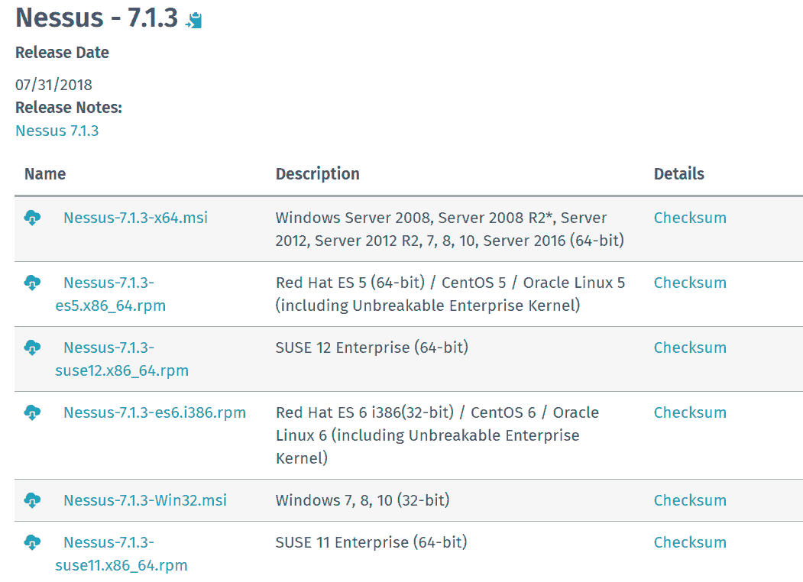
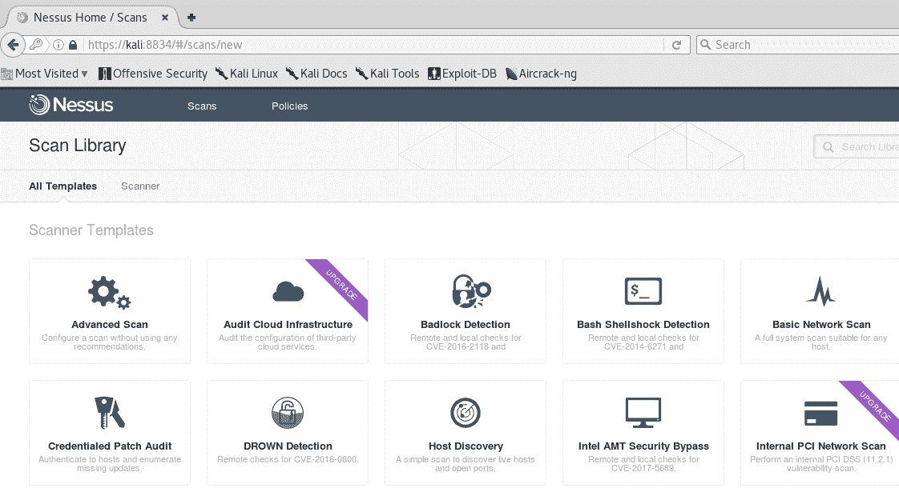
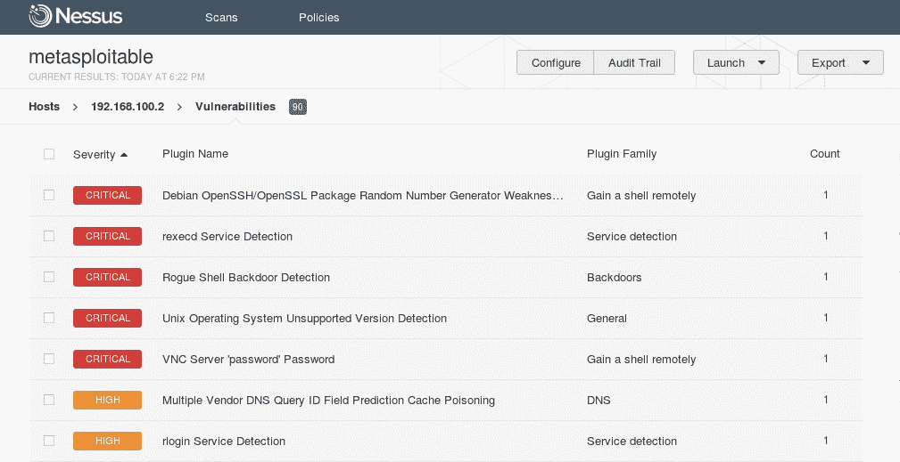
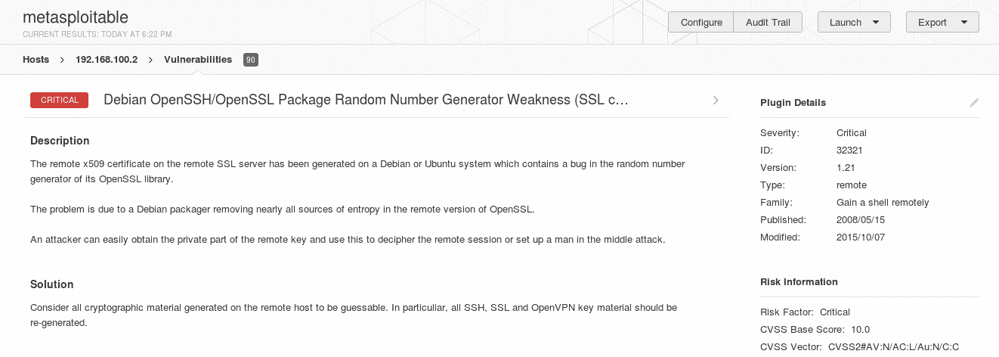
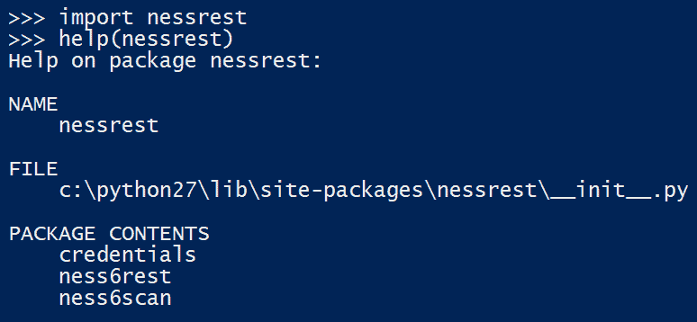
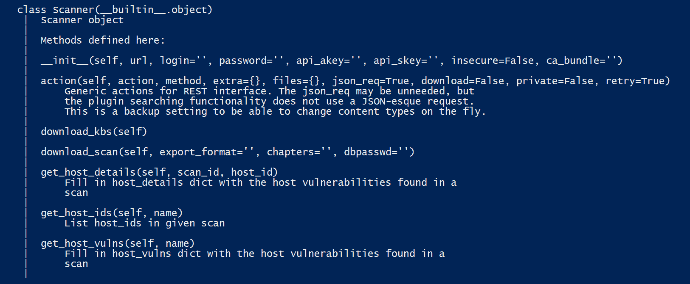
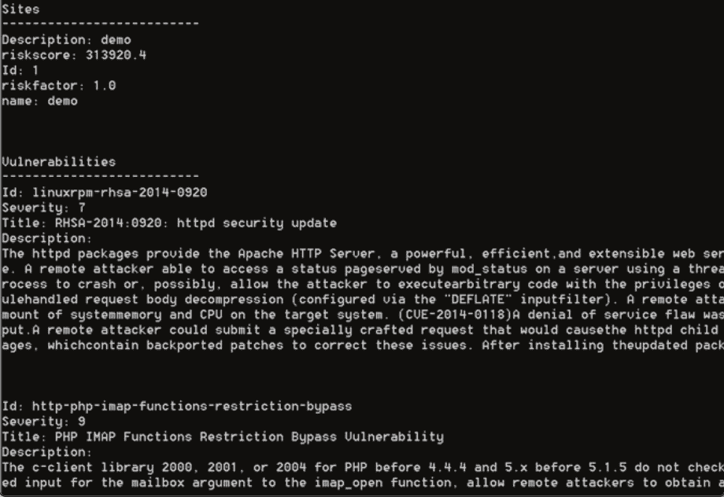

# 第十章：与漏洞扫描器交互

本章涵盖了`nessus`和`nexpose`作为漏洞扫描器，并为在服务器和 Web 应用程序中发现的主要漏洞提供报告工具。此外，我们还介绍了如何使用 Python 中的`nessrest`和`Pynexpose`模块进行编程。

本章将涵盖以下主题：

+   理解漏洞

+   理解`nessus`漏洞扫描器

+   理解允许我们连接到`Nessus`服务器的`nessrest`模块

+   理解`nexpose`漏洞扫描器

+   理解允许我们连接到`Nexpose`服务器的`Pynexpose`模块

# 技术要求

本章的示例和源代码可在 GitHub 存储库的`chapter 10`文件夹中找到：[`github.com/PacktPublishing/Mastering-Python-for-Networking-and-Security`](https://github.com/PacktPublishing/Mastering-Python-for-Networking-and-Security)。

您需要在本地机器上安装一个至少有 4GB 内存的 Python 发行版。在本章中，我们将使用一个**虚拟机**，进行与端口分析和漏洞检测相关的一些测试。可以从 sourceforge 页面下载：[`sourceforge.net/projects/metasploitable/files/Metasploitable2`](https://sourceforge.net/projects/metasploitable/files/Metasploitable2)。

要登录，您必须使用**msfadmin**作为用户名和**msfadmin**作为密码。

# 介绍漏洞

在这一部分，我们回顾了与漏洞和利用相关的概念，详细介绍了我们可以找到漏洞的格式。

# 漏洞和利用

在这一部分，我们介绍了关于漏洞和利用的一些定义。

# 什么是漏洞？

漏洞是我们应用程序中的代码错误或配置错误，攻击者可以利用它来改变应用程序的行为，比如注入代码或访问私人数据。

漏洞也可以是系统安全性的弱点，可以被利用来获取对其的访问权限。这些可以通过两种方式进行利用：远程和本地。远程攻击是从被攻击的机器不同的机器上进行的攻击，而本地攻击是在被攻击的机器上进行的攻击。后者基于一系列技术来获取对该机器的访问权限和提升权限。

# 什么是利用？

随着软件和硬件行业的发展，市场上推出的产品出现了不同的漏洞，这些漏洞已被攻击者发现并利用来危害使用这些产品的系统的安全性。为此，已经开发了利用，它们是一种软件片段、数据片段或脚本，利用错误、故障或弱点，以引起系统或应用程序中的不良行为，能够强制改变其执行流程，并有可能随意控制。

有一些漏洞只有少数人知道，称为零日漏洞，可以通过一些利用来利用，也只有少数人知道。这种利用被称为零日利用，是一种尚未公开的利用。通过这些利用进行攻击只要存在暴露窗口；也就是说，自从发现弱点直到提供者补救的时刻。在此期间，那些不知道存在这个问题的人可能容易受到使用这种利用发动的攻击。

# 漏洞格式

漏洞是通过 CVE（通用漏洞和暴露）代码唯一标识的，该代码由 MITRE 公司创建。这个代码允许用户以更客观的方式理解程序或系统中的漏洞。

标识符代码的格式为 CVE - 年份 - 编号模式；例如 CVE-2018-7889 标识了 2018 年发现的漏洞，标识符为 7889。有几个数据库可以找到有关不同现有漏洞的信息，例如：

+   通用漏洞和暴露 - 信息安全漏洞名称的标准：[`cve.mitre.org/cve/`](https://cve.mitre.org/cve/)

+   国家漏洞数据库（NVD）：[`nvd.nist.gov`](http://nvd.nist.gov)

通常，发布的漏洞都会分配其相应的利用，以验证潜在漏洞的真实存在并衡量其影响。有一个名为 Exploit Database（[`www.exploit-db.com`](http://www.exploit-db.com)）的存储库，您可以在其中找到为不同漏洞开发的许多利用程序。

CVE 提供了一个非常有用的漏洞数据库，因为除了分析问题漏洞外，它还提供了大量参考资料，其中我们经常找到直接链接到攻击此漏洞的利用程序。

例如，如果我们搜索“心脏出血”（在 Open SSL 版本 1.0.1 中发现的漏洞，允许攻击者从服务器和客户端读取内存），在 CVE 中为我们提供以下信息：


在此屏幕截图中，我们可以看到 CVE-2014-0160 漏洞的详细信息：


**CVSS**（通用漏洞评分系统）代码也可用，这是由**FIRST**（国际响应团队论坛 - [`www.first.org`](http://www.first.org)）赞助的公共倡议，使我们能够解决缺乏标准标准的问题，这些标准标准使我们能够确定哪些漏洞更有可能被成功利用。CVSS 代码引入了一个评分漏洞的系统，考虑了一组标准化和易于测量的标准。

扫描报告中的漏洞分配了高，中或低的严重性。严重性基于分配给 CVE 的通用漏洞评分系统（CVSS）分数。大多数漏洞扫描程序使用供应商的分数以准确捕获严重性：

+   **高：**漏洞具有 CVSS 基础分数，范围从 8.0 到 10.0。

+   **中：**漏洞具有 CVSS 基础分数，范围从 4.0 到 7.9。

+   **低：**漏洞具有 CVSS 基础分数，范围从 0.0 到 3.9。

# 介绍 Nessus 漏洞扫描器

在本节中，我们将审查`Nessus`漏洞扫描器，它为我们在服务器和 Web 应用程序中发现的主要漏洞提供了报告工具。

# 安装 Nessus 漏洞扫描器

`Nessus` 是一款流行的漏洞扫描工具 - 它非常强大，适用于大型企业网络。它具有客户端-服务器架构，可以使扫描更具可扩展性，可管理性和精确性。此外，它采用了几个安全元素，可以轻松适应安全基础设施，并具有非常强大的加密和身份验证机制。

要安装它，请转到[`www.tenable.com/downloads/nessus`](https://www.tenable.com/downloads/nessus)并按照操作系统的说明进行操作：



此外，您还需要从[`www.tenable.com/products/nessus/activation-code`](https://www.tenable.com/products/nessus/activation-code)获取激活代码：


# 执行 Nessus 漏洞扫描器

安装后，如果您在 Linux 上运行，可以执行"`/etc/init.d/nessusd start`"命令；通过浏览器访问该工具，网址为[`127.0.0.1:8834`](https://127.0.0.1:8834)，然后输入在安装过程中激活的用户帐户。

进入`Nessus`的主界面后，您必须输入用户的访问数据。然后，您必须访问**扫描选项卡**，如图中所示，并选择**基本网络扫描**选项：



当进行此选择时，将打开界面，必须确定扫描仪的目标，无论是计算机还是网络，扫描仪的策略以及一个名称以便识别它。一旦选择了这些数据，扫描仪就会启动，一旦完成，我们可以通过选择扫描选项卡中的分析来查看结果。

在扫描选项卡中，添加要扫描的目标，并执行该过程。通过使用这个工具，再加上在专门数据库中的搜索，可以获得系统中存在的不同漏洞，这使我们能够进入下一个阶段：利用。

# 使用 Nessus 识别漏洞

这个工具补充了通过在专门的数据库中进行查询来识别漏洞的过程。这种自动扫描的缺点包括误报、未检测到一些漏洞，有时对一些允许访问系统的漏洞进行低优先级分类。

通过这个分析，您可以观察到不同的漏洞，这些漏洞可能会被任何用户利用，因为它们可以从互联网访问。

报告包括不同现有漏洞的执行摘要。这个摘要根据漏洞的严重程度进行了颜色编码排序。每个漏洞都附有其严重性、漏洞代码和简要描述。

将`Nessus`应用于 Metasploitable 环境后得到的结果如下图所示。

在这里，我们可以看到按照严重程度排序的所有发现的漏洞的摘要：


在这里，我们可以详细查看所有漏洞，以及严重程度的描述：



名为 Debian OpenSSh/OpenSSL Package Random Number Generator Weakness 的漏洞是 metasplolitable 虚拟机中最严重的之一。我们可以看到它在 CVSS 中得分为 10：



# 使用 Python 访问 Nessus API

在这一部分，我们审查与`Nessus`漏洞扫描器进行交互的`python`模块。

# 安装 nessrest Python 模块

`Nessus`提供了一个 API，可以通过 Python 编程访问它。Tenable 提供了一个 REST API，我们可以使用任何允许 HTTP 请求的库。我们还可以在 Python 中使用特定的库，比如`nessrest`：[`github.com/tenable/nessrest`](https://github.com/tenable/nessrest)。

要在我们的 Python 脚本中使用这个模块，我们可以像安装其他模块一样导入它。我们可以使用 pip 安装`nessrest`模块：

```py
$ pip install nessrest
```

如果我们尝试从 github 源代码构建项目，依赖项可以通过满足

`pip install -r requirements.txt`**：**



您可以在脚本中以这种方式导入模块：

```py
from nessrest import ness6rest
```

# 与 nessus 服务器交互

要从 Python 与`nessus`进行交互，我们必须使用`ness6rest.Scanner`类初始化扫描仪，并传递 url 参数、用户名和密码以访问`nessus`服务器实例：

我们可以使用 Scanner init 构造方法来初始化与服务器的连接：

```py
scanner = ness6rest.Scanner(url="https://server:8834", login="username", password="password")
```

默认情况下，我们正在使用具有自签名证书的`Nessus`，但我们有能力禁用 SSL 证书检查。为此，我们需要向扫描程序初始化器传递另一个参数`insecure=True`：

```py
scanner = ness6rest.Scanner(url="https://server:8834", login="username", password="password",insecure=True)
```

在模块文档中，我们可以看到扫描特定目标的方法，并且使用`scan_results()`我们可以获取扫描结果：


要添加和启动扫描，请使用`scan_add`方法指定目标：

```py
scan.scan_add(targets="192.168.100.2")
scan.scan_run()
```

# 介绍 Nexpose 漏洞扫描仪

在本节中，我们将审查`Nexpose`漏洞扫描仪，它为我们在服务器和 Web 应用程序中发现的主要漏洞提供报告工具。

# 安装 Nexpose 漏洞扫描仪

`Nexpose`是一个漏洞扫描仪，其方法类似于`nessus`，因为除了允许我们对网络上的多台机器运行扫描外，它还具有插件系统和 API，允许将外部代码例程与引擎集成。

`NeXpose`是由`Rapid7`开发的用于扫描和发现漏洞的工具。有一个社区版本可用于非商业用途，尽管它有一些限制，但我们可以用它来进行一些测试。

要安装软件，您必须从官方页面获取有效许可证：

[`www.rapid7.com/products/nexpose/download/`](https://www.rapid7.com/products/nexpose/download/)

一旦我们通过官方页面安装了`nexpose`，我们就可以访问服务器运行的 URL。

运行`nscsvc.bat`脚本，我们将在 localhost 3780 上运行服务器：

[`localhost:3780/login.jsp`](https://localhost:3780/login.jsp)

在 Windows 机器上的默认安装在`C:\ProgramFiles\rapid7\nexpose\nsc`中

路径。

# 执行 Nexpose 漏洞扫描仪

`Nexpose`允许您分析特定的 IP、域名或服务器。首先，需要创建一组资源，称为资产，它定义了引擎可审计的所有元素。

为此，还有一系列资源，也称为**资产**，在资产内部，我们定义要分析的站点或域：


在我们的案例中，我们将分析具有 IP 地址 192.168.56.101 的**metasploitable 虚拟机**：


在分析结束时，我们可以看到扫描结果和检测到的漏洞：


`Nexpose`具有一个**API**，允许我们从其他应用程序访问其功能；这样，它允许用户从管理界面自动执行任务。

API 文档可作为 PDF 在以下链接找到：[`download2.rapid7.com/download/NeXposev4/Nexpose_API_Guide.pdf`](http://download2.rapid7.com/download/NeXposev4/Nexpose_API_Guide.pdf)。

可用的功能以及其使用的详细信息可以在指南中找到。在 Python 中，有一些库可以以相当简单的方式与 HTTP 服务进行交互。为了简化事情，可以使用一个脚本，该脚本已负责查询`nexpose`实例中可用的功能，并以 XML 格式返回包含有关漏洞的所有信息的字符串。

# 使用 Python 访问 Nexpose API

在本节中，我们将审查与`Nexpose`漏洞扫描仪进行交互的`pynexpose`模块。

# 安装`pynexpose` Python 模块

`Nexpose`有一个 API，允许我们从外部应用程序访问其功能，从而使用户能够从管理界面或`nexpose`控制台执行任务的自动化。API 允许任何例行代码使用 HTTPS 调用与`nexpose`实例交互，以返回 XML 格式的函数。使用 HTTPS 协议非常重要，不仅是出于安全原因，还因为 API 不支持使用 HTTP 进行调用。

在 Python 中，我们有`Pynexpose`模块，其代码可以在[`code.google.com/archive/p/pynexpose/`](https://code.google.com/archive/p/pynexpose/)找到。

`Pynexpose`模块允许从 Python 对位于 Web 服务器上的漏洞扫描程序进行编程访问。为此，我们必须通过 HTTP 请求与该服务器通信。

要从 Python 连接到`nexpose`服务器，我们使用位于**pynexposeHttps.py**文件中的`NeXposeServer`类。为此，我们调用构造函数，通过参数传递服务器的 IP 地址、端口以及我们登录到服务器管理网页的用户和密码：

```py
serveraddr_nexpose = "192.168.56.101"
port_server_nexpose = "3780"
user_nexpose = "user"
password_nexpose = "password"
pynexposeHttps = pynexposeHttps.NeXposeServer(serveraddr_nexpose, port_server_nexpose, user_nexpose, password_nexpose)
```

我们可以创建一个**NexposeFrameWork**类，它将初始化与服务器的连接，并创建一些方法来获取检测到的站点和漏洞列表。要解析**XML**格式的漏洞数据，我们需要使用**BeautifulSoup**等**解析器**。

在`siteListing()`函数中，我们解析了执行`site_listing()`函数后返回的内容，随后定位到文档中的所有**"sitesummary"**元素，这些元素对应于服务器上创建的每个站点的信息。

同样，在**`vulnerabilityListing()`**函数中，我们解析了执行`vulnerability_listing()`函数后返回的内容，一旦定位到文档中的所有“vulnerabilitysummary”元素。

您可以在`nexpose`文件夹中的**NexposeFrameWork.py**文件中找到以下代码：

```py
from bs4 import BeautifulSoup

class NexposeFrameWork:

    def __init__(self, pynexposeHttps):
        self.pynexposeHttps = pynexposeHttps

 def siteListing(self):
        print "\nSites"
        print "--------------------------"
        bsoupSiteListing = BeautifulSoup(self.pynexposeHttps.site_listing(),'lxml')
        for site in bsoupSiteListing.findAll('sitesummary'):
            attrs = dict(site.attrs)
                print("Description: " + attrs['description'])
                print("riskscore: " + attrs['riskscore'])
                print("Id: " + attrs['id'])
                print("riskfactor: " + attrs['riskfactor'])
                print("name: " + attrs['name'])
                print("\n")

```

在这段代码中，我们可以看到获取漏洞列表的方法；对于每个漏洞，它显示与标识符、严重性、标题和描述相关的信息：

```py
 def vulnerabilityListing(self):
        print("\nVulnerabilities")
        print("--------------------------")
        bsoupVulnerabilityListing =        BeautifulSoup(self.pynexposeHttps.vulnerability_listing(),'lxml')
         for vulnerability in bsoupVulnerabilityListing.findAll('vulnerabilitysummary'):
            attrs = dict(vulnerability.attrs)
            print("Id: " + attrs['id'])
            print("Severity: " + attrs['severity'])
            print("Title: " + attrs['title'])
            bsoupVulnerabilityDetails = BeautifulSoup(self.pynexposeHttps.vulnerability_details(attrs['id']),'lxml')
            for vulnerability_description in bsoupVulnerabilityDetails.findAll('description'):
                print("Description: " + vulnerability_description.text)
                print("\n")
```

在这段代码中，我们可以看到我们的主程序，我们正在初始化与 IP 地址、端口、用户和密码相关的参数，以连接到`nexpose`服务器：

```py
if __name__ == "__main__":
    serveraddr_nexpose = "192.168.56.101"
    port_server_nexpose = "3780"
    user_nexpose = "user"
    password_nexpose = "password"
    pynexposeHttps = pynexposeHttps.NeXposeServer(serveraddr_nexpose,port_server_nexpose, user_nexpose, password_nexpose)

    nexposeFrameWork = NexposeFrameWork(pynexposeHttps)
    nexposeFrameWork.siteListing()
    nexposeFrameWork.vulnerabilityListing()
```

一旦创建了与`nexpose`服务器的连接的对象，我们可以使用一些函数来列出服务器上创建的站点，并列出从 Web 界面执行的分析和生成的报告。最后，`logout`函数允许我们断开与服务器的连接并销毁已创建的会话：

```py
nexposeFrameWork = NexposeFrameWork(pynexposeHttps)
nexposeFrameWork.siteListing()
nexposeFrameWork.vulnerabilityListing()
pynexposeHttps.logout()
```

**NexposeFrameWork**类中创建的函数使用`pynexpose`脚本中的以下方法。`vulnerability_listing()`和`vulnerability_details()`方法负责列出所有检测到的漏洞并返回特定漏洞的详细信息：

```py
pynexposeHttps.site_listing()
pynexposeHttps.vulnerability_listing()
pynexposeHttps.vulnerability_details()
```

这些方法在**pynexposeHttps.py**文件中的**NeXposeServer**类中定义。

```py
def site_listing(self):
    response = self.call("SiteListing")
    return etree.tostring(response)

def vulnerability_listing(self):
    response = self.call("VulnerabilityListing")
    return etree.tostring(response)

def vulnerability_details(self, vulnid):
    response = self.call("VulnerabilityDetails", {"vuln-id" : vulnid})
    return etree.tostring(response)
```

需要记住的一件事是，返回的回复是以 XML 格式。解析和获取信息的一种简单方法是使用`BeautifulSoup`模块以及`lxml`解析器。

通过这种方式，我们可以解析返回的内容，并查找与站点和已注册漏洞相对应的标签。

`Nexpose`用于收集新数据，发现新的漏洞，并且通过实时监控，可以快速解决可能出现在网络或应用程序级别的漏洞。通过使用这个工具，您还可以将数据转换为详细的可视化，以便您可以集中资源并轻松与组织中的其他 IT 部门共享每个操作。

在这张图片中，我们可以看到在 metasploitble 虚拟机上执行**NexposeFrameWork.py**的结果：



此扫描的结果可以在附加的`nexpose_log.txt`文件中找到。

这些类型的工具能够定期执行漏洞扫描，并将使用不同工具发现的内容与先前的结果进行比较。这样，我们将突出显示变化，以检查它们是否是真正的发现。直到它们改变状态，可能的安全问题都不会被忽视，这对于大大减少漏洞分析的时间是理想的。

# 总结

本章的一个目标是了解允许我们连接到漏洞扫描器（如`nessus`和`nexpose`）的模块。我们复习了一些关于漏洞和利用的定义。在获得了服务、端口和操作系统等元素之后，必须在互联网上的不同数据库中搜索它们的漏洞。然而，也有几种工具可以自动执行漏洞扫描，如`Nessus`和`Nexpose`。

在下一章中，我们将使用诸如`w3a`和`fsqlmap`之类的工具来探索识别 Web 应用程序中的服务器漏洞，以及其他用于识别服务器漏洞的工具，如 ssl 和 heartbleed。

# 问题

1.  在考虑一组标准化和易于衡量的标准的情况下，评分漏洞的主要机制是什么？

1.  我们使用哪个软件包和类来与`nessus`从 python 交互？

1.  `nessrest`模块中的哪种方法启动了指定目标的扫描？

1.  `nessrest`模块中的哪种方法获取了指定目标扫描的详细信息？

1.  用 Python 连接到`nexpose`服务器的主要类是什么？

1.  负责列出所有检测到的漏洞并返回`nexpose`服务器中特定漏洞的详细信息的方法是什么？

1.  允许我们解析并获取从`nexpose`服务器获取的信息的`Python`模块的名称是什么？

1.  允许我们连接到`NexPose`漏洞扫描器的`Python`模块的名称是什么？

1.  什么是允许我们连接到`Nessus`漏洞扫描器的`Python`模块的名称？

1.  `Nexpose`服务器以何种格式返回响应，以便从 Python 中简单地处理？

# 进一步阅读

在这些链接中，您将找到有关`nessus`和`nexpose`的更多信息和官方文档：

+   [`docs.tenable.com/nessus/Content/GettingStarted.htm`](https://docs.tenable.com/nessus/Content/GettingStarted.htm)

+   [`nexpose.help.rapid7.com/docs/getting-started-with-nexpose`](https://nexpose.help.rapid7.com/docs/getting-started-with-nexpose)

+   [`help.rapid7.com/insightvm/en-us/api/index.html`](https://help.rapid7.com/insightvm/en-us/api/index.html)

今天，有很多漏洞扫描工具。Nessus、Seccubus、openvas、著名的 Nmap 扫描器，甚至 OWASP ZAP 都是扫描网络和计算机系统漏洞最流行的工具之一：

+   [`www.seccubus.com/`](https://www.seccubus.com/)

+   [`www.openvas.org/`](http://www.openvas.org/)

开放漏洞评估系统（OpenVAS）是一个免费的安全扫描平台，其大部分组件都在 GNU 通用公共许可证（GNU GPL）下许可。主要组件可通过几个 Linux 软件包或作为可下载的虚拟应用程序用于测试/评估目的。
