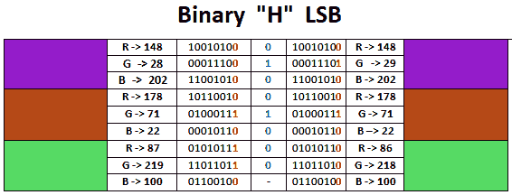
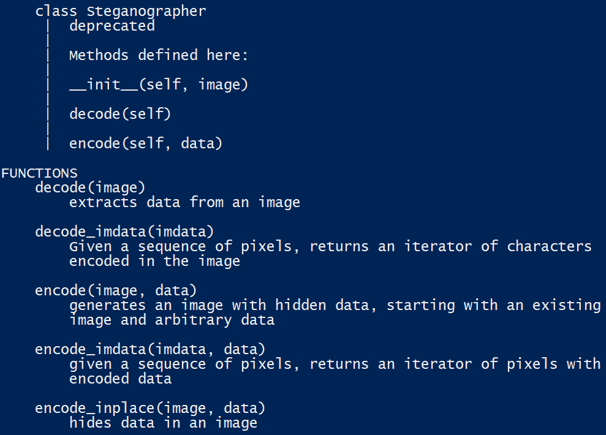

# 第十三章：密码学和隐写术

本章涵盖了 Python 中用于加密和解密信息的主要模块，如 pycrypto 和 cryptography。我们还涵盖了隐写术技术以及如何使用`stepic`模块在图像中隐藏信息。

本章将涵盖以下主题：

+   用于加密和解密信息的`pycrypto`模块

+   用于加密和解密信息的`cryptography`模块

+   在图像中隐藏信息的主要隐写术技术

+   如何使用`stepic`模块在图像中隐藏信息

# 技术要求

本章的示例和源代码可在 GitHub 存储库的`chapter13`文件夹中找到：[`github.com/PacktPublishing/Mastering-Python-for-Networking-and-Security`](https://github.com/PacktPublishing/Mastering-Python-for-Networking-and-Security)。

您需要在本地计算机上安装至少 4GB 内存的 Python 发行版。

# 使用 pycrypto 加密和解密信息

在本节中，我们将回顾加密算法和用于加密和解密数据的`pycrypto`模块。

# 密码学简介

密码学可以定义为隐藏信息的实践，包括消息完整性检查、发送者/接收者身份验证和数字签名等技术。

以下是四种最常见的密码算法：

+   **哈希函数：** 也称为单向加密，它们没有密钥。`hash`函数为明文输入输出固定长度的哈希值，理论上不可能恢复明文的长度或内容。单向`加密`函数在网站中用于以一种无法检索的方式存储密码。

+   **带密钥的哈希函数：** 用于构建消息认证码（MAC）；MAC 旨在防止暴力攻击。因此，它们被故意设计成慢速的。

+   **对称加密：** 使用可变密钥对一些文本输入输出密文，我们可以使用相同的密钥解密密文。使用相同密钥进行加密和解密的算法称为对称密钥算法。

+   **公钥算法：** 对于公钥算法，我们有两个不同的密钥：一个用于加密，另一个用于解密。这种做法使用一对密钥：一个用于加密，另一个用于解密。这种技术的用户发布他们的公钥，同时保持他们的私钥保密。这使得任何人都可以使用公钥发送加密的消息，只有私钥的持有者才能解密。这些算法被设计成即使攻击者知道相应的公钥，也极其困难找到私钥。

例如，对于哈希函数，Python 提供了一些模块，比如`hashlib`。

以下脚本返回文件的`md5`校验和。

你可以在`hashlib`文件夹内的`md5.py`文件中找到以下代码：

```py
import hashlib

def md5Checksum(filePath):
    fh = open(filePath, 'rb')
    m = hashlib.md5()
    while True:
        data = fh.read(8192)
        if not data:
            break
        m.update(data)
    return m.hexdigest()

print('The MD5 checksum is', md5Checksum('md5.py'))
```

上一个脚本的输出是：

`MD5 校验和为 8eec2037fe92612b9a141a45b60bec26`

# pycrypto 简介

在使用 Python 加密信息时，我们有一些选项，但其中最可靠的之一是 PyCrypto 加密库，它支持分组加密、流加密和哈希计算的功能。

`PyCrypto`模块提供了在 Python 程序中实现强加密所需的所有函数，包括哈希函数和加密算法。

例如，`pycrypto`支持的分组密码有：

+   AES

+   ARC2

+   Blowfish

+   CAST

+   DES

+   DES3

+   IDEA

+   RC5

总的来说，所有这些密码都是以相同的方式使用的。

我们可以使用`Crypto.Cipher`包来导入特定的密码类型：

`from Crypto.Cipher import [Chiper_Type]`

我们可以使用新的方法构造函数来初始化密码：

`new ([key], [mode], [Vector IV])`

使用这种方法，只有密钥是必需的，我们必须考虑加密类型是否需要具有特定大小。可能的模式有`MODE_ECB`、`MODE_CBC`、`MODE_CFB`、`MODE_PGP`、`MODE_OFB`、`MODE_CTR`和`MODE_OPENPGP`。

如果使用`MODE_CBC`或`MODE_CFB`模式，则必须初始化第三个参数（向量 IV），这允许给密码提供初始值。一些密码可能有可选参数，例如 AES，可以使用`block_size`和`key_size`参数指定块和密钥大小。

与 hashlib 一样，`pycrypto`也支持哈希函数。使用`pycrypto`的通用哈希函数类似：

+   我们可以使用**`Crypto.Hash`**包来导入特定的哈希类型：`from Crypto.Hash import [Hash Type]`

+   我们可以使用 update 方法设置我们需要获取哈希的数据：`update('data')`

+   我们可以使用`hexdigest()`方法生成哈希：`hexdigest()`

以下是我们在获取文件的校验和时看到的相同示例，这次我们使用`pycrypt`而不是`hashlib`。

在`pycrypto`文件夹内的`hash.py`文件中可以找到以下代码：

```py
from Crypto.Hash import MD5

def md5Checksum(filePath):
    fh = open(filePath, 'rb')
    m = MD5.new()
    while True:
        data = fh.read(8192)
        if not data:
            break
        m.update(data)
    return m.hexdigest()

print('The MD5 checksum is' + md5Checksum('hash.py'))
```

要加密和解密数据，我们可以使用`**encrypt**`和`**decrypt**`函数：

```py
encrypt ('clear text')
decrypt ('encrypted text')
```

# 使用 DES 算法进行加密和解密

DES 是一种分组密码，这意味着要加密的文本是 8 的倍数，因此我在文本末尾添加了空格。当我解密它时，我将它们删除了。

以下脚本加密用户和密码，并最后，模拟服务器已收到这些凭据，解密并显示这些数据。

在`pycrypto`文件夹内的`Encrypt_decrypt_DES.py`文件中可以找到以下代码：

```py
from Crypto.Cipher import DES

# How we use DES, the blocks are 8 characters
# Fill with spaces the user until 8 characters
user =  "user    "
password = "password"

# we create the cipher with DES
cipher = DES.new('mycipher')

# encrypt username and password
cipher_user = cipher.encrypt(user)
cipher_password = cipher.encrypt(password)

# we send credentials
print("User: " + cipher_user)
print("Password: " + cipher_password)
# We simulate the server where the messages arrive encrypted.

# we decode messages and remove spaces with strip()
cipher = DES.new('mycipher')
decipher_user = cipher.decrypt(cipher_user).strip()
decipher_password = cipher.decrypt(cipher_password)
print("SERVER decipher:")
print("User: " + decipher_user)
print("Password: " + decipher_password)
```

该程序使用 DES 加密数据，因此它首先导入`DES`模块并使用以下指令创建编码器：

`cipher = DES.new('mycipher')`

‘`mycipher`’参数值是加密密钥。一旦创建了密码，就像在示例程序中看到的那样，加密和解密非常简单。

# 使用 AES 算法进行加密和解密

AES 加密需要一个强大的密钥。密钥越强大，加密就越强大。我们的 AES 密钥需要是 16、24 或 32 字节长，我们的**初始化向量**需要是**16 字节**长。这将使用`random`和`string`模块生成。

要使用 AES 等加密算法，我们可以从**`Crypto.Cipher.AES`**包中导入它。由于 PyCrypto 块级加密 API 非常低级，因此对于 AES-128、AES-196 和 AES-256，它只接受 16、24 或 32 字节长的密钥。密钥越长，加密就越强大。

另外，对于使用 pycrypto 进行 AES 加密，需要确保数据的长度是 16 字节的倍数。如果不是，则填充缓冲区，并在输出的开头包含数据的大小，以便接收方可以正确解密。

在`pycrypto`文件夹内的`Encrypt_decrypt_AES.py`文件中可以找到以下代码：

```py
# AES pycrypto package
from Crypto.Cipher import AES

# key has to be 16, 24 or 32 bytes long
encrypt_AES = AES.new('secret-key-12345', AES.MODE_CBC, 'This is an IV-12')

# Fill with spaces the user until 32 characters
message = "This is the secret message      "

ciphertext = encrypt_AES.encrypt(message)
print("Cipher text: " , ciphertext)

# key must be identical
decrypt_AES = AES.new('secret-key-12345', AES.MODE_CBC, 'This is an IV-12')
message_decrypted = decrypt_AES.decrypt(ciphertext)

print("Decrypted text: ", message_decrypted.strip())
```

上一个脚本的**输出**是：

`('密码文本：'，'\xf2\xda\x92:\xc0\xb8\xd8PX\xc1\x07\xc2\xad"\xe4\x12\x16\x1e)(\xf4\xae\xdeW\xaf_\x9d\xbd\xf4\xc3\x87\xc4')`

`('解密文本：'，'这是秘密消息')`

# 使用 AES 进行文件加密

AES 加密要求每个写入的块的大小是 16 字节的倍数。因此，我们以块的形式读取、加密和写入数据。块大小需要是 16 的倍数。

以下脚本加密由参数提供的文件。

在`pycrypto`文件夹内的`aes-file-encrypt.py`文件中可以找到以下代码：

```py
from Crypto.Cipher import AES
from Crypto.Hash import SHA256
import os, random, struct

def encrypt_file(key, filename):
    chunk_size = 64*1024
    output_filename = filename + '.encrypted'

    # Initialization vector
    iv = ''.join(chr(random.randint(0, 0xFF)) for i in range(16))

    #create the encryption cipher
    encryptor = AES.new(key, AES.MODE_CBC, iv)

    #Determine the size of the file
    filesize = os.path.getsize(filename)

    #Open the output file and write the size of the file. 
    #We use the struct package for the purpose.
    with open(filename, 'rb') as inputfile:
        with open(output_filename, 'wb') as outputfile:
            outputfile.write(struct.pack('<Q', filesize))
            outputfile.write(iv)

            while True:
                chunk = inputfile.read(chunk_size)
                if len(chunk) == 0:
                    break
                elif len(chunk) % 16 != 0:
                    chunk += ' ' * (16 - len(chunk) % 16)
                outputfile.write(encryptor.encrypt(chunk))

password = "password"

def getKey(password):
    hasher = SHA256.new(password)
    return hasher.digest()

encrypt_file(getKey(password), 'file.txt');
```

上一个脚本的输出是一个名为`file.txt.encrypted`的文件，其中包含原始文件的相同内容，但信息不可读。

上一个脚本的工作方式是首先加载所有所需的模块并定义加密文件的函数：

```py
from Crypto.Cipher import AES
import os, random, struct
def encrypt_file(key, filename, chunk_size=64*1024):
output_filename = filename + '.encrypted'
```

此外，我们需要获取我们的初始化向量。需要一个 16 字节的初始化向量，生成如下：

```py
# Initialization vector
iv = ''.join(chr(random.randint(0, 0xFF)) for i in range(16))
```

然后我们可以在`PyCrypto`模块中初始化 AES 加密方法：

```py
encryptor = AES.new(key, AES.MODE_CBC, iv)
filesize = os.path.getsize(filename)
```

# 使用 AES 进行文件解密

要解密，我们需要反转前面的过程，使用 AES 解密文件。

您可以在`pycrypto`文件夹中的**`aes-file-decrypt.py`**文件中找到以下代码：

```py
from Crypto.Cipher import AES
from Crypto.Hash import SHA256
import os, random, struct

def decrypt_file(key, filename):
    chunk_size = 64*1024
    output_filename = os.path.splitext(filename)[0]

    #open the encrypted file and read the file size and the initialization vector. 
    #The IV is required for creating the cipher.
    with open(filename, 'rb') as infile:
        origsize = struct.unpack('<Q', infile.read(struct.calcsize('Q')))[0]
        iv = infile.read(16)

        #create the cipher using the key and the IV.
        decryptor = AES.new(key, AES.MODE_CBC, iv)

        #We also write the decrypted data to a verification file, 
        #so we can check the results of the encryption 
        #and decryption by comparing with the original file.
        with open(output_filename, 'wb') as outfile:
            while True:
                chunk = infile.read(chunk_size)
                if len(chunk) == 0:
                    break
                outfile.write(decryptor.decrypt(chunk))
            outfile.truncate(origsize)

password = "password"

def getKey(password):
    hasher = SHA256.new(password)
    return hasher.digest()

decrypt_file(getKey(password), 'file.txt.encrypted');
```

# 使用密码学对信息进行加密和解密

在本节中，我们将回顾用于加密和解密数据的`cryptography`模块。`Cryptography`是一个更近期的模块，比`pycrypto`具有更好的性能和安全性。

# 密码学简介

密码学可在`pypi`存储库中找到，并且可以使用`pip install cryptography`命令进行安装。

在[`pypi.org/project/cryptography`](https://pypi.org/project/cryptography) URL 中，我们可以看到此模块的最新版本。

有关安装和支持的平台的更多信息，请查看[`cryptography.io/en/latest/installation/`](https://cryptography.io/en/latest/installation/)。

密码学包括常见加密算法的高级和低级接口，如对称密码、消息摘要和密钥派生函数。例如，我们可以使用`fernet`包进行对称加密。

# 使用 fernet 包进行对称加密

Fernet 是对称加密的一种实现，并保证加密消息不能在没有密钥的情况下被篡改或读取。

要生成密钥，我们可以使用`Fernet`接口中的`generate_key()`方法。

您可以在 cryptography 文件夹中的`encrypt_decrypt.py`文件中找到以下代码：

```py
from cryptography.fernet import Fernet

key = Fernet.generate_key()
cipher_suite = Fernet(key)

print("Key "+str(cipher_suite))
message = "Secret message"

cipher_text = cipher_suite.encrypt(message)
plain_text = cipher_suite.decrypt(cipher_text)

print("\n\nCipher text: "+cipher_text)

print("\n\nPlain text: "+plain_text)
```

这是先前脚本的输出：


# 使用 fernet 包的密码

可以使用 Fernet 使用密码。为此，您需要通过密钥派生函数（如**PBKDF2HMAC**）运行密码。

**PBKDF2（基于密码的密钥派生函数 2）**通常用于从密码派生加密密钥。

有关密钥派生函数的更多信息，请访问[`cryptography.io/en/latest/hazmat/primitives/key-derivation-functions/`](https://cryptography.io/en/latest/hazmat/primitives/key-derivation-functions/)。

在这个例子中，我们使用这个函数从密码生成一个密钥，并使用该密钥创建我们用于加密和解密数据的 Fernet 对象。在这种情况下，要加密的数据是一个简单的消息字符串。我们可以使用`verify()`方法，检查从提供的密钥派生新密钥是否生成与 expected_key 相同的密钥。

您可以在 cryptography 文件夹中的`encrypt_decrypt_kdf.py`文件中找到以下代码：

```py
import base64
import os
from cryptography.fernet import Fernet
from cryptography.hazmat.backends import default_backend
from cryptography.hazmat.primitives import hashes
from cryptography.hazmat.primitives.kdf.pbkdf2 import PBKDF2HMAC

password = "password"
salt = os.urandom(16)
kdf = PBKDF2HMAC(algorithm=hashes.SHA256(),length=32,salt=salt,iterations=100000,backend=default_backend())

key = kdf.derive(password)

kdf = PBKDF2HMAC(algorithm=hashes.SHA256(),length=32,salt=salt,iterations=100000,backend=default_backend())

#verify() method checks whether deriving a new key from 
#the supplied key generates the same key as the expected_key, 
#and raises an exception if they do not match.
kdf.verify(password, key)

key = base64.urlsafe_b64encode(key)
fernet = Fernet(key)
token = fernet.encrypt("Secret message")

print("Token: "+token)
print("Message: "+fernet.decrypt(token))
```

这是先前脚本的输出：


如果我们使用`verify()`方法验证密钥，并且在过程中检查到密钥不匹配，它会引发`cryptography.exceptions.InvalidKey`异常：


# 使用 ciphers 包进行对称加密

`cryptography`模块中的 ciphers 包提供了用于对称加密的`cryptography.hazmat.primitives.ciphers.Cipher`类。

Cipher 对象将算法（如 AES）与模式（如 CBC 或 CTR）结合在一起。

在下面的脚本中，我们可以看到使用 AES 加密然后解密内容的示例。

您可以在 cryptography 文件夹中的`encrypt_decrypt_AES.py`文件中找到以下代码：

```py
import os
from cryptography.hazmat.primitives.ciphers import Cipher, algorithms, modes
from cryptography.hazmat.backends import default_backend

backend = default_backend()
key = os.urandom(32)
iv = os.urandom(16)
cipher = Cipher(algorithms.AES(key), modes.CBC(iv), backend=backend)

encryptor = cipher.encryptor()
print(encryptor)

message_encrypted = encryptor.update("a secret message")

print("\n\nCipher text: "+message_encrypted)
ct = message_encrypted + encryptor.finalize()

decryptor = cipher.decryptor()

print("\n\nPlain text: "+decryptor.update(ct))
```

这是先前脚本的输出：


# 在图像中隐藏信息的隐写术技术

在本节中，我们将回顾隐写术技术和`python`模块 stepic，用于在图像中隐藏信息。

# 隐写术简介

隐写术（[`en.wikipedia.org/wiki/Steganography`](http://en.wikipedia.org/wiki/Steganography)）是密码学的一个特定分支，它允许我们将秘密信息隐藏在公共信息中，也就是在表面上无害的信息中。

隐藏信息的主要技术之一是使用**最不显著位（LSB）**。

当通过图像的每个像素时，我们获得一个由整数（0）到（255）组成的 RGB 三元组，由于每个数字都有其自己的二进制表示，我们将该三元组转换为其等效的二进制；例如，由（148，28，202）组成的像素的二进制等效为（10010100，00011100，11001010）。

目标是编辑最不显著的位，也就是最右边的位。在下面的 LSB 列中，我们已经改变了位（用红色标出），但其余部分仍然完好无损，RGB 三元组的结果发生了一些变化，但变化很小。如果它们在两种颜色中被小心地设置，很不可能发现任何视觉差异，但实际上发生了变化，改变了最不显著的位之后，RGB 三元组与一开始的不同，但颜色显然是相同的。

我们可以改变信息并发送它，而攻击者并不会意识到有什么奇怪的地方。

一切都是 0 和 1，我们可以使 LSB 遵循我们想要的顺序，例如，如果我们想要隐藏单词“Hacking”，我们必须记住每个字母（字符）可以由一个字节表示，即“H”= 01001000，所以如果我们有 3 个像素，我们可以使用 LSB 隐藏该序列。

在这张图片中，我们可以看到“H”字母的二进制和 LSB 格式的表示：



由于每个像素有三个组成它的值，而且在每个值中我们只能改变一个位，所以需要三个像素来隐藏字母“H”，因为它的二进制表示对应于八位。前面的表格非常直观；为了得到原始图像的三个像素，我们取出它们各自的 RGB，而且由于我们想要以二进制形式隐藏字母“H”，我们只需按照“H”的顺序替换最不显著的位。然后我们重新构建这三个像素，只是现在我们在其中隐藏了一个字母，它们的值已经改变，但对人眼来说没有可察觉的变化。

通过这种方式，我们不仅可以隐藏文本，还可以隐藏各种信息，因为一切都可以用二进制值来表示；恢复信息的方法只是接收被改变的图像并开始读取最不显著的位，因为每八位，我们有一个字符的表示。

在下一个脚本中，我们将使用 Python 实现这种技术。

您可以在`steganography_LSB.py`文件中的 steganography 文件夹中找到以下代码。

首先，我们定义了用于获取、设置**最不显著位（LSB）**的函数，并设置了`extract_message()`方法，该方法读取图像并访问每个像素对的 LSB。

```py
#!/usr/bin/env python

#Hide data in lsbs of an image
#python 3.x compatible

from PIL import Image

def get_pixel_pairs(iterable):
    a = iter(iterable)
    return zip(a, a)

def set_LSB(value, bit):
    if bit == '0':
        value = value & 254
    else:
        value = value | 1
    return value

def get_LSB(value):
    if value & 1 == 0:
        return '0'
    else:
        return '1'

def extract_message(image):
    c_image = Image.open(image)
    pixel_list = list(c_image.getdata())
    message = ""
    for pix1, pix2 in get_pixel_pairs(pixel_list):
        message_byte = "0b"
        for p in pix1:
            message_byte += get_LSB(p)
        for p in pix2:
            message_byte += get_LSB(p)
        if message_byte == "0b00000000":
            break
        message += chr(int(message_byte,2))
    return message

```

现在，我们定义我们的`hide_message`方法，它读取图像并使用 LSB 在图像中隐藏消息：

```py
def hide_message(image, message, outfile):
    message += chr(0)
    c_image = Image.open(image)
    c_image = c_image.convert('RGBA')
    out = Image.new(c_image.mode, c_image.size)
    width, height = c_image.size
    pixList = list(c_image.getdata())
    newArray = []
    for i in range(len(message)):
        charInt = ord(message[i])
        cb = str(bin(charInt))[2:].zfill(8)
        pix1 = pixList[i*2]
        pix2 = pixList[(i*2)+1]
        newpix1 = []
        newpix2 = []

        for j in range(0,4):
            newpix1.append(set_LSB(pix1[j], cb[j]))
            newpix2.append(set_LSB(pix2[j], cb[j+4]))

        newArray.append(tuple(newpix1))
        newArray.append(tuple(newpix2))

    newArray.extend(pixList[len(message)*2:])
    out.putdata(newArray)
    out.save(outfile)
    return outfile

if __name__ == "__main__":

 print("Testing hide message in python_secrets.png with LSB ...")
 print(hide_message('python.png', 'Hidden message', 'python_secrets.png'))
 print("Hide test passed, testing message extraction ...")
 print(extract_message('python_secrets.png'))
```

# 使用 Stepic 进行隐写术

Stepic 提供了一个`Python`模块和一个命令行界面，用于在图像中隐藏任意数据。它轻微地修改图像中像素的颜色以存储数据。

要设置 stepic，只需使用`pip install stepic`命令进行安装。

Stepic 的`Steganographer`类是该模块的主要类，我们可以看到可用于在图像中编码和解码数据的方法：



在下一个脚本中，与 Python 2.x 版本兼容，我们可以看到这些函数的实现。

您可以在`**stepic.py**`文件中的`steganography`文件夹中找到以下代码：

```py
# stepic - Python image steganography
'''Python image steganography
Stepic hides arbitrary data inside PIL images.
Stepic uses the Python Image Library
(apt: python-imaging, web: <http://www.pythonware.com/products/pil/>).
'''
from PIL import Image

def _validate_image(image):
    if image.mode not in ('RGB', 'RGBA', 'CMYK'):
        raise ValueError('Unsupported pixel format: ''image must be RGB, RGBA, or CMYK')
    if image.format == 'JPEG':
        raise ValueError('JPEG format incompatible with steganography')

```

在这部分代码中，我们可以看到与使用 LSB 在图像中编码数据相关的方法。

Stepic 从左到右读取图像像素，从顶部开始。每个像素由 0 到 255 之间的三个整数三元组定义，第一个提供红色分量，第二个提供绿色，第三个提供蓝色。它一次读取三个像素，每个像素包含三个值：红色，绿色和蓝色。每组像素有九个值。一个字节的数据有八位，所以如果每种颜色都可以稍微修改，通过将最不显著的位设置为零或一，这三个像素可以存储一个字节，还剩下一个颜色值：

```py
def encode_imdata(imdata, data):
    '''given a sequence of pixels, returns an iterator of pixels with encoded data'''

    datalen = len(data)
    if datalen == 0:
        raise ValueError('data is empty')
    if datalen * 3 > len(imdata):
        raise ValueError('data is too large for image')

    imdata = iter(imdata)
    for i in xrange(datalen):
        pixels = [value & ~1 for value in
            imdata.next()[:3] + imdata.next()[:3] + imdata.next()[:3]]
        byte = ord(data[i])
        for j in xrange(7, -1, -1):
            pixels[j] |= byte & 1
            byte >>= 1
        if i == datalen - 1:
            pixels[-1] |= 1
            pixels = tuple(pixels)
            yield pixels[0:3]
            yield pixels[3:6]
            yield pixels[6:9]

def encode_inplace(image, data):
    '''hides data in an image'''
    _validate_image(image)
    w = image.size[0]
    (x, y) = (0, 0)
    for pixel in encode_imdata(image.getdata(), data):
        image.putpixel((x, y), pixel)
        if x == w - 1:
            x = 0
            y += 1
        else:
            x += 1

def encode(image, data):
    '''generates an image with hidden data, starting with an existing
       image and arbitrary data'''

    image = image.copy()
    encode_inplace(image, data)
    return image
```

在代码的这一部分中，我们可以看到与使用 LSB 从图像中解码数据相关的方法。基本上，给定图像中的一系列像素，它返回一个编码在图像中的字符的迭代器：

```py
def decode_imdata(imdata):
    '''Given a sequence of pixels, returns an iterator of characters
    encoded in the image'''

    imdata = iter(imdata)
    while True:
        pixels = list(imdata.next()[:3] + imdata.next()[:3] + imdata.next()[:3])
        byte = 0
        for c in xrange(7):
            byte |= pixels[c] & 1
            byte <<= 1
        byte |= pixels[7] & 1
        yield chr(byte)
        if pixels[-1] & 1:
            break

def decode(image):
    '''extracts data from an image'''
    _validate_image(image)
    return ''.join(decode_imdata(image.getdata()))
```

Stepic 使用这个剩余值的最不显著位(**[`en.wikipedia.org/wiki/Least_significant_bit`](http://en.wikipedia.org/wiki/Least_significant_bit)**)来表示数据的结束。编码方案不会透露图像是否包含数据，因此 Stepic 将始终从任何图像中提取至少一个字节的数据，无论是否有人有意地在那里隐藏数据。

要解码它，我们可以使用以下函数：

```py
decode_imdata(imdata)
```

我们可以看到，这个函数是`encode_imdata(imdata, data)`函数的逆函数，它一次从左到右，从上到下读取三个像素，直到最后一个像素的最后一个颜色的最后一个位读取到 1。

# 使用 stepic 在图像中隐藏数据

在接下来的脚本中，我们使用`PIL`模块中的 Image 包来读取图像。一旦我们读取了图像，我们使用 stepic 中的 encode 函数将一些文本隐藏在图像中。我们将这些信息保存在第二个图像中，并使用 decode 函数来获取隐藏的文本。

您可以在`steganography`文件夹中的`stepic_example.py`文件中找到以下代码：

```py
from PIL import Image
import stepic

#Open an image file in which you want to hide data
image = Image.open("python.png")

#Encode some text into the source image. 
#This returns another Image instance, which can save to a new file

image2 = stepic.encode(image, 'This is the hidden text')
image2.save('python_secrets.png','PNG')

#Use the decode() function to extract data from an image:

image2 = Image.open('python_secrets.png')
s = stepic.decode(image2) 
data = s.decode()
print("Decoded data: " + data)
```

# 总结

本章的一个目标是学习`pycrypto`和`cryptography`模块，它们允许我们使用 AES 和 DES 算法对信息进行加密和解密。我们还研究了隐写术技术，如最不显著位，以及如何使用 stepic 模块在图像中隐藏信息。

为了结束这本书，我想强调读者应该更多地了解他们认为最重要的主题。每一章都涵盖了基本的思想，从那里，读者可以使用*进一步阅读*部分找到更多信息的资源。

# 问题

1.  哪种算法类型使用相同的密钥来加密和解密数据？

1.  哪种算法类型使用两个不同的密钥，一个用于加密，另一个用于解密？

1.  我们可以在 pycrypto 中使用哪个包来使用 AES 等加密算法？

1.  哪种算法需要确保数据的长度是 16 字节的倍数？

1.  我们可以使用`cryptography`模块的哪个包进行对称加密？

1.  用于从密码生成加密密钥的算法是什么？

1.  fernet 包为对称加密提供了什么，用于生成密钥的方法是什么？

1.  哪个类提供了密码包对称加密？

1.  stepic 的哪个方法生成带有隐藏数据的图像，从现有的开始

图像和任意数据？

1.  从 pycrypto 中包含一些`hash`函数的哪个包允许单向加密？

# 进一步阅读

在这些链接中，您将找到有关本章中提到的工具及其官方文档的更多信息：

`Pycryptodome`是基于`pypi`存储库中可用的`pycrypto`库的模块：

[`pypi.org/project/pycryptodome/`](https://pypi.org/project/pycryptodome/)

[`github.com/Legrandin/pycryptodome`](https://github.com/Legrandin/pycryptodome)

[`www.pycryptodome.org/en/latest/`](https://www.pycryptodome.org/en/latest/)

在这些链接中，我们可以看到与`Pycrypto`模块相关的其他示例：

[`github.com/X-Vector/Crypt0x/tree/master/Crypt0x`](https://github.com/X-Vector/Crypt0x/tree/master/Crypt0x)

[`github.com/jmortega/pycon-security_criptography`](https://github.com/jmortega/pycon-security_criptography)

如果您需要更深入地探索密码生成，您可以找到其他有趣的模块，比如 Secrets：

[`docs.python.org/3/library/secrets.html#module-secrets`](https://docs.python.org/3/library/secrets.html#module-secrets)

`secrets`模块用于生成适用于管理数据（如密码、帐户验证、安全令牌和相关机密信息）的具有密码学强度的随机数。
