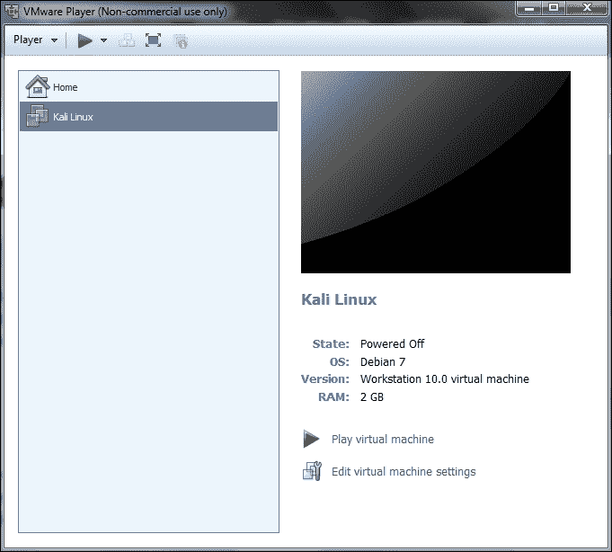
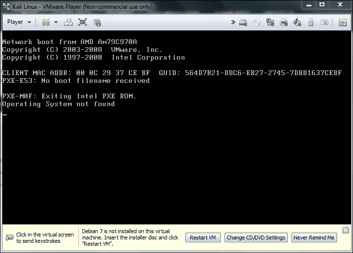
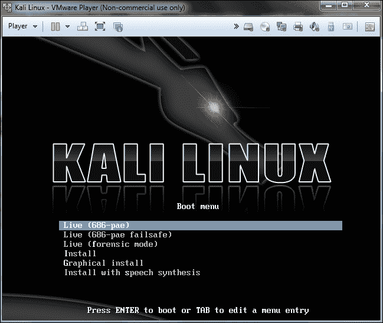
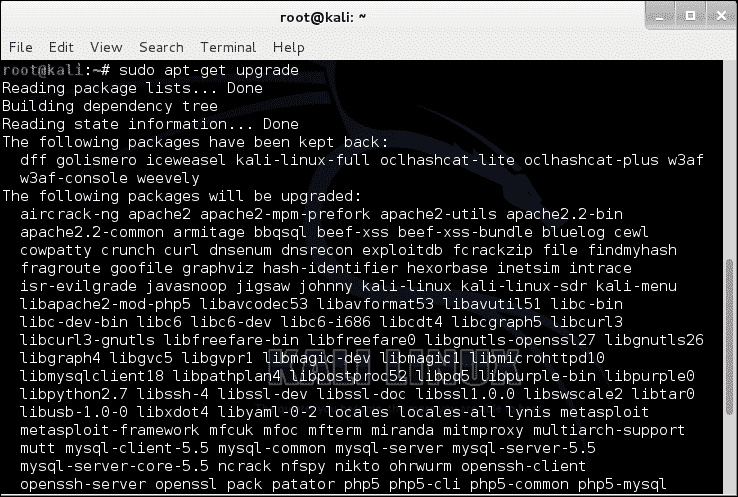
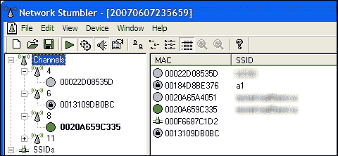
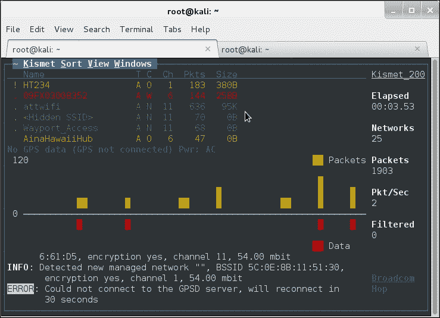
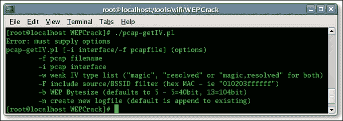
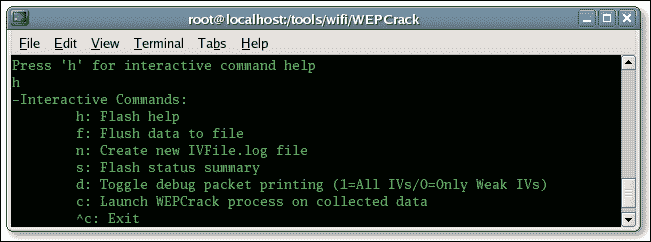
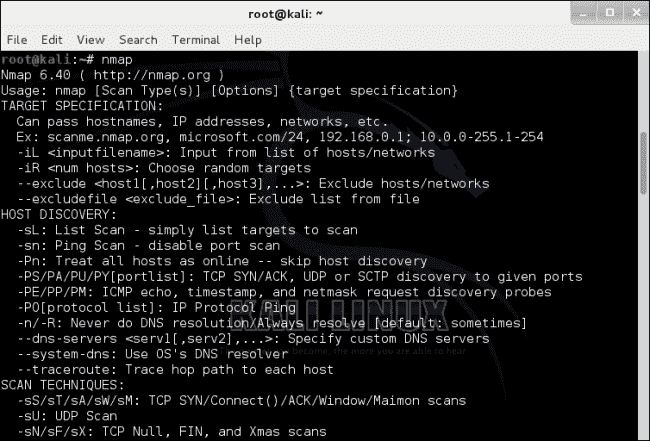

# 第一章：准备进行有效的无线渗透测试

作为一名安全专业人士，您知道在处理数据时存在风险。数据可以被任何人访问，尤其是那些不应该访问的人。虽然本书可能提供有用的信息来保护您，但我们无法保证您的安全。管理员需要了解潜在的安全威胁是，坏事可能随时发生。如果保护数据的成本对您或您的雇主来说太昂贵，那么可以假定您的所有数据都没有价值。

本章将重点介绍高级无线渗透测试的好处以及开始使用它所需的技能。然后，您将能够在脑海中已经有一些基本知识的情况下理解接下来的几章。如果您认为自己已经有足够的基本知识，可能可以跳过本章。但是，请记住，如果您选择跳过，可能会错过一些关键因素，例如了解 Kali Linux 和知道要使用哪些无线网卡。因此，阅读这些部分将是值得的。

无论大小，无线网络都有同样的目的：通过无线电频率访问网络，无论是笔记本电脑、平板电脑还是手机。无线网络使用户可以在没有电缆的情况下访问本地网络甚至互联网。听起来很棒，对吧？那问题在哪里呢？

在今天的社会中，我们看到更多的用户受到妥协，特别是在公共 Wi-Fi 位置。可能存在开放的无线网络、弱加密或信任问题。但在开始之前，您可能需要一些适当的设备来跟随演示。由于我们专注于高级无线渗透测试，我们肯定需要集中精力在安全部分。现在，您需要保持开放的思维，并开始像黑客一样思考。

在本章中，我们将涵盖以下主题：

+   什么是 Kali Linux？

+   安装和更新 Kali Linux

+   无线渗透工具

+   无线术语

# 好处

以下是无线渗透测试的好处：

+   **避免公司数据被妥协**: 安全漏洞是昂贵的，可能会因病毒、蠕虫、特洛伊木马和非法活动而使组织损失数百万美元。无线渗透测试可以帮助您避免这些陷阱，通过在安全破坏之前识别风险。

+   **评估漏洞**: 无线渗透测试可以提供有关可利用威胁的信息，使您能够进行审计。您可以识别组织中最关键的威胁，并在实际发生之前防止攻击。保持组织的系统和软件最新可以大大降低安全风险。

+   **制定规定和政策**: 无线渗透测试帮助组织通过制定规则或政策来应对安全威胁，以保护员工。确保销售部门只能访问销售信息至关重要。您绝对不希望您的用户窥视其他人的文件。

## 价值和忠诚

只需一个用户的系统被入侵并丢失宝贵的客户数据，这将极大地影响销售量并破坏组织的声誉。没有人愿意失去他们曾经合作并且难以获得和保留的忠实客户。无线渗透测试可以帮助避免这些问题。无线渗透测试的最大好处是安全意识。了解黑客如何侵入这些网络以及一旦他们获得访问权限后可以做什么是非常重要的。这就是为什么“像黑客一样思考”可以帮助防止未来的攻击。你需要了解你的目标是谁，以及他们可能在你的系统或网络上寻找什么。数据是否有价值？始终以“如果”形式问自己。例如，如果黑客能够访问你的在线购物账户，他们能购买什么？如果黑客获得了你工作场所的安全许可，他们能对你的组织造成潜在的损害吗？这只是一些例子，但我相信你明白我的意思。

## 专业知识和技能

记住，这本书旨在专注于高级无线渗透测试。它将强调理解各种攻击背后的原理。这本书不是充斥着快速的操作指南或公共工具的指南。相反，你将学到以下内容：

+   对无线安全的详细理解

+   如何审计网络以发现安全漏洞

+   如何提供不同类型的 Wi-Fi 攻击作为概念证明

+   创建安全无线网络时应遵循的最佳安全实践

你必须具备以下条件才能进行演示：

+   在虚拟机上安装的 Kali Linux

+   至少 512MB RAM 的计算机

+   计算机上的 USB 2.0 端口用于无线网卡

你还必须具备以下基本技能：

+   无线网络

+   计算机安全

+   Linux 操作系统

+   设置和配置无线网络

总之，你将学习许多不同的可利用技术和方法，以防止无线攻击首先发生。如果你以前使用过 Kali Linux 操作系统，现在就要登录。如果你没有之前列出的技能，可能会很难理解这本书。请花时间复习任何你不认识的术语，因为这将有助于你在本书的后几章中进行一些实际演示时。 

## 谁应该阅读这本书？

对这本书会感兴趣的人是谁？当然不是每个人，但我希望大多数网络管理员或信息安全专家会感兴趣！让我们思考一下。想象一下自己是 IT 管理员，正在进行日常任务和职责。然后，令你大吃一惊的是，你的无线基础设施崩溃了！现在这将取决于企业的生产环境，但假设你在零售分销商工作，他们在仓库中不断依赖无线通信来挑选和发货产品。他们在两个接入点上使用**有线等效隐私**（**WEP**）加密。你收到通知并尝试通过 HTTP 协议无线连接远程访问无线接入点。它不接受你的登录凭据。你开始想知道到底发生了什么，然后听到其他员工说他们无法登录他们的电子邮件账户或其他个人账户。你惊慌失措地冲到仓库关闭接入点。

在这个例子中，问题在于组织仍在使用 WEP 加密，这种加密不超过 6 分钟就可以破解并获得完全访问权限。黑客可以破解这种加密，像普通用户一样连接，然后通过扫描网络、进行中间人攻击或 DNS 欺骗网络。黑客可能有许多不同的用户登录，包括对服务器的系统管理员登录，并有可能获取组织的凭据信息。最后，黑客可以复制这些信息并在网上出售，甚至出售给其他商业公司。这就是为什么保持一切更新非常重要，包括你的无线加密算法。根据今天的标准，建议至少使用**Wi-Fi Protected Access**（**WPA**）加密。在某些情况下，这取决于组织中使用的设备和设备，因为并非所有设备都支持更新的加密，所以他们最终在整个组织中使用 WEP 加密。如果你使用 WEP，请确保在无线接入点内应用 MAC 过滤并记录所有活动。

总之，每个管理员都应该阅读这本书。这意味着即使你不是在寻找高级无线渗透测试技术和方法。这本书将在几乎每一章中提供防范安全渗透的方法。我认为防范非常重要，因为你不仅会知道如何保护自己，还会了解现实世界中存在的威胁。

# 什么是 Kali Linux？

我希望你现在知道什么是 Kali Linux，因为我们将在本书中使用它。Kali Linux 是一个建立在 Debian Linux 上的安全渗透测试发行版。它涵盖了许多不同类型的安全工具，每个工具都按类别组织。让我们开始下载和安装 Kali Linux 吧！


## 下载 Kali Linux

恭喜，你现在已经开始了本书中的第一个实践体验！我相信你会很兴奋，所以让我们开始吧！访问[`www.kali.org/downloads/`](http://www.kali.org/downloads/)。在**官方 Kali Linux 下载**部分查找：


在这个演示中，我将下载并安装**Kali Linux 1.0.6 32 位 ISO**。点击**Kali Linux 1.0.6 32 位 ISO**的超链接进行下载。

根据你的互联网连接速度，这可能需要一个小时来下载，所以请提前准备好，这样你就不必等待下载。那些互联网连接速度慢的人可能需要重新考虑从本地区域内更快的来源下载。在公共场所可能会有下载限制。请确保在下载 Kali Linux 之前获得许可。

## 在 VMware Player 中安装 Kali Linux

当你下载完 Kali Linux 后，你需要确保已经安装了 VMware Player。VMware Player 是你将要安装 Kali Linux 的地方。如果你不熟悉 VMware Player，它只是一种虚拟化软件，可以模拟操作系统而无需另一个物理系统。你可以创建多个操作系统并同时运行它们。执行以下步骤：

1.  让我们从桌面上打开 VMware Player 开始：

1.  VMware Player 应该打开并显示一个图形用户界面：

1.  点击右侧的**创建新的虚拟机**：

1.  选择**稍后安装操作系统**，然后点击**下一步**。

1.  选择**Linux**，然后从下拉菜单中选择**Debian 7**：

1.  点击**下一步**继续。

1.  为虚拟机名称输入`Kali Linux`。

1.  浏览之前下载的 Kali Linux ISO 文件，然后单击**下一步**。

1.  将磁盘大小从 25 GB 更改为 50 GB，然后单击**下一步**：

1.  单击**完成**：

1.  现在，Kali Linux 应该显示在您的 VMware Player 库中。 从这里，您可以单击**自定义硬件…**以增加 RAM 或硬盘空间，或根据系统硬件更改网络适配器。

1.  单击**播放虚拟机**：

1.  单击左上角的**播放器**，然后导航到**可移动设备** | **CD / DVD IDE** | **设置…**：

1.  选中**连接**旁边的框，选择**使用 ISO 映像文件**，浏览 Kali Linux ISO，然后单击**确定**。

1.  单击屏幕底部的**重新启动 VM**或单击**播放器**，然后导航到**电源** | **重新启动客户**； 出现以下屏幕：

1.  重新启动虚拟机后，您应该看到以下内容：

1.  选择**Live (686-pae)**然后按*Enter*。

它应该启动到 Kali Linux 并带您到桌面屏幕：


恭喜！ 您已成功安装了 Kali Linux。

## 更新 Kali Linux

在本书的任何演示中开始之前，我们必须更新 Kali Linux 以帮助保持软件包的最新状态。

1.  从桌面打开 VMware Player。

1.  选择**Kali Linux**并单击绿色箭头以启动它。

1.  一旦 Kali Linux 启动，打开一个新的终端窗口。

1.  输入`sudo apt-get update`并按*Enter*：

1.  然后输入`sudo apt-get upgrade`并按*Enter*：

1.  您将被提示指定是否要继续。输入`y`并按*Enter*：

1.  重复这些命令，直到没有更多更新为止：

```
sudo apt-get update
sudo apt-get upgrade
sudo apt-get dist-upgrade

```

恭喜！ 您已成功更新了 Kali Linux！

# 无线渗透工具

运行安全评估和分析并不总是需要大量资金。 许多高效和有效的安全工具是免费的，并且被许多安全专业人员，企业和政府机构广泛使用。 在线还有其他专为安全和无线设计的 Linux 和 Unix 发行版。 以下是这些发行版的列表：

+   Anonym.OS

+   审计员

+   Arudius

+   Backtrack

+   BackBox

+   BlackArch

+   CQure AP

+   Frenzy

+   Knoppix-STD

+   Linux LiveCD 路由器

+   Less Networks 热点服务器

+   Operator

+   Pentoo

+   Phlak

+   ProTech

+   Russix

+   Sisela

+   Talos Security LiveCD

+   WarLinux

+   WHAX

以下各节将解释各种有效和常用的安全工具。

## HashCalc

HashCalc 是一个快速简单的计算器，允许计算文件以及文本和十六进制字符串的消息摘要，校验和和 HMAC。 它支持 MD5，SHA-1，SHA-2 等算法。 不建议仅凭文件大小来信任文件，因此验证文件完整性的 MD5 哈希标签是一个好主意，并且在从互联网下载文件时避免文件损坏。 以下屏幕截图显示了 HashCalc 界面：


您还可以参考[`www.slavasoft.com/hashcalc/`](http://www.slavasoft.com/hashcalc/)获取有关 HashCalc 的更多信息。

## NetStumbler

NetStumbler 显示您区域内所有无线网络的列表，信号强度和无线安全性。 NetStumbler 因其功能和可靠性而受到许多用户的青睐。 它还支持 GPS。

### 提示

请注意，NetStumbler 在 Windows 7 或 64 位操作系统中的效果不佳。

以下截图显示了 NetStumbler 界面：



您还可以参考[`www.netstumbler.com`](http://www.netstumbler.com)了解更多关于 NetStumbler 的信息。

## inSSIDer

inSSIDer 是一款商业无线 Windows 应用程序，可以利用计算机的 Wi-Fi 天线扫描您所在区域的网络，跟踪信号强度并确定安全设置。

inSSIDer 非常适合快速分析区域内的无线接入点，并排除区域内其他无线设备的任何无线干扰。必备工具！

以下截图显示了 inSSIDer 界面：


您还可以参考[`www.inssider.com/`](http://www.inssider.com/)了解更多关于 inSSIDer 的信息。

## Kismet

Kismet 是一个 802.11 第二层无线探测器、嗅探器和入侵检测系统。它是迄今为止最受欢迎的安全工具之一，在无线渗透测试中被广泛使用。它可以与任何支持原始监控（RFMON）模式的无线网卡一起使用。它可以检测 802.11b、802.11a、802.11g 和 802.11n 的流量数据。它还具有 GPS 支持，并且可以同时监视多个无线适配器。

它还支持无人机。通过分发 Kismet 无人机，您可以轻松将 Kismet 变成一个完整的移动 IDS 系统！无人机通常支持所有捕获方法，然后将捕获的无线数据发送并转发到 Kismet 服务器进行分析。Kismet 预装在 Kali Linux 上。以下截图显示了 Kismet 界面：



有关更多信息，请参考[`www.kismetwireless.net/index.shtml`](http://www.kismetwireless.net/index.shtml)。

## WEPCrack

WEPCrack 是第一个破解 802.11 WEP 加密安全密钥的开源安全工具。最后更新于 2004 年 10 月，这可能会让您认为这现在已经过时且浪费时间。错了！这仍然具有教育意义。如果您想了解 FMS 攻击的工作原理，阅读 WEPCrack 脚本的代码是了解其工作原理的最佳方式。无论您使用什么芯片组，只要在运行工具之前将其置于 RFMON 模式即可。请参考[`wepcrack.sourceforge.net/`](http://wepcrack.sourceforge.net/)了解更多信息。以下截图显示了界面：



在上述截图中，用户现在可以开始从 128 位 WEP 捕获中收集弱 IV。

```
./pcap-getIV.pl –b 6 –i wlan0

```



## Aircrack-ng

Aircrack-ng 是用 C 编写的程序，提供了一个安全审计套件的接口。Aircrack-ng 内部的工具包括 airodump-ng、aircrack-ng、aireplay-ng、Nmap、dnsiff、arpspoof、urlsnarf 等。虽然 Aircrack-ng 可以用于恶意目的，但也可以用于恢复丢失的无线密码。Aircrack-ng 是安全专业人士的绝佳工具。更不用说它是免费使用并且可以重新分发的！Aircrack-ng 预装在 Kali Linux 上。


有关更多信息，请参考[`www.aircrack-ng.org/`](http://www.aircrack-ng.org/)。

## Metasploit

Metasploit 是用 Ruby 编写的程序，有助于降低数据泄露的风险。它可以通过与外部攻击者相同的方法发现网络和系统中的漏洞。Metasploit 可以检测来自各种系统和软件的数千个漏洞。Metasploit 预装在 Kali Linux 上。

那么 Metasploit 在无线渗透测试期间如何帮助呢？Metasploit 具有漏洞数据库。如果无线路由器存在绕过管理员登录的漏洞，Metasploit 很可能会在 Ruby 脚本中提供这个漏洞。这不仅适用于无线路由器，也适用于操作系统和硬件防火墙。您可以使用 Metasploit 中的`search`命令来匹配 CVE。以下截图显示了 Metasploit 界面：


更多信息请访问[`www.rapid7.com/products/metasploit/`](http://www.rapid7.com/products/metasploit/)。

## Nessus

Nessus 是一个漏洞扫描程序，提供补丁、配置和合规性审计；移动、恶意软件和僵尸网络发现；敏感数据识别；以及许多其他功能。它不断更新超过 60,000 个插件，并得到专家漏洞研究团队的支持。Nessus 绝对是你会使用的最好的漏洞扫描程序之一。

Nessus 可以确定无线路由器是否存在漏洞。它将指出开放端口和 CVE，并提供漏洞的文章和链接。如果攻击者想要获取无线 AP 或路由器的管理权限，这一点至关重要。Nessus 界面如下所示：


更多信息请访问[`www.tenable.com/products/nessus`](http://www.tenable.com/products/nessus)。

## Armitage

Armitage 是一个用于 Metasploit 的团队协作工具，可以可视化目标、推荐利用漏洞，并暴露框架中的高级后渗透功能。它允许您使用相同的会话、共享主机、捕获数据和下载文件，以及通过共享事件日志进行通信并运行机器人来自动执行任务。Armitage 已预装在 Kali Linux 上。

如果无线 AP 恰好在 VLAN 上，您可以使用 Armitage 来在子网和网络之间进行枢纽和路由。这是一个与 Metasploit 一起工作的很棒的安全工具。记住要打破常规思维；读者想要了解的不仅仅是破解和获取对无线网络的访问权限。他们在获得对网络的访问权限之后可以做些什么？

Armitage 界面如下所示：


有关更多信息，请参阅[`www.fastandeasyhacking.com/`](http://www.fastandeasyhacking.com/)。

## Nmap

Nmap 是一个用于网络发现和安全审计的免费开源实用程序。许多系统和网络管理员发现它在网络清单、管理服务升级计划和监控主机或服务的正常运行时间等任务中非常有用。Nmap 可以用于检测 Linux 的操作系统版本和二进制软件包。它还可以检测网络上的开放和关闭的端口。Nmap 已预装在 Kali Linux 上。

Nmap 可以用来绘制网络和子网。它还可以确定操作系统和软件版本。这可以帮助确定网络中是否存在弱点或潜在的安全漏洞。以下截图显示了 Nmap 在 Kali Linux 中的使用：



有关更多信息，请参阅[`nmap.org/`](http://nmap.org/)。

## Wireshark

Wireshark 是一个免费开源的数据包分析器。它可以用于网络故障排除、分析、软件和通信协议。Wireshark 也是一个很好的教育工具，可以展示使用 SSL 或其他加密方法保护敏感信息（如用户名和密码）免受外部攻击者拦截的重要性。Wireshark 已预装在 Kali Linux 上。

那么 Wireshark 对你有什么帮助呢？Wireshark 可以检测未经授权的无线接入点，嗅探无线数据包，并跟踪 TCP 流以获取电子邮件、密码和其他敏感信息。Wireshark 界面如下所示：


有关 Wireshark 的更多信息，请访问[`www.wireshark.org/`](http://www.wireshark.org/)。

## Scapy

Scapy 是一个强大的数据包操作程序。它具有伪造或解码多种协议的数据包的能力。它发送数据包，捕获数据包，匹配请求，并回复。它可以轻松处理简单的任务，如扫描、跟踪路由、探测、攻击或网络发现。它可以轻松取代 hping、85%的 Nmap、arpspoof、tcpdump、tethereal、p0f 等工具。它可以很好地执行许多其他工具无法处理的任务，比如发送无效帧，注入自己的 802.11 帧，结合 VLAN 跳跃、ARP 缓存中毒、WEP 上的 VOIP 解码等。以下截图显示了 Scapy 与 Kali Linux 一起使用：


有关更多信息，请访问[`www.secdev.org/projects/scapy/`](http://www.secdev.org/projects/scapy/)。

# 无线术语

在本节中，我们将讨论我认为在使用 Kali Linux 进行任何无线渗透测试时最好的硬件，包括接入点和无线网卡。有时候很难找到确切型号的某些品牌，因为设备内部可能有不同的芯片组。在开始之前，我想谈谈接入点和无线网卡的最重要的关键因素。

## 为什么我不能使用我的笔记本电脑内置的 Wi-Fi 芯片组？

要有效地破解 Wi-Fi 密码，您需要一个合适的无线适配器。检查 Aircrack-ng 的兼容性列表，确保您的无线适配器具有破解无线网络所需的功能。您需要能够进入监视模式（混杂模式）并同时注入和捕获数据包。一个无线适配器如果不能同时做到这两点，并不意味着您不能破解无线网络；无线适配器本身可能太慢而无法渲染。有关兼容驱动程序的列表，请访问[`www.aircrack-ng.org/doku.php?id=compatibility_drivers`](http://www.aircrack-ng.org/doku.php?id=compatibility_drivers)。

## 我如何确定我的 Wi-Fi 芯片组是否可用？

确定您的无线适配器是否可用，您可以使用 Aircrack-ng 运行注入测试。运行以下命令：

```
aireplay-ng -9 wlan0

```

## 无线硬件

了解实际产品本身非常重要，因为并非所有产品都能与 Kali Linux 兼容。产品应该标明“与 Kali Linux 兼容”，或者以前买家的评论应该提供关于它在 Kali Linux 上的使用情况的信息。一些产品在 Kali Linux 上表现不佳的原因是因为它不支持驱动程序。市场上有一些特定型号只能与 Kali Linux 一起使用。这是因为 Kali Linux 只支持这些特定的型号或版本。我们现在将讨论我认为在 Kali Linux 上表现最佳的几种型号。

### 无线模型

当我提到接入点或无线网卡的硬件时，我指的是芯片组。芯片组是无线设备中最重要的部分，对于购买适配 Kali Linux 的设备来说非常重要。了解它支持什么也是一个好主意。硬件是否能在 Windows 和 Mac OS X 上正常工作？硬件是否支持最新的无线 N？这只是一些需要记住的问题。

### 三种无线模型

哦是的，我们还记得 Windows XP 上的驱动程序，不是吗？了解您的无线网卡或接入点是否适用于所有平台还是只适用于一个操作系统非常重要。如果您使用 Windows 和 Linux 操作系统，您会希望确保它支持。即使无线网卡支持 Linux，它可能也不能在 Kali Linux 上工作，因为我们回到了需要支持的芯片组。

### Alfa AWUS036NHR

Alfa AWUS036NHR，如下图所示，是你将使用的最强大的无线适配器，目前仍然是你可以购买的最好的无线适配器。它具有出色的信号强度，并且在 Kali Linux 上即插即用。这个无线适配器唯一的缺点是，有报道称它不稳定，因为它可能会被 Kali Linux 识别不出来，导致许多试错重启，直到它正确工作。总的来说，这是你在范围、速度和便携性方面找到的最好的无线适配器。


### Alfa AWUS036H

如果你看一下 Kali Linux 的网站，你会注意到 Alfa AWUS036H（如下图所示）是最受推荐的无线适配器。这是因为它的可靠性和稳定性，可以直接在 Kali Linux 上使用，即插即用，无需额外配置。


然而，它不支持无线 N，所以你需要购买一个高增益天线来接收附近的接入点。另一件你需要知道的事情是，有很多假冒和网络诈骗，特别是在 eBay 上。所以在网上购物这个适配器时一定要非常小心！

### TL-WN722N

TL-WN722N，如下图所示，是 Alfa 的更便宜的替代品。它有点过时，因为它是在 2009 年发布的，但它仍然具有无线 N 功能。你可以通过 TP-LINK 的网站以及其他在线商店购买这个设备。如果你不想花很多钱，你可能会考虑这个无线适配器。


总的来说，Alfa AWUS036NHR 的信号强度是三者中最好的，但不受 Kali Linux 支持。然而，有一些方法可以让它在 Kali Linux 上工作。我个人只有 Alfa AWUS036H，因为它非常可靠，而且在无线渗透测试和 Kali Linux 方面非常可靠。但如果你想省点钱，TP-LINK TL-WN722N 是一个很好的选择。

# 总结

哇！我知道这似乎是一个永远不会结束的章节，但它确实结束了，你成功度过了！恭喜你完成了第一章！这只是为了帮助你在我们深入进行高级技术演示和实际示例之前做好准备的介绍。现在你应该准备好继续阅读第二章，“无线安全测试”。

我们首先介绍了高级无线渗透测试的真实世界以及它对当今社会的影响。我们还讨论了通过进行高级无线渗透测试所获得的许多不同的好处。

然后，我们讨论了理解本书可能需要的专业知识和技能。我不希望我的读者在后面的章节中感到不适或迷失方向。我的目标是帮助你，作为读者，理解为什么学习无线安全如此重要。我为你提供了可能对本书感兴趣的目标读者以及他们为什么是目标读者。

此外，我们通过 Kali Linux 进行了第一次实际操作，安装和更新了 VMware Player。你了解了许多不同的设备、适配器和卡片用于 Kali Linux。记住，你必须有一个支持的芯片组和型号才能正确地使用它，并且它不支持所有无线芯片组。

最后，本章涵盖了开始进行高级无线渗透测试所需了解的一切。我之前提到过，你可能需要在一些你可能没有的领域具有特定的专业知识和技能，所以请注意这一点。我们现在将继续进行无线安全测试，我们将讨论几种攻击技术和方法的示例，以及预防措施来帮助保护自己。
