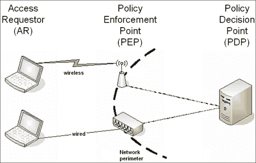
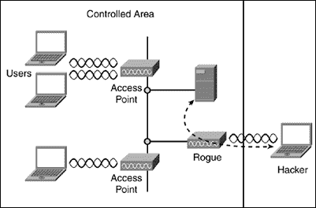
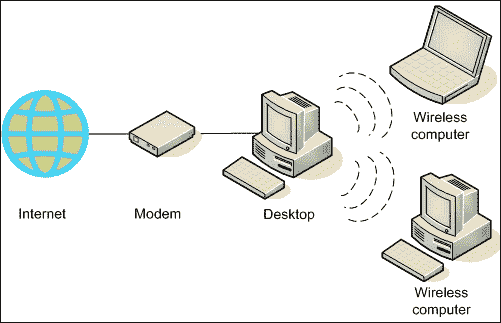
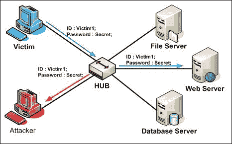
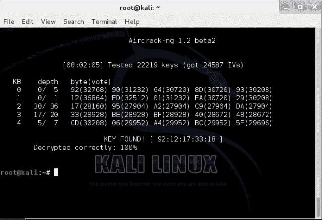
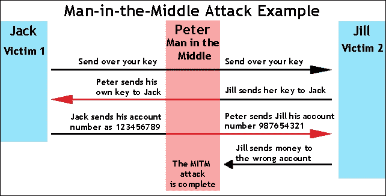
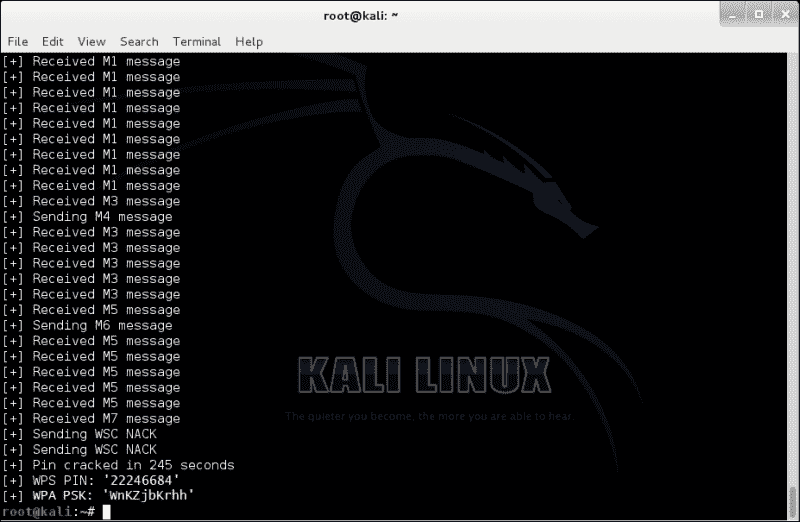
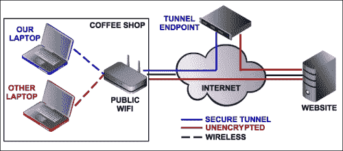
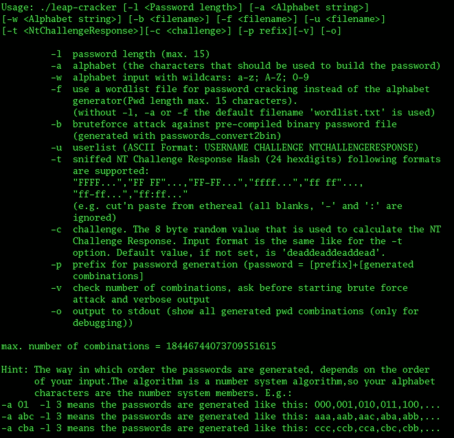
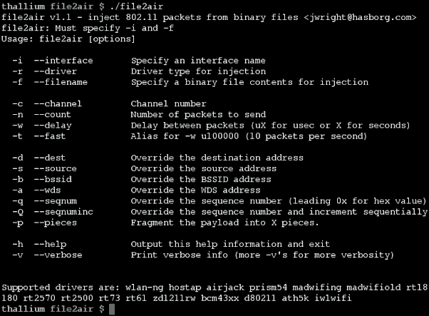

# 第二章：无线安全测试

欢迎来到本章！我们假设您要么非常喜欢第一章，所以决定继续，要么因为您已经对自己所知道的内容感到满意，所以跳过了第一章。无论哪种情况，这是您的第一个问题。普通用户会购买无线路由器，但不配置任何无线安全。你认为这是为什么？

当然，你早就知道，这是因为普通用户可能不了解设备的安全功能或预防措施，或者他们可能懂得使用计算机，但不知道如何实施无线安全。这就是**Wi-Fi Protected Setup**（**WPS**）发挥作用的地方。

WPS 允许在无线家庭网络上进行简单配置。用户只需按一下无线路由器上的按钮，然后无线路由器会自动为用户配置一个安全网络。听起来很棒，对吧？错！大多数常见的无线路由器都容易受到暴力攻击。WPS PIN 通常只包含数字。这个安全漏洞使得攻击者可以在几个小时内使用暴力技术恢复或破解 WPS PIN。

不仅仅是用户，甚至公司和 ISP 也在这样做。他们只需插入无线路由器，按下 WPS 按钮，然后为您写下密钥。这对于企业网络来说是极其糟糕的安全措施！请花时间更改用户名，更改默认密码，关闭远程管理，并打开防火墙。

本章将涵盖以下主题：

+   无线渗透测试方法论

+   无线攻击技术和方法

+   预防

# 无线渗透测试方法论

无线渗透测试建立在经过验证的行业标准之上。总共有六个步骤：

+   侦察

+   攻击和渗透

+   客户端攻击

+   进入网络

+   漏洞评估

+   利用和数据捕获

在我们逐步介绍方法论的每个步骤之前，您将了解为什么遵循这些步骤很重要。

## 我为什么要遵循这个方法论？

这六个步骤是渗透测试专家们公认的并且强烈推荐的。这些步骤被用于测试方法学，如 PTES、NIST 800-115 和 OSSTMM。您可以在虚拟化环境中执行这些操作，以帮助测试漏洞上的利用，然后再在生产网络上采取行动。它还有助于通过渗透测试确定问题的根本原因。

无线接入点提供了无线通信的简便性。这也为黑客提供了攻击和获取内部网络访问权限的便利。从内部，他们可以造成严重损害并危害敏感的企业和客户信息。无论他们停在建筑物前面、在建筑物周围驶过，黑客都可以找到进入您网络的方法。遵循无线渗透测试方法论将有助于确定漏洞并提供加固和补救的解决方案。

## 无线攻击和渗透步骤

以下是无线渗透测试期间要采取的步骤：

侦察：

+   扫描无线接入点

+   找到我们的目标接入点

+   识别 SSID 和 MAC 地址

+   广播名称

+   AP 的 Wi-Fi Mac 地址

+   收集加密和密码的信息

+   WEP，WPA，WPA2

+   PSK，AES，TPK

+   嗅探无线网络

+   通过 Wi-Fi 收集网络流量

+   保持不被发现

+   欺骗 IP 或枢纽连接

+   保持低调，不引起任何警觉

攻击和渗透：

+   绕过或攻击安全控制

+   横幅抓取

+   猜测和破解密码

+   SQL 注入

+   通过 HTTP、HTTPS、SSH 和 Telnet 协议获取访问权限

+   欺骗 Mac 地址

+   使用 macchanger 等工具

+   破解无线加密算法

+   Aircrack-ng，Reaver

客户端攻击：

+   本地和远程攻击

+   常用密码

+   在 Linux 上无需登录访问文件

+   操纵操作系统创建后门

+   捕获和破解凭据

+   Wireshark

+   Ettercap NG

扫描网络：

+   识别主机

+   Nmap 扫描器

+   确定网络规模

+   Zenmap 扫描器

漏洞评估：

+   运行自动化或手动漏洞扫描

+   Nessus 漏洞扫描器

+   生成漏洞报告

+   通过 Nessus 漏洞扫描器导出报告

利用和数据捕获：

+   渗透

+   利用无线路由器和访问点未经授权地访问网络资源

+   妥协

+   获得对工作站和服务器的完全管理员权限

+   数据分析

+   报告

总之，无线渗透测试方法论简单地帮助您从侦察到报告的步骤。它还让您了解成为无线渗透测试人员需要做些什么。应该每年进行无线渗透测试，以跟上无线网络面临的不断变化的威胁。在为客户进行无线安全审计时，应参考此方法论。

# 无线攻击技术和方法

以下部分展示了不同类型的无线攻击技术和方法。

## 访问控制攻击

访问控制攻击试图使用无线或规避 WLAN 访问控制措施，如 AP MAC 过滤器和 802.11 端口访问控制：

以下部分展示了一些访问控制攻击。

### War driving

War driving 指的是通过监听信标或发送探测请求来发现无线局域网，为进一步的攻击提供一个发射点。工具如 Airmon-ng、DStumbler、KisMAC 和 NetStumbler 可以执行此攻击。War driving 通常由两个人完成，一个人驾驶汽车，另一个人扫描和发现该地区的无线网络。通过正确的软件和应用程序，他们可以设置 GPS 设置来定位这些 Wi-Fi 位置，并保存它们以供以后的无线攻击使用。

照片来源：elhombredenegro 通过 photopin cc

### Rogue access points

在企业网络上留下一个不安全的 AP 可能会为受信任的网络创建一个开放的后门，用户可以远程登录到服务器或访问网络设备，如防火墙、交换机和路由器。任何无线路由器或软件 AP 都可以执行此攻击，如下图所示。请避免连接到不安全的无线访问点。在连接到开放或公共 Wi-Fi 网络时，请始终使用 VPN 服务保护自己。

### 临时关联

临时关联是直接连接到不安全的无线 AP，以规避 AP 安全性或攻击另一个无线 AP。这是一种非常常见的攻击，如下图所示。我曾经见过无线网络，其中 SSID 已经更改为类似“Hacked”的内容。攻击者通过无线连接并更改无线访问点的安全设置或更改密码以锁定所有者。

### MAC 地址欺骗

MAC 地址欺骗是指攻击者重新配置自己的 MAC 地址，以冒充授权的 AP 或客户端。这使得攻击者可以通过无线访问点获得完全的网络访问权限，就像他们是受信任的 AP 或客户端一样。这种攻击通常用于付费热点位置，如酒店、机场、咖啡店和其他付费互联网位置。MAC 地址欺骗攻击如下图所示：

### 802.11 RADIUS 破解

我们很少听到这种攻击，但这是一个重要的话题。这种攻击是指攻击者通过对 802.11 访问请求进行暴力破解来恢复**远程身份验证拨号用户服务**（**RADIUS**）的密钥，以进行恶意使用。在 AP 和 RADIUS 服务器之间的局域网网络上，任何数据包捕获工具都可以使用。这是非常危险的，因为很多 AP、服务器甚至软件服务都会要求 RADIUS 登录。如果 RADIUS 被攻破，攻击者可以访问任何使用 RADIUS 进行授权访问的内容。这种攻击在下图中有所说明：

## 机密攻击

这些攻击试图拦截通过无线网络发送的私人信息，无论是以明文发送还是由 802.11 或更高层协议加密发送。

照片来源：ivoryelephantphotography via photopin cc

接下来的部分描述了一些机密攻击。

### 窃听

当然我们知道窃听是什么意思，但你知道在安全领域中是什么意思吗？在计算机安全方面，窃听是指捕获数据，解码，然后获取潜在的敏感信息。这就像窃听电话一样。你听、记录，然后可能从对话中获取敏感信息。工具如 Ettercap、Kismet 和 Wireshark 都可以做到这一点。这种攻击在下图中有所说明：

### WEP 密钥破解

啊，是时候谈谈 WEP 破解了！这正如它听起来的那样——使用被动或主动方法捕获数据以恢复 WEP 密钥。随着今天硬件和软件的不断改进，WEP 加密可以在不到 5 分钟的时间内轻松破解！只有在仍在使用旧硬件的情况下才应该使用 WEP 加密；否则，你应该使用 WPA2 加密。工具如 Aircrack-ng、AirSnort、Airoway、chopchop 和 dwepcrack 都可以执行这些攻击。下面的截图显示了 WEP 密钥破解的一个例子：

### 恶意双子 AP

听说过恶意双子 AP 吗？恶意双子 AP 就像一个伪装的接入点。攻击者创建一个假的无线 AP，诱使用户认为它是一个可信赖的无线网络。他们通过放大信号的方式，使客户端自动连接到他们，因为信标更快，范围更近。工具如 Honeypot、CqureAP、D-Link G200、HermesAP、Rogue Squadron 和 WifiBSD 都可以执行这些攻击。下图显示了一个流行的工具：

### AP 钓鱼

攻击者在假 AP 上运行一个虚假的 Web 门户或 Web 服务器，以窃取登录信息、银行账户和信用卡号。这绝对是最危险和最可怕的攻击之一，因为普通用户甚至看不到正在发生的攻击。他们会认为这是真正的网站，而实际上攻击者只是在等待他们登录，以在另一端获取他们的信息。工具如 Airpwn、Airsnarf、Hotspotter、Karma 和 RGlueAP 都可以执行这些攻击。

照片来源：infocux Technologies via photopin cc

### 中间人攻击

我当然希望你以前听说过这种攻击方法；如果没有，现在你就知道了！中间人攻击是指攻击者在你和另一个目标之间拦截网络流量。攻击者可以利用这种攻击手段在有线或无线网络上获取用户名、密码、查看电子邮件、查看网站的 HTTP 会话等等。工具如 dsniff、Ettercap-NG 和 sshmitm 都可以执行这些攻击。这种攻击在下图中有所说明：

## 凭证攻击

是否听说过或经历过用户的在线帐户被入侵的情况？很可能，这个用户是凭证攻击的受害者，这与攻击者窃取其登录凭证有关。这可以通过 Web 服务器或软件，如**社会工程工具包**（**SET**）来实现。攻击者可以克隆一个网站，使网站看起来足够真实和合法，以欺骗用户登录。他们不知道的是，现在有人完全访问他们的数据。在接下来的部分中，我们将讨论凭证收割机和网络钓鱼攻击方法。

### 凭证收割机

这种攻击在攻击者的系统上启动一个 Apache 服务器，以克隆一个网站，使其看起来像合法网站。攻击者可以加入无线访问点，并对假网站进行 DNS 欺骗 HTTP 请求。该网站将看起来与真实网站相同，用户尝试正常登录。在攻击者的端口，攻击者将能够看到用户的用户名和密码，以及该用户的 IP 地址。从这里，攻击者可以继续收集帐户登录信息，然后将其存储在生成的报告中。对组织员工进行社会工程攻击以测试他们是否遵循程序和安全政策至关重要。这在以下屏幕截图中显示：

### 网络钓鱼

那么什么是网络钓鱼，我们如何识别网络钓鱼攻击、诈骗或骗局？网络钓鱼是一种欺诈性的尝试，旨在收集用户名、密码、社会安全号码、电话号码和信用卡等敏感信息。这些攻击通常通过电子邮件直接发送给用户，告诉用户访问有关其信息更新、密码更改或验证信息的网站。保护自己免受网络钓鱼计划的最佳方法是了解它们的工作原理。要求您输入密码或更改密码的电子邮件来自未知发件人，很可能是伪造的电子邮件。这些电子邮件将需要被阻止或标记为网络钓鱼或垃圾邮件。如果您认为自己是网络钓鱼的受害者，立即更改您的密码和安全问题，以防止在线帐户中的任何损害或丢失信息。

## 身份验证攻击

攻击者使用身份验证攻击来窃取合法用户身份和凭证，以访问私人网络和服务。

照片来源：FutUndBeidl 通过 photopin cc

以下部分解释了一些身份验证攻击。

### 共享密钥猜测

攻击者尝试通过使用供应商默认凭证或共享密钥生成器来猜测 802.11 共享密钥身份验证。所有共享密钥都不应保留为默认值，并且在设置和配置设备时应立即更改。任何破解工具，如 Aircrack-ng，都可以执行此攻击。

照片来源：marc falardeau 通过 photopin cc

### PSK 破解

PSK 破解攻击使用字典攻击工具从捕获的握手帧中恢复 WPA/WPA2 PSK。这种攻击实际上取决于 WPA/WPA2 密钥的加密强度。如果密钥非常强大，可能需要数周才能破解，这对于黑客来说可能不值得花费时间。在创建自己的密码时，始终要使用字母、数字和符号的组合。您的字符计数越长，您成为目标的可能性就越小。诸如 coWPAtty、genpmk、KisMAC 和 wpa_crack 之类的工具可以执行这些攻击。以下屏幕截图显示了 PSK 破解攻击：

### 嗅探应用凭证

在嗅探应用凭据时，攻击者从明文应用协议中捕获用户凭据，例如电子邮件地址和密码。现在更多的网站正在使用 HTTPS，这在流行的网站上不太可能发生；然而，当登录到无线路由器或接入点时，通常使用未加密的明文 HTTP。如果您通过 HTTP 协议登录，攻击者可以轻松看到您的用户名和密码。Ace Password Sniffer，dsniff，PHoss 和 Win Sniffer 等工具可以执行这些攻击。

照片来源：formalfallacy @ Dublin (Victor)通过 photopin cc

### 破解域帐户

在破解域帐户攻击时，攻击者通过使用暴力或字典攻击工具破解 NetBIOS 密码哈希来恢复用户的凭据，例如他们的 Windows 登录和密码。还有一些可用的工具将需要从 Internet Explorer，Firefox 和 Google Chrome 中保存的密码。一旦攻击者获得您的凭据，他们可能会访问网络共享，交换电子邮件，甚至可能 compromise 整个域，如果该帐户恰好具有管理权限。John the Ripper，L0phtCrack 和 Cain 等工具可以执行这些攻击。

照片来源：ntr23 通过 photopin cc

### VPN 登录破解

攻击者通过对 VPN 认证协议进行暴力攻击来恢复用户凭据，例如 PPTP 或 IPsec 密码。确保密码和预共享密钥彼此不同并且非常强大。易于猜测的密码或数字可以轻松地危害整个业务，这可能导致客户信息泄露。-scan，IKECrack，anger 和 THC-pptp-bruter 等工具可以执行这些攻击。以下图表说明了 VPN 登录破解攻击：

### 802.11 身份盗窃

在 802.11 身份盗窃攻击中，攻击者从无线 802.11 的明文中捕获用户配置文件。加密是确保没有数据泄露的关键。在连接到 Wi-Fi 网络时，使用 HTTPS 和 VPN 协议可以帮助保护您免受此类攻击。Wireshark 或 Ettercap-NG 等捕获工具可以做到这一点。

照片来源：B Rosen 通过 photopin cc

### 802.11 密码猜测

在 802.11 密码猜测攻击中，攻击者使用捕获的身份不断尝试猜测用户在 802.11 认证上的密码。攻击者很可能会继续猜测默认密码，供应商名称，最常见的密码，生日，姓名，电话号码等，直到他们完全访问该无线网络。如果攻击者有一个非常好的密码字典，他们可以轻松地运行字典攻击并在几个小时内获得访问权限。John the Ripper 和 THC Hydra 等工具可以执行这些攻击。

照片来源：Dev.Arka 通过 photopin cc

### 802.11 LEAP 破解

在 802.11 LEAP 破解攻击中，攻击者通过使用字典攻击工具来破解 NT 密码哈希从捕获的 802.11 LEAP 数据包中恢复用户凭据。这取决于密码的强度，如果非常好，那么不太可能被破解，这就是为什么有一个混合字母，数字和符号以防止这些字典攻击是非常重要的。Anwrap，Asleap 和 THC-LEAPcracker 等工具可以执行这些攻击。以下是一个示例截图：

### 802.11 EAP 降级攻击

802.11 要求 EAP 在连接用户和认证之间发送消息。如果攻击者能够将自己置于客户端和认证之间，那么连接的用户就会连接到网络。攻击者通过使用伪造的 EAP-Response/NAK 数据包，迫使无线 802.11 设备或服务器提供较弱类型的认证。由于认证非常薄弱，攻击者只需几分钟就能迅速获得访问权限。诸如 File2air 和 libradiate 之类的工具可以执行这些攻击。以下截图显示了一个示例：

### 无线网络问题

随着今天的技术飞速发展，我们所知道的互联网每天都面临着许多新威胁。犯罪分子利用新的恶意软件和社会工程攻击来针对弱势用户和组织。最终用户通过 Wi-Fi 连接并使用网络浏览器上网。在接下来的部分中，我们将讨论当今网络上犯罪分子使用的最常见攻击方法。

照片来源：woodleywonderworks 通过 photopin cc

以下部分描述了针对用户级别的最常见攻击之一。

#### 下载

下载是使用互联网的最大特点之一。用户可以快速下载音乐、视频、电子书等。如果用户从未知来源下载，他们不仅可能对自己的计算机构成严重威胁，还可能对整个网络构成威胁。下载是危险的，因为大多数下载不需要用户的许可。

这就是恶意软件介入的地方。如果用户打开他们的电子邮件并点击超链接，通常会将他们重定向到他们的网络浏览器进行查看；然而，如果超链接重定向到恶意软件，它将立即下载并在计算机上执行。在下载时，最好考虑你的来源。这是一个合法的网站吗？你能信任它吗？如果不能，你不应该访问该网站，更不用从中下载文件。

# 预防

保护自己免受许多威胁的最佳方法是强大的端点保护，如频繁更新和升级、系统配置、定期监测漏洞以及连接到强大的 VPN 服务。如果你在组织中拥有 IT 的全部责任，你的员工应该接受良好的教育，了解犯罪分子背后的危险，并知道在使用计算机和电话系统时采取良好的安全措施。

照片来源：woodleywonderworks 通过 photopin cc

一些员工可能违反公司政策，访问他们的社交网络或在线游戏。这些员工需要随时受到监控。只需一次点击，你就可能陷入灾难性的境地。随着犯罪分子不断更新其恶意软件并发现零日漏洞，定期进行网络审计并通过电子邮件或 RSS 订阅保持信息更新总是一个好主意。

连接到公共无线热点时，一定要使用 VPN 服务进行连接。我无法再次强调这一点有多重要。如果不使用 VPN，你的所有互联网流量都将在整个网络中未加密传输。如果攻击者恰好也在同一网络上，你的登录凭据、信用卡和银行信息都可能落入黑客手中。这些黑客很可能会自己使用或在黑市上出售。

我的策略是始终问自己一个问题，随之而来的是更多问题。例如，有人告诉您他们在互联网上免费获得了软件，并希望与您分享。他们向您解释说，您需要关闭防病毒软件，因为需要在上面运行一个破解。您会安装这个软件吗？我绝对希望不会。信任是一个巨大的问题，也可能是 IT 世界和现实生活中最难做到的事情之一。

# 总结

在本章中，我们介绍了进行无线渗透测试时要采取的步骤，以及无线渗透测试中涉及的常见攻击技术。无线技术正在全球范围内得到应用，并扩展了通信的能力。

无线渗透方法包括：侦察、攻击和渗透、客户端攻击、进入网络、漏洞评估、利用和数据捕获，以进行成功的无线渗透测试。安全中使用的关键元素是防火墙。适当的配置是提供安全级别服务的关键。

如果您的网络设备配置不正确，那么您可能比没有它更好。认为自己很安全，而实际上一点也不安全，这是一个危险的情况。随着网络变得更加复杂，您会希望确保使用 VPN 和隧道协议来确保安全的远程访问。

我们还讨论了可以在无线网络上使用的几种不同的攻击方法。无线攻击技术包括但不限于访问控制攻击、机密攻击、凭证攻击、认证攻击以及无线网络的问题。我们充分意识到了用户可能面临的潜在威胁。关键点在于了解连接到无线接入点和互联网时我们面临的威胁。
