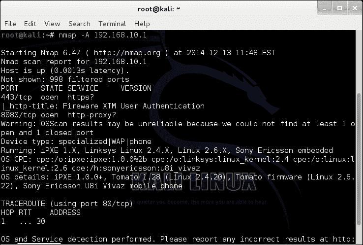
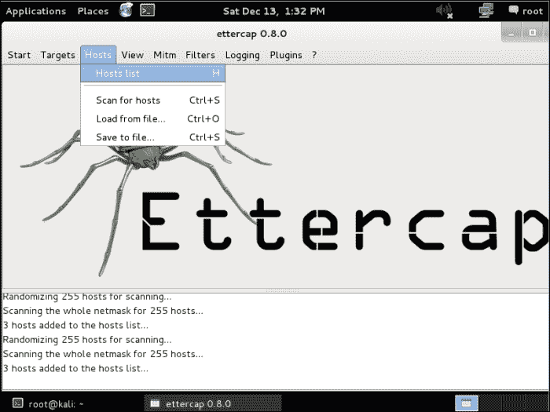
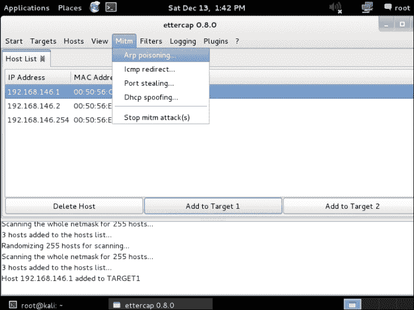
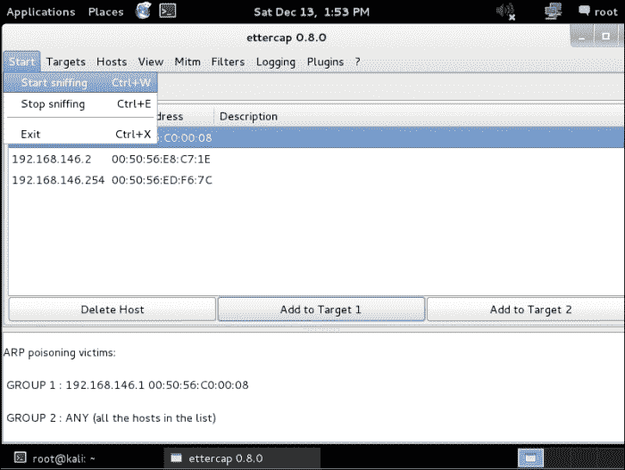
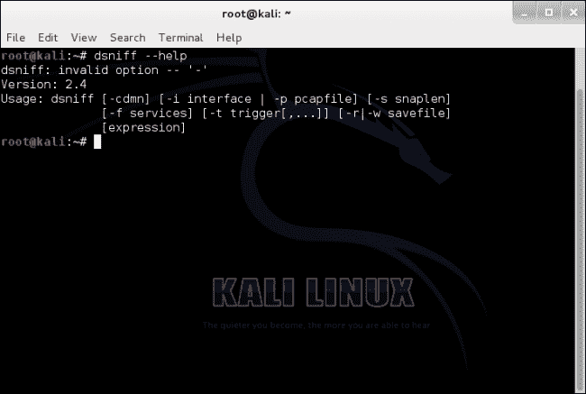
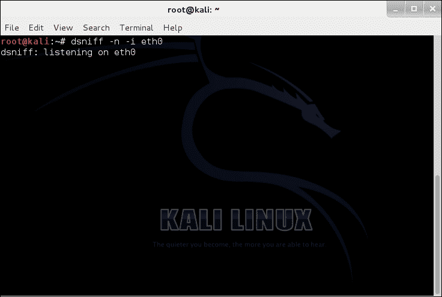

# 第三章：足迹和侦察

我们希望您喜欢阅读上一章，并发现它非常信息丰富，因为它涵盖了许多有用的信息。作为作者，我的目标是尽可能详细地涵盖尽可能多的信息，以便您作为读者能够理解并在现实世界中使用它！在本章中，我将介绍如何扫描无线网络以获取信息，不同的无线扫描方法，以及它们如何既可以用于好用也可以用于坏。

您可能会问或认为扫描无线网络有多难？任何人都可以做到！是的，但是，如果 SSID 是隐藏的呢？您能找到隐藏的无线网络吗？普通用户很可能不知道隐藏的无线网络甚至存在。

您可能还会问，隐藏的无线网络有什么重要性？您可能认为这是一项很好的安全措施，可以隐藏在他人之外。是的，确实如此！不幸的是，隐藏的无线网络可以被用于恶意和其他非法目的。

例如，假设您是一家企业的安全顾问。一位同事告诉您，一些文件在营业时间结束后由一个既没有办公时间后的物理访问权限也没有远程访问权限的用户更改或丢失了。您验证了修改文件的时间戳以及凌晨 2 点后删除的文件，还发现了登录并进行更改的用户的姓名。现在，这个用户告诉您他们什么都没做。那天下午晚些时候，您的同事告诉您，他们看到该用户在他们的小隔间里设置了一个无线接入点或路由器。您问您的老板是否可以搜索用户的工作区域以解决安全问题。在搜索该区域后，您发现了一个连接在桌子下的无线接入点。这绝对不好！现在，任何人都可以在无线范围内的任何地方访问公司的网络，并访问网络共享和服务器。

# 什么是足迹和侦察？

足迹和侦察是指收集有关客户网络的信息，以根据收集的信息创建基于概要的概要。攻击者必须以安全和专业的方式从组织中获取信息，而不暴露信息。

足迹通常涉及两个侦察步骤。第一步是从目标处收集信息，以确定网络范围的范围。用于此目的的最常用工具是：

+   nslookup

+   whois

在您的足迹和侦察期间，您应该收集以下信息：

+   联系人姓名，电话号码和电子邮件地址

+   每个位置和分支办公室

+   公司安全政策

为了获得更好的结果，尝试发送电子邮件或致电其中一名员工，并进行社会工程技术，以查看他们愿意提供多少信息。然后，审查安全意识培训可能需要改进的领域。

# 无线网络发现

在下一节中，我们将介绍网络和安全管理员推荐的最佳网络应用程序。这些类型的应用程序可以轻松检测到恶意硬件、软件许可证违规，甚至可以检测到故障或性能问题。我选择的应用程序考虑了多样性和可靠性。


照片来源：pobre.ch 通过 photopin cc

尽管我们只将涵盖两种网络发现工具，但我们将分享一些我们认为可以帮助您和您的公司的更多应用程序。

## Nmap

**网络映射器**（**Nmap**）是最受欢迎的端口扫描器和网络发现工具之一。它适用于所有主要操作系统平台。以下是一个示例截图：


有关 Nmap 的更多信息，请参考[`nmap.org/`](http://nmap.org/)。

## Nmap 命令

Nmap 有很多命令选项，我很确定我们并不总是能够记住这些命令。最终，关键在于了解你的命令以及在特定情况下使用什么命令。作为一名渗透测试者，需要高效地掌握这些工具中的大部分。其中一些解释如下：

+   **操作系统和版本检测**：这些命令将显示操作系统和软件版本的结果，如下截图所示：

以下是一些命令：

+   `nmap -A 192.168.10.1`：这个命令将显示操作系统、服务版本和路由跟踪输出。

+   `nmap -v -A 192.168.10.1`：这个命令将在扫描过程中显示更详细的信息，包括操作系统、服务版本和路由跟踪输出。

+   `nmap -O 192.168.10.1`：这个命令将只显示操作系统。添加`-osscan-guess`可以使扫描更积极地猜测。

+   `nmap -A -iL /tmp/nmapscan.txt`：这个命令将扫描操作系统、服务版本，并运行路由跟踪。然后，它将从文本文件中输入主机或网络的列表。

+   **服务扫描**：这些命令将显示主机上运行的服务和端口的结果，并且还可以帮助找出主机或网络是否受到防火墙的保护。这在下面的截图中有所说明：

以下是一些执行服务扫描的命令：

+   `nmap -sV 192.168.10.1`：这个命令将寻找开放的端口，以确定正在运行的服务和版本。

+   `nmap -sA 192.168.10.1`：这个命令用于扫描防火墙策略。它将显示有关防火墙是否只是阻止 SYN 数据包的数据包过滤器的信息。一个 ACK 数据包被发送到目的地；如果它收到响应，那么它是开放的；如果它没有收到响应，那么它正在运行数据包过滤器。

+   **绕过防火墙过滤器**：这个命令允许你扫描由防火墙保护的主机或网络。这个命令还取决于运行的防火墙过滤器。该技术如下截图所示：

以下是一些命令：

+   `nmap -PN 192.168.10.1`：这个命令将扫描主机，就好像它在线一样。如果你无法通过 ping 或扫描到达主机，这可能会有用。

+   `nmap -PS 192.168.10.1`：这个命令将对给定端口运行 TCP SYN 发现扫描。

+   `nmap -PA 192.168.10.1`：这个命令将对给定端口运行 ACK 发现扫描。

+   **扫描防火墙漏洞**：这些命令将扫描常见的防火墙漏洞，这些漏洞可能存在于 TCP 网络协议中寻找漏洞：

以下是一些命令：

+   `nmap -sN 192.168.10.1`：这个命令是一个空扫描。空扫描不设置任何位，因此可以用来绕过非状态防火墙和数据包过滤器。

+   `nmap -sF 192.168.10.1`：这个命令是一个 FIN 扫描。FIN 扫描将只设置 TCP FIN 位。当一个 FIN 数据包被发送到一个开放的端口时，开放的端口将简单地忽略数据包，而关闭的端口将被发送回一个 RST 数据包，然后显示 Nmap 中哪些端口是开放的和关闭的。

+   `nmap -sX 192.168.10.1`：这个命令是一个 Xmus 扫描。Xmus 扫描可用于确定目标机器上的端口是开放还是关闭。这个扫描发送带有数据包头中所有标志的 TCP 段。

+   **数据包片段**：这个命令将 TCP 头拆分成几个数据包，以使数据包过滤器、入侵检测系统和防火墙更难检测到你的扫描。如果你想在网络上运行隐秘扫描而不引起注意，这些命令是必不可少的。以下是一个例子：

+   `nmap –sS –p 80 –f 192.168.10.1`：此命令是 TCP SYN 扫描，扫描`192.168.10.1`上的端口`80`，而不会触发入侵检测系统或警报。请理解，这也取决于防火墙或 IDS 配置和策略。此命令在以下截图中有示例：


+   **防火墙诱骗**：此命令允许您欺骗远程主机的主机。如果欺骗正确，IDS 和网络管理将不知道正在进行网络扫描。以下是一个示例命令：

+   `nmap –n 192.168.10.1 –D 192.168.20.3`：此命令扫描一个主机而不发送 DNS 请求，并且还为`192.168.20.3`设置了一个欺骗，使扫描看起来像是`192.168.20.3`在运行扫描，而不是 Kali Linux 主机。此命令在以下截图中有示例：


## Zenmap

**Zenmap**是 Nmap 的多平台图形前端。它使 Nmap 更易于使用，并且配备了预配置的命令，可以快速运行扫描。


有关 Zenmap 的更多信息，请参考[`nmap.org/zenmap/`](http://nmap.org/zenmap/)。

# 无线扫描

无线接入点不断搜索其他无线接入点。802.11 无线电在 2.4 GHz 至 5.85 GHz 的频率上进行扫描。有两种不同的扫描方法，**被动**和**主动**。默认情况下，802.11 无线电在国家操作法允许的所有信道上执行这两种扫描。


照片来源：@jbtaylor 通过 photopin cc

未经 FCC 许可或许可进行操作的处罚可能会让您支付一大笔罚款。你可能会问 FCC 是谁？**联邦通信委员会**（**FCC**）管理和监管美国的电信行业，包括互联网。为什么我们要关心这个？互联网的目标是让任何人都能够访问，而不受歧视、阻塞、审查或限制网络。总结一下，FCC 正在提出新的互联网政策和合同，允许互联网服务提供商收取额外费用或推出“付费使用”服务，如果您没有额外的钱来支付，将会减慢您的互联网速度。在进行任何本地广播或扫描之前，请参考您所在国家的 LCT。

## 被动扫描

**被动扫描**监听信标和探测响应。来自客户端的无线电每秒扫描一次，然后审核无线网络上的数据包。被动扫描始终启用，因为它用于将客户端连接到接入点。

## 主动扫描

**主动扫描**仅在政府法规允许的信道上执行。主动扫描默认启用；但是，可以在无线适配器的配置文件或配置中禁用。在主动扫描期间，无线电发送带有空 SSID 名称的探测请求，以从区域内的其他设备获取探测响应。换句话说，接入点主动寻找其他设备，并监听它们：


## 扫描工作原理

为了扫描超出操作范围，接入点必须更改信道。这些来自接入点的无线 RF 信道扫描每秒执行一次，并在不同的信道范围内执行，直到循环遍历所有信道。


然后，无线接入点将离开 RF 信道约 25-30 毫秒。扫描被安排在避免干扰其他信标传输的时间。然后一旦信道更改完成，探测包就会被发送。请记住，如果检测到语音、视频或其他大量数据使用，扫描频率将会降低。

# 嗅探无线网络

我知道你在想什么...我真的能闻到无线网络的味道吗？不，但是，通过正确的工具和硬件，你可以！无线嗅探是无线网络上特殊应用程序或工具使用的窃听技术。嗅探比无线更具侵入性，后者在网络中徘徊。无线嗅探的目标是解决无线网络上的网络问题和协议。

无线和有线连接都可以被监视和嗅探。无线网络更容易被嗅探，因为它们使用无线电信号进行通信。攻击者可以坐在建筑物外的汽车中，嗅探无线网络，以收集敏感信息以获取个人利益、关注或甚至金钱。

网络将信息分成称为**帧**的小块。这些帧内部有数据包。攻击者可能会针对帧、数据包或两者。

通过定位帧，攻击者可能会发现区域内隐藏的无线网络，如果这些网络没有使用最新的无线加密标准，攻击者可能会获得未经授权的访问。网络管理员使用这些技术来解决网络问题。

## Wireshark 应用程序

Wireshark 是一个免费的开源数据包分析器。它用于网络故障排除和分析。它捕获网络数据包并详细显示这些数据包。网络和安全管理员依赖 Wireshark 来解决网络和安全问题。

多年前，有许多不同的工具可供使用，而这些工具使用起来相当昂贵。Wireshark 通过向公众免费提供自己来改变了这一点。Wireshark 是当今最好的开源数据包分析器之一。

Wireshark 有许多很好的用途。网络管理员将使用它来识别和解决网络问题。网络安全工程师可以检查安全问题。开发人员可以调试协议实现。用户可以深入了解网络协议的工作原理，以及它们如何被攻击者可能威胁到。

在现实世界中，Wireshark 非常有用，可以查看实时数据包以确定 Web 应用程序问题、三向 TCP 握手等身份验证问题和审计。Wireshark 将向您显示数据包的起源地、数据包的目的地以及它们的用途。

例如，您可以查看网络上是否有用户使用的带宽比其他用户多。这个用户可能在工作时间大量下载或观看 YouTube 视频。您可以降低该用户的带宽，以便不会拖慢其他人的网络速度。

Wireshark 适用于 Windows、Mac 和 Linux 操作系统。请访问[`www.wireshark.org/`](http://www.wireshark.org/)获取有关功能和支持的其他信息。Kali Linux 已预装 Wireshark，因此您无需安装它，但您可能需要在任何您想要的操作系统上安装它。

## Ettercap

Ettercap 执行中间人攻击，将自己定位为路由器或服务器。


攻击者可以使用 Ettercap 进行以下目的：

+   操纵数据

+   收集 FTP、HTTP、POP 和 SSHv1 等协议的密码

+   伪造 HTTPS 会话中的 SSL 证书

在这个 Ettercap 的演示中，我们将在 ARP 欺骗后将我们的 Kali Linux 系统定位为“中间人”。让我们开始吧！

1.  通过打开 bash 终端并输入`ettercap –G`以图形模式打开 Ettercap：

1.  选择**Sniff**，然后选择**Unified sniffing…**：

1.  选择**Hosts**，然后选择**Scan for hosts**：

网络范围将由您在上一步中选择的接口的 IP 设置确定。

1.  点击**Hosts**，然后点击**Hosts list**：

1.  选择路由器的 IP 地址，然后点击**添加到目标 1**。如果您想要针对另一个路由器或主机进行操作，选择列表中的另一个 IP 地址，然后点击**添加到目标 2**。

如果您没有选择任何内容，您将对整个子网进行 ARP 欺骗。不要在任何生产网络上运行这个！IP 地址`192.168.146.1`是我们在这个演示中将要使用的路由器。

1.  点击**Mitm**，然后点击**ARP 欺骗…**：

1.  勾选**嗅探远程连接**的框：

1.  点击**开始**，然后点击**开始嗅探**：

现在子网已经被困在中间人攻击中，攻击者只需要对子网运行修改或过滤的攻击。这些过滤器可以通过 Ettercap 提供的插件使用，也可以由您自己创建。这就是常见攻击，如 DNS 欺骗、FTP 提示更改或 SSH 降级攻击发生的地方。最终用户甚至不会知道发生了什么。网络管理员可以使用 Wireshark 确定数据包的来源并追踪攻击者的 IP 地址。作为安全的一般规则，不要使用默认或自动设置。强制执行最高级别的安全性，并与员工讨论安全最佳实践。

## dsniff

dsniff 是一个高级密码嗅探器，可以识别许多不同的网络协议，如 Telnet、FTP、SMTP、POP、IMAP、HTTP、CVS、Citrix、SMB、Oracle 等等。虽然 Wireshark 可以提供有关数据包的大量信息，但 dsniff 可以提供用户名和密码。您可以指定要监听的接口，甚至将输出保存为文件格式以供以后阅读。让我们看看如何使用 dnsiff！



执行以下步骤：

1.  打开一个新的终端窗口。

1.  输入以下命令：

```
dsniff –n –i eth0

```

选项`-n`不会将 IP 地址解析为主机名。选项`-I`是我们选择的网络接口，即`eth0`。



1.  使用用户名和密码登录之前提到的任何网络协议：

1.  如果您回头看其他终端，您会看到 dsniff 已经显示了您的登录凭据：

如果有人使用无加密方式登录，dsniff 将捕获登录凭据。这就是为什么强烈建议用户在可用时始终使用加密。请确保您使用最新的 TLS 标准和一个具有 2048 位以上密钥的优秀安全证书。如果您正在配置服务器，请将默认端口更改为某个唯一的端口。这将有助于减少潜在攻击的数量和可能存在的其他安全风险。

假设您想使用 dsniff 在本地 LAN 上嗅探远程计算机的密码？当然没问题！有一个名为**arpspoof**的工具，它允许您欺骗攻击计算机的 IP 地址成为默认网关或中间人攻击。为了使这种攻击起作用，您必须为您的计算机启用 IP 路由，以便成功地在两台计算机之间建立适当的通信。

# 识别您的目标

作为渗透测试人员，了解和知道您的目标是至关重要的。不仅仅是计算机，还有很多其他因素需要考虑。服务器、智能手机、平板电脑和网络硬件也是渗透测试的一部分。了解软件或系统是否已应用补丁非常重要，因为我们不希望在生产环境中未经授权地访问这些设备和系统。


照片来源：Bogdan Suditu 通过 photopin cc

诸如 Nmap 和 Zenmap 之类的工具可以用于扫描整个网络。尽管这是获取操作系统和软件版本等信息的快速方式，但并不总是准确的。根据情况，有时最好去每个设备和系统了解网络上正在使用的内容。如果客户能够提供网络文档和硬件清单，那将非常有帮助。

# 保护/预防自身免受攻击

无论情况如何，我们始终需要知道如何保护自己免受可能发生的任何威胁。无论是来自网络内部还是外部，您都需要了解自己作为个人或企业可能受到影响的方式。有几种方法可以保护自己免受此类攻击：

+   保护/预防 Nmap 和 Zenmap：

+   创建自定义防火墙规则和访问列表

+   监控网络流量的任何硬件 IDS 24/7

+   阻止或过滤 ICMP ping

+   保护/预防无线扫描：

+   配置最新的无线加密算法

+   配置 MAC 过滤规则

+   关闭或隐藏无线广播

+   关闭 UPnP 支持

+   保护/预防无线网络嗅探：

+   使用 HTTPS 和 SSH 而不是 HTTP 和 telnet

+   使用 VPN 服务进行连接

+   仅连接到可信任的无线网络

# 总结

在本章中，您学习了如何扫描无线网络以获取信息，看到了两种不同类型的无线扫描，并了解了它们的工作原理。您了解了如何使用 Ettercap 通过 ARP 欺骗来嗅探无线网络，以及如何使用 dsniff 来获取登录凭据。我们还讨论了如何在无线渗透测试期间识别目标。

最后，您学会了几种不同的方法来保护自己免受这些攻击。保持攻击者的心态非常重要，因为这将使您对可能威胁您个人或企业的更多安全威胁有更多的认识。始终连接到可信任的无线网络，使用加密（如果可用），并在旅行时使用 VPN。
