# 第六章：漏洞评估

在上一章中，我们讨论了如何访问网络并识别网络上的主机。在本章中，我们将涵盖一个非常重要的主题，漏洞评估，这引出了一个问题，什么是漏洞评估？

**漏洞评估**，也称为**漏洞分析**，是安全专业人员发现、识别和分类计算机系统、网络或其他形式的电子基础设施潜在安全漏洞（漏洞）的地方。此外，漏洞评估可以提供有效的对策来评估威胁。大多数安全专业人员通常按照逐步程序进行漏洞评估。常见的漏洞评估包括以下内容：

+   发现和分类计算机系统和网络

+   列出最重要的服务

+   识别每个服务的潜在安全威胁

+   制定防御潜在威胁的策略

+   寻找减少风险的方法，如果发生攻击

如果一个人或一个组织发现了任何漏洞，他们应对漏洞负责并应该向供应商报告。如果一个漏洞被检测为高级威胁而供应商没有被通知，这就被称为**零日**。零日攻击将会普遍存在，当开发者没有解决或修补漏洞时。这在设备或软件不再得到供应商支持时是广为人知的。

如果威胁较低，供应商很可能不会在下次更新之前提供修复。这完全取决于威胁是什么以及它能做什么。如果一个漏洞允许远程可执行文件或更糟糕的是未经授权的根或管理员权限，它应该立即修补，但情况并非总是如此。这取决于供应商如何处理这种情况。组织可能负担不起这样做。

漏洞评估主要由白帽黑客或持证道德黑客执行，但有时黑帽黑客会出于相反的原因使用它。他们可以进行漏洞评估，进一步确定他们可以通过某人的网络获得什么。使用这些方法来访问漏洞，安全专家可以发现弱点并提供指导和对策以防止攻击。

在本章中，我们将涵盖以下主题：

+   规划评估

+   设置漏洞扫描器

+   运行漏洞扫描器

+   生成报告

+   解决漏洞

# 规划评估

在我们进行评估之前，我们需要开始规划评估。我们首先要问自己与评估相关的几个问题。让我们开始吧！

+   我们将如何花费我们的时间和资源？

答案：如果你要为个人或企业进行评估，你需要估计成功运行评估所需的时间。提前了解你将使用什么来进行评估也是很好的。

+   你有足够的支持证据来支持你的发现吗？

答案：确保你有足够的信息来覆盖你在漏洞评估中发现的内容是一个好的做法。当你开始撰写报告时，了解每个漏洞是什么以及它是如何工作的是至关重要的。提供一个概念的证明也是很好的。

+   当发现和识别漏洞时，最好的解决问题的方法是什么？

答案：这个问题实际上取决于威胁的级别。最常见的做法是确保你有最新的更新，升级你的软件，关闭任何未使用的后台服务，提供额外的安全级别，如复杂密码和双向认证。向供应商报告漏洞。

+   如何提高检测率和最小化安全威胁？

答案：商用硬件防火墙可以利用 IDS 和 IPS 监控——主动扫描器可以立即检测到威胁。WatchGuard 提供了出色的安全模块，如数据包过滤、入侵预防服务、应用程序控制、网页阻断器、网关防病毒、垃圾邮件阻止器等等，都包含在他们的硬件防火墙和统一威胁管理系统中。始终确保更新软件和硬件以减少风险。

要成功进行评估，需要一个客观和逻辑的计划。

## 漏洞评估计划的组成部分

我们将讨论漏洞评估计划的几个关键组成部分。以下是一个例子：

+   主要目标：

+   这个目标是如何处理的？

+   这个目标将如何评估？

+   谁参与评估？

+   供应商端的补丁是谁的？

+   识别常见的漏洞

+   总结

+   第一个目标：

+   确定问题

+   第二个目标：

+   提供临时或永久解决方案

+   第三、第四等等：

+   根据情况，可能需要额外的目标

## 规划漏洞评估的过程

在这一部分，我们将介绍如何规划漏洞评估的一个例子：

+   目标：

+   有没有可用的开放网络？如果有，它们用于什么？

+   标准：

+   这个目标的优先级是什么？

+   策略：

+   如果网络上有未经授权的用户，他们能对工作站或服务器造成任何损害吗？

+   他们是否在单独的 VLAN 或子网上？

+   方法：

+   我们可以采取什么措施来实现这个目标？

+   时间：

+   有没有截止日期？

+   我们什么时候可以提供解决方案？

+   结果：

+   谁需要知道结果？

+   我们如何防止未来未经授权的用户访问？

这应该给你一个很好的规划你自己的漏洞评估的想法。在为个人或企业提供服务时，请将其用作指南。接下来，我们将设置一个漏洞扫描器。我们将介绍的漏洞扫描器是**Nessus**。

在我们开始设置漏洞扫描器之前，我们想先了解一下漏洞扫描器是什么，以及为什么了解它非常重要。漏洞扫描器就是它听起来的样子。它是一个程序或软件安全相关工具，用于扫描计算机、设备和网络的弱点。在大多数情况下，它会自动告诉你有哪些低、中、高安全威胁。从安全专业人员的角度来看，这对进一步分析可能威胁个人或企业的事情非常有帮助。

如果黑客使用这个工具，他们可以通过利用给定的漏洞快速获得对机密信息或业务数据的未经授权访问。我们在企业网络上防范漏洞扫描器的唯一方法是创建分隔每个部门的 VLAN，执行防止不受信任的可执行文件和安装的强大组策略，限制使用闪存驱动器，并提供任何形式的保护，防止运行未经授权的程序。员工应该只运行有助于完成工作的程序；打开 URL 阻止器并添加安全工具，网站可以快速锁定这些用户。

了解漏洞扫描器是非常重要的。这是因为这个工具在确定硬件防火墙是否实际上开启了不应该开启的特定服务或端口时，可以非常有帮助，可能成为系统甚至整个网络的后门。防火墙和路由器的默认设置很棒，因为它们只是起作用了对吧？错！非常重要的是，你要禁用任何未使用的服务，并阻止所有未使用的端口，比如 FTP、RDP、SSH 和 Telnet。

我们将在 Kali Linux 中使用 Nessus 漏洞扫描器。Nessus 是由 Tenable Network Security 开发的专有的全面漏洞扫描器。他们提供个人和商业许可的软件。我们将使用个人版本进行演示。

Nessus 是世界上最流行的漏洞扫描器之一。目前它被全球超过 80,000 个组织使用。Nessus 被设计为自动发现已知的安全漏洞。Nessus 的一个最好的功能是它可以作为客户端和服务器运行。它可以放置在网络上，允许从任何地方进行扫描。它可以运行在 Microsoft Windows，Mac OS X，Linux，FreeBSD，Solaris 和 IBM/AIX 上。对于渗透测试人员来说，报告功能非常出色。

Nessus 将检测到以下内容：

+   提供远程访问的漏洞

+   访问系统上的敏感数据

+   配置错误的系统（缺少安全补丁，开放端口等）

+   常用密码，默认密码和空密码

+   使用混淆数据包进行拒绝服务攻击

+   PCI DSS 审计

它不仅会检测漏洞，还会为你提供有关漏洞以及威胁严重程度的信息。它会提供额外信息的链接，如果有安全补丁可用，它还会提供下载这些安全补丁的链接，以提供额外的安全层。

# 设置漏洞扫描器

在这一部分，我们将专注于 Nessus。我们将下载和安装 Nessus，注册激活码，激活 Nessus，然后运行我们的第一次扫描。

## 下载 Nessus

Kali Linux 没有预装 Nessus，所以我们需要在开始扫描漏洞之前下载和安装 Nessus。导航到以下网站下载最新版本的 Nessus：

[`www.tenable.com/products/nessus/select-your-operating-system`](http://www.tenable.com/products/nessus/select-your-operating-system)

根据你的操作系统选择下载：


## 安装 Nessus

在这个演示中，我们将安装 Nessus 漏洞扫描器。执行以下步骤：

1.  打开一个终端。

1.  输入以下命令并按*Enter*：

```
sudo dpkg –i Nessus-5.2.7-debian6_i386.deb (For 32 bit OS)
sudo dpkg –i Nessus-5.2.7-debian6_amd64.deb (For 64 bit OS)

```

以下是输出：

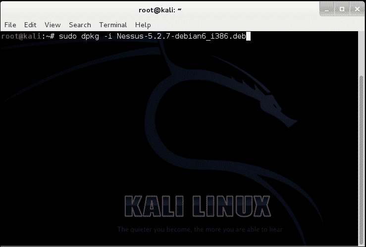

1.  输入以下命令并按*Enter*：

```
sudo /etc/init.d/nessusd start

```

这个命令将启动 Nessus 漏洞扫描工具：

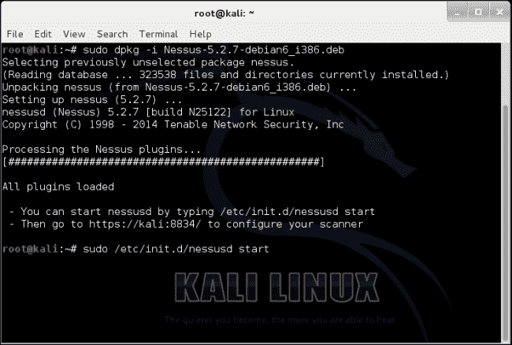

1.  打开一个网络浏览器，导航到`https://127.0.0.1:8834`。

1.  当提示网站的安全证书时，点击**仍然继续**。然后会出现以下屏幕：

1.  你将看到 Nessus 的欢迎屏幕。点击**开始**按钮：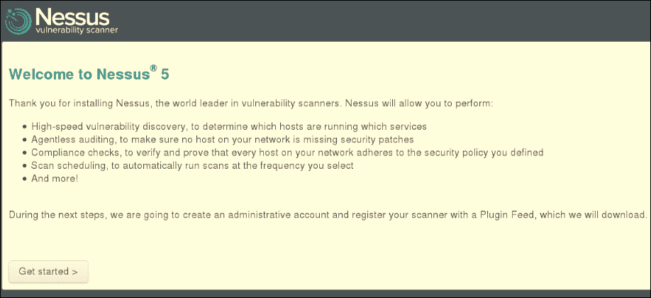

1.  创建一个登录和密码，然后点击**下一步**：

1.  接下来，你需要获取一个激活码：

1.  打开你的网络浏览器，导航到[`www.tenable.com/products/nessus-home`](http://www.tenable.com/products/nessus-home)。

1.  你需要在网页右侧填写你的信息：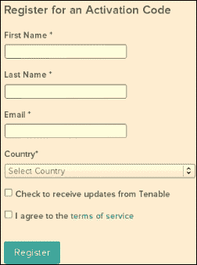

1.  返回到激活码字段，粘贴你通过电子邮件收到的代码：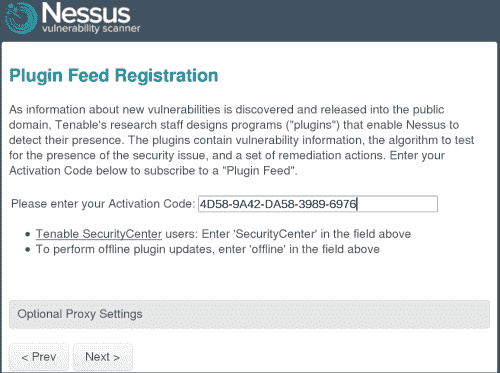

1.  输入激活码后，你应该会收到如下消息：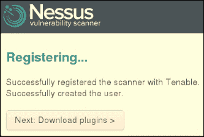

1.  Nessus 将下载插件。这将需要一些时间，所以在看到这个时，去做其他事情，然后回来：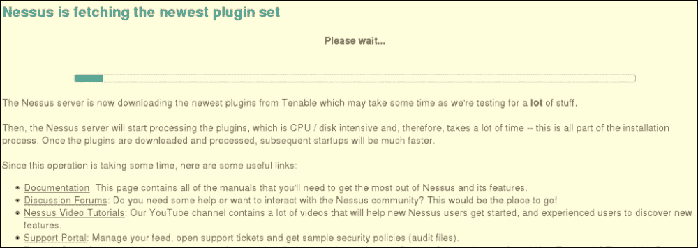

1.  一旦插件下载完成，你应该会被提示输入 Nessus home 的登录和密码：

就是这样！你已经成功安装并注册了 Nessus 漏洞扫描器。

# 运行漏洞扫描器

在我们开始扫描之前，我们需要为扫描创建一个策略。执行以下步骤：

1.  使用之前创建的新用户名登录：

1.  从 Nessus 点击**策略**，将出现以下屏幕：

1.  点击**+**符号添加一个新策略：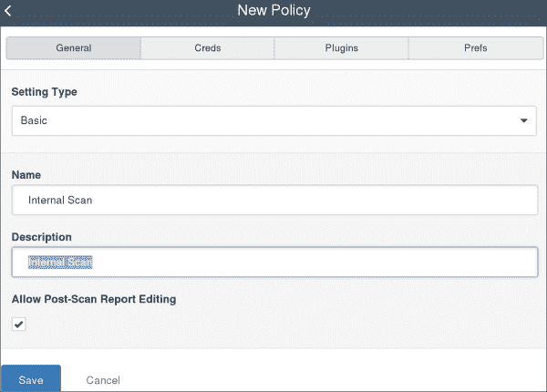

1.  点击**保存**按钮保存您的设置：

您应该收到一个成功消息。

1.  点击**扫描**：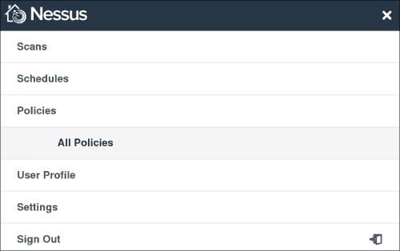

1.  接下来，点击**+**符号：

1.  字段需要填写如下：

+   **名称**：`内部扫描`

+   **描述**：`内部扫描`

+   **目标**：`192.168.1.0/24`

如下截图所示：


1.  点击**启动**按钮开始扫描。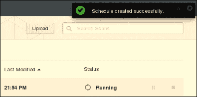

它应该显示**运行**状态。这个过程可能需要一段时间，因为它必须扫描您的整个内部网络。

1.  点击**内部扫描**。它应该提供扫描结果、条形图等，如下截图所示：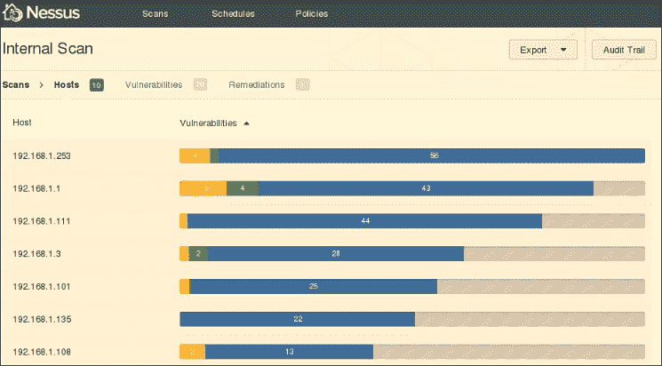

1.  点击**漏洞**选项卡。它应该提供一个列出顶部**高**漏洞的漏洞列表：

1.  点击其中一个漏洞。它将提供额外的信息：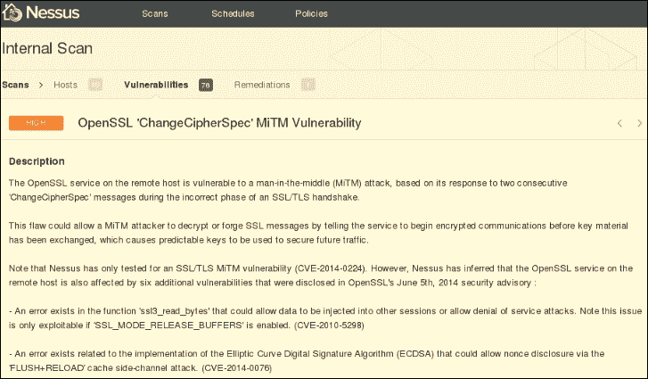

1.  向下滚动查看解决方案。在这种情况下，最好升级到最新版本的 OpenSSL：

报告提供了有关漏洞及其功能的信息。它将提供带有额外信息参考链接的解决方案。对于普通用户，这将为您提供有关问题来源、风险和威胁以及如何解决问题的所有细节。

# 生成报告

生成报告有助于组织您的工作，并为您提供一个地方来审查您渗透测试期间的所有输出和结果。报告很重要，因为它们提供了一个区域内的所有信息，而不必参考另一个文档。

1.  现在我们已经安装并运行了扫描，是时候从我们的扫描中获取报告了。在显示结果的情况下，点击**漏洞**：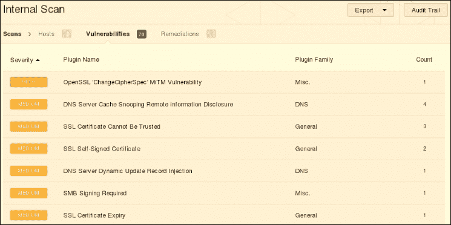

1.  点击**导出**：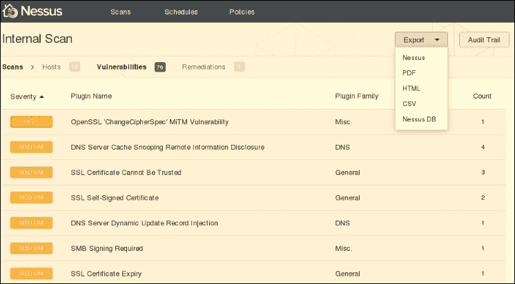

1.  将左侧面板拖放到右侧。点击**导出**。这将下载您选择的文件格式：

1.  打开文件查看是否以可视化和工作格式显示，如下所示：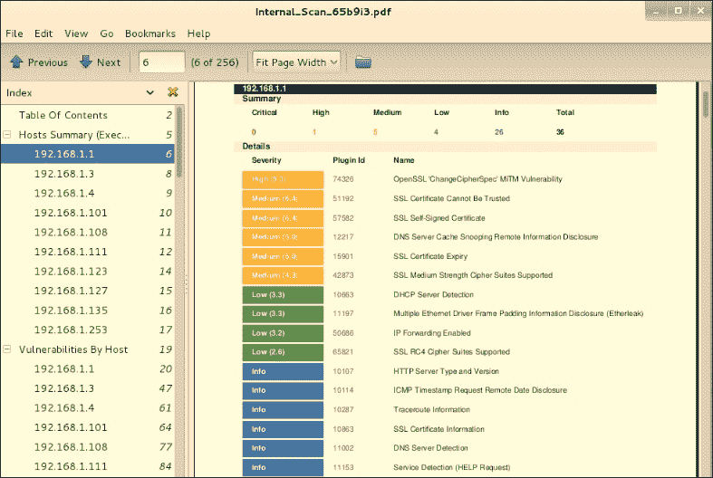

恭喜，您已成功在 Nessus 中生成了一个漏洞报告！

# 解决漏洞

程序中的漏洞比操作系统漏洞更不那么危险，因为黑客很少针对它们。即便如此，一些程序漏洞可能构成重大威胁，例如 Internet Explorer 或 Microsoft Office 中的漏洞。这些漏洞通常会在补丁可用时通过 Windows 更新来解决。安全更新可从 Microsoft Update、Windows Update 和 Office Update 获取。你可以通过关键字搜索“安全更新”来轻松找到它们。例如，如果 Nessus 在你的 Windows 系统上检测到 MS07-036 作为一个漏洞，你可以搜索该安全公告编号，然后下载所有适用的更新来修补你的系统。在涉及程序漏洞时，你必须始终检查最新的软件更新，并在可用时下载它们。

# 总结

好了，这差不多就是本章的全部内容了！我希望你喜欢这一章。我们讨论了如何开始规划评估、评估的关键组成部分以及评估的逐步过程。我们安装了 Nessus，注册了它，下载了插件，然后运行了 Nessus。我们还创建了一个新的策略和扫描，识别了漏洞，阅读了漏洞的详细信息，并提出了漏洞的解决方案。现在，我们将继续前进到下一章，你将学习客户端攻击！
