# 第七章：客户端攻击

在上一章中，我们讨论了如何对网络进行漏洞评估。本章将涵盖客户端攻击，这将帮助您了解黑客如何针对网络上的系统和其他设备进行攻击。那么什么是客户端攻击？我很高兴你问！

在本章中，我们将涵盖以下主题：

+   客户端攻击的类型

+   嗅探未加密的流量

+   蜜罐攻击

+   预防威胁


# 客户端攻击的工作原理

要充分理解客户端攻击的工作原理，我们需要讨论与客户端攻击相对的服务器端攻击的工作原理。服务器运行许多不同的应用程序和服务，这些应用程序和服务与客户端进行交互。这些服务器服务对客户端开放，使客户端可以尝试利用这些服务。服务器上运行的服务越多，就越容易受到攻击。


客户端攻击是不同的。这些攻击针对与恶意服务器交互的客户端应用程序中的漏洞。如果客户端没有连接到服务器，它就不会有风险，因为它不会处理从服务器发送的任何内容。即时通讯应用程序可能会使客户端暴露于攻击之下，因为大多数客户端都自动配置为登录到服务器。


最常见的客户端攻击是当某人访问一个恶意的网页，该网页针对他们的网络浏览器应用程序。如果攻击成功，攻击者可以轻易控制客户端。除了基于网络的攻击，还有更多的攻击方式，比如通过电子邮件、即时通讯和 FTP 进行的攻击。

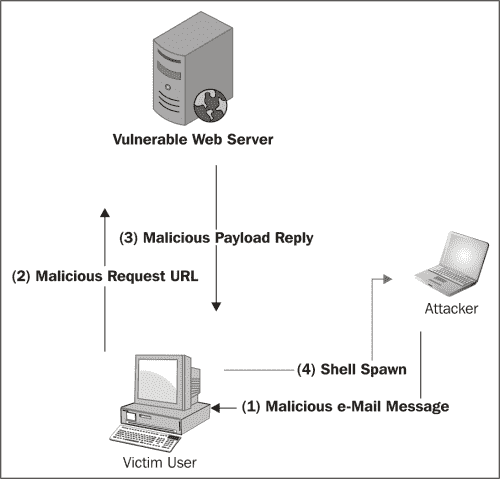

只有在有防御措施时，客户端才受到保护。防火墙和代理帮助限制网络流量只能访问受信任的网站和服务器。WatchGuard 的 XTM 800 系列硬件防火墙具有数据包过滤、入侵防护服务和应用程序控制。如果您是一家企业，而网络上没有硬件防火墙，那么您所有的系统和设备都会面临风险。

# 客户端攻击的类型

客户端攻击利用用户与他们访问的网站或服务器之间的信任。


以下是最常见的客户端攻击类型：

+   **欺骗**: 欺骗用户相信网站或服务器是合法的。

+   **跨站脚本（XSS）**: 这允许攻击者在用户的网络浏览器内执行操作。这种攻击可以用来控制用户的会话，进行钓鱼攻击以窃取登录凭据，甚至用露骨内容羞辱用户。所有网络应用程序都容易受到这种利用的攻击。通常，攻击会使用 HTML、JavaScript、VBScript、ActiveX、Java 或 Flash 在用户的网络浏览器应用程序上执行。


# 嗅探未加密的流量

您现在应该知道，任何人都可以查看未加密的无线流量，因此您的数据很容易被泄露。您是否曾经连接到过公共无线网络，比如星巴克或酒店？您是否曾经想过还有谁可能连接并监听您的网络流量？听起来很可怕，对吧？

实际上，几乎不需要任何经验！任何人都可以轻松查看未加密的流量。在接下来的演示中，我将详细向您展示如何嗅探您的未加密流量。这个演示将帮助您了解始终使用安全连接是多么重要。

1.  导航到**应用程序** | **互联网** | **Wireshark**：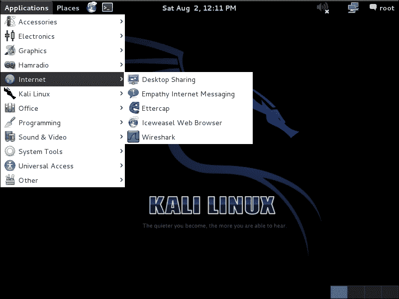

### 提示

您还可以通过打开终端并输入`sudo wireshark`来打开 Wireshark。

1.  如果收到错误消息或信息消息，请点击**确定**：

在上面的截图中，它只是说明由于以超级用户身份运行 Wireshark，`dofile`被禁用。我们可以简单地忽略这个错误消息，点击**确定**，因为这不会影响我们的工作。它只是说明我们正在以非特权用户身份运行 Wireshark。


1.  Wireshark 图形界面应该会出现：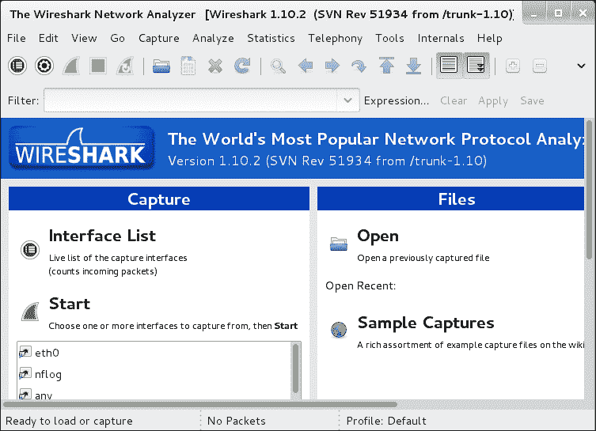

1.  然后，按照以下步骤导航到**捕获** | **接口...**：

1.  在这个演示中，我们选择了**eth0**。对于一些人来说，这可能是**wlan0**或**wlan1**。选中该框，然后点击**开始**：

1.  您应该看到 Wireshark 开始捕获网络流量：

1.  在这个演示中，我们将过滤`telnet`。点击**保存**：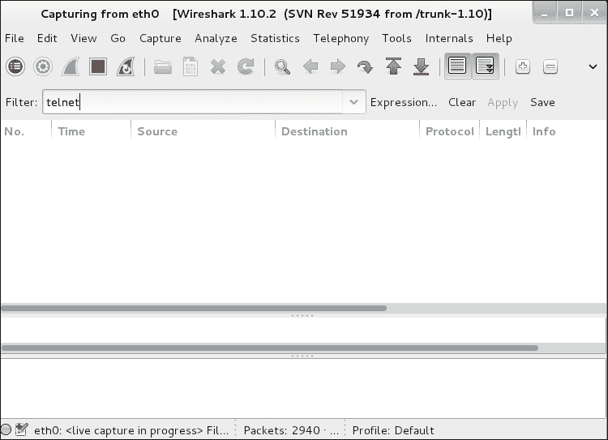

1.  使用`telnet`命令连接到 telnet 服务器。您需要运行自己的 telnet 服务器才能进行此操作：

1.  在 Wireshark 中，您应该会看到很多不同的 telnet 数据包。右键单击其中一个，然后选择**跟踪 TCP 流**：

1.  它应该显示 telnet 会话输出，其中包含明文的登录和密码：

要使用此连接的安全形式，必须使用 SSH-2。SSH-1 存在中间人攻击问题和安全漏洞。SSH-1 也已经过时，应该尽量避免使用。确保更新您的`sshd_config`文件，更改默认的 SSH 端口，限制用户的 SSH 访问，配置 IDL 注销超时间隔，禁用 root 登录，并根据您的法律条款和法律通知详细信息设置警告横幅。使用强大的 SSH 密码和口令。我无法再次强调这一点有多重要。

# 蜜罐攻击

随着技术的进步，无线网络在带宽和范围方面变得更大。黑客可以轻松地设置一个无线蜜罐，诱使受害者进入他们认为是受信任的无线网络。什么是无线蜜罐？**无线蜜罐**是一个配置为接入点的设备，它可能具有与该区域内另一个接入点相同的 SSID，并且还配置有代理指向攻击者的计算机。

如果用户连接到蜜罐，他们所有的网络流量都将被攻击者过滤或监视，这可能导致中间人攻击。攻击者随后可以查看该连接中的任何未加密流量，例如电子邮件、即时通讯、FTP 和 telnet 会话：


如果攻击者有高功率增益天线，客户端很可能会在可用无线网络的顶部看到它。还要注意的是，大多数 Microsoft Windows 操作系统都配置为自动连接到无线网络，如果附近有相同 SSID 和密码短语的蜜罐，这可能非常糟糕。此功能可以被禁用。

## 如何保护自己免受蜜罐或中间人攻击？

保护自己免受蜜罐攻击的最简单方法之一是简单地不使用无线网络。如果您的组织需要无线网络怎么办？在 BYOD 设备上，应创建配置文件，只允许信任的无线网络连接到客户端设备。使用 3G/4G 连接或有线连接。如果您仍然需要无线网络怎么办？有基于软件和硬件的无线入侵防范系统（WIPS）可以检测到恶意接入点。


WIPS 通过 SSID、频道、信号强度和 MAC 地址识别这些接入点。如果参数不匹配，则 AP 可能是蜜罐。如果黑客在相同的 SSID 和频道上操作会怎么样？WIPS 将根据信号强度进行判断。信号强度可以确定它是否是合法的 AP。

**KFSensor**是基于 Windows 的蜜罐**入侵检测系统**（**IDS**）。它就像一个蜜罐，吸引并检测黑客、蠕虫、流氓和漏洞。通过充当诱饵，它可以转移攻击以提供额外的安全级别。KFSensor 界面如下截图所示：


您可以从[`www.keyfocus.net/kfsensor/download/`](http://www.keyfocus.net/kfsensor/download/)下载 30 天的试用版。

# Karmetasploit

Karmetasploit 非常类似于蜜罐，但它专注于漏洞和对客户端的利用。Karmetasploit 是一个虚假的流氓接入点应用程序。当受害者连接到它时，Karmetasploit 将针对客户端启动 Metasploit 框架中的所有漏洞利用。它还可以捕获登录和密码。Karmetasploit 界面如下截图所示：

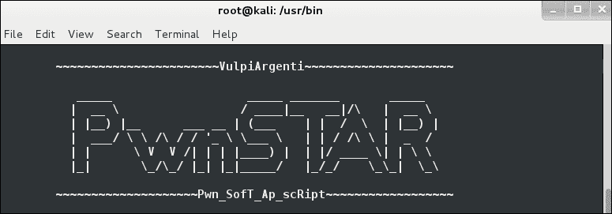

在接下来的演示中，我们将使用 Karmetasploit 创建一个虚假的 AP。请理解这些演示仅用于教育目的。在某些地方广播 Karmetasploit 可能是非法的。在使用 Karmetasploit 之前，请咨询在您的司法管辖区有执业资格的有能力的律师。

让我们开始演示！

1.  打开终端并从[www.github.com](http://www.github.com)下载 PwnSTAR：

```
git clone git://github.com/SilverFoxx/PwnSTAR.git

```

以下是输出：

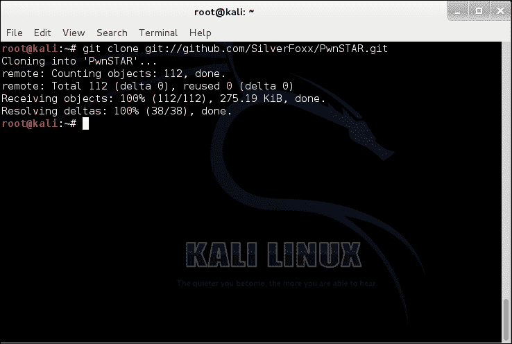

1.  转到`PwnSTAR`目录：

1.  执行`installer.sh`并按照提示操作：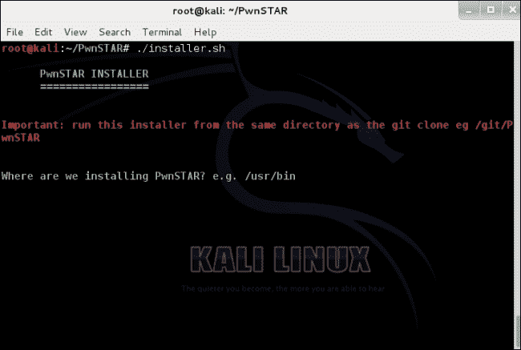

### 提示

当被问及在哪里安装 PwnSTAR 时，只需按*Enter*或输入`/usr/bin`。

1.  转到`pwnstar`目录`/user/bin`：

1.  输入`y`：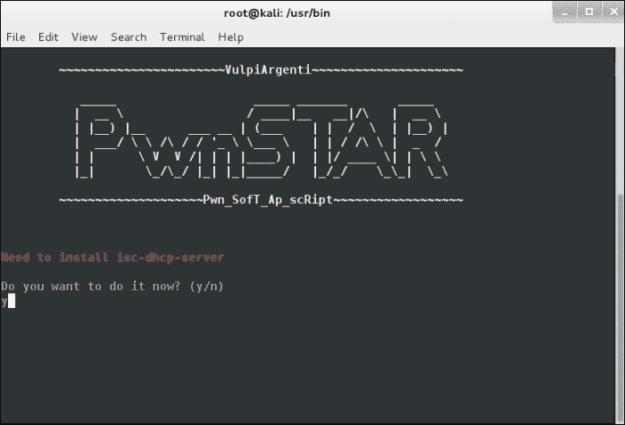

1.  选择选项**5) Karmetasploit**：

1.  按照提示操作：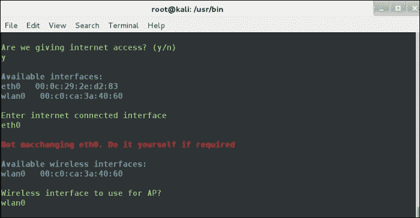

在上一个屏幕截图中，您可以看到我们正在提供互联网访问。这样用户就知道他们已连接到互联网；但是，DNS 可能被欺骗，以便 DNS 请求将发送到攻击者而不是互联网。`wlan0`是用于无线接入点的接口。

1.  按照所示的提示操作：

1.  这应该带您到以下屏幕：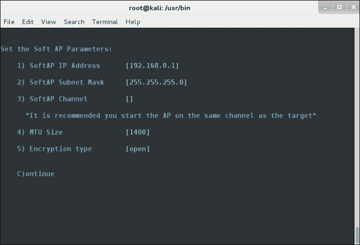

在上一个屏幕截图中，当要求输入频道时，您可以输入任何频道号（`1`到`11`）。在这个演示中，我使用了`6`。

1.  选择选项**3) SoftAP Channel**并输入频道号`6`：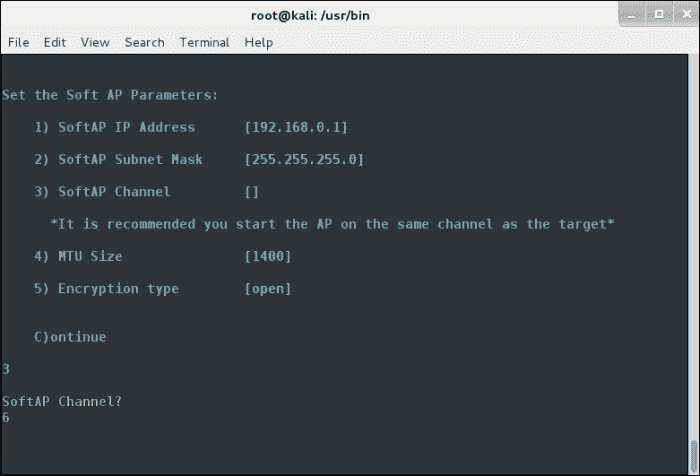

1.  输入字母`c`继续并选择选项**2) Bullzeye**：

Bullzeye 只广播您想要分配的 SSID。当用户连接到无线 AP 时，他们将从`eth0`接收到互联网访问，因为它被共享到`wlan0`。

1.  输入要使用的 SSID 名称：

### 提示

如果要求检查 DHCP 服务器参数，则不需要这样做。DHCP 将自动设置和配置。

1.  如果一切顺利，Karmetasploit 和其他几个终端窗口将提示您输入：

恭喜！您已成功安装并运行 Karmetasploit。

# Jasager

很少有人对 Jasager 了解甚深。如果你是其中之一，今天就是你的幸运日，因为在这一部分，你将学到 Jasager 是什么，以及它对无线渗透测试人员有什么提供。

Jasager 是基于 Karma 构建的。它设计用于在 OpenWrt 上运行。Jasager 支持大多数无线接入点和 Wi-Fi 网络适配器。它的主要特点是一个显示网络信息的 Web 界面，通过 AJAX 和 Lynx 完全控制 Karma 功能，自动运行脚本使执行任务变得容易，日志记录以及对基本命令的支持。

WiFi Pineapple Mark 5 是所有无线网络审计工具的完美设备。hak5.com 的所有者 Darren Kitchen 专注于制造最实惠的无线设备，以扩展无线黑客工具的使用。WiFi Pineapple 自 2008 年以来一直存在，并为渗透测试人员、军方和政府、执法部门和黑客活动分子提供服务。一定要在[`wifipineapple.com`](https://wifipineapple.com)上查看它。

在接下来的演示中，我将向你展示如何在 WiFi Pineapple 上启用 Jasager。即使你没有 WiFi Pineapple，也应该跟着做，因为了解它的工作原理以及在网络上执行起来有多容易是很重要的。

1.  通过以太网电缆直接将 WiFi Pineapple 连接到你的计算机。

1.  打开你的网络浏览器，导航到`http://172.16.42.1/pineapple`。以`root`身份登录；密码是`pineapplesareyummy`：

1.  在左侧，你应该看到一个服务列表；点击**MK4 Karma**旁边的**Start**按钮：

恭喜！你已成功启用了 Jasager。那么 Jasager 是什么呢？**Jasager**是 Karma 的一种实现，旨在在 OpenWRT 上运行。通过 Jasager，你可以看到当前连接的客户端及其 MAC 地址、IP 地址和 SSID。你可以自动运行脚本来自动执行关联和 IP 分配的任务，记录信息，并利用一个完整的命令行界面进行快速和轻松的访问。对于企业来说，你可以使用 Jasager 通知你新的客户端连接到网络，然后为新的客户端提供一个网站横幅，指示他们正在被监视，并且任何未经授权的访问是被禁止的。在家里，你可以确定是否有邻居试图窃取你的无线互联网。

# 预防措施

好的，所以你完全意识到下一次酒店访问可能是危险的，即使每个网页重定向都只是充斥着小猫。好消息是，我们仍然有办法保护自己免受这些蜜罐或恶意接入点的威胁。以下是其中一些：

+   **禁用 Wi-Fi**：关闭 Wi-Fi 是确保你的安全的最简单方法。没有 Wi-Fi，你就减少了这些攻击对你的安全风险。

+   永远不要连接到开放的 Wi-Fi 网络：免费的互联网听起来很棒，但如果有人碰巧在嗅探所有的网络流量呢？不要冒险连接开放的 Wi-Fi 网络。

+   **连接到安全的 VPN 连接**：如果开放网络是你唯一的访问方式，一定要使用安全的 VPN 连接。

# 总结

这是一个很棒的章节！我们涵盖了很多内容。让我们花一些时间回顾一下你学到了什么。在这一章中，你学会了如何捕获未加密的流量，并了解了蜜罐攻击和方法、Karmetasploit、Jasager 以及威胁预防。

在下一章中，你将学会捕获加密的网络流量，并了解中间人攻击。
