# 第八章。数据捕获和利用

欢迎！在上一章中，我们使用了几个工具，如 Karmetasploit、Wireshark 和 WiFi Pineapple。

在本章中，我们将涵盖以下主题：

+   捕获未加密的网络流量

+   中间人攻击

+   Metasploit

+   威胁的预防

在上一章中，我们讨论了如何嗅探流量，但是如何获取用户名、密码和其他敏感信息呢？

由于这是一本高级技术书籍，我们期望您对此有基本的了解；但是，为了您的利益，我们将演示如何使用这些工具。感到自信？没问题。继续并跳过演示。对于仍在阅读的人，让我们开始学习如何捕获加密流量。

# 捕获未加密的流量

我们知道未加密的无线流量可以被连接到同一无线网络的任何人以纯文本形式查看。您的数据可能会受到损害，例如您的电子邮件、即时消息、通过 FTP 传输的文件、telnet 会话、HTTP 会话等。这是如何工作的？当用户使用 HTTP 浏览网站时，他们传输的数据没有端到端的保护，因此可以被同一网络上的任何人拦截和记录。

Wireshark 是一款网络分析器，允许您查看实时网络数据包并保存结果。Wireshark 可以在 Windows、Mac、Linux 和 Unix 操作系统上运行。如果用户在网络上运行 Wireshark，他们可以看到人们访问的网站、正在传输的文件、即时消息等等。

有许多网络服务容易受到网络嗅探和公共网络的威胁。任何具有 Wireshark 技能和知识的人都可以轻松地破坏您的帐户。

为了保持安全，请始终检查以下内容：

+   使用 WPA 或 WPA2 加密

+   在公共网络上始终使用 HTTPS

+   使用 SSH 或加密电子邮件进行文件传输

+   在公共网络上使用 VPN

+   使用密码管理器登录网站

# 中间人攻击

您可能听说过*中间的猴子*，但您听说过中间人吗？**中间人**（**MITM**）攻击是用户成为网络拦截的受害者。网络上的恶意用户就像一个路由器一样，他们抓取所有的网络流量。这包括电子邮件、登录、聊天消息等等。

此演示仅供教育目的使用。黑客行为可以使您更加安全，这是一个很好的技能资产。在大多数国家，未经许可在未经授权的网络上进行任何形式的恶意活动都被视为犯罪。在下一次演示中，我们将使用我们自己的计算机和网络。

1.  打开终端，输入`leafpad /etc/ettercap/etter.conf`：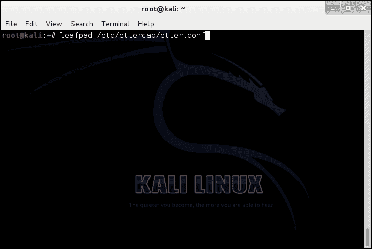

1.  打开`etter.conf`，查找高亮显示的单词：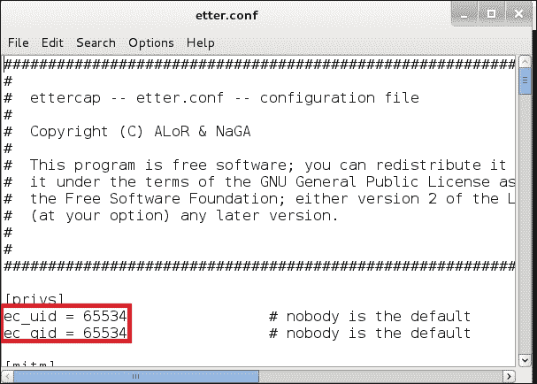

您需要将高亮显示的代码更改为这样：

1.  点击**Search**然后点击**Find**。输入`iptables`然后点击**Find**按钮：

结果应该是这样的：

您需要取消注释两行，使其看起来像这样：

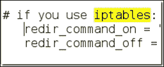

1.  通过打开终端并输入`ettercap –G`来启动`Ettercap-gtk`：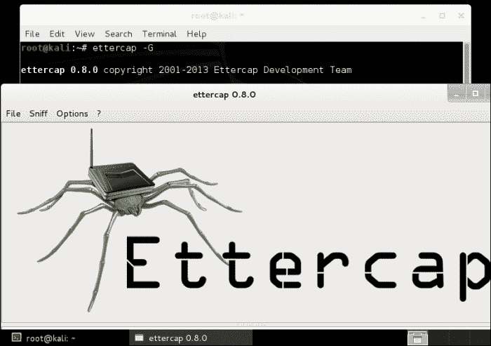

1.  当 Ettercap 打开时，您需要点击**Sniff**然后选择**Unified sniffing**：

1.  选择连接到网络的接口：

### 注意

如果您正在使用 Wi-Fi，您将选择`wlan0`或`wlan1`。

1.  点击**主机**，然后选择**扫描主机**，如下面的屏幕截图所示：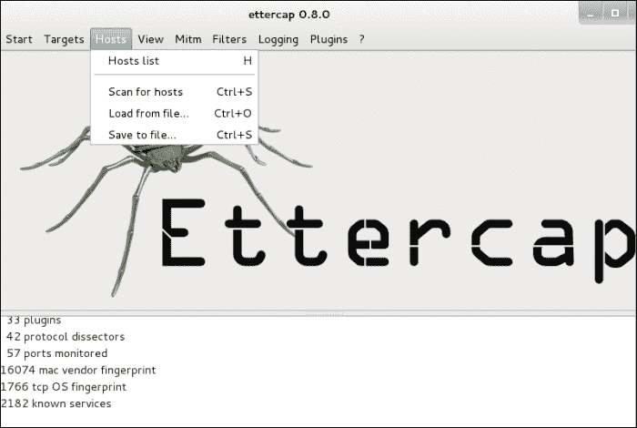

1.  在命令框中，您应该看到**已添加到主机列表的主机**。 点击**主机**，然后选择**主机列表**：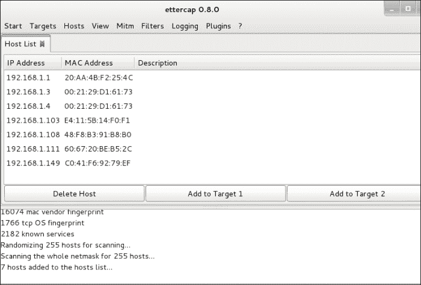

1.  选择路由器的 IP 地址，然后单击**添加到目标 1**按钮。 将显示以下屏幕：

1.  选择受害者的 IP 地址，然后单击**添加到目标 2**按钮：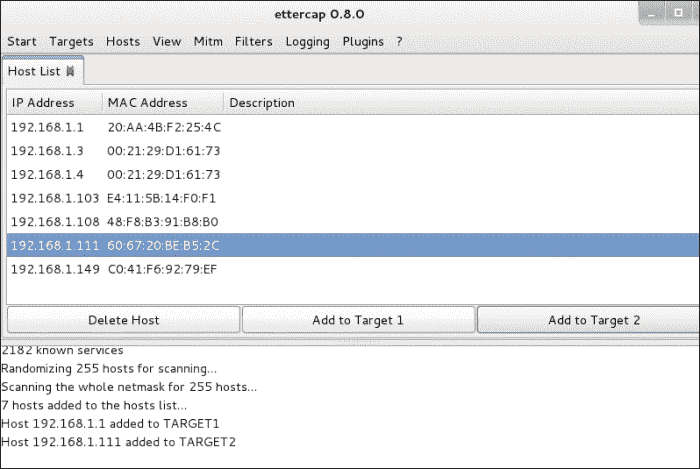

1.  点击**Mitm**，然后选择**ARP 欺骗**：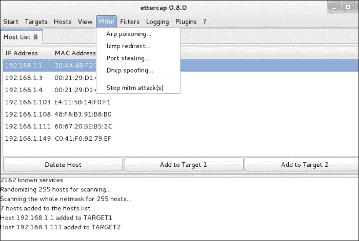

1.  收到提示时，请勾选**嗅探远程连接**旁边的框，然后单击**确定**：

1.  点击**开始**，然后选择**开始嗅探**。

Ettercap 将开始对受害者和路由器进行 ARP 欺骗。 Ettercap 将显示来自受害者的任何信息或数据。

恭喜！ 您已成功进行了一次完整的中间人攻击。

如果您愿意，您还可以使用诸如 sslstrip 和 urlsnarf 之类的工具，以从受害者那里获取一些额外信息。 **sslstrip**是一种 MITM 攻击，它迫使用户使用 HTTP 协议进行通信，而不是 HTTPS，攻击者可以查看所有 SSL 流量的明文。 **HTTP 严格传输安全性**（**HSTS**）是一种安全保护机制，可保护您免受此类威胁。 它防止 HTTPS 在发生 cookie 和浏览器劫持时被降级。 **urlsnarf**以 CLF 格式显示所有请求的 HTTP 流量，并可用于分析用户访问的网站和网站流量。 攻击者也可以使用它来窥探用户在互联网上搜索和访问的内容。

要停止攻击，请单击**开始**，然后选择**停止嗅探**，如下所示：

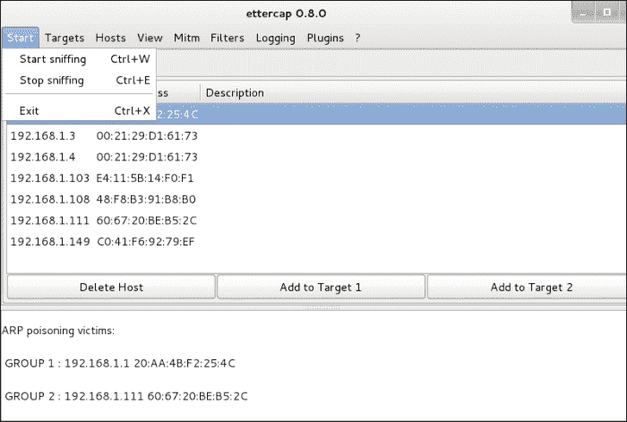

停止攻击后，Ettercap 将发送一个 ARP 数据包，网络将在几分钟内恢复正常。 您可以使用 ARP 检测软件（如 XArp 或 Snort）来保护自己免受此类攻击。 此外，分配静态 ARP 条目可以帮助防止攻击。 它将告诉攻击者路由器的 MAC 地址是永久的，无法更改。 因此，它将忽略攻击者发送的所有 ARP 数据包。

# Metasploit

啊是的，Metasploit 是最臭名昭著的开源工具，供渗透测试人员和 IDS 开发人员使用！ **Metasploit Framework**是一个充满安全漏洞和脚本的数据库。 它是开发和执行针对目标系统的利用代码的最受欢迎的开源工具之一。 Metasploit UI 显示在以下屏幕截图中：

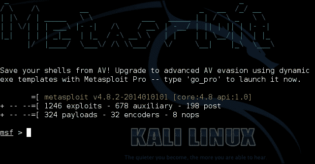

在下一个演示中，我们将利用 Windows 8.1 的 Java 漏洞。 此漏洞将允许攻击者获取系统信息或哈希转储，从网络摄像头中获取图片，授予管理权限，创建和运行可执行文件，创建后门等。 让我们开始吧！

1.  打开终端并键入`msfconsole`：

### 提示

您还可以运行`server postgresql start`或`service metasploit start`。

1.  现在键入`search java_signed_applet`：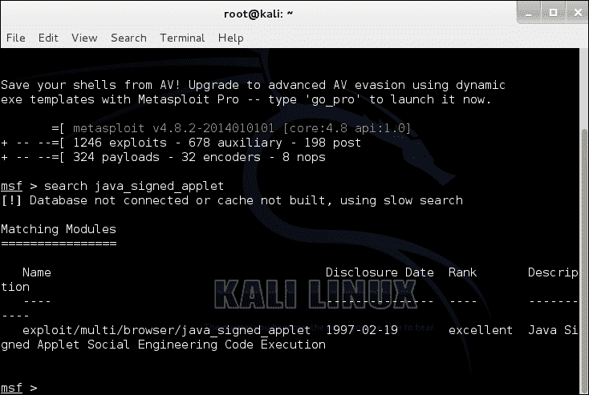

1.  然后键入`use exploit/multi/browser/java_signed_applet`：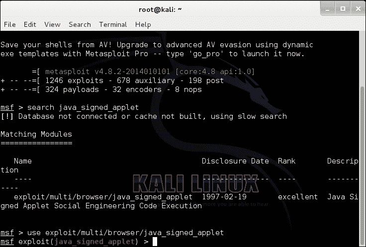

1.  现在键入`set SRVHOST <IPADDRESS>`：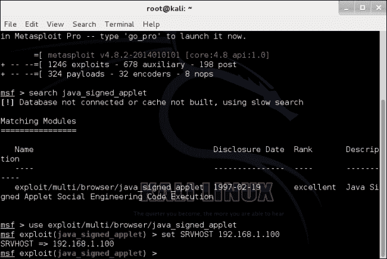

### 提示

用您的 Kali Linux IP 地址替换`<IPADDRESS>`。

1.  键入`exploit`：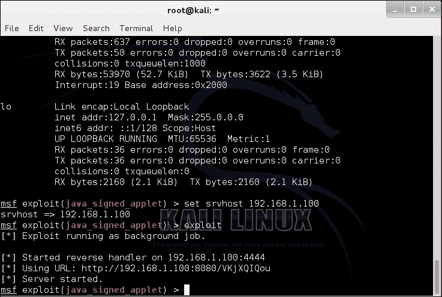

1.  在受害者的系统上，转到 Metasploit 提供的 URL 链接。 您应该收到以下内容：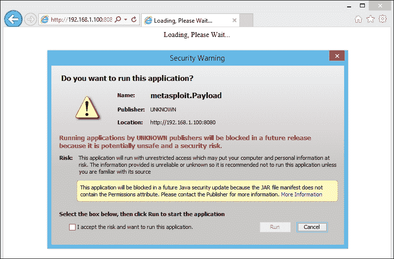

JVM 应该在受害者的系统上显示一个提示，询问他们是否信任已签名的小程序。如果用户正在运行较旧版本的 Java，它将显示**UNKNOWN**。一旦用户点击**Run**，Java 小程序将执行，从而利用 Java 在 Metasploit 中创建一个 Meterpreter 会话：

1.  在 Meterpreter 中，键入`sysinfo`以确认您的成功。

恭喜！您已成功利用了 Windows 8.1 操作系统。

为了保护自己免受此类攻击，请考虑以下事项：

+   如果不打算使用 Java，则禁用它

+   提高 Java 的安全级别

+   只允许来自 Java 的可信任来源

+   只访问可信任的网站和远程服务器

+   启用 Windows Defender 或其他安全软件

# 预防措施

以下是本章讨论的所有预防措施的总结：

+   使用 SSH 或加密电子邮件进行文件传输

+   在公共网络上使用 VPN

+   使用密码管理器登录网站

+   使用 XArp 或 Snort 等 ARP 检测软件

+   分配静态 ARP 条目

+   如果不打算使用 Java，则禁用它

+   提高 Java 的安全级别

+   只允许来自 Java 的可信任来源

+   只访问可信任的网站和远程服务器

+   启用 Windows Defender 或其他安全软件

+   下载并安装软件更新

+   下载并安装操作系统更新

再次强调，这一切取决于用户的计算机行为。如果用户连接到公共网络，他们可能会成为中间人攻击的受害者。如果用户盗版软件或电影，他们可能会成为漏洞攻击的受害者。

# 总结

希望您和我一样喜欢本章。实际演示应该已经证明是一个很好的思维启发，并拓宽了您对安全的认识，以进一步保护自己和他人免受攻击。

在本章中，我们涵盖了以下内容：

+   如何捕获使用 HTTP、FTP 和 Telnet 等协议的未加密流量

+   如何使用加密保护自己

+   什么是中间人攻击

+   中间人攻击的演示

+   如何保护自己免受中间人攻击

+   Metasploit 是什么

+   Metasploit 的演示

+   如何保护自己免受 Metasploit 攻击

在下一章中，您将学习如何通过本地网络来访问其他系统和设备。我们还将记录我们的工作，并在最后进行清理。见你在第九章，*后期利用*！
