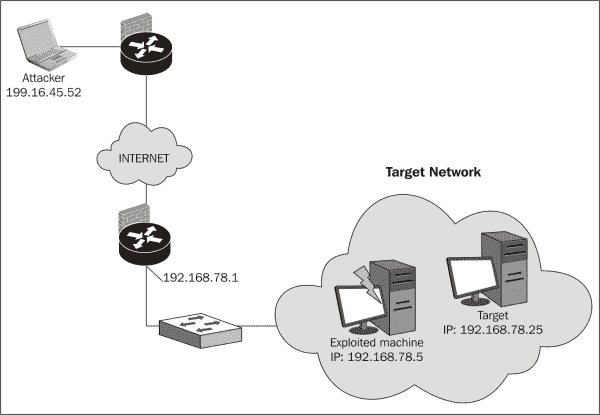
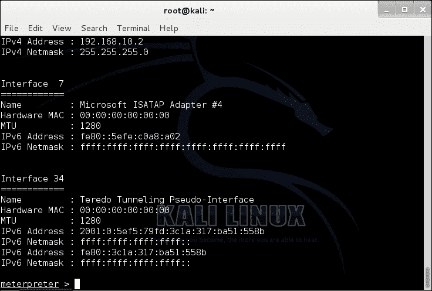
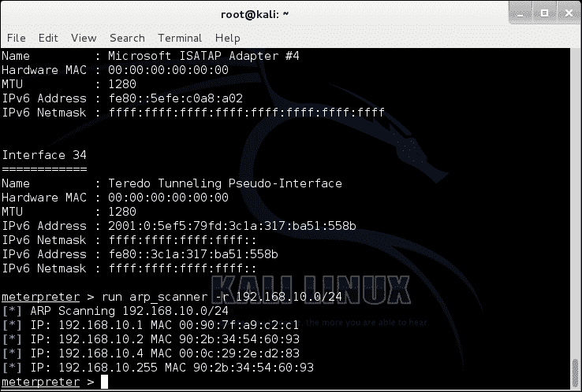

# 第九章：后期利用

欢迎！在上一章中，我们入侵了网络上的一个目标。接下来会发生什么，你可能会问？攻击者很可能会深入攻击内部工作站和服务器。在本章中，我们将涵盖以下主题：

+   如何创建一个数据透视

+   记录我们的工作

+   清理我们的工作

+   保护自己免受数据透视攻击

后期利用

# 创建一个数据透视

我们已经破解了无线加密，获得了对网络的访问权限，并入侵了一个系统。攻击者接下来会采取的下一步是避开**入侵防范系统**（**IPS**）或**入侦测系统**（**IDS**）。数据透视将通过将流量路由到受损系统，然后使用受损系统的流量对内部网络上的其他工作站和服务器发起额外的攻击来实现这一点。这将欺骗 IPS 和防火墙日志，使其显示内部 IP 地址而不是攻击者的外部 IP 地址。



现在，你可能会问自己，为什么我要购买 IDS 或 IPS，如果它不能保护我的网络？嗯，在网络上激活 IDS 或 IPS 不仅很重要，而且监视和每天审查它也很重要。如果没有人适当地监视或审查 IDS 或 IPS，那么你可能已经有人在你的网络上潜伏而你却不知道。

让我们花一些时间讨论为什么拥有 IDS 或 IPS 很重要：

+   物理安全：

+   你怎么知道有人不已经在你的网络上了？

他们可能正在访问敏感数据

+   在处理防火墙时，你是否忘记禁用 SSH？

攻击者只需一个开放的漏洞就能获取访问权限，然后可能获得对其他内容的访问权限

+   可靠性和稳定性：

+   风险管理

+   对业务运营的影响较小

+   业务连续性

+   减少业务停机时间

+   灵活性：

+   访问其他人无法访问的安全控制功能

+   提供额外的安全和控制层

+   安心：

+   当其他安全控制意外失败时，IDS 可以提供额外的安全服务

+   知道谁和什么进入你的网络来访问数据非常重要，特别是如果其中包含客户数据或其他敏感信息


总之，安全对于企业来说变得更加重要。企业因为没有采取额外的安全措施来保护客户的个人数据而损失了金钱。在某些情况下，这些信息可能会被公开。一旦公开，企业可能会失去现有客户和新客户。

在 IDS 和 IPS 上说了足够的话，现在是时候开始我们本章的数据透视演示了。在开始之前，我们必须已经入侵了一个系统并获得了对 Meterpreter 会话的访问权限。如果你还没有做到这一点，请参考第八章，*数据捕获和利用*。

让我们开始吧！

1.  访问 Meterpreter 并输入：

```
ipconfig

```

这将显示内部 IP 地址：



1.  运行网络扫描并输入：

```
run arp_scanner –r 192.168.10.0/24

```

这将显示内部网络上的所有主机：



1.  然后输入`background`。这将使 Meterpreter 会话保持运行，同时我们在 Metasploit 控制台中运行其他命令。

1.  然后，我们添加从默认网关到受损系统的路由并输入：

```
route add 192.168.1.110 255.255.255.0 1

```

这将通过受损系统将默认网关的所有流量路由。这将使我们能够访问内部网络中的其他主机，从而也威胁到这些系统。

创建一个数据透视

恭喜！您已成功创建了一个枢纽。内部网络是完全可访问的，您可以在这里对其他主机运行攻击，而不必担心 IDS、IPS 或防火墙警报。攻击看起来像是来自内部网络。

# 记录您的渗透测试

渗透测试中可能最重要的部分之一是记录您的工作。开始记录您的渗透测试的最佳方法是创建一个大纲。

以下是专业大纲的示例：

**介绍**：

+   对客户的 10.0.0.0/24 网络执行渗透测试。此渗透测试的目标是确定 10.0.0.0/24 网络的无线安全性。评估是在几个目标系统上执行的。给出的结果不是为所有主机，而是仅适用于 IP 范围内的那些系统。

+   客户 John Doe 在整个渗透测试期间承认了所有确定的漏洞。此测试不运行任何**拒绝服务**（**DoS**）攻击；但是，可以确定主机是否容易受到 DoS 攻击，而无需执行实际攻击。

**系统**：

+   显示网络上将被识别并扫描漏洞的每个目标系统

**方法和技术**：

+   发现:

+   检查 DNS 记录、whois 服务器，使用 ping 和 traceroute 等网络工具，以及主干防火墙和路由器

+   使用 TCP、UDP 和 ICMP 回显请求绘制网络地图


steve p2008，知识共享 2.0 ([`www.flickr.com/photos/stevepj2009/6857101082/`](https://www.flickr.com/photos/stevepj2009/6857101082/))

+   枚举：

+   识别开放的 TCP 和 UDP 端口

+   检测操作系统和软件版本

+   确定主机类型（防火墙、DNS 服务器和邮件服务器）

+   确定主机是否容易受到远程攻击的漏洞

+   系统配置和横幅抓取

+   利用：

+   尝试利用任何漏洞或弱点

+   执行缓冲区溢出攻击

+   获得系统级访问权限

+   暴力攻击

**风险**：

+   每个漏洞都按风险级别（低、中和高）进行组织，以及有关安全问题和可用于这些漏洞的威胁的详细信息。

+   任何未经授权的用户可以访问与客户数据、业务数据、员工或网络基础设施相关的敏感信息的信息。

+   安全问题，如弱密码或可能导致系统受损的社会工程攻击。

+   不需要任何钥匙或密码的非安全门户入口。这样，系统可以随时被入侵以收集额外信息。

+   开放的无线网络不在一个单独的子网上，攻击者可以远程访问网络上的服务器或其他主机。

**结论**：

+   详细说明渗透测试期间整体风险关注的百分比

+   提供有关漏洞、弱点、问题、数据泄漏和未识别来源的详细信息

# 清理不必要的工作

现在是时候开始清理渗透测试结果了。我们希望在完成渗透测试时，我们的报告尽可能干净、简单和专业。列出渗透测试期间执行的每个细节和所有操作。任何受损的主机必须得到安全清理，以确保不会影响正常的业务运营。该过程应由技术人员验证，以确保一切都已成功地完成。


任何剩下的糟糕的安全实践和配置错误的系统都不应该被放置不管，而应该进行重新配置或安全设置更改。加密并备份在渗透测试期间使用的任何重要文件或信息。删除或移除可能为测试而创建的未使用的用户帐户。渗透测试人员有责任通知组织有关对网络所做的任何系统更改。

# 预防

在本章中，我们看到了如何攻击一个系统，获取对同一子网上另一个系统的访问权限，然后从那里攻击不同子网上的计算机。虽然这种情况没有涉及任何公司防火墙，但公司防火墙有可能阻止对这些系统或网络的访问。如果你认为你的网络可能正在被摇摆或受到威胁，立即断开网络连接。然后，开始追踪根本原因并将其与网络的其余部分隔离开来。我们在这里真正的问题是缺乏安全意识。受到威胁的用户可能点击了恶意链接，或者下载了他们认为是合法的电子邮件附件或软件。


这就是为什么教育员工有关安全问题非常重要。社会工程攻击变得越来越复杂，以提供更好的结果。保护自己的最佳方法是让自己和其他人了解威胁。

# 摘要

我们从介绍摇摆及其工作原理开始了本章，然后通过 Kali Linux 进行了演示。通过记录我们的渗透测试，我们能够组织我们的工作并在大纲中列出每一个细节。记录是一个重要的过程，为我们在下一章中规划和撰写报告做准备。完成记录工作后，我们开始清理所有不必要的工作。

任何新的文件夹、文件、用户帐户或更改的系统设置都应该被删除或移除。最后，我们提供了一份关于如何保护自己免受摇摆攻击的摘要。在下一章中，我们将提供一份渗透测试报告，其中包含了我们之前的无线渗透测试中的漏洞的详细信息。
