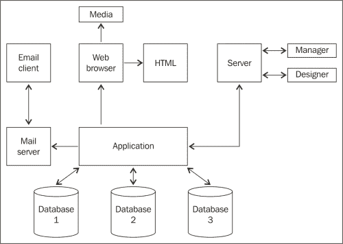
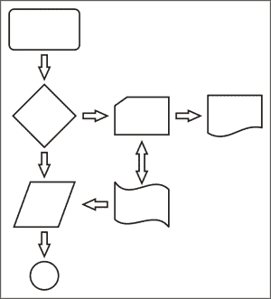

# 第十章。报告

啊！我们终于在*第十章*见面了。恭喜！你成功读完了这本书。但在我们庆祝之前，我们还有最重要的无线渗透测试的一部分要讨论。

在这最后一章，我们将：

+   规划无线渗透测试报告

+   撰写无线渗透测试报告

+   提供包括漏洞信息在内的详细报告

# 规划报告

在我们开始撰写报告之前，我们必须花大部分时间规划报告。这说起来容易做起来难。报告必须以专业的方式完成，不能草率。如果报告没有得到妥善规划，你就有可能浪费宝贵的时间，制作出不符合目标的报告。

以下是规划报告的有效示例：

1.  确定问题的性质和渗透测试的目的：

+   正在测试什么？

+   什么没有被测试？

+   你将使用什么方法进行渗透测试？

1.  确定你的客户联系人：

+   这是公司的总裁吗？

+   这是一位高管吗？

+   这是一个 IT 经理吗？

1.  规划无线渗透测试：

+   我们在进行渗透测试的是谁？

+   是否有**数据丢失预防**（**DLP**）或安全系统受到损害？

+   你通过终端执行了任何命令吗？

+   你使用了 Kali Linux 操作系统吗？

+   你使用了什么工具？

1.  收集信息：

+   你发现了什么漏洞？

+   你与可用的 CVE 进行了比较吗？

+   你找到了任何弱密码登录吗？

+   销售台下有隐藏的无线路由器吗？

1.  组织信息：

+   你列出了所有的信息来源吗？

+   你忘记添加了什么吗？

1.  评估信息：

+   你收集了足够的信息吗？

+   你仔细检查了你的工作吗？

+   你强调了最关键的信息吗？

1.  准备大纲：

+   你的一切都准备好了吗？

+   你为漏洞提供了解决方案吗？

总之，规划报告时，要花时间仔细计划所有细节。当我说详细，我指的是*很多*细节。你绝对不想漏掉你所做的任何工作，尤其是对于商业客户。

客户会想要从头到尾知道你做了什么，即使只是你访问每个小隔间和办公室，确保没有人在设置蜜罐。规划过程不容忽视。这有助于知道你是否漏掉或忘记在报告中添加某些内容。你不想做的是交上未完成的报告。

# 撰写报告

大纲准备好了吗？太好了！让我们开始撰写我们的无线渗透测试报告。我将提供一个你可以用作参考的示例。

## 介绍

这份渗透测试报告代表 Packt Publishing 对无线基础设施进行渗透测试的结果。客户完全知晓正在进行的渗透测试。技术细节将可供 IT 和/或信息安全专业人员阅读。这份报告将从收集信息、起草报告，到最终定稿，采用传统方法提供渗透测试报告。

flazingo_photos，知识共享 2.0（[`www.flickr.com/photos/124247024@N07/13903385550/`](https://www.flickr.com/photos/124247024@N07/13903385550/)）

为了充分进行这次无线渗透测试，我们将使用 Kali Linux 操作系统。

## 受众

无线渗透测试可能针对大量的人群。报告将为软件和硬件的不同领域提供有结构的支持层。这份报告将针对以下用户：

+   信息安全经理

+   首席信息安全官

+   信息技术经理

+   其他技术人员

由于渗透测试将涉及诸如 IP 地址和服务器信息，一些应用程序信息，漏洞，威胁，利用等敏感信息，因此应被视为*绝密*，并且报告必须相应处理。

## 收集信息

渗透测试将需要利用多个工具，计算机等。渗透测试人员需要确保他们收集所有使用的系统和工具的信息。渗透测试人员将记录笔记，捕获屏幕截图图像，系统，软件和网络日志。

## 目标

为组织设定一个目标，并在了解与目标系统，应用程序或网络的渗透测试相关的安全风险后获得什么。需要提及渗透测试目标以及如何实现它。

## 假设

在渗透测试期间的任何假设都将帮助观众了解为什么渗透测试针对该目标进行。因此，假设可以帮助扩大组织的安全性：

## 时间记录

时间记录将为您提供渗透测试的开始和结束日期和时间。这将为观众提供关于渗透测试执行的实时信息。时间持续是非常重要的。时间记录将为客户提供一个过程执行和信息收集所需的时间感觉。

Cea, Creative Commons 2.0 ([`www.flickr.com/photos/centralasian/3276306508/`](https://www.flickr.com/photos/centralasian/3276306508/))

### 信息概述

这将提供一个基于优先级发现的安全风险数量的概览。任何关键的安全风险都应该被突出，以便观众充分了解。建议也应列出，以便观众可以决定新的解决方案。

steve p2008, Creative Commons 2.0 ([`www.flickr.com/photos/stevepj2009/6857101082/`](https://www.flickr.com/photos/stevepj2009/6857101082/))

### 详细信息

提供的所有信息应该最好地描述威胁级别，漏洞评级以及它对业务的影响。威胁级别可以通过威胁的结果来确定。威胁是否给予攻击者管理或根权限？它是否为系统创建后门？

Nessus 漏洞扫描仪还将为您提供颜色指示的威胁级别。红色表示最高的威胁级别，需要立即注意。添加任何表格，图表，饼图或图表可以为观众提供更好地理解结果的视觉效果。

### 漏洞

必须清楚详细地描述检测到的任何漏洞，以反映漏洞是什么，来源，影响和风险。所有漏洞都应提供解决方案。

Joe Buckingham, Creative Commons 2.0 ([`www.flickr.com/photos/oufoufsworld/4307457572/`](https://www.flickr.com/photos/oufoufsworld/4307457572/))

### 影响，可能性和风险

漏洞检测对企业提供了什么影响？漏洞是否足够危险，会泄露敏感公司信息或潜在地导致生产网络的停机时间？影响完全取决于威胁级别和威胁的恶意程度。企业被利用的可能性有多大？公司是否有任何竞争对手或已知目标可能攻击网络？访问的便捷性、访问级别、发现漏洞和利用漏洞的难度以及企业的价值资产是多少？是否存在可能导致 HIPAA 违规的客户信息或数据？

### 建议

基于风险评级和漏洞，渗透测试人员应提供专业建议和替代方案。例如，如果企业在通过互联网验证客户数据库用户帐户的弱身份验证协议，那么渗透测试人员应提供额外信息以进一步加强这个弱点。

Oldmaison，知识共享 2.0 ([`www.flickr.com/photos/httpoldmaisonblogspotcom/221227905/`](https://www.flickr.com/photos/httpoldmaisonblogspotcom/221227905/))

### 参考文献

参考文献对于您的报告至关重要。在提交参考文献时，您必须提供所有作者提供的工作的详细信息，这些工作是由您的工作和渗透测试生成的，包括以下内容：

+   作者的名字和姓氏

+   出版日期

+   书名或文章标题

+   出版商

+   公开性

参考文献应按照作者姓名的字母顺序列出，并且必须准确和全面。

### 来源

如果您在渗透测试期间使用了任何网站进行研究，请列出所有这些网站。客户会想知道您是否花了外部时间研究漏洞以及如何解决它们。

# 完成报告

这一部分相当不言自明，但需要涵盖。在完成报告时，*三次检查*您的工作。在某些情况下，您可能没有人可用来审查您的报告，因此您需要为此过程做好准备。报告必须没有错误，渗透测试中的任何内容都不能被遗漏在报告之外。如果有什么不对劲，可以参考您当时的笔记和截图。

# 摘要

总结本章，我们涵盖了撰写报告的规划过程以及从头到尾撰写报告的过程。有时撰写报告可能会很艰难，但一旦掌握了窍门，您将能够像专业人士一样撰写报告。

作为作者，我的工作是为您作为读者提供最佳的阅读体验。这是我写的第一本技术书。现在轮到你了！你会如何评价这本书？你学到的比你预期的更多吗？它是否太难理解？它是否没有提供足够的实际演示？你是否觉得我忘了提到某些事情？欢迎在 Packt Publishing 的网站上联系我 [www.packtpub.com](http://www.packtpub.com)。在另一边见！
