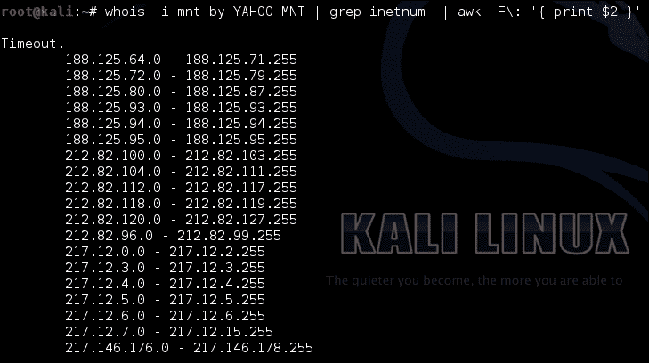
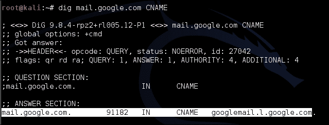
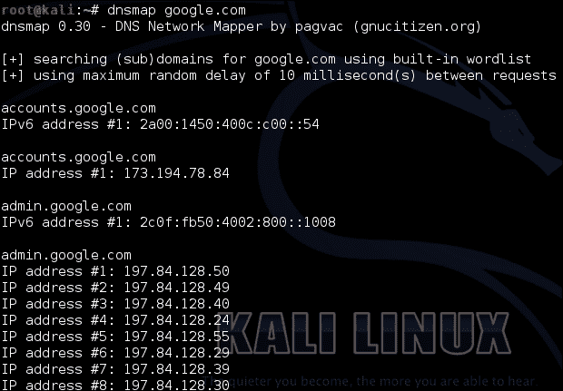

# 第三章 网络侦察

现在你已经掌握了 bash shell 的工作方式，并学会了一些技巧和窍门来有效地使用它，我们可以继续使用 shell 和 Kali Linux 命令行实用程序来收集关于你日常工作中所在网络的信息。

在本章中，我们将看到如何使用诸如 Nmap、Whois、Dig 和其他各种网络信息抓取工具来了解本地网络或外部网络上主机的安全状况。

在下一节中，我们将介绍一个名为`whois`的工具，它可以方便地查询 Whois 服务器，获取有关组织以及它们负责的 IP 地址和域名的信息。

# 询问 Whois 服务器

Whois 服务器保存了关于某些组织负责或严格相关的 IP 地址、域名和其他网络寻址相关信息。当你请求 Whois 记录的信息时，你所做的只是使用一个称为 Whois 的特殊应用协议查询托管在 Whois 服务器上的数据库。协议的细节在*进一步阅读*部分有引用。

在渗透测试期间，你可能会收到一个要处理的 IP 地址列表，或者一个解析为 IP 地址的域名。通常，你可能想知道这个 IP 属于谁，以及同一逻辑网络块上可能托管了什么其他内容；Whois 是一个很好的工具，可以找出这类信息。

从命令行询问 Whois 服务器是通过使用一个名为`whois`的工具来完成的，它随许多 Linux/Unix 发行版一起提供，包括 Kali。

当你使用`whois`工具时，你可以指定许多选项。在这里，我们只会涵盖一些非常有用的选项。对于那些想要了解更多关于`whois`工具的人，请参阅本章*进一步阅读*部分中包含的信息。

Whois 的基本功能是返回与 IP 地址相关的一组属性：这些属性的集合称为**whois**记录。查找使用 IP 地址的记录就像简单地执行以下命令一样：

```
whois [IP address]

```

例如，这是你如何检索 Google 服务器地址的 Whois 记录：

```
whois 74.125.233.83

```

上一个命令将产生以下输出：


当你运行 Whois 查询或查找时，你面前的是一个对象，每个对象都有一堆与之相关的属性，以键值对的形式。每个对象都包含有关负责记录/对象本身的人的信息：这个人被称为维护者。维护者决定在描述相关对象时使用哪些属性。有许多可能的属性，对于那些有兴趣了解完整故事的人，这些属性在*进一步阅读*部分有引用。

除了仅仅查询与 IP 地址相关的 Whois 服务器的信息，你可能还想查找与给定组织相关的某些信息，或者你可能想查找数据库中提到给定值的所有信息，例如，维护者或给定的电子邮件地址。这被称为反向查找属性查找。以下命令用于执行此操作：

```
whois –i [attribute name] [value]

```

例如，考虑查找由 Yahoo!的人员维护的所有 whois 记录。以下命令显示了如何做到这一点：

```
whois –i mnt-by  YAHOO-MNT 

```

### 提示

你可能想要查找一些你喜欢的 IP 地址范围的维护者名称，并在这个例子中使用它们。由于默认情况下`Whois`工具可能依赖于特定于你国家的 Whois 服务器，所以你可能不会得到与以下演示完全相同的结果。

您可能希望从此查询中过滤出 IP 地址。最简单的方法是使用`grep`，如下命令所示：

```
whois –i mnt-by  YAHOO-MNT  | grep inetnum

```

您可能还想仅过滤出 IP 地址以供其他工具使用，例如`Nmap`和`Dig`，我们将在本章的后续部分进行介绍。以下是一个能够执行此操作的小 bash 命令：

```
whois –i mnt-by YAHOO-MNT | grep inetnum | awk –F\: '{ print $2 }'

```

前面的命令应该产生以下输出：



您可以使用以下其他属性来执行反向查询：

+   `-i admin-c [NIC 句柄或人]`

+   `-i person [NIC 句柄或人]`

+   `-i nsserver [域或地址前缀或范围或单个地址]`

+   `-i sub-dom [域]`

+   `-i upd-to [email]`

+   `-i local-as [自治系统号]`

您可以使用其中的一些：请参阅*进一步阅读*部分获取完整列表。

您还可以使用`whois`工具查找与给定域名相关的域名，使用以下命令：

```
whois [domain name]

```

例如，您可以按以下方式使用它：

```
whois google.com

```

或者，您可以使用以下命令：

```
whois –d google.com

```

通过在查找中添加一些`grep`和`awk`魔法，您可以过滤出诸如域名之类的有用信息，如下面的代码所示：

```
whois google.com | grep Server\ Name | awk –F\: '{ print $2 }'
whois –d google.com | grep Server\ Name | awk –F\: '{ print $2 }'

```

我们已经基本介绍了渗透测试人员和安全工程师可能会发现有用的`whois`服务的功能。在下一节中，我们将介绍使用 Dig 执行 DNS 审问。

# 审问 DNS 服务器

DNS 服务器存在是为了提供计算机使用的 IP 地址与人们使用的域名之间的关联。通常，公司和组织使用多个子域，甚至可能为给定的 IP 地址使用多个域名。这自然意味着 DNS 服务器对于渗透测试人员来说是一个丰富的信息来源，可以帮助他们定义组织的公共足迹并绘制攻击面。

## 使用 Dig

我们将在这里使用的第一个命令行工具称为**Dig**。 Dig 本质上是一个 DNS 查找瑞士军刀，可以方便地了解有关给定域或与 IP 地址相关的域的几乎所有信息。使用 Dig，您将模拟-实际执行-浏览器和其他网络应用程序与世界各地的 DNS 服务器交互时使用的查询。有些查询甚至模拟其他 DNS 服务器的行为。让我们看看`dig`是如何工作的，以及在渗透测试期间如何充分利用它。

使用`dig`的最简单方法是提供要查找的域名。以下命令向您展示了如何执行此操作：

```
dig [domain name]

```

例如，您可以尝试使用以下方式的域名`google.com`：

```
dig google.com

```

前面的命令将产生以下输出：


前面截图中突出显示的输出显示了实际返回的结果，即 Google 的 IP 地址。

您还可以通过使用`type`选项让`dig`知道您要查找的记录类型，如下所示：

```
dig [domain name] [type]

```

例如，如果您要查找`google.com`的邮件交换记录（MX 记录），您可以向`dig`提供以下选项：

```
dig google.com MX

```

否则，您可以使用`-t`选项，如下所示：

```
dig google.com –t MX

```

如果命令执行正确，您的输出应该类似于以下截图：


以下是您可以使用`dig`查找的记录类型：

+   `A`：这是地址记录，保存了与查询域关联的 IP。

+   `AAAA`：这是 IP 版本 6 地址记录。

+   `CNAME`：这是规范名称记录，它将返回指定域的域名，该域是规范记录。这就像询问`dig`所提供的域是否是另一个域的昵称，或者更准确地说，给定的域名是否使用另一个域的 IP 地址，`dig`会返回这些域。

+   MX：这是邮件交换记录，列出了与提供的域关联的地址作为消息传输代理。您可以使用此选项查找给定域的邮件域。

+   PTR：这是指针记录，通常用于反向 DNS 查找。

+   SOA：这是权威/区域记录的开始，它将返回与提供的域的主域服务器“授权”相关的记录。

+   AXFR：这是权威区域传输，它要求给定的名称服务器返回与给定域相关的所有记录。现代 DNS 服务器不应远程启用此选项，因为它会泄露大量关于披露漏洞的信息，主要是内部地址披露，并且会使拒绝服务攻击非常有效。

还有一些其他有趣的记录类型。我在这里列出了最常用的记录类型。对于那些想要了解其他记录类型的人，请在本章末尾的*进一步阅读*部分查看 RFC。

以下命令是这些记录类型的一些示例的实际操作：

```
dig google.com AAAA

```

上一个命令应返回以下截图中显示的结果：


否则，您可以查找`mail.google.com`是规范名称的域。使用以下代码完成：

```
dig mail.google.com CNAME

```

上一个命令应产生以下输出：



通常，您可能希望跳过 DNS 查询返回的所有细节，并且只返回您请求的重要数据，即地址。`+short`选项允许您执行此操作。如下所示使用：

```
dig twitter.com +short 

```

此选项允许`dig`在使用管道和 bash for 循环或其他脚本时更易于管理，因为它减少了必须过滤所有其他输出的麻烦。例如，您可以如下使用`dig`与`whois`：

```
for ip in `dig www.google.com +short`; do whois $ip; done

```

Dig 还允许使用`-x`选项进行反向 IP 解析。例如，如果您想找出与给定 IP 关联的域名，您可以使用以下命令：

```
dig –x [IP address]

```

通常，您可能会有一个长列表的 IP 地址或通过其他方式枚举的列表，例如使用`whois`，您可能想找出其中哪些映射到 IP 地址。现在，您可以手动为每个 IP 发出`dig`查询。但是，使用一点 bash 脚本和 dig，您可以非常轻松地自动化整个过程。假设您的 IP 在一个文件中，每个 IP 占据一行。您可以发出以下命令来反向查找它们：

```
for IP in `cat [ip list]`; do echo "[*] $IP -> "`dig –x $IP +short`; done

```

在上一个命令中，`[ip list]`将是包含所述 IP 地址的文件。

这就是`dig`工具和 DNS 协议的基本介绍。我建议您阅读有关 DNS 工作原理的更多信息。接下来的几节将讨论允许您使用暴力破解和其他开源情报收集从 DNS 服务器中恢复记录的工具。通常，渗透测试人员使用这两个工具作为最后的手段，因为它们会暴力破解记录，并且是`dig`的相当激进的替代方案。

## 使用 dnsmap

有时，您可能需要暴力破解域名或子域名，因为这些可能非常难以枚举，对于给定的主机或网络，如果其他选项如`dig`和`whois`没有提供足够的信息供您使用。在这种情况下，诸如`dnsmap`和`dnsenum`之类的工具非常有用。

使用`dnsmap`非常简单。如果您一直在关注我们介绍的其他命令，那么这应该很容易。

以下是`dnsmap`的用法规范：

```
dnsmap [domain] [options]
[domain] := domain name to look up
[options] := [ -w WORDLIST | -r RESULTS-FILE | -c CSV-RESULTS-FILE | -i IP-IGNORE-LIST ]

```

在我们了解这些选项的含义之前，让我们看看`dnsmap`在其最基本的调用中是如何工作的，即没有选项：

```
dnsmap [domain]

```

例如，考虑对`google.com`域进行以下查找：



如果没有参数调用`dnsmap`，它将使用自己内置的单词列表来枚举域。此单词列表可以在`/usr/share/wordlist_TLAs.txt`路径下找到。

以下是`dnsmap`的选项：

+   `-w WORDLIST`：此选项接受一个单词列表作为参数。`dnsmap`将使用此单词列表来枚举可能的子域。

+   `-r RESULTS-FILE`：此选项告诉`dnsmap`在哪里保存其操作的结果。可能会有数百个枚举的 IP 地址和子域，将它们保存在某个地方以供以后处理总是很好的。

+   `-c CSV-RESULTS-FILE`：这与前面的选项相同，只是结果保存在**逗号分隔向量**（**CSV**）文件中，这是数据库的常用格式。

+   `-i IP-IGNORE-LIST`：此选项接受要在查找过程中忽略的 IP 列表，以防它们混淆或向输出引入错误的阳性。

这就是关于`dnsmap`的全部内容：不是一个非常复杂的工具，但它总是能完成任务！

# 在本地网络上枚举目标

在这里，将使用一个名为**网络映射器**（**Nmap**）和另一个名为**Arping**的工具来枚举本地网络上的目标。Nmap 本身是网络评估的事实标准，几乎可以执行 Hping、Fping 和 Arping 的任何操作。在许多情况下，特别是在防火墙评估中，渗透测试人员需要能够微调发送的数据包并对准确收集的数据进行分析。诸如 Hping、Fping 和 Arping 之类的工具非常适合这样做，因为它们允许渗透测试人员为几乎任何所需的网络协议构造任意数据包。

在下一节中，我们将介绍 Arping 工具，并演示如何使用它执行基于 ARP 协议的发现。

## 使用 Arping 进行主机发现

Arping 是一个实用程序，允许您创建 ARP 或 ICMP 数据包并将其发送到本地网络上的任意主机。当然，这是一个枚举活动主机的好方法。它还是一个非常信息驱动的工具，实际上将 ICMP 和 ARP 回复直接打印到屏幕上。

以下示例将演示 Arping 命令的一些简单用法。首先，在我们介绍一些选项和地址模式之前，让我们看看如何进行简单的 ARP ping：

```
arping [IP Address]
arping 192.168.10.1

```

您的输出应该如下所示，除了返回 MAC 地址和可能使用 IP 地址之外：


如果从主机收到回复，这强烈表明所提到的主机实际上存在于网络中。当然，由于 ARP 协议的加密强度不足，这些信息是否严格属实并不保证。您应该记住这一点，关于通过不安全协议传输的所有信息。

您可能希望遍历给定子网上的 IP 列表。使用一些 bash 脚本，您可以按以下方式执行。以下代码将在本书的网站上提供：

```
#!/bin/bash
PREFIX=$1
INTERFACE=$2
for SUBNET in {1..255}
do
  for HOST in {1..255}
  do
    echo "[*] IP : "$PREFIX"."$SUBNET"."$HOST
    arping –c 3 –i $INTERFACE $PREFIX"."$SUBNET"."$HOST 2> /dev/null
  done
done
```

在上一个脚本中，我们使用了`-c`命令来确保只发送三个请求。我们还允许用户指定正在使用的接口，因为通常 Arping 并不真正很好地自主查找接口。此外，必须在此处输入本地 IP 地址的前缀。因此，如果您想使用此脚本，请将其保存在文件中（在本例中，我们将其称为`arpsweep.sh`），并在使用默认以太网接口时调用它如下：

```
. arpsweep 192.168 eht0 

```

否则，如果您使用默认的无线局域网接口，则使用以下命令：

```
. arpsweep 192.168 wlan0

```

Arping 的其他选项如下：

+   `-c COUNT`：这意味着只发送`COUNT`数量的请求。

+   `-d`：查找重复的回复。此选项作为监视工具非常好。它将能够检测到您网络中是否有人伪造了另一个主机的 MAC 地址；攻击者经常这样做以发起中间人攻击。

+   `-i`：这是接口。不要尝试自动找到接口；使用提供的接口。

+   `-p`：为指定的接口打开混杂模式，并允许您指定其他 MAC 地址作为源地址，即 MAC 欺骗。

+   `-r`：显示原始输出，表示每个回复只显示 MAC 和 IP 地址。

至于寻址模式，选项如下：

+   `-s MAC`：这意味着使用`MAC`作为源 MAC 地址。如果您正在枚举的网络或主机选择使用源 MAC 过滤，只向少数主机提供响应，这个选项非常有效。

### 提示

在发送任何数据包之前，尝试运行数据包捕获工具（本书后面会介绍），并尝试了解哪些通信模式是常规的。哪个主机正在使用哪种协议与哪个主机通信，以及频率如何。这可能使您尽可能地利用网络的自然节奏，并可能完全不被 Snort 和其他 IDS/IPS 工具等工具察觉。

+   `-S IP`：此选项指示使用 IP 作为源 IP 地址，即 IP 欺骗。如果基于主机的防火墙只允许有限数量的 IP 地址与其通信，此选项非常适合欺骗其中一个允许的 IP 地址。

+   `-t MAC`：此选项指示使用`MAC`作为目标 MAC 地址。

+   `-T IP`：此选项指示使用`IP`作为目标 IP 地址。

就 ARPing 而言，就是这样了。我建议您尝试`arping`。在微调 ICMP 和 ARP 流量方面，很少有工具能像 ARPing 一样有效。如果您需要了解 ARP 协议的一些背景知识，我在*进一步阅读*部分中包含了一些有趣的链接供您查阅。

## 使用 Nmap 进行目标枚举

ICMP 经常被攻击者在本地网络上滥用，因为它的性质决定了它不是为了提供安全性或考虑任何当前的安全机制而设计的。这经常导致攻击者滥用 ICMP 来获取敏感信息或可以用来确定或推断网络上主机的敏感细节的信息。

首先，让我们使用 ICMP 协议探测主机的响应。Nmap 对 ICMP 探测的使用规范如下命令：

```
nmap –sn {OPTOINS}[host address | domain name | CDIR netmask | IP range]

```

以下是一些示例：

```
nmap –sn –v –-reason 192.168.10.0/24
nmap –sn –v –-reason 192.168.10.0-255

```

`–sn`开关告诉 Nmap 使用 ICMP 协议来确定所述范围内的主机是否可达，并且禁用端口扫描。`-v`表示详细模式，`–-reason`告诉 Nmap 实际打印关于它确定主机的某些结果的信息。上一个命令的输出如下截图所示：


ICMP 协议是一种用于从网络主机请求调试或故障排除信息的网络协议。

其他主机发现选项包括以下内容：

+   `-PE`：告诉 Nmap 使用 ICMP 回显请求，这是在 ping 主机时发送的数据包。

+   `-PP`：告诉 Nmap 使用时间戳请求。响应时间戳请求的主机通常在渗透测试中报告为发现。通常，默认和配置薄弱的加密库使用系统时间来生成加密原语。`-PM`使用 ICMP 网络掩码请求；这些 ICMP 数据包最初是为了让网络工程师查询主机的网络配置信息而实现的。以下命令是一个示例：

```
nmap –v –reason –PM 192.168.10.0/24

```

如果您需要使用其他协议来识别您的目标，Nmap 提供了广泛的功能。以下是其中一些选项：

+   `-PS TCP SYN` **标志扫描**：此选项向主机发送 SYN 数据包，并通过解释响应或缺少响应来确定它们是否实际上在网络上。

+   `-PA TCP ACK` **标志扫描**：此选项告诉 Nmap 向目标发送 TCP ACK 标志，以确定其是否存活并响应数据包。网络上的机器通常会严格遵守 TCP 协议标准，并通过发送带有 REST 数据包的 ACK 标志来响应数据包。

+   `-PO IP` **协议 ping**：此选项通过监听带有 REST 标志的 TCP 数据包来枚举目标主机支持的协议，因为活动主机通常会以这种方式响应对协议号设置任意标识符的无效数据包。

有关 Nmap 中有关主机发现的更多选项，请参阅*进一步阅读*部分中包含的链接。

# 总结

在本章中，我们重点介绍了渗透测试人员在安全评估期间用来获取有关其目标网络的信息的基本方法和工具。

本章首先演示了 Whois 工具，并介绍了可以用来自动化 Whois 工具以及进行非常有益的查找和将 Whois 的输出与其他有用工具集成的技巧和窍门。然后我们转向 DNS 协议，并介绍了 Kali Linux 命令行中可用的工具，可以用来从 DNS 服务器获取关于特定目标的信息。我们特别讨论了`dig`和`dnsmap`。之后，我们介绍了如何利用网络中常用的轻量级寻址协议来枚举本地网络上的目标。目标枚举部分重点演示了如何使用 Arping 和 Nmap 来枚举本地目标。

# 进一步阅读

+   RIPE Whois 数据库查询参考手册在[`www.ripe.net/ripe/docs/ripe-358`](http://www.ripe.net/ripe/docs/ripe-358)

+   dig (1) Linux man 页面在[`linux.die.net/man/1/dig`](http://linux.die.net/man/1/dig)

+   在域名系统（DNS）中存储证书在[`tools.ietf.org/html/rfc4398`](http://tools.ietf.org/html/rfc4398)

+   域名 - 实施和规范在[`www.ietf.org/rfc/rfc1035.txt`](http://www.ietf.org/rfc/rfc1035.txt)

+   Nmap 在线书籍在[`nmap.org/book/toc.html`](http://nmap.org/book/toc.html)
