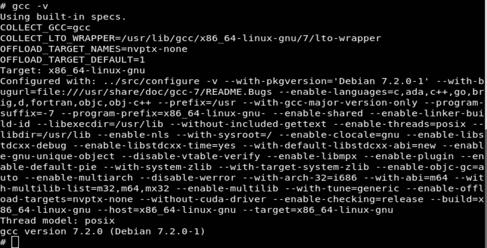
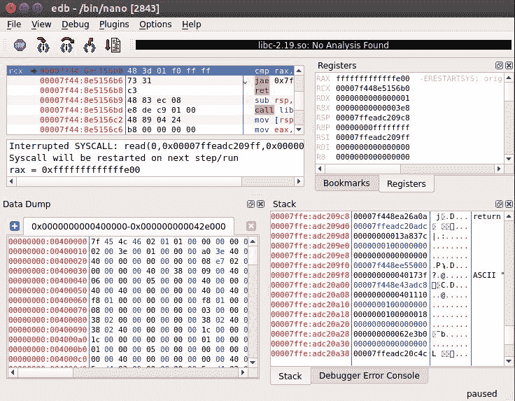
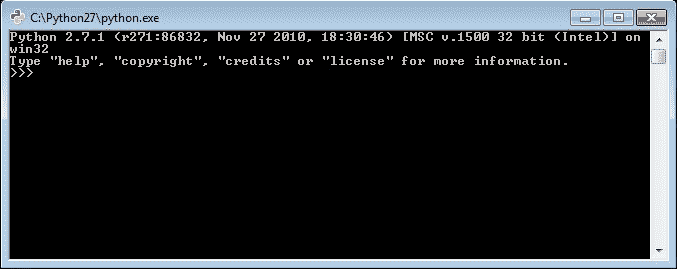
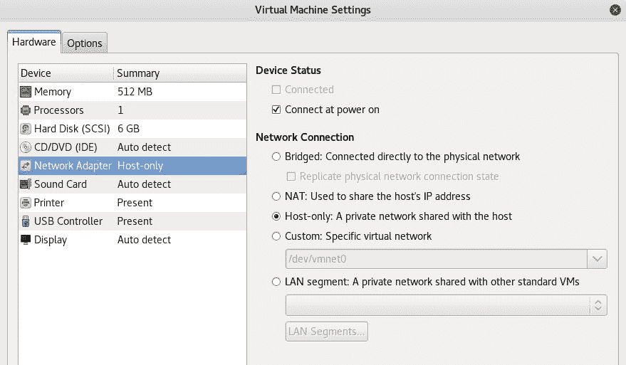

# 实验室设置

在本章中，我们将建立一个隔离的实验室，用于本书的其余部分。我们将看到如何安装诸如 Metasploit 框架之类的工具，以创建 shellcode 和利用开发。我们还将看到如何在 Microsoft Windows 上安装 C 语言 IDE 和编译器，然后再看看 Windows 和 Linux 上的 Python 编程语言。然后，我们将看看安装和熟悉调试器界面

首先，我们需要三台机器。第一台是用于模拟远程攻击的攻击者，将是 Linux 操作系统。在这里，我更喜欢 Kali Linux，因为它包含了我们需要的所有工具，另外我们还将安装一些额外的工具。第二台将是 Ubuntu 14.04 LTS x64，第三台将是 Windows 7 x64。

本章涵盖的主题如下：

+   配置攻击者机器

+   配置 Linux 受害者机器

+   配置 Windows 受害者机器

+   配置 Linux 受害者机器

+   配置 Ubuntu 以进行 x86 汇编

+   网络

您可以使用 VMware、KVM 或 VirtualBox，但请确保选择仅主机网络，因为我们不希望将这些易受攻击的机器暴露给外部世界。

# 配置攻击者机器

如我之前所说，攻击者机器将是我们的主要基地，我更喜欢 Kali Linux，但如果您要使用其他发行版，那么您必须安装以下软件包：

1.  首先，我们需要确保 C 编译器已安装；使用`gcc -v`命令：



1.  如果没有，只需使用`$ sudo apt-get install gcc`（Debian 发行版）或`$ sudo yum install gcc`（Red Hat 发行版）。接受并安装带有其依赖项的`gcc`。

1.  此外，我们将在利用开发中使用 Python 编程语言。Python 默认随大多数 Linux 发行版一起安装，要确保它已安装，只需使用`$ python -V`或`python`。然后，Python 解释器将启动（按*Ctrl* + *D*退出）：


1.  对于文本编辑器，我使用`nano`作为我的 CLI 文本编辑器，`atom`作为我的 GUI 文本编辑器；`nano`也随大多数 Linux 发行版一起安装。

1.  如果要安装`atom`，请转到[`github.com/atom/atom/releases/`](https://github.com/atom/atom/releases/)，您将找到一个测试版和稳定版。然后，根据您的系统下载 Atom 软件包，`.deb`或`.rpm`，并使用`$ sudo dpkg -i package-name.deb`（Debian 发行版）或`$ sudo rpm -i package-name.rpm`（Red Hat 发行版）进行安装。

这就是 Atom 界面的样子：


在创建 shellcode 和利用开发时，我们将使用 Metasploit 框架。要安装 Metasploit，我建议您使用全自动安装程序通过[`github.com/rapid7/metasploit-framework/wiki/Nightly-Installers`](https://github.com/rapid7/metasploit-framework/wiki/Nightly-Installers)。这个脚本将安装 Metasploit 以及它的依赖项（Ruby 和 PostgreSQL）。看下一个例子（在 ARM 上安装 Metasploit，但与 Intel 相同）：

1.  首先，使用`curl`命令获取安装程序：

```
 $ curl https://raw.githubusercontent.com/rapid7/
        metasploit-omnibus/master/config/templates/
        metasploit-framework-wrappers/msfupdate.erb > msfinstall
```

1.  然后，使用`chmod`命令给予适当的权限：

```
 $ chmod 755 msfinstall
```

1.  然后，启动安装程序：

```
 $ ./msfinstall
```

1.  现在它将开始下载 Metasploit 框架以及它的依赖项。

1.  要为 Metasploit 框架创建数据库，只需使用`msfconsole`并按照说明操作：

```
 $ msfconsole
```

1.  然后，它将设置一个新的数据库，Metasploit 框架开始：


1.  由于我们将使用汇编编程语言，让我们看看汇编器（`nasm`）和链接器（`ld`）。

1.  首先，我们需要使用`$ sudo apt-get install nasm`来安装`nasm`（Debian 发行版）。对于 Red Hat 发行版，根据 NASM 的网站，您首先需要将此存储库添加到您的`/etc/yum/yum.repos.d`中作为`nasm.repo`：

```
[nasm]
name=The Netwide Assembler
baseurl=http://www.nasm.us/pub/nasm/stable/linux/
enabled=1
gpgcheck=0

[nasm-testing]
name=The Netwide Assembler (release candidate builds)
baseurl=http://www.nasm.us/pub/nasm/testing/linux/
enabled=0
gpgcheck=0

[nasm-snapshot]
name=The Netwide Assembler (daily snapshot builds)
baseurl=http://www.nasm.us/pub/nasm/snapshots/latest/linux/
enabled=0
gpgcheck=0
```

1.  然后，使用`$ sudo yum update && sudo yum install nasm`来更新和安装`nasm`，以及`$ nasm -v`来获取 NASM 的版本：


1.  使用命令`$ ld -v`来获取链接器的版本：


# 配置 Linux 受害机器

这台机器将是 Ubuntu 14.04 x64。您可以从[`releases.ubuntu.com/14.04/`](http://releases.ubuntu.com/14.04/)下载它。此外，我们必须遵循先前的指示来安装`gcc`，Python 和`nasm`。

现在，让我们安装一个非常友好的 GUI，名为 edb-debugger。您可以按照此页面[`github.com/eteran/edb-debugger/wiki/Compiling-(Ubuntu)`](https://github.com/eteran/edb-debugger/wiki/Compiling-(Ubuntu))或按照下一个指示。

首先，使用以下命令安装依赖项：

```
$ sudo apt-get install cmake build-essential libboost-dev libqt5xmlpatterns5-dev qtbase5-dev qt5-default libgraphviz-dev libqt5svg5-dev git
```

然后，克隆并编译 Capstone 3.0.4，如下所示：

```
$ git clone --depth=50 --branch=3.0.4 https://github.com/aquynh/capstone.git
$ pushd capstone
$ ./make.sh
$ sudo ./make.sh install
$ popd
```

然后，克隆并编译 edb-debugger，如下所示：

```
$ git clone --recursive https://github.com/eteran/edb-debugger.git
$ cd edb-debugger
$ mkdir build
$ cd build
$ cmake ..
$ make
```

然后，使用`$ sudo ./edb`命令启动 edb-debugger，打开以下窗口：



正如我们所看到的，edb-debugger 有以下四个窗口：

+   反汇编窗口将机器语言转换为汇编语言

+   寄存器窗口包含所有寄存器的当前内容

+   数据转储窗口包含当前进程的内存转储

+   堆栈窗口包含当前进程的堆栈内容

现在到最后一步。为了学习目的，需要禁用**地址空间布局随机化**（**ASLR**）。这是 Linux 中的一种安全机制，我们稍后会谈论它。

只需执行`$ echo 0 | sudo tee /proc/sys/kernel/randomize_va_space`命令。

此外，我们将在使用`gcc`进行编译时禁用堆栈保护程序和 NX，使用：

```
$ gcc -fno-stack-protector -z execstack
```

# 配置 Windows 受害机器

在这里，我们将配置 Windows 机器作为受害机器，这是 Windows 7 x64。

首先，我们需要安装 C 编译器和 IDE，我建议使用*Code::Blocks*，要安装它，从[`www.codeblocks.org/downloads/binaries.`](http://www.codeblocks.org/downloads/binaries)下载二进制文件。在这里，我将安装`codeblocks-16.01mingw-setup.exe`（最新版本）。下载并安装`mingw`版本。

在首次启动*Code::Blocks*时，将弹出一个窗口以配置编译器。选择 GNU GCC Compiler，点击 Set as default，然后点击 OK：


然后，IDE 界面将弹出：


现在我们有了 C 编译器和 IDE。现在，让我们转向安装调试器。

首先，我们需要 x86 的*Immunity Debugger*；从[`debugger.immunityinc.com/ID_register.py`](https://debugger.immunityinc.com/ID_register.py)下载 Immunity。填写这个表格，下载，然后使用默认设置安装它，它会要求您确认安装 Python。之后，我们需要安装一个名为`mona`的调试器插件，由 Corelan 团队创建，[`www.corelan.be`](https://www.corelan.be)。这是一个很棒的插件，将帮助我们进行利用开发。从他们的 GitHub 存储库[`github.com/corelan/mona`](https://github.com/corelan/mona)下载`mona.py`文件，然后将其复制到`C:\Program Files (x86)\Immunity Inc\Immunity Debugger\Immunit\PyCommands`：


这就是 Immunity Debugger 的外观，它由四个主要窗口组成，正如在 edb-debugger 中所解释的那样。

此外，我们现在有 Python，要确认，只需导航到`C:\Python27\`。然后，点击 Python，Python 解释器将弹出：



现在，让我们安装 x64dbg。这也是 Windows x86 和 x64 的调试器，但是当涉及到 x86 Windows 时，没有比 Immunity Debugger 更好的了。

转到[`sourceforge.net/projects/x64dbg/files/snapshots/`](https://sourceforge.net/projects/x64dbg/files/snapshots/)，然后下载最新版本。解压缩然后导航到`/release`以启动**x96dbg**：


然后，点击 x64dbg：


现在我们正在看 x64dbg 界面，它也包含四个主要窗口，正如在 edb-debugger 中所解释的那样：


# 为汇编 x86 配置 Ubuntu

这对于本书来说并不是强制性的，但如果您想尝试 x86 汇编，它已经包含在内。使用的机器将是 Ubuntu 14.04 x86，您可以从[`releases.ubuntu.com/14.04/`](http://releases.ubuntu.com/14.04/)下载。

我们必须遵循先前的说明来安装 NASM、GCC、文本编辑器，我将使用 GDB 作为我的调试器。

# 网络

由于我们将在受害者机器上运行易受攻击的应用程序进行利用研究和注入 shellcode，因此在配置每台机器后，我们必须建立一个安全的网络。这是通过使用主机模式来确保所有机器连接在一起，但它们仍然是脱机的，不会暴露在外部世界中。

如果您使用的是 VirtualBox，则转到首选项|网络并设置主机模式网络：


然后，设置一个与外部 IP 不冲突的 IP 范围，例如：

+   **IP 地址**：`192.168.100.1`

+   **子网掩码**：`255.255.255.0`

然后，您可以从 DHCP 服务器选项卡激活 DHCP 服务器。

您应该在您的`ifconfig`中看到它：

```
$ ifconfig vboxnet0
```

然后，在您的客户机适配器上激活此网络（例如，`vboxnet0`）：


如果您使用的是 VMware Workstation，请转到编辑|虚拟网络编辑器：


此外，您可以确保主机模式网络已启动：

```
$ ifconfig vmnet1
```

然后，从客户机设置中，转到网络适配器，并选择主机模式：与主机共享的私有网络：



# 总结

在本章中，我们安装了三个主要的操作系统：一个用于模拟攻击者机器以尝试远程利用，第二个是 Ubuntu x64，第三个是 Windows 7，最后两个操作系统是受害者。另外，还有一台额外的机器用于尝试汇编 x86。

此外，我们还禁用了 Linux 中的一些安全机制，仅供学习目的，然后我们进行了网络配置。

在下一章中，让我们迈出一大步，学习汇编，这将使我们能够编写自己的 shellcode，并让您真正了解计算机如何执行每个命令。
