# Linux 中的汇编语言

在本章中，我们将讨论在 Linux 中的汇编语言编程。我们将学习如何构建我们自己的代码。汇编语言是一种低级编程语言。低级编程语言是机器相关的编程，是计算机理解的最简单形式。在汇编中，你将处理计算机架构组件，如寄存器和堆栈，不像大多数高级编程语言，如 Python 或 Java。此外，汇编不是一种可移植的语言，这意味着每种汇编编程语言都特定于一种硬件或一种计算机架构；例如，英特尔有自己特定的汇编语言。我们学习汇编不是为了构建复杂的软件，而是为了构建我们自己定制的 shellcode，所以我们将使它非常简单和简单。

我保证，完成本章后，你将以不同的方式看待每个程序和进程，并且你将能够理解计算机是如何真正执行你的指令的。让我们开始吧！

# 汇编语言代码结构

在这里，我们不会讨论语言结构，而是代码结构。你还记得内存布局吗？

让我们再来看一下：


我们将把我们的**可执行代码**放在`.text`部分，我们的**变量**放在`.data`部分：


让我们也更仔细地看一下堆栈。堆栈是**LIFO**，这意味着**后进先出**，所以它不是随机访问，而是使用推入和弹出操作。推入是将某物推入堆栈顶部。让我们看一个例子。假设我们有一个堆栈，它只包含**0x1234**：

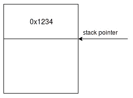

现在，让我们使用汇编`push 0x5678`将某物推入堆栈。这条指令将值**0x5678**推入堆栈，并将**堆栈指针**指向**0x5678**：


现在，如果我们想要从堆栈中取出数据，我们使用`pop`指令，它将提取推入堆栈的最后一个元素。因此，以相同的堆栈布局，让我们使用`pop rax`来提取最后一个元素，它将提取值**0x5678**并将其移动到**RAX**寄存器：

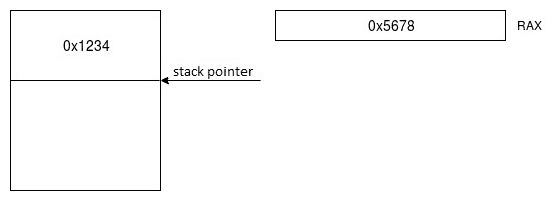

这很简单！

我们将如何在 Linux x64 上编写汇编代码？实际上，这很简单；你还记得系统调用吗？这就是我们通过调用系统命令来执行我们想要的方式。例如，如果我想要退出一个程序，那么我必须使用`exit`系统调用。

首先，这个文件`/usr/include/x86_64-linux-gnu/asm/unistd_64.h`包含了 Linux x64 的所有系统调用。让我们搜索`exit`系统调用：

```
$ cat /usr/include/x86_64-linux-gnu/asm/unistd_64.h | grep exit
#define __NR_exit 60
#define __NR_exit_group 231
```

`exit`系统调用有一个系统调用号`60`。

现在，让我们来看一下它的参数：

```
$ man 2 exit 
```

以下截图显示了前面命令的输出：


只有一个参数，即`status`，它具有`int`数据类型来定义退出状态，例如零状态表示没有错误：

```
void _exit(int status);
```

现在，让我们看看如何使用寄存器来调用 Linux x64 系统调用：


我们只是将**系统调用号**放入**RAX**，然后将**第一个参数**放入**RDI**，**第二个参数**放入**RSI**，依此类推，就像前面的截图所示。

让我们看一看我们将如何调用`exit`系统调用：

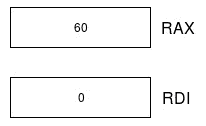

我们只是将**60**，即`exit`系统调用号放入**RAX**，然后将**0**放入**RDI**，这就是退出状态；是的，就是这么简单！

让我们更深入地看一下汇编代码：

```
mov rax, 60
mov rdi, 0
```

第一行告诉处理器将值`60`移动到`rax`中，第二行告诉处理器将值`0`移动到`rdi`中。

正如你所看到的，一条指令的一般结构是`{操作} {目的地}，{来源}`。

# 数据类型

数据类型在汇编中很重要。我们可以用它们来定义变量，或者当我们想要对寄存器或内存的一小部分执行任何操作时使用它们。

以下表格解释了汇编中基于长度的数据类型：

| **名称** | **指令** | **字节** | **位** |
| --- | --- | --- | --- |
| 字节 | `db` | 1 | 8 |
| 字 | `dw` | 2 | 16 |
| 双字 | `dd` | 4 | 32 |
| 四字 | `dq` | 8 | 64 |

为了充分理解，我们将在汇编中构建一个 hello world 程序。

# Hello world

好的，让我们开始深入了解。我们将构建一个 hello world，这无疑是任何程序员的基本构建块。

首先，我们需要了解我们真正需要的是一个系统调用来在屏幕上打印`hello world`。为此，让我们搜索`write`系统调用：

```
$ cat /usr/include/x86_64-linux-gnu/asm/unistd_64.h | grep write 
#define __NR_write 1
#define __NR_pwrite64 18
#define __NR_writev 20
#define __NR_pwritev 296
#define __NR_process_vm_writev 311
#define __NR_pwritev2 328
```

我们可以看到`write`系统调用的编号是`1`；现在让我们看看它的参数：

```
$ man 2 write
```

以下截图显示了前面命令的输出：


`write`系统调用有三个参数；第一个是文件描述符：

```
ssize_t write(int fd, const void *buf, size_t count);
```

文件描述符有三种模式：

| **整数值** | **名称** | **`stdio.h`的别名** |
| --- | --- | --- |
| `0` | 标准输入 | `stdin` |
| `1` | 标准输出 | `stdout` |
| `2` | 标准错误 | `stderr` |

因为我们要在屏幕上打印`hello world`，所以我们将选择标准输出`1`，作为第二个参数，它是指向我们要打印的字符串的指针；第三个参数是字符串的计数，包括空格。

以下图表解释了寄存器中将要包含的内容：

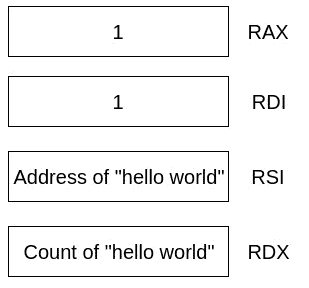

现在，让我们跳到完整的代码：

```
global _start

section .text

_start:

    mov rax, 1
    mov rdi, 1
    mov rsi, hello_world
    mov rdx, length
    syscall

section .data

    hello_world: db 'hello world',0xa
    length: equ $-hello_world
```

在`.data`部分，其中包含所有变量，代码中的第一个变量是`hello_world`变量，数据类型为字节（`db`），它包含一个`hello world`字符串以及`0xa`，表示换行，就像 C 语言中的`\n`一样。第二个变量是`length`，它包含`hello_world`字符串的长度，使用`equ`表示相等，`$-`表示评估当前行。

在`.text`部分，正如我们之前解释的，我们将`1`移动到`rax`，表示`write`系统调用编号，然后我们将`1`移动到`rdi`，表示文件描述符设置为标准输出，然后我们将`hello_world`字符串的地址移动到`rsi`，将`hello_world`字符串的长度移动到`rdx`，最后，我们调用`syscall`，表示执行。

现在，让我们汇编和链接目标代码，如下所示：

```
$ nasm -felf64 hello-world.nasm -o hello-world.o
$ ld hello-world.o -o hello-world
$ ./hello-world 
```

前面命令的输出如下：


它打印了`hello world`字符串，但因为程序不知道接下来要去哪里，所以以`Segmentation fault`退出。我们可以通过添加`exit`系统调用来修复它：

```
global _start

section .text

_start:

    mov rax, 1
    mov rdi, 1
    mov rsi, hello_world
    mov rdx, length
    syscall

    mov rax, 60
    mov rdi, 1
    syscall

section .data

    hello_world: db 'hello world',0xa
    length: equ $-hello_world
```

我们通过将`60`移动到`rax`来添加了`exit`系统调用，然后我们将`1`移动到`rdi`，表示退出状态，最后我们调用`syscall`来执行`exit`系统调用：


让我们汇编链接并再次尝试：


现在它正常退出了；让我们也使用`echo $?`确认退出状态：


退出状态是`1`，正如我们选择的！

# 堆栈

正如我们在前一章中讨论的，**堆栈**是为每个运行的应用程序分配的空间，用于存储变量和数据。堆栈支持两种操作（推入和弹出）；**推入**操作用于将元素推入堆栈，这将导致堆栈指针移动到较低的内存地址（堆栈从高内存向低内存增长），并指向堆栈顶部，而**弹出**则取出堆栈顶部的第一个元素。

让我们看一个简单的例子：

```
global _start

section .text

_start:

    mov rdx,0x1234
    push rdx
    push 0x5678
    pop rdi
    pop rsi

    mov rax, 60
    mov rdi, 0
    syscall
section .data
```

这段代码非常简单；让我们编译和链接它：

```
$ nasm -felf64 stack.nasm -o stack.o
$ ld stack.o -o stack
```

然后，我将在调试器中运行应用程序（调试器将在下一章中解释），只是为了向您展示堆栈的真正工作原理。

首先，在运行程序之前，所有寄存器都是空的，除了 RSP 寄存器，它现在指向堆栈顶部`00007ffdb3f53950`：

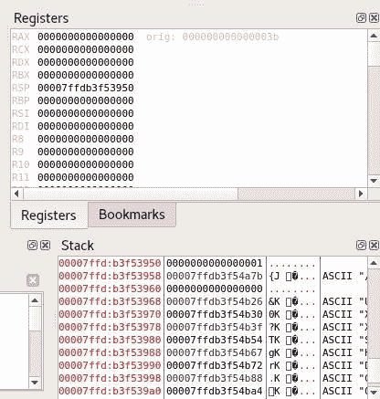

然后，执行第一条指令，将`0x1234`移动到`rdx`：


正如我们所看到的，`rdx` 寄存器现在保存着 `0x1234`，而堆栈中还没有发生任何变化。第二条指令将 `rdx` 的值推送到堆栈中，如下所示：


看一下堆栈部分；它移动到了较低的地址（从 `50` 到 `48`），现在包含 `0x1234`。第三条指令是直接将 `0x5678` 推送到堆栈中：


第四条指令将把堆栈中的最后一个元素提取到 `rdi` 中：

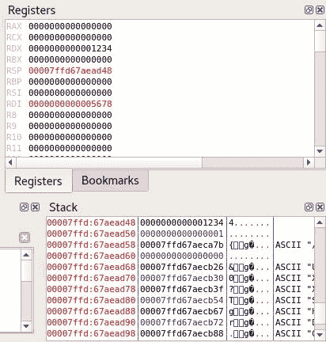

你可以看到，堆栈中不再包含 `0x5678`，而是移动到了 `rdi`。最后一条指令是将堆栈中的最后一个元素提取到 `rsi` 中：

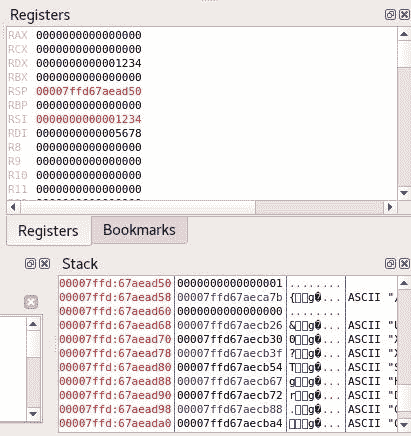

现在堆栈恢复正常，`0x1234` 移动到了 `rsi`。

到目前为止，我们已经介绍了如何构建一个 hello world 程序以及堆栈中的推送/弹出操作的两个基本示例，我们看到了一些基本指令，比如 `mov`、`push`、`pop`，还有更多内容等待我们去学习。现在，你可能会想为什么我没有解释这些指令，而是先带你看了这些示例。我的策略是带你进入下一节；在这里，我们将学习汇编语言所需的所有基本指令。

# 数据操作

**数据操作** 是在汇编中移动数据，这是一个非常重要的主题，因为我们的大部分操作都将是移动数据来执行指令，所以我们必须真正理解如何使用它们，比如 `mov` 指令，以及如何在寄存器之间和寄存器与内存之间移动数据，复制地址到寄存器，以及如何使用 `xchg` 指令在两个寄存器或寄存器和内存之间交换内容，然后如何使用 `lea` 指令将源的有效地址加载到目的地。

# mov 指令

`mov` 指令是在 Linux 中汇编中使用最重要的指令，我们在所有之前的示例中都使用了它。

`mov` 指令用于在寄存器之间、寄存器和内存之间移动数据。

让我们看一些例子。首先，让我们从直接将数据移动到寄存器开始：

```
global _start

section .text

_start:

    mov rax, 0x1234
    mov rbx, 0x56789

    mov rax, 60
    mov rdi, 0
    syscall

section .data
```

这段代码将会把 `0x1234` 复制到 `rax`，并且把 `0x56789` 复制到 `rbx`：


让我们进一步添加一些在寄存器之间移动数据到之前的示例中：

```
global _start

section .text

_start:

    mov rax, 0x1234
    mov rbx, 0x56789

    mov rdi, rax
    mov rsi, rbx

    mov rax, 60
    mov rdi, 0
    syscall

section .data
```

我们刚刚添加的内容将 `rax` 和 `rbx` 的内容分别移动到 `rdi` 和 `rsi`：


让我们尝试在寄存器和内存之间移动数据：

```
global _start

section .text

_start:

    mov al, [mem1]
    mov bx, [mem2]
    mov ecx, [mem3]
    mov rdx, [mem4]

    mov rax, 60
    mov rdi, 0
    syscall

section .data
    mem1: db 0x12
    mem2: dw 0x1234
    mem3: dd 0x12345678
    mem4: dq 0x1234567891234567
```

在 `mov al, [mem1]` 中，方括号表示将 `mem1` 的内容移动到 `al`。如果我们使用 `mov al, mem1` 而不带方括号，它将会把 `mem1` 的指针移动到 `al`。

在第一行，我们将 `0x12` 移动到 RAX 寄存器中，因为我们只移动了 8 位，所以我们使用了 AL（RAX 寄存器的低部分，可以容纳 8 位），因为我们不需要使用所有 64 位。还要注意的是，我们将 `mem1` 内存部分定义为 `db`，即字节，或者它可以容纳 8 位。

看一下下面的表格：

| **64 位寄存器** | **32 位寄存器** | **16 位寄存器** | **8 位寄存器** |
| --- | --- | --- | --- |
| RAX | EAX | AX | AH, AL |
| RBX | EBX | BX | BH, BL |
| RCX | ECX | CX | CH, CL |
| RDX | EDX | DX | DH, DL |
| RSI | ESI | SI | SIL |
| RDI | EDI | DI | DIL |
| RSP | ESP | SP | SPL |
| RBP | EBP | BP | BPL |
| R8 | R8D | R8W | R8B |
| R9 | R9D | R9W | R9B |
| R10 | R10D | R10W | R10B |
| R11 | R11D | R11W | R11B |
| R12 | R12D | R12W | R12B |
| R13 | R13D | R13W | R13B |
| R14 | R14D | R14W | R14B |
| R15 | R15D | R15W | R15B |

然后，我们将定义为 `dw` 的值 `0x1234` 移动到 `rbx` 寄存器，然后我们在 BX 中移动了 2 个字节（16 位），它可以容纳 16 位。

然后，我们将定义为 `dd` 的值 `0x12345678` 移动到 RCX 寄存器，它是 4 个字节（32 位），移动到 ECX。

最后，我们将定义为 `dq` 的值 `0x1234567891234567` 移动到 RDX 寄存器，它是 8 个字节（64 位），所以我们将它移动到 RDX 中：

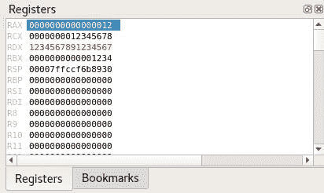

在执行后，寄存器中的情况如下。

现在，让我们谈谈从寄存器到内存的数据移动。看看下面的代码：

```
global _start

section .text

_start:

    mov al, 0x34
    mov bx, 0x5678
    mov byte [mem1], al
    mov word [mem2], bx

    mov rax, 60
    mov rdi, 0
    syscall

section .data

    mem1: db 0x12
    mem2: dw 0x1234
    mem3: dd 0x12345678
    mem4: dq 0x1234567891234567
```

在第一和第二条指令中，我们直接将值移动到寄存器中，在第三条指令中，我们将寄存器 RAX（AL）的内容移动到`mem1`中，并用字节指定了长度。然后，在第四条指令中，我们将寄存器 RBX（RX）的内容移动到`mem2`中，并用字指定了长度。

这是在移动任何值之前`mem1`和`mem2`的内容：


下一张截图是在将值移动到`mem1`和`mem2`之后的情况：


# 数据交换

**数据交换**也很容易；它用于交换两个寄存器或寄存器和内存之间的内容，使用`xchg`指令：

```
global _start

section .text

_start:

    mov rax, 0x1234
    mov rbx, 0x5678
    xchg rax, rbx
    mov rcx, 0x9876
    xchg rcx,[mem1]

```

```
    mov rax, 60
    mov rdi, 0
    syscall

section .data
    mem1: dw 0x1234
```

在前面的代码中，我们将`0x1234`移动到`rax`寄存器，然后将`0x5678`移动到`rbx`寄存器：


然后，在第三条指令中，我们使用`xchg`指令交换了`rax`和`rbx`的内容：


然后，我们将`0x9876`推送到`rcx`寄存器，`mem1`保存`0x1234`：

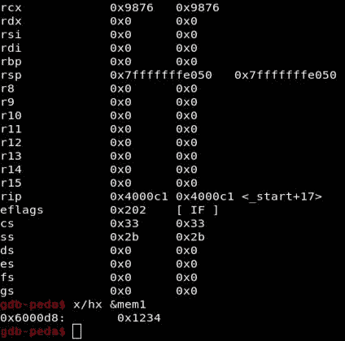

现在，交换`rcx`和`mem1`的内容：


# 加载有效地址

**加载有效地址**（**lea**）指令将源的地址加载到目的地：

```
global _start

section .text

_start:

    lea rax, [mem1]
    lea rbx, [rax]

    mov rax, 60
    mov rdi, 0
    syscall

section .data
    mem1: dw 0x1234
```

首先，我们将`mem1`的地址移动到`rax`，然后将`rax`中的地址移动到`rbx`：


现在两者都指向`mem1`，其中包含`0x1234`。

# 算术运算

现在，我们将讨论算术运算（加法和减法）。让我们开始：

```
global _start

section .text

_start:

    mov rax,0x1
    add rax,0x2

    mov rbx,0x3
    add bl, byte [mem1]

    mov rcx, 0x9
    sub rcx, 0x1

    mov dl,0x5
    sub byte [mem2], dl

    mov rax, 60
    mov rdi, 0
    syscall

section .data
    mem1: db 0x2
    mem2: db 0x9
```

首先，我们将`0x1`移动到`rax`寄存器，然后加上`0x2`，结果将存储在`rax`寄存器中。

然后，我们将`0x3`移动到`rbx`寄存器，并将包含`0x2`的`mem1`的内容与`rbx`的内容相加，结果将存储在`rbx`中。

然后，我们将`0x9`移动到`rcx`寄存器，然后减去`0x1`，结果将存储在`rcx`中。

然后，我们将`0x5`移动到`rdx`寄存器，从`mem2`中减去`rdx`的内容，并将结果存储在`mem2`的内存部分中：


减法后`mem2`的内容如下：


现在，让我们谈谈带进位加法和借位减法：

```
global _start

section .text

_start:

    mov rax, 0x5
    stc
    adc rax, 0x1

    mov rbx, 0x5
    stc
    sbb rbx, 0x1

    mov rax, 60
    mov rdi, 0
    syscall

section .data
```

首先，我们将`0x5`移动到`rax`寄存器，然后设置进位标志，它将携带`1`。之后，我们将`rax`寄存器的内容加上`0x1`，并加到进位标志中，得到`0x7` *(5+1+1)*。

然后，我们将`0x5`移动到`rbx`寄存器并设置进位标志，然后从`rbx`寄存器中减去`0x1`，并且在进位标志中再减去`1`；这将给我们`0x3` *(5-1-1)*：


现在，这里的最后部分是增量和减量操作：

```
global _start

section .text

_start:

    mov rax, 0x5
    inc rax
    inc rax

    mov rbx, 0x6
    dec rbx
    dec rbx

    mov rax, 60
    mov rdi, 0
    syscall

section .data
```

首先，我们将`0x5`移动到`rax`寄存器，将`rax`的值增加`1`，然后再次增加，得到`0x7`。

然后，我们将`0x6`移动到`rbx`寄存器，将`rbx`的值减去`1`，然后再次减去，得到`0x4`：


# 循环

现在，我们将讨论汇编中的循环。就像在任何其他高级语言（Python、Java 等）中一样，我们可以使用循环来使用 RCX 寄存器作为计数器进行迭代，然后使用`loop`关键字。让我们看下面的例子：

```
global _start

section .text

_start:

    mov rcx,0x5
    mov rbx,0x1

increment:

    inc rbx
    loop increment

    mov rax, 60
    mov rdi, 0
    syscall

section .data
```

在前面的代码中，我们想要增加 RAX 的内容五次，所以我们将`0x5`移动到`rcx`寄存器，然后将`0x1`移动到`rbx`寄存器：


然后，我们将`increment`标签添加为我们想要重复的块的开始指示，然后我们添加了增量指令到`rbx`寄存器的内容：


然后，我们调用`loop increment`，它将递减 RCX 寄存器的内容，然后再次从`increment`标签开始：


现在它将一直执行，直到 RCX 寄存器为零，然后流程将离开该循环：


现在，如果程序在 RCX 上重写了一个值会怎样？让我们看一个例子：

```
global _start

section .text

_start:

    mov rcx, 0x5

print:

    mov rax, 1
    mov rdi, 1
    mov rsi, hello
    mov rdx, length
    syscall

loop print

    mov rax, 60
    mov rdi, 0
    syscall

section .data
    hello: db 'Hello There!',0xa
    length: equ $-hello
```

执行此代码后，程序将陷入无限循环，如果我们仔细观察，我们将看到代码在执行系统调用后覆盖了 RCX 寄存器中的值：


因此，我们必须找到一种方法来保存 RCX 寄存器，比如将其保存在堆栈中。首先，在执行系统调用之前，我们将当前值推送到堆栈中，然后在执行系统调用后，我们再次用我们的值覆盖 RCX 中的任何内容，然后递减该值并再次将其推送到堆栈中以保存它：

```
global _start

section .text

_start:

    mov rcx, 0x5

increment:

    push rcx
    mov rax, 1
    mov rdi, 1
    mov rsi, hello
    mov rdx, length
    syscall
    pop rcx

loop increment

    mov rax, 60
    mov rdi, 0
    syscall

section .data
    hello: db 'Hello There!',0xa
    length: equ $-hello
```

通过这种方式，我们保存了 RCX 寄存器中的值，然后再次将其弹出到 RCX 中以使用它。请看上述代码中的`pop rcx`指令。RCX 再次回到`0x5`，正如预期的那样：


# 控制流程

在这里，我们将讨论控制执行流程。执行流程的正常流程是执行步骤 1，然后 2，依此类推，直到代码正常退出。如果我们决定在步骤 2 中发生某些事情，然后跳过 3，直接执行 4，或者我们只是想跳过步骤 3 而不等待发生某些事情，有两种跳转类型：

+   无条件改变流程

+   根据标志的更改改变流程

现在，让我们从无条件跳转开始：

```
global _start

section .text

_start:

jmp exit_ten

    mov rax, 60
    mov rdi, 12
    syscall

    mov rax, 60
    mov rdi, 0
    syscall

exit_ten:

    mov rax, 60
    mov rdi, 10
    syscall

    mov rax, 60
    mov rdi, 1
    syscall

section .data
```

先前的代码包含四个`exit`系统调用，但具有不同的退出状态（`12`，`0`，`10`，`1`），并且我们从`jmp exit_ten`开始，这意味着跳转到`exit_ten`位置，它将跳转到代码的这一部分：

```
    mov rax, 60
    mov rdi, 10
    syscall
```

执行并正常退出，退出状态为`10`。请注意，下一部分将永远不会被执行：

```
    mov rax, 60
    mov rdi, 12
    syscall

    mov rax, 60
    mov rdi, 0
    syscall
```

让我们确认一下：

```
$ nasm -felf64 jmp-un.nasm -o jmp-un.o
$ ld jmp-un.o -o jmp-un
$ ./jmp-un
$ echo $?
```

先前命令的输出可以在以下截图中看到：


正如我们所看到的，代码以退出状态`10`退出。

让我们看另一个例子：

```
global _start

section .text

_start:

    mov rax, 1
    mov rdi, 1
    mov rsi, hello_one
    mov rdx, length_one
    syscall

jmp print_three

    mov rax, 1
    mov rdi, 1
    mov rsi, hello_two
    mov rdx, length_two
    syscall

print_three:
    mov rax, 1
    mov rdi, 1
    mov rsi, hello_three
    mov rdx, length_three
    syscall

    mov rax, 60
    mov rdi, 11
    syscall

section .data

    hello_one: db 'hello one',0xa
    length_one: equ $-hello_one

    hello_two: db 'hello two',0xa
    length_two: equ $-hello_two

    hello_three: db 'hello three',0xa
    length_three: equ $-hello_three
```

在先前的代码中，它开始打印`hello_one`。然后，它将到达`jmp print_three`，执行流程将更改到`print_three`位置，并开始打印`hello_three`。以下部分将永远不会被执行：

```
    mov rax, 1
    mov rdi, 1
    mov rsi, hello_two
    mov rdx, length_two
    syscall
```

让我们确认一下：

```
$ nasm -felf64 jmp_hello.nasm -o jmp_hello.o
$ ld jmp_hello.o -o jmp_hello
$ ./jmp_hello
```

先前命令的输出可以在以下截图中看到：


现在，让我们继续讨论带条件的跳转，老实说，我们无法在这里涵盖所有条件，因为列表非常长，但我们将看到一些例子，以便您理解概念。

`jb`指令表示如果**进位标志**（**CF**）被设置（CF 等于`1`）则执行跳转。

正如我们之前所说，我们可以使用`stc`指令手动设置 CF。

让我们修改先前的例子，但使用`jb`指令，如下所示：

```
global _start

section .text

_start:

    mov rax, 1
    mov rdi, 1
    mov rsi, hello_one
    mov rdx, length_one
    syscall

    stc

jb print_three

    mov rax, 1
    mov rdi, 1
    mov rsi, hello_two
    mov rdx, length_two
    syscall

print_three:
    mov rax, 1
    mov rdi, 1
    mov rsi, hello_three
    mov rdx, length_three
    syscall

    mov rax, 60
    mov rdi, 11
    syscall

section .data

    hello_one: db 'hello one',0xa
    length_one: equ $-hello_one

    hello_two: db 'hello two',0xa
    length_two: equ $-hello_two

    hello_three: db 'hello three',0xa
    length_three: equ $-hello_three
```

如您所见，我们执行了`stc`来设置进位标志（即 CF 等于`1`），然后我们使用`jb`指令进行测试，这意味着如果 CF 等于`1`，则跳转到`print_three`。

以下是另一个例子：

```
global _start

section .text

_start:

    mov al, 0xaa
    add al, 0xaa

jb exit_ten

    mov rax, 60
    mov rdi, 0
    syscall

exit_ten:

    mov rax, 60
    mov rdi, 10
    syscall

section .data
```

在先前的例子中，加法操作将设置进位标志，然后我们使用`jb`指令进行测试；如果 CF 等于`1`，则跳转到`exit_ten`。

现在，让我们看一个不同的方法，即如果小于或等于（`jbe`）指令，这意味着 CF 等于`1`或**零标志（ZF）**等于`1`。先前的例子也可以工作，但让我们尝试其他方法来设置 ZF 等于`1`：

```
global _start

section .text

_start:

    mov al, 0x1
    sub al, 0x1

jbe exit_ten

    mov rax, 60
    mov rdi, 0
    syscall

exit_ten:

    mov rax, 60
    mov rdi, 10
    syscall

section .data
```

在先前的代码中，减法操作将设置 ZF，然后我们将使用`jbe`指令来测试 CF 等于`1`或 ZF 等于`1`；如果为真，则会跳转执行`exit_ten`。

另一种类型是如果不是符号（`jns`），这意味着 SF 等于`0`：

```
global _start

section .text

_start:

mov al, 0x1
sub al, 0x3

jns exit_ten

    mov rax, 60
    mov rdi, 0
    syscall

exit_ten:

    mov rax, 60
    mov rdi, 10
    syscall

section .data
```

在先前的代码中，减法操作将设置**符号标志**（**SF**）等于`1`。之后，我们将测试 SF 是否等于`0`，这将失败，它不会跳转执行`exit_ten`，而是继续以退出状态`0`正常退出：


# 过程

汇编中的过程可以像高级语言中的函数一样，这意味着你可以编写一段代码块，然后调用它来执行。

例如，我们可以构建一个过程，可以接受两个数字并将它们相加。而且，我们可以在执行过程中多次使用`call`指令。

构建过程很容易。首先，在`_start`之前定义你的过程，然后添加你的指令，并用`ret`指令结束你的过程。

让我们试着构建一个过程，可以接受两个数字并将它们相加：

```
global _start

section .text

addition:

    add bl,al
    ret

_start:

    mov al, 0x1
    mov bl, 0x3
    call addition

    mov r8,0x4
    mov r9, 0x2
    call addition

    mov rax, 60
    mov rdi, 1
    syscall

section .data
```

首先，在`_start`部分之前添加了一个`addition`部分。然后，在`addition`部分中，我们使用`add`指令来将`R8`和`R9`寄存器中的内容相加，并将结果放入`R8`寄存器，然后我们用`ret`结束了`addition`过程。

然后，我们将`1`移动到`R8`寄存器，将`3`移动到`R9`寄存器：


然后，我们调用了`addition`过程，它将把下一条指令地址推入堆栈，即`mov r8,0x4`：


注意`RSP`现在指向下一个操作，我们在`addition`过程中，然后代码将会将两个数相加并将结果存储在`R8`寄存器中：


之后，它将执行`ret`指令，这将把执行流程返回到`mov r8,0x4`。

这将把`4`移动到`R8`寄存器，然后将`2`移动到`R8`寄存器：


然后调用`addition`过程，它将把下一条指令推入堆栈，即`mov rax, 60`：


然后，将这两个数相加并将结果存储在`R8`寄存器中：


然后，我们再次执行`ret`指令，这将从堆栈中弹出下一条指令，并将其放入`RIP`寄存器中，相当于`pop rip`：


然后，代码将继续执行`exit`系统调用。

# 逻辑操作

现在，我们要讨论逻辑操作，比如位运算和位移操作。

# 位运算

在逻辑操作中有四种位运算：AND、OR、XOR 和 NOT。

让我们从 AND 位运算开始：

```
global _start

section .text

_start:

    mov rax,0x10111011
    mov rbx,0x11010110
    and rax,rbx

    mov rax, 60
    mov rdi, 10
    syscall

section .data
```

首先，我们将`0x10111011`移动到`rax`寄存器，然后将`0x11010110`移动到`rbx`寄存器：


然后，我们对两边执行了**AND**位运算，并将结果存储在 RAX 中：

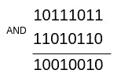

让我们看看`RAX`寄存器中的结果：


现在，让我们转到 OR 位运算，并修改之前的代码来执行这个操作：

```
global _start

section .text

_start:

    mov rax,0x10111011
    mov rbx,0x11010110
    or rax,rbx

    mov rax, 60
    mov rdi, 10
    syscall

section .data
```

我们将这两个值移动到`rax`和`rbx`寄存器中：


然后，我们对这些数值执行了 OR 操作：


现在，让我们确认一下`RAX`寄存器中的结果：

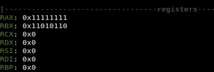

现在让我们看看相同数值的 XOR 位运算：

```
global _start

section .text

_start:

    mov rax,0x10111011
    mov rbx,0x11010110
    xor rax,rbx

    mov rax, 60
    mov rdi, 10
    syscall

section .data
```

将相同的数值移动到`rax`和`rbx`寄存器中：

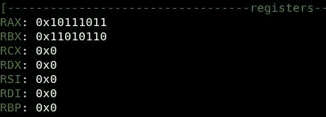

然后，执行 XOR 操作：


让我们看看`RAX`寄存器里面是什么：


你可以使用 XOR 指令对一个寄存器自身进行操作，以清除该寄存器的内容。例如，`xor rax`和`rax`将用 0 填充 RAX 寄存器。

现在，让我们看看最后一个，即 NOT 位运算，它将把 1 变为 0，0 变为 1：

```
global _start

section .text

_start:

    mov al,0x00
    not al

    mov rax, 60
    mov rdi, 10
    syscall

section .data
```

上述代码的输出可以在以下截图中看到：


发生的事情是 NOT 指令将 0 变为 1（`ff`），1 变为 0。

# 位移操作

如果你按照每个图表所说的去做，位移操作就是一个简单的话题。主要有两种类型的位移操作：算术位移操作和逻辑操作。然而，我们也会看到旋转操作。

让我们从算术位移操作开始。

# 算术位移操作

让我们尽可能简单地解释。有两种类型的算术移位：**算术左移**（**SAL**）和**算术右移**（**SAR**）。

在 SAL 中，我们在**最低有效位**侧推送**0**，并且来自**最高有效位**侧的额外位可能会影响**CF**，如果它是**1**：


因此，这种移位的结果不会影响**CF**，它会是这样的：


让我们举个例子：

```
global _start

section .text

_start:

    mov rax, 0x0fffffffffffffff
    sal rax, 4
    sal rax, 4

    mov rax, 60
    mov rdi, 0
    syscall

section .data
```

我们将`0x0fffffffffffffff`移动到`rax`寄存器中，现在它看起来是这样的：


现在，我们要进行一次 SAL 移位 4 位：


因为最高有效位为零，所以 CF 不会被设置：


现在，让我们尝试另一轮：我们再推送一个零，最高有效位为 1：


将设置进位标志：


现在，让我们看一下 SAR 指令。在 SAR 中，如果**最高有效位**为**0**，则将推送一个基于该位的值，那么将推送**0**，如果为**1**，则将推送**1**以保持符号不变：


**最高有效位**用作符号的指示，**0**表示正数，**1**表示负数。

因此，在 SAR 中，它将根据**最高有效位**进行移位。

让我们看一个例子：

```
global _start

section .text

_start:

    mov rax, 0x0fffffffffffffff
    sar rax, 4

    mov rax, 60
    mov rdi, 0
    syscall

section .data
```

因此，输入将如下所示：


因此，SAR 四次将在最高有效位为零时推送**0**四次：


此外，由于最低有效位为 1，所以 CF 被设置：


# 逻辑移位

逻辑移位还包括两种类型的移位：逻辑**左移**（**SHL**）和逻辑**右移**（**SHR**）。SHL 与 SAL 完全相同。

让我们看一下以下代码：

```
global _start

section .text

_start:

    mov rax, 0x0fffffffffffffff
    shl rax, 4
    shl rax, 4

    mov rax, 60
    mov rdi, 0
    syscall

section .data
```

同时，它将从最低有效位侧再次推送零四次：


这不会对进位标志产生任何影响：

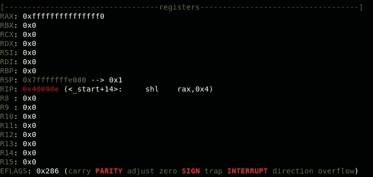

在第二轮中，它将再次推送四次零：


最高有效位为 1，因此这将设置进位标志：


现在让我们转向 SHR。它只是在**最高有效位**侧推送一个 0，而不改变符号：


现在，尝试以下代码：

```
global _start

section .text
_start:

    mov rax, 0xffffffffffffffff
    shr rax, 32

    mov rax, 60
    mov rdi, 0
    syscall

section .data
```

因此，首先，我们移动 64 位的 1：


之后，我们将进行 32 次 SHR，这将在最高有效位侧推送 32 个零：


同时，由于最低有效位为 1，这将设置进位标志：


# 旋转操作

旋转操作很简单：我们将寄存器的内容向右或向左旋转。在这里，我们只讨论**向右旋转**（**ROR**）和**向左旋转**（**ROL**）。

让我们从 ROR 开始：


在 ROR 中，我们只是将位从右向左旋转而不添加任何位；让我们看一下以下代码：

```
global _start

section .text

_start:

    mov rax, 0xffffffff00000000
    ror rax, 32

    mov rax, 60
    mov rdi, 0
    syscall

section .data
```

我们将`0xffffffff00000000`移动到`rax`寄存器中：


然后，我们将开始从右向左移动 32 次：


没有对 1 进行移位，因此不会设置进位标志：


让我们移动 ROL，这是 ROR 的相反，它将位从左向右旋转而不添加任何位：


让我们看一下之前的例子，但是使用 ROL：

```
global _start

section .text

_start:

    mov rax, 0xffffffff00000000
    rol rax, 32

    mov rax, 60
    mov rdi, 0
    syscall

section .data
```

首先，我们将`0xffffffff00000000`移动到`rax`寄存器中：


然后，我们将从左向右旋转 32 次：


我们正在旋转 1，因此这将设置进位标志：

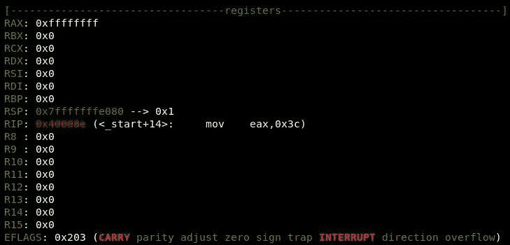

# 总结

在本章中，我们讨论了 Linux 中的 Intel x64 汇编语言以及如何处理堆栈、数据操作、算术和逻辑操作，如何控制执行流程，以及如何在汇编中调用系统调用。

现在我们准备制作我们自己定制的 shellcode，但在此之前，您需要学习一些调试和逆向工程的基础知识，这将是我们的下一章。
