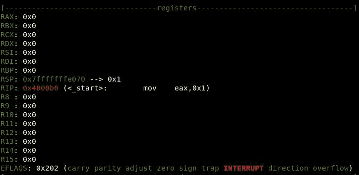
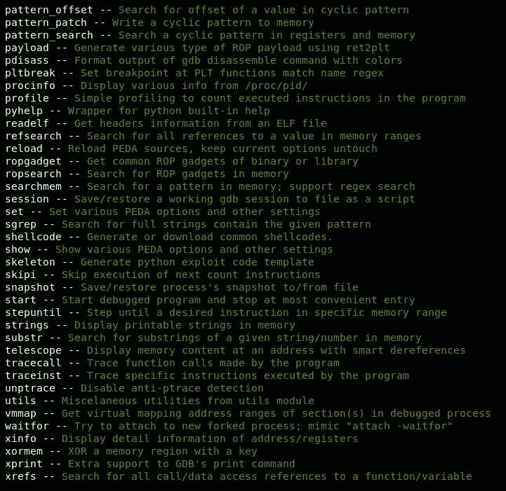
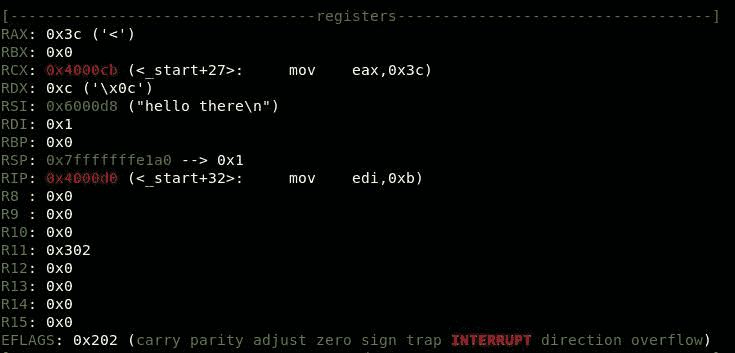
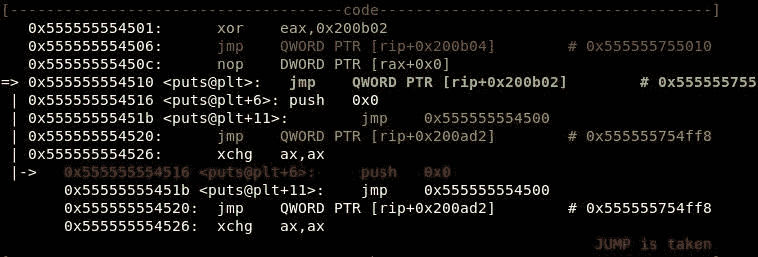
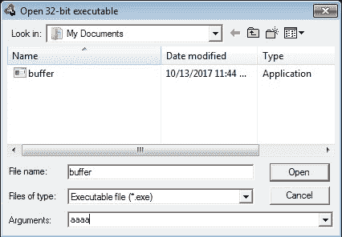
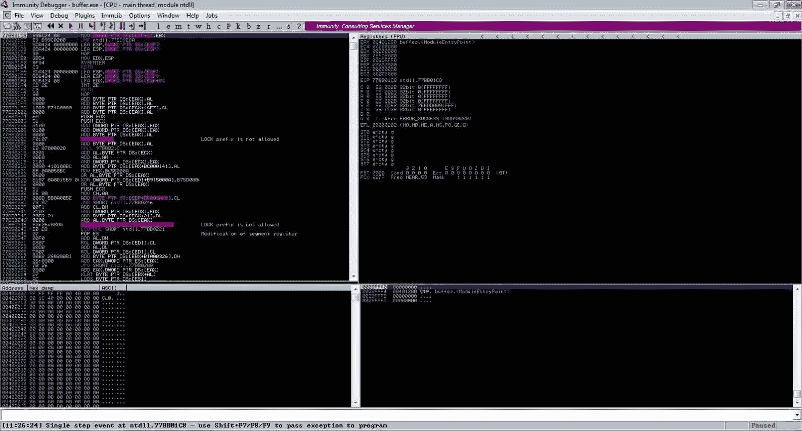
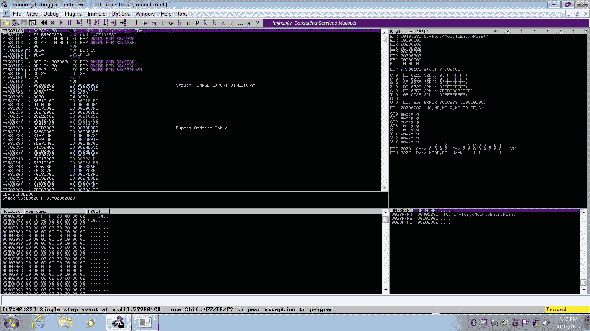
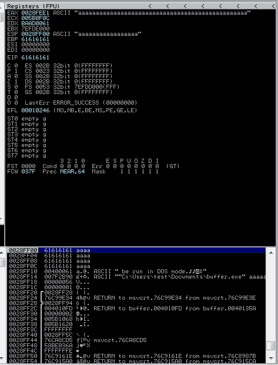

# 第四章：逆向工程

在本章中，我们将学习什么是逆向工程，以及如何使用调试器使我们真正看到幕后发生了什么。此外，我们将逐条查看每条指令的执行流程，以及如何使用和熟悉 Microsoft Windows 和 Linux 的调试器。

本章将涵盖以下主题：

+   在 Linux 中调试

+   在 Windows 中调试

+   任何代码的执行流

+   使用逆向工程检测和确认缓冲区溢出

我们开始吧？

# 在 Linux 中调试

在这里，我们将向您介绍一个最可爱和强大的调试器之一，GDB（GNU 调试器）。GDB 是一个开源的命令行调试器，可以在许多语言上工作，比如 C/C++，并且它默认安装在大多数 Linux 发行版上。

那么我们为什么要使用调试器呢？我们使用它们来查看每一步中寄存器、内存或堆栈的情况。此外，GDB 中还有反汇编，帮助我们理解汇编语言中每个函数的功能。

有些人觉得 GDB 难以使用，因为它是一个命令行界面，很难记住每个命令的参数等。让我们通过安装 PEDA 来使 GDB 对这些人更容忍，PEDA 用于增强 GDB 的界面。

**PEDA**代表**Python Exploit Development Assistance**，它可以使 GDB 更易于使用和更美观。

我们需要先下载它：

```
$ git clone https://github.com/longld/peda.git ~/peda
```

然后，将该文件复制到您`home`目录下的`gdbinit`中：

```
$ echo "source ~/peda/peda.py" >> ~/.gdbinit
```

然后，启动 GDB：

```
$ gdb
```

现在看起来毫无用处，但等等；让我们尝试调试一些简单的东西，比如我们的汇编*hello world*示例：

```
global _start

section .text
_start:

    mov rax, 1
    mov rdi, 1
    mov rsi, hello_world
    mov rdx, length
    syscall

    mov rax, 60
    mov rdi, 11
    syscall

section .data

    hello_world: db 'hello there',0xa
    length: equ $-hello_world
```

让我们按照以下方式汇编和链接它：

```
$ nasm -felf64 hello.nasm -o hello.o
$ ld hello.o -o hello
```

现在使用 GDB 运行`./hello`如下：

```
$ gdb ./hello
```

以下截图显示了上述命令的输出：


我们将把反汇编模式设置为 Intel：

```
set disassembly-flavor intel
```

然后，我们将在想要逐步调试的地方设置断点，因为我们将跟踪所有指令，所以让我们在`_start`处设置断点：

```
break _start
```

上述命令的输出如下：


现在我们已经设置了断点，现在让我们在 GDB 中运行我们的应用程序使用`run`，它将继续运行直到触发断点。

您将看到三个部分（寄存器、代码和堆栈）：



以下截图是代码部分：


正如您所看到的，左侧的小箭头指向下一条指令，即将`0x1`移动到`eax`寄存器。

下一个截图是堆栈部分：


此外，我们可以使用命令`peda`找到许多命令选项：


还有更多：



所有这些都是 PEDA 命令；您也可以使用 GDB 命令。

现在，让我们继续我们的工作，输入`stepi`，或者您也可以使用`s`，这将开始执行一条指令，即`mov eax,0x1`：

`stepi`命令将进入`call`等指令，这将导致调试流程在该调用内部切换，而`s`命令或 step 不会这样做，它只会通过进入`call`指令来获取返回值。


在上一个屏幕上，`RAX`寄存器内有`0x1`，下一条指令指向`mov edi,0x1`。现在让我们按*Enter*移动到下一条指令：


另外，正如您所看到的，RDI 寄存器内有`1`，下一条指令是`movabs rsi,0x6000d8`。让我们尝试看看内存地址`0x6000d8`中有什么，使用`xprint 0x6000d8`：


现在很明显，这是保存`hello there`字符串的位置。我们还可以使用`peda hexprint 0x6000d8`或`peda hexdump 0x6000d8`以十六进制转储它：


让我们继续使用`stepi`：


现在 RSI 寄存器持有指向`hello there`字符串的指针。

下一条指令是`mov edx,0xc`，将`12`移动到 EDX 寄存器，这是`hello there`字符串的长度。现在，让我们再次按下*Enter*键；显示如下：


现在看 RDX 寄存器，它持有`0xc`，下一条指令是`syscall`。让我们继续使用`s`向前移动：


现在`syscall`已经完成，打印了`hello there`字符串。

现在我们要执行`exit`系统调用，下一条指令是`mov eax,0x3c`，意思是将`60`移动到 RAX 寄存器。让我们继续向前使用`s`：



指令`mov edi,0xb`的意思是将`11`移动到 RDI 寄存器：


RDI 现在持有`0xb`，下一条指令是`syscall`，将执行`exit`系统调用：


现在程序正常退出。

让我们看另一个例子，即 C 语言中的 hello world：

```
#include <stdio.h>

int main()
{
    printf ("hello world\n");
    return 0;
}
```

让我们编译它并使用 GDB 进行调试：

```
$ gcc hello.c -o hello
$ gdb ./hello
```

现在让我们将反汇编模式设置为 Intel：

```
set disassembly-flavor intel
```

在`main`函数处设置断点：

```
break main
```

现在，如果我们想查看任何函数的汇编指令，那么我们应该使用`disassemble`命令，后面跟着函数的名称。例如，我们想要反汇编`main`函数，因此我们可以使用`disassemble main`：


前两条指令是通过将 RBP 推送到堆栈来保存基指针或帧指针的内容，然后在最后，RBP 将被提取回来。让我们运行应用程序，以查看更多，使用`run`命令：


它停在`lea rdi,[rip+0x9f] # 0x5555555546e4`。

让我们检查一下那个位置里面有什么：


它指向`hello world`字符串的位置。

让我们通过使用`stepi`或`s`向前迈进：


如您所见，RDI 寄存器现在加载了`hello world`字符串的地址。

下一条指令`call 0x555555554510 <puts@plt>`，即调用`printf`函数，用于打印`hello world`字符串。

我们还可以检查`0x555555554510`的内容：


这是`jmp`指令；让我们也检查一下那个位置：


现在，让我们使用`stepi`命令向前迈进：



让我们再次向前迈进：


下一条指令是`push 0x0`；让我们继续使用`stepi`：


下一条指令是`jmp 0x555555554500`；输入`s`向前迈进：


现在我们在`printf`函数的实际执行内部；继续向前迈进，查看下一条指令：


下一条指令`call 0x7ffff7abc650 <strlen>`，意思是调用`strlen`函数来获取我们字符串的长度。

继续向前迈进，直到遇到`ret`指令，然后您又回到了我们的执行中，位于`printf`内部：


让程序继续调试，直到出现错误，使用`continue`命令：


在前面的例子中，我们没有遵循所有指令，而只是学习了如何使用 GDB 进行调试，并理解和调查每条指令。

# 在 Windows 中调试

现在，让我们尝试一些更高级但又非常简单的东西，而不涉及具体细节。在这里，我们将看到如果在 Windows 中使用缓冲区溢出代码会发生什么。我们将检测如果执行该代码，CPU 内部会发生什么。

首先，在 Windows 7 中打开*Code::Block*，然后转到文件菜单 | 新建 | 空文件。然后，编写我们的缓冲区溢出：

```
#include <stdio.h>
#include <string.h>

void copytobuffer(char* input)
{
    char buffer[15];
    strcpy (buffer,input);
}
int main (int argc, char *argv[])
{
    int local_variable = 1;
    copytobuffer(argv[1]);
    return 0;
}
```

之后，转到文件菜单 | 保存文件，然后将其保存为`buffer.c`：


然后，转到构建菜单 | 构建。

然后，以管理员身份打开*Immunity Debugger*，从文件菜单 | 打开，选择可执行的缓冲文件，然后指定我们的输入，不是为了使我们的代码崩溃，而是为了看到区别，比如`aaaa`：



然后，点击 Open：



要获得每个按钮的功能，请将鼠标悬停在其上并阅读状态栏。

例如，如果我将鼠标悬停在红色播放按钮上，它将在状态栏中显示其功能，即运行程序：


让我们点击一次运行程序按钮。程序启动，然后停在程序入口点，即`main`函数。让我们再次点击该按钮，并注意状态栏中发生的变化：


正如你所看到的，程序以零状态退出，这意味着没有错误。

好的，现在让我们尝试导致程序崩溃以查看区别。让我们关闭 Immunity Debugger 并再次运行它，然后打开相同的程序，但我们需要导致程序崩溃，因此指定参数，例如 40 个`a`字符：


然后点击打开：



让我们点击两次运行程序按钮，并注意状态栏中发生的变化：


程序无法执行`61616161`；你知道为什么吗？这是我们的输入，61 是十六进制中的一个字符。

让我们看看寄存器和堆栈窗口：



请注意，堆栈中有 16 个`a`字符；我们的输入的其余部分填充了 EAX 寄存器并填充了 RIP，这就是为什么我们的应用程序抱怨无法执行`61616161`。

# 摘要

在本章中，我们讨论了调试以及如何在 Linux 和 Microsoft Windows 中使用调试器。我们还看了如何跟踪执行流程并了解幕后发生了什么。我们只是浅尝辄止这个主题，因为我们不想偏离我们的主要目标。现在让我们继续进行下一章，这一章将涵盖我们的主要目标之一：创建 shellcode。我们将看看我们将如何应用到目前为止学到的一切来创建我们定制的 shellcode。
