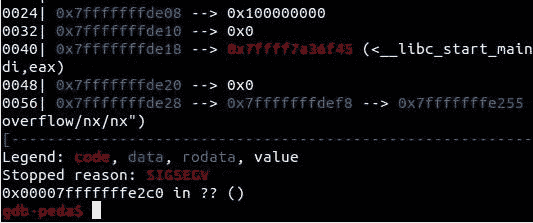
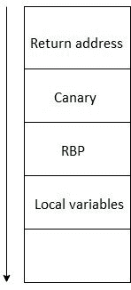

# 第十二章：检测和预防

最后，到了本书的最后一章。在这里，我们将讨论防止缓冲区溢出攻击的安全机制。让我们将这些机制分为三部分：

+   系统方法

+   编译器方法

+   开发者方法

# 系统方法

在这部分，我们将讨论一些系统内核内置的机制，以防止缓冲区溢出攻击中的 ASLR 等技术。

**地址空间布局随机化**（**ASLR**）是一种针对溢出攻击的缓解技术，它随机化内存段，从而防止硬编码的利用。例如，如果我想使用返回到库的技术，我必须获取将在攻击中使用的函数的地址。然而，由于内存段的地址是随机化的，唯一的方法就是猜测那个位置，是的，我们使用这种技术来规避 NX 保护，但不能规避 ASLR。

对于安全极客们，不用担心；有许多方法可以规避 ASLR。让我们看看 ASLR 是如何真正工作的。打开你的 Linux 受害机器，并确保 ASLR 已禁用：

```
$ cat /proc/sys/kernel/randomize_va_space
```

上述命令的输出可以在以下截图中看到：


由于`randomize_va_space`的值为`0`，ASLR 已禁用。如果已启用，请将其设置为`0`：

```
$ echo 0 | sudo tee /proc/sys/kernel/randomize_va_space
```

现在，让我们看看任何应用程序的寻址布局，例如`cat`：

```
$ cat
```

然后，打开另一个终端。现在，我们需要使用以下命令获取该进程的 PID：

```
 $ ps aux | grep cat
```

上述命令的输出可以在以下截图中看到：


`cat`的 PID 是`5029`。让我们获取此进程的内存布局：

```
$ cat /proc/5029/maps
```

上述命令的输出可以在以下截图中看到：


现在，停止`cat`进程使用*Ctrl* + *C*，然后再次启动它：

```
$ cat
```

然后，从另一个终端窗口运行以下命令：

```
$ ps aux | grep cat
```

上述命令的输出可以在以下截图中看到：


现在，`cat`的 PID 是`5164`。让我们获取此 PID 的内存布局：

```
$ cat /proc/5164/maps
```

上述命令的输出可以在以下截图中看到：


看看两个 PID 的内存布局；它们完全相同。所有东西都是静态分配在内存中的，比如库、堆栈和堆。

现在，让我们启用 ASLR 来看看区别：

```
$ echo 2 | sudo tee /proc/sys/kernel/randomize_va_space
```

确保 ASLR 已启用：

```
$ cat /proc/sys/kernel/randomize_va_space
```

上述命令的输出可以在以下截图中看到：


然后，让我们启动任何进程，例如`cat`：

```
$ cat
```

然后，从另一个终端窗口运行以下命令：

```
$ ps aux | grep cat
```

上述命令的输出可以在以下截图中看到：


`cat`的 PID 是`5271`。现在，阅读它的内存布局：

```
$ cat /proc/5271/maps
```

上述命令的输出可以在以下截图中看到：


现在，让我们停止`cat`，然后再次运行它：

```
$ cat
```

然后，让我们捕获`cat`的 PID：

```
$ ps aux | grep cat
```

上述命令的输出可以在以下截图中看到：


现在，阅读它的内存布局：

```
$ cat /proc/5341/maps
```

上述命令的输出可以在以下截图中看到：


让我们比较两个地址。它们完全不同。堆栈、堆和库现在都是动态分配的，所有地址将对每次执行都变得唯一。

现在到下一部分，即编译器方法，比如可执行空间保护和 canary。

# 编译器方法

可执行空间保护是一种技术，用于将内存中的某些段标记为不可执行，比如堆栈和堆。因此，即使我们成功注入了 shellcode，也不可能使该 shellcode 运行。

在 Linux 中，可执行空间保护被称为**不可执行**（**NX**），在 Windows 中被称为**数据执行防护**（**DEP**）。

让我们尝试使用我们在第六章中的例子，*缓冲区溢出攻击*：

```
#include <stdio.h>
#include <string.h>
#include <stdlib.h>

int copytobuffer(char* input)
{
    char buffer[256];
    strcpy (buffer,input);
    return 0;
}

void main (int argc, char *argv[])
{
    int local_variable = 1;
    copytobuffer(argv[1]);
    exit(0);
}
```

现在，禁用 NX 编译它：

```
$ gcc -fno-stack-protector -z execstack nx.c -o nx
```

在 GDB 中打开它：

```
$ gdb ./nx
```

然后，让我们运行这个利用：

```
#!/usr/bin/python
from struct import *

buffer = ''
buffer += '\x90'*232
buffer += '\x48\x31\xc0\x50\x48\x89\xe2\x48\xbb\x2f\x2f\x62\x69\x6e\x2f\x73\x68\x53\x48\x89\xe7\x50\x57\x48\x89\xe6\x48\x83\xc0\x3b\x0f\x05'
buffer += pack("<Q", 0x7fffffffe2c0)
f = open("input.txt", "w")
f.write(buffer)
```

执行利用：

```
$ python exploit.py
```

在 GDB 中，运行以下命令：

```
$ run $(cat input.txt)
```

上述命令的输出可以在以下截图中看到：


现在，让我们尝试启用 NX 的相同利用：

```
$ gcc -fno-stack-protector nx.c -o nx
```

然后，在 GDB 中打开它并运行以下命令：

```
$ run $(cat input.txt)
```

上述命令的输出可以在以下截图中看到：



那么，为什么代码会卡在这个地址？


因为它甚至拒绝执行我们从栈中的 No Operation (`nop`)，因为栈现在是不可执行的。

让我们谈谈另一种技术，即栈 canary 或栈保护器。栈 canary 用于检测任何企图破坏栈的行为。

当一个返回值存储在栈中时，在存储返回地址之前会写入一个称为**canary**值的值。因此，任何尝试执行栈溢出攻击的行为都会覆盖**canary**值，这将导致引发一个标志来停止执行，因为有企图破坏栈的行为：



现在，尝试使用我们之前的例子，但让我们启用栈`canary`：

```
$ gcc -z execstack canary.c -o canary
```

然后，在 GDB 中重新运行它并尝试我们的利用：

```
$ run $(cat input.txt)
```

上述命令的输出可以在以下截图中看到：


让我们看看为什么它失败了：


它试图将原始 canary 值与存储的值进行比较，但失败了，因为我们用我们的攻击覆盖了原始值：


正如你所看到的，栈破坏已被检测到！

# 开发者方法

现在到最后一部分，即开发者方法，任何开发者都应该尽其所能保护他们的代码免受溢出攻击。我会谈论 C/C++，但概念仍然是一样的。

首先，在使用任何字符串处理函数时，你应该使用安全函数。下表显示了不安全的函数以及应该使用的替代函数：

| **不安全函数** | **安全函数** |
| --- | --- |
| `strcpy` | `strlcpy` |
| `strncpy` | `strlcpy` |
| `strcat` | `strlcat` |
| `strncat` | `strlcat` |
| `vsprintf` | `vsnprintf` 或 `vasprintf` |
| `sprintf` | `snprintf` 或 `asprintf` |

此外，你应该始终使用`sizeof`函数来计算代码中缓冲区的大小。尝试通过将其与安全函数混合使用来精确计算缓冲区大小；然后，你的代码现在更安全了。

# 总结

在本书的最后一章中，我们讨论了操作系统中的一些保护技术，还有一些 C 编译器中的技术，比如 GCC。然后，我们继续讨论如何使你的代码更安全。

这还不是结束。有更多的方法来规避每种保护技术。通过本书，你已经获得了坚实的基础，可以继续你的学习之旅。继续前进，我保证你会掌握这个领域！
