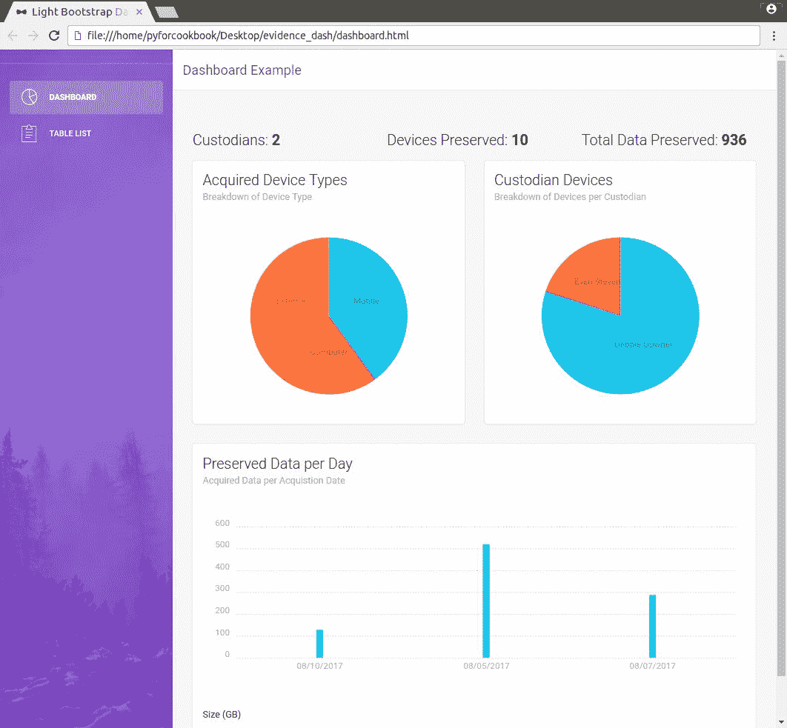
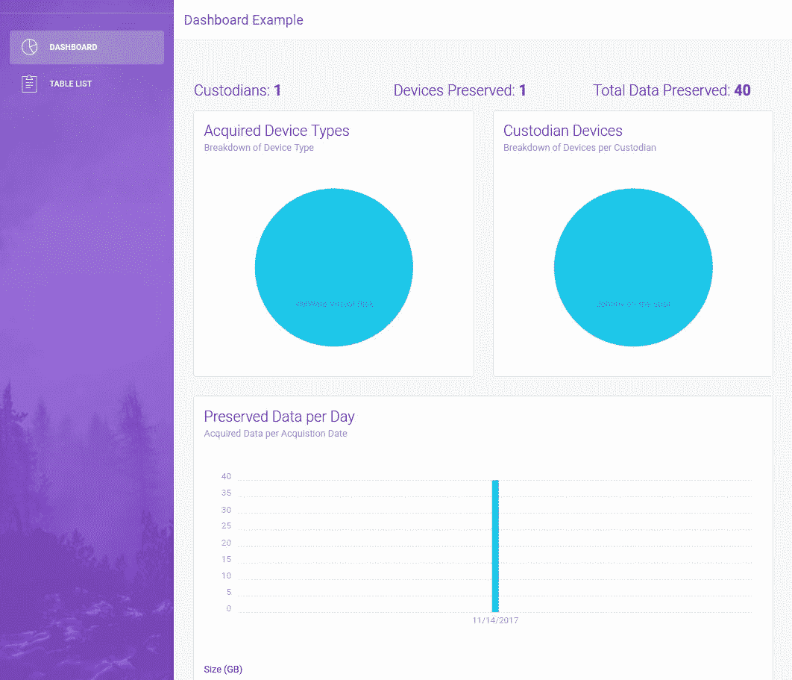
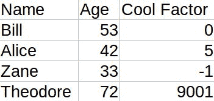
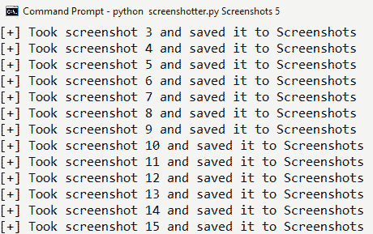

# 第二章：创建物件报告配方

在本章中，我们将涵盖以下配方：

+   使用 HTML 模板

+   创建一份纸质追踪

+   使用 CSV

+   使用 Excel 可视化事件

+   审计您的工作

# 介绍

在您开始从事网络安全职业的前几个小时内，您可能已经弯腰在屏幕前，疯狂地扫描电子表格以寻找线索。这听起来很熟悉，因为这是真实的，也是大多数调查的日常流程的一部分。电子表格是网络安全的基础。其中包含了各种流程的细节以及从有价值的物件中提取的具体信息。在这本食谱书中，我们经常会将解析后的物件数据输出到电子表格中，因为它便携且易于使用。然而，考虑到每个网络安全专业人员都曾经为非技术人员创建过技术报告，电子表格可能不是最佳选择。

为什么要创建报告？我想我以前听到过紧张的审查员喃喃自语。今天，一切都建立在信息交换之上，人们希望尽快了解事情。但这并不一定意味着他们希望得到一个技术电子表格并自己弄清楚。审查员必须能够有效地将技术知识传达给非专业观众，以便正确地完成他们的工作。即使一个物件可能非常好，即使它是某个案例的象征性证据，它很可能需要向非技术人员进行详细解释，以便他们完全理解其含义和影响。放弃吧；报告会一直存在，对此无能为力。

在本章中，您将学习如何创建多种不同类型的报告以及一个用于自动审计我们调查的脚本。我们将创建 HTML、XLSX 和 CSV 报告，以便以有意义的方式总结数据：

+   开发 HTML 仪表板模板

+   解析 FTK Imager 获取日志

+   构建强大的 CSV 写入器

+   使用 Microsoft Excel 绘制图表和数据

+   在调查过程中创建截图的审计跟踪

访问[www.packtpub.com/books/content/support](http://www.packtpub.com/books/content/support)下载本章的代码捆绑包。

# 使用 HTML 模板

配方难度：简单

Python 版本：2.7 或 3.5

操作系统：任意

HTML 可以是一份有效的报告。有很多时髦的模板可以使即使是技术报告看起来也很吸引人。这是吸引观众的第一步。或者至少是一种预防措施，防止观众立刻打瞌睡。这个配方使用了这样一个模板和一些测试数据，以创建一个视觉上引人注目的获取细节的例子。我们在这里确实有很多工作要做。

# 入门

这个配方介绍了使用`jinja2`模块的 HTML 模板化。`jinja2`库是一个非常强大的工具，具有许多不同的文档化功能。我们将在一个相当简单的场景中使用它。此脚本中使用的所有其他库都包含在 Python 的标准库中。我们可以使用 pip 来安装`jinja2`：

```py
pip install jinja2==2.9.6
```

除了`jinja2`之外，我们还将使用一个稍微修改过的模板，称为轻量级引导式仪表板。这个稍微修改过的仪表板已经随配方的代码捆绑提供了。

要了解更多关于`jinja2`库的信息，请访问[`jinja.pocoo.org/docs/2.9/`](http://jinja.pocoo.org/docs/2.9/)。

要下载轻量级引导式仪表板，请访问[`www.creative-tim.com/product/light-bootstrap-dashboard`](https://www.creative-tim.com/product/light-bootstrap-dashboard)。

# 如何做...

我们遵循以下原则部署 HTML 仪表板：

1.  设计 HTML 模板全局变量。

1.  处理测试获取元数据。

1.  使用插入的获取元数据呈现 HTML 模板。

1.  在所需的输出目录中创建报告。

# 它是如何工作的...

首先，我们导入所需的库来处理参数解析、创建对象计数和复制文件：

```py
from __future__ import print_function
import argparse
from collections import Counter
import shutil
import os
import sys
```

这个配方的命令行处理程序接受一个位置参数 `OUTPUT_DIR`，它表示 HTML 仪表板的期望输出路径。在检查目录是否存在并在不存在时创建它之后，我们调用 `main()` 函数并将输出目录传递给它：

```py
if __name__ == "__main__":
    # Command-line Argument Parser
    parser = argparse.ArgumentParser(
        description=__description__,
        epilog="Developed by {} on {}".format(
            ", ".join(__authors__), __date__)
    )
    parser.add_argument("OUTPUT_DIR", help="Desired Output Path")
    args = parser.parse_args()

    main(args.OUTPUT_DIR)
```

在脚本顶部定义了一些全局变量：`DASH`、`TABLE` 和 `DEMO`。这些变量代表脚本生成的各种 HTML 和 JavaScript 文件。这是一本关于 Python 的书，所以我们不会深入讨论这些文件的结构和工作原理。不过，让我们看一个示例，展示 `jinja2` 如何弥合这些类型文件和 Python 之间的差距。

以下代码片段捕获了全局变量 `DEMO` 的一部分。请注意，字符串块被传递给 `jinja2.Template()` 方法。这使我们能够创建一个对象，可以使用 `jinja2` 与之交互并动态插入数据到 JavaScript 文件中。具体来说，以下代码块显示了两个我们可以使用 `jinja2` 插入数据的位置。这些位置由双大括号和我们在 Python 代码中将引用它们的关键字（`pi_labels` 和 `pi_series`）表示：

```py
DEMO = Template("""type = ['','info','success','warning','danger']; 
[snip] 
        Chartist.Pie('#chartPreferences', dataPreferences,
          optionsPreferences);

        Chartist.Pie('#chartPreferences', {
          labels: [{{pi_labels}}],
          series: [{{pi_series}}]
        });
[snip] 
""") 
```

现在让我们转向 `main()` 函数。由于您将在第二个配方中理解的原因，这个函数实际上非常简单。这个函数创建一个包含示例获取数据的列表列表，向控制台打印状态消息，并将该数据发送到 `process_data()` 方法：

```py
def main(output_dir):
    acquisition_data = [
        ["001", "Debbie Downer", "Mobile", "08/05/2017 13:05:21", "32"],
        ["002", "Debbie Downer", "Mobile", "08/05/2017 13:11:24", "16"],
        ["003", "Debbie Downer", "External", "08/05/2017 13:34:16", "128"],
        ["004", "Debbie Downer", "Computer", "08/05/2017 14:23:43", "320"],
        ["005", "Debbie Downer", "Mobile", "08/05/2017 15:35:01", "16"],
        ["006", "Debbie Downer", "External", "08/05/2017 15:54:54", "8"],
        ["007", "Even Steven", "Computer", "08/07/2017 10:11:32", "256"],
        ["008", "Even Steven", "Mobile", "08/07/2017 10:40:32", "32"],
        ["009", "Debbie Downer", "External", "08/10/2017 12:03:42", "64"],
        ["010", "Debbie Downer", "External", "08/10/2017 12:43:27", "64"]
    ]
    print("[+] Processing acquisition data")
    process_data(acquisition_data, output_dir)
```

`process_data()` 方法的目的是将示例获取数据转换为 HTML 或 JavaScript 格式，以便我们可以将其放置在 `jinja2` 模板中。这个仪表板将有两个组件：可视化数据的一系列图表和原始数据的表格。以下代码块处理了后者。我们通过遍历获取列表并使用适当的 HTML 标记将表的每个元素添加到 `html_table` 字符串中来实现这一点：

```py
def process_data(data, output_dir):
    html_table = ""
    for acq in data:
        html_table += "<tr><td>{}</td><td>{}</td><td>{}</td><td>{}</td>" \
            "<td>{}</td></tr>\n".format(
                acq[0], acq[1], acq[2], acq[3], acq[4])
```

接下来，我们使用 `collections` 库中的 `Counter()` 方法快速生成一个类似字典的对象，表示样本数据中每个项目的出现次数。例如，第一个 `Counter` 对象 `device_types` 创建了一个类似字典的对象，其中每个键都是不同的设备类型（例如，移动设备、外部设备和计算机），值表示每个键的出现次数。这使我们能够快速总结数据集中的数据，并减少了在绘制此信息之前所需的工作量。

一旦我们创建了 `Counter` 对象，我们再次遍历每个获取以执行更多手动的获取日期信息的总结。这个 `date_dict` 对象维护了所有获取数据的键，并将在该天进行的所有获取的大小添加为键的值。我们特别在空格上拆分，以仅从日期时间字符串中隔离出日期值（例如，`08/15/2017`）。如果特定日期已经在字典中，我们直接将获取大小添加到键中。否则，我们创建键并将其值分配给获取大小。一旦我们创建了各种总结对象，我们调用 `output_html()` 方法来用这些信息填充 HTML 仪表板：

```py
    device_types = Counter([x[2] for x in data])
    custodian_devices = Counter([x[1] for x in data])

    date_dict = {}
    for acq in data:
        date = acq[3].split(" ")[0]
        if date in date_dict:
            date_dict[date] += int(acq[4])
        else:
            date_dict[date] = int(acq[4])
    output_html(output_dir, len(data), html_table,
                device_types, custodian_devices, date_dict)
```

`output_html()` 方法首先通过在控制台打印状态消息并将当前工作目录存储到变量中来开始。我们将文件夹路径附加到 light-bootstrap-dashboard，并使用 `shutil.copytree()` 将 bootstrap 文件复制到输出目录。随后，我们创建三个文件路径，表示三个 `jinja2` 模板的输出位置和名称：

```py
def output_html(output, num_devices, table, devices, custodians, dates):
    print("[+] Rendering HTML and copy files to {}".format(output))
    cwd = os.getcwd()
    bootstrap = os.path.join(cwd, "light-bootstrap-dashboard")
    shutil.copytree(bootstrap, output)

    dashboard_output = os.path.join(output, "dashboard.html")
    table_output = os.path.join(output, "table.html")
    demo_output = os.path.join(output, "assets", "js", "demo.js")
```

让我们先看看两个 HTML 文件，因为它们相对简单。在为两个 HTML 文件打开文件对象之后，我们使用`jinja2.render()`方法，并使用关键字参数来引用`Template`对象中花括号中的占位符。使用 Python 数据呈现文件后，我们将数据写入文件。简单吧？幸运的是，JavaScript 文件并不难：

```py
    with open(dashboard_output, "w") as outfile:
        outfile.write(DASH.render(num_custodians=len(custodians.keys()),
                                  num_devices=num_devices,
                                  data=calculate_size(dates)))

    with open(table_output, "w") as outfile:
        outfile.write(TABLE.render(table_body=table))
```

虽然在语法上与前一个代码块相似，但这次在呈现数据时，我们将数据提供给`return_labels()`和`return_series()`方法。这些方法从`Counter`对象中获取键和值，并适当地格式化以与 JavaScript 文件一起使用。您可能还注意到在前一个代码块中对`dates`字典调用了`calculate_size()`方法。现在让我们来探讨这三个支持函数：

```py
    with open(demo_output, "w") as outfile:
        outfile.write(
            DEMO.render(bar_labels=return_labels(dates.keys()),
                        bar_series=return_series(dates.values()),
                        pi_labels=return_labels(devices.keys()),
                        pi_series=return_series(devices.values()),
                        pi_2_labels=return_labels(custodians.keys()),
                        pi_2_series=return_series(custodians.values())))
```

`calculate_size()`方法简单地使用内置的`sum()`方法返回每个日期键收集的总大小。`return_labels()`和`return_series()`方法使用字符串方法适当地格式化数据。基本上，JavaScript 文件期望标签在单引号内，这是通过`format()`方法实现的，标签和系列都必须用逗号分隔：

```py
def calculate_size(sizes):
    return sum(sizes.values())

def return_labels(list_object):
    return ", ".join("'{}'".format(x) for x in list_object)

def return_series(list_object):
    return ", ".join(str(x) for x in list_object)
```

当我们运行这个脚本时，我们会收到报告的副本，以及加载和呈现页面所需的资产，放在指定的输出目录中。我们可以将这个文件夹压缩并提供给团队成员，因为它被设计为可移植的。查看这个仪表板，我们可以看到包含图表信息的第一页：



以及作为采集信息表的第二页：


# 还有更多…

这个脚本可以进一步改进。我们在这里提供了一些建议：

+   添加对其他类型报告的支持，以更好地突出显示数据

+   包括通过额外的 javascript 导出表格和图表以进行打印和分享的能力

# 创建一份纸质记录

菜谱难度：中等

Python 版本：2.7 或 3.5

操作系统：任何

大多数成像工具都会创建记录采集介质细节和其他可用元数据的审计日志。承认吧；除非出现严重问题，否则这些日志大多不会被触及，如果证据验证了。让我们改变这种情况，利用前一个菜谱中新创建的 HTML 仪表板，并更好地利用这些采集数据。

# 入门

此脚本中使用的所有库都存在于 Python 的标准库中，或者是从之前的脚本中导入的函数。

# 如何做…

我们通过以下步骤解析采集日志：

1.  识别和验证 FTK 日志。

1.  解析日志以提取相关字段。

1.  创建一个包含采集数据的仪表板。

# 它是如何工作的…

首先，我们导入所需的库来处理参数解析、解析日期和我们在上一个菜谱中创建的`html_dashboard`脚本：

```py
from __future__ import print_function
import argparse
from datetime import datetime
import os
import sys
import html_dashboard
```

这个菜谱的命令行处理程序接受两个位置参数，`INPUT_DIR`和`OUTPUT_DIR`，分别代表包含采集日志的目录路径和期望的输出路径。在创建输出目录（如果需要）并验证输入目录存在后，我们调用`main()`方法并将这两个变量传递给它：

```py
if __name__ == "__main__":
    # Command-line Argument Parser
    parser = argparse.ArgumentParser(
        description=__description__,
        epilog="Developed by {} on {}".format(
            ", ".join(__authors__), __date__)
    )
    parser.add_argument("INPUT_DIR", help="Input Directory of Logs")
    parser.add_argument("OUTPUT_DIR", help="Desired Output Path")
    args = parser.parse_args()

    if os.path.exists(args.INPUT_DIR) and os.path.isdir(args.INPUT_DIR):
        main(args.INPUT_DIR, args.OUTPUT_DIR)
    else:
        print("[-] Supplied input directory {} does not exist or is not "
              "a file".format(args.INPUT_DIR))
        sys.exit(1)
```

在`main()`函数中，我们使用`os.listdir()`函数获取输入目录的目录列表，并仅识别具有`.txt`文件扩展名的文件。这很重要，因为 FTK Imager 创建带有`.txt`扩展名的获取日志。这有助于我们仅通过扩展名避免处理一些不应该处理的文件。然而，我们将进一步进行。在创建可能的 FTK 日志列表后，我们创建一个占位符列表`ftk_data`，用于存储处理过的获取数据。接下来，我们遍历每个潜在的日志，并设置一个具有所需键的字典来提取。为了进一步排除误报，我们调用`validate_ftk()`方法，该方法根据其检查结果返回`True`或`False`布尔值。让我们快速看一下它是如何工作的：

```py
def main(in_dir, out_dir):
    ftk_logs = [x for x in os.listdir(in_dir)
                if x.lower().endswith(".txt")]
    print("[+] Processing {} potential FTK Imager Logs found in {} "
          "directory".format(len(ftk_logs), in_dir))
    ftk_data = []
    for log in ftk_logs:
        log_data = {"e_numb": "", "custodian": "", "type": "",
                    "date": "", "size": ""}
        log_name = os.path.join(in_dir, log)
        if validate_ftk(log_name):
```

值得庆幸的是，每个 FTK Imager 日志的第一行都包含`"Created by AccessData"`这几个词。我们可以依靠这一点来验证该日志很可能是有效的 FTK Imager 日志。使用输入的`log_file`路径，我们打开文件对象并使用`readline()`方法读取第一行。提取第一行后，我们检查短语是否存在，如果存在则返回`True`，否则返回`False`：

```py
def validate_ftk(log_file):
    with open(log_file) as log:
        first_line = log.readline()
        if "Created By AccessData" not in first_line:
            return False
        else:
            return True
```

回到`main()`方法，在验证了 FTK Imager 日志之后，我们打开文件，将一些变量设置为`None`，并开始迭代文件中的每一行。基于这些日志的可靠布局，我们可以使用特定关键字来识别当前行是否是我们感兴趣的行。例如，如果该行包含短语`"Evidence Number:"`，我们可以确定该行包含证据编号值。实际上，我们分割短语并取冒号右侧的值，并将其与字典`e_numb`键关联。这种逻辑可以应用于大多数所需的值，但也有一些例外。

对于获取时间，我们必须使用`datetime.strptime()`方法将字符串转换为实际的`datetime`对象。我们必须这样做才能以 HTML 仪表板期望的格式存储它。我们在字典中使用`datetime`对象的`strftime()`方法并将其与`date`键关联：

```py
            with open(log_name) as log_file:
                bps, sec_count = (None, None)
                for line in log_file:
                    if "Evidence Number:" in line:
                        log_data["e_numb"] = line.split(
                            "Number:")[1].strip()
                    elif "Notes:" in line:
                        log_data["custodian"] = line.split(
                            "Notes:")[1].strip()
                    elif "Image Type:" in line:
                        log_data["type"] = line.split("Type:")[1].strip()
                    elif "Acquisition started:" in line:
                        acq = line.split("started:")[1].strip()
                        date = datetime.strptime(
                            acq, "%a %b %d %H:%M:%S %Y")
                        log_data["date"] = date.strftime(
                            "%M/%d/%Y %H:%M:%S")
```

每个扇区的字节数和扇区计数与其他部分处理方式略有不同。由于 HTML 仪表板脚本期望接收数据大小（以 GB 为单位），我们需要提取这些值并计算获取的媒体大小。一旦识别出来，我们将每个值转换为整数，并将其分配给最初为`None`的两个局部变量。在完成对所有行的迭代后，我们检查这些变量是否不再是`None`，如果不是，则将它们发送到`calculate_size()`方法。该方法执行必要的计算并将媒体大小存储在字典中：

```py
def calculate_size(bytes, sectors):
    return (bytes * sectors) / (1024**3)
```

处理完文件后，提取的获取数据的字典将附加到`ftk_data`列表中。在处理完所有日志后，我们调用`html_dashboard.process_data()`方法，并向其提供获取数据和输出目录。`process_data()`函数当然与上一个示例中的完全相同。因此，您知道这些获取数据将替换上一个示例中的示例获取数据，并用真实数据填充 HTML 仪表板：

```py
                    elif "Bytes per Sector:" in line:
                        bps = int(line.split("Sector:")[1].strip())
                    elif "Sector Count:" in line:
                        sec_count = int(
                            line.split("Count:")[1].strip().replace(
                                ",", "")
                        )
                if bps is not None and sec_count is not None:
                    log_data["size"] = calculate_size(bps, sec_count)

            ftk_data.append(
                [log_data["e_numb"], log_data["custodian"],
                 log_data["type"], log_data["date"], log_data["size"]]
            )

    print("[+] Creating HTML dashboard based acquisition logs "
          "in {}".format(out_dir))
    html_dashboard.process_data(ftk_data, out_dir)
```

当我们运行这个工具时，我们可以看到获取日志信息，如下两个截图所示：



# 还有更多...

这个脚本可以进一步改进。以下是一个建议：

+   创建额外的脚本以支持来自其他获取工具的日志，例如**Guymager**，**Cellebrite**，**MacQuisition**等等

# 处理 CSV 文件

食谱难度：简单

Python 版本：2.7 或 3.5

操作系统：任意

每个人都曾经在 CSV 电子表格中查看过数据。它们是无处不在的，也是大多数应用程序的常见输出格式。使用 Python 编写 CSV 是创建处理数据报告的最简单方法之一。在这个配方中，我们将演示如何使用`csv`和`unicodecsv`库来快速创建 Python 报告。

# 入门

这个配方的一部分使用了`unicodecsv`模块。该模块替换了内置的 Python 2 `csv`模块，并添加了 Unicode 支持。Python 3 的`csv`模块没有这个限制，可以在不需要任何额外库支持的情况下使用。此脚本中使用的所有其他库都包含在 Python 的标准库中。`unicodecsv`库可以使用`pip`安装：

```py
pip install unicodecsv==0.14.1
```

要了解更多关于`unicodecsv`库的信息，请访问[`github.com/jdunck/python-unicodecsv`](https://github.com/jdunck/python-unicodecsv)。

# 如何做...

我们按照以下步骤创建 CSV 电子表格：

1.  识别调用脚本的 Python 版本。

1.  使用 Python 2 和 Python 3 的约定在当前工作目录的电子表格中输出一个列表和一个字典列表。

# 它是如何工作的...

首先，我们导入所需的库来写入电子表格。在这个配方的后面，我们还导入了`unicodecsv`模块：

```py
from __future__ import print_function
import csv
import os
import sys
```

这个配方不使用`argparse`作为命令行处理程序。相反，我们根据 Python 的版本直接调用所需的函数。我们可以使用`sys.version_info`属性确定正在运行的 Python 版本。如果用户使用的是 Python 2.X，我们调用`csv_writer_py2()`和`unicode_csv_dict_writer_py2()`方法。这两种方法都接受四个参数，最后一个参数是可选的：要写入的数据、标题列表、所需的输出目录，以及可选的输出 CSV 电子表格的名称。或者，如果使用的是 Python 3.X，我们调用`csv_writer_py3()`方法。虽然相似，但在两个版本的 Python 之间处理 CSV 写入的方式有所不同，而`unicodecsv`模块仅适用于 Python 2：

```py
if sys.version_info < (3, 0):
    csv_writer_py2(TEST_DATA_LIST, ["Name", "Age", "Cool Factor"],
                   os.getcwd())
    unicode_csv_dict_writer_py2(
        TEST_DATA_DICT, ["Name", "Age", "Cool Factor"], os.getcwd(),
        "dict_output.csv")

elif sys.version_info >= (3, 0):
    csv_writer_py3(TEST_DATA_LIST, ["Name", "Age", "Cool Factor"],
                   os.getcwd())
```

这个配方有两个表示样本数据类型的全局变量。其中第一个`TEST_DATA_LIST`是一个嵌套列表结构，包含字符串和整数。第二个`TEST_DATA_DICT`是这些数据的另一种表示，但存储为字典列表。让我们看看各种函数如何将这些样本数据写入输出 CSV 文件：

```py
TEST_DATA_LIST = [["Bill", 53, 0], ["Alice", 42, 5],
                  ["Zane", 33, -1], ["Theodore", 72, 9001]]

TEST_DATA_DICT = [{"Name": "Bill", "Age": 53, "Cool Factor": 0},
                  {"Name": "Alice", "Age": 42, "Cool Factor": 5},
                  {"Name": "Zane", "Age": 33, "Cool Factor": -1},
                  {"Name": "Theodore", "Age": 72, "Cool Factor": 9001}]
```

`csv_writer_py2()`方法首先检查输入的名称是否已提供。如果仍然是默认值`None`，我们就自己分配输出名称。接下来，在控制台打印状态消息后，我们在所需的输出目录中以`"wb"`模式打开一个`File`对象。请注意，在 Python 2 中重要的是以`"wb"`模式打开 CSV 文件，以防止在生成的电子表格中的行之间出现干扰间隙。一旦我们有了`File`对象，我们使用`csv.writer()`方法将其转换为`writer`对象。有了这个，我们可以使用`writerow()`和`writerows()`方法分别写入单个数据列表和嵌套列表结构。现在，让我们看看`unicodecsv`如何处理字典列表：

```py
def csv_writer_py2(data, header, output_directory, name=None):
    if name is None:
        name = "output.csv"

    print("[+] Writing {} to {}".format(name, output_directory))

    with open(os.path.join(output_directory, name), "wb") as csvfile:
        writer = csv.writer(csvfile)
        writer.writerow(header)

        writer.writerows(data)
```

`unicodecsv`模块是内置`csv`模块的替代品，可以互换使用。不同之处在于，`unicodecsv`自动处理 Unicode 字符串的方式与 Python 2 中的内置`csv`模块不同。这在 Python 3 中得到了解决。

首先，我们尝试导入`unicodecsv`模块，并在退出脚本之前，如果导入失败，则在控制台打印状态消息。如果我们能够导入库，我们检查是否提供了名称输入，并在打开`File`对象之前创建一个名称。使用这个`File`对象，我们使用`unicodecsv.DictWriter`类，并提供它的标题列表。默认情况下，该对象期望提供的`fieldnames`列表中的键表示每个字典中的所有键。如果不需要这种行为，或者如果不是这种情况，可以通过将 extrasaction 关键字参数设置为字符串`ignore`来忽略它。这样做将导致所有未在`fieldnames`列表中指定的附加字典键被忽略，并且不会添加到 CSV 电子表格中。

设置`DictWriter`对象后，我们使用`writerheader()`方法写入字段名称，然后使用`writerows()`方法，这次将字典列表写入 CSV 文件。另一个重要的事情要注意的是，列将按照提供的`fieldnames`列表中元素的顺序排列：

```py
def unicode_csv_dict_writer_py2(data, header, output_directory, name=None):
    try:
        import unicodecsv
    except ImportError:
        print("[+] Install unicodecsv module before executing this"
              " function")
        sys.exit(1)

    if name is None:
        name = "output.csv"

    print("[+] Writing {} to {}".format(name, output_directory))
    with open(os.path.join(output_directory, name), "wb") as csvfile:
        writer = unicodecsv.DictWriter(csvfile, fieldnames=header)
        writer.writeheader()

        writer.writerows(data)
```

最后，`csv_writer_py3()`方法的操作方式基本相同。但是，请注意`File`对象创建方式的不同。与在 Python 3 中以`"wb"`模式打开文件不同，我们以`"w"`模式打开文件，并将 newline 关键字参数设置为空字符串。在这样做之后，其余的操作与之前描述的方式相同：

```py
def csv_writer_py3(data, header, output_directory, name=None):
    if name is None:
        name = "output.csv"

    print("[+] Writing {} to {}".format(name, output_directory))

    with open(os.path.join(output_directory, name), "w", newline="") as \
            csvfile:
        writer = csv.writer(csvfile)
        writer.writerow(header)

        writer.writerows(data)
```

当我们运行这段代码时，我们可以查看两个新生成的 CSV 文件中的任何一个，并看到与以下截图中相同的信息：



# 还有更多...

这个脚本可以进一步改进。以下是一个建议：

+   使用更健壮的 CSV 写入器和附加功能集和选项。这里的想法是，您可以提供不同类型的数据，并有一个处理它们的方法。

# 使用 Excel 可视化事件

配方难度：简单

Python 版本：2.7 或 3.5

操作系统：任何

让我们从上一个配方进一步进行 Excel。Excel 是一个非常强大的电子表格应用程序，我们可以做很多事情。我们将使用 Excel 创建一个表格，并绘制数据的图表。

# 入门

有许多不同的 Python 库，对 Excel 及其许多功能的支持各不相同。在这个配方中，我们使用`xlsxwriter`模块来创建数据的表格和图表。这个模块可以用于更多的用途。可以使用以下命令通过`pip`安装这个模块：

```py
pip install xlsxwriter==0.9.9
```

要了解更多关于`xlsxwriter`库的信息，请访问[`xlsxwriter.readthedocs.io/`](https://xlsxwriter.readthedocs.io/)。

我们还使用了一个基于上一个配方编写的自定义`utilcsv`模块来处理与 CSV 的交互。此脚本中使用的所有其他库都包含在 Python 的标准库中。

# 如何做...

我们通过以下步骤创建 Excel 电子表格：

1.  创建工作簿和工作表对象。

1.  创建电子表格数据的表格。

1.  创建事件日志数据的图表。

# 它是如何工作的...

首先，我们导入所需的库来处理参数解析、创建对象计数、解析日期、编写 XLSX 电子表格，以及我们的自定义`utilcsv`模块，该模块在这个配方中处理 CSV 的读取和写入：

```py
from __future__ import print_function
import argparse
from collections import Counter
from datetime import datetime
import os
import sys
from utility import utilcsv

try:
    import xlsxwriter
except ImportError:
    print("[-] Install required third-party module xlsxwriter")
    sys.exit(1)
```

这个配方的命令行处理程序接受一个位置参数：`OUTPUT_DIR`。这代表了`XLSX`文件的期望输出路径。在调用`main()`方法之前，我们检查输出目录是否存在，如果不存在则创建它：

```py
if __name__ == "__main__":
    # Command-line Argument Parser
    parser = argparse.ArgumentParser(
        description=__description__,
        epilog="Developed by {} on {}".format(
            ", ".join(__authors__), __date__)
    )
    parser.add_argument("OUTPUT_DIR", help="Desired Output Path")
    args = parser.parse_args()

    if not os.path.exists(args.OUTPUT_DIR):
        os.makedirs(args.OUTPUT_DIR)

    main(args.OUTPUT_DIR)
```

`main()`函数实际上非常简单；它的工作是在控制台打印状态消息，使用`csv_reader()`方法（这是从上一个配方稍微修改的函数），然后使用`xlsx_writer()`方法将结果数据写入输出目录：

```py
def main(output_directory):
    print("[+] Reading in sample data set")
    # Skip first row of headers
    data = utilcsv.csv_reader("redacted_sample_event_log.csv")[1:]
    xlsx_writer(data, output_directory)
```

`xlsx_writer()`从打印状态消息和在输出目录中创建`workbook`对象开始。接下来，我们为仪表板和数据工作表创建了两个`worksheet`对象。仪表板工作表将包含一个总结数据工作表上原始数据的图表：

```py
def xlsx_writer(data, output_directory):
    print("[+] Writing output.xlsx file to {}".format(output_directory))
    workbook = xlsxwriter.Workbook(
        os.path.join(output_directory, "output.xlsx"))
    dashboard = workbook.add_worksheet("Dashboard")
    data_sheet = workbook.add_worksheet("Data")
```

我们在`workbook`对象上使用`add_format()`方法来为电子表格创建自定义格式。这些格式是带有键值对配置格式的字典。根据键名，大多数键都是不言自明的。有关各种格式选项和功能的描述可以在[`xlsxwriter.readthedocs.io/format.html`](http://xlsxwriter.readthedocs.io/format.html)找到：

```py
    title_format = workbook.add_format({
        'bold': True, 'font_color': 'white', 'bg_color': 'black',
        'font_size': 30, 'font_name': 'Calibri', 'align': 'center'
    })
    date_format = workbook.add_format(
        {'num_format': 'mm/dd/yy hh:mm:ss AM/PM'})
```

设置格式后，我们可以枚举列表中的每个列表，并使用`write()`方法写入每个列表。这个方法需要一些输入；第一个和第二个参数是行和列，然后是要写入的值。请注意，除了`write()`方法之外，我们还使用`write_number()`和`write_datetime()`方法。这些方法保留了 XLSX 电子表格中的数据类型。特别是对于`write_datetime()`方法，我们提供了`date_format`变量来适当地格式化日期对象。循环遍历所有数据后，我们成功地将数据存储在电子表格中，并保留了其值类型。但是，我们可以在 XLSX 电子表格中做的远不止这些。

我们使用`add_table()`方法创建刚刚写入的数据的表格。为了实现这一点，我们必须使用 Excel 符号来指示表格的左上角和右下角列。除此之外，我们还可以提供一个对象字典来进一步配置表格。在这种情况下，字典只包含表格每列的标题名称：

```py
    for i, record in enumerate(data):
        data_sheet.write_number(i, 0, int(record[0]))
        data_sheet.write(i, 1, record[1])
        data_sheet.write(i, 2, record[2])
        dt = datetime.strptime(record[3], "%m/%d/%Y %H:%M:%S %p")
        data_sheet.write_datetime(i, 3, dt, date_format)
        data_sheet.write_number(i, 4, int(record[4]))
        data_sheet.write(i, 5, record[5])
        data_sheet.write_number(i, 6, int(record[6]))
        data_sheet.write(i, 7, record[7])

    data_length = len(data) + 1
    data_sheet.add_table(
        "A1:H{}".format(data_length),
        {"columns": [
            {"header": "Index"},
            {"header": "File Name"},
            {"header": "Computer Name"},
            {"header": "Written Date"},
            {"header": "Event Level"},
            {"header": "Event Source"},
            {"header": "Event ID"},
            {"header": "File Path"}
        ]}
    )
```

完成数据工作表后，现在让我们把焦点转向仪表板工作表。我们将在这个仪表板上创建一个图表，按频率分解事件 ID。首先，我们使用`Counter`对象计算这个频率，就像 HTML 仪表板配方中所示的那样。接下来，我们通过合并多列并设置标题文本和格式来为这个页面设置一个标题。

完成后，我们遍历事件 ID 频率`Counter`对象，并将它们写入工作表。我们从第 100 行开始写入，以确保数据不会占据前台。一旦数据写入，我们使用之前讨论过的相同方法将其转换为表格：

```py
    event_ids = Counter([x[6] for x in data])
    dashboard.merge_range('A1:Q1', 'Event Log Dashboard', title_format)
    for i, record in enumerate(event_ids):
        dashboard.write(100 + i, 0, record)
        dashboard.write(100 + i, 1, event_ids[record])

    dashboard.add_table("A100:B{}".format(
        100 + len(event_ids)),
        {"columns": [{"header": "Event ID"}, {"header": "Occurrence"}]}
    )
```

最后，我们可以绘制我们一直在谈论的图表。我们使用`add_chart()`方法，并将类型指定为柱状图。接下来，我们使用`set_title()`和`set_size()`方法来正确配置这个图表。剩下的就是使用`add_series()`方法将数据添加到图表中。这个方法使用一个带有类别和值键的字典。在柱状图中，类别值代表*x*轴，值代表*y*轴。请注意使用 Excel 符号来指定构成类别和值键的单元格范围。选择数据后，我们在`worksheet`对象上使用`insert_chart()`方法来显示它，然后关闭`workbook`对象：

```py
    event_chart = workbook.add_chart({'type': 'bar'})
    event_chart.set_title({'name': 'Event ID Breakdown'})
    event_chart.set_size({'x_scale': 2, 'y_scale': 5})

    event_chart.add_series(
        {'categories': '=Dashboard!$A$101:$A${}'.format(
            100 + len(event_ids)),
         'values': '=Dashboard!$B$101:$B${}'.format(
             100 + len(event_ids))})
    dashboard.insert_chart('C5', event_chart)

    workbook.close()
```

当我们运行这个脚本时，我们可以在 XLSX 电子表格中查看数据和我们创建的总结事件 ID 的图表：


# 审计您的工作

配方难度：简单

Python 版本：2.7 或 3.5

操作系统：任何

保持详细的调查笔记是任何调查的关键。没有这些，很难将所有的线索放在一起或准确地回忆发现。有时，有一张屏幕截图或一系列屏幕截图可以帮助您回忆您在审查过程中所采取的各种步骤。

# 开始吧

为了创建具有跨平台支持的配方，我们选择使用`pyscreenshot`模块。该模块依赖于一些依赖项，特别是**Python Imaging Library**（**PIL**）和一个或多个后端。这里使用的后端是 WX GUI 库。这三个模块都可以使用`pip`安装：

```py
pip install pyscreenshot==0.4.2
pip install Pillow==4.2.1
pip install wxpython==4.0.0b1
```

要了解有关 pyscreenshot 库的更多信息，请访问[`pypi.python.org/pypi/pyscreenshot`](https://pypi.python.org/pypi/pyscreenshot)。

此脚本中使用的所有其他库都包含在 Python 的标准库中。

# 如何做...

我们使用以下方法来实现我们的目标：

1.  处理用户提供的参数。

1.  根据用户提供的输入进行截图。

1.  将截图保存到指定的输出文件夹。

# 它是如何工作的...

首先，我们导入所需的库来处理参数解析、脚本休眠和截图：

```py
from __future__ import print_function 
import argparse 
from multiprocessing import freeze_support 
import os 
import sys 
import time

try: 
    import pyscreenshot 
    import wx 
except ImportError: 
    print("[-] Install wx and pyscreenshot to use this script") 
    sys.exit(1)
```

这个配方的命令行处理程序接受两个位置参数，`OUTPUT_DIR`和`INTERVAL`，分别表示所需的输出路径和截图之间的间隔。可选的`total`参数可用于对应该采取的截图数量设置上限。请注意，我们为`INTERVAL`和`total`参数指定了整数类型。在验证输出目录存在后，我们将这些输入传递给`main()`方法：

```py
if __name__ == "__main__": 
    # Command-line Argument Parser 
    parser = argparse.ArgumentParser( 
        description=__description__, 
        epilog="Developed by {} on {}".format( 
            ", ".join(__authors__), __date__) 
    ) 
    parser.add_argument("OUTPUT_DIR", help="Desired Output Path") 
    parser.add_argument( 
        "INTERVAL", help="Screenshot interval (seconds)", type=int) 
    parser.add_argument( 
        "-total", help="Total number of screenshots to take", type=int) 
    args = parser.parse_args() 

    if not os.path.exists(args.OUTPUT_DIR): 
        os.makedirs(args.OUTPUT_DIR) 

    main(args.OUTPUT_DIR, args.INTERVAL, args.total)
```

`main()`函数创建一个无限的`while`循环，并开始逐个递增一个计数器以获取每个截图。随后，脚本在提供的时间间隔后休眠，然后使用`pyscreenshot.grab()`方法来捕获截图。捕获了截图后，我们创建输出文件名，并使用截图对象的`save()`方法将其保存到输出位置。就是这样。我们打印一个状态消息通知用户，然后检查是否提供了`total`参数以及计数器是否等于它。如果是，退出`while`循环，否则，它将永远继续。作为一种谨慎/智慧的提醒，如果您选择不提供`total`限制，请确保在完成审阅后手动停止脚本。否则，您可能会回到一个不祥的蓝屏和满硬盘：

```py
def main(output_dir, interval, total): 
    i = 0 
    while True: 
        i += 1 
        time.sleep(interval) 
        image = pyscreenshot.grab() 
        output = os.path.join(output_dir, "screenshot_{}.png").format(i) 
        image.save(output) 
        print("[+] Took screenshot {} and saved it to {}".format( 
            i, output_dir)) 
        if total is not None and i == total: 
            print("[+] Finished taking {} screenshots every {} " 
                  "seconds".format(total, interval)) 
            sys.exit(0)
```

随着截图脚本每五秒运行一次，并将图片存储在我们选择的文件夹中，我们可以看到以下输出，如下截图所示：



# 还有更多...

这个脚本可以进一步改进。我们在这里提供了一些建议：

+   为脚本添加视频录制支持

+   添加自动创建带有日期作为存档名称的截图的功能
