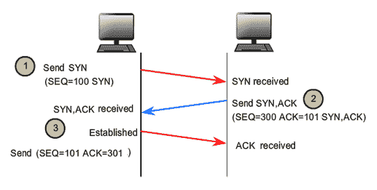
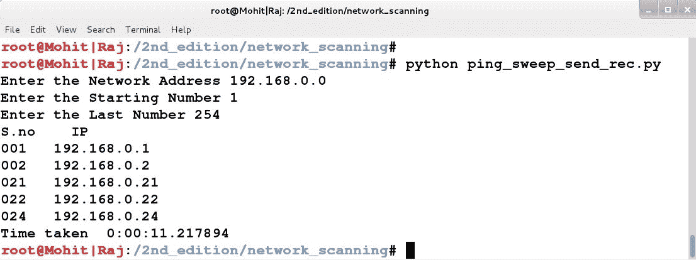
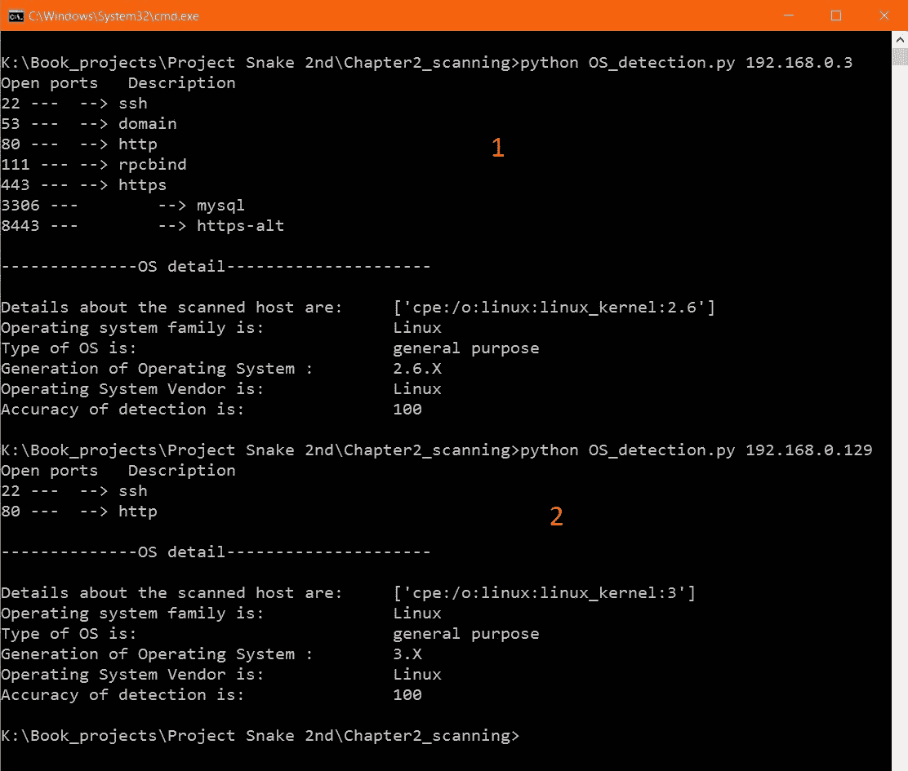
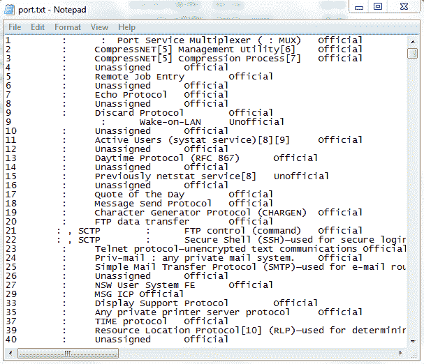

# 扫描渗透测试

网络扫描是指一组程序，用于调查活动主机、主机类型、开放端口和主机上运行的服务类型。网络扫描是情报收集的一部分，攻击者可以通过它创建目标组织的概况。

在本章中，我们将涵盖以下主题：

+   如何检查活动系统

+   Ping 扫描

+   TCP 扫描程序

+   如何创建一个高效的 IP 扫描程序

+   运行在目标机器上的服务

+   端口扫描的概念

+   如何创建一个高效的端口扫描程序

您应该对 TCP/IP 层通信有基本的了解。在进一步进行之前，应清楚**协议数据单元**（**PDU**）的概念。

PDU 是协议中指定的数据单元。这是每一层的数据的通用术语：

+   对于应用层，PDU 表示数据

+   对于传输层，PDU 表示一个段

+   对于互联网或网络层，PDU 表示一个数据包

+   对于数据链路层或网络访问层，PDU 表示帧

+   对于物理层，即物理传输，PDU 表示位

# 如何检查网络中的活动系统以及活动系统的概念

Ping 扫描涉及向主机发送**ICMP ECHO 请求**。如果主机活动，它将返回**ICMP ECHO 回复**，如下图所示：


ICMP 请求和回复

操作系统的`ping`命令提供了检查主机是否活动的功能。考虑一种情况，您必须测试完整的 IP 地址列表。在这种情况下，如果您逐个测试 IP 地址，将需要大量的时间和精力。为了处理这种情况，我们使用 ping 扫描。

# Ping 扫描

Ping 扫描用于通过发送 ICMP ECHO 请求和 ICMP ECHO 回复从一系列 IP 地址中识别活动主机。从子网和网络地址，攻击者或渗透测试人员可以计算网络范围。在本节中，我将演示如何利用操作系统的 ping 功能。

首先，我将编写一个简单而小的代码片段，如下所示：

```py
import os
response = os.popen('ping -n 1 10.0.0.1')
for line in response.readlines():
    print line,
```

在前面的代码中，`import os`导入 OS 模块，以便我们可以在 OS 命令上运行。下一行，`os.popen('ping -n 1 10.0.0.1')`，将 DOS 命令作为字符串传递，并返回与命令的标准输入或输出流连接的类似文件的对象。 “ping -n 1 10.0.0.1”命令是 Windows OS 命令，发送一个 ICMP ECHO 请求数据包。通过阅读“os.psopen（）”函数，您可以拦截命令的输出。输出存储在`response`变量中。在下一行中，使用“readlines（）”函数来读取类似文件对象的输出。

程序的输出如下：

```py
  G:Project SnakeChapter 2ip>ips.py
  Pinging 10.0.0.1 with 32 bytes of data:
  Reply from 10.0.0.1: bytes=32 time=3ms TTL=64
  Ping statistics for 10.0.0.1:
      Packets: Sent = 1, Received = 1, Lost = 0 (0% loss),
  Approximate round trip times in milli-seconds:
      Minimum = 3ms, Maximum = 3ms, Average = 3ms
```

输出显示“回复”，“字节”，“时间”和`TTL`值，表示主机是活动的。考虑程序对 IP`10.0.0.2`的另一个输出：

```py
  G:Project SnakeChapter 2ip>ips.py
  Pinging 10.0.0.2 with 32 bytes of data:
  Reply from 10.0.0.16: Destination host unreachable.
  Ping statistics for 10.0.0.2:
      Packets: Sent = 1, Received = 1, Lost = 0 (0% loss),
```

前面的输出显示主机未活动。

前面的代码对于正确的功能非常重要，类似于汽车的引擎。为了使其完全功能，我们需要修改代码，使其与平台无关，并产生易于阅读的输出。

我希望我的代码适用于一系列 IP 地址：

```py
import os
net = raw_input("Enter the Network Address ")
net1= net.split('.')
print net1
a = '.'
net2 = net1[0]+a+net1[1]+a+net1[2]+a
print net2
st1 = int(raw_input("Enter the Starting Number "))
en1 = int(raw_input("Enter the Last Number "))
```

前面的代码要求子网的网络地址，但您可以提供子网的任何 IP 地址。下一行，`net1= net.split('.')`，将 IP 地址分成四部分。`net2 = net1[0]+a+net1[1]+a+net1[2]+a`语句形成网络地址。最后两行要求一系列 IP 地址。

要使其与平台无关，请使用以下代码：

```py
import os
import platform
oper = platform.system()
if (oper=="Windows"):
  ping1 = "ping -n 1 "
elif (oper== "Linux"):
  ping1 = "ping -c 1 "
else :
  ping1 = "ping -c 1 "  
```

前面的代码确定了代码是在 Windows 操作系统上运行还是在 Linux 平台上。`oper = platform.system()`语句将此通知给正在运行的操作系统，因为 Windows 和 Linux 中的`ping`命令不同。Windows 操作系统使用`ping -n 1`发送一个 ICMP ECHO 请求数据包，而 Linux 使用`ping -c 1`。

现在，让我们看看完整的代码如下：

```py
import os
import platform
from datetime import datetime
net = raw_input("Enter the Network Address ")
net1= net.split('.')
a = '.'
net2 = net1[0]+a+net1[1]+a+net1[2]+a
st1 = int(raw_input("Enter the Starting Number "))
en1 = int(raw_input("Enter the Last Number "))
en1=en1+1
oper = platform.system()

if (oper=="Windows"):
  ping1 = "ping -n 1 "
elif (oper== "Linux"):
  ping1 = "ping -c 1 "
else :
  ping1 = "ping -c 1 "
t1= datetime.now()
print "Scanning in Progress"
for ip in xrange(st1,en1):
  addr = net2+str(ip)
  comm = ping1+addr
  response = os.popen(comm)
  for line in response.readlines():
    if 'ttl' in line.lower():
      break
    if 'ttl' in line.lower():
      print addr, "--> Live"

t2= datetime.now()
total =t2-t1
print "scanning complete in " , total
```

在前面的代码中有一些新的东西。`for ip in xrange(st1,en1):`语句提供数字值，即 IP 地址的最后一个八位值。在`for`循环内，`addr = net2+str(ip)`语句使其成为一个完整的 IP 地址，`comm = ping1+addr`语句使其成为一个完整的操作系统命令，传递给`os.popen(comm)`。`if(line.count("TTL")):`语句检查行中是否出现`TTL`。如果在行中找到任何`TTL`值，则使用`break`语句中断行的进一步处理。代码的下两行打印出找到`TTL`的 IP 地址。我使用`datetime.now()`来计算扫描所花费的总时间。

`ping_sweep.py`程序的输出如下：

```py
  G:Project SnakeChapter 2ip>python ping_sweep.py
  Enter the Network Address 10.0.0.1
  Enter the Starting Number 1
  Enter the Last Number 60
  Scanning in Progress
  10.0.0.1 --> Live
  10.0.0.2 --> Live
  10.0.0.5 --> Live
  10.0.0.6 --> Live
  10.0.0.7 --> Live
  10.0.0.8 --> Live
  10.0.0.9 --> Live
  10.0.0.10 --> Live
  10.0.0.11 --> Live
  scanning complete in  0:02:35.230000
```

要扫描 60 个 IP 地址，程序花费了 2 分钟 35 秒。

# TCP 扫描概念及其使用 Python 脚本的实现

Ping 扫描基于 ICMP ECHO 请求和 ICMP ECHO 回复。许多用户关闭了 ICMP ECHO 回复功能或使用防火墙阻止 ICMP 数据包。在这种情况下，您的 ping 扫描器可能无法工作。在这种情况下，您需要进行 TCP 扫描。我希望您熟悉三次握手，如下图所示：



为了建立连接，主机执行三次握手。建立 TCP 连接的三个步骤如下：

1.  客户端发送了一个带有**SYN**标志的段; 这意味着客户端请求服务器开始一个会话

1.  服务器以包含**ACK**和**SYN**标志的段的形式发送回复

1.  客户端以**ACK**标志响应

现在，让我们看看以下 TCP 扫描的代码：

```py
import socket 
from datetime import datetime
net= raw_input("Enter the IP address ")
net1= net.split('.')
a = '.'
net2 = net1[0]+a+net1[1]+a+net1[2]+a
st1 = int(raw_input("Enter the Starting Number "))
en1 = int(raw_input("Enter the Last Number "))
en1=en1+1
t1= datetime.now()
def scan(addr):
  sock= socket.socket(socket.AF_INET,socket.SOCK_STREAM)
  socket.setdefaulttimeout(1)
  result = sock.connect_ex((addr,135))
  if result==0:
    return 1
  else :
    return 0

def run1():
  for ip in xrange(st1,en1):
    addr = net2+str(ip)
    if (scan(addr)):
      print addr , "is live"

run1()
t2= datetime.now()
total =t2-t1
print "scanning complete in " , total
```

前面代码的上半部分与先前的代码相同。在这里，我们使用了两个函数。首先，`scan(addr)`函数使用套接字，如第一章中所讨论的，*Python 与渗透测试和网络*。`result = sock.connect_ex((addr,135))`语句返回一个错误指示器。如果操作成功，则错误指示器为`0`，否则为`errno`变量的值。在这里，我们使用端口`135`；这个扫描器适用于 Windows 系统。有一些端口，如`137`，`138`，`139`（NetBIOS 名称服务）和`445`（Microsoft-DSActive Directory）通常是开放的。因此，为了获得更好的结果，您必须更改端口并重复扫描。

`iptcpscan.py`程序的输出如下：

```py
  G:Project SnakeChapter 2ip>python iptcpscan.py
  Enter the IP address 10.0.0.1
  Enter the Starting Number 1
  Enter the Last Number 60
  10.0.0.8 is live
  10.0.0.11 is live
  10.0.0.12 is live
  10.0.0.15 is live
  scanning complete in  0:00:57.415000
  G:Project SnakeChapter 2ip>
```

让我们更改端口号。使用`137`，您将看到以下输出：

```py
  G:Project SnakeChapter 2ip>python iptcpscan.py
  Enter the IP address 10.0.0.1
  Enter the Starting Number 1
  Enter the Last Number 60
  scanning complete in  0:01:00.027000
  G:Project SnakeChapter 2ip>
```

该端口号将没有任何结果。再次更改端口号。使用`445`，输出将如下所示：

```py
  G:Project SnakeChapter 2ip>python iptcpscan.py
  Enter the IP address 10.0.0.1
  Enter the Starting Number 1
  Enter the Last Number 60
  10.0.0.5 is live
  10.0.0.13 is live
  scanning complete in  0:00:58.369000
  G:Project SnakeChapter 2ip>
```

前面三个输出显示`10.0.0.5`，`10.0.0.8`，`10.0.0.11`，`10.0.0.12`，`10.0.0.13`和`10.0.0.15`是活动的。这些 IP 地址正在运行 Windows 操作系统。这是一个让您检查 Linux 的常见开放端口并使 IP 成为完整 IP TCP 扫描器的练习。

# 如何在 Windows 中创建一个高效的 IP 扫描器

到目前为止，您已经看到了 ping 扫描仪和 IP TCP 扫描仪。想象一下，您购买了一辆拥有所有必要设施的汽车，但速度非常慢；您觉得这是浪费时间和金钱。当我们的程序执行非常缓慢时，情况也是如此。对于`ping_sweep.py`程序扫描 60 个主机，对于 TCP 扫描仪几乎花费了一分钟的相同 IP 地址范围，花费了 2 分钟 35 秒。这需要很长时间才能产生结果。但不用担心。Python 为您提供了多线程，这将使您的程序更快。

我已经写了一个关于多线程 ping 扫描的完整程序，并将在本节中向您解释：

```py
import os
import collections
import platform
import socket, subprocess,sys
import threading
from datetime import datetime
''' section 1 '''

net = raw_input("Enter the Network Address ")
net1= net.split('.')
a = '.'
net2 = net1[0]+a+net1[1]+a+net1[2]+a
st1 = int(raw_input("Enter the Starting Number "))
en1 = int(raw_input("Enter the Last Number "))
en1 =en1+1
dic = collections.OrderedDict()
oper = platform.system()

if (oper=="Windows"):
  ping1 = "ping -n 1 "
elif (oper== "Linux"):
  ping1 = "ping -c 1 "
else :
  ping1 = "ping -c 1 "
t1= datetime.now()
'''section 2'''
class myThread (threading.Thread):
  def __init__(self,st,en):
    threading.Thread.__init__(self)
    self.st = st
    self.en = en
  def run(self):
    run1(self.st,self.en)
'''section 3'''         
def run1(st1,en1):
  #print "Scanning in Progess"
  for ip in xrange(st1,en1):
    #print ".",
    addr = net2+str(ip)
    comm = ping1+addr
    response = os.popen(comm)
    for line in response.readlines():
      if(line.count("TTL")):
        break
    if (line.count("TTL")):
      #print addr, "--> Live"
      dic[ip]= addr
''' Section 4  '''
total_ip =en1-st1
tn =20  # number of ip handled by one thread
total_thread = total_ip/tn
total_thread=total_thread+1
threads= []
try:
  for i in xrange(total_thread):
    en = st1+tn
    if(en >en1):
      en =en1
    thread = myThread(st1,en)
    thread.start()
    threads.append(thread)
    st1 =en
except:
  print "Error: unable to start thread"
print "t
Number of Threads active:", threading.activeCount()

for t in threads:
  t.join()
print "Exiting Main Thread"
dict = collections.OrderedDict(sorted(dic.items()))
for key in dict:
  print dict[key],"-->" "Live"
t2= datetime.now()
total =t2-t1
print "scanning complete in " , total
```

“第 1 节”部分与上一个程序相同。这里添加的一件事是有序字典，因为它记住了其内容添加的顺序。如果想知道哪个线程首先输出，那么有序字典适合这里。 “第 2 节”部分包含线程类，`class myThread (threading.Thread):`语句初始化线程类。`self.st = st`和`self.en = en`语句获取 IP 地址的起始和结束范围。 “第 3 节”部分包含`run1`函数的定义，它是汽车的引擎，并由每个具有不同 IP 地址范围的线程调用。`dic[ip]= addr`语句将主机 ID 存储为有序字典中的键，并将 IP 地址存储为值。 “第 4 节”语句在此代码中是全新的；`total_ip`变量是要扫描的 IP 地址总数。

`tn =20`变量的重要性在于它表示一个线程将扫描 20 个 IP 地址。`total_thread`变量包含需要扫描`total_ip`的总线程数，它表示 IP 地址的数量。`threads= []`语句创建一个将存储线程的空列表。`for`循环，`for i in xrange(total_thread):`，产生线程：

```py
en = st1+tn
  if(en >en1):
    en =en1
  thread = myThread(st1,en)
  thread.start()
  st1 =en
```

前面的代码生成了 20-20 个 IP 地址的范围，例如`st1-20, 20-40 ......-en1`。`thread = myThread(st1,en)`语句是线程类的线程对象：

```py
for t in threads:
  t.join()
```

前面的代码终止了所有线程。接下来的一行，`dict = collections.OrderedDict(sorted(dic.items()))`，创建了一个新的排序字典`dict`，其中按顺序包含 IP 地址。接下来的行按顺序打印活动 IP。`threading.activeCount()`语句显示了产生了多少个线程。一图胜千言。以下图表也是如此：

！[](img/245d5e07-b312-4e07-815f-226ba9ef1023.png)

创建和处理线程

`ping_sweep_th_.py`程序的输出如下：

```py
  G:Project SnakeChapter 2ip>python ping_sweep_th.py
  Enter the Network Address 10.0.0.1
  Enter the Starting Number 1
  Enter the Last Number 60
          Number of Threads active: 4
  Exiting Main Thread
  10.0.0.1 -->Live
  10.0.0.2 -->Live
  10.0.0.5 -->Live
  10.0.0.6 -->Live
  10.0.0.10 -->Live
  10.0.0.13 -->Live
  scanning complete in  0:01:11.817000
```

扫描已在一分 11 秒内完成。作为练习，更改`tn`变量的值，将其从`2`设置为`30`，然后研究结果并找出`tn`的最合适和最佳值。

到目前为止，您已经看到了多线程的 ping 扫描；现在，我编写了一个使用 TCP 扫描方法的多线程程序：

```py
import threading
import time
import socket, subprocess,sys
import thread
import collections
from datetime import datetime
'''section 1''' 
net = raw_input("Enter the Network Address ")
st1 = int(raw_input("Enter the starting Number  "))
en1 = int(raw_input("Enter the last Number "))
en1=en1+1
dic = collections.OrderedDict()
net1= net.split('.')
a = '.'
net2 = net1[0]+a+net1[1]+a+net1[2]+a
t1= datetime.now()
'''section 2'''
class myThread (threading.Thread):
  def __init__(self,st,en):
    threading.Thread.__init__(self)
    self.st = st
    self.en = en
  def run(self):
    run1(self.st,self.en)

'''section 3'''
def scan(addr):
  sock= socket.socket(socket.AF_INET,socket.SOCK_STREAM)
  socket.setdefaulttimeout(1)
  result = sock.connect_ex((addr,135))
  if result==0:
    sock.close()
    return 1
  else :
    sock.close()

def run1(st1,en1):
  for ip in xrange(st1,en1):
    addr = net2+str(ip)
    if scan(addr):
      dic[ip]= addr
'''section 4'''
total_ip =en1-st1
tn =20  # number of ip handled by one thread
total_thread = total_ip/tn
total_thread=total_thread+1
threads= []
try:
  for i in xrange(total_thread):
    #print "i is ",i
    en = st1+tn
    if(en >en1):
      en =en1
    thread = myThread(st1,en)
    thread.start()
    threads.append(thread)
    st1 =en
except:
  print "Error: unable to start thread"
print "t Number of Threads active:", threading.activeCount()
for t in threads:
  t.join()
print "Exiting Main Thread"
dict = collections.OrderedDict(sorted(dic.items()))
for key in dict:
  print dict[key],"-->" "Live"
t2= datetime.now()
total =t2-t1
print "scanning complete in " , total
```

理解该程序不应该有困难。以下图表显示了所有内容：

！[](img/e11fcf5c-49fc-400b-88d8-956710f96afb.png)

IP TCP 扫描仪

该类以范围作为输入并调用`run1()`函数。 “第 4 节”部分创建一个线程，它是类的实例，获取一个短范围，并调用`run1()`函数。`run1()`函数具有一个 IP 地址，获取来自线程的范围，并生成输出。

`iptcpscan.py`程序的输出如下：

```py
  G:Project SnakeChapter 2ip>python iptcpscan_t.py
  Enter the Network Address 10.0.0.1
  Enter the starting Number  1
  Enter the last Number 60
          Number of Threads active: 4
  Exiting Main Thread
  10.0.0.5 -->Live
  10.0.0.13 -->Live
  scanning complete in  0:00:20.018000
```

20 秒内扫描 60 个 IP 地址；性能还不错。作为练习，将两个扫描仪合并成一个扫描仪。

# 如何在 Linux 中创建高效的 IP 扫描仪

之前的 IP 扫描器可以在 Windows 和 Linux 上运行。现在，我要解释一个超级快的 IP 扫描器，但它只能在 Linux 机器上运行。在前面的代码中，我们使用了 ping 实用程序，但现在我们将使用我们自己的 ping 数据包来进行 ping。

# 基于 Linux 的 IP 扫描器的概念

IP 扫描器背后的概念非常简单。我们将产生多个线程，向不同的 IP 地址发送 ping 数据包。一个守护线程将负责捕获这些 ping 数据包的响应。要运行 IP 扫描器，您需要安装 ping 模块。您可以从这里下载 ping 模块的`.zip`文件：[`pypi.python.org/pypi/ping`](https://pypi.python.org/pypi/ping)。只需解压缩或解压 tar，浏览文件夹，并运行以下命令：

```py
python setup.py install
```

如果您不想安装模块，那么只需从解压后的文件夹中复制`ping.py`文件，并将其粘贴到您将要运行 IP 扫描器代码的文件夹中。

让我们看看`ping_sweep_send_rec.py`的代码：

```py
import socket
from datetime import datetime
import ping
import struct
import binascii
from threading import Thread
import time

s = socket.socket(socket.PF_PACKET, socket.SOCK_RAW, socket.htons(0x0800))

net = raw_input("Enter the Network Address ")
net1= net.rsplit('.',1)
net2 = net1[0]+'.'
start1 = int(raw_input("Enter the Starting Number "))
end1 = int(raw_input("Enter the Last Number "))
end1 =end1+1

seq_ip = []
total_ip =end1-start1
tn =10 # number of ip handled by one thread
total_thread = total_ip/tn
total_thread=total_thread+1
threads= []
t1= datetime.now()

def send_ping(st1,en1):
  for each in xrange(st1,en1):
    try:
      ip = net2+str(each)
      ping.do_one(ip,1,32)
    except Exception as e :
      print "Error in send_ping", e

def icmp_sniff():
  s = socket.socket(socket.PF_PACKET, socket.SOCK_RAW, 8)

  while True:
    pkt = s.recvfrom(2048)
    num = pkt[0][14].encode('hex')
    ip_length = (int(num) % 10) * 4
    ipheader = pkt[0][14:14+ip_length]
    icmp_h =pkt[0][14+ip_length]
    ip_hdr = struct.unpack("!8sBB2s4s4s",ipheader[:20])
    icmp_hdr = struct.unpack("!B",icmp_h)
    if(ip_hdr[2]==1) and (icmp_hdr[0]==0):
      ip = socket.inet_ntoa(ip_hdr[4])
      ip1= ip.rsplit('.',1)
      list_temp = [ip1[1].zfill(3),ip]
      seq_ip.append(list_temp)

scan_thread = Thread(target=icmp_sniff)
scan_thread.setDaemon(True)
scan_thread.start()
st1 = start1

try:
    for i in xrange(total_thread):
    en = st1+tn
    if(en >end1):
      en =end1
    ping_thread = Thread(target=send_ping,args=(st1,en,) )
    ping_thread.start()
    threads.append(ping_thread)
    st1 =en

except Exception as e :
     print "Error in Thread", e

for t in threads:
    t.join()
time.sleep(1)
seq_ip.sort(key=lambda x: int(x[0]))
print "S.no\t","IP"
for each in seq_ip:
  print each[0]," ", each[1]

t2= datetime.now()
print "Time taken ", t2-t1
```

在前面的代码中，IP 计算和线程创建部分与我们之前看到的代码块非常相似。`send_ping`函数由线程调用，以便使用 ping 模块发送 ping 数据包。在语法`ping.do_one(ip,1,32)`中，第二个和第三个参数分别表示超时和数据包大小。因此，我将`1`设置为超时，`32`设置为 ping 数据包大小。`icmp_sniff`中的代码可能对您来说是新的。您将在第三章中学习所有语法的详细信息，即*嗅探和渗透测试*。简而言之，`icmp_sniff`函数正在从传入的 ICMP 回复数据包中捕获发送者的 IP 地址。正如我们已经知道的那样，ICMP 回复数据包的代码是`0`。语法`if(ip_hdr[2]==1)`和`(icmp_hdr[0]==0)`表示我们只想要 ICMP 和 ICMP 回复数据包。

让我们运行代码并查看输出：



前面的输出显示，程序只需要大约 11 秒就可以对 254 个主机进行扫描。在前面的代码中，我们设置了每个线程 10 个 IP 地址。您可以更改每个线程的 IP 地址。尝试不同的值并优化每个线程的 IP 值。

# 使用 Python 的 nmap

这一部分专门为 nmap 爱好者准备。您可以在 Python 中使用`nmap`。您只需要安装`python-nmap`模块和`nmap`。安装它们的命令非常简单。通过使用 pip，我们可以安装`python-nmap`：

```py
pip install python-nmap
```

安装`python-nmap`模块后，您可以通过导入来检查`nmap`模块。如果导入时没有错误，那么这意味着它已成功安装。让我们看看`nmap`里面有什么：

```py
>>>import nmap
>>> dir(nmap)
['ET', 'PortScanner', 'PortScannerAsync', 'PortScannerError', 'PortScannerHostDict', 'PortScannerYield', 'Process', '__author__', '__builtins__', '__doc__', '__file__', '__last_modification__', '__name__', '__package__', '__path__', '__version__', 'convert_nmap_output_to_encoding', 'csv', 'io', 'nmap', 'os', 're', 'shlex', 'subprocess', 'sys']
```

我们将使用`PortScanner`类来实现这一点。让我们看看代码，然后运行它：

```py
import nmap, sys
syntax="OS_detection.py <hostname/IP address>"
if len(sys.argv) == 1:
 print (syntax)
 sys.exit()
host = sys.argv[1]
nm=nmap.PortScanner()
open_ports_dict = nm.scan(host, arguments="-O").get("scan").get(host).get("tcp")
print "Open ports ", " Description"
port_list = open_ports_dict.keys()
port_list.sort()
for port in port_list:
 print port, "---\t-->",open_ports_dict.get(port)['name']
print "\n--------------OS detail---------------------\n"
print "Details about the scanned host are: \t", nm[host]['osmatch'][0]['osclass'][0]['cpe']
print "Operating system family is: \t\t", nm[host]['osmatch'][0]['osclass'][0]['osfamily']
print "Type of OS is: \t\t\t\t", nm[host]['osmatch'][0]['osclass'][0]['type']
print "Generation of Operating System :\t", nm[host]['osmatch'][0]['osclass'][0]['osgen']
print "Operating System Vendor is:\t\t", nm[host]['osmatch'][0]['osclass'][0]['vendor']
print "Accuracy of detection is:\t\t", nm[host]['osmatch'][0]['osclass'][0]['accuracy']
```

前面的代码非常简单：只需创建一个`nm=nmap.PortScanner()`对象。当您调用`nm.scan(host, arguments="-O")`方法时，您将获得一个非常复杂的字典。以下输出是字典的一部分：

```py
 'scan': {'192.168.0.1': {'status': {'state': 'up', 'reason': 'localhost-response'}, 'uptime': {'seconds': '7191', 'lastboot': 'Mon Mar 19 20:43:41 2018'}, 'vendor': {}, 'addresses': {'ipv4': '192.168.0.1'}, 'tcp': {902: {'product': '', 'state': 'open', 'version': '', 'name': 'iss-realsecure', 'conf': '3', 'extrainfo': '', 'reason': 'syn-ack', 'cpe': ''}, 135: {'product': '', 'state': 'open', 'version': '', 'name': 'msrpc', 'conf': '3', 'extrainfo': '', 'reason': 'syn-ack', 'cpe': ''}, 139: {'product': '', 'state': 'open', 'version': '', 'name': 'netbios-ssn', 'conf': '3', 'extrainfo': '', 'reason': 'syn-ack', 'cpe': ''}, 5357: {'product': '', 'state': 'open', 'version': '', 'name': 'wsdapi', 'conf': '3', 'extrainfo': '', 'reason': 'syn-ack', 'cpe': ''}, 912: {'product': '', 'state': 'open', 'version': '', 'name': 'apex-mesh', 'conf': '3', 'extrainfo': '', 'reason': 'syn-ack', 'cpe': ''}, 445: {'product': '', 'state': 'open', 'version': '', 'name': 'microsoft-ds', 'conf': '3', 'extrainfo': '', 'reason': 'syn-ack', 'cpe': ''}}, 'hostnames': [{'type': '', 'name': ''}], 'osmatch': [{'osclass': [{'osfamily': 'Windows', 'vendor': 'Microsoft', 'cpe': ['cpe:/o:microsoft:windows_10'], 'type': 'general purpose', 'osgen': '10', 'accuracy': '100'}], 'line': '65478', 'name': 'Microsoft Windows 10 10586 - 14393', 'accuracy': '100'}], 'portused': [{'state': 'open', 'portid': '135', 'proto': 'tcp'}, {'state': 'closed', 'portid': '1', 'proto': 'tcp'}, {'state': 'closed', 'portid': '34487', 'proto': 'udp'}]}}}
```

从前面的代码中，很容易获得所需的信息；但需要基本的 Python 知识。让我们在四种不同的操作系统上运行代码。首先，我在 Redhat Linux 5.3 和 Debian 7 上运行了代码。您可以在以下输出中看到：



从前面的输出中，您可以看到`nmap`成功找到了开放的 TCP 端口和所需的操作系统详细信息。

让我们在 Windows 操作系统上运行`nmap`：


在前面的输出中，`nmap`成功找到了 Windows XP 和 Windows 10。`nmap`模块中还有许多其他功能。您可以自行探索这些功能并编写适当的代码。

# 目标机器上运行哪些服务？

现在，您已经熟悉了如何扫描 IP 地址并在子网中识别活动主机。在本节中，我们将讨论运行在主机上的服务。这些服务是使用网络连接的服务。使用网络连接的服务必须打开一个端口；从端口号，我们可以识别在目标机器上运行的服务。在渗透测试中，端口扫描的重要性在于检查主机上是否运行了非法服务。

考虑这样一种情况，用户通常使用他们的计算机下载游戏，在游戏安装过程中发现了特洛伊木马。特洛伊木马进入隐藏模式；打开一个端口；将所有按键，包括日志信息，发送给黑客。在这种情况下，端口扫描有助于识别在受害者计算机上运行的未知服务。

端口号范围从`0`到`65535`。众所周知的端口（也称为系统端口）是从`0`到`1023`的端口，保留用于特权服务。从`1024`到`49151`的端口是用于应用程序的注册端口，例如，端口`3306`保留用于 MySQL。

# 端口扫描器的概念

TCP 的三次握手作为端口扫描器的逻辑；在 TCP/IP 扫描器中，您已经看到端口（`137`或`135`）是 IP 地址范围中的一个。但是，在端口扫描器中，IP 只是一个范围内的一个端口。取一个 IP 并尝试连接用户给定的范围内的每个端口。如果连接成功，端口打开；否则，端口保持关闭。

我已经为端口扫描编写了一些非常简单的代码：

```py
import socket, subprocess,sys
from datetime import datetime

subprocess.call('clear',shell=True)
rmip = raw_input("t Enter the remote host IP to scan:")
r1 = int(raw_input("t Enter the start port numbert"))
r2 = int (raw_input("t Enter the last port numbert"))
print "*"*40
print "n Mohit's Scanner is working on ",rmip
print "*"*40

t1= datetime.now()
try:
  for port in range(r1,r2):
    sock= socket.socket(socket.AF_INET,socket.SOCK_STREAM)
    socket.setdefaulttimeout(1)

    result = sock.connect_ex((rmip,port))
    if result==0:
      print "Port Open:-->t", port
      # print desc[port]
    sock.close()

except KeyboardInterrupt:
  print "You stop this "
  sys.exit()

except Exception as e :
  print e
  sys.exit()

t2= datetime.now()

total =t2-t1
print "scanning complete in " , total
```

主要逻辑已经写在`try`块中，表示汽车的引擎。您熟悉语法。让我们对输出进行研究和开发。

`portsc.py`程序的输出如下：

```py
  root@Mohit|Raj:/port#python portsc.py 
         Enter the remote host IP to scan:192.168.0.3
         Enter the start port number    1
         Enter the last port number     4000
  ****************************************
   Mohit's Scanner is working on  192.168.0.3
  ****************************************
  Port Open:-->      22
  Port Open:-->      80
  Port Open:-->      111
  Port Open:-->      443
  Port Open:-->      924
  Port Open:-->      3306
  scanning complete in  0:00:00.766535
```

前面的输出显示，端口扫描器在`0.7`秒内扫描了 1,000 个端口；连接是完整的，因为目标机器和扫描器机器在同一个子网上。

让我们讨论另一个输出：

```py
    Enter the remote host IP to scan:10.0.0.1
    Enter the start port number 1
    Enter the last port number  4000
  ****************************************
  Mohit's Scanner is working on  10.0.0.1
  ****************************************
  Port Open:-->  23
  Port Open:-->  53
  Port Open:-->  80
  Port Open:-->  1780
  scanning complete in  1:06:43.272751
```

现在，让我们分析一下输出：扫描 4,000 个端口，扫描器花费了`1:06:43.272751`小时。这花了很长时间。拓扑结构是：

`192.168.0.10 --> 192.168.0.1 --> 10.0.0.16 ---> 10.0.0.1`

`192.168.0.1`和`10.0.0.16` IP 地址是网关接口。我们在`socket.setdefaulttimeout(1)`中设置了一秒，这意味着扫描机器将在每个端口上最多花费一秒。总共有 4,000 个端口，这意味着如果所有端口都关闭，那么总共花费的时间将是 4000 秒；如果我们将其转换成小时，将变成 1.07 小时，几乎等于我们程序的输出。如果我们设置`socket.setdefaulttimeout(.5)`，所需时间将减少到 30 分钟，这仍然是很长的时间。没有人会使用我们的扫描器。所需时间应该少于 100 秒扫描 4,000 个端口。

# 如何创建一个高效的端口扫描器

我已经提出了一些应该考虑的要点，以便获得一个良好的端口扫描器：

+   应该使用多线程以获得高性能

+   `socket.setdefaulttimeout(1)` 方法应根据情况设置

+   端口扫描器应该能够接受主机名和域名

+   端口应该提供端口号和服务名称

+   应该考虑端口扫描的总时间

+   要扫描端口`0`到`65535`，所需时间大约为 3 分钟

所以现在我已经编写了我的端口扫描器，我通常用于端口扫描：

```py
from threading import Thread
import time
import socket
from datetime import datetime
import cPickle
'''Section1'''
pickle_file = open("port_description.dat",'r') 
data=skill=cPickle.load(pickle_file) 

def scantcp(r1,r2,):
  try:
    for port in range(r1,r2):
      sock= socket.socket(socket.AF_INET,socket.SOCK_STREAM)
      socket.setdefaulttimeout(c)
      result = sock.connect_ex((rmip,port))
      if result==0:
        print "Port Open:-->\t", port,"--", data.get(port, "Not in Database")
      sock.close()

  except Exception as e:
    print e

'''Section 2 '''
print "*"*60
print " \tWelcome, this is the Port scanner \n "
d=raw_input("\tPress D for Domain Name or Press I for IP Address\t") 

if (d=='D' or d=='d'):
    rmserver = raw_input("\t Enter the Domain Name to scan:\t")
    rmip = socket.gethostbyname(rmserver)
elif(d=='I' or d=='i'):
    rmip = raw_input("\t Enter the IP Address to scan: ")

else: 
    print "Wrong input"

port_start1 = int(raw_input("\t Enter the start port number\t"))
port_last1 = int(raw_input("\t Enter the last port number\t"))
if port_last1>65535:
  print "Range not Ok"
  port_last1 = 65535
  print "Setting last port 65535"
conect=raw_input("For low connectivity press L and High connectivity Press H\t")

if (conect=='L' or conect=='l'):
    c =1.5

elif(conect =='H' or conect=='h'):
    c=0.5

else:
    print "\twrong Input"

'''Section 3'''
print "\n Mohit's port Scanner is working on ",rmip
print "*"*60
t1= datetime.now()
total_ports=port_last1-port_start1

ports_by_one_thread =30
                   # tn number of port handled by one thread
total_threads=total_ports/ports_by_one_thread # tnum number of threads
if (total_ports%ports_by_one_thread!= 0):
    total_threads= total_threads+1

if (total_threads > 300):
  ports_by_one_thread= total_ports/300
  if (total_ports%300 !=0):
    ports_by_one_thread= ports_by_one_thread+1

  total_threads = total_ports/ports_by_one_thread 
  if (total_ports%total_threads != 0):
    total_threads= total_threads+1

threads= []
start1 = port_start1
try:
  for i in range(total_threads):

    last1=start1+ports_by_one_thread
    # thread=str(i)
    if last1>=port_last1:
      last1 = port_last1
    port_thread = Thread(target=scantcp,args=(start1,last1,) )
    port_thread.start()
    threads.append(port_thread)
    start1=last1

except Exception as e :
     print e
'''Section 4'''
for t in threads:
    t.join()
print "Exiting Main Thread"
t2= datetime.now()
total =t2-t1
print "scanning complete in " , total

```

不要害怕看到完整的代码；我花了 2 周的时间。我将逐节向你解释完整的代码。在`section1`中，前两行与存储端口信息的数据库文件有关，这将在创建数据库文件时进行解释。`scantcp()`函数由线程执行。在`section 2`中，这是用于用户输入的。如果用户提供的端口范围超过`65535`，那么代码会自动处理错误。低连通性和高连通性意味着如果你在使用互联网，使用低连通性。如果你在自己的网络上使用代码，你可以使用高连通性。在`section 3`中，写入了线程创建逻辑。`30`个端口将由一个线程处理，但如果线程数超过`300`，则端口每个线程的方程将被重新计算。在`for`循环中，线程被创建，每个线程携带自己的端口范围。在`section 4`中，线程被终止。

我在进行了大量实验后编写了上述代码。

现在，是时候看`portsc15.py`程序的输出了：

```py
 K:\Book_projects\Project Snake 2nd\Chapter2_scanning>python port_scanner15.py
************************************************************
 Welcome, this is the Port scanner

 Press D for Domain Name or Press I for IP Address i
 Enter the IP Address to scan: 10.0.0.1
 Enter the start port number 1
 Enter the last port number 4000
For low connectivity press L and High connectivity Press H l

 Mohit's port Scanner is working on 10.0.0.1
************************************************************
Port Open:--> 875 -- Not in Database
Port Open:--> 3306 -- MySQL database system Official
Port Open:--> 80 -- QUIC (from Chromium) for HTTP Unofficial
Port Open:--> 111 -- ONC RPC (Sun RPC) Official
Port Open:--> 443 -- QUIC (from Chromium) for HTTPS Unofficial
Port Open:--> 22 -- , SCTP : Secure Shell (SSH)ΓÇöused for secure logins, file transfers (scp, sftp) and port forwarding Official
Port Open:--> 53 -- Domain Name System (DNS) Official
Exiting Main Thread
scanning complete in 0:00:31.778000

K:\Book_projects\Project Snake 2nd\Chapter2_scanning>
```

我们高效的端口扫描器给出了与之前简单扫描器相同的输出，但从性能的角度来看，有很大的差异。简单扫描器所花费的时间是`1:06:43.272751`，但新的多线程扫描器只花了 32 秒。它还显示了服务名称。让我们检查一下端口`1`到`50000`的更多输出：

```py
 K:\Book_projects\Project Snake 2nd\Chapter2_scanning>python port_scanner15.py
************************************************************
 Welcome, this is the Port scanner

 Press D for Domain Name or Press I for IP Address i
 Enter the IP Address to scan: 192.168.0.3
 Enter the start port number 1
 Enter the last port number 50000
For low connectivity press L and High connectivity Press H l

 Mohit's port Scanner is working on 192.168.0.3
************************************************************
Port Open:--> 22 -- , SCTP : Secure Shell (SSH)ΓÇöused for secure logins, file transfers (scp, sftp) and port forwarding Official
Port Open:--> 875 -- Not in Database
Port Open:--> 53 -- Domain Name System (DNS) Official
Port Open:--> 80 -- QUIC (from Chromium) for HTTP Unofficial
Port Open:--> 8443 -- SW Soft Plesk Control Panel, Apache Tomcat SSL, Promise WebPAM SSL, McAfee ePolicy Orchestrator (ePO) Unofficial
Port Open:--> 111 -- ONC RPC (Sun RPC) Official
Port Open:--> 443 -- QUIC (from Chromium) for HTTPS Unofficial
Port Open:--> 3306 -- MySQL database system Official
Exiting Main Thread
scanning complete in 0:02:48.718000
```

所花费的时间是 2 分钟 48 秒；我在高连通性下做了相同的实验，所花费的时间是`0:01:23.819774`，几乎是前一个的一半。

现在，我将教你如何创建一个包含所有端口号描述的数据库文件；让我们了解如何创建一个包含所有端口描述的 pickle 数据库文件。打开以下链接：[`en.wikipedia.org/wiki/List_of_TCP_and_UDP_port_numbers`](https://en.wikipedia.org/wiki/List_of_TCP_and_UDP_port_numbers)。

复制端口描述部分并将其保存在一个文本文件中。请参阅以下截图：



让我们看一下`creatdicnew.py`的代码，将前面的文件转换成一个`pickle`文件：

```py
import cPickle 
pickle_file = open("port_description.dat","w") 
file_name = raw_input("Enter the file name ")
f = open(file_name,"r")
dict1 = {}
for line in f:
  key, value = line.split(':', 1)

  dict1[int(key.strip())] = value.strip()

print "Dictionary is created"
cPickle.dump(dict1,pickle_file) 
pickle_file.close()
print "port_description.dat is created"
```

当你运行上述代码时，代码会要求你输入文本文件名。在给出文件名后，代码将把文本文件转换成一个名为`port_description.dat`的 pickle 文件。

# 总结

网络扫描是为了收集关于网络、主机和正在运行的服务的信息。网络扫描是通过使用操作系统的`ping`命令来完成的；ping 扫描利用了 ping 功能并扫描 IP 地址列表。有时，ping 扫描不起作用，因为用户可能关闭了他们的 ICMP ECHO 回复功能或使用防火墙来阻止 ICMP 数据包。在这种情况下，你的 ping 扫描器可能无法工作。在这种情况下，我们必须利用 TCP 三次握手；TCP 工作在传输层，所以我们必须选择我们想要进行 TCP 连接扫描的端口号。Windows 操作系统的一些端口是始终开放的，所以你可以利用这些开放的端口。第一个主要部分是专门用于网络扫描；当你进行网络扫描时，你的程序应该具有最大的性能并且需要最少的时间。为了显著提高性能，应该使用多线程。

在扫描活动主机之后，端口扫描用于检查特定主机上运行的服务；有时，一些程序使用允许特洛伊木马和端口扫描可以检测这些类型威胁的互联网连接。为了进行高效的端口扫描，多线程起着至关重要的作用，因为端口号范围从`0`到`65536`。要扫描一个庞大的列表，必须使用多线程。

在下一章中，您将看到嗅探及其两种类型：被动嗅探和主动嗅探。您还将学习如何捕获数据，数据包构建的概念，以及使用 Scapy 库制作自定义数据包。
