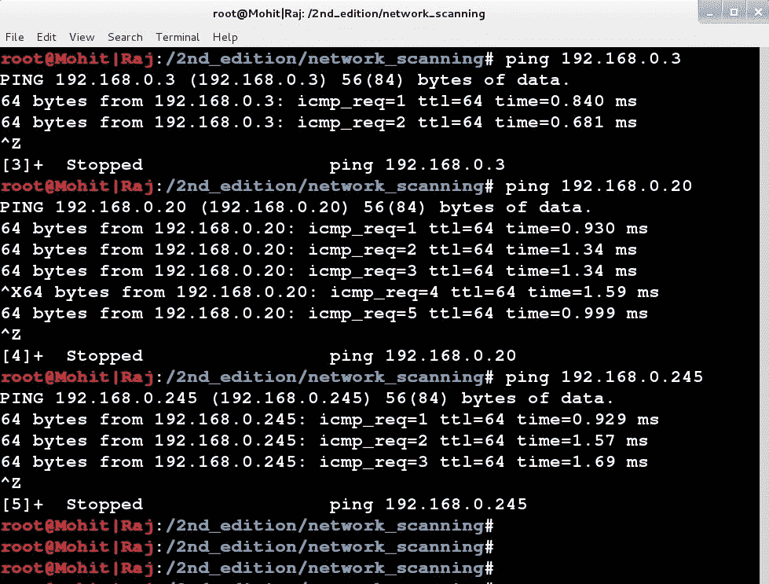
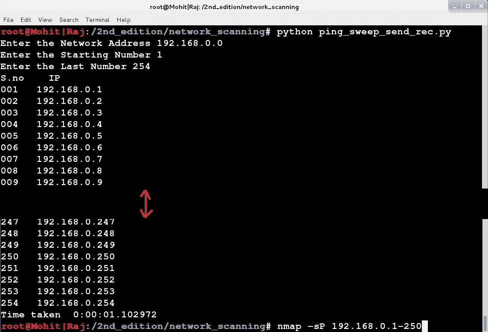
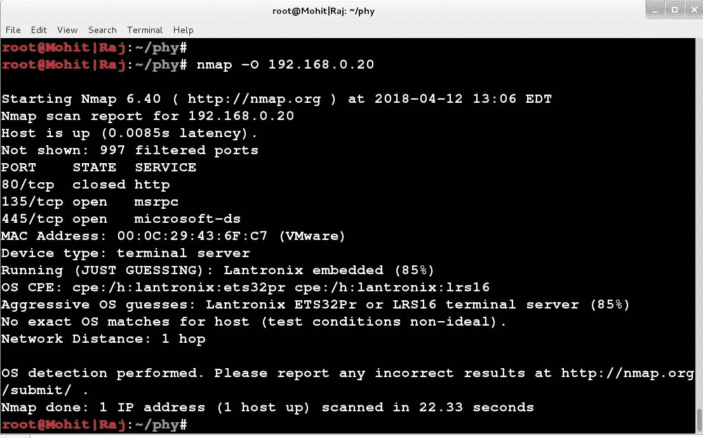

# 蜜罐-为攻击者建立陷阱

在第五章中，*无线渗透*，您看到了各种网络攻击以及如何防范。在本章中，您将看到一些积极的方法。在[第二章](https://cdp.packtpub.com/python_penetration_testing_essentials__second_edition/wp-admin/post.php?post=52&action=edit)，*扫描渗透*，您学习了使用 ping 扫描进行 IP 扫描以及使用 TCP 连接扫描进行端口扫描。但是当 ping 扫描和端口扫描代码给出虚假目标时会发生什么？您会尝试利用虚假目标。设置为诱使攻击者的诱饵机器记录攻击者的动作。在看到所有的技巧和攻击之后，管理员可以制定新的网络加固策略。在本章中，我们将使用 Python 代码来完成任务。

在本章中，我们将学习以下主题：

+   伪 ARP 回复

+   伪 ping 回复

+   伪端口扫描回复

+   对 nmap 的伪 OS 签名回复

+   伪 Web 服务器回复

ARP 协议属于 TCP/IP 第 1 层，网络访问层。

# 技术要求

用户需要在系统上安装 Python 2.7.x。最后，要使用本书的 Git 存储库，用户需要安装 Git。

本章的代码文件可以在 GitHub 上找到：

[`github.com/PacktPublishing/Python-Penetration-Testing-Essentials-Second-Edition/tree/master/Chapter06`](https://github.com/PacktPublishing/Python-Penetration-Testing-Essentials-Second-Edition/tree/master/Chapter06)

查看以下视频，以查看代码的运行情况：

[`goo.gl/jbgbBU`](https://goo.gl/jbgbBU)

# 伪 ARP 回复

在本节中，我们将学习如何发送伪 ARP 回复。伪 ARP 回复程序是为了伪 ping 回复而制作的，因为当攻击者向特定 IP 发送 ping 请求时，攻击者机器首先发送 ARP 请求以获取 MAC 地址。

当攻击者在蜜罐的子网上或子网外时，蜜罐将发送伪回复。让我们看看拓扑图：


我使用了三台机器：运行蜜罐代码的 Debian，作为网关的 RHEL，以及作为攻击者机器的 Kali Linux。

让我们看看伪回复代码。代码名称是`arp_reply.py`：

+   代码将使用以下模块：

```py
      import socket
      import struct
      import binascii
      import Queue
      import threading
      import sys
```

+   在以下代码中，创建了两个套接字。一个用于接收器，一个用于发送回复数据包。创建了一个全局队列`Q`，如下所示：

```py
      mysocket = socket.socket(socket.PF_PACKET, socket.SOCK_RAW, 
      socket.ntohs(0x0806))
      mysocket_s = socket.socket(socket.PF_PACKET, socket.SOCK_RAW, 
      socket.ntohs(0x0806))
      mysocket_s.bind(('eth0',socket.htons(0x0806)))

      Q = Queue.Queue()
```

+   以下函数接收传入的帧。`arp_l = struct.unpack("!2s2sss2s6s4s6s4s",arp_h)`代码解包 ARP 数据包，`if arp_l[4] == '\x00\x01':`语法只广播 ARP 数据包。`Q.put([eth,arp_l])`语法将数据包放入全局队列`Q`中，如下所示：

```py
      def arp_receiver():
        while True:
          pkt = mysocket.recvfrom(1024)
          ethhead = pkt[0][0:14]
          eth = struct.unpack("!6s6s2s",ethhead)
          binascii.hexlify(eth[2])
          arp_h = pkt[0][14:42]
          arp_l = struct.unpack("!2s2sss2s6s4s6s4s",arp_h)
          if arp_l[4] == '\x00\x01':
            Q.put([eth,arp_l])
```

+   以下函数从全局队列获取 ARP 数据包。该函数从用户提供的命令行参数中获取 MAC（当前机器 MAC）。在形成以太网和 ARP 数据包之后，`mysocket_s.send(target_packet)`语法发送数据包，如下所示：

```py
         def arp_sender():
            while True:
             main_list = Q.get()
             eth_header = main_list[0]
             arp_packet = main_list[1]
             mac_sender = sys.argv[1].decode('hex')
             eth1 = eth_header[1]+mac_sender+eth_header[-1]
             arp1 = "".join(arp_packet[0:4])
             arp1 = arp1+'\x00\x02'+mac_sender+   
             arp_packet[-1]+arp_packet[5]+arp_packet[6]
             target_packet = eth1+arp1
             mysocket_s.send(target_packet)
```

+   以下代码创建了两个线程，以并行方式运行接收器和发送器函数：

```py
      r = threading.Thread(target=arp_receiver)
      s = threading.Thread(target=arp_sender)
      r.start()
      s.start()
```

在运行代码之前，使用以下命令：

```py
iptables -A OUTPUT -o eth0 -j DROP
```

前面的命令禁用了内置的 TCP/IP 回复，因为现在我们的程序将发送回复。

让我们在 Debian 机器上使用以下命令来运行代码：

```py
python arp_reply.py <mac of machine>
```

在我的机器上，我已经给出如下：

```py
python arp_reply.py 000c29436fc7
```

现在`arp_reply`代码正在运行。现在我们必须运行会给出伪 ping 回复的伪代码。

# 伪 ping 回复

在本节中，您将学习如何发送伪 ping 回复数据包。在伪 ping 回复代码中，我没有使用任何库。

让我们理解代码。代码名称是`icmp_reply.py`。为了运行代码，您需要从[`pypi.python.org/pypi/ping/0.2`](https://pypi.python.org/pypi/ping/0.2)安装`ping`模块：

+   代码中使用了以下模块：

```py
      import socket
      import struct
      import binascii
      import ping
      import Queue
      import threading
      import sys
      import random
      import my_logger
```

+   以下代码定义了一个队列`Q`和两个套接字。一个套接字将用于接收数据包，另一个将用于发送数据包：

```py
      Q = Queue.Queue()
      IP_address = 0
      my_socket = socket.socket(socket.PF_PACKET, socket.SOCK_RAW, 
      socket.ntohs(0x0800))
      my_socket_s = socket.socket(socket.PF_PACKET, socket.SOCK_RAW, 
      socket.ntohs(0x0800))
      my_socket_s.bind(('eth0',socket.htons(0x0800)))
```

+   以下代码将用于计算 ICMP 回复数据包的校验和。代码非常复杂：

```py
      def calculate_checksum(source_string):
        countTo = (int(len(source_string) / 2)) * 2
        sum = 0
        count = 0
        # Handle bytes in pairs (decoding as short ints)
        loByte = 0
        hiByte = 0
        while count < countTo:
          if (sys.byteorder == "little"):
            loByte = source_string[count]
            hiByte = source_string[count + 1]
          else:
            loByte = source_string[count + 1]
            hiByte = source_string[count]
          sum = sum + (ord(hiByte) * 256 + ord(loByte))
          count += 2

        # Handle last byte if applicable (odd-number of bytes)
        # Endianness should be irrelevant in this case
        if countTo < len(source_string): # Check for odd length
          loByte = source_string[len(source_string) - 1]
          sum += ord(loByte)

        sum &= 0xffffffff # Truncate sum to 32 bits (a variance from 
        ping.c, which # uses signed ints, but overflow is unlikely in 
        ping)
   sum = (sum >> 16) + (sum & 0xffff) # Add high 16 bits to low 16 bits
   sum += (sum >> 16) # Add carry from above (if any)
   answer = ~sum & 0xffff # Invert and truncate to 16 bits
   answer = socket.htons(answer)

   return answer
```

+   以下函数用于计算 IPv4 数据包的校验和：

```py
      def ip_checksum(ip_header, size):
        cksum = 0
        pointer = 0
        while size > 1:
          cksum += int((ip_header[pointer] + ip_header[pointer+1]),16)
          size -= 2
          pointer += 2
        if size: #This accounts for a situation where the header is odd
          cksum += ip_header[pointer]

        cksum = (cksum >> 16) + (cksum & 0xffff)
        cksum += (cksum >>16)

        check_sum1= (~cksum) & 0xFFFF
        check_sum1 = "%x" % (check_sum1,)
        return check_sum1
```

+   以下函数负责为 ICMP 回复数据包创建 IPv4 头：

```py
      def ipv4_creator(ipv4_header):
        try:
          global IP_address
          field1,ip_id,field2,ttl,protocol,checksum,ip1,ip2
          =struct.unpack("!4s2s2sss2s4s4s", ipv4_header)
          num = str(random.randint(1000,9999))
          ip_id = num.decode('hex')
          checksum = '\x00\x00'
          ipv4_new_header =   
          field1+ip_id+field2+'40'.decode('hex')+protocol+ip2+ip1
          raw_tuple =   
          struct.unpack("!ssssssssssssssssss",ipv4_new_header) 
          # for checksum
          header_list= [each.encode('hex') for each in raw_tuple]
          check_sum= str(ip_checksum(header_list, len(header_list)))
          ipv4_new_header =   
          field1+ip_id+field2+'40'.decode('hex')+protocol
          +check_sum.decode('hex')+ip2+ip1
          if IP_address != ip1:
          my_logger.logger.info(socket.inet_ntoa(ip1))

          IP_address = ip1
          return ipv4_new_header
        except Exception as e :
          my_logger.logger.error(e)
```

+   以下函数生成 ICMP 回复数据包。在`ipv4_creator`和`icmp_creator`函数中，我使用了不同的方法来添加字段。您可以使用任何您喜欢的方法。在`IPv4_creator`函数中，我使用`ipv4_new_header = field1+ip_id+field2+'40'.decode('hex')+protocol+check_sum.decode('hex')+ip2+ip1`来添加字段，在`icmp_creator`中，我使用`struct.pack`来形成数据包：

```py
      def icmp_creator(icmp_header,icmp_data):
      try:
       dest_addr=""
       ICMP_REPLY = 0
       seq_number = 0
       identifier =0
       header_size = 8
       packet_size = 64
       type1, code, checksum, packet_id, seq_number =  
       struct.unpack("!BBHHH", icmp_header)
       cal_checksum = 0
       header = struct.pack("!BBHHH", ICMP_REPLY, 0, cal_checksum, 
       packet_id ,seq_number )
       cal_checksum = calculate_checksum(header +icmp_data)
       header = struct.pack("!BBHHH", ICMP_REPLY, 0, cal_checksum, 
       packet_id, seq_number )
       packet = header + icmp_data
       return packet
        except Exception as e :
          my_logger.logger.error(e)
```

+   以下函数创建了以太网头：

```py
      def ethernet_creator(eth_header):
        eth1,eth2,field1 = struct.unpack("!6s6s2s",eth_header)
        eth_header = eth2+eth1+field1
        return eth_header
```

+   以下代码接收传入的请求数据包。为简单起见，我为 IPv4 头部取了 20 个字节：

```py
      def receiver_icmp():
        while True:
          try:
            received_packet, addr = my_socket.recvfrom(1024)
            protocol_type = received_packet[23] 
            icmp_type = received_packet[34]
            protocol_type=struct.unpack("!B",protocol_type)[0]
            icmp_type = struct.unpack("!B",icmp_type)[0]
            if protocol_type==1 and icmp_type==8:
              eth_header = received_packet[0:14]
              ipv4_header = received_packet[14:34]
              icmpHeader = received_packet[34:42]
              icmp_data = received_packet[42:]
        data_tuple1 = (eth_header, ipv4_header, icmpHeader,icmp_data)
        Q.put(data_tuple1)
             except Exception as e :
               my_logger.logger.error(e)

```

+   以下函数发送 ICMP 回复数据包：

```py
      def sender_icmp():
        while True:
          try:
            data_tuple1 = Q.get()
            icmp_packet = icmp_creator(data_tuple1[2],data_tuple1[3])
            ipv4_packet = ipv4_creator(data_tuple1[1])
            eth_packet = ethernet_creator(data_tuple1[0])
            frame = eth_packet+ipv4_packet+icmp_packet
            my_socket_s.send(frame)
          except Exception as e :
            my_logger.logger.error(e)
```

+   以下代码创建了两个线程，分别运行接收和发送函数：

```py
      r = threading.Thread(target=receiver_icmp)
      s = threading.Thread(target=sender_icmp)
      r.start()
      s.start()
```

现在编码部分已经完成，请运行`code icmp_reply.py`。请确保`arp_reply`正在运行。要测试代码，只需从 Kali Linux ping 不同的 IP，如下图所示：



前面的输出显示代码运行正常。让我们使用第二章中的`ping_sweep_send_rec.py`代码进行测试，*扫描渗透测试*。请参阅以下屏幕截图：



我们正在为 100 个 IP 获得虚假回复。我们的下一个目标是给传输层提供虚假回复。

# 虚假端口扫描回复

在本节中，我们将看看如何在 TCP 层给出虚假回复。程序将对打开的端口给出虚假回复。对于这段代码，我们将使用 scapy 库，因为 TCP 头部非常复杂。程序名称是`tcp_trap.py`：

+   使用以下库和模块：

```py
      import socket
      import struct
      import binascii
      import Queue
      from scapy.all import *
      import threading
```

+   已创建原始套接字以接收传入数据包，如下所示：

```py
      my_socket = socket.socket(socket.PF_PACKET, socket.SOCK_RAW, 8)
      Q = Queue.Queue()
```

+   以下函数接收传入的 TCP/IP 数据包。很多行已经在第三章，*嗅探和渗透测试*中讨论过。`if（D_port==445`或`D_port==135`或`D_port==80`）：语法表明我们只对端口`445`、`135`和`80`感兴趣：

```py
      def receiver():
        while True:
        try:
         pkt = my_socket.recvfrom(2048)
         num=pkt[0][14].encode('hex')
         ip_length = (int(num)%10)*4
         ip_last_range = 14+ip_length
         ipheader = pkt[0][14:ip_last_range]
         ip_hdr = struct.unpack("!8sBB2s4s4s",ipheader)
         S_ip =socket.inet_ntoa(ip_hdr[4])
         D_ip =socket.inet_ntoa(ip_hdr[5])
         tcpheader = pkt[0][ip_last_range:ip_last_range+20]
         tcp_hdr = struct.unpack("!HHL4sBB6s",tcpheader)
         S_port = tcp_hdr[0]
         D_port = tcp_hdr[1]
         SQN = tcp_hdr[2]
         flags = tcp_hdr[5]
            if (D_port==445 or D_port==135 or D_port==80):
              tuple1 = (S_ip,D_ip,S_port,D_port,SQN,flags)
              Q.put(tuple1)

          except Exception as e:
            print e
```

+   以下函数发送 TCP SYN，ACK 标志启用的响应，端口为`445`和`135`，端口`80`发送 RST，ACK 标志：

```py
      def sender(): 
      while True:
        d_ip,s_ip,d_port,s_port,SQN,flag = Q.get()

        if (s_port==445 or s_port==135) and (flag==2):
        SQN= SQN+1
        print flag,"*"*100
        packet  
        =IP(dst=d_ip,src=s_ip)/TCP(dport=d_port,sport=s_port,
        ack=SQN,flags="SA",window=64240, 
            options=[('MSS',1460),("WScale",3)])
            #packet 
        =IP(dst=d_ip,src=s_ip)/TCP(dport=d_port,sport=s_port,
        ack=SQN,flags="SA")
          else :
            SQN= SQN+1
            packet 
        =IP(dst=d_ip,src=s_ip)/TCP(dport=d_port,sport=s_port,
        ack=SQN,seq=SQN,flags="RA",window=0) 
          send(packet) 
```

+   以下代码指示了线程的创建，一个用于处理接收函数，另外三个用于处理发送函数：

```py
      r = threading.Thread(target=receiver)
      r.start()

      for each in xrange(3):
        s = threading.Thread(target=sender)
        s.start()
```

由于 scapy，库代码变得非常简短。现在运行`tcp_trap.py`代码。确保`arp_reply.py`和`icmp_reply.py`代码也在运行。

从攻击者那里，机器运行`nmap`；请参阅以下屏幕截图：


在前面的输出中，我们使用了`nmap`和`portscanner_15.py`（[第二章](https://cdp.packtpub.com/python_penetration_testing_essentials__second_edition/wp-admin/post.php?post=52&action=edit)，*扫描渗透测试*）。`nmap`和 Python 代码都使用了三次握手过程。输出显示端口`135`和`445`是打开的。

# nmap 的虚假 OS 签名回复

在本节中，我们将创建一个虚假的 OS 签名。通过使用以下`nmap`，我们可以识别受害者机器的操作系统：

`nmap -O <ip-address>`：`nmap`发送七个 TCP/IP 精心制作的数据包，并使用自己的 OS 签名数据库评估响应。有关更多详细信息，您可以阅读[`nmap.org/misc/defeat-nmap-osdetect.html`](https://nmap.org/misc/defeat-nmap-osdetect.html)网页。

`nmap`需要至少一个开放和一个关闭的端口来识别操作系统。同样，我们将使用之前的所有代码。端口`445`和`135`作为开放端口，`80`作为关闭端口。

让我们运行`nmap`，如下截图所示：



它给出了不同的操作系统，而不是 Debian。通过学习`nmap`操作系统检测算法，您可以使代码变得更加复杂。

# 虚假的 Web 服务器回复

在本节中，您将学习如何创建一个虚假的 Web 服务器签名。这是应用层代码。本节的代码与之前的代码无关。为了获取服务器签名或横幅抓取，我将使用 ID Servetool。

让我们看看`fake_webserver.py`代码：

+   在程序中使用以下模块。`logger1`模块用于创建日志文件。稍后您将看到`logger1`的代码：

```py
   from BaseHTTPServer import BaseHTTPRequestHandler, HTTPServer
   import logger1
```

+   仔细看以下代码片段。`fakewebserver`类继承自`BaseHTTPRequestHandler`类。`send_response`方法覆盖了`BaseHTTPRequestHandler`类的方法，因为我们将我们的自定义消息发送为`self.send_header('Server', "mohit``raj")`。`log_date_time_string`和`send_header`方法以及`client_address`实例变量都是从`BaseHTTPRequestHandler`类继承的。在这里，我将`mohit raj`服务器名称发送为：

```py
      class fakewebserver(BaseHTTPRequestHandler):

      def send_response(self, code, message=None): #overriding

        self.log_request(code)
        if message is None:
            if code in self.responses:
                message = self.responses[code][0]
            else:
                message = ''
        if self.request_version != 'HTTP/0.9':
            self.wfile.write("%s %d %s\r\n" %
                             (self.protocol_version, code, message))

        self.send_header('Server', "mohit raj")
        self.send_header('Tip',"Stay away")
        self.send_header('Date', self.date_time_string())
        str1 = self.client_address[0]+" -- 
        "+self.log_date_time_string()
        logger1.logger.info(str1)
```

+   以下方法发送标头和响应代码：

```py
    def _set_headers(self):
        self.send_response(200)
        self.end_headers()
```

+   当收到`GET`请求时，将调用以下方法：

```py
    def do_GET(self):
        self._set_headers()
        self.wfile.write("<html><body><h1>hi!</h1></body></html>")
```

+   当收到`HEAD`请求时，将调用以下方法：

```py
    def do_HEAD(self):
        self._set_headers()
```

+   以下用于传入的`POST`请求：

```py
    def do_POST(self):
        self._set_headers()
        self.wfile.write("<html><body><h1>POST!</h1></body></html>")
```

+   以下函数用于启动服务器。将使用端口`80`。`serve_forever`方法处理请求，直到收到显式的`shutdown()`请求。该方法是从`SocketServer.BaseServer`类继承的：

```py
      def start(port=80):
          server_address = ('', port)
          httpd = HTTPServer(server_address, fakewebserver)
          print 'Starting Server...'
          httpd.serve_forever()
```

在另一台机器上运行代码。我正在使用 Windows 10 来运行代码。从第二台计算机上，使用工具 ID 服务器来查找服务器签名。我得到了以下输出：


从输出中，我们可以说我们的代码运行正常。因此，您可以编写自己的消息。

让我们看看`logger1`的代码：

```py
import logging
logger = logging.getLogger("honeypot")
logger.setLevel(logging.INFO)
fh = logging.FileHandler("live1.log")
formatter = logging.Formatter('%(levelname)s - %(message)s')
fh.setFormatter(formatter)
logger.addHandler(fh)
```

上面的代码创建了一个日志文件，告诉我们传入请求的客户端地址。

查看`live1.log`文件的输出，如下截图所示：


# 总结

在本章中，您学会了如何发送虚假的 ICMP（ping）回复。为了发送 ICMP 回复，必须运行 ARP 协议。通过同时运行这两个代码，它们在网络层上创建了一种错觉。但是，在运行代码之前，必须设置防火墙以丢弃传出帧。在传输层，进行了两个实验：虚假的端口开放和虚假的操作系统运行。通过更多了解`nmap`，可以创建特定操作系统的准确虚假响应。在应用层，Python Web 服务器代码提供了一个虚假的服务器签名。您可以根据自己的需要更改服务器签名。

在第七章中，*足迹打印 Web 服务器和 Web 应用程序*，您将学习如何足迹打印 Web 服务器。您还将学习如何获取 HTTP 的标头和横幅抓取
