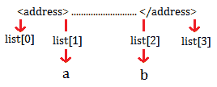
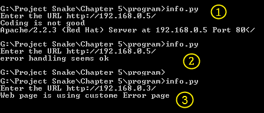
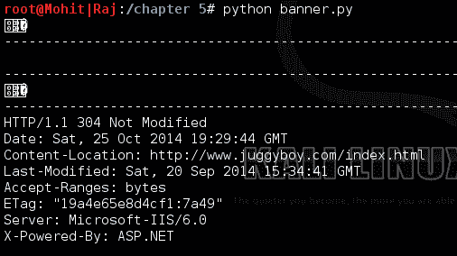

# 第七章：足迹定位 Web 服务器和 Web 应用程序

到目前为止，我们已经阅读了与数据链路层到传输层相关的四章内容。现在，我们将转向应用层渗透测试。在本章中，我们将讨论以下主题：

+   足迹定位 Web 服务器的概念

+   引入信息收集

+   HTTP 头检查

+   通过 BeautifulSoup 解析器从 smartwhois.com 获取网站的信息收集

+   网站的横幅抓取

+   Web 服务器的加固

# 足迹定位 Web 服务器的概念

渗透测试的概念不能用单一步骤来解释或执行，因此它被分成了几个步骤。足迹定位是渗透测试的第一步，攻击者试图收集有关目标的信息。在今天的世界中，电子商务正在迅速增长。因此，Web 服务器已成为黑客的主要目标。为了攻击 Web 服务器，我们必须首先了解什么是 Web 服务器。我们还需要了解 Web 服务器托管软件、托管操作系统以及 Web 服务器上运行的应用程序。获取这些信息后，我们可以构建我们的攻击。获取这些信息被称为足迹定位 Web 服务器。

# 引入信息收集

在这一部分，我们将尝试通过使用错误处理技术来获取有关 Web 软件、操作系统和运行在 Web 服务器上的应用程序的信息。从黑客的角度来看，从错误处理中获取信息并不那么有用。然而，从渗透测试人员的角度来看，这非常重要，因为在提交给客户的渗透测试最终报告中，您必须指定错误处理技术。

错误处理背后的逻辑是尝试在 Web 服务器中产生一个返回代码`404`的错误，并查看错误页面的输出。我编写了一个小代码来获取输出。我们将逐行查看以下代码：

```py
import re
import random
import urllib
url1 = raw_input("Enter the URL ")
u = chr(random.randint(97,122))
url2 = url1+u
http_r = urllib.urlopen(url2)

content= http_r.read()flag =0
i=0
list1 = []
a_tag = "<*address>"
file_text = open("result.txt",'a')

while flag ==0:
  if http_r.code == 404:
    file_text.write("--------------")
    file_text.write(url1)
    file_text.write("--------------n")

    file_text.write(content)
    for match in re.finditer(a_tag,content):

      i=i+1
      s= match.start()
      e= match.end()
      list1.append(s)
      list1.append(e)
    if (i>0):
      print "Coding is not good"
    if len(list1)>0:
      a= list1[1]
      b= list1[2]

      print content[a:b]
    else:
      print "error handling seems ok"
    flag =1
  elif http_r.code == 200:
    print "Web page is using custom Error page"
    break
```

我导入了三个模块，`re`、`random`和`urllib`，它们分别负责正则表达式、生成随机数和与 URL 相关的活动。`url1 = raw_input("Enter the URL ")`语句要求输入网站的 URL，并将此 URL 存储在`url1`变量中。然后，`u = chr(random.randint(97,122))`语句创建一个随机字符。下一条语句将此字符添加到 URL 中，并将其存储在`url2`变量中。然后，`http_r = urllib.urlopen(url2)`语句打开`url2`页面，并将此页面存储在`http_r`变量中。`content= http_r.read()`语句将网页的所有内容传输到 content 变量中：

```py
flag =0
i=0
list1 = []
a_tag = "<*address>"
file_text = open("result.txt",'a')
```

上述代码片段定义了`i`变量标志和一个空列表，我们将在后面讨论它的重要性。`a_tag`变量取值为`"<*address>"`。`file_text`变量是一个打开`result.txt`文件的文件对象，以附加模式打开。`result.txt`文件存储了结果。`while flag ==0:`语句表示我们希望`while`循环至少运行一次。`http_r.code`语句从 Web 服务器返回状态代码。如果页面未找到，它将返回`404`代码。

```py
file_text.write("--------------")
file_text.write(url1)
file_text.write("--------------n")

file_text.write(content)
```

上述代码片段将页面的输出写入`result.txt`文件。

`for match in re.finditer(a_tag,content)`:语句找到`a_tag`模式，这意味着错误页面中的`<address>`标签，因为我们对`<address>` `</address>`标签之间的信息感兴趣。`s= match.start()`和`e= match.end()`语句表示`<address>`标签的起点和终点，`list1.append(s)`。`list1.append(e)`语句将这些点存储在列表中，以便以后使用。`i`变量变得大于`0`，这表明错误页面中存在`<address>`标签。这意味着代码不好。`if len(list1)>0`:语句表示如果列表至少有一个元素，则变量`a`和`b`将成为关注点。下图显示了这些关注点：



获取地址标签值

`print content[a:b]`语句读取**a**和**b**点之间的输出，并设置`flag = 1`以终止`while`循环。`elif http_r.code == 200:`语句表示如果 HTTP 状态码为`200`，则将打印`"Web page is using custom Error page"`消息。在这种情况下，如果错误页面返回代码`200`，则意味着错误正在由自定义页面处理。

现在是时候运行输出了，我们将运行两次。

服务器签名打开和关闭时的输出：



程序的两个输出

前面的屏幕截图显示了服务器签名打开时的输出。通过查看此输出，我们可以说 Web 软件是 Apache，版本是 2.2.3，操作系统是 Red Hat。在下一个输出中，服务器没有来自服务器的信息，这意味着服务器签名已关闭。有时候，有人使用 Web 应用程序防火墙，例如 mod-security，它会提供一个虚假的服务器签名。在这种情况下，您需要检查`result.txt`文件以获取完整的详细输出。让我们检查`result.txt`的输出，如下图所示：


结果.txt 的输出

当有多个 URL 时，您可以列出所有这些 URL 并将它们提供给程序，这个文件将包含所有 URL 的输出。

# 检查 HTTP 头

通过查看网页的头部，您可以获得相同的输出。有时，服务器错误输出可以通过编程进行更改。但是，检查头部可能会提供大量信息。一小段代码可以给您一些非常详细的信息，如下所示：

```py
import urllib
url1 = raw_input("Enter the URL ")
http_r = urllib.urlopen(url1)
if http_r.code == 200:
  print http_r.headers
```

`print http_r.headers`语句提供了 Web 服务器的头部。

输出如下：


获取头部信息

您会注意到我们从程序中获得了两个输出。在第一个输出中，我们输入了`http://www.juggyboy.com/`作为 URL。程序提供了许多有趣的信息，例如`Server: Microsoft-IIS/6.0`和`X-Powered-By: ASP.NET`；它推断出网站托管在 Windows 机器上，Web 软件是 IIS 6.0，并且 ASP.NET 用于 Web 应用程序编程。

在第二个输出中，我提供了我的本地机器的 IP 地址，即`http://192.168.0.5/`。程序揭示了一些秘密信息，例如 Web 软件是 Apache 2.2.3，运行在 Red Hat 机器上，并且 PHP 5.1 用于 Web 应用程序编程。通过这种方式，您可以获取有关操作系统、Web 服务器软件和 Web 应用程序的信息。

现在，让我们看看如果服务器签名关闭会得到什么输出：


当服务器签名关闭时

从前面的输出中，我们可以看到 Apache 正在运行。但是，它既没有显示版本，也没有显示操作系统。对于 Web 应用程序编程，使用了 PHP，但有时输出不会显示编程语言。为此，您必须解析网页以获取任何有用的信息，比如超链接。

如果您想获取标题的详细信息，请打开标题目录，如下面的代码所示：

```py
 >>> import urllib
  >>> http_r = urllib.urlopen("http://192.168.0.5/")
  >>> dir(http_r.headers)
  ['__contains__', '__delitem__', '__doc__', '__getitem__', '__init__', '__iter__', '__len__', 
 '__module__', '__setitem__', '__str__', 'addcontinue', 'addheader', 'dict', 'encodingheader', 'fp', 
 'get',  'getaddr', 'getaddrlist', 'getallmatchingheaders', 'getdate', 'getdate_tz', 'getencoding', 
 'getfirstmatchingheader', 'getheader', 'getheaders', 'getmaintype', 'getparam', 'getparamnames', 
 'getplist', 'getrawheader', 'getsubtype', 'gettype', 'has_key', 'headers', 'iscomment', 'isheader', 
 'islast', 'items', 'keys', 'maintype', 'parseplist', 'parsetype', 'plist', 'plisttext', 'readheaders', 
 'rewindbody', 'seekable', 'setdefault', 'startofbody', 'startofheaders', 'status', 'subtype', 'type', 
 'typeheader', 'unixfrom', 'values']
  >>> 
  >>> http_r.headers.type
  'text/html'
  >>> http_r.headers.typeheader
  'text/html; charset=UTF-8'
 >>>
```

# 从 whois.domaintools.com 获取网站信息

假设您想从网页中获取所有超链接。在这一部分，我们将通过编程来实现这一点。另一方面，也可以通过查看网页源代码来手动完成。但是，那将需要一些时间。

所以让我们来了解一个非常漂亮的解析器叫做 lxml。

让我们看看代码：

+   将使用以下模块：

```py
      from lxml.html import fromstring
      import requests
```

+   当您输入所需的网站时，`request`模块获取网站的数据：

```py
      domain = raw_input("Enter the domain : ")
      url = 'http://whois.domaintools.com/'+domain
      user_agent='wswp'
      headers = {'User-Agent': user_agent}
      resp = requests.get(url, headers=headers)
      html = resp.text
```

+   以下代码片段从网站数据中获取表格：

```py
      tree = fromstring(html)
      ip= tree.xpath('//*[@id="stats"]//table/tbody/tr//text()')
```

+   以下`for`循环从表格数据中删除空格和空字符串：

```py
      list1 = []
      for each in ip:
        each = each.strip()
        if each =="":
          continue
        list1.append(each.strip("\n"))
```

+   以下代码行找到了“IP 地址”字符串的索引：

```py
      ip_index = list1.index('IP Address')
      print "IP address ", list1[ip_index+1]
```

+   接下来的行找到了网站的位置：

```py
      loc1 = list1.index('IP Location')
      loc2 = list1.index('ASN')
      print 'Location : ', "".join(list1[loc1+1:loc2])
```

在前面的代码中，我只打印了网站的 IP 地址和位置。以下输出显示我在三个不同的网站上分别使用了三次该程序：我的学院网站、我的网站和出版商的网站。在这三个输出中，我们得到了 IP 地址和位置：


# 从网页中收集电子邮件地址

在这一部分，我们将学习如何从网页中找到电子邮件地址。为了找到电子邮件地址，我们将使用正则表达式。方法非常简单：首先，从给定的网页获取所有数据，然后使用电子邮件正则表达式来获取电子邮件地址。

让我们看看代码：

```py
import urllib
import re
from bs4 import BeautifulSoup
url = raw_input("Enter the URL ")
ht= urllib.urlopen(url)
html_page = ht.read()
email_pattern=re.compile(r'\b[\w.-]+?@\w+?\.\w+?\b')
for match in re.findall(email_pattern,html_page ):
  print match
```

前面的代码非常简单。`html_page`变量包含了所有的网页数据。`r'\b[\w.-]+?@\w+?\.\w+?\b'`正则表达式表示电子邮件地址。

现在让我们看看输出：


前面的结果是绝对正确的。给定的 URL 网页是我为测试目的制作的。

# 网站的横幅抓取

在这一部分，我们将抓取网站的 HTTP 横幅。横幅抓取，或者操作系统指纹识别，是一种确定目标 Web 服务器上运行的操作系统的方法。在下面的程序中，我们将嗅探我们计算机上网站的数据包，就像我们在第三章中所做的那样，*嗅探和渗透测试*。

横幅抓取器的代码如下：

```py
import socket
import struct
import binascii
s = socket.socket(socket.PF_PACKET, socket.SOCK_RAW, socket.ntohs(0x0800))
while True:

  pkt  = s.recvfrom(2048)
  banner = pkt[0][54:533]
  print banner
  print "--"*40
```

由于您已经阅读了第三章，*嗅探和渗透测试*，您应该对这段代码很熟悉。`banner = pkt[0][54:533]`语句是新的。在`pkt[0][54:]`之前，数据包包含 TCP、IP 和以太网信息。经过一些试验和错误，我发现横幅抓取信息位于`[54:533]`之间。您可以通过取片段`[54:540]`、`[54:545]`、`[54:530]`等进行试验和错误。

要获得输出，您必须在程序运行时在 Web 浏览器中打开网站，如下面的屏幕截图所示：



横幅抓取

因此，前面的输出显示服务器是 Microsoft-IIS.6.0，使用的编程语言是 ASP.NET。我们得到了与我们在检查标题过程中收到的相同的信息。尝试这段代码，并使用不同的状态代码获取更多信息。

通过使用前面的代码，您可以为自己准备信息收集报告。当我将信息收集方法应用于网站时，我通常会发现客户犯了很多错误。在下一节中，您将看到在 Web 服务器上发现的最常见的错误。

# Web 服务器的加固

在本节中，让我们揭示一些在 Web 服务器上观察到的常见错误。我们还将讨论一些加固 Web 服务器的要点：

+   始终隐藏您的服务器签名。

+   如果可能的话，设置一个虚假的服务器签名来误导攻击者。

+   处理错误。

+   如果可能的话，使用虚拟环境（监禁）来运行应用程序。

+   尽量隐藏编程语言页面扩展名，因为这样攻击者将很难看到 Web 应用程序的编程语言。

+   使用来自供应商的最新补丁更新 Web 服务器。这样可以避免对 Web 服务器的任何利用机会。服务器至少可以针对已知的漏洞进行保护。

+   不要使用第三方补丁来更新 Web 服务器。第三方补丁可能包含木马或病毒。

+   不要在 Web 服务器上安装其他应用程序。如果您安装了操作系统，比如 RHEL 或 Windows，请不要安装其他不必要的软件，比如 Office 或编辑器，因为它们可能包含漏洞。

+   关闭除`80`和`443`之外的所有端口。

+   不要在 Web 服务器上安装任何不必要的编译器，比如 gcc。如果攻击者入侵了 Web 服务器并且想要上传可执行文件，IDS 或 IPS 可以检测到该文件。在这种情况下，攻击者将在 Web 服务器上上传代码文件（以文本文件的形式）并在 Web 服务器上执行该文件。这种执行可能会损坏 Web 服务器。

+   设置活跃用户数量的限制，以防止 DDoS 攻击。

+   在 Web 服务器上启用防火墙。防火墙可以做很多事情，比如关闭端口和过滤流量。

# 总结

在本章中，我们了解了 Web 服务器签名的重要性，并且获得服务器签名是黑客攻击的第一步。

“给我六个小时砍倒一棵树，我将花前四个小时磨斧头。”

- 亚伯拉罕·林肯

在我们的情况下也是一样的。在对 Web 服务器进行攻击之前，最好检查一下它到底运行了哪些服务。这是通过对 Web 服务器进行足迹识别来完成的。错误处理技术是一种被动的过程。头部检查和横幅抓取是主动的过程，用于收集有关 Web 服务器的信息。在本章中，我们还学习了关于 BeautifulSoup 解析器的内容。可以从 BeautifulSoup 中获取超链接、标签和 ID 等部分。在最后一节中，我们介绍了一些加固 Web 服务器的指南。如果您遵循这些指南，您可以使您的 Web 服务器难以受到攻击。

在下一章中，您将学习有关客户端验证和参数篡改的内容。您将学习如何生成和检测 DoS 和 DDOS 攻击。
