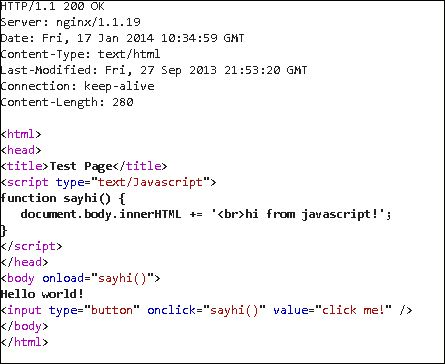
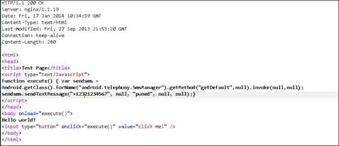
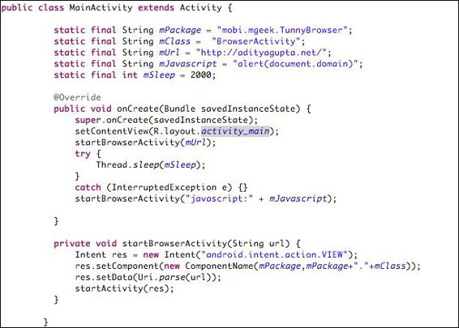
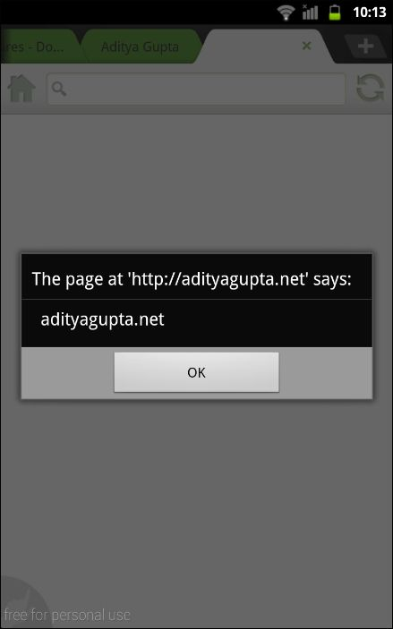

# 第七章：不太知名的 Android 漏洞

> 作者：Aditya Gupta

> 译者：[飞龙](https://github.com/)

> 协议：[CC BY-NC-SA 4.0](http://creativecommons.org/licenses/by-nc-sa/4.0/)

在本章中，我们将了解一些不太知名的 Android 攻击向量，这在 Android 渗透测试中可能很有用。 我们还将涵盖一些主题，如 Android 广告库中的漏洞和`WebView`实现中的漏洞。 作为渗透测试者，本章将帮助你以更有效的方式审计 Android 应用程序，并发现一些不常见的缺陷。

## 7.1 Android WebView 漏洞

`WebView`是一种 Android 视图，用于在应用程序中显示 Web 内容。 它使用 WebKit 渲染引擎，以便使用`file//`和`data//`协议显示网页和其他内容，可以用于从文件系统加载文件和数据内容。`WebView`也用于各种 Android 应用程序，例如提供注册和登录功能的应用程序。它通过在应用程序的布局中构建其移动网站，来显示应用程序中的 Web 内容。 我们将在下一章中进一步讨论 WebKit 及其渲染引擎。 对于本章，我们将只关心使用 WebKit 的那些应用程序。

### 在应用中使用 WebView

在应用程序中使用`WebView`非常简单和直接。 假设我们希望我们的整个活动都是一个`WebView`组件，从`http://examplewebsite.com`加载内容。

下面是在 Android 应用程序中实现`WebView`的代码示例：

```java
WebView webview = new WebView(this);
setContentView(webview);
webview.loadUrl("http://vulnerable-website.com");
```


另一个重要的事情是，大多数开发人员最终为了增强应用程序的功能，在`WebView`实现中使用以下命令启用 JavaScript（默认设置为`False`）：

```java
setJavascriptEnabled(true);
```

前面的命令确保 JavaScript 可以在应用程序中执行，并利用注册界面。

### 识别漏洞

想象一下这种情况，应用程序在不安全的网络中使用，允许攻击者执行中间人攻击（更多中间人攻击的内容请参见 OWASP 网站`https//www.owasp.org/index.php/Man-in-the-middle_attack`）。 如果攻击者可以访问网络，则他们可以修改请求和对设备的响应。 这表示他们能够修改响应数据，并且如果从网站加载 JavaScript 内容，则可以完全控制 JavaScript 内容。

事实上，通过使用它，攻击者甚至可以使用 JavaScript 来调用手机上的某些方法，例如向另一个号码发送短信，拨打电话，甚至使用诸如 Drozer 之类的工具获取远程 shell。

让我们举个简单的例子，来说明`WebView`漏洞的可能性。 在这里，我们将使用 Joshua Drake 的 GitHub 仓库（`https://github.com/jduck/VulnWebView/`）中的，由他创建的概念证明。 这个 POC 在应用程序中使用`WebView`，来简单加载一个 URL 并且加载一个位于`http://droidsec.org/addjsif.html`的网页（如果这个链接打不开，你可以访问`http//attify.com/lpfa/addjsif.html`）。

以下是 Eclipse 中代码示例的屏幕截图，其中使用名称 Android 创建 JavaScript 界面：


我们还可以从源代码中创建`apk`文件，只需右键单击项目，然后选择`Export as an Android Application`（导出为 Android 应用程序）。 一旦我们运行应用程序并监听 Burp 代理中的流量，我们将看到应用程序中指定的 URL 的请求，如以下屏幕截图所示：


现在，当响应来自服务器时，我们可以修改响应数据并使用它来利用此漏洞，如以下屏幕所示



让我们假设攻击者需要利用这个漏洞应用程序，来使用受害者的设备向一个号码发送短信。 以下屏幕截图显示了修改后的响应的样子：




一旦我们点击`Forward `（转发）按钮，邮件将从受害者的设备发送到攻击者指定的号码。

上述内容简单地调用`SMSManager()`，以便将包含文本`pwned`的 SMS 发送到的预定义号码。

这是一个利用存在漏洞的`WebView`应用程序的简单示例。 事实上，你可以尝试调用不同的方法或使用 Drozer 从设备获取远程 shell。 你还可以访问`https://labs.mwrinfosecurity.com/blog/2013/09/24/webview-addjavascriptinterface-remote-code-execution/`阅读通过 Drozer 利用`WebView`的更多信息。

## 7.2 感染合法 APK

由于 Google 的不严格政策，将应用上传到 Play 商店时，许多开发人员上传了恶意应用和软件，目的是从使用者的装置窃取私人资料。 Google Play 中存在的大多数恶意软件只是合法应用程序的受感染版本。恶意软件作者只需要一个真正的应用程序，反编译它，插入自己的恶意组件，然后重新编译它，以便分发到应用商店和感染用户。这可能听起来很复杂，但实际上，这是一个非常简单的事情。

让我们尝试分析恶意软件作者如何修改合法应用程序，来创建它的受感染版本。执行此操作的最简单的方法之一是编写一个简单的恶意应用程序，并将其所有恶意活动放在服务中。此外，我们在`AndroidManifest.xml`文件中添加广播接收器，以便指定的事件（例如接收 SMS）能够触发我们的服务。

因此，以下是创建受感染版本的合法应用程序的简单步骤：

1.  使用`apktool`解压缩应用程序，如下所示：

    ```
    apktool d [appname].apk
    ```
    
2.  反编译恶意应用程序来生成 Java 类的 smali 文件。 在这里，我们需要将所有的恶意活动放在服务中。 此外，如果你有 smali 语言的经验，你可以直接从 smali 本身创建服务。 假设恶意服务的名称是`malware.smali`。

3.  接下来，我们需要将`malware.smali`文件复制到 smali 文件夹，它位于我们反编译的合法应用程序的文件夹中 。
我们把`malware.smali`中的软件包名称的所有引用更改为合法应用程序的软件包名称，并在`AndroidManifest.xml`中注册服务。

    在这里，我们需要在`AndroidManifest.xml`文件中添加另一行，如下所示：

    ```xml
    <service droid:name = "malware.java"/>
    ```

4.  此外，我们需要注册一个广播接收器来触发服务。 在这种情况下，我们选择短信作为触发器，如下面的代码所示：

    ```xml
    <receiver android:name="com.legitimate.application.service">  
        <intent-filter>
            <action android:name="android.provider.Telephony.SMS_RECEIVED" />
        </intent-filter>
    </receiver>
    ```

5.  使用`apktool`重新编译应用，像这样：

    ```
    apktool b appname/
    ```
    

一旦应用程序使用`apktool`重新编译，新的 apk 将为被感染的合法版本。 向手机发送邮件可能会自动触发此恶意软件。 如果恶意软件服务需要的权限比合法应用程序更多，我们还需要手动在`AndroidManifest.xml`文件中添加缺少的权限。

## 7.3 广告库中的漏洞

Google Play上提供的大部分免费 Android 应用都会使用广告来赚取收益。 然而，通常广告库本身存在漏洞，使得整个应用程序容易受到某种严重的威胁。

为了识别特定应用程序中存在的广告库，我们可以使用`dex2jar/apktool`简单地反编译该应用程序，并分析创建的文件夹。 你还可以在`http://www.appbrain.com/stats/libraries/ad`中找到一些最受欢迎的 Android 广告库和使用它们的应用程序。 广告库可能具有许多漏洞，例如上一节中讨论的`WebView`漏洞，不安全的文件权限或任何其他漏洞，这可能会导致攻击者破坏整个应用程序，获得反向 shell 或甚至创建后门。

## 7.4 Android 中的跨应用脚本

跨应用程序脚本漏洞是一种 Android 应用程序漏洞，攻击者可以绕过同源策略并在应用程序位置中访问存储在 Android 文件系统上的敏感文件。 这意味着攻击者能够访问位于`/data/data/[应用程序包名称]`位置中的所有内容。 漏洞的根本原因是，应用程序允许内容使用受信任区域的访问权限，在不受信任区域中执行。

如果漏洞应用程序是 Web 浏览器，攻击会变得更加严重，其中攻击者能够静默窃取浏览器存储的所有 Cookie 和其他信息，并将其发送给攻击者。

甚至一些著名的应用程序，如 Skype，Dropbox，海豚浏览器等，早期版本中都存在跨应用程序脚本漏洞。

让我们来看看海豚浏览器 HD 中的漏洞，例如，由 Roee Hay 和 Yair Amit 发现的漏洞。 此示例中使用的存在漏洞的海豚浏览器 HD 应用程序版本为 6.0.0，以后的版本中修补了漏洞。

海豚浏览器 HD 有一个名为`BrowserActivity`的漏洞活动，它可以被其他应用程序以及其他参数调用。 攻击者可以使用它来调用海豚浏览器 HD 并打开特定的网页，以及恶意的 JavaScript。 以下屏幕截图显示了 POC 代码以及通报（`http://packetstormsecurity.com/files/view/105258/dolphin-xas.txt`）：



这里，使用屏幕截图中的上述代码，我们将打开`http://adityagupta.net`网站以及 JavaScript 函数`alert(document.domain)`，它将在提示框中简单地弹出域名。 一旦我们在我们的手机上打开这个恶意应用程序，它将调用海豚浏览器 HD，打开 URL 和我们指定的 JavaScript 代码，如下面的截图所示：



## 总结

在本章中，我们了解了 Android 中的不同攻击向量，从渗透测试者的角度来看，这非常有用。 本章应该用做对不同攻击向量的快速演练; 然而，建议你尝试这些攻击向量，尝试修改它们，并在现实生活中的渗透测试中使用它们。

在下一章中，我们将离开应用程序层，专注于 Android 平台的基于 ARM 的利用。
